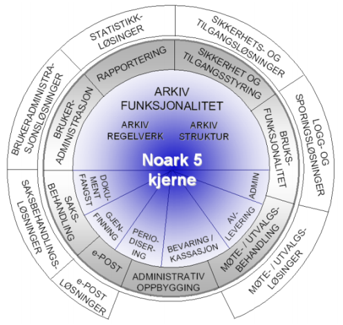
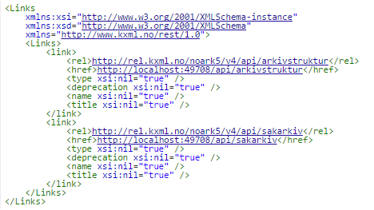
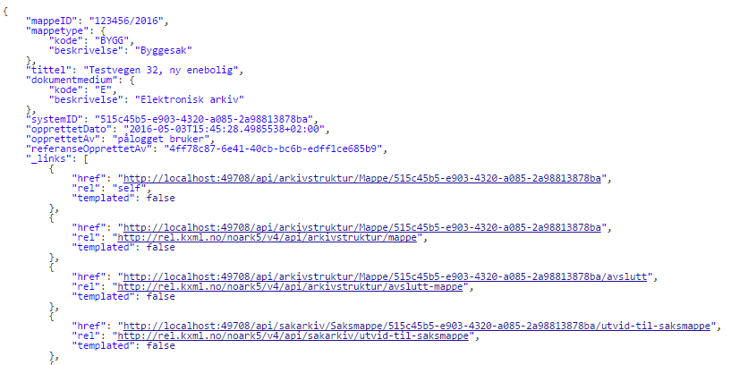
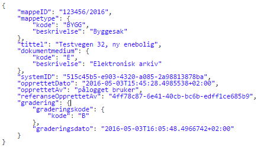
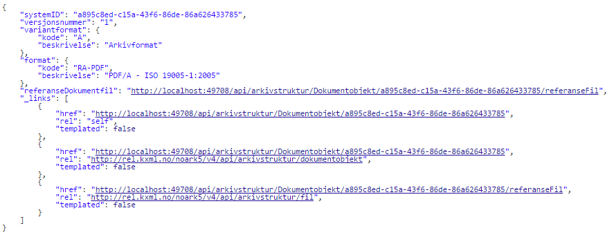

{width="7.5in" height="9.427083333333334in"}

Innhold {#innhold .ListParagraph .TOCHeading}
=======

1 Orientering og introduksjon 5

1.1 Historikk og status 5

1.2 Noark 5

1.3 Noark tjenestegrensesnitt 5

1.4 Prosjekt for Noark 5 tjenestegrensesnitt 5

1.5 Prosjektets hovedmål 5

1.6 Prosjektets organisering 6

1.7 Endringslogg 7

2 Normative referanser 8

3 Konformitet 9

4 Teknologi 9

4.1 Autentisering 9

5 Definisjoner 10

6 Konsepter og prinsipper 11

6.1 Utforming av tjenester 11

6.1.1 REST tjenestene 11

6.1.1.1 Oppkobling og ressurslenker 11

6.1.1.2 Finne objekter (Read) 13

6.1.1.3 Opprette objekter (Create) 16

6.1.1.4 Preutfylling av objekt 18

6.1.1.5 Oppdatere objekter (Update) 19

6.1.1.6 Oppdatere referanser mellom objekter 20

6.1.1.7 Slette objekter (Delete) 22

6.1.1.8 Overføringsformat 25

6.1.1.9 Hente og overføre filer 25

6.2 Validering av data 28

6.3 Identifikatorer 28

6.4 Utvidelsesmuligheter 28

7 Tjenester og informasjonsmodell 29

7.1 Om UML og notasjon som er benyttet 29

7.2 Noark5v4 32

7.2.1 Arkivstruktur 37

7.2.1.1 Arkiv 55

7.2.1.2 Arkivdel 63

7.2.1.3 Arkivenhet 75

7.2.1.4 Arkivskaper 80

7.2.1.5 Basisregistrering 82

7.2.1.6 Dokumentbeskrivelse 89

7.2.1.7 Dokumentobjekt 99

7.2.1.8 ElektroniskSignatur 107

7.2.1.9 Gradering 109

7.2.1.10 Hendelseslogg 112

7.2.1.11 Kassasjon 113

7.2.1.12 Klasse 115

7.2.1.13 Klassifikasjonssystem 121

7.2.1.14 Konvertering 125

7.2.1.15 Kryssreferanse 129

7.2.1.16 Mappe 131

7.2.1.17 Merknad 142

7.2.1.18 Registrering 145

7.2.1.19 Skjerming 149

7.2.1.20 Sletting 153

7.2.1.21 UtførtKassasjon 155

7.2.1.22 NasjonaleIdentifikatorer 157

7.2.2 Kodelister 165

7.2.2.1 Arkivdelstatus 166

7.2.2.2 Arkivstatus 167

7.2.2.3 Avskrivningsmåte 167

7.2.2.4 Dokumentmedium 168

7.2.2.5 Dokumentstatus 169

7.2.2.6 Dokumenttype 169

7.2.2.7 ElektroniskSignaturSikkerhetsnivå 170

7.2.2.8 ElektroniskSignaturVerifisert 171

7.2.2.9 FlytStatus 172

7.2.2.10 Format 172

7.2.2.11 Graderingskode 174

7.2.2.12 Hendelsetype 175

7.2.2.13 Journalposttype 175

7.2.2.14 Journalstatus 176

7.2.2.15 Kassasjonsvedtak 177

7.2.2.16 Klassifikasjonstype 178

7.2.2.17 Korrespondanseparttype 179

7.2.2.18 Land 179

7.2.2.19 Mappetype 180

7.2.2.20 Merknadstype 180

7.2.2.21 MøtedeltakerFunksjon 181

7.2.2.22 Møteregistreringsstatus 182

7.2.2.23 Møteregistreringstype 183

7.2.2.24 Møtesakstype 184

7.2.2.25 Postnummer 185

7.2.2.26 Presedensstatus 185

7.2.2.27 SakspartRolle 186

7.2.2.28 Saksstatus 186

7.2.2.29 SkjermingDokument 187

7.2.2.30 SkjermingMetadata 188

7.2.2.31 Slettingstype 189

7.2.2.32 SystemID 190

7.2.2.33 Tilgangskategori 191

7.2.2.34 Tilgangsrestriksjon 192

7.2.2.35 TilknyttetRegistreringSom 193

7.2.2.36 Variantformat 193

7.2.3 Sakarkiv 195

7.2.3.1 Avskrivning 203

7.2.3.2 Dokumentflyt 207

7.2.3.3 EnkelAdresse 211

7.2.3.4 Journalpost 212

7.2.3.5 Kontaktinformasjon 223

7.2.3.6 Korrespondansepart 223

7.2.3.7 KorrespondansepartEnhet 227

7.2.3.8 KorrespondansepartIntern 228

7.2.3.9 KorrespondansepartPerson 229

7.2.3.10 Presedens 230

7.2.3.11 Saksmappe 238

7.2.3.12 Sakspart 246

7.2.3.13 SakspartEnhet 249

7.2.3.14 SakspartPerson 250

7.2.4 Admin 252

7.2.4.1 AdministrativEnhet 253

7.2.4.2 Bruker 259

7.2.4.3 Tilgang 263

7.2.5 LoggingOgSporing 264

7.2.5.1 Endringslogg 265

8 Vedlegg 1 -- Konformitetskrav 267

9 Vedlegg 2 -- Objektkatalog 268

10 Vedlegg 3 -- Ressurser til REST API 269

Orientering og introduksjon
===========================

Historikk og status
-------------------

Noark
-----

 Noark -- Norsk arkivstandard -- ble utarbeidet som kravspesifikasjon
for elektroniske journalsystemer i statsforvaltningen, og etablerte seg
raskt som en de facto standard, forvaltet av Riksarkivet. Kommunal
sektor utarbeidet en tilsvarende kravspesifikasjon -- Koark.
Spesifikasjonene i Koark ble innlemmet i Noark-4, og da arkivforskriften
trådte i kraft ble det obligatorisk for offentlig forvaltning å benytte
et Noark-basert system for elektronisk journalføring.

Gjeldende standard -- Noark 5 skal benyttes for all elektronisk
arkivdanning -- også fagsystemer med saksbehandling.

Noark tjenestegrensesnitt
-------------------------

Teknisk grensesnitt mot kjernen er en del av standarden. Noark-4 Web
Services ble utarbeidet i 2006 etter initiativ fra KS, og som et
resultat av behov hos kommunene. Formålet var å standardisere og
forenkle kommunikasjonen mellom de ulike systemene i forvaltningen.

Statens Kartverk og KS gjennomførte i GeoIntegrasjonsprosjektet en
revisjon av Noark-4 Web Services. Tjenestene i Noark-4 Web services er
avgrenset ut fra behovene fagsystemene har for å arkivere og gjenfinne
data.

I nåværende form, og sett i lys av avgrensningene, mangler Noark
tjenestegrensesnittet funksjonalitet. Et utvidet standardisert
grensesnitt vil legge til rette for gode, sammenhengende tjenester på
tvers av virksomhetsgrensene i offentlig sektor. De ulike leverandørene
behøver ikke utvide tjenestene, eller benytte egne grensesnitt.

Prosjekt for Noark 5 tjenestegrensesnitt 
-----------------------------------------

Prosjekt for Noark 5 tjenestegrensesnitt ble satt i gang av Riksarkivet
og KS høsten 2013, og gjennomført i regi av KS KommIT. Blant
initiativtakere til prosjektet var også K10 -- det kommunale
it-samarbeidet for landets 10 største kommuner.

Målsettingen for prosjektet har vært, sammen med arkivleverandørene, å
utvide det standardiserte grensesnittet mot Noark 5 kjerne.
Grensesnittet skal være tjenestebasert og bygge på erfaringene fra Noark
-4 med tilhørende web services, GeoIntegrasjonsprosjektet og
arkivleverandørenes utvidelser.

Prosjektgruppen ble etablert i november 2013. Prosjektets arbeidsgruppe
ble satt ned i januar 2014 og arbeidet med versjon 0.9 av
tjenestegrensesnittet er avsluttet i oktober 2014.

Prosjektets hovedmål 
---------------------

Mandatet for prosjektet var\
- å etablere en plattformuavhengig informasjonsmodell i UML for
arkivstrukturen i Noark 5\
- å definere CRUD tjenester (Create, Read, Update, Delete) for objektene
i informasjonsmodellen

Mål og begrunnelse for prosjektet var videre

-   sammen med arkivleverandørindustrien å utvikle og levere et
    tjenestegrensesnitt for Noark 5 som implementeres som et krav i
    Noark-standarden, forvaltes av Riksarkivet og benyttes av
    fagløsninger uavhengig av leverandør. Prosjektet skal også levere et
    forslag til opplegg for test og godkjenning. Prosjektet skal videre
    bidra til å skape en arena der leverandørindustrien og bestillerne
    kan møtes og diskutere behov og utfordringer.

<!-- -->

-   Et standardisert Noark 5 tjenestegrensesnitt skal bidra til gode,
    sammenhengende digitale tjenester på tvers av virksomhetsgren­sene i
    offentlig sektor, støtte opp under offentlige virksomheters ønske om
    leverandøruavhengighet, samt fremme digitalisering og gi bedre
    tjenester.

Prosjektets organisering
------------------------

Prosjekteiere:\
Riksarkivet, KS, KMD og Kartverket

Styringsgruppe:\
SAMDOK sin strategigruppe Arkiv i e-forvaltning

Prosjektgruppen har bestått av:

Hans Fredrik Berg (Riksarkivet), Rune Sandland (KommIT), Michael Pande
Rolfsen (KommIT), Anne Mette Dørum (KS), Line Richardsen (KS), Tor
Kjetil Nilsen (KommIT/Arkitektum as), Per Arne Aass (Fredrikstad
kommune), Atle Løvstakken (Bergen Kommune). Prosjektleder Inger Berit
Eidsten (KommIT/EKOR AS).

Arbeidsgruppen har bestått av:

Fra prosjektgruppen\
Hans Fredrik Berg (Riksarkivet), Tor Kjetil Nilsen (KommIT), Rune
Sandland (KommIT) Inger Berit Eidsten (KommIT).

Fra leverandørene\
ACOS - Trygve Håland, Ciber - Antony Lærdahl / Kjetil Sahlberg, Evry -
Ragnar Sturtzel, Gecko - Haakon Johannessen / Steinar Herland,
Documaster - Christian Lundvang / Dimitar Ouzounov, Norconsult - Tor
Olav Almås, Oppad - Thor Arne Johnsen, Software Innovation - Bjørn Tore
Eriksen, Visma - Harry Myrene

Trondheim kommune: Jean-Philippe Caquet

Endringslogg
------------

+-----------------+-----------------+-----------------+-----------------+
| Versjon         | Dato            | Utført av       | Endring         |
+=================+=================+=================+=================+
| 0.9             | 26.08.2014      | Tor Kjetil      | Første versjon  |
|                 |                 | Nilsen          |                 |
+-----------------+-----------------+-----------------+-----------------+
| 0.9.1           | 09.10.2014      | Inger Berit     | Lagt inn        |
|                 |                 | Eidsten         | kapittel om     |
|                 |                 |                 | Orientering og  |
|                 |                 |                 | introduksjon    |
+-----------------+-----------------+-----------------+-----------------+
| 0.9.2           | 10.10.2014      | Tor Kjetil      | Flyttet         |
|                 |                 | Nilsen          | kapittel om     |
|                 |                 |                 | avgrensninger   |
|                 |                 |                 | og utvidelser   |
|                 |                 |                 | til Vedlegg 5   |
|                 |                 |                 | Endringslogg    |
|                 |                 |                 | fra NOARK 5     |
|                 |                 |                 | v3.1            |
+-----------------+-----------------+-----------------+-----------------+
| 0.9.3           | 30.10.2014      | Tor Kjetil      | Oppdatert fra   |
|                 |                 | Nilsen          | UML modell og   |
|                 |                 |                 | eksempler       |
+-----------------+-----------------+-----------------+-----------------+
| 0.9.4           | 06.11.2014      | Tor Kjetil      | Oppdatert bilde |
|                 |                 | Nilsen          | for oppdatering |
|                 |                 |                 | av mappe,       |
|                 |                 |                 | fjernet         |
|                 |                 |                 | kommentarer     |
+-----------------+-----------------+-----------------+-----------------+
| 0.9.5           | 06.05.2015      | Tor Kjetil      | Overskriftsnumm |
|                 |                 | Nilsen          | erering,        |
|                 |                 |                 | fjernet SOAP    |
|                 |                 |                 | webservice,     |
|                 |                 |                 | gått tilbake på |
|                 |                 |                 | relasjon til    |
|                 |                 |                 | sakspart og     |
|                 |                 |                 | korrespondansep |
|                 |                 |                 | art             |
+-----------------+-----------------+-----------------+-----------------+
| 0.9.6           | 08.07.2015      | Tor Kjetil      | Oppdatert etter |
|                 |                 | Nilsen          | konklusjoner på |
|                 |                 |                 | intern høring   |
+-----------------+-----------------+-----------------+-----------------+
| 0.9.7           | 14.01.2016      | Tor Kjetil      | Oppdatert etter |
|                 |                 | Nilsen          | konklusjoner på |
|                 |                 |                 | høringskommenta |
|                 |                 |                 | rer             |
+-----------------+-----------------+-----------------+-----------------+
| 0.9.8           | 03.05.2016      | Tor Kjetil      | Oppdatert etter |
|                 |                 | Nilsen          | konklusjoner på |
|                 |                 |                 | høringskommenta |
|                 |                 |                 | rer             |
+-----------------+-----------------+-----------------+-----------------+
| 0.9.8.1         | 31.05.2016      | Tor Kjetil      | Oppdatert med   |
|                 |                 | Nilsen          | flere           |
|                 |                 |                 | filtereksempler |
|                 |                 |                 | ,               |
|                 |                 |                 | kapittel for    |
|                 |                 |                 |                 |
|                 |                 |                 | filopplasting   |
|                 |                 |                 | og              |
|                 |                 |                 | feilrettinger   |
+-----------------+-----------------+-----------------+-----------------+
| 1.0 beta        | 01.07.2016      | Tor Kjetil      | Oppdatert etter |
|                 |                 | Nilsen          | avklaringsmøter |
|                 |                 |                 | -- overlevering |
|                 |                 |                 | fra SAMDOK til  |
|                 |                 |                 | Arkivverket     |
+-----------------+-----------------+-----------------+-----------------+

Normative referanser 
=====================

For den fulle forståelse av denne standarden bør en ha god kjennskap til
referansene under.

Norsk Arkivstandard(NOARK) 5 versjon 3.1\
<https://arkivverket.no/arkivverket/Offentleg-forvalting/Noark/Noark-5/Standarden>

Unified Modeling Language(UML) versjon 2 -  er en industristandard for
datarelatert modellering, forvaltet av et internasjonalt konsortium
[Object Management
Group](http://no.wikipedia.org/wiki/Object_Management_Group) (OMG) -
<http://www.omg.org/spec/UML/>

Webtjenester med REST/HATEOAS -
<https://tools.ietf.org/html/draft-kelly-json-hal-07>

Konformitet
===========

Bakgrunnen for konformitetsnivåene er behovet for å kunne gruppere krav
i NOARK standarden med aktuell modularitet i system som skal anskaffes.
Det vil også gjøre det enklere for leverandører å få godkjenning for
sine implementasjoner.

Anskaffelser av arkivkjerner kan tilpasses aktuelle konformitetsnivå.

Anskaffelser av fagsystem bør opplyse om hvilket nivå som tilbys av
arkivkjerne, og fagsystem som integrerer seg med arkivkjerne bør opplyse
om hvilke nivå de krever for å kunne operere på aktuell kjerne.

De grunnleggende krav er lagt i basiskrav og arkivstruktur og må støttes
av alle kjerner. Utvidelser skjer med egne moduler som er delt mellom
obligatoriske og valgfrie krav. Valgfrie krav må spesifiseres
særskilt.{width="2.2528860454943134in"
height="2.1360094050743657in"}

Konformitetsnivåer er:

-   Nivå 0 -- Basiskrav

-   Nivå 1 -- Arkivstruktur - obligatoriske krav

-   Nivå 1.1 -- Arkivstruktur - valgfrie krav

-   Nivå 2a -- Sakarkiv -- obligatoriske krav

-   Nivå 2.1a -- Sakarkiv - valgfrie krav

For å være konform med standarden på aktuelle nivå må implementasjonen
støtte alle obligatoriske krav som er angitt for nivået.

Se [Vedlegg 1](#vedlegg-1-konformitetskrav) for liste over tester og
krav som gjelder for de ulike nivåene.

Teknologi
=========

Prosjektet ble startet med et mål om å lage webservice grensesnitt for
NOARK kjernen. Tidlig i prosjektet ble det ytret ønske fra
arbeidsgruppen om å støtte nyere type tjenestegrensesnitt, og etter en
vurdering i KommIT ble REST (Representational State Transfer) valgt med
et tilnærmet HATEOAS (Hypermedia as the Engine og Application State)
format og oData for filtrering. Det ble innhentet informasjon om beste
praksis og kommentarer fra Statens Vegvesen, Difi og Brønnøysund/Altinn
i forbindelse med REST.

Autentisering
-------------

NOARK5 kjerne må ha metoder for å autentisere brukere og gi de riktige
tilganger til kjernen.

Single Sign On bør støttes.

For REST er Basic autentication minimum for autentisering og en bør
støtte SAML 2.0 og OpenID Connect.

Definisjoner
============

NOARK -- Norsk Arkivstandard

UML -- Unified Modeling Language

REST -- Representational State Transfer

SAML -- Security Assertion Markup Language

oData - Open Data Protocol

CRUD -- forkortelse for Create, Read, Update, Delete

eTag -- entity tag

HATEOAS -- Hypermedia as the Engine of Application State

Konsepter og prinsipper
=======================

Utforming av tjenester
----------------------

Mandatet til prosjektgruppen var å etablere CRUD tjenester (Create,
Read, Update, Delete) for NOARK5 standarden. Både tjenestene og
datastrukturer er modellert i UML.

De aller fleste objekter i NOARK trenger operasjoner/tjenester for å
opprette objekt, finne objekter, oppdatere objekter og i noen spesielle
tilfeller slette objekter. I noen av kravene i NOARK er det også
beskrevet egne tjenester som skal kunne utføres.

Det er valgt å spesifisere REST for tjenestene. Prinsippene og eksempler
følger under, og ytterligere detaljer kan en finne i vedlegg 3.

### REST tjenestene

For REST er HATEOAS prinsipper fulgt slik at en klient skal fra en hoved
url kunne navigere og oppdage selv alle mulig tjenester som kjernen
tilbyr.

Dette gjøres med ressurslenker og relasjonslenker som inneholder
beskrivelse av ressursen med eksempler på forespørsler, resultat og
statuskoder.

{width="2.21875in" height="1.6458333333333333in"}

Under følger eksempler fra tjenestene.

#### Oppkobling og ressurslenker

Oppkobling skjer mot en hoved url og er den eneste ressursen klienten
trenger å vite for å starte interaksjon. Resten av endepunkter oppdages
av klienten via relasjonsnøkler som beskriver hva ressursen kan brukes
til.

**Request**

GET <http://localhost:49708/api>

Accept: application/vnd.noark5-v4+json

**Response**

Content-Type: application/vnd.noark5-v4+json

{width="4.645833333333333in"
height="1.5416666666666667in"}

Eksempelet viser at denne arkivkjernen støtter arkivstruktur
(http://rel.kxml.no/noark5/v4/api/arkivstruktur) og sakarkiv
(<http://rel.kxml.no/noark5/v4/api/sakarkiv>). Ved å følge Href til
disse relasjonsnøkler vil tilgjengelige ressurser innen disse områder
annonseres på samme måte.

**Resultatkoder**

+------------+------------------------------------+------+
| Statuskode | Beskrivelse                        |      |
+============+====================================+======+
| 200        | OK                                 |      |
+------------+------------------------------------+------+
| 400        | BadRequest - ugyldig forespørsel   |   -- |
|            |                                    |   -- |
+------------+------------------------------------+------+
| 403        | Forbidden - ingen tilgang          |   -- |
|            |                                    |   -- |
+------------+------------------------------------+------+
| 404        | NotFound - ikke funnet             |   -- |
|            |                                    |   -- |
+------------+------------------------------------+------+
| 501        | NotImplemented - ikke implementert |      |
+------------+------------------------------------+------+

Alternativt som XML

**Request**

GET <http://localhost:49708/api>

Accept: application/vnd.noark5-v4+xml

**Response**

Content-Type: application/vnd.noark5-v4+xml

{width="4.875in" height="2.7395833333333335in"}

­­­«href» kan være hva som helst og trenger ikke følge noe fast mønster
for oppbygning av url. Mens «rel»(relasjonsnøkkelen) har faste verdier
som beskriver hva ressursen kan brukes til. Denne kan klienten også åpne
for å vise beskrivelse, eksempel på bruk, statuskoder og annet som er
relevant for denne relasjonsnøkkelen.

**Relasjonsnøkler på rotnivå**

  Relasjonsnøkkel (rel)                            Beskrivelse
  ------------------------------------------------ --------------------------------------------------------
  http://rel.kxml.no/noark5/v4/api/arkivstruktur   Arkivkjerne støtter konformitetsnivå 1 arkivstruktur
  http://rel.kxml.no/noark5/v4/api/sakarkiv        Arkivkjerne støtter konformitetsnivå for sakarkiv (2a)

Relasjonsnøkler under de forskjellige konformitetsnivå listes ut i
kapittel 7 sammen med beskrivelse av klasser.

**Spesielle** **relasjonsnøkler**

  Relasjonsnøkkel (rel)   Beskrivelse
  ----------------------- ----------------------------------------------------------------------------------
  self                    Brukes for å identifisere en ressurs, og kan brukes til oppdatering og sletting.
  next                    Brukes for å angi neste side ved serverstyrt resultatoppdeling

Ressurser bør kun gjøres tilgjengelig i API når pålogget bruker har
tilgang til disse. Hvis en bruker ikke har tilgang til å avslutte en
mappe så bør ikke relasjonsnøkkel for dette annonseres i API for å gjøre
det lettere å navigere til aktuelle funksjoner.

#### Finne objekter (Read)

For filter skal syntaks fra oData standarden
(<http://docs.oasis-open.org/odata/odata/v4.0/os/part2-url-conventions/odata-v4.0-os-part2-url-conventions.html#_Toc372793790>
) benyttes. De ressurser som støtter filter skal annonserer dette under
\_links med «templated=true» og parametre som kan brukes til dette i
«href». Typiske parametre er \$filter, \$top, \$skip og \$orderby. Alle
lister med data bør støtte søk og filtrering.

{width="6.3in" height="1.25625in"}

Figur 1 anonsering av templated link for søk etter arkiv

Filter parametre som skal støttes er:

-   \$filter

-   \$top

-   \$skip

-   \$search

-   \$orderby

**Nivå på filter**

-   Nivå basis (påkrevd):

    -   Filter på direkte felter.

    -   Filter på en-til-en gruppe relasjoner (blant annet kodelister)

-   Nivå utvidet:

    -   Filter på en-til-mange relasjoner (vha. \'any\' og \'all\' odata
        funksjonene)

**Filtrering**

Filtrering støttes med \$filter parameter.

  Operasjon              Syntaks                         Eksempel
  ---------------------- ------------------------------- ----------------------------------------------------------------------------------------------------------------------------------------------------------------------------------
  Begynner med           startsWith(feltnavn, 'tekst')   [\.../mapper?\$filter=startsWitth(tittel, \'test\'](http://n5test.kxml.no/api/arkivstruktur/Arkivdel/1235/mappe?$top=2&$filter=tittel%20eq%20%E2%80%98testmappe%E2%80%99))
  Er lik                 Feltnavn eq verdi               \.../arkiv?\$filter=systemID eq \'123456789\'
  Inneholder             contains(feltnavn, 'tekst')     [../arkivdel/1235/mappe?\$filter=contains(tittel, 'test')](http://n5test.kxml.no/api/arkivstruktur/Arkivdel/1235/mappe?$top=2&$filter=tittel%20eq%20%E2%80%98testmappe%E2%80%99)
  Større enn             Feltnavn gt verdi               ../arkivstruktur/registrering/?\$filter=year(oppdatertDato) gt 2012
  Mindre enn             Feltnavn lt verdi               ../arkivstruktur/registrering/?\$filter=year(oppdatertDato) lt 2014
  Større enn eller lik   Feltnavn ge verdi               ../arkivstruktur/registrering/?\$filter=year(oppdatertDato) ge 2012
  Mindre enn eller lik   Feltnavn le verdi               ../arkivstruktur/registrering/?\$filter=year(oppdatertDato) le 2014
  Og                     Uttrykk and uttrykk             ../arkivstruktur/registrering/?\$filter=year(oppdatertDato) gt 2012 and year(oppdatertDato) lt 2014
  Eller                  Uttrykk or uttrykk              ../arkivstruktur/registrering/?\$filter=year(oppdatertDato) gt 2012 or year(oppdatertDato) lt 2014

**Filter eksempler**

  Eksempel                                                                                                                                                                                                                             Forklaring                                                                                                 Nivå
  ------------------------------------------------------------------------------------------------------------------------------------------------------------------------------------------------------------------------------------ ---------------------------------------------------------------------------------------------------------- ---------
  [../1235/mappe?\$top=2&\$filter=tittel eq \'testmappe\'](http://n5test.kxml.no/api/arkivstruktur/Arkivdel/1235/mappe?$top=2&$filter=tittel%20eq%20%E2%80%98testmappe%E2%80%99)                                                       De to første mapper med tittel testmappe                                                                   basis
  ../arkivstruktur/arkiv?\$search=\'test\'                                                                                                                                                                                             Arkiv som inneholder test -- implementasjonen kan tolke selv hva som skal søkes mot av felter og innhold   basis
  ../arkivstruktur/mappe/?\$filter=gradering/graderingskode/kode eq \'B\'                                                                                                                                                              Mapper med graderingskode B                                                                                basis
  ../arkivstruktur/mappe/?\$expand=merknad&\$filter=merknad/any(m: m/merknadstype/kode eq \'B\')                                                                                                                                       Mapper med merknader som har merknadstype B                                                                utvidet
  [../arkivdel/1235/mappe?\$top=2&\$filter=contains('testmappe', tittel) eq true](http://n5test.kxml.no/api/arkivstruktur/Arkivdel/1235/mappe?$top=2&$filter=tittel%20eq%20%E2%80%98testmappe%E2%80%99) \$orderby=oppdatertDato desc   De to første mapper hvor testmappe er en del av tittel sortert synkende på oppdatertDato                   basis
  ../api/arkivstruktur/Mappe?\$filter=klasse/klasseID eq \'12/2\' and klasse/klassifikasjonssystem/klassifikasjonstype/kode eq \'GBNR\'                                                                                                Mappe med klassering på eiendom                                                                            utvidet
  ../api/arkivstruktur/Mappe?\$filter=klasse/klasseID eq \'12345678901\' and klasse/klassifikasjonssystem/klassifikasjonstype/kode eq \'PNR\'                                                                                          Mappe med klassering på fødselsnr                                                                          utvidet
  ../api/arkivstruktur/Mappe?\$filter=klasse/klasseID eq \'123456789\' and klasse/klassifikasjonssystem/klassifikasjonstype/kode eq \'ORG\'                                                                                            Mappe med klassering på organisasjonsnr                                                                    utvidet
  ../api/sakarkiv/Saksmappe/?\$filter=sakspart/any(s:s/Default.SakspartPersonType/foedselsnummer eq \'12334566\')                                                                                                                      Saksmapper med sakspart(SakspartPerson) med gitt fødselsnr                                                 utvidet
  ../api/sakarkiv/Saksmappe/?\$filter=sakspart/any(s:s/Default.SakspartEnhetType/organisasjonsnummer eq \'12334566\')                                                                                                                  Sakspart med organisasjonsnr                                                                               utvidet
  ..api/sakarkiv/journalpost/?\$filter=korrespondansepart/any(s:s/Default.KorrespondansepartPersonType/foedselsnummer eq \'12334566\')                                                                                                 Korrespondansepart med fødselsnummer                                                                       utvidet
  ..api/arkivstruktur/mappe/?\$filter=nasjonalidentifikator/any(i: i/Default.BygningType/byggidentifikator/bygningsNummer eq \'12345678\')                                                                                             Nasjonal identifikator med bygningsnr                                                                      utvidet

**Søk**

\$search brukes for generelt søk. Arkivkjernen bestemmer hvordan denne
er implementert med hensyn på hvilke felter den inkluderer i søk og om
for eksempel innhold i dokumenter er med.

**Sortering**

\$orderby brukes for å angi sortering av resultat etter gitte felter.

**Resultatoppdeling (Paginering)**

På klientsiden kan \$top og \$skip brukes sammen for å angi hvilken side
av søkeresultatet en ønsker returnert. \$top gir antallet som skal
returneres, og \$skip gir antallet en skal hoppe over og ikke inkludere
i resultatet.

Serverstyrt resultatoppdeling kan settes av arkivkjernen med PageSize.
Pagesize setter max antall som kan returneres fra arkivkjerne og kjerne
må returnere en next link som gir neste siden.

**Filter på underobjekter**

Any eller All brukes for å filtrere på navigerbare objekter. Det kan
være begrensninger på hvor mange nivå/dybde en arkivkjerne støtter.

**Resultat med underobjekter**

\$expand brukes for å inkludere underobjekter i resultat. Det kan være
begrensninger på hvor mange nivå en arkivkjerne støtter. Som standard
skal ikke underobjekter returneres hvis dette ikke spesifiseres med
\$expand. Hvor mange nivåer som støttes settes opp i kjernen med
MaxExpansionDepth.

**Filter og tilgangsstyring**

Ved søk skal arkivkjernen ta hensyn til tilgangsrettigheter slik at
brukere ikke får uautorisert tilgang til informasjon. Er informasjonen
unntatt offentlighet, skjermet eller gradert så skal ikke uautoriserte
brukere få tilgang til dette. Dette kan bety at en bruker har lov til å
registrere et objekt, men ikke rettigheter til å vise dette etterpå.

Resultatkoder ved navigering/søk

+------------+------------------------------------------------+------+
| Statuskode | Beskrivelse                                    |      |
+============+================================================+======+
| 200        | OK                                             |      |
+------------+------------------------------------------------+------+
| 400        | BadRequest - ugyldig forespørsel               |   -- |
|            |                                                |   -- |
+------------+------------------------------------------------+------+
| 403        | Forbidden - ingen tilgang                      |   -- |
|            |                                                |   -- |
+------------+------------------------------------------------+------+
| 404        | NotFound - ikke funnet                         |   -- |
|            |                                                |   -- |
+------------+------------------------------------------------+------+
| 500        | InternalServerError -- generell feil på server |      |
+------------+------------------------------------------------+------+
| 501        | NotImplemented - ikke implementert             |      |
+------------+------------------------------------------------+------+

#### Opprette objekter (Create)

For å opprette objekter må først ressurslenke finnes basert på
relasjonsnøkkel.

For eksempel kan en opprette mapper på arkivdel, og da vil \_Links under
en arkivdel inneholde relasjonsnøkkelen
rel=»<http://rel.kxml.no/noark5/v4/api/arkivstruktur/ny-mappe/>» om
bruker har lov til å opprette mapper på denne arkivdelen. Den aktuelle
ressurslenke kan være
<http://n5test.kxml.no/api/arkivstruktur/Arkivdel/12345/ny-mappe>. Denne
kan brukes til både GET og POST forespørsel.

GET forespørselen forhåndsutfyller en lovlig objektstruktur og gir
relasjonslenker til aktuelle kodelister.

{width="6.3in" height="2.4618055555555554in"}

Klienten sender en POST forespørsel med en lovlig objektstruktur til
gitt url. Responsen gir statuskode 201 Created om objektet ble opprettet
korrekt og komplett objekt samt location header for lese eller endre
url.

POST til
<http://n5test.kxml.no/api/arkivstruktur/Arkivdel/12345/ny-mappe>

Content-Type: application/vnd.noark5-v4+json

{width="3.0625in" height="1.5104166666666667in"}

**Resultat**

201 Opprettet

Location →

http://localhost:49708/api/arkivstruktur/Mappe/a043d07b-9641-44ad-85d8-056730bc89c8

{width="6.3in" height="3.1458333333333335in"}

Figur 2 respons fra opprett mappe (eksempel avkortet for liste over
links)

Resultatkoder ved oppretting av objekt

+------------+------------------------------------------------+------+
| Statuskode | Beskrivelse                                    |      |
+============+================================================+======+
| 200        | OK                                             |      |
+------------+------------------------------------------------+------+
| 201        | Created - opprettet                            |      |
+------------+------------------------------------------------+------+
| 400        | BadRequest - ugyldig forespørsel               |   -- |
|            |                                                |   -- |
+------------+------------------------------------------------+------+
| 403        | Forbidden - ingen tilgang                      |   -- |
|            |                                                |   -- |
+------------+------------------------------------------------+------+
| 404        | NotFound - ikke funnet                         |   -- |
|            |                                                |   -- |
+------------+------------------------------------------------+------+
| 409        | Conflict -- objektet kan være endret av andre  |      |
+------------+------------------------------------------------+------+
| 500        | InternalServerError -- generell feil på server |      |
+------------+------------------------------------------------+------+
| 501        | NotImplemented - ikke implementert             |      |
+------------+------------------------------------------------+------+

Heleide objekter(komposisjoner) kan opprettes sammen med hovedobjektet
og inngår i dens lovlige objektstruktur. For eksempel merknad på en
mappe kan registreres sammen med registreringen av mappe.

#### Preutfylling av objekt

Ved å bruke GET på for eksempel ny-mappe
(<http://rel.kxml.no/noark5/v4/api/arkivstruktur/ny-mappe/>) så kan
arkivkjerne preutfylle og foreslå vanlige data for et objekt basert på
pålogget bruker samt annonsere hvor diverse lovlige koder kan hentes fra
slik som mappetype og dokumentmedium.

{width="6.3in" height="2.4618055555555554in"}

#### Oppdatere objekter (Update)

Alle ressurser kan med sin relasjonslenke rel=»self» og ressurslenke
(href) benytte denne til oppdatering.

For oppdatering sender klienten en PUT forespørsel med alle data for en
lovlig objektstruktur. Alle egenskaper må være med, med unntak av
underobjekter som har en mange relasjon (0..\* eller 1..\*) i
oppdatering av et objekt. Underobjekter må oppdateres separat med sine
resurslenker.

PUT til
http://n5test.kxml.no/api/arkivstruktur/Mappe/a043d07b-9641-44ad-85d8-056730bc89c8

Content-Type: application/vnd.noark5-v4+json

{width="4.697916666666667in"
height="2.6666666666666665in"}

**Resultat**

200 OK

Location →

http://localhost:49708/api/arkivstruktur/Mappe/a043d07b-9641-44ad-85d8-056730bc89c8

{width="6.3in" height="3.901388888888889in"}

Figur 3 respons fra oppdatering av mappe med graderingsinformasjon
(eksempel avkortet ved links liste)

Resultatkoder ved oppdatering av objekt

+------------+------------------------------------------------+------+
| Statuskode | Beskrivelse                                    |      |
+============+================================================+======+
| 200        | OK                                             |      |
+------------+------------------------------------------------+------+
| 400        | BadRequest - ugyldig forespørsel               |   -- |
|            |                                                |   -- |
+------------+------------------------------------------------+------+
| 403        | Forbidden - ingen tilgang                      |   -- |
|            |                                                |   -- |
+------------+------------------------------------------------+------+
| 404        | NotFound - ikke funnet                         |   -- |
|            |                                                |   -- |
+------------+------------------------------------------------+------+
| 409        | Conflict -- objektet kan være endret av andre  |      |
+------------+------------------------------------------------+------+
| 500        | InternalServerError -- generell feil på server |      |
+------------+------------------------------------------------+------+
| 501        | NotImplemented - ikke implementert             |      |
+------------+------------------------------------------------+------+
|            |                                                |      |
+------------+------------------------------------------------+------+

#### Oppdatere referanser mellom objekter

Relasjoner kan angis ved tildelte attributter eller via plassering på
gitt url. For eksempel ny mappe knyttes til arkivdel ved at url til ny
mappe også inneholder hvilke arkivdel denne skal opprettes på. Egne
attributter kan for eksempel være referanseForeldremappe for å lage
undermapper.

Mer generelt kan klienter benytte href for rel=self for aktuelle
objekter sammen med \$ref parameter for å slette, endre eller opprette
referanser mellom objekter.

**For å opprette ny referanse**

POST
http://localhost:49708/api/arkivstruktur/registrering/cf8e1d0d-e94d-4d07-b5ed-46ba2df0465e/dokumentbeskrivelse/\$ref?\$id=http://localhost:49708/api/arkivstruktur/Dokumentbeskrivelse/1fa94a89-3550-470b-a220-92dd4d709044

Resultatkode 204 -- noContent

Her opprettes ny referanse mellom registrering og dokumentbeskrivelse.

**For å oppdatere/flytte referanse**

PUT
http://localhost:49708/api/arkivstruktur/registrering/cf8e1d0d-e94d-4d07-b5ed-46ba2df0465e/dokumentbeskrivelse/\$ref?\$id=http://localhost:49708/api/arkivstruktur/Dokumentbeskrivelse/1fa94a89-3550-470b-a220-92dd4d709044

Body:

http://localhost:49708/api/arkivstruktur/Dokumentbeskrivelse/092e497a-a528-4121-8f22-fbc78fa6c930

Resultatkode 200 -- OK

Her flyttes registreringen fra en dokumentbeskrivelse til en annen.

**For å slette en referanse**

DELETE
http://localhost:49708/api/arkivstruktur/registrering/cf8e1d0d-e94d-4d07-b5ed-46ba2df0465e/dokumentbeskrivelse/\$ref?\$id=http://localhost:49708/api/arkivstruktur/Dokumentbeskrivelse/092e497a-a528-4121-8f22-fbc78fa6c930

Resultatkode 204 -- noContent

Her slettes referansen til dokumentbeskrivelse fra registrering.

Resultatkoder ved oppdatering av referanser til objekt

+------------+------------------------------------------------+------+
| Statuskode | Beskrivelse                                    |      |
+============+================================================+======+
| 200        | OK                                             |      |
+------------+------------------------------------------------+------+
| 204        | NoContent                                      |      |
+------------+------------------------------------------------+------+
| 400        | BadRequest - ugyldig forespørsel               |   -- |
|            |                                                |   -- |
+------------+------------------------------------------------+------+
| 403        | Forbidden - ingen tilgang                      |   -- |
|            |                                                |   -- |
+------------+------------------------------------------------+------+
| 404        | NotFound - ikke funnet                         |   -- |
|            |                                                |   -- |
+------------+------------------------------------------------+------+
| 409        | Conflict - objektet kan være endret av andre   |   -- |
|            |                                                |   -- |
+------------+------------------------------------------------+------+
| 500        | InternalServerError -- generell feil på server |      |
+------------+------------------------------------------------+------+
| 501        | NotImplemented - ikke implementert             |      |
+------------+------------------------------------------------+------+

#### Slette objekter (Delete)

Klienten sender en DELETE forespørsel på aktuell ressurs(url). Alle
ressurslenker med rel=»self» kan potensielt slettes om bruker har
nødvendige rettigheter. Respons gir statuskode 204 om ressursen er
korrekt slettet.

Et viktig krav i Noark 5 er at arkiverte elektroniske dokumenter ikke
skal kunne slettes. Kontrollert sletting skal bare kunne foretas av
autoriserte brukere i forbindelse med kassasjon

Sletting av Arkivdel -- Kan også gjøres med oppdatering av arkivdel hvor
det legges inn informasjon om sletting.

Sletting av Dokumentbeskrivelse -- her er flere type sletting så må
gjøres med oppdatering?

De som ikke har sletting datatype, hvordan skal de merkes/fjernes?Krav
om logging nok?Skal ikke være mulig å slette uansett hvor mye
rettigheter en bruker har? -- Arkivverket må avklare dette

{width="4.822916666666667in" height="6.40625in"}

Resultatkoder ved sletting av objekt

+------------+------------------------------------------------+------+
| Statuskode | Beskrivelse                                    |      |
+============+================================================+======+
| 200        | OK                                             |      |
+------------+------------------------------------------------+------+
| 204        | NoContent -- slettet ok                        |      |
+------------+------------------------------------------------+------+
| 400        | BadRequest - ugyldig forespørsel               |   -- |
|            |                                                |   -- |
+------------+------------------------------------------------+------+
| 403        | Forbidden - ingen tilgang                      |   -- |
|            |                                                |   -- |
+------------+------------------------------------------------+------+
| 404        | NotFound - ikke funnet                         |   -- |
|            |                                                |   -- |
+------------+------------------------------------------------+------+
| 409        | Conflict - objektet kan være endret av andre   |   -- |
|            |                                                |   -- |
+------------+------------------------------------------------+------+
| 500        | InternalServerError -- generell feil på server |      |
+------------+------------------------------------------------+------+
| 501        | NotImplemented - ikke implementert             |      |
+------------+------------------------------------------------+------+

#### Overføringsformat

Innholdstyper(Content-Type) som skal brukes:

  Innholdstype (Content-Type)
  --------------------------------
  application/vnd.noark5-v4+json
  application/vnd.noark5-v4+xml

Overføringsformat skal være i henhold til følgende skjema for begge
innholdstyper:

-   http://skjema.kxml.no/arkivverket/noark5/v4.0/

Datoformat skal være angitt ihht <http://www.w3.org/TR/NOTE-datetime>

#### Hente og overføre filer

Ved navigering til dokumentobjekt så kan selve filen også åpnes ved å
følge referanseDokumentfil eller href til relasjonsnøkkel
http://rel.kxml.no/noark5/v4/arkivstruktur/fil

GET
<http://localhost:49708/api/arkivstruktur/Dokumentobjekt/a895c8ed-c15a-43f6-86de-86a626433785>

{width="6.3in" height="2.4145833333333333in"}

GET
<http://localhost:49708/api/arkivstruktur/Dokumentobjekt/a895c8ed-c15a-43f6-86de-86a626433785/referanseFil>

Gir Content-type=filens mime type feks "application/pdf" og filen
streames til klient

For å overføre en ny fil brukes POST til href til
rel=http://rel.kxml.no/noark5/v4/api/arkivstruktur/fil med header for
content-type og content-length.

> POST
> <http://localhost:49708/api/arkivstruktur/Dokumentobjekt/a895c8ed-c15a-43f6-86de-86a626433785/referanseFil>\
> Content-Type: application/pdf\
> Content-Length:111111
>
> Pdf data

For store filer(over 150MB) så kan filen overføres i bolker.

Ved å sette Content-Length til 0 på en POST til href til
rel=http://rel.kxml.no/noark5/v4/api/arkivstruktur/fil skal responsen
inneholde location header til en sesjonsuri som brukes med PUT for å
overføre bolker av filen. Header X-Upload-Content-Type og
X-Upload-Content-Length kan brukes i POST for å angi mimetype og total
størrelse på fila som skal overføres.

> POST
> <http://localhost:49708/api/arkivstruktur/Dokumentobjekt/a895c8ed-c15a-43f6-86de-86a626433785/referanseFil>\
> Content-Length:0\
> X-Upload-Content-Type: image/jpeg\
> X-Upload-Content-Length: 2000000

Respons: 200 OK

> Location:
> <http://localhost:49708/api/arkivstruktur/Dokumentobjekt/a895c8ed-c15a-43f6-86de-86a626433785/referanseFil?filsesjon=abc1234567>

Neste punkt er å overføre første bolk av filen.

> PUT
> <http://localhost:49708/api/arkivstruktur/Dokumentobjekt/a895c8ed-c15a-43f6-86de-86a626433785/referanseFil?filsesjon=abc1234567>\
> Content-Length: 524288\
> Content-Type: image/jpeg\
> Content-Range: bytes 0-524287/2000000
>
> Respons: 200 OK
>
> Location:
> <http://localhost:49708/api/arkivstruktur/Dokumentobjekt/a895c8ed-c15a-43f6-86de-86a626433785/referanseFil?filsesjon=abc1234567>\
> Range: bytes=0-524287

Ved neste bolk av filen så brukes øvre verdi av Range header for å
starte neste overføring.

Når siste overføring er gjort så returneres statuskode 201 Created.

Resultatkoder for opplasting av filer

+------------+------------------------------------------------+------+
| Statuskode | Beskrivelse                                    |      |
+============+================================================+======+
| 200        | OK                                             |      |
+------------+------------------------------------------------+------+
| 201        | Created - opprettet                            |      |
+------------+------------------------------------------------+------+
| 204        | NoContent -- slettet ok                        |      |
+------------+------------------------------------------------+------+
| 400        | BadRequest - ugyldig forespørsel               |   -- |
|            |                                                |   -- |
+------------+------------------------------------------------+------+
| 403        | Forbidden - ingen tilgang                      |   -- |
|            |                                                |   -- |
+------------+------------------------------------------------+------+
| 404        | NotFound - ikke funnet                         |   -- |
|            |                                                |   -- |
+------------+------------------------------------------------+------+
| 409        | Conflict - objektet kan være endret av andre   |   -- |
|            |                                                |   -- |
+------------+------------------------------------------------+------+
| 415        | UnsupportedMediaType -- filtypen støttes ikke  |      |
+------------+------------------------------------------------+------+
| 500        | InternalServerError -- generell feil på server |      |
+------------+------------------------------------------------+------+
| 501        | NotImplemented - ikke implementert             |      |
+------------+------------------------------------------------+------+
| 503        | ServiceUnavailable -- tjeneste utilgjengelig   |      |
+------------+------------------------------------------------+------+

####  

### 

-   -   -   -   -   -   

#### 

#### 

#### 

#### 

Validering av data
------------------

 For de fleste objekter i NOARK5 så er det knyttet forskjellige krav til
hva som er lovlige verdier og strukturer. Disse kravene må implementeres
i tjenestegrensesnitt/arkivkjerne som forretningsregler og sørge for at
data er konsistente.

Restriksjoner som er dokumentert under hvert objekt i
informasjonsmodellen skal valideres av kjernen. For eksempel hvis en
mappe er avsluttet så skal det ikke være mulig å registrere flere
registreringer på denne (jfr krav 5.4.7).

For å hindre at data blir oppdatert samtidig av forskjellige brukere og
overskrevet med gamle data så må kjernen sjekke innkomne objekt og
lagret objekt. ETag (http://en.wikipedia.org/wiki/HTTP\_ETag ) skal
benyttes for å støtte «optimistic concurrency control». Om det oppstår
konflikt så kan resultatkode 409 benyttes. Da må klient hente opp ny
versjon fra arkivkjerne og gjøre fletting av data mellom server og
klient.

  Statuskode   Beskrivelse                                     
  ------------ ----------------------------------------------- --
  409          Conflict -- objektet kan være endret av andre   

Identifikatorer
---------------

SystemID brukes som entydig identifikator for alle objekter

SystemID tildeles av kjernen og skal være konsistente over tid.
Arkivkjernen må sørge for at dette blir en unik og persistent
identifikator på tvers av andre system. Den skal kunne brukes til å
identifisere og referere til objekter liggende i andre filer eller
databaser.

Utvidelsesmuligheter
--------------------

Virksomhetsspesifikke metadata kan brukes for å legge ved mer data på
enkelte objekter i kjernen.

Søk i virksomhetsspesifikke data dekkes ikke av NOARK 5
tjenestegrensesnitt, men den enkelte arkivleverandør kan tilby tjenester
som tilbyr søk i virksomhetsspesifikke data

Tjenester og informasjonsmodell
===============================

Om UML og notasjon som er benyttet
----------------------------------

{width="4.232638888888889in"
height="3.55in"}***Klassediagram*** brukes for å vise utvalgte klasser i
en UML-modell. Klassediagram ***trenger ikke være fullstendige***,
hverken mhp hvilke klasser som vises eller hvilke assosiasjoner som
vises. For kompliserte modeller (som NOARK-modellen) trengs flere
klassediagram for å vise hele modellen.

+-----------------------------------+-----------------------------------+
| {width="1 | I et ***klassediagram*** vises en |
| .5440398075240596in"              | klasse som en firkantet boks.     |
| height="1.3949715660542432in"}    | ***Klassenavnet*** står i øverste |
|                                   | «etasje», og er i eksempelet      |
|                                   | Registrering.                     |
|                                   | ***Klasseattributtene***          |
|                                   | karakteriserer klassen, og listes |
|                                   | opp en i nest øverste etasje (i   |
|                                   | eksempelet i alt 7, den           |
|                                   | første/øverste har navnet         |
|                                   | arkivertDato).                    |
|                                   |                                   |
|                                   | Firkanten kan også ha flere       |
|                                   | frivillige etasjer for å vise mer |
|                                   | informasjon. I klassen            |
|                                   | Registrering vises en «etasje»    |
|                                   | med notes (ofte brukt for         |
|                                   | ***klassedefinisjon***)           |
+===================================+===================================+
| {width="1 | Klassene kan tilpasses            |
| .4535520559930009in"              | (***stereotypes***) til ulik      |
| height="1.9677810586176727in"}    | bruk. I eksempelet vises klassen  |
|                                   | Gradering som er stereotypet som  |
|                                   | ***datatype** (dataType)*, og     |
|                                   | klassen Graderingskode som er     |
|                                   | stereotypet som ***kodeliste***   |
|                                   | (codeList)                        |
|                                   |                                   |
|                                   | Klasser med stereotypen           |
|                                   | ***dataType*** brukes til å       |
|                                   | gruppere sammen attributter som   |
|                                   | logisk hører sammen.              |
|                                   |                                   |
|                                   | Klasser med stereotype codeList   |
|                                   | brukes til å angi lister med      |
|                                   | kodeverdier.                      |
|                                   |                                   |
|                                   | De klassene som ikke har noen     |
|                                   | stereotype, er ***objekttyper***. |
|                                   |                                   |
|                                   | For klasser som er datatyper      |
|                                   | eller objekttyper, er             |
|                                   | klasseattributtene                |
|                                   | ***egenskaper***. Egenskaper har  |
|                                   | et egenskapsnavn og en datatype.  |
|                                   | Eksempel: Klassen Gradering har   |
|                                   | en klasseattributt som heter      |
|                                   | gradertAv, og som er av type      |
|                                   | string. Klassen Gradering har     |
|                                   | også en attributt som heter       |
|                                   | graderingskode. Den er av typen   |
|                                   | Graderingskode. Graderingskode er |
|                                   | definert som en egen              |
|                                   | kodeliste-klasse.                 |
|                                   |                                   |
|                                   | Klasseattributtene på kodelister  |
|                                   | er kodeverdiene.                  |
|                                   |                                   |
|                                   | **Kodeliste**(codeList) brukes    |
|                                   | her for å angi en åpen kodeliste  |
|                                   | som kan utvides med flere verdier |
|                                   | og tilpasses organisasjonen som   |
|                                   | skal bruke disse.                 |
+-----------------------------------+-----------------------------------+
| {width="1 | Klasser kan knyttes sammen med    |
| .5191251093613298in"              | ***assosiasjoner***.              |
| height="1.8264206036745407in"}    | Assosiasjoner vises som streker   |
|                                   | mellom to klasser. En assosiasjon |
|                                   | der begge ender er knytta til     |
|                                   | samme klasse kalles               |
|                                   | ***selv-assosiasjon***. Eksempel: |
|                                   | Mappe kan ha undermappe med samme |
|                                   | struktur som mappa selv. Dette    |
|                                   | brukes der en trenger et hierarki |
|                                   | av like klasser.                  |
|                                   |                                   |
|                                   | En assosiasjon kan være           |
|                                   | ***aggregering***. Symbolet er en |
|                                   | strek mellom to klasser med åpen  |
|                                   | diamant i ene enden. Eksempel: Ei |
|                                   | Mappe ***har*** Registrering(er). |
|                                   | En registrering er en selvstendig |
|                                   | enhet, som «overlever» selv om    |
|                                   | Mappa blir sletta.                |
+-----------------------------------+-----------------------------------+
| {width="1 | Assosiasjoner kan være            |
| .8360651793525808in"              | ***generalisering/spesialisering* |
| height="0.9630249343832021in"}    | **.                               |
|                                   | Symbolet er en strek med en       |
|                                   | trekant i ene enden. Eksempel er  |
|                                   | Basisregistrering som er en       |
|                                   | generalisering av Journalpost og  |
|                                   | Møteregistrering. En kan også si  |
|                                   | at Journalpost er en              |
|                                   | spesialisering av                 |
|                                   | basisregistrering. I              |
|                                   | Basisregistrering legges alle     |
|                                   | felles-kjennetegnene.             |
|                                   | Felleskjennetegnene arves så ned  |
|                                   | på Journalpost og                 |
|                                   | Møteregistrering.                 |
|                                   |                                   |
|                                   | Dette leses som Journalpost ***er |
|                                   | en*** Basisregistrering.          |
|                                   |                                   |
|                                   | Dersom en klasse er en            |
|                                   | spesialisering av en annen klasse |
|                                   | som ikke er tatt med i            |
|                                   | diagrammet, skrives ofte navnet   |
|                                   | på den generaliserte klassen i    |
|                                   | øvre høyre hjørne av              |
|                                   | klasse-firkanten. I eksempelet    |
|                                   | kan vi derfor se at               |
|                                   | Basisregistrering er en           |
|                                   | spesialisering av Registrering,   |
|                                   | selv om klassen Registrering ikke |
|                                   | finnes i diagrammet.              |
+-----------------------------------+-----------------------------------+
| {width="1 | En assosiasjon kan også være      |
| .5136603237095363in"              | ***komposisjon***. Symbolet er en |
| height="1.9290266841644794in"}    | strek mellom to klasser med lukka |
|                                   | diamant i den ene enden. En       |
|                                   | Basisregistrering ***har***       |
|                                   | Korrespondansepart(er). En        |
|                                   | Korrespondansepart kan ikke       |
|                                   | eksistere uten at den er knytta   |
|                                   | til en mappe. Slettes («dør»)     |
|                                   | basisregistreringen vil også      |
|                                   | korrespondanseparten bli sletta   |
|                                   | («vil dø»).                       |
|                                   |                                   |
|                                   | Assosiasjonene forteller også     |
|                                   | hvilken vei de er                 |
|                                   | ***navigerbare***. Symbolet for   |
|                                   | dette er piler i endene på        |
|                                   | streken. Eksempel: En             |
|                                   | basisregistrering «vet» hvilke    |
|                                   | korrespondansepart(er) som        |
|                                   | tilhører basisregistreringen,     |
|                                   | mens korrespondanseparten ikke    |
|                                   | vet hvilken basisregistrering den |
|                                   | tilhører.                         |
+-----------------------------------+-----------------------------------+
| {width="1 | ***Multiplisiteten*** forteller   |
| .6612018810148732in"              | hvor mange forekomster som kan    |
| height="2.5597976815398074in"}    | inngå. Multiplisitet kan brukes i |
|                                   | forbindelse med assosiasjoner og  |
|                                   | også på klasseattributter. Dette  |
|                                   | vises med minst ett tall, men     |
|                                   | ofte to tall med to prikker       |
|                                   | mellom (0..1). Det første tallet  |
|                                   | angir minimums-multiplisitet (så  |
|                                   | mange det minst må være), det     |
|                                   | andre tallet er                   |
|                                   | maksimumsmultiplisitet (så mange  |
|                                   | det maksimalt kan være).          |
|                                   | Eksempel: En Mappe kan høre til   |
|                                   | ingen eller en (0..1) Klasse,     |
|                                   | mens en Klasse kan «ha» ingen     |
|                                   | eller flere (0..\*) Mapper(er).   |
|                                   | Stjernesymbol brukes til å angi   |
|                                   | «mange» (ubestemt tall større enn |
|                                   | 1).                               |
|                                   |                                   |
|                                   | En klasseattributt har angitt     |
|                                   | multiplisitet med                 |
|                                   | klammeparenteser (\[0..1\]).      |
|                                   | Klasseattributten nøkkelord kan   |
|                                   | forekomme ingen eller en gang.    |
|                                   |                                   |
|                                   | Når det ikke er angitt            |
|                                   | multiplisitet, skal dette oftest  |
|                                   | tolkes som (1..1). En Klasse skal |
|                                   | alltid ha en klasseID, og kan     |
|                                   | bare ha en.                       |
+-----------------------------------+-----------------------------------+
| {width="1 | Datatypene kan også være          |
| .9016393263342082in"              | ***simple datatyper*** eller      |
| height="0.8728455818022747in"}    | ***primitiver***. Disse brukes    |
|                                   | for å gi mulighet for             |
|                                   | restriksjoner også på             |
|                                   | primitivene. Epostadresse kan     |
|                                   | være modellert som en slik        |
|                                   | primitiv. Epost er en             |
|                                   | tekst-streng, men som i tillegg   |
|                                   | til å være tekst-streng også må   |
|                                   | oppfylle visse regler knytta til  |
|                                   | det å være gyldig epostadresse    |
|                                   | (bl.a. inneholde en og bare en    |
|                                   | forekomst av tegnet @). I         |
|                                   | eksempelet i figuren er SystemID  |
|                                   | en tekststreng (string) som i     |
|                                   | tillegg må oppfylle tilleggskrav. |
|                                   |                                   |
|                                   | I store modeller kan det være     |
|                                   | hensiktsmessig å plassere ulike   |
|                                   | modell-elementer i ulike pakker.  |
|                                   | Da kan det også bli lettere for   |
|                                   | leseren å forstå modellen når han |
|                                   | får vite hvilken pakke de ulike   |
|                                   | klassene er plassert i.           |
|                                   | Modellpakker kalles ofte          |
|                                   | ***navnerom*** (namespace) Dette  |
|                                   | kan angis foran klassenavnet,     |
|                                   | skilt fra klassenavnet med kolon  |
|                                   | (:).                              |
|                                   |                                   |
|                                   | I eksempelet hører klassen        |
|                                   | SystemID til pakken/navnerommet   |
|                                   | Metadata og klassen string        |
|                                   | tilhører pakken/navnerommet       |
|                                   | BasicTypes.                       |
+-----------------------------------+-----------------------------------+

### 

#### 

  -- -- -- --
           
           
           
           
           
  -- -- -- --

  -- -- -- -- --
              
              
              
              
              
              
              
              
  -- -- -- -- --

  -- --
     
     
     
     
     
     
     
     
     
     
     
     
     
     
     
     
  -- --

#### 

  -- -- -- --
           
           
           
           
           
  -- -- -- --

  -- -- -- -- --
              
              
              
              
              
              
              
              
              
              
              
              
              
              
              
              
              
  -- -- -- -- --

  -- --
     
     
     
     
     
     
     
     
     
     
     
     
     
     
     
     
     
     
     
     
     
     
     
     
     
     
     
     
     
     
  -- --

#### 

  -- -- -- --
           
           
           
           
           
           
           
           
           
  -- -- -- --

  -- -- -- -- --
              
              
              
              
              
              
              
  -- -- -- -- --

  -- --
     
  -- --

#### 

  -- -- -- --
           
           
  -- -- -- --

  -- -- -- -- --
              
              
              
  -- -- -- -- --

  -- --
     
  -- --

#### 

  -- -- -- --
           
           
           
           
           
           
  -- -- -- --

  -- -- -- -- --
              
              
              
              
              
              
              
              
              
  -- -- -- -- --

  -- --
     
  -- --

#### 

  -- -- -- --
           
  -- -- -- --

  -- -- -- -- --
              
              
  -- -- -- -- --

#### 

  -- -- -- --
           
           
           
           
  -- -- -- --

  -- -- -- -- --
              
              
              
              
              
              
              
              
              
              
              
              
              
              
              
              
              
              
  -- -- -- -- --

  -- --
     
     
     
     
     
     
     
     
     
     
     
     
     
  -- --

#### 

  -- -- -- --
           
           
           
  -- -- -- --

  -- -- -- -- --
              
              
              
              
              
              
              
              
              
              
              
              
  -- -- -- -- --

  -- --
     
     
     
     
     
     
  -- --

#### 

  -- -- -- --
           
  -- -- -- --

  -- -- -- -- --
              
              
  -- -- -- -- --

#### 

  -- -- -- -- --
              
              
              
              
  -- -- -- -- --

#### 

  -- -- -- -- --
              
              
              
              
              
              
  -- -- -- -- --

#### 

  -- -- -- --
           
           
           
  -- -- -- --

  -- -- -- -- --
              
              
  -- -- -- -- --

#### 

  -- -- -- --
           
           
  -- -- -- --

  -- -- -- -- --
              
              
              
  -- -- -- -- --

#### 

  -- -- -- --
           
           
           
           
           
           
           
           
  -- -- -- --

  -- -- -- -- --
              
              
              
              
              
              
              
              
              
  -- -- -- -- --

  -- --
     
     
  -- --

#### 

  -- -- -- --
           
           
           
  -- -- -- --

  -- -- -- -- --
              
              
              
              
              
              
  -- -- -- -- --

  -- --
     
  -- --

#### 

  -- -- -- -- --
              
              
              
  -- -- -- -- --

#### 

  -- -- -- --
           
  -- -- -- --

  -- -- -- -- --
              
              
              
              
              
              
              
  -- -- -- -- --

#### 

  -- -- -- --
           
           
           
           
  -- -- -- --

  -- -- -- -- --
              
              
              
  -- -- -- -- --

#### 

  -- -- -- --
           
  -- -- -- --

  -- -- -- -- --
              
              
              
              
              
              
  -- -- -- -- --

#### 

  -- -- -- --
           
  -- -- -- --

  -- -- -- -- --
              
              
              
              
  -- -- -- -- --

#### 

  -- -- -- --
           
  -- -- -- --

  -- -- -- -- --
              
              
              
              
              
              
  -- -- -- -- --

#### 

  -- -- -- --
           
           
           
  -- -- -- --

  -- -- -- -- --
              
              
              
  -- -- -- -- --

#### 

  -- -- -- --
           
           
           
           
           
           
           
           
           
           
           
           
           
           
           
  -- -- -- --

  -- -- -- -- --
              
              
              
              
              
              
              
              
              
              
              
              
              
              
              
              
              
  -- -- -- -- --

  -- --
     
     
     
     
     
     
     
     
     
     
     
     
     
     
     
  -- --

#### 

  -- -- -- --
           
           
           
  -- -- -- --

  -- -- -- -- --
              
              
              
              
              
  -- -- -- -- --

#### 

  -- -- -- --
           
  -- -- -- --

  -- -- -- -- --
              
              
              
  -- -- -- -- --

#### 

  -- -- -- --
           
           
           
           
           
           
  -- -- -- --

  -- -- -- -- --
              
              
              
              
              
              
              
  -- -- -- -- --

  -- --
     
     
     
     
     
     
     
  -- --

#### 

  -- -- -- --
           
           
           
  -- -- -- --

  -- -- -- -- --
              
              
              
  -- -- -- -- --

#### 

  -- -- -- --
           
  -- -- -- --

  -- -- -- -- --
              
              
              
              
              
              
  -- -- -- -- --

#### 

  -- -- -- --
           
  -- -- -- --

  -- -- -- -- --
              
              
              
              
              
              
  -- -- -- -- --

#### 

  -- -- -- --
           
  -- -- -- --

  -- -- -- -- --
              
  -- -- -- -- --

#### 

  -- -- -- --
           
  -- -- -- --

  -- -- -- -- --
              
              
  -- -- -- -- --

### 

#### 

  -- -- -- -- --
              
              
              
              
  -- -- -- -- --

#### 

  -- -- -- -- --
              
              
  -- -- -- -- --

#### 

  -- -- -- -- --
              
              
              
              
              
  -- -- -- -- --

#### 

  -- -- -- -- --
              
              
              
  -- -- -- -- --

#### 

  -- -- -- -- --
              
              
  -- -- -- -- --

#### 

#### 

  -- -- -- -- --
              
              
  -- -- -- -- --

#### 

  -- -- -- -- --
              
              
              
  -- -- -- -- --

#### 

  -- -- -- -- --
              
              
              
              
              
              
  -- -- -- -- --

#### 

  -- -- -- -- --
              
              
              
              
  -- -- -- -- --

#### 

  -- -- -- -- --
              
              
              
              
              
  -- -- -- -- --

#### 

  -- -- -- -- --
              
              
              
              
              
              
              
              
              
  -- -- -- -- --

#### 

  -- -- -- -- --
              
              
              
  -- -- -- -- --

#### 

  -- -- -- -- --
              
              
  -- -- -- -- --

#### 

  -- -- -- -- --
              
              
              
              
              
              
  -- -- -- -- --

#### 

#### 

#### 

#### 

  -- -- -- -- --
              
              
              
              
              
              
  -- -- -- -- --

#### 

  -- -- -- -- --
              
              
              
              
  -- -- -- -- --

#### 

#### 

  -- -- -- -- --
              
              
  -- -- -- -- --

#### 

  -- -- -- -- --
              
              
              
              
              
              
  -- -- -- -- --

#### 

  -- -- -- -- --
              
              
  -- -- -- -- --

#### 

  -- -- -- -- --
              
              
              
              
  -- -- -- -- --

#### 

  -- -- -- --
           
  -- -- -- --

#### 

  -- -- -- -- --
              
              
              
              
              
  -- -- -- -- --

#### 

  -- -- -- -- --
              
              
              
              
              
  -- -- -- -- --

#### 

  -- -- -- -- --
              
              
  -- -- -- -- --

#### 

  -- -- -- -- --
              
              
              
  -- -- -- -- --

### 

#### 

  -- -- -- -- --
              
              
              
              
              
  -- -- -- -- --

#### 

  -- -- -- -- --
              
              
              
              
  -- -- -- -- --

#### 

  -- -- -- -- --
              
              
              
              
              
              
  -- -- -- -- --

#### 

  -- -- -- -- --
              
              
              
  -- -- -- -- --

#### 

  -- -- -- -- --
              
              
  -- -- -- -- --

### 

#### 

  -- -- -- --
           
  -- -- -- --

  -- -- -- -- --
              
              
              
              
              
              
              
  -- -- -- -- --

#### 

  -- -- -- --
           
  -- -- -- --

  -- -- -- -- --
              
              
              
              
              
              
              
  -- -- -- -- --

#### 

  -- -- -- --
           
           
           
           
  -- -- -- --

  -- -- -- -- --
              
              
              
              
              
              
              
              
              
              
              
              
              
              
              
              
  -- -- -- -- --

  -- --
     
     
     
     
     
     
  -- --

#### 

  -- -- -- --
           
           
  -- -- -- --

  -- -- -- -- --
              
              
              
              
              
              
              
              
              
              
              
              
              
  -- -- -- -- --

#### 

  -- -- -- --
           
           
           
  -- -- -- --

  -- -- -- -- --
              
              
              
              
              
              
              
              
              
              
              
  -- -- -- -- --

  -- --
     
     
     
     
     
     
     
     
     
     
     
     
     
     
     
     
     
     
  -- --

### 

#### 

  -- -- -- --
           
  -- -- -- --

  -- -- -- -- --
              
              
              
  -- -- -- -- --

#### 

  -- -- -- --
           
           
  -- -- -- --

  -- -- -- -- --
              
              
              
              
              
              
  -- -- -- -- --

  -- --
     
     
     
     
     
     
     
     
  -- --

#### 

  -- -- -- --
           
  -- -- -- --

  -- -- -- -- --
              
              
              
              
              
              
              
              
              
  -- -- -- -- --

### 

### 

#### 

  -- -- -- --
           
  -- -- -- --

  -- -- -- -- --
              
              
              
              
              
              
              
              
  -- -- -- -- --

#### 

  -- -- -- --
           
  -- -- -- --

  -- -- -- -- --
              
              
              
              
              
              
  -- -- -- -- --

#### 

  -- -- -- -- --
              
              
              
              
              
              
              
              
              
  -- -- -- -- --

### 

#### 

  -- -- -- --
           
  -- -- -- --

  -- -- -- -- --
              
              
              
              
              
              
              
              
  -- -- -- -- --

### 

#### 

  -- -- --
        
        
        
        
        
        
        
        
        
        
        
        
        
        
        
        
        
        
        
        
        
        
        
        
        
        
        
        
        
        
  -- -- --

#### 

  -- -- -- --
           
           
           
           
           
           
           
           
  -- -- -- --

  -- -- --
        
        
        
        
        
        
        
        
        
        
        
        
        
        
        
        
        
        
        
        
        
        
        
        
        
        
        
        
        
        
        
        
        
        
        
        
        
        
        
        
        
        
        
        
        
        
        
        
        
        
        
        
        
        
        
        
  -- -- --

#### 

#### 

  -- -- --
        
  -- -- --

#### 

  -- -- --
        
        
        
        
        
        
        
        
        
        
        
        
  -- -- --

#### 

  -- -- --
        
        
        
        
        
        
        
        
        
        
        
        
        
        
        
        
        
        
        
        
  -- -- --

Noark5v4 
---------

**[Noark5 kjerne arkivstruktur]{.underline}** - *(diagram) *

Diagrammet viser pakkene som inngår i arkivstruktur kjernen

{width="5.40625in" height="4.552083333333333in"}

Figur: 1

**[Noark5 spesialisering sakarkiv]{.underline}** - *(diagram) *

Diagrammet viser oversikt over spesialiseringen sakarkiv

{width="4.90625in"
height="1.6770833333333333in"}

Figur: 2

**[Noark5\_struktur]{.underline}** - *(diagram) *

Diagrammet viser oversikt over pakker som kan inngå i en noark kjerne.

{width="6.497916666666667in" height="8.51875in"}

Figur: 3

**[Noark5\_elementlister]{.underline}** - *(diagram) *

Diagrammet viser oversikt over alle klasser og hvor de er definert

{width="3.3930555555555557in"
height="9.00763888888889in"}

Figur: 4

### Arkivstruktur 

Basis skjema for arkivstruktur og indre kjerne

**[Arkivenheter]{.underline}** - *(diagram) *

{width="5.929861111111111in"
height="9.056944444444444in"}

Figur: 5

**[BevaringOgKassasjon]{.underline}** - *(diagram) *

{width="5.928472222222222in"
height="8.97638888888889in"}

Figur: 6

**[Hovedmodell]{.underline}** - *(diagram) *

{width="6.5in" height="8.904861111111112in"}

Figur: 7

**[Forenklet struktur]{.underline}** - *(diagram) *

{width="2.9166666666666665in" height="5.0625in"}

Figur: 8

**[Arkiv og arkivdel]{.underline}** - *(diagram) *

{width="6.572222222222222in"
height="7.786111111111111in"}

Figur: 9

**[Mappestrukturen]{.underline}** - *(diagram) *

{width="6.463888888888889in" height="5.60625in"}

Figur: 10

**[Mappe]{.underline}** - *(diagram) *

{width="6.5159722222222225in"
height="4.393055555555556in"}

Figur: 11

**[Klassifikasjonssystem]{.underline}** - *(diagram) *

{width="6.527777777777778in"
height="5.661111111111111in"}

Figur: 12

**[Registrering]{.underline}** - *(diagram) *

I fysiske sakarkiver har det vært vanlig å legge dokumenter som ikke er
journalføringspliktige -

men som likevel er arkivpliktige (ikke underlagt arkivbegrensning) - inn
i saksomslaget uten at

dette ble registrert i journalen. Tilsvarende funksjonalitet bør også
være mulig i et elektronisk

arkivsystem. Her må dokumentene nødvendigvis bli registrert, men dette
skal skje på en

automatisk måte og med minst mulig metadata. Denne typen dokumenter skal
ikke kunne

søkes fram etter innhold, og de skal heller ikke inngå i den ordinære
identifikasjonen

(nummereringen) av journalposter. Disse dokumentene vil heller ikke
komme på offentlig

journal. Men de skal kunne inngå i arkivuttrekk dersom de er
bevaringsverdige, og det må være

mulig å skjerme dem internt. I Noark-4 ble dette kalt \"loggede
dokumenter\". I Noark 5

spesifiseres dette som en egen registreringstype kalt registrering. En
registrering inneholder

alle metadata som er nødvendig for å knytte registreringen til resten av
arkivstrukturen. Dette

er metadata som også skal inngå i alle de andre registreringstypene.
Metadata for registrering

er derfor obligatorisk, selv om det i selve løsningen ikke er
implementert noen funksjon for

\"arkivering uten journalføring\".

{width="2.4895833333333335in"
height="6.416666666666667in"}

Figur: 13

**[Merknad]{.underline}** - *(diagram) *

{width="6.48125in" height="2.709722222222222in"}

Figur: 14

**[Dokumentbeskrivelse]{.underline}** - *(diagram) *

{width="6.46875in" height="8.278472222222222in"}

Figur: 15

**[Arkivstruktur med attributter]{.underline}** - *(diagram) *

{width="6.020138888888889in"
height="9.065277777777778in"}

Figur: 16

**[Kryssreferanse]{.underline}** - *(diagram) *

{width="6.51875in" height="3.2in"}

Figur: 17

**[Arkivstruktur alt]{.underline}** - *(diagram) *

henter korrespondansepart objekt

{width="6.370138888888889in"
height="8.932638888888889in"}

Figur: 18

**[Skjerming]{.underline}** - *(diagram) *

{width="6.540972222222222in" height="5.6in"}

Figur: 19

#### Arkiv

*Type:* **[Class ]{.underline}**

*Arver:* [ **Arkivenhet**]{.underline}

Arkiv er det øverste nivået i arkivstrukturen. De fleste brukere vil
bare ha behov for å opprette

ett arkiv i sin Noark 5-løsning. Men det skal være mulig å opprette
flere arkiver. Det kan være

aktuelt dersom flere organer deler samme løsning. Det kan også være
aktuelt dersom en hel

etat deler samme løsning. Her kan da f.eks. hovedkontoret og hvert
distriktskontor settes opp

med hvert sitt arkiv. Men ved elektronisk arkivering er det heller ikke
noe i veien for at hele

etaten deler samme arkiv, selv om de enkelte avdelinger er spredt over
et stort geografisk

område.

Arkiv er obligatorisk i et arkivuttrekk. Toppnivået skal bare ha én
forekomst, men kan ha ett

eller flere undernivåer, se om underarkiv nedenfor. Et arkiv skal
inneholde en eller flere

arkivdeler. Dersom arkivet består av underarkiver, skal arkivdel være
knyttet til det laveste

nivået av disse.

*[Relasjoner]{.underline}*

+----------------------------------+-------------+------------+-------------+
| **Relasjon**                     | **Kilde**   | **Mål**    | **Merknad** |
+==================================+=============+============+=============+
| **[Aggregation]{.underline}**    | underarkiv  | Arkiv      |             |
|                                  |             |            |             |
| Destination -\> Source           | 0..\*       |            |             |
|                                  |             |            |             |
|                                  | Arkiv       |            |             |
+----------------------------------+-------------+------------+-------------+
| **[Generalization]{.underline}** | Arkiv       | Arkivenhet |             |
|                                  |             |            |             |
| Source -\> Destination           |             |            |             |
+----------------------------------+-------------+------------+-------------+
| **[Aggregation]{.underline}**    | arkivskaper | arkiv      |             |
|                                  |             |            |             |
| Bi-Directional                   | 1..\*       | 0..\*      |             |
|                                  |             |            |             |
|                                  | Arkivskaper | Arkiv      |             |
+----------------------------------+-------------+------------+-------------+
| **[Aggregation]{.underline}**    | arkivdel    | arkiv      |             |
|                                  |             |            |             |
| Bi-Directional                   | 0..\*       | 1          |             |
|                                  |             |            |             |
|                                  | Arkivdel    | Arkiv      |             |
+----------------------------------+-------------+------------+-------------+
| **[Aggregation]{.underline}**    | underarkiv  | Arkiv      |             |
|                                  |             |            |             |
| Destination -\> Source           | 0..\*       |            |             |
|                                  |             |            |             |
|                                  | Arkiv       |            |             |
+----------------------------------+-------------+------------+-------------+

*[Relasjonsnøkler]{.underline}*

  **Tag**     **Verdi**
  ----------- ----------------------------------------------------------------
  REST\_REL   http://rel.kxml.no/noark5/v4/api/metadata/dokumentmedium/
  REST\_REL   http://rel.kxml.no/noark5/v4/api/arkivstruktur/arkivskaper/
  REST\_REL   http://rel.kxml.no/noark5/v4/api/arkivstruktur/arkivdel/
  REST\_REL   http://rel.kxml.no/noark5/v4/api/arkivstruktur/arkiv/
  REST\_REL   self
  REST\_REL   http://rel.kxml.no/noark5/v4/api/arkivstruktur/ny-arkivskaper/
  REST\_REL   http://rel.kxml.no/noark5/v4/api/arkivstruktur/underarkiv/
  REST\_REL   http://rel.kxml.no/noark5/v4/api/metadata/arkivstatus/
  REST\_REL   http://rel.kxml.no/noark5/v4/api/arkivstruktur/ny-arkivdel/
  REST\_REL   http://rel.kxml.no/noark5/v4/api/arkivstruktur/ny-arkiv/

*[Attributter]{.underline}*

+-------------+-------------+-------------+-------------+-------------+
| **Navn**    | **Merknad** | **Multipl.* | **Kode**    | **Type**    |
|             |             | *           |             |             |
+=============+=============+=============+=============+=============+
| **tittel**  | Definisjon: | \[1..1\]    |             | string      |
|             | Tittel      |             |             |             |
|             | eller navn  |             |             |             |
|             | på          |             |             |             |
|             | arkivenhete |             |             |             |
|             | n           |             |             |             |
|             |             |             |             |             |
|             | Kilde:      |             |             |             |
|             | Registreres |             |             |             |
|             | manuelt     |             |             |             |
|             | eller       |             |             |             |
|             | hentes      |             |             |             |
|             | automatisk  |             |             |             |
|             | fra         |             |             |             |
|             | innholdet i |             |             |             |
|             | arkivdokume |             |             |             |
|             | ntet.       |             |             |             |
|             | Ja fra      |             |             |             |
|             | klassetitte |             |             |             |
|             | l           |             |             |             |
|             | dersom alle |             |             |             |
|             | mapper skal |             |             |             |
|             | ha samme    |             |             |             |
|             | tittel som  |             |             |             |
|             | klassen.    |             |             |             |
|             | Kan også    |             |             |             |
|             | hentes      |             |             |             |
|             | automatisk  |             |             |             |
|             | fra et      |             |             |             |
|             | fagsystem.  |             |             |             |
|             |             |             |             |             |
|             | Kommentarer |             |             |             |
|             | :           |             |             |             |
|             | For         |             |             |             |
|             | saksmappe   |             |             |             |
|             | og          |             |             |             |
|             | journalpost |             |             |             |
|             | vil dette   |             |             |             |
|             | tilsvare    |             |             |             |
|             | \"Sakstitte |             |             |             |
|             | l\"         |             |             |             |
|             | og          |             |             |             |
|             | \"Dokumentb |             |             |             |
|             | eskrivelse\ |             |             |             |
|             | ".          |             |             |             |
|             | Disse       |             |             |             |
|             | navnene kan |             |             |             |
|             | beholdes i  |             |             |             |
|             | grensesnitt |             |             |             |
|             | et.         |             |             |             |
|             |             |             |             |             |
|             | M020        |             |             |             |
+-------------+-------------+-------------+-------------+-------------+
| **beskrivel | Definisjon: | \[0..1\]    |             | string      |
| se**        | Tekstlig    |             |             |             |
|             | beskrivelse |             |             |             |
|             | av          |             |             |             |
|             | arkivenhete |             |             |             |
|             | n           |             |             |             |
|             |             |             |             |             |
|             | Kilde:      |             |             |             |
|             | Registreres |             |             |             |
|             | manuelt     |             |             |             |
|             |             |             |             |             |
|             | Kommentarer |             |             |             |
|             | :           |             |             |             |
|             | Tilsvarende |             |             |             |
|             | attributt   |             |             |             |
|             | finnes ikke |             |             |             |
|             | i Noark 4   |             |             |             |
|             | (men noen   |             |             |             |
|             | tabeller    |             |             |             |
|             | hadde egne  |             |             |             |
|             | attributter |             |             |             |
|             | for merknad |             |             |             |
|             | som kunne   |             |             |             |
|             | brukes som  |             |             |             |
|             | et          |             |             |             |
|             | beskrivelse |             |             |             |
|             | sfelt)      |             |             |             |
|             |             |             |             |             |
|             | M021        |             |             |             |
+-------------+-------------+-------------+-------------+-------------+
| **arkivstat | Definisjon: | \[0..1\]    |             | Arkivstatus |
| us**        | Status til  |             |             |             |
|             | arkivet     |             |             |             |
|             |             |             |             |             |
|             | Kilde:      |             |             |             |
|             | Registreres |             |             |             |
|             | manuelt når |             |             |             |
|             | arkivet     |             |             |             |
|             | opprettes   |             |             |             |
|             | eller ved   |             |             |             |
|             | skifte av   |             |             |             |
|             | status.     |             |             |             |
|             |             |             |             |             |
|             | Kommentarer |             |             |             |
|             | :           |             |             |             |
|             | (ingen)     |             |             |             |
|             |             |             |             |             |
|             | M050        |             |             |             |
+-------------+-------------+-------------+-------------+-------------+
| **dokumentm | Definisjon: | \[0..1\]    |             | Dokumentmed |
| edium**     | Angivelse   |             |             | ium         |
|             | av om       |             |             |             |
|             | arkivenhete |             |             |             |
|             | n           |             |             |             |
|             | inneholder  |             |             |             |
|             | fysiske     |             |             |             |
|             | dokumenter, |             |             |             |
|             | elektronisk |             |             |             |
|             | e           |             |             |             |
|             | dokumenter  |             |             |             |
|             | eller en    |             |             |             |
|             | blanding av |             |             |             |
|             | fysiske og  |             |             |             |
|             | elektronisk |             |             |             |
|             | e           |             |             |             |
|             | dokumenter  |             |             |             |
|             |             |             |             |             |
|             | Kilde:      |             |             |             |
|             | Arves fra   |             |             |             |
|             | overordnet  |             |             |             |
|             | nivå, kan   |             |             |             |
|             | overstyres  |             |             |             |
|             | manuelt     |             |             |             |
|             |             |             |             |             |
|             | Kommentarer |             |             |             |
|             | :           |             |             |             |
|             | Obligatoris |             |             |             |
|             | k           |             |             |             |
|             | ved         |             |             |             |
|             | blanding av |             |             |             |
|             | fysisk og   |             |             |             |
|             | elektronisk |             |             |             |
|             | arkiv. Er   |             |             |             |
|             | hele        |             |             |             |
|             | arkivet     |             |             |             |
|             | enten       |             |             |             |
|             | fysisk      |             |             |             |
|             | eller       |             |             |             |
|             | elektronisk |             |             |             |
|             | ,           |             |             |             |
|             | er det      |             |             |             |
|             | tilstrekkel |             |             |             |
|             | ig          |             |             |             |
|             | med verdi   |             |             |             |
|             | på          |             |             |             |
|             | arkivnivå.  |             |             |             |
|             | Er en hel   |             |             |             |
|             | arkivdel    |             |             |             |
|             | enten       |             |             |             |
|             | fysisk      |             |             |             |
|             | eller       |             |             |             |
|             | elektronisk |             |             |             |
|             | ,           |             |             |             |
|             | er det      |             |             |             |
|             | tilstrekkel |             |             |             |
|             | ig          |             |             |             |
|             | å angi det  |             |             |             |
|             | på          |             |             |             |
|             | arkivdelniv |             |             |             |
|             | å.          |             |             |             |
|             | Dersom      |             |             |             |
|             | underordned |             |             |             |
|             | e           |             |             |             |
|             | arkivdeler  |             |             |             |
|             | inneholder  |             |             |             |
|             | både        |             |             |             |
|             | fysiske og  |             |             |             |
|             | elektronisk |             |             |             |
|             | e           |             |             |             |
|             | dokumenter, |             |             |             |
|             | må          |             |             |             |
|             | informasjon |             |             |             |
|             | om dette    |             |             |             |
|             | arves       |             |             |             |
|             | nedover i   |             |             |             |
|             | hierarkiet. |             |             |             |
|             | Se også     |             |             |             |
|             | kommentar   |             |             |             |
|             | til M208    |             |             |             |
|             | referanseAr |             |             |             |
|             | kivdel.     |             |             |             |
|             |             |             |             |             |
|             | M300        |             |             |             |
+-------------+-------------+-------------+-------------+-------------+
| **oppbevari | Definisjon: | \[0..\*\]   |             | string      |
| ngssted**   | Stedet hvor |             |             |             |
|             | de fysiske  |             |             |             |
|             | dokumentene |             |             |             |
|             | oppbevares. |             |             |             |
|             | Kan være    |             |             |             |
|             | angivelse   |             |             |             |
|             | av rom,     |             |             |             |
|             | hylle, skap |             |             |             |
|             | osv.        |             |             |             |
|             | Overordnede |             |             |             |
|             | arkivdeler  |             |             |             |
|             | (f.eks. en  |             |             |             |
|             | arkivdel)   |             |             |             |
|             | kan         |             |             |             |
|             | oppbevares  |             |             |             |
|             | på flere    |             |             |             |
|             | steder.     |             |             |             |
|             |             |             |             |             |
|             | Kilde:      |             |             |             |
|             | Arves fra   |             |             |             |
|             | overordnet  |             |             |             |
|             | nivå, kan   |             |             |             |
|             | overstyres  |             |             |             |
|             | manuelt     |             |             |             |
|             |             |             |             |             |
|             | Kommentarer |             |             |             |
|             | :           |             |             |             |
|             | Fysiske     |             |             |             |
|             | dokumenters |             |             |             |
|             | plassering  |             |             |             |
|             | skal ellers |             |             |             |
|             | gå fram av  |             |             |             |
|             | arkivstrukt |             |             |             |
|             | uren.       |             |             |             |
|             | Fysiske     |             |             |             |
|             | dokumenter  |             |             |             |
|             | i et        |             |             |             |
|             | sakarkiv    |             |             |             |
|             | skal i      |             |             |             |
|             | utgangspunk |             |             |             |
|             | tet         |             |             |             |
|             | være ordnet |             |             |             |
|             | i           |             |             |             |
|             | overordnede |             |             |             |
|             | omslag      |             |             |             |
|             | (f.eks.     |             |             |             |
|             | hengemapper |             |             |             |
|             | )           |             |             |             |
|             | etter       |             |             |             |
|             | stigende    |             |             |             |
|             | klasseID.   |             |             |             |
|             | Innenfor    |             |             |             |
|             | hver av     |             |             |             |
|             | disse skal  |             |             |             |
|             | omslagene   |             |             |             |
|             | skal        |             |             |             |
|             | dokumentene |             |             |             |
|             | ligge i     |             |             |             |
|             | fysiske     |             |             |             |
|             | saksmapper  |             |             |             |
|             | som er      |             |             |             |
|             | ordnet      |             |             |             |
|             | etter       |             |             |             |
|             | stigende    |             |             |             |
|             | mappeID.    |             |             |             |
|             | Innenfor    |             |             |             |
|             | saksmappene |             |             |             |
|             | skal        |             |             |             |
|             | dokumentene |             |             |             |
|             | være ordnet |             |             |             |
|             | etter       |             |             |             |
|             | stigende    |             |             |             |
|             | journalpost |             |             |             |
|             | nummer      |             |             |             |
|             | (\"dokument |             |             |             |
|             | nummer\").  |             |             |             |
|             | Vedlegg     |             |             |             |
|             | skal legges |             |             |             |
|             | sammen med  |             |             |             |
|             | tilhørende  |             |             |             |
|             | hoveddokume |             |             |             |
|             | nt.         |             |             |             |
|             |             |             |             |             |
|             | M301        |             |             |             |
+-------------+-------------+-------------+-------------+-------------+
| **avsluttet | Definisjon: | \[0..1\]    |             | datetime    |
| Dato**      | Dato og     |             |             |             |
|             | klokkeslett |             |             |             |
|             | når         |             |             |             |
|             | arkivenhete |             |             |             |
|             | n           |             |             |             |
|             | ble         |             |             |             |
|             | avsluttet/l |             |             |             |
|             | ukket       |             |             |             |
|             |             |             |             |             |
|             | Kilde:      |             |             |             |
|             | Registreres |             |             |             |
|             | automatisk  |             |             |             |
|             | av systemet |             |             |             |
|             | når enheten |             |             |             |
|             | avsluttes   |             |             |             |
|             |             |             |             |             |
|             | Kommentarer |             |             |             |
|             | :           |             |             |             |
|             | (ingen)     |             |             |             |
|             |             |             |             |             |
|             | M602        |             |             |             |
+-------------+-------------+-------------+-------------+-------------+
| **avsluttet | Definisjon: | \[0..1\]    |             | string      |
| Av**        | Navn på     |             |             |             |
|             | person som  |             |             |             |
|             | avsluttet/l |             |             |             |
|             | ukket       |             |             |             |
|             | arkivenhete |             |             |             |
|             | n           |             |             |             |
|             |             |             |             |             |
|             | Kilde:      |             |             |             |
|             | Registreres |             |             |             |
|             | automatisk  |             |             |             |
|             | av systemet |             |             |             |
|             | ved         |             |             |             |
|             | opprettelse |             |             |             |
|             | av enheten  |             |             |             |
|             |             |             |             |             |
|             | Kommentarer |             |             |             |
|             | :           |             |             |             |
|             | (ingen)     |             |             |             |
|             |             |             |             |             |
|             | M603        |             |             |             |
+-------------+-------------+-------------+-------------+-------------+
| **referanse | referanse   | \[0..1\]    |             | SystemID    |
| AvsluttetAv | til Bruker  |             |             |             |
| **          | sin         |             |             |             |
|             | systemID    |             |             |             |
+-------------+-------------+-------------+-------------+-------------+

*[Restriksjoner]{.underline}*

+-----------------------------------+-----------------------------------+
| **Navn**                          | **Merknad**                       |
+===================================+===================================+
| 5.2.1 En Noark 5-løsning skal     |                                   |
| kunne bestå av ett eller flere    |                                   |
| selvstendige Arkiv                |                                   |
+-----------------------------------+-----------------------------------+
| 5.2.2 Det skal være mulig å       |                                   |
| opprette ingen, ett eller flere   |                                   |
| Arkiv for en Arkivskaper          |                                   |
| (virksomhet) og det skal være     |                                   |
| mulig å angi at flere             |                                   |
| arkivskapere sammen skaper ett    |                                   |
| Arkiv.                            |                                   |
+-----------------------------------+-----------------------------------+
| 5.2.3 Et Arkiv skal bestå av en   |                                   |
| eller flere arkivdeler og en      |                                   |
| Arkivdel skal inngå i (kun) ett   |                                   |
| Arkiv.                            |                                   |
+-----------------------------------+-----------------------------------+
| 5.2.4 Dersom Arkiv er registrert  |                                   |
| som "Avsluttet", skal det ikke    |                                   |
| være mulig å legge til flere      |                                   |
| underliggende Arkivdeler.         |                                   |
+-----------------------------------+-----------------------------------+
| 5.2.5 Når en tjeneste/funksjon    |                                   |
| sletter et helt Arkiv med alle    |                                   |
| underliggende nivå, skal dette    |                                   |
| logges.                           |                                   |
+-----------------------------------+-----------------------------------+
| 5.2.6 Det skal ikke være mulig å  |                                   |
| endre dato for opprettelse av     |                                   |
|                                   |                                   |
| Arkiv.                            |                                   |
+-----------------------------------+-----------------------------------+
| 5.2.7 Det skal ikke være mulig å  |                                   |
| slette dato for opprettelse av    |                                   |
|                                   |                                   |
| Arkiv.                            |                                   |
+-----------------------------------+-----------------------------------+
| 5.2.8 Det skal ikke være mulig å  |                                   |
| slette dato for avslutning av     |                                   |
|                                   |                                   |
| Arkiv.                            |                                   |
+-----------------------------------+-----------------------------------+
| 5.2.9 Det skal være mulig å       |                                   |
| definere statusverdier for Arkiv. |                                   |
| Følgende verdier er anbefalt:     |                                   |
|                                   |                                   |
| Opprettet, Avsluttet              |                                   |
+-----------------------------------+-----------------------------------+
| 5.2.10 Et Arkiv bør kunne         | /\* Merknad: Det bør være mulig   |
| inndeles i et hierarki (skissert  | med ett eller flere nivåer under  |
| i modellen ved bruk av            | Arkiv, f.eks. for å representere  |
| egenrelasjon) av Underarkiver.    | fysiske delarkiver.               |
|                                   |                                   |
|                                   | Dette kan være aktuelt for        |
|                                   | virksomheter som har arkiver      |
|                                   |                                   |
|                                   | fysisk plassert på flere          |
|                                   | forskjellige steder.              |
|                                   |                                   |
|                                   | \*/                               |
+-----------------------------------+-----------------------------------+
| 5.2.11 Systemet bør ha en         |                                   |
| tjeneste/funksjon for å angi et   |                                   |
| Arkiv som Underarkiv til et       |                                   |
| Arkiv.                            |                                   |
+-----------------------------------+-----------------------------------+
| 5.2.12 Et Underarkiv skal kun     |                                   |
| opprettes og endres gjennom       |                                   |
| Administrasjonssystemet for Noark |                                   |
| 5.                                |                                   |
+-----------------------------------+-----------------------------------+
| Ny - Når arkivet settes           |                                   |
| \"Avsluttet\" så skal             |                                   |
| avsluttetDato og avsluttetAv      |                                   |
| registreres                       |                                   |
+-----------------------------------+-----------------------------------+
| Ny - Etter registrering av arkiv  |                                   |
| skal systemID, opprettetAv og     |                                   |
| opprettetDato være utfylt         |                                   |
+-----------------------------------+-----------------------------------+
| 5.13.4 Et Arkiv og arkivets       |                                   |
| metadata skal kun opprettes       |                                   |
|                                   |                                   |
| gjennom Administratorfunksjonen   |                                   |
| for Noark 5 kjerne.               |                                   |
+-----------------------------------+-----------------------------------+
| 5.13.5 Et Underarkiv skal kun     |                                   |
| defineres og endres gjennom       |                                   |
|                                   |                                   |
| Administratorfunksjonen for Noark |                                   |
| 5 kjerne.                         |                                   |
+-----------------------------------+-----------------------------------+
| avsluttetAv\_M603A                | avsluttetAv: Skal ikke kunne      |
|                                   | endres                            |
+-----------------------------------+-----------------------------------+
| avsluttetAv\_M603B                | avsluttetAv: Obligatorisk dersom  |
|                                   | arkivenheten er avsluttet.        |
+-----------------------------------+-----------------------------------+
| avsluttetDato\_M602A              | avsluttetDato: Skal ikke kunne    |
|                                   | endres.                           |
+-----------------------------------+-----------------------------------+
| avsluttetDato\_M602B              | avsluttetDato: Obligatorisk       |
|                                   | dersom arkivenheten er avsluttet. |
+-----------------------------------+-----------------------------------+
| tittel\_M020                      | tittel: Skal normalt ikke kunne   |
|                                   | endres etter at enheten er        |
|                                   | lukket, eller dokumentene         |
|                                   | arkivert                          |
+-----------------------------------+-----------------------------------+

#### Arkivdel

*Type:* **[Class ]{.underline}**

*Arver:* [ **Arkivenhet**]{.underline}

Et arkiv skal kunne deles opp i arkivdeler for å gruppere arkivet etter
overordnede kriterier. De

viktigste kriteriene for oppdeling i arkivdeler er:

l Skille mellom aktivt arkiv og avsluttede arkivperioder (tradisjonelt
kalt

bortsettingsarkiver). Viktige funksjoner i forbindelse med periodisering
og produksjon

av arkivuttrekk er knyttet til en arkivdel.

l Skille mellom mapper som skal periodiseres etter forskjellige
prinsipper. Emneordnede

saksmapper kan periodiseres f.eks. hvert femte år, mens personalmapper
kan beholdes i

et aktiv arkiv så lenge en person er ansatt.

l Skille mellom saksmapper som er klassifisert etter forskjellige
prinsipper.

l Skille mellom elektronisk arkiv og fysisk arkiv. Hovedregelen er at
hele mapper enten

skal være fysiske eller elektroniske. Men det kan gis dispensasjon fra
denne regelen,

slik at enkelte registreringer kan være fysiske og andre elektroniske i
samme mappe.

Dersom et stort vedlegg (f.eks. en trykksak) ikke er blitt skannet, kan
også fysiske

dokumenter forekomme sammen med elektroniske dokumenter i samme
registrering

(journalpost).

l Skille mellom sakarkivet og andre typer arkiver, f.eks. arkiver
tilknyttet fagsystemer.

Noen vil ha behov for et klart skille mellom de administrative sakene og
fagsakene. Det

vil også være et behov for å skille ut møtedokumenter.

l Skille mellom mapper, registreringer eller dokumenttyper som skal
bevares eller som

skal kasseres.

l Skille mellom mapper, registreringer eller dokumenttyper som er
offentlige eller som

skal skjermes.

Arkivdel er obligatorisk i et arkivuttrekk, og skal forekomme én eller
flere ganger i et arkiv.

Dersom arkivet er delt opp i underarkiver, skal arkivdel bare kunne
knyttes til det laveste

arkivnivået. Dersom det dreier seg om et sakarkiv, skal arkivdelen
inneholde et primært

klassifikasjonssystem. Arkivdelen kan i tillegg inneholde et eller flere
sekundære

klassifikasjonssystemer. I et fagsystem uten klassifikasjon, skal
arkivdelen inneholde én

eller flere mapper. I et fagsystem uten klassifikasjon og mapper, skal
arkivdelen inneholde

én eller flere registreringer.

Arkivdeler kan brukes til å skille ut dokumenter som skal kasseres etter
andre regler enn

resten av dokumentene i mappen (f.eks. alle inngående dokumenter) eller
registreringen

(f.eks. alle vedlegg). Slike regler kan da knyttes til en egen arkivdel.
Se mer om dette i

NOARK 5 v3.1 kapittel 5.10 Bevaring og kassasjon, om kassasjon av
dokumenttyper.

Det samme gjelder dokumenter som skal skjermes etter andre regler enn
resten av

dokumentene i mappen eller registreringen. Se mer under NOARK 5 v3.1
kapittel 6.6.1 Skjerming.

Dessuten kan det være tilfeller hvor noen dokumenter i en mappe eller
registrering er

arkivert på papir, mens resten av dokumentene er elektroniske. En egen
arkivdel skiller da

ut disse dokumentene.

Arkivdeler som brukes til å angi andre kassasjonsvedtak,
skjermingsregler og

dokumentmedium enn de som gjelder for resten av innholdet i arkivet, vil
være \"tomme\" --

dvs. de har ikke egne barn. Mapper, registreringer og
dokumentbeskrivelse som har

referanse til slike arkivdeler, skal arve metadata fra disse. Disse
mappene, registreringene

og dokumentbeskrivelsene vil indirekte også tilhøre arkivdelen som er
utgangspunktet for

den hierarkiske arkivstrukturen, men arv herfra blir overstyrt.

*[Relasjoner]{.underline}*

+-----------------+-----------------+-----------------+-----------------+
| **Relasjon**    | **Kilde**       | **Mål**         | **Merknad**     |
+=================+=================+=================+=================+
| **[Generalizati | Arkivdel        | Arkivenhet      |                 |
| on]{.underline} |                 |                 |                 |
| **              |                 |                 |                 |
|                 |                 |                 |                 |
| Source -\>      |                 |                 |                 |
| Destination     |                 |                 |                 |
+-----------------+-----------------+-----------------+-----------------+
| **[Aggregation] | arkivdel        | arkiv           |                 |
| {.underline}**  |                 |                 |                 |
|                 | 0..\*           | 1               |                 |
| Bi-Directional  |                 |                 |                 |
|                 | Arkivdel        | Arkiv           |                 |
+-----------------+-----------------+-----------------+-----------------+
| **[Aggregation] | klassifikasjons | arkivdel        |                 |
| {.underline}**  | system          |                 |                 |
|                 |                 | 1..\*           |                 |
| Bi-Directional  | 0..1            |                 |                 |
|                 |                 | Arkivdel        |                 |
|                 | Klassifikasjons |                 |                 |
|                 | system          |                 |                 |
+-----------------+-----------------+-----------------+-----------------+
| **[Aggregation] | registrering    | arkivdel        |                 |
| {.underline}**  |                 |                 |                 |
|                 | 0..\*           | 0..1            |                 |
| Bi-Directional  |                 |                 |                 |
|                 | Registrering    | Arkivdel        |                 |
+-----------------+-----------------+-----------------+-----------------+
| **[Aggregation] | mappe           | arkivdel        |                 |
| {.underline}**  |                 |                 |                 |
|                 | 0..\*           | 0..1            |                 |
| Bi-Directional  |                 |                 |                 |
|                 | Mappe           | Arkivdel        |                 |
+-----------------+-----------------+-----------------+-----------------+
| **[Aggregation] | sekundærklassif | Arkivdel        |                 |
| {.underline}**  | ikasjonssystem  |                 |                 |
|                 |                 |                 |                 |
| Destination -\> | 0..\*           |                 |                 |
| Source          |                 |                 |                 |
|                 | Klassifikasjons |                 |                 |
|                 | system          |                 |                 |
+-----------------+-----------------+-----------------+-----------------+

*[Relasjonsnøkler]{.underline}*

  **Tag**     **Verdi**
  ----------- --------------------------------------------------------------------------
  REST\_REL   http://rel.kxml.no/noark5/v4/api/arkivstruktur/ny-arkivdel/
  REST\_REL   http://rel.kxml.no/noark5/v4/api/arkivstruktur/ny-registrering/
  REST\_REL   http://rel.kxml.no/noark5/v4/api/arkivstruktur/ny-mappe/
  REST\_REL   http://rel.kxml.no/noark5/v4/api/arkivstruktur/ny-arkiv/
  REST\_REL   http://rel.kxml.no/noark5/v4/api/arkivstruktur/arkivdel/
  REST\_REL   http://rel.kxml.no/noark5/v4/api/arkivstruktur/ny-klassifikasjonssystem/
  REST\_REL   http://rel.kxml.no/noark5/v4/api/arkivstruktur/registrering/
  REST\_REL   http://rel.kxml.no/noark5/v4/api/arkivstruktur/klassifikasjonssystem/
  REST\_REL   http://rel.kxml.no/noark5/v4/api/arkivstruktur/arkiv/
  REST\_REL   http://rel.kxml.no/noark5/v4/api/arkivstruktur/mappe/
  REST\_REL   http://rel.kxml.no/noark5/v4/api/metadata/dokumentmedium/
  REST\_REL   http://rel.kxml.no/noark5/v4/api/metadata/arkivdelstatus/
  REST\_REL   self

*[Attributter]{.underline}*

+-------------+-------------+-------------+-------------+-------------+
| **Navn**    | **Merknad** | **Multipl.* | **Kode**    | **Type**    |
|             |             | *           |             |             |
+=============+=============+=============+=============+=============+
| **tittel**  | Definisjon: | \[1..1\]    |             | string      |
|             | Tittel      |             |             |             |
|             | eller navn  |             |             |             |
|             | på          |             |             |             |
|             | arkivenhete |             |             |             |
|             | n           |             |             |             |
|             |             |             |             |             |
|             | Kilde:      |             |             |             |
|             | Registreres |             |             |             |
|             | manuelt     |             |             |             |
|             | eller       |             |             |             |
|             | hentes      |             |             |             |
|             | automatisk  |             |             |             |
|             | fra         |             |             |             |
|             | innholdet i |             |             |             |
|             | arkivdokume |             |             |             |
|             | ntet.       |             |             |             |
|             | Ja fra      |             |             |             |
|             | klassetitte |             |             |             |
|             | l           |             |             |             |
|             | dersom alle |             |             |             |
|             | mapper skal |             |             |             |
|             | ha samme    |             |             |             |
|             | tittel som  |             |             |             |
|             | klassen.    |             |             |             |
|             | Kan også    |             |             |             |
|             | hentes      |             |             |             |
|             | automatisk  |             |             |             |
|             | fra et      |             |             |             |
|             | fagsystem.  |             |             |             |
|             |             |             |             |             |
|             | Kommentarer |             |             |             |
|             | :           |             |             |             |
|             | For         |             |             |             |
|             | saksmappe   |             |             |             |
|             | og          |             |             |             |
|             | journalpost |             |             |             |
|             | vil dette   |             |             |             |
|             | tilsvare    |             |             |             |
|             | \"Sakstitte |             |             |             |
|             | l\"         |             |             |             |
|             | og          |             |             |             |
|             | \"Dokumentb |             |             |             |
|             | eskrivelse\ |             |             |             |
|             | ".          |             |             |             |
|             | Disse       |             |             |             |
|             | navnene kan |             |             |             |
|             | beholdes i  |             |             |             |
|             | grensesnitt |             |             |             |
|             | et.         |             |             |             |
|             |             |             |             |             |
|             | M020        |             |             |             |
+-------------+-------------+-------------+-------------+-------------+
| **beskrivel | Definisjon: | \[0..1\]    |             | string      |
| se**        | Tekstlig    |             |             |             |
|             | beskrivelse |             |             |             |
|             | av          |             |             |             |
|             | arkivenhete |             |             |             |
|             | n           |             |             |             |
|             |             |             |             |             |
|             | Kilde:      |             |             |             |
|             | Registreres |             |             |             |
|             | manuelt     |             |             |             |
|             |             |             |             |             |
|             | Kommentarer |             |             |             |
|             | :           |             |             |             |
|             | Tilsvarende |             |             |             |
|             | attributt   |             |             |             |
|             | finnes ikke |             |             |             |
|             | i Noark 4   |             |             |             |
|             | (men noen   |             |             |             |
|             | tabeller    |             |             |             |
|             | hadde egne  |             |             |             |
|             | attributter |             |             |             |
|             | for merknad |             |             |             |
|             | som kunne   |             |             |             |
|             | brukes som  |             |             |             |
|             | et          |             |             |             |
|             | beskrivelse |             |             |             |
|             | sfelt)      |             |             |             |
|             |             |             |             |             |
|             | M021        |             |             |             |
+-------------+-------------+-------------+-------------+-------------+
| **arkivdels | Definisjon: | \[1..1\]    |             | Arkivdelsta |
| tatus**     | Status til  |             |             | tus         |
|             | den         |             |             |             |
|             | arkivperiod |             |             |             |
|             | en          |             |             |             |
|             | som         |             |             |             |
|             | arkivdelen  |             |             |             |
|             | omfatter    |             |             |             |
|             |             |             |             |             |
|             | Kilde:      |             |             |             |
|             | Registreres |             |             |             |
|             | manuelt når |             |             |             |
|             | arkivdelen  |             |             |             |
|             | opprettes   |             |             |             |
|             | eller ved   |             |             |             |
|             | skifte av   |             |             |             |
|             | status.     |             |             |             |
|             |             |             |             |             |
|             | Kommentarer |             |             |             |
|             | :           |             |             |             |
|             | Arkivdeler  |             |             |             |
|             | som         |             |             |             |
|             | avleveres   |             |             |             |
|             | skal ha     |             |             |             |
|             | status      |             |             |             |
|             | \"Avsluttet |             |             |             |
|             | periode\"   |             |             |             |
|             |             |             |             |             |
|             | M051        |             |             |             |
+-------------+-------------+-------------+-------------+-------------+
| **dokumentm | Definisjon: | \[0..1\]    |             | Dokumentmed |
| edium**     | Angivelse   |             |             | ium         |
|             | av om       |             |             |             |
|             | arkivenhete |             |             |             |
|             | n           |             |             |             |
|             | inneholder  |             |             |             |
|             | fysiske     |             |             |             |
|             | dokumenter, |             |             |             |
|             | elektronisk |             |             |             |
|             | e           |             |             |             |
|             | dokumenter  |             |             |             |
|             | eller en    |             |             |             |
|             | blanding av |             |             |             |
|             | fysiske og  |             |             |             |
|             | elektronisk |             |             |             |
|             | e           |             |             |             |
|             | dokumenter  |             |             |             |
|             |             |             |             |             |
|             | Kilde:      |             |             |             |
|             | Arves fra   |             |             |             |
|             | overordnet  |             |             |             |
|             | nivå, kan   |             |             |             |
|             | overstyres  |             |             |             |
|             | manuelt     |             |             |             |
|             |             |             |             |             |
|             | Kommentarer |             |             |             |
|             | :           |             |             |             |
|             | Obligatoris |             |             |             |
|             | k           |             |             |             |
|             | ved         |             |             |             |
|             | blanding av |             |             |             |
|             | fysisk og   |             |             |             |
|             | elektronisk |             |             |             |
|             | arkiv. Er   |             |             |             |
|             | hele        |             |             |             |
|             | arkivet     |             |             |             |
|             | enten       |             |             |             |
|             | fysisk      |             |             |             |
|             | eller       |             |             |             |
|             | elektronisk |             |             |             |
|             | ,           |             |             |             |
|             | er det      |             |             |             |
|             | tilstrekkel |             |             |             |
|             | ig          |             |             |             |
|             | med verdi   |             |             |             |
|             | på          |             |             |             |
|             | arkivnivå.  |             |             |             |
|             | Er en hel   |             |             |             |
|             | arkivdel    |             |             |             |
|             | enten       |             |             |             |
|             | fysisk      |             |             |             |
|             | eller       |             |             |             |
|             | elektronisk |             |             |             |
|             | ,           |             |             |             |
|             | er det      |             |             |             |
|             | tilstrekkel |             |             |             |
|             | ig          |             |             |             |
|             | å angi det  |             |             |             |
|             | på          |             |             |             |
|             | arkivdelniv |             |             |             |
|             | å.          |             |             |             |
|             | Dersom      |             |             |             |
|             | underordned |             |             |             |
|             | e           |             |             |             |
|             | arkivdeler  |             |             |             |
|             | inneholder  |             |             |             |
|             | både        |             |             |             |
|             | fysiske og  |             |             |             |
|             | elektronisk |             |             |             |
|             | e           |             |             |             |
|             | dokumenter, |             |             |             |
|             | må          |             |             |             |
|             | informasjon |             |             |             |
|             | om dette    |             |             |             |
|             | arves       |             |             |             |
|             | nedover i   |             |             |             |
|             | hierarkiet. |             |             |             |
|             | Se også     |             |             |             |
|             | kommentar   |             |             |             |
|             | til M208    |             |             |             |
|             | referanseAr |             |             |             |
|             | kivdel.     |             |             |             |
|             |             |             |             |             |
|             | M300        |             |             |             |
+-------------+-------------+-------------+-------------+-------------+
| **oppbevari | Definisjon: | \[0..\*\]   |             | string      |
| ngssted**   | Stedet hvor |             |             |             |
|             | de fysiske  |             |             |             |
|             | dokumentene |             |             |             |
|             | oppbevares. |             |             |             |
|             | Kan være    |             |             |             |
|             | angivelse   |             |             |             |
|             | av rom,     |             |             |             |
|             | hylle, skap |             |             |             |
|             | osv.        |             |             |             |
|             | Overordnede |             |             |             |
|             | arkivdeler  |             |             |             |
|             | (f.eks. en  |             |             |             |
|             | arkivdel)   |             |             |             |
|             | kan         |             |             |             |
|             | oppbevares  |             |             |             |
|             | på flere    |             |             |             |
|             | steder.     |             |             |             |
|             |             |             |             |             |
|             | Kilde:      |             |             |             |
|             | Arves fra   |             |             |             |
|             | overordnet  |             |             |             |
|             | nivå, kan   |             |             |             |
|             | overstyres  |             |             |             |
|             | manuelt     |             |             |             |
|             |             |             |             |             |
|             | Kommentarer |             |             |             |
|             | :           |             |             |             |
|             | Fysiske     |             |             |             |
|             | dokumenters |             |             |             |
|             | plassering  |             |             |             |
|             | skal ellers |             |             |             |
|             | gå fram av  |             |             |             |
|             | arkivstrukt |             |             |             |
|             | uren.       |             |             |             |
|             | Fysiske     |             |             |             |
|             | dokumenter  |             |             |             |
|             | i et        |             |             |             |
|             | sakarkiv    |             |             |             |
|             | skal i      |             |             |             |
|             | utgangspunk |             |             |             |
|             | tet         |             |             |             |
|             | være ordnet |             |             |             |
|             | i           |             |             |             |
|             | overordnede |             |             |             |
|             | omslag      |             |             |             |
|             | (f.eks.     |             |             |             |
|             | hengemapper |             |             |             |
|             | )           |             |             |             |
|             | etter       |             |             |             |
|             | stigende    |             |             |             |
|             | klasseID.   |             |             |             |
|             | Innenfor    |             |             |             |
|             | hver av     |             |             |             |
|             | disse skal  |             |             |             |
|             | omslagene   |             |             |             |
|             | skal        |             |             |             |
|             | dokumentene |             |             |             |
|             | ligge i     |             |             |             |
|             | fysiske     |             |             |             |
|             | saksmapper  |             |             |             |
|             | som er      |             |             |             |
|             | ordnet      |             |             |             |
|             | etter       |             |             |             |
|             | stigende    |             |             |             |
|             | mappeID.    |             |             |             |
|             | Innenfor    |             |             |             |
|             | saksmappene |             |             |             |
|             | skal        |             |             |             |
|             | dokumentene |             |             |             |
|             | være ordnet |             |             |             |
|             | etter       |             |             |             |
|             | stigende    |             |             |             |
|             | journalpost |             |             |             |
|             | nummer      |             |             |             |
|             | (\"dokument |             |             |             |
|             | nummer\").  |             |             |             |
|             | Vedlegg     |             |             |             |
|             | skal legges |             |             |             |
|             | sammen med  |             |             |             |
|             | tilhørende  |             |             |             |
|             | hoveddokume |             |             |             |
|             | nt.         |             |             |             |
|             |             |             |             |             |
|             | M301        |             |             |             |
+-------------+-------------+-------------+-------------+-------------+
| **avsluttet | Definisjon: | \[0..1\]    |             | datetime    |
| Dato**      | Dato og     |             |             |             |
|             | klokkeslett |             |             |             |
|             | når         |             |             |             |
|             | arkivenhete |             |             |             |
|             | n           |             |             |             |
|             | ble         |             |             |             |
|             | avsluttet/l |             |             |             |
|             | ukket       |             |             |             |
|             |             |             |             |             |
|             | Kilde:      |             |             |             |
|             | Registreres |             |             |             |
|             | automatisk  |             |             |             |
|             | av systemet |             |             |             |
|             | når enheten |             |             |             |
|             | avsluttes   |             |             |             |
|             |             |             |             |             |
|             | Kommentarer |             |             |             |
|             | :           |             |             |             |
|             | (ingen)     |             |             |             |
|             |             |             |             |             |
|             | M602        |             |             |             |
+-------------+-------------+-------------+-------------+-------------+
| **avsluttet | Definisjon: | \[0..1\]    |             | string      |
| Av**        | Navn på     |             |             |             |
|             | person som  |             |             |             |
|             | avsluttet/l |             |             |             |
|             | ukket       |             |             |             |
|             | arkivenhete |             |             |             |
|             | n           |             |             |             |
|             |             |             |             |             |
|             | Kilde:      |             |             |             |
|             | Registreres |             |             |             |
|             | automatisk  |             |             |             |
|             | av systemet |             |             |             |
|             | ved         |             |             |             |
|             | opprettelse |             |             |             |
|             | av enheten  |             |             |             |
|             |             |             |             |             |
|             | Kommentarer |             |             |             |
|             | :           |             |             |             |
|             | (ingen)     |             |             |             |
|             |             |             |             |             |
|             | M603        |             |             |             |
+-------------+-------------+-------------+-------------+-------------+
| **referanse |             | \[0..1\]    |             | SystemID    |
| AvsluttetAv |             |             |             |             |
| **          |             |             |             |             |
+-------------+-------------+-------------+-------------+-------------+
| **arkivperi | Definisjon: | \[0..1\]    |             | date        |
| odeStartDat | Dato for    |             |             |             |
| o**         | starten av  |             |             |             |
|             | en          |             |             |             |
|             | arkivperiod |             |             |             |
|             | e           |             |             |             |
|             |             |             |             |             |
|             | Kilde:      |             |             |             |
|             | Settes      |             |             |             |
|             | automatisk  |             |             |             |
|             | til samme   |             |             |             |
|             | dato som    |             |             |             |
|             | M600        |             |             |             |
|             | opprettetDa |             |             |             |
|             | to          |             |             |             |
|             |             |             |             |             |
|             | Kommentarer |             |             |             |
|             | :           |             |             |             |
|             | Det kan     |             |             |             |
|             | tenkes      |             |             |             |
|             | tilfeller   |             |             |             |
|             | hvor        |             |             |             |
|             | startdatoen |             |             |             |
|             | ikke er     |             |             |             |
|             | identisk    |             |             |             |
|             | med datoen  |             |             |             |
|             | arkivdelen  |             |             |             |
|             | ble         |             |             |             |
|             | opprettet   |             |             |             |
|             |             |             |             |             |
|             | M107        |             |             |             |
+-------------+-------------+-------------+-------------+-------------+
| **arkivperi | Definisjon: | \[0..1\]    |             | date        |
| odeSluttDat | Dato for    |             |             |             |
| o**         | slutten av  |             |             |             |
|             | en          |             |             |             |
|             | arkivperiod |             |             |             |
|             | e           |             |             |             |
|             |             |             |             |             |
|             | Kilde:      |             |             |             |
|             | Settes      |             |             |             |
|             | automatisk  |             |             |             |
|             | til samme   |             |             |             |
|             | dato som    |             |             |             |
|             | M602        |             |             |             |
|             | avsluttetDa |             |             |             |
|             | to          |             |             |             |
|             |             |             |             |             |
|             | Kommentarer |             |             |             |
|             | :           |             |             |             |
|             | Det kan     |             |             |             |
|             | forekomme   |             |             |             |
|             | tilfeller   |             |             |             |
|             | hvor        |             |             |             |
|             | sluttdatoen |             |             |             |
|             | ikke er     |             |             |             |
|             | identisk    |             |             |             |
|             | med datoen  |             |             |             |
|             | arkivdelen  |             |             |             |
|             | ble         |             |             |             |
|             | avsluttet.  |             |             |             |
|             |             |             |             |             |
|             | M108        |             |             |             |
+-------------+-------------+-------------+-------------+-------------+
| **referanse | M202        | \[0..1\]    |             | SystemID    |
| Forløper**  |             |             |             |             |
+-------------+-------------+-------------+-------------+-------------+
| **referanse | M203        | \[0..1\]    |             | SystemID    |
| Arvtaker**  |             |             |             |             |
+-------------+-------------+-------------+-------------+-------------+
| **kassasjon |             | \[0..1\]    |             | Kassasjon   |
| **          |             |             |             |             |
+-------------+-------------+-------------+-------------+-------------+
| **utførtKas |             | \[0..1\]    |             | UtførtKassa |
| sasjon**    |             |             |             | sjon        |
+-------------+-------------+-------------+-------------+-------------+
| **sletting* |             | \[0..1\]    |             | Sletting    |
| *           |             |             |             |             |
+-------------+-------------+-------------+-------------+-------------+
| **skjerming |             | \[0..1\]    |             | Skjerming   |
| **          |             |             |             |             |
+-------------+-------------+-------------+-------------+-------------+
| **gradering |             | \[0..1\]    |             | Gradering   |
| **          |             |             |             |             |
+-------------+-------------+-------------+-------------+-------------+

*[Restriksjoner]{.underline}*

+-----------------------------------+-----------------------------------+
| **Navn**                          | **Merknad**                       |
+===================================+===================================+
| 5.2.13 En Arkivdel kan ha         |                                   |
| registrert ingen eller ett        |                                   |
| preferert                         |                                   |
|                                   |                                   |
| Klassifikasjonssystem og et       |                                   |
| Klassifikasjonssystem kan         |                                   |
|                                   |                                   |
| inngå i ingen, en eller flere     |                                   |
| Arkivdel(er).                     |                                   |
+-----------------------------------+-----------------------------------+
| 5.2.14 En Arkivdel kan ha         |                                   |
| registrert ingen eller en         |                                   |
| Skjerming og                      |                                   |
|                                   |                                   |
| en Skjerming kan inngå i ingen,   |                                   |
| en eller flere Arkivdeler         |                                   |
+-----------------------------------+-----------------------------------+
| 5.2.15 En Arkivdel kan ha         |                                   |
| registrert ingen eller en         |                                   |
| Bevaring og                       |                                   |
|                                   |                                   |
| kassasjon og en Bevaring og       |                                   |
| kassasjon kan inngå i ingen,      |                                   |
|                                   |                                   |
| en eller flere Arkivdeler.        |                                   |
+-----------------------------------+-----------------------------------+
| 5.2.16 En Arkivdel kan ha         |                                   |
| tilknyttet (inneholde) ingen, en  |                                   |
| eller                             |                                   |
|                                   |                                   |
| flere Mapper.                     |                                   |
+-----------------------------------+-----------------------------------+
| 5.2.17 Når en tjeneste/funksjon   |                                   |
| sletter en Arkivdel, skal dette   |                                   |
|                                   |                                   |
| logges.                           |                                   |
+-----------------------------------+-----------------------------------+
| 5.2.18 Det skal finnes en         |                                   |
| tjeneste/funksjon for å           |                                   |
| ajourholde                        |                                   |
|                                   |                                   |
| primært Klassifikasjonssystem for |                                   |
| en Arkivdel.                      |                                   |
|                                   |                                   |
| (referanseKlassifikasjonssystem)  |                                   |
+-----------------------------------+-----------------------------------+
| 5.2.19 Dersom Arkivdel er         |                                   |
| registrert som avsluttet          |                                   |
| (avsluttetDato                    |                                   |
|                                   |                                   |
| er satt) skal det ikke være mulig |                                   |
| å legge til flere                 |                                   |
|                                   |                                   |
| tilhørende Mapper eller           |                                   |
| Registreringer                    |                                   |
+-----------------------------------+-----------------------------------+
| 5.2.20 En arkivdel skal inneholde | /\*                               |
| informasjon om hvilken            |                                   |
|                                   | Autoriserte brukere skal kunne    |
| status arkivperioden har.         |                                   |
|                                   | endre statusverdier.              |
|                                   | Obligatoriske verdier er:         |
|                                   |                                   |
|                                   | 1\. Aktiv periode                 |
|                                   |                                   |
|                                   | 2\. Overlappingsperiode           |
|                                   |                                   |
|                                   | 3\. Avsluttet periode             |
|                                   |                                   |
|                                   | Andre verdier kan brukes ved      |
|                                   | behov.                            |
|                                   |                                   |
|                                   | \*/                               |
+-----------------------------------+-----------------------------------+
| 5.2.21 En arkivdel skal inneholde |                                   |
| dato for når arkivperioden        |                                   |
|                                   |                                   |
| starter.                          |                                   |
+-----------------------------------+-----------------------------------+
| 5.2.22 En avsluttet arkivdel skal |                                   |
| inneholde dato for når            |                                   |
|                                   |                                   |
| perioden ble avsluttet.           |                                   |
+-----------------------------------+-----------------------------------+
| 5.2.23 En arkivdel skal inneholde |                                   |
| informasjon om de                 |                                   |
|                                   |                                   |
| tilhørende dokumentene er fysiske |                                   |
| eller elektroniske.               |                                   |
+-----------------------------------+-----------------------------------+
| Ny - arkivdel kan ha liste med    |                                   |
| enten klassifikasjonssystem eller |                                   |
| mapper                            |                                   |
+-----------------------------------+-----------------------------------+
| Ny - Når arkivdel settes          |                                   |
| \"Avsluttet\" så skal             |                                   |
| avsluttetDato og avsluttetAv      |                                   |
| registreres                       |                                   |
+-----------------------------------+-----------------------------------+
| Ny - Etter registrering av        |                                   |
| arkivdel skal systemID,           |                                   |
| opprettetAv og opprettetDato være |                                   |
| utfylt                            |                                   |
+-----------------------------------+-----------------------------------+
| 5.10.1 En Arkivdel skal kunne ha  |                                   |
| registrert ingen eller ett        |                                   |
|                                   |                                   |
| Kassasjonsvedtak og et            |                                   |
| Kassasjonsvedtak kan inngå i      |                                   |
|                                   |                                   |
| ingen, en eller flere Arkivdeler. |                                   |
+-----------------------------------+-----------------------------------+
| 5.10.8 Det skal finnes en         |                                   |
| tjeneste/funksjon for å           |                                   |
| ajourholde                        |                                   |
|                                   |                                   |
| kassasjonsvedtak,                 |                                   |
| kassasjonshjemmel og bevaringstid |                                   |
|                                   |                                   |
| for en Arkivdel.                  |                                   |
+-----------------------------------+-----------------------------------+
| 5.10.9 Metadata om bevaring og    |                                   |
| kassasjon på en Arkivdel skal     |                                   |
|                                   |                                   |
| kunne arves til Mappe,            |                                   |
| Registrering og                   |                                   |
|                                   |                                   |
| Dokumentbeskrivelse.              |                                   |
+-----------------------------------+-----------------------------------+
| 5.10.10 Dersom arv av metadata om |                                   |
| bevaring og kassasjon skal        |                                   |
|                                   |                                   |
| skje fra arkivdel, skal dette     |                                   |
| overstyre arv av metadata fra     |                                   |
|                                   |                                   |
| klassene.                         |                                   |
+-----------------------------------+-----------------------------------+
| 5.10.16 Det skal være mulig å slå |                                   |
| av funksjonen for arv fra         |                                   |
|                                   |                                   |
| klasser og arkivdeler, slik at    |                                   |
| metadata om bevaring og           |                                   |
|                                   |                                   |
| kassasjon ikke arves til          |                                   |
| underliggende mapper.             |                                   |
+-----------------------------------+-----------------------------------+
| 5.11.1 En arkivdel skal kunne     |                                   |
| inneholde en tekstlig beskrivelse |                                   |
|                                   |                                   |
| av hvilke prinsipper den skal     |                                   |
| periodiseres etter.               |                                   |
+-----------------------------------+-----------------------------------+
| 5.11.2 En arkivdel skal inneholde |                                   |
| referanser til eventuelle         |                                   |
|                                   |                                   |
| forløpere og arvtakere.           |                                   |
+-----------------------------------+-----------------------------------+
| 5.11.4 En arkivdel som inneholder |                                   |
| en overlappingsperiode,           |                                   |
|                                   |                                   |
| skal være sperret for tilføyelse  |                                   |
| av nyopprettede mapper.           |                                   |
|                                   |                                   |
| Men eksisterende mapper i en      |                                   |
| overlappingsperiode skal          |                                   |
|                                   |                                   |
| være åpne for nye registreringer  |                                   |
+-----------------------------------+-----------------------------------+
| 5.11.5 Dersom en ny registrering  |                                   |
| føyes til en mappe som            |                                   |
|                                   |                                   |
| tilhører en arkivdel i            |                                   |
| overlappingsperiode, skal mappen  |                                   |
|                                   |                                   |
| automatisk overføres til          |                                   |
| arkivdelens arvtaker.             |                                   |
+-----------------------------------+-----------------------------------+
| 5.11.6 En arkivdel som inneholder |                                   |
| en avsluttet arkivperiode,        |                                   |
|                                   |                                   |
| skal være sperret for tilføyelse  |                                   |
| av nye mapper. Alle               |                                   |
|                                   |                                   |
| mapper skal være lukket, slik at  |                                   |
| heller ingen                      |                                   |
|                                   |                                   |
| registreringer og dokumenter kan  |                                   |
| føyes til.                        |                                   |
+-----------------------------------+-----------------------------------+
| 5.11.7 Det skal være umulig å     |                                   |
| avslutte en arkivdel i            |                                   |
|                                   |                                   |
| overlappingsperiode dersom den    |                                   |
| fremdeles inneholder              |                                   |
|                                   |                                   |
| åpne mapper.                      |                                   |
+-----------------------------------+-----------------------------------+
| 5.11.13 Dersom dokumentene i en   |                                   |
| arkivdel er ikke-elektroniske     |                                   |
|                                   |                                   |
| (fysiske), skal det også være     |                                   |
| mulig å registrere                |                                   |
|                                   |                                   |
| oppbevaringssted.                 |                                   |
+-----------------------------------+-----------------------------------+
| 5.13.6 En Arkivdel og arkivdelens |                                   |
| metadata skal kun opprettes       |                                   |
|                                   |                                   |
| og endres gjennom                 |                                   |
| Administratorfunksjonen for       |                                   |
|                                   |                                   |
| Noark 5 kjerne.                   |                                   |
+-----------------------------------+-----------------------------------+
| 6.6.9 - 6.6.19                    |                                   |
| rettighetsangivelser              |                                   |
+-----------------------------------+-----------------------------------+
| 6.6.25 Det skal finnes en         |                                   |
| tjeneste/funksjon for å           |                                   |
| ajourholde                        |                                   |
|                                   |                                   |
| opplysninger om skjermingskode    |                                   |
| (skjermingsgrad,                  |                                   |
|                                   |                                   |
| skjermingshjemmel og              |                                   |
| skjermingsvarighet) for en verdi  |                                   |
|                                   |                                   |
| av Arkivdel, klasse, Mappe,       |                                   |
| Registrering og                   |                                   |
|                                   |                                   |
| Dokumentbeskrivelse               |                                   |
+-----------------------------------+-----------------------------------+
| 6.6.26 Skjerming bør kunne arves  |                                   |
| til mappe, journalpost,           |                                   |
|                                   |                                   |
| dokumentbeskrivelse og            |                                   |
| dokumentobjekt.                   |                                   |
|                                   |                                   |
| Arvede verdier skal kunne         |                                   |
| overstyres.                       |                                   |
+-----------------------------------+-----------------------------------+
| M020 tittel: Skal normalt ikke    |                                   |
| kunne endres etter at enheten er  |                                   |
| lukket, eller dokumentene         |                                   |
| arkivert                          |                                   |
+-----------------------------------+-----------------------------------+
| M107 arkivperiodeStartDato: Skal  |                                   |
| kunne endres manuelt              |                                   |
+-----------------------------------+-----------------------------------+
| M108 arkivperiodeSluttDato: Skal  |                                   |
| kunne endres manuelt              |                                   |
+-----------------------------------+-----------------------------------+
| M601 avsluttetDato: Skal ikke     |                                   |
| kunne endres. Obligatorisk dersom |                                   |
| arkivdelen er avsluttet.          |                                   |
+-----------------------------------+-----------------------------------+
| M603 avsluttetAv: Skal ikke kunne |                                   |
| endres. Obligatorisk dersom       |                                   |
| arkivenheten er avsluttet.        |                                   |
+-----------------------------------+-----------------------------------+

#### Arkivenhet

*Type:* **[Class ]{.underline}**

*Arver:* [ ]{.underline}

En arkivenhet (se NOARK 5 v3.1 krav 5.1.2 og 5.1.3) skal kunne

identifiseres entydig innenfor det arkivskapende

organet. I et arkivuttrekk skal denne identifikasjonen

hete systemID, og være entydig på tvers av alle uttrekk

som organet produserer, dermed også på tvers av alle

systemer organet benytter. Også arkivenheter som

dupliseres i et arkivuttrekk, skal identifiseres entydig,

slik at identiske arkivenheter har ulik systemID.

*[Relasjoner]{.underline}*

+-----------------+-----------------+-----------------+-----------------+
| **Relasjon**    | **Kilde**       | **Mål**         | **Merknad**     |
+=================+=================+=================+=================+
| **[Generalizati | Arkivdel        | Arkivenhet      |                 |
| on]{.underline} |                 |                 |                 |
| **              |                 |                 |                 |
|                 |                 |                 |                 |
| Source -\>      |                 |                 |                 |
| Destination     |                 |                 |                 |
+-----------------+-----------------+-----------------+-----------------+
| **[Aggregation] | logg            | 0..1            |                 |
| {.underline}**  |                 |                 |                 |
|                 | 0..\*           | Arkivenhet      |                 |
| Destination -\> |                 |                 |                 |
| Source          | Hendelseslogg   |                 |                 |
+-----------------+-----------------+-----------------+-----------------+
| **[Generalizati | Klassifikasjons | Arkivenhet      |                 |
| on]{.underline} | system          |                 |                 |
| **              |                 |                 |                 |
|                 |                 |                 |                 |
| Source -\>      |                 |                 |                 |
| Destination     |                 |                 |                 |
+-----------------+-----------------+-----------------+-----------------+
| **[Generalizati | Arkiv           | Arkivenhet      |                 |
| on]{.underline} |                 |                 |                 |
| **              |                 |                 |                 |
|                 |                 |                 |                 |
| Source -\>      |                 |                 |                 |
| Destination     |                 |                 |                 |
+-----------------+-----------------+-----------------+-----------------+
| **[Generalizati | Mappe           | Arkivenhet      |                 |
| on]{.underline} |                 |                 |                 |
| **              |                 |                 |                 |
|                 |                 |                 |                 |
| Source -\>      |                 |                 |                 |
| Destination     |                 |                 |                 |
+-----------------+-----------------+-----------------+-----------------+
| **[Generalizati | Klasse          | Arkivenhet      |                 |
| on]{.underline} |                 |                 |                 |
| **              |                 |                 |                 |
|                 |                 |                 |                 |
| Source -\>      |                 |                 |                 |
| Destination     |                 |                 |                 |
+-----------------+-----------------+-----------------+-----------------+
| **[Generalizati | Arkivskaper     | Arkivenhet      |                 |
| on]{.underline} |                 |                 |                 |
| **              |                 |                 |                 |
|                 |                 |                 |                 |
| Source -\>      |                 |                 |                 |
| Destination     |                 |                 |                 |
+-----------------+-----------------+-----------------+-----------------+
| **[Generalizati | Registrering    | Arkivenhet      |                 |
| on]{.underline} |                 |                 |                 |
| **              |                 |                 |                 |
|                 |                 |                 |                 |
| Source -\>      |                 |                 |                 |
| Destination     |                 |                 |                 |
+-----------------+-----------------+-----------------+-----------------+
| **[Generalizati | Dokumentbeskriv | Arkivenhet      |                 |
| on]{.underline} | else            |                 |                 |
| **              |                 |                 |                 |
|                 |                 |                 |                 |
| Source -\>      |                 |                 |                 |
| Destination     |                 |                 |                 |
+-----------------+-----------------+-----------------+-----------------+

*[Relasjonsnøkler]{.underline}*

  **Tag**     **Verdi**
  ----------- ------------------------------------------------------------------
  NEW         5.4.0
  REST\_REL   http://rel.kxml.no/noark5/v4/api/arkivstruktur/ny-hendelseslogg/
  REST\_REL   http://rel.kxml.no/noark5/v4/api/arkivstruktur/logg/

*[Attributter]{.underline}*

+-------------+-------------+-------------+-------------+-------------+
| **Navn**    | **Merknad** | **Multipl.* | **Kode**    | **Type**    |
|             |             | *           |             |             |
+=============+=============+=============+=============+=============+
| **systemID* | M001        | \[0..1\]    |             | SystemID    |
| *           |             |             |             |             |
|             | Entydig     |             |             |             |
|             | identifikas |             |             |             |
|             | jon         |             |             |             |
|             | av          |             |             |             |
|             | arkivenhete |             |             |             |
|             | n           |             |             |             |
|             | innenfor    |             |             |             |
|             | det         |             |             |             |
|             | arkivskapen |             |             |             |
|             | de          |             |             |             |
|             | organet.    |             |             |             |
|             | Dersom      |             |             |             |
|             | organet har |             |             |             |
|             | flere       |             |             |             |
|             | arkivsystem |             |             |             |
|             | er,         |             |             |             |
|             | skal altså  |             |             |             |
|             | *systemID*  |             |             |             |
|             | være        |             |             |             |
|             | gjennomgåen |             |             |             |
|             | de          |             |             |             |
|             | entydig.    |             |             |             |
|             | Systemident |             |             |             |
|             | ifikasjonen |             |             |             |
|             | vil som     |             |             |             |
|             | oftest være |             |             |             |
|             | en          |             |             |             |
|             | nummerisk   |             |             |             |
|             | kode uten   |             |             |             |
|             | noe logisk  |             |             |             |
|             | meningsinnh |             |             |             |
|             | old.        |             |             |             |
|             | Identifikas |             |             |             |
|             | jonen       |             |             |             |
|             | trenger     |             |             |             |
|             | ikke å være |             |             |             |
|             | synlig for  |             |             |             |
|             | brukerne.   |             |             |             |
|             |             |             |             |             |
|             | Registreres |             |             |             |
|             | automatisk  |             |             |             |
|             | av systemet |             |             |             |
|             |             |             |             |             |
|             | Skal ikke   |             |             |             |
|             | kunne       |             |             |             |
|             | endres      |             |             |             |
|             |             |             |             |             |
|             | Alle        |             |             |             |
|             | referanser  |             |             |             |
|             | fra en      |             |             |             |
|             | arkivenhet  |             |             |             |
|             | til en      |             |             |             |
|             | annen skal  |             |             |             |
|             | peke til    |             |             |             |
|             | arkivenhete |             |             |             |
|             | ns          |             |             |             |
|             | systemident |             |             |             |
|             | ifikasjon.  |             |             |             |
|             | Dette       |             |             |             |
|             | gjelder     |             |             |             |
|             | også        |             |             |             |
|             | referanser  |             |             |             |
|             | fra en      |             |             |             |
|             | arkivdel    |             |             |             |
|             | til en      |             |             |             |
|             | annen,      |             |             |             |
|             | f.eks.      |             |             |             |
|             | mellom to   |             |             |             |
|             | arkivperiod |             |             |             |
|             | er          |             |             |             |
|             | som         |             |             |             |
|             | avleveres   |             |             |             |
|             | på          |             |             |             |
|             | forskjellig |             |             |             |
|             | tidspunkt.  |             |             |             |
|             | I et        |             |             |             |
|             | arkivuttrek |             |             |             |
|             | k           |             |             |             |
|             | skal        |             |             |             |
|             | *systemID*  |             |             |             |
|             | være        |             |             |             |
|             | entydig     |             |             |             |
|             | (unik).     |             |             |             |
|             | Dokumentobj |             |             |             |
|             | ekt         |             |             |             |
|             | har ingen   |             |             |             |
|             | systemident |             |             |             |
|             | ifikasjon   |             |             |             |
|             | fordi       |             |             |             |
|             | enheten kan |             |             |             |
|             | være        |             |             |             |
|             | duplisert i |             |             |             |
|             | et          |             |             |             |
|             | arkivuttrek |             |             |             |
|             | k           |             |             |             |
|             | dersom      |             |             |             |
|             | samme       |             |             |             |
|             | dokumentfil |             |             |             |
|             | er knyttet  |             |             |             |
|             | til flere   |             |             |             |
|             | forskjellig |             |             |             |
|             | e           |             |             |             |
|             | registrerin |             |             |             |
|             | ger.        |             |             |             |
+-------------+-------------+-------------+-------------+-------------+
| **oppdatert |             | \[0..1\]    |             | datetime    |
| Dato**      |             |             |             |             |
+-------------+-------------+-------------+-------------+-------------+
| **opprettet | Definisjon: | \[0..1\]    |             | datetime    |
| Dato**      | Dato og     |             |             |             |
|             | klokkeslett |             |             |             |
|             | når         |             |             |             |
|             | arkivenhete |             |             |             |
|             | n           |             |             |             |
|             | ble         |             |             |             |
|             | opprettet/r |             |             |             |
|             | egistrert   |             |             |             |
|             |             |             |             |             |
|             | Kilde:      |             |             |             |
|             | Registreres |             |             |             |
|             | automatisk  |             |             |             |
|             | av systemet |             |             |             |
|             | ved         |             |             |             |
|             | opprettelse |             |             |             |
|             | av enheten  |             |             |             |
|             |             |             |             |             |
|             | Kommentarer |             |             |             |
|             | :           |             |             |             |
|             | (ingen)     |             |             |             |
|             |             |             |             |             |
|             | M600        |             |             |             |
+-------------+-------------+-------------+-------------+-------------+
| **opprettet | Definisjon: | \[0..1\]    |             | string      |
| Av**        | Navn på     |             |             |             |
|             | person som  |             |             |             |
|             | opprettet/r |             |             |             |
|             | egistrerte  |             |             |             |
|             | arkivenhete |             |             |             |
|             | n           |             |             |             |
|             |             |             |             |             |
|             | Kilde:      |             |             |             |
|             | Registreres |             |             |             |
|             | automatisk  |             |             |             |
|             | av systemet |             |             |             |
|             | ved         |             |             |             |
|             | opprettelse |             |             |             |
|             | av enheten  |             |             |             |
|             |             |             |             |             |
|             | Kommentarer |             |             |             |
|             | :           |             |             |             |
|             | (ingen)     |             |             |             |
|             |             |             |             |             |
|             | M601        |             |             |             |
+-------------+-------------+-------------+-------------+-------------+
| **oppdatert | Definisjon: | \[0..1\]    |             | string      |
| Av**        | Navn på     |             |             |             |
|             | person som  |             |             |             |
|             | oppdaterte  |             |             |             |
|             | arkivenhete |             |             |             |
|             | n           |             |             |             |
|             |             |             |             |             |
|             | Kilde:      |             |             |             |
|             | Registreres |             |             |             |
|             | automatisk  |             |             |             |
|             | av systemet |             |             |             |
|             | ved         |             |             |             |
|             | oppdatering |             |             |             |
|             | av enheten  |             |             |             |
+-------------+-------------+-------------+-------------+-------------+
| **referanse | Definisjon: | \[0..1\]    |             | SystemID    |
| OppdatertAv | SystemID på |             |             |             |
| **          | person som  |             |             |             |
|             | oppdaterte  |             |             |             |
|             | arkivenhete |             |             |             |
|             | n           |             |             |             |
|             |             |             |             |             |
|             | Kilde:      |             |             |             |
|             | Registreres |             |             |             |
|             | automatisk  |             |             |             |
|             | av systemet |             |             |             |
|             | ved         |             |             |             |
|             | oppdatering |             |             |             |
|             | av enheten  |             |             |             |
+-------------+-------------+-------------+-------------+-------------+
| **referanse | Definisjon: | \[0..1\]    |             | SystemID    |
| OpprettetAv | SystemID på |             |             |             |
| **          | person som  |             |             |             |
|             | opprettet/r |             |             |             |
|             | egistrerte  |             |             |             |
|             | arkivenhete |             |             |             |
|             | n           |             |             |             |
|             |             |             |             |             |
|             | Kilde:      |             |             |             |
|             | Registreres |             |             |             |
|             | automatisk  |             |             |             |
|             | av systemet |             |             |             |
|             | ved         |             |             |             |
|             | opprettelse |             |             |             |
|             | av enheten  |             |             |             |
+-------------+-------------+-------------+-------------+-------------+

*[Restriksjoner]{.underline}*

  **Navn**                                            **Merknad**
  --------------------------------------------------- -------------
  Ny - Etter registrering skal systemID være utfylt   
  M001 systemID: Skal ikke kunne endres               
  M600 opprettetDato: Skal ikke kunne endres          
  M601 opprettetAv: Skal ikke kunne endres            

#### Arkivskaper

*Type:* **[Class ]{.underline}**

*Arver:* [ **Arkivenhet**]{.underline}

Tradisjonelt har et arkiv blitt definert etter organisasjon. Ett organ
skaper ett arkiv, dvs.

organet er arkivskaperen. Men elektronisk informasjonsteknologi har ført
til at det blir stadig

vanligere at flere arkivskapere sammen skaper ett arkiv. Arkivet vil da
være definert etter

funksjon, ikke organisasjon

.

I en Noark 5-løsning skal det altså være mulig å knytte en eller flere
arkivskapere til ett arkiv.

Informasjon om arkivskapere er obligatorisk i arkivuttrekk.

*[Relasjoner]{.underline}*

+----------------------------------+-------------+------------+-------------+
| **Relasjon**                     | **Kilde**   | **Mål**    | **Merknad** |
+==================================+=============+============+=============+
| **[Aggregation]{.underline}**    | arkivskaper | arkiv      |             |
|                                  |             |            |             |
| Bi-Directional                   | 1..\*       | 0..\*      |             |
|                                  |             |            |             |
|                                  | Arkivskaper | Arkiv      |             |
+----------------------------------+-------------+------------+-------------+
| **[Generalization]{.underline}** | Arkivskaper | Arkivenhet |             |
|                                  |             |            |             |
| Source -\> Destination           |             |            |             |
+----------------------------------+-------------+------------+-------------+

*[Relasjonsnøkler]{.underline}*

  **Tag**     **Verdi**
  ----------- ----------------------------------------------------------------
  REST\_REL   http://rel.kxml.no/noark5/v4/api/arkivstruktur/arkivskaper/
  REST\_REL   self
  REST\_REL   http://rel.kxml.no/noark5/v4/api/arkivstruktur/ny-arkivskaper/
  REST\_REL   http://rel.kxml.no/noark5/v4/api/arkivstruktur/ny-arkiv/
  REST\_REL   http://rel.kxml.no/noark5/v4/api/arkivstruktur/arkiv/

*[Attributter]{.underline}*

+-------------+-------------+-------------+-------------+-------------+
| **Navn**    | **Merknad** | **Multipl.* | **Kode**    | **Type**    |
|             |             | *           |             |             |
+=============+=============+=============+=============+=============+
| **arkivskap | Definisjon: | \[1..1\]    |             | string      |
| erID**      | Unik ID for |             |             |             |
|             | arkivskaper |             |             |             |
|             | en          |             |             |             |
|             |             |             |             |             |
|             | Kilde:      |             |             |             |
|             | Registreres |             |             |             |
|             | manuelt ved |             |             |             |
|             | opprettelse |             |             |             |
|             | n           |             |             |             |
|             | av arkivet  |             |             |             |
|             |             |             |             |             |
|             | Kommentar:  |             |             |             |
|             | Kan være    |             |             |             |
|             | organisasjo |             |             |             |
|             | nsnummer    |             |             |             |
|             | (Brønnøysun |             |             |             |
|             | dregistrene |             |             |             |
|             | )           |             |             |             |
|             | eller annen |             |             |             |
|             | identifikas |             |             |             |
|             | jon         |             |             |             |
|             | avtalt med  |             |             |             |
|             | arkivdepote |             |             |             |
|             | t           |             |             |             |
|             |             |             |             |             |
|             | M006        |             |             |             |
+-------------+-------------+-------------+-------------+-------------+
| **arkivskap | Definisjon: | \[1..1\]    |             | string      |
| erNavn**    | Navn på     |             |             |             |
|             | organisasjo |             |             |             |
|             | nen         |             |             |             |
|             | som har     |             |             |             |
|             | skapt       |             |             |             |
|             | arkivet     |             |             |             |
|             |             |             |             |             |
|             | Kilde:      |             |             |             |
|             | Registreres |             |             |             |
|             | manuelt ved |             |             |             |
|             | opprettelse |             |             |             |
|             | n           |             |             |             |
|             | av arkivet. |             |             |             |
|             |             |             |             |             |
|             | Kommentarer |             |             |             |
|             | :           |             |             |             |
|             | (ingen)     |             |             |             |
|             |             |             |             |             |
|             | M023        |             |             |             |
+-------------+-------------+-------------+-------------+-------------+
| **beskrivel | Definisjon: | \[0..1\]    |             | string      |
| se**        | Tekstlig    |             |             |             |
|             | beskrivelse |             |             |             |
|             | av          |             |             |             |
|             | arkivenhete |             |             |             |
|             | n           |             |             |             |
|             |             |             |             |             |
|             | Kilde:      |             |             |             |
|             | Registreres |             |             |             |
|             | manuelt     |             |             |             |
|             |             |             |             |             |
|             | Kommentarer |             |             |             |
|             | :           |             |             |             |
|             | Tilsvarende |             |             |             |
|             | attributt   |             |             |             |
|             | finnes ikke |             |             |             |
|             | i Noark 4   |             |             |             |
|             | (men noen   |             |             |             |
|             | tabeller    |             |             |             |
|             |             |             |             |             |
|             | hadde egne  |             |             |             |
|             | attributter |             |             |             |
|             | for merknad |             |             |             |
|             | som kunne   |             |             |             |
|             | brukes som  |             |             |             |
|             | et          |             |             |             |
|             |             |             |             |             |
|             | beskrivelse |             |             |             |
|             | sfelt)      |             |             |             |
|             |             |             |             |             |
|             | M021        |             |             |             |
+-------------+-------------+-------------+-------------+-------------+

*[Restriksjoner]{.underline}*

  **Navn**                                            **Merknad**
  --------------------------------------------------- -------------
  Ny - Etter registrering skal systemID være utfylt   

#### Basisregistrering

*Type:* **[Class ]{.underline}**

*Arver:* [ **Registrering**]{.underline}

En basisregistrering inneholder alle metadata fra registrering, samt
andre metadata som er

obligatoriske i alle typer arkivsystemer. En basisregistrering kan danne
utgangspunkt for andre

registreringstyper for spesialiserte fagsystemer

*[Relasjoner]{.underline}*

+-----------------+-----------------+-----------------+-----------------+
| **Relasjon**    | **Kilde**       | **Mål**         | **Merknad**     |
+=================+=================+=================+=================+
| **[Generalizati | Basisregistreri | Registrering    |                 |
| on]{.underline} | ng              |                 |                 |
| **              |                 |                 |                 |
|                 |                 |                 |                 |
| Source -\>      |                 |                 |                 |
| Destination     |                 |                 |                 |
+-----------------+-----------------+-----------------+-----------------+
| **[Association] | kryssreferanse  | registrering    |                 |
| {.underline}**  |                 |                 |                 |
|                 | 0..\*           | 0..1            |                 |
| Bi-Directional  |                 |                 |                 |
|                 | Kryssreferanse  | Basisregistreri |                 |
|                 |                 | ng              |                 |
+-----------------+-----------------+-----------------+-----------------+
| **[Generalizati | Møteregistrerin | Basisregistreri |                 |
| on]{.underline} | g               | ng              |                 |
| **              |                 |                 |                 |
|                 |                 |                 |                 |
| Source -\>      |                 |                 |                 |
| Destination     |                 |                 |                 |
+-----------------+-----------------+-----------------+-----------------+
| **[Generalizati | Journalpost     | Basisregistreri |                 |
| on]{.underline} |                 | ng              |                 |
| **              |                 |                 |                 |
|                 |                 |                 |                 |
| Source -\>      |                 |                 |                 |
| Destination     |                 |                 |                 |
+-----------------+-----------------+-----------------+-----------------+
| **[Association] | merknad         | Basisregistreri |                 |
| {.underline}**  |                 | ng              |                 |
|                 | 0..\*           |                 |                 |
| Destination -\> |                 |                 |                 |
| Source          | Merknad         |                 |                 |
+-----------------+-----------------+-----------------+-----------------+

*[Relasjonsnøkler]{.underline}*

  **Tag**     **Verdi**
  ----------- ----------------------------------------------------------------------
  REST\_REL   http://rel.kxml.no/noark5/v4/api/arkivstruktur/merknad/
  REST\_REL   http://rel.kxml.no/noark5/v4/api/metadata/dokumentmedium/
  REST\_REL   http://rel.kxml.no/noark5/v4/api/arkivstruktur/ny-kryssreferanse/
  REST\_REL   http://rel.kxml.no/noark5/v4/api/arkivstruktur/ny-basisregistrering/
  REST\_REL   self
  REST\_REL   http://rel.kxml.no/noark5/v4/api/arkivstruktur/ny-merknad/
  REST\_REL   http://rel.kxml.no/noark5/v4/api/arkivstruktur/basisregistrering/
  REST\_REL   http://rel.kxml.no/noark5/v4/api/arkivstruktur/kryssreferanse/

*[Attributter]{.underline}*

+-------------+-------------+-------------+-------------+-------------+
| **Navn**    | **Merknad** | **Multipl.* | **Kode**    | **Type**    |
|             |             | *           |             |             |
+=============+=============+=============+=============+=============+
| **registrer | Definisjon: | \[0..1\]    |             | string      |
| ingsID**    | Entydig     |             |             |             |
|             | identifikas |             |             |             |
|             | jon         |             |             |             |
|             | av          |             |             |             |
|             | registrerin |             |             |             |
|             | gen         |             |             |             |
|             | innenfor    |             |             |             |
|             | arkivet.    |             |             |             |
|             | Andre       |             |             |             |
|             | arkiver     |             |             |             |
|             | innenfor    |             |             |             |
|             | samme       |             |             |             |
|             | system kan  |             |             |             |
|             | inneholde   |             |             |             |
|             | den samme   |             |             |             |
|             | koden.      |             |             |             |
|             | Koden kan   |             |             |             |
|             | være rent   |             |             |             |
|             | nummerisk,  |             |             |             |
|             | men kan     |             |             |             |
|             | også ha en  |             |             |             |
|             | logisk      |             |             |             |
|             | oppbygging. |             |             |             |
|             | Merk at     |             |             |             |
|             | registrerin |             |             |             |
|             | gsID        |             |             |             |
|             | er identisk |             |             |             |
|             | med saksår  |             |             |             |
|             | og          |             |             |             |
|             | sekvensnumm |             |             |             |
|             | er          |             |             |             |
|             | (oftest     |             |             |             |
|             | bare kalt   |             |             |             |
|             | \"saksnumme |             |             |             |
|             | r\")        |             |             |             |
|             | i           |             |             |             |
|             | kombinasjon |             |             |             |
|             | med         |             |             |             |
|             | \"dokumentn |             |             |             |
|             | ummer\"     |             |             |             |
|             | i Noark 4,  |             |             |             |
|             | se          |             |             |             |
|             | kommentar.  |             |             |             |
|             |             |             |             |             |
|             | Kilde:      |             |             |             |
|             | Registreres |             |             |             |
|             | automatisk  |             |             |             |
|             | av systemet |             |             |             |
|             | etter       |             |             |             |
|             | interne     |             |             |             |
|             | regler      |             |             |             |
|             |             |             |             |             |
|             | Kommentarer |             |             |             |
|             | :           |             |             |             |
|             | Saksnummer  |             |             |             |
|             | og          |             |             |             |
|             | dokumentnum |             |             |             |
|             | mer         |             |             |             |
|             | (f.eks.     |             |             |             |
|             | 2011/3869-8 |             |             |             |
|             | ,           |             |             |             |
|             | dvs.        |             |             |             |
|             | dokumentnum |             |             |             |
|             | mer         |             |             |             |
|             | 8 i         |             |             |             |
|             | saksnummer  |             |             |             |
|             | 2011/3869)  |             |             |             |
|             | er ikke     |             |             |             |
|             | lenger      |             |             |             |
|             | obligatoris |             |             |             |
|             | k           |             |             |             |
|             | identifikas |             |             |             |
|             | jon         |             |             |             |
|             | i Noark 5,  |             |             |             |
|             | men det     |             |             |             |
|             | anbefales   |             |             |             |
|             | at dette    |             |             |             |
|             | mønsteret   |             |             |             |
|             | fremdeles   |             |             |             |
|             | brukes i    |             |             |             |
|             | sakarkiver. |             |             |             |
|             | I slike     |             |             |             |
|             | tilfeller   |             |             |             |
|             | skal        |             |             |             |
|             | verdien for |             |             |             |
|             | \"dokumentn |             |             |             |
|             | ummer\"     |             |             |             |
|             | kopieres    |             |             |             |
|             | til M015    |             |             |             |
|             | journalpost |             |             |             |
|             | nummer      |             |             |             |
|             | i           |             |             |             |
|             | journalpost |             |             |             |
|             | en.         |             |             |             |
|             |             |             |             |             |
|             | M004        |             |             |             |
+-------------+-------------+-------------+-------------+-------------+
| **tittel**  | Definisjon: | \[1..1\]    |             | string      |
|             | Tittel      |             |             |             |
|             | eller navn  |             |             |             |
|             | på          |             |             |             |
|             | arkivenhete |             |             |             |
|             | n           |             |             |             |
|             |             |             |             |             |
|             | Kilde:      |             |             |             |
|             | Registreres |             |             |             |
|             | manuelt     |             |             |             |
|             | eller       |             |             |             |
|             | hentes      |             |             |             |
|             | automatisk  |             |             |             |
|             | fra         |             |             |             |
|             | innholdet i |             |             |             |
|             | arkivdokume |             |             |             |
|             | ntet.       |             |             |             |
|             | Ja fra      |             |             |             |
|             | klassetitte |             |             |             |
|             | l           |             |             |             |
|             | dersom alle |             |             |             |
|             | mapper skal |             |             |             |
|             | ha samme    |             |             |             |
|             | tittel som  |             |             |             |
|             | klassen.    |             |             |             |
|             | Kan også    |             |             |             |
|             | hentes      |             |             |             |
|             | automatisk  |             |             |             |
|             | fra et      |             |             |             |
|             | fagsystem.  |             |             |             |
|             |             |             |             |             |
|             | Kommentarer |             |             |             |
|             | :           |             |             |             |
|             | For         |             |             |             |
|             | saksmappe   |             |             |             |
|             | og          |             |             |             |
|             | journalpost |             |             |             |
|             | vil dette   |             |             |             |
|             | tilsvare    |             |             |             |
|             | \"Sakstitte |             |             |             |
|             | l\"         |             |             |             |
|             | og          |             |             |             |
|             | \"Dokumentb |             |             |             |
|             | eskrivelse\ |             |             |             |
|             | ".          |             |             |             |
|             | Disse       |             |             |             |
|             | navnene kan |             |             |             |
|             | beholdes i  |             |             |             |
|             | grensesnitt |             |             |             |
|             | et.         |             |             |             |
|             |             |             |             |             |
|             | M020        |             |             |             |
+-------------+-------------+-------------+-------------+-------------+
| **offentlig | Definisjon: | \[0..1\]    |             | string      |
| Tittel**    | Offentlig   |             |             |             |
|             | tittel på   |             |             |             |
|             | arkivenhete |             |             |             |
|             | n,          |             |             |             |
|             | ord som     |             |             |             |
|             | skal        |             |             |             |
|             | skjermes er |             |             |             |
|             | fjernet fra |             |             |             |
|             | innholdet i |             |             |             |
|             | tittelen    |             |             |             |
|             | (erstattet  |             |             |             |
|             | med         |             |             |             |
|             | \*\*\*\*\*\ |             |             |             |
|             | *)          |             |             |             |
|             |             |             |             |             |
|             | Kilde:      |             |             |             |
|             | (ingen)     |             |             |             |
|             |             |             |             |             |
|             | Kommentarer |             |             |             |
|             | :           |             |             |             |
|             | I løpende   |             |             |             |
|             | og          |             |             |             |
|             | offentlig   |             |             |             |
|             | journaler   |             |             |             |
|             | skal også   |             |             |             |
|             | offentligTi |             |             |             |
|             | ttel        |             |             |             |
|             | være med    |             |             |             |
|             | dersom ord  |             |             |             |
|             | i           |             |             |             |
|             | tittelfelte |             |             |             |
|             | t           |             |             |             |
|             | skal        |             |             |             |
|             | skjermes.   |             |             |             |
|             |             |             |             |             |
|             | M025        |             |             |             |
+-------------+-------------+-------------+-------------+-------------+
| **beskrivel | Definisjon: | \[0..1\]    |             | string      |
| se**        | Tekstlig    |             |             |             |
|             | beskrivelse |             |             |             |
|             | av          |             |             |             |
|             | arkivenhete |             |             |             |
|             | n           |             |             |             |
|             |             |             |             |             |
|             | Kilde:      |             |             |             |
|             | Registreres |             |             |             |
|             | manuelt     |             |             |             |
|             |             |             |             |             |
|             | Kommentarer |             |             |             |
|             | :           |             |             |             |
|             | Tilsvarende |             |             |             |
|             | attributt   |             |             |             |
|             | finnes ikke |             |             |             |
|             | i Noark 4   |             |             |             |
|             | (men noen   |             |             |             |
|             | tabeller    |             |             |             |
|             | hadde egne  |             |             |             |
|             | attributter |             |             |             |
|             | for merknad |             |             |             |
|             | som kunne   |             |             |             |
|             | brukes som  |             |             |             |
|             | et          |             |             |             |
|             | beskrivelse |             |             |             |
|             | sfelt)      |             |             |             |
|             |             |             |             |             |
|             | M021        |             |             |             |
+-------------+-------------+-------------+-------------+-------------+
| **nøkkelord | Definisjon: | \[0..\*\]   |             | string      |
| **          | Nøkkeord    |             |             |             |
|             | eller       |             |             |             |
|             | stikkord    |             |             |             |
|             | som         |             |             |             |
|             | beskriver   |             |             |             |
|             | innholdet i |             |             |             |
|             | enheten     |             |             |             |
|             |             |             |             |             |
|             | Kilde:      |             |             |             |
|             | Registreres |             |             |             |
|             | vanligvis   |             |             |             |
|             | ved oppslag |             |             |             |
|             | fra liste   |             |             |             |
|             | (f.eks. en  |             |             |             |
|             | tesaurus).  |             |             |             |
|             | Kan også    |             |             |             |
|             | registreres |             |             |             |
|             | automatisk  |             |             |             |
|             | på grunnlag |             |             |             |
|             | av          |             |             |             |
|             | dokumentinn |             |             |             |
|             | hold        |             |             |             |
|             | eller       |             |             |             |
|             | integrering |             |             |             |
|             | med         |             |             |             |
|             | fagsystem.  |             |             |             |
|             |             |             |             |             |
|             | Kommentarer |             |             |             |
|             | :           |             |             |             |
|             | Nøkkelord   |             |             |             |
|             | kan brukes  |             |             |             |
|             | for å       |             |             |             |
|             | forbedre    |             |             |             |
|             | mulighetene |             |             |             |
|             | for søking  |             |             |             |
|             | og          |             |             |             |
|             | gjenfinning |             |             |             |
|             | .           |             |             |             |
|             | Nøkkelord   |             |             |             |
|             | skal ikke   |             |             |             |
|             | erstatte    |             |             |             |
|             | klassifikas |             |             |             |
|             | jon.        |             |             |             |
|             |             |             |             |             |
|             | M022        |             |             |             |
+-------------+-------------+-------------+-------------+-------------+
| **forfatter | Definisjon: | \[0..\*\]   |             | string      |
| **          | Navn på     |             |             |             |
|             | person      |             |             |             |
|             | (eller      |             |             |             |
|             | eventuelt   |             |             |             |
|             | organisasjo |             |             |             |
|             | n)          |             |             |             |
|             | som har     |             |             |             |
|             | forfattet   |             |             |             |
|             | eller skapt |             |             |             |
|             | dokumentet. |             |             |             |
|             |             |             |             |             |
|             | Kilde:      |             |             |             |
|             | Registreres |             |             |             |
|             | automatisk  |             |             |             |
|             | av          |             |             |             |
|             | systemet,   |             |             |             |
|             | automatisk  |             |             |             |
|             | fra         |             |             |             |
|             | innholdet i |             |             |             |
|             | dokumentet  |             |             |             |
|             | eller       |             |             |             |
|             | manuelt     |             |             |             |
|             |             |             |             |             |
|             | Kommentarer |             |             |             |
|             | :           |             |             |             |
|             | Sakarkiver  |             |             |             |
|             | har         |             |             |             |
|             | tradisjonel |             |             |             |
|             | t           |             |             |             |
|             | ikke noen   |             |             |             |
|             | forfatter   |             |             |             |
|             | på          |             |             |             |
|             | journalpost |             |             |             |
|             | en,         |             |             |             |
|             | men kan     |             |             |             |
|             | eventuelt   |             |             |             |
|             | ha det på   |             |             |             |
|             | dokumentbes |             |             |             |
|             | krivelsen.  |             |             |             |
|             | I en        |             |             |             |
|             | journalpost |             |             |             |
|             | vil derfor  |             |             |             |
|             | forfatter   |             |             |             |
|             | vanligvis   |             |             |             |
|             | være        |             |             |             |
|             | forstått    |             |             |             |
|             | som M307    |             |             |             |
|             | saksbehandl |             |             |             |
|             | er          |             |             |             |
|             | (utgående   |             |             |             |
|             | og          |             |             |             |
|             | organintern |             |             |             |
|             | e           |             |             |             |
|             | dokumenter) |             |             |             |
|             | eller       |             |             |             |
|             | eventuelt   |             |             |             |
|             | M400        |             |             |             |
|             | korresponda |             |             |             |
|             | nsepartNavn |             |             |             |
|             | (ved        |             |             |             |
|             | inngående   |             |             |             |
|             | dokumenter) |             |             |             |
|             | .           |             |             |             |
|             | Fagsystemer |             |             |             |
|             | uten        |             |             |             |
|             | korresponda |             |             |             |
|             | nsedokument |             |             |             |
|             | er          |             |             |             |
|             | bør normal  |             |             |             |
|             | ha en       |             |             |             |
|             | forfatter.  |             |             |             |
|             | Her kan     |             |             |             |
|             | personnavn  |             |             |             |
|             | eventuelt   |             |             |             |
|             | erstattes   |             |             |             |
|             | med en      |             |             |             |
|             | kilde       |             |             |             |
|             | (f.eks. et  |             |             |             |
|             | system).    |             |             |             |
|             |             |             |             |             |
|             | M024        |             |             |             |
+-------------+-------------+-------------+-------------+-------------+
| **dokumentm | Definisjon: | \[0..1\]    |             | Dokumentmed |
| edium**     | Angivelse   |             |             | ium         |
|             | av om       |             |             |             |
|             | arkivenhete |             |             |             |
|             | n           |             |             |             |
|             | inneholder  |             |             |             |
|             | fysiske     |             |             |             |
|             | dokumenter, |             |             |             |
|             | elektronisk |             |             |             |
|             | e           |             |             |             |
|             | dokumenter  |             |             |             |
|             | eller en    |             |             |             |
|             | blanding av |             |             |             |
|             | fysiske og  |             |             |             |
|             | elektronisk |             |             |             |
|             | e           |             |             |             |
|             | dokumenter  |             |             |             |
|             |             |             |             |             |
|             | Kilde:      |             |             |             |
|             | Arves fra   |             |             |             |
|             | overordnet  |             |             |             |
|             | nivå, kan   |             |             |             |
|             | overstyres  |             |             |             |
|             | manuelt     |             |             |             |
|             |             |             |             |             |
|             | Kommentarer |             |             |             |
|             | :           |             |             |             |
|             | Obligatoris |             |             |             |
|             | k           |             |             |             |
|             | ved         |             |             |             |
|             | blanding av |             |             |             |
|             | fysisk og   |             |             |             |
|             | elektronisk |             |             |             |
|             | arkiv. Er   |             |             |             |
|             | hele        |             |             |             |
|             | arkivet     |             |             |             |
|             | enten       |             |             |             |
|             | fysisk      |             |             |             |
|             | eller       |             |             |             |
|             | elektronisk |             |             |             |
|             | ,           |             |             |             |
|             | er det      |             |             |             |
|             | tilstrekkel |             |             |             |
|             | ig          |             |             |             |
|             | med verdi   |             |             |             |
|             | på          |             |             |             |
|             | arkivnivå.  |             |             |             |
|             | Er en hel   |             |             |             |
|             | arkivdel    |             |             |             |
|             | enten       |             |             |             |
|             | fysisk      |             |             |             |
|             | eller       |             |             |             |
|             | elektronisk |             |             |             |
|             | ,           |             |             |             |
|             | er det      |             |             |             |
|             | tilstrekkel |             |             |             |
|             | ig          |             |             |             |
|             | å angi det  |             |             |             |
|             | på          |             |             |             |
|             | arkivdelniv |             |             |             |
|             | å.          |             |             |             |
|             | Dersom      |             |             |             |
|             | underordned |             |             |             |
|             | e           |             |             |             |
|             | arkivdeler  |             |             |             |
|             | inneholder  |             |             |             |
|             | både        |             |             |             |
|             | fysiske og  |             |             |             |
|             | elektronisk |             |             |             |
|             | e           |             |             |             |
|             | dokumenter, |             |             |             |
|             | må          |             |             |             |
|             | informasjon |             |             |             |
|             | om dette    |             |             |             |
|             | arves       |             |             |             |
|             | nedover i   |             |             |             |
|             | hierarkiet. |             |             |             |
|             | Se også     |             |             |             |
|             | kommentar   |             |             |             |
|             | til M208    |             |             |             |
|             | referanseAr |             |             |             |
|             | kivdel.     |             |             |             |
|             |             |             |             |             |
|             | M300        |             |             |             |
+-------------+-------------+-------------+-------------+-------------+
| **oppbevari | Definisjon: | \[0..\*\]   |             | string      |
| ngssted**   | Stedet hvor |             |             |             |
|             | de fysiske  |             |             |             |
|             | dokumentene |             |             |             |
|             | oppbevares. |             |             |             |
|             | Kan være    |             |             |             |
|             | angivelse   |             |             |             |
|             | av rom,     |             |             |             |
|             | hylle, skap |             |             |             |
|             | osv.        |             |             |             |
|             | Overordnede |             |             |             |
|             | arkivdeler  |             |             |             |
|             | (f.eks. en  |             |             |             |
|             | arkivdel)   |             |             |             |
|             | kan         |             |             |             |
|             | oppbevares  |             |             |             |
|             | på flere    |             |             |             |
|             | steder.     |             |             |             |
|             |             |             |             |             |
|             | Kilde:      |             |             |             |
|             | Arves fra   |             |             |             |
|             | overordnet  |             |             |             |
|             | nivå, kan   |             |             |             |
|             | overstyres  |             |             |             |
|             | manuelt     |             |             |             |
|             |             |             |             |             |
|             | Kommentarer |             |             |             |
|             | :           |             |             |             |
|             | Fysiske     |             |             |             |
|             | dokumenters |             |             |             |
|             | plassering  |             |             |             |
|             | skal ellers |             |             |             |
|             | gå fram av  |             |             |             |
|             | arkivstrukt |             |             |             |
|             | uren.       |             |             |             |
|             | Fysiske     |             |             |             |
|             | dokumenter  |             |             |             |
|             | i et        |             |             |             |
|             | sakarkiv    |             |             |             |
|             | skal i      |             |             |             |
|             | utgangspunk |             |             |             |
|             | tet         |             |             |             |
|             | være ordnet |             |             |             |
|             | i           |             |             |             |
|             | overordnede |             |             |             |
|             | omslag      |             |             |             |
|             | (f.eks.     |             |             |             |
|             | hengemapper |             |             |             |
|             | )           |             |             |             |
|             | etter       |             |             |             |
|             | stigende    |             |             |             |
|             | klasseID.   |             |             |             |
|             | Innenfor    |             |             |             |
|             | hver av     |             |             |             |
|             | disse skal  |             |             |             |
|             | omslagene   |             |             |             |
|             | skal        |             |             |             |
|             | dokumentene |             |             |             |
|             | ligge i     |             |             |             |
|             | fysiske     |             |             |             |
|             | saksmapper  |             |             |             |
|             | som er      |             |             |             |
|             | ordnet      |             |             |             |
|             | etter       |             |             |             |
|             | stigende    |             |             |             |
|             | mappeID.    |             |             |             |
|             | Innenfor    |             |             |             |
|             | saksmappene |             |             |             |
|             | skal        |             |             |             |
|             | dokumentene |             |             |             |
|             | være ordnet |             |             |             |
|             | etter       |             |             |             |
|             | stigende    |             |             |             |
|             | journalpost |             |             |             |
|             | nummer      |             |             |             |
|             | (\"dokument |             |             |             |
|             | nummer\").  |             |             |             |
|             | Vedlegg     |             |             |             |
|             | skal legges |             |             |             |
|             | sammen med  |             |             |             |
|             | tilhørende  |             |             |             |
|             | hoveddokume |             |             |             |
|             | nt.         |             |             |             |
|             |             |             |             |             |
|             | M301        |             |             |             |
+-------------+-------------+-------------+-------------+-------------+
| **virksomhe |             | \[0..1\]    |             | any         |
| tsspesifikk |             |             |             |             |
| eMetadata** |             |             |             |             |
+-------------+-------------+-------------+-------------+-------------+

*[Restriksjoner]{.underline}*

+-----------------------------------+-----------------------------------+
| **Navn**                          | **Merknad**                       |
+===================================+===================================+
| 5.5.7 En Basisregistrering skal   |                                   |
| kunne utvides til en              |                                   |
|                                   |                                   |
| Journalpost.                      |                                   |
+-----------------------------------+-----------------------------------+
| M004 registreringsID: Skal        |                                   |
| normalt ikke kunne endres. Ved    |                                   |
| flytting til en annen mappe, kan  |                                   |
| endring av registreringsID        |                                   |
| forekomme.                        |                                   |
+-----------------------------------+-----------------------------------+
| M020 tittel: Skal normalt ikke    |                                   |
| kunne endres etter at enheten er  |                                   |
| lukket, eller dokumentene         |                                   |
| arkivert                          |                                   |
+-----------------------------------+-----------------------------------+
| M025 offentligTittel:             |                                   |
| Obligatorisk i arkivuttrekk       |                                   |
| dersom tittelen inneholder ord    |                                   |
| som skal skjermes, jf. M504       |                                   |
| skjermingMetadata.                |                                   |
+-----------------------------------+-----------------------------------+

#### Dokumentbeskrivelse

*Type:* **[Class ]{.underline}**

*Arver:* [ **Arkivenhet**]{.underline}

Et dokument er et informasjonsobjekt som kan behandles som en enhet. For
å understreke at

det dreier seg om en enhet, kan vi bruke begrepet enkeltdokument. En
registrering som

dokumenterer en transaksjon, vil vanligvis bestå av bare ett
enkeltdokument.

Dokumentbeskrivelsen inneholder altså metadata for enkeltdokumenter.

*[Relasjoner]{.underline}*

+-----------------+-----------------+-----------------+-----------------+
| **Relasjon**    | **Kilde**       | **Mål**         | **Merknad**     |
+=================+=================+=================+=================+
| **[NoteLink]{.u | Dokumentbeskriv | \<anonymous\>   |                 |
| nderline}**     | else            |                 |                 |
+-----------------+-----------------+-----------------+-----------------+
| **[Aggregation] | dokumentbeskriv | registrering    |                 |
| {.underline}**  | else            |                 |                 |
|                 |                 | 1..\*           |                 |
| Bi-Directional  | 0..\*           |                 |                 |
|                 |                 | Registrering    |                 |
|                 | Dokumentbeskriv |                 |                 |
|                 | else            |                 |                 |
+-----------------+-----------------+-----------------+-----------------+
| **[Generalizati | Dokumentbeskriv | Arkivenhet      |                 |
| on]{.underline} | else            |                 |                 |
| **              |                 |                 |                 |
|                 |                 |                 |                 |
| Source -\>      |                 |                 |                 |
| Destination     |                 |                 |                 |
+-----------------+-----------------+-----------------+-----------------+
| **[Association] | merknad         | Dokumentbeskriv |                 |
| {.underline}**  |                 | else            |                 |
|                 | 0..\*           |                 |                 |
| Destination -\> |                 |                 |                 |
| Source          | Merknad         |                 |                 |
+-----------------+-----------------+-----------------+-----------------+
| **[Aggregation] | dokumentobjekt  | dokumentbeskriv |                 |
| {.underline}**  |                 | else            |                 |
|                 | 0..\*           |                 |                 |
| Bi-Directional  |                 | 1               |                 |
|                 | Dokumentobjekt  |                 |                 |
|                 |                 | Dokumentbeskriv |                 |
|                 |                 | else            |                 |
+-----------------+-----------------+-----------------+-----------------+

*[Relasjonsnøkler]{.underline}*

  **Tag**     **Verdi**
  ----------- ------------------------------------------------------------------------
  REST\_REL   self
  REST\_REL   http://rel.kxml.no/noark5/v4/api/metadata/dokumenttype/
  REST\_REL   http://rel.kxml.no/noark5/v4/api/arkivstruktur/ny-merknad/
  REST\_REL   http://rel.kxml.no/noark5/v4/api/arkivstruktur/ny-dokumentbeskrivelse/
  REST\_REL   http://rel.kxml.no/noark5/v4/api/arkivstruktur/dokumentobjekt/
  REST\_REL   http://rel.kxml.no/noark5/v4/api/metadata/dokumentstatus/
  REST\_REL   http://rel.kxml.no/noark5/v4/api/arkivstruktur/ny-dokumentobjekt/
  REST\_REL   http://rel.kxml.no/noark5/v4/api/arkivstruktur/registrering/
  REST\_REL   http://rel.kxml.no/noark5/v4/api/metadata/tilknyttetregistreringsom/
  REST\_REL   http://rel.kxml.no/noark5/v4/api/metadata/dokumentmedium/
  REST\_REL   http://rel.kxml.no/noark5/v4/api/arkivstruktur/dokumentbeskrivelse/
  REST\_REL   http://rel.kxml.no/noark5/v4/api/arkivstruktur/ny-registrering/
  REST\_REL   http://rel.kxml.no/noark5/v4/api/arkivstruktur/merknad/

*[Attributter]{.underline}*

+-------------+-------------+-------------+-------------+-------------+
| **Navn**    | **Merknad** | **Multipl.* | **Kode**    | **Type**    |
|             |             | *           |             |             |
+=============+=============+=============+=============+=============+
| **dokumentt | Definisjon: | \[1..1\]    |             | Dokumenttyp |
| ype**       | Navn på     |             |             | e           |
|             | type        |             |             |             |
|             | dokument    |             |             |             |
|             |             |             |             |             |
|             | Kilde:      |             |             |             |
|             | Registreres |             |             |             |
|             | automatisk  |             |             |             |
|             | av systemet |             |             |             |
|             | eller       |             |             |             |
|             | manuelt     |             |             |             |
|             |             |             |             |             |
|             | Kommentarer |             |             |             |
|             | :           |             |             |             |
|             | (ingen)     |             |             |             |
|             |             |             |             |             |
|             | M083        |             |             |             |
+-------------+-------------+-------------+-------------+-------------+
| **dokuments | Definisjon: | \[1..1\]    |             | Dokumentsta |
| tatus**     | Status til  |             |             | tus         |
|             | dokumentet  |             |             |             |
|             |             |             |             |             |
|             | Kilde: Kan  |             |             |             |
|             | endres      |             |             |             |
|             | automatisk  |             |             |             |
|             | ved endring |             |             |             |
|             | i           |             |             |             |
|             | saksstatus  |             |             |             |
|             | eller       |             |             |             |
|             | journalstat |             |             |             |
|             | us.         |             |             |             |
|             |             |             |             |             |
|             | Kommentarer |             |             |             |
|             | :           |             |             |             |
|             | Dokumentbes |             |             |             |
|             | krivelser   |             |             |             |
|             | som         |             |             |             |
|             | avlevers    |             |             |             |
|             | skal ha     |             |             |             |
|             | status      |             |             |             |
|             | \"Dokumente |             |             |             |
|             | t           |             |             |             |
|             | er          |             |             |             |
|             | ferdigstilt |             |             |             |
|             | \".         |             |             |             |
|             |             |             |             |             |
|             | M054        |             |             |             |
+-------------+-------------+-------------+-------------+-------------+
| **tittel**  | Definisjon: | \[1..1\]    |             | string      |
|             | Tittel      |             |             |             |
|             | eller navn  |             |             |             |
|             | på          |             |             |             |
|             | arkivenhete |             |             |             |
|             | n           |             |             |             |
|             |             |             |             |             |
|             | Kilde:      |             |             |             |
|             | Registreres |             |             |             |
|             | manuelt     |             |             |             |
|             | eller       |             |             |             |
|             | hentes      |             |             |             |
|             | automatisk  |             |             |             |
|             | fra         |             |             |             |
|             | innholdet i |             |             |             |
|             | arkivdokume |             |             |             |
|             | ntet.       |             |             |             |
|             | Ja fra      |             |             |             |
|             | klassetitte |             |             |             |
|             | l           |             |             |             |
|             | dersom alle |             |             |             |
|             | mapper skal |             |             |             |
|             | ha samme    |             |             |             |
|             | tittel som  |             |             |             |
|             | klassen.    |             |             |             |
|             | Kan også    |             |             |             |
|             | hentes      |             |             |             |
|             | automatisk  |             |             |             |
|             | fra et      |             |             |             |
|             | fagsystem.  |             |             |             |
|             |             |             |             |             |
|             | Kommentarer |             |             |             |
|             | :           |             |             |             |
|             | For         |             |             |             |
|             | saksmappe   |             |             |             |
|             | og          |             |             |             |
|             | journalpost |             |             |             |
|             | vil dette   |             |             |             |
|             | tilsvare    |             |             |             |
|             | \"Sakstitte |             |             |             |
|             | l\"         |             |             |             |
|             | og          |             |             |             |
|             | \"Dokumentb |             |             |             |
|             | eskrivelse\ |             |             |             |
|             | ".          |             |             |             |
|             | Disse       |             |             |             |
|             | navnene kan |             |             |             |
|             | beholdes i  |             |             |             |
|             | grensesnitt |             |             |             |
|             | et.         |             |             |             |
|             |             |             |             |             |
|             | M020        |             |             |             |
+-------------+-------------+-------------+-------------+-------------+
| **beskrivel | Definisjon: | \[0..1\]    |             | string      |
| se**        | Tekstlig    |             |             |             |
|             | beskrivelse |             |             |             |
|             | av          |             |             |             |
|             | arkivenhete |             |             |             |
|             | n           |             |             |             |
|             |             |             |             |             |
|             | Kilde:      |             |             |             |
|             | Registreres |             |             |             |
|             | manuelt     |             |             |             |
|             |             |             |             |             |
|             | Kommentarer |             |             |             |
|             | :           |             |             |             |
|             | Tilsvarende |             |             |             |
|             | attributt   |             |             |             |
|             | finnes ikke |             |             |             |
|             | i Noark 4   |             |             |             |
|             | (men noen   |             |             |             |
|             | tabeller    |             |             |             |
|             | hadde egne  |             |             |             |
|             | attributter |             |             |             |
|             | for merknad |             |             |             |
|             | som kunne   |             |             |             |
|             | brukes som  |             |             |             |
|             | et          |             |             |             |
|             | beskrivelse |             |             |             |
|             | sfelt)      |             |             |             |
|             |             |             |             |             |
|             | M021        |             |             |             |
+-------------+-------------+-------------+-------------+-------------+
| **forfatter | Definisjon: | \[0..\*\]   |             | string      |
| **          | Navn på     |             |             |             |
|             | person      |             |             |             |
|             | (eller      |             |             |             |
|             | eventuelt   |             |             |             |
|             | organisasjo |             |             |             |
|             | n)          |             |             |             |
|             | som har     |             |             |             |
|             | forfattet   |             |             |             |
|             | eller skapt |             |             |             |
|             | dokumentet. |             |             |             |
|             |             |             |             |             |
|             | Kilde:      |             |             |             |
|             | Registreres |             |             |             |
|             | automatisk  |             |             |             |
|             | av          |             |             |             |
|             | systemet,   |             |             |             |
|             | automatisk  |             |             |             |
|             | fra         |             |             |             |
|             | innholdet i |             |             |             |
|             | dokumentet  |             |             |             |
|             | eller       |             |             |             |
|             | manuelt     |             |             |             |
|             |             |             |             |             |
|             | Kommentarer |             |             |             |
|             | :           |             |             |             |
|             | Sakarkiver  |             |             |             |
|             | har         |             |             |             |
|             | tradisjonel |             |             |             |
|             | t           |             |             |             |
|             | ikke noen   |             |             |             |
|             | forfatter   |             |             |             |
|             | på          |             |             |             |
|             | journalpost |             |             |             |
|             | en,         |             |             |             |
|             | men kan     |             |             |             |
|             | eventuelt   |             |             |             |
|             | ha det på   |             |             |             |
|             | dokumentbes |             |             |             |
|             | krivelsen.  |             |             |             |
|             | I en        |             |             |             |
|             | journalpost |             |             |             |
|             | vil derfor  |             |             |             |
|             | forfatter   |             |             |             |
|             | vanligvis   |             |             |             |
|             | være        |             |             |             |
|             | forstått    |             |             |             |
|             | som M307    |             |             |             |
|             | saksbehandl |             |             |             |
|             | er          |             |             |             |
|             | (utgående   |             |             |             |
|             | og          |             |             |             |
|             | organintern |             |             |             |
|             | e           |             |             |             |
|             | dokumenter) |             |             |             |
|             | eller       |             |             |             |
|             | eventuelt   |             |             |             |
|             | M400        |             |             |             |
|             | korresponda |             |             |             |
|             | nsepartNavn |             |             |             |
|             | (ved        |             |             |             |
|             | inngående   |             |             |             |
|             | dokumenter) |             |             |             |
|             | .           |             |             |             |
|             | Fagsystemer |             |             |             |
|             | uten        |             |             |             |
|             | korresponda |             |             |             |
|             | nsedokument |             |             |             |
|             | er          |             |             |             |
|             | bør normal  |             |             |             |
|             | ha en       |             |             |             |
|             | forfatter.  |             |             |             |
|             | Her kan     |             |             |             |
|             | personnavn  |             |             |             |
|             | eventuelt   |             |             |             |
|             | erstattes   |             |             |             |
|             | med en      |             |             |             |
|             | kilde       |             |             |             |
|             | (f.eks. et  |             |             |             |
|             | system).    |             |             |             |
|             |             |             |             |             |
|             | M024        |             |             |             |
+-------------+-------------+-------------+-------------+-------------+
| **dokumentm | Definisjon: | \[0..1\]    |             | Dokumentmed |
| edium**     | Angivelse   |             |             | ium         |
|             | av om       |             |             |             |
|             | arkivenhete |             |             |             |
|             | n           |             |             |             |
|             | inneholder  |             |             |             |
|             | fysiske     |             |             |             |
|             | dokumenter, |             |             |             |
|             | elektronisk |             |             |             |
|             | e           |             |             |             |
|             | dokumenter  |             |             |             |
|             | eller en    |             |             |             |
|             | blanding av |             |             |             |
|             | fysiske og  |             |             |             |
|             | elektronisk |             |             |             |
|             | e           |             |             |             |
|             | dokumenter  |             |             |             |
|             |             |             |             |             |
|             | Kilde:      |             |             |             |
|             | Arves fra   |             |             |             |
|             | overordnet  |             |             |             |
|             | nivå, kan   |             |             |             |
|             | overstyres  |             |             |             |
|             | manuelt     |             |             |             |
|             |             |             |             |             |
|             | Kommentarer |             |             |             |
|             | :           |             |             |             |
|             | Obligatoris |             |             |             |
|             | k           |             |             |             |
|             | ved         |             |             |             |
|             | blanding av |             |             |             |
|             | fysisk og   |             |             |             |
|             | elektronisk |             |             |             |
|             | arkiv. Er   |             |             |             |
|             | hele        |             |             |             |
|             | arkivet     |             |             |             |
|             | enten       |             |             |             |
|             | fysisk      |             |             |             |
|             | eller       |             |             |             |
|             | elektronisk |             |             |             |
|             | ,           |             |             |             |
|             | er det      |             |             |             |
|             | tilstrekkel |             |             |             |
|             | ig          |             |             |             |
|             | med verdi   |             |             |             |
|             | på          |             |             |             |
|             | arkivnivå.  |             |             |             |
|             | Er en hel   |             |             |             |
|             | arkivdel    |             |             |             |
|             | enten       |             |             |             |
|             | fysisk      |             |             |             |
|             | eller       |             |             |             |
|             | elektronisk |             |             |             |
|             | ,           |             |             |             |
|             | er det      |             |             |             |
|             | tilstrekkel |             |             |             |
|             | ig          |             |             |             |
|             | å angi det  |             |             |             |
|             | på          |             |             |             |
|             | arkivdelniv |             |             |             |
|             | å.          |             |             |             |
|             | Dersom      |             |             |             |
|             | underordned |             |             |             |
|             | e           |             |             |             |
|             | arkivdeler  |             |             |             |
|             | inneholder  |             |             |             |
|             | både        |             |             |             |
|             | fysiske og  |             |             |             |
|             | elektronisk |             |             |             |
|             | e           |             |             |             |
|             | dokumenter, |             |             |             |
|             | må          |             |             |             |
|             | informasjon |             |             |             |
|             | om dette    |             |             |             |
|             | arves       |             |             |             |
|             | nedover i   |             |             |             |
|             | hierarkiet. |             |             |             |
|             | Se også     |             |             |             |
|             | kommentar   |             |             |             |
|             | til M208    |             |             |             |
|             | referanseAr |             |             |             |
|             | kivdel.     |             |             |             |
|             |             |             |             |             |
|             | M300        |             |             |             |
+-------------+-------------+-------------+-------------+-------------+
| **oppbevari | Definisjon: | \[0..1\]    |             | string      |
| ngssted**   | Stedet hvor |             |             |             |
|             | de fysiske  |             |             |             |
|             | dokumentene |             |             |             |
|             | oppbevares. |             |             |             |
|             | Kan være    |             |             |             |
|             | angivelse   |             |             |             |
|             | av rom,     |             |             |             |
|             | hylle, skap |             |             |             |
|             | osv.        |             |             |             |
|             | Overordnede |             |             |             |
|             | arkivdeler  |             |             |             |
|             | (f.eks. en  |             |             |             |
|             | arkivdel)   |             |             |             |
|             | kan         |             |             |             |
|             | oppbevares  |             |             |             |
|             | på flere    |             |             |             |
|             | steder.     |             |             |             |
|             |             |             |             |             |
|             | Kilde:      |             |             |             |
|             | Arves fra   |             |             |             |
|             | overordnet  |             |             |             |
|             | nivå, kan   |             |             |             |
|             | overstyres  |             |             |             |
|             | manuelt     |             |             |             |
|             |             |             |             |             |
|             | Kommentarer |             |             |             |
|             | :           |             |             |             |
|             | Fysiske     |             |             |             |
|             | dokumenters |             |             |             |
|             | plassering  |             |             |             |
|             | skal ellers |             |             |             |
|             | gå fram av  |             |             |             |
|             | arkivstrukt |             |             |             |
|             | uren.       |             |             |             |
|             | Fysiske     |             |             |             |
|             | dokumenter  |             |             |             |
|             | i et        |             |             |             |
|             | sakarkiv    |             |             |             |
|             | skal i      |             |             |             |
|             | utgangspunk |             |             |             |
|             | tet         |             |             |             |
|             | være ordnet |             |             |             |
|             | i           |             |             |             |
|             | overordnede |             |             |             |
|             | omslag      |             |             |             |
|             | (f.eks.     |             |             |             |
|             | hengemapper |             |             |             |
|             | )           |             |             |             |
|             | etter       |             |             |             |
|             | stigende    |             |             |             |
|             | klasseID.   |             |             |             |
|             | Innenfor    |             |             |             |
|             | hver av     |             |             |             |
|             | disse skal  |             |             |             |
|             | omslagene   |             |             |             |
|             | skal        |             |             |             |
|             | dokumentene |             |             |             |
|             | ligge i     |             |             |             |
|             | fysiske     |             |             |             |
|             | saksmapper  |             |             |             |
|             | som er      |             |             |             |
|             | ordnet      |             |             |             |
|             | etter       |             |             |             |
|             | stigende    |             |             |             |
|             | mappeID.    |             |             |             |
|             | Innenfor    |             |             |             |
|             | saksmappene |             |             |             |
|             | skal        |             |             |             |
|             | dokumentene |             |             |             |
|             | være ordnet |             |             |             |
|             | etter       |             |             |             |
|             | stigende    |             |             |             |
|             | journalpost |             |             |             |
|             | nummer      |             |             |             |
|             | (\"dokument |             |             |             |
|             | nummer\").  |             |             |             |
|             | Vedlegg     |             |             |             |
|             | skal legges |             |             |             |
|             | sammen med  |             |             |             |
|             | tilhørende  |             |             |             |
|             | hoveddokume |             |             |             |
|             | nt.         |             |             |             |
|             |             |             |             |             |
|             | M301        |             |             |             |
+-------------+-------------+-------------+-------------+-------------+
| **tilknytte | Definisjon: | \[1..1\]    |             | TilknyttetR |
| tRegistreri | Angivelse   |             |             | egistrering |
| ngSom**     | av hvilken  |             |             | Som         |
|             | \"rolle\"   |             |             |             |
|             | dokumentet  |             |             |             |
|             | har i       |             |             |             |
|             | forhold til |             |             |             |
|             | registrerin |             |             |             |
|             | gen         |             |             |             |
|             |             |             |             |             |
|             | Kilde:      |             |             |             |
|             | Registreres |             |             |             |
|             | automatisk  |             |             |             |
|             | eller       |             |             |             |
|             | manuelt når |             |             |             |
|             | et dokument |             |             |             |
|             | blir        |             |             |             |
|             | tilknyttet  |             |             |             |
|             | en          |             |             |             |
|             | registrerin |             |             |             |
|             | g           |             |             |             |
|             |             |             |             |             |
|             | Kommentarer |             |             |             |
|             | :           |             |             |             |
|             | (ingen)     |             |             |             |
|             |             |             |             |             |
|             | M217        |             |             |             |
+-------------+-------------+-------------+-------------+-------------+
| **dokumentn | Definisjon: | \[1..1\]    |             | integer     |
| ummer**     | Identifikas |             |             |             |
|             | jon         |             |             |             |
|             | av          |             |             |             |
|             | dokumentene |             |             |             |
|             | innenfor en |             |             |             |
|             | registrerin |             |             |             |
|             | g           |             |             |             |
|             |             |             |             |             |
|             | Kilde:      |             |             |             |
|             | Registreres |             |             |             |
|             | automatisk  |             |             |             |
|             | av systemet |             |             |             |
|             |             |             |             |             |
|             | Kommentarer |             |             |             |
|             | :           |             |             |             |
|             | Dokumentnum |             |             |             |
|             | meret       |             |             |             |
|             | avgjør i    |             |             |             |
|             | hvilken     |             |             |             |
|             | rekkefølge  |             |             |             |
|             | dokumentene |             |             |             |
|             | vises i     |             |             |             |
|             | brukergrens |             |             |             |
|             | esnittet.   |             |             |             |
|             | Normalt     |             |             |             |
|             | skal        |             |             |             |
|             | hoveddokume |             |             |             |
|             | nt          |             |             |             |
|             | vises før   |             |             |             |
|             | vedleggene. |             |             |             |
|             |             |             |             |             |
|             | M007        |             |             |             |
+-------------+-------------+-------------+-------------+-------------+
| **tilknytte | Definisjon: | \[1..1\]    |             | date        |
| tDato**     | Datoen et   |             |             |             |
|             | dokument    |             |             |             |
|             | ble knyttet |             |             |             |
|             | til en      |             |             |             |
|             | registrerin |             |             |             |
|             | g           |             |             |             |
|             |             |             |             |             |
|             | Kilde:      |             |             |             |
|             | Registreres |             |             |             |
|             | automatisk  |             |             |             |
|             | nå          |             |             |             |
|             | tilknytning |             |             |             |
|             | foretas     |             |             |             |
|             |             |             |             |             |
|             | Kommentarer |             |             |             |
|             | :           |             |             |             |
|             | (ingen)     |             |             |             |
|             |             |             |             |             |
|             | M620        |             |             |             |
+-------------+-------------+-------------+-------------+-------------+
| **tilknytte | Definisjon: | \[0..1\]    |             | string      |
| tAv**       | Navn på     |             |             |             |
|             | person som  |             |             |             |
|             | knyttet et  |             |             |             |
|             | dokument    |             |             |             |
|             | til en      |             |             |             |
|             | registrerin |             |             |             |
|             | g           |             |             |             |
|             |             |             |             |             |
|             | Kilde:      |             |             |             |
|             | Registreres |             |             |             |
|             | automatisk  |             |             |             |
|             | når         |             |             |             |
|             | tilknytning |             |             |             |
|             | foretas     |             |             |             |
|             |             |             |             |             |
|             | Kommentarer |             |             |             |
|             | :           |             |             |             |
|             | (ingen)     |             |             |             |
|             |             |             |             |             |
|             | M621        |             |             |             |
+-------------+-------------+-------------+-------------+-------------+
| **referanse |             | \[0..1\]    |             | SystemID    |
| TilknyttetA |             |             |             |             |
| v**         |             |             |             |             |
+-------------+-------------+-------------+-------------+-------------+
| **kassasjon |             | \[0..1\]    |             | Kassasjon   |
| **          |             |             |             |             |
+-------------+-------------+-------------+-------------+-------------+
| **utførtKas |             | \[0..1\]    |             | UtførtKassa |
| sasjon**    |             |             |             | sjon        |
+-------------+-------------+-------------+-------------+-------------+
| **sletting* |             | \[0..1\]    |             | Sletting    |
| *           |             |             |             |             |
+-------------+-------------+-------------+-------------+-------------+
| **skjerming |             | \[0..1\]    |             | Skjerming   |
| **          |             |             |             |             |
+-------------+-------------+-------------+-------------+-------------+
| **gradering |             | \[0..1\]    |             | Gradering   |
| **          |             |             |             |             |
+-------------+-------------+-------------+-------------+-------------+
| **elektroni |             | \[0..1\]    |             | Elektronisk |
| skSignatur* |             |             |             | Signatur    |
| *           |             |             |             |             |
+-------------+-------------+-------------+-------------+-------------+
| **virksomhe | Definisjon: | \[0..1\]    |             | any         |
| tsspesifikk | Et          |             |             |             |
| eMetadata** | overordnet  |             |             |             |
|             | metadataele |             |             |             |
|             | ment        |             |             |             |
|             | som kan     |             |             |             |
|             | inneholde   |             |             |             |
|             | egendefiner |             |             |             |
|             | te          |             |             |             |
|             | metadata.   |             |             |             |
|             | Disse       |             |             |             |
|             | metadataene |             |             |             |
|             | må da være  |             |             |             |
|             | spesifisert |             |             |             |
|             | i et eller  |             |             |             |
|             | flere       |             |             |             |
|             | XML-skjema. |             |             |             |
|             |             |             |             |             |
|             | Kilde:      |             |             |             |
|             | (ingen)     |             |             |             |
|             |             |             |             |             |
|             | Kommentar:  |             |             |             |
|             | (ingen)     |             |             |             |
|             |             |             |             |             |
|             | M711        |             |             |             |
|             | virksomhets |             |             |             |
|             | spesifikkeM |             |             |             |
|             | etadata     |             |             |             |
+-------------+-------------+-------------+-------------+-------------+

*[Restriksjoner]{.underline}*

+-----------------------------------+-----------------------------------+
| **Navn**                          | **Merknad**                       |
+===================================+===================================+
| Ny - Etter registrering skal      |                                   |
| systemID, opprettetAv og          |                                   |
| opprettetDato være utfylt         |                                   |
+-----------------------------------+-----------------------------------+
| 5.13.17 Autoriserte brukere skal  |                                   |
| kunne slette en arkivert inaktiv  |                                   |
|                                   |                                   |
| dokumentversjon. Den siste,       |                                   |
| endelige versjonen skal           |                                   |
|                                   |                                   |
| ikke kunne slettes.               |                                   |
+-----------------------------------+-----------------------------------+
| 5.13.18 Det skal være mulig å     |                                   |
| søke fram dokumenter som er       |                                   |
|                                   |                                   |
| arkivert i flere versjoner        |                                   |
+-----------------------------------+-----------------------------------+
| 5.13.19 Det bør være mulig å      |                                   |
| utføre sletting av mange inaktive |                                   |
|                                   |                                   |
| dokumentversjoner samtidig,       |                                   |
| f.eks. alle inaktive              |                                   |
|                                   |                                   |
| dokumentversjoner som funnet      |                                   |
| etter et søk.                     |                                   |
+-----------------------------------+-----------------------------------+
| 5.13.20 Sletting av arkiverte     |                                   |
| inaktive dokumentversjoner skal   |                                   |
|                                   |                                   |
| logges.                           |                                   |
+-----------------------------------+-----------------------------------+
| 5.13.21 Autoriserte brukere skal  |                                   |
| kunne slette en arkivert          |                                   |
|                                   |                                   |
| dokumentvariant. Det opprinnelige |                                   |
| dokumentet skal                   |                                   |
|                                   |                                   |
| ikke kunne slettes.               |                                   |
+-----------------------------------+-----------------------------------+
| 5.13.22 Det skal være mulig å     |                                   |
| søke fram arkiverte               |                                   |
|                                   |                                   |
| dokumentvarianter.                |                                   |
+-----------------------------------+-----------------------------------+
| 5.13.23 Det bør være mulig å      |                                   |
| slette mange dokumentvarianter    |                                   |
|                                   |                                   |
| samtidig, f.eks. alle             |                                   |
| dokumentvarianter som er funnet   |                                   |
|                                   |                                   |
| etter et søk.                     |                                   |
+-----------------------------------+-----------------------------------+
| 5.13.24 Sletting av arkiverte     |                                   |
| dokumentvarianter skal logges.    |                                   |
+-----------------------------------+-----------------------------------+
| 5.13.25 Autoriserte brukere skal  |                                   |
| kunne slette et arkivert          |                                   |
|                                   |                                   |
| dokument i produksjonsformat      |                                   |
| dersom dokumentet er              |                                   |
|                                   |                                   |
| blitt konvertert til arkivformat. |                                   |
| Dokumentet i                      |                                   |
|                                   |                                   |
| arkivformat skal ikke kunne       |                                   |
| slettes.                          |                                   |
+-----------------------------------+-----------------------------------+
| 5.13.26 Det skal være mulig å     |                                   |
| søke fram dokumenter arkivert i   |                                   |
|                                   |                                   |
| produksjonsformat.                |                                   |
+-----------------------------------+-----------------------------------+
| 5.13.27 Det bør være mulig å      |                                   |
| slette mange produksjonsformater  |                                   |
|                                   |                                   |
| samtidig, f.eks. alle             |                                   |
| produksjonsformater som er funnet |                                   |
|                                   |                                   |
| etter et søk.                     |                                   |
+-----------------------------------+-----------------------------------+
| 5.13.28 Sletting av arkiverte     |                                   |
| produksjonsformater skal logges   |                                   |
+-----------------------------------+-----------------------------------+
| M007 dokumentnummer: Skal ikke    |                                   |
| kunne endres                      |                                   |
+-----------------------------------+-----------------------------------+
| M020 tittel: Skal normalt ikke    |                                   |
| kunne endres etter at enheten er  |                                   |
| lukket, eller dokumentene         |                                   |
| arkivert                          |                                   |
+-----------------------------------+-----------------------------------+
| M620 tilknyttetDato: Kan ikke     |                                   |
| endres                            |                                   |
+-----------------------------------+-----------------------------------+
| M621 tilknyttetAv: Kan ikke       |                                   |
| endres                            |                                   |
+-----------------------------------+-----------------------------------+

#### Dokumentobjekt

*Type:* **[Class ]{.underline}**

*Arver:* [ ]{.underline}

Dokumentobjekt er det laveste metadatanivået i arkivstrukturen. Et
dokumentobjekt skal

referere til én og kun en dokumentfil. Dokumentfila inneholder selve
dokumentet. Dersom

dokumentet er arkivert i flere versjoner, må vi ha et dokumentobjekt og
en dokumentfil for

hver versjon. Hver versjon av dokumentet kan dessuten arkiveres i flere
forskjellige formater,

og da må det i tillegg opprettes egne dokumentobjekter og dokumentfiler
for hvert format. I

noen tilfeller kan det også være aktuelt å lage varianter av enkelte
dokumenter. Den mest

vanlige varianten vil være et \"sladdet\" dokument hvor taushetsbelagt
informasjon er fjernet slik

at varianten kan være offentlig tilgjengelig. Dokumentobjektet
inneholder mer tekniske

metadata enn de andre arkivenhetene, bl.a. sjekksummen til bytesekvensen
som representerer

dokumentet.

*[Relasjoner]{.underline}*

+-----------------+-----------------+-----------------+-----------------+
| **Relasjon**    | **Kilde**       | **Mål**         | **Merknad**     |
+=================+=================+=================+=================+
| **[Aggregation] | dokumentobjekt  | dokumentbeskriv |                 |
| {.underline}**  |                 | else            |                 |
|                 | 0..\*           |                 |                 |
| Bi-Directional  |                 | 1               |                 |
|                 | Dokumentobjekt  |                 |                 |
|                 |                 | Dokumentbeskriv |                 |
|                 |                 | else            |                 |
+-----------------+-----------------+-----------------+-----------------+
| **[Aggregation] | konvertering    | Dokumentobjekt  |                 |
| {.underline}**  |                 |                 |                 |
|                 | 0..\*           |                 |                 |
| Destination -\> |                 |                 |                 |
| Source          | Konvertering    |                 |                 |
+-----------------+-----------------+-----------------+-----------------+

*[Relasjonsnøkler]{.underline}*

  **Tag**     **Verdi**
  ----------- ------------------------------------------------------------------------
  REST\_REL   http://rel.kxml.no/noark5/v4/api/arkivstruktur/dokumentbeskrivelse/
  REST\_REL   http://rel.kxml.no/noark5/v4/api/arkivstruktur/ny-dokumentobjekt/
  REST\_REL   http://rel.kxml.no/noark5/v4/api/arkivstruktur/ny-dokumentbeskrivelse/
  REST\_REL   http://rel.kxml.no/noark5/v4/api/metadata/variantformat/
  REST\_REL   self
  REST\_REL   http://rel.kxml.no/noark5/v4/api/arkivstruktur/dokumentobjekt/
  REST\_REL   http://rel.kxml.no/noark5/v4/api/metadata/format/
  REST\_REL   http://rel.kxml.no/noark5/v4/api/arkivstruktur/ny-konvertering/
  REST\_REL   http://rel.kxml.no/noark5/v4/api/arkivstruktur/konvertering/
  REST\_REL   http://rel.kxml.no/noark5/v4/api/arkivstruktur/fil/

*[Attributter]{.underline}*

+-------------+-------------+-------------+-------------+-------------+
| **Navn**    | **Merknad** | **Multipl.* | **Kode**    | **Type**    |
|             |             | *           |             |             |
+=============+=============+=============+=============+=============+
| **systemID* | Definisjon: | \[0..1\]    |             | SystemID    |
| *           | Entydig     |             |             |             |
|             | identifikas |             |             |             |
|             | jon         |             |             |             |
|             | av          |             |             |             |
|             | arkivenhete |             |             |             |
|             | n           |             |             |             |
|             | innenfor    |             |             |             |
|             | det         |             |             |             |
|             | arkivskapen |             |             |             |
|             | de          |             |             |             |
|             | organet.    |             |             |             |
|             | Dersom      |             |             |             |
|             | organet har |             |             |             |
|             | flere       |             |             |             |
|             | arkivsystem |             |             |             |
|             | er,         |             |             |             |
|             | skal altså  |             |             |             |
|             | systemID    |             |             |             |
|             | være        |             |             |             |
|             | gjennomgåen |             |             |             |
|             | de          |             |             |             |
|             | entydig.    |             |             |             |
|             | Systemident |             |             |             |
|             | ifikasjonen |             |             |             |
|             | vil som     |             |             |             |
|             | oftest være |             |             |             |
|             | en          |             |             |             |
|             | nummerisk   |             |             |             |
|             | kode uten   |             |             |             |
|             | noe logisk  |             |             |             |
|             | meningsinnh |             |             |             |
|             | old.        |             |             |             |
|             | Identifikas |             |             |             |
|             | jonen       |             |             |             |
|             | trenger     |             |             |             |
|             | ikke å være |             |             |             |
|             | synlig for  |             |             |             |
|             | brukerne.   |             |             |             |
|             |             |             |             |             |
|             | Kilde:      |             |             |             |
|             | Registreres |             |             |             |
|             | automatisk  |             |             |             |
|             | av systemet |             |             |             |
|             |             |             |             |             |
|             | Kommentarer |             |             |             |
|             | :           |             |             |             |
|             | Alle        |             |             |             |
|             | referanser  |             |             |             |
|             | fra en      |             |             |             |
|             | arkivenhet  |             |             |             |
|             | til en      |             |             |             |
|             | annen skal  |             |             |             |
|             | peke til    |             |             |             |
|             | arkivenhete |             |             |             |
|             | ns          |             |             |             |
|             | systemident |             |             |             |
|             | ifikasjon.  |             |             |             |
|             | Dette       |             |             |             |
|             | gjelder     |             |             |             |
|             | også        |             |             |             |
|             | referanser  |             |             |             |
|             | fra en      |             |             |             |
|             | arkivdel    |             |             |             |
|             | til en      |             |             |             |
|             | annen,      |             |             |             |
|             | f.eks.      |             |             |             |
|             | mellom to   |             |             |             |
|             | arkivperiod |             |             |             |
|             | er          |             |             |             |
|             | som         |             |             |             |
|             | avleveres   |             |             |             |
|             | på          |             |             |             |
|             | forskjellig |             |             |             |
|             | tidspunkt.  |             |             |             |
|             | I et        |             |             |             |
|             | arkivuttrek |             |             |             |
|             | k           |             |             |             |
|             | skal        |             |             |             |
|             | systemID    |             |             |             |
|             | være        |             |             |             |
|             | entydig     |             |             |             |
|             | (unik).     |             |             |             |
|             | Dokumentobj |             |             |             |
|             | ekt         |             |             |             |
|             | har ingen   |             |             |             |
|             | systemident |             |             |             |
|             | ifikasjon   |             |             |             |
|             | fordi       |             |             |             |
|             | enheten kan |             |             |             |
|             | være        |             |             |             |
|             | duplisert i |             |             |             |
|             | et          |             |             |             |
|             | arkivuttrek |             |             |             |
|             | k           |             |             |             |
|             | dersom      |             |             |             |
|             | samme       |             |             |             |
|             | dokumentfil |             |             |             |
|             | er knyttet  |             |             |             |
|             | til flere   |             |             |             |
|             | forskjellig |             |             |             |
|             | e           |             |             |             |
|             | registrerin |             |             |             |
|             | ger.        |             |             |             |
|             |             |             |             |             |
|             | M001        |             |             |             |
+-------------+-------------+-------------+-------------+-------------+
| **versjonsn | Definisjon: | \[1..1\]    |             | integer     |
| ummer**     | Identifikas |             |             |             |
|             | jon         |             |             |             |
|             | av          |             |             |             |
|             | versjoner   |             |             |             |
|             | innenfor    |             |             |             |
|             | ett og      |             |             |             |
|             | samme       |             |             |             |
|             | dokument.   |             |             |             |
|             |             |             |             |             |
|             | Kilde:      |             |             |             |
|             | Registreres |             |             |             |
|             | automatisk  |             |             |             |
|             | når en ny   |             |             |             |
|             | versjon     |             |             |             |
|             | arkiveres   |             |             |             |
|             |             |             |             |             |
|             | Kommentarer |             |             |             |
|             | :           |             |             |             |
|             | Versjonsnum |             |             |             |
|             | mer         |             |             |             |
|             | gjelder     |             |             |             |
|             | bare        |             |             |             |
|             | arkiverte   |             |             |             |
|             | versjoner.  |             |             |             |
|             | Annen       |             |             |             |
|             | versjons-hå |             |             |             |
|             | ndtering    |             |             |             |
|             | ligger i    |             |             |             |
|             | komplett    |             |             |             |
|             | Noark, og   |             |             |             |
|             | genererer   |             |             |             |
|             | ikke        |             |             |             |
|             | metadata    |             |             |             |
|             | skal følge  |             |             |             |
|             | med i et    |             |             |             |
|             | arkivuttrek |             |             |             |
|             | k.          |             |             |             |
|             |             |             |             |             |
|             | M005        |             |             |             |
+-------------+-------------+-------------+-------------+-------------+
| **variantfo | Definisjon: | \[1..1\]    |             | Variantform |
| rmat**      | Angivelse   |             |             | at          |
|             | av hvilken  |             |             |             |
|             | variant et  |             |             |             |
|             | dokument    |             |             |             |
|             | forekommer  |             |             |             |
|             | i           |             |             |             |
|             |             |             |             |             |
|             | Kilde:      |             |             |             |
|             | Registreres |             |             |             |
|             | automatisk  |             |             |             |
|             | når         |             |             |             |
|             | dokumentet  |             |             |             |
|             | arkiveres   |             |             |             |
|             |             |             |             |             |
|             | Kommentarer |             |             |             |
|             | :           |             |             |             |
|             | (ingen)     |             |             |             |
|             |             |             |             |             |
|             | M700        |             |             |             |
+-------------+-------------+-------------+-------------+-------------+
| **format**  | Definisjon: | \[0..1\]    |             | Format      |
|             | Dokumentets |             |             |             |
|             | format      |             |             |             |
|             |             |             |             |             |
|             | Kilde:      |             |             |             |
|             | Registreres |             |             |             |
|             | automatisk  |             |             |             |
|             | når         |             |             |             |
|             | dokumentet  |             |             |             |
|             | arkiveres   |             |             |             |
|             |             |             |             |             |
|             | Kommentarer |             |             |             |
|             | :           |             |             |             |
|             | Faste       |             |             |             |
|             | verdier     |             |             |             |
|             | bestemmes   |             |             |             |
|             | senere      |             |             |             |
|             |             |             |             |             |
|             | M701        |             |             |             |
+-------------+-------------+-------------+-------------+-------------+
| **formatDet | Definisjon: | \[0..1\]    |             | string      |
| aljer**     | Nærmere     |             |             |             |
|             | spesifikasj |             |             |             |
|             | on          |             |             |             |
|             | av          |             |             |             |
|             | dokuments   |             |             |             |
|             | format,     |             |             |             |
|             | f.eks.      |             |             |             |
|             | informasjon |             |             |             |
|             | om          |             |             |             |
|             | komprimerin |             |             |             |
|             | g           |             |             |             |
|             |             |             |             |             |
|             | Kilde:      |             |             |             |
|             | (ingen)     |             |             |             |
|             |             |             |             |             |
|             | Kommentarer |             |             |             |
|             | :           |             |             |             |
|             | (ingen)     |             |             |             |
|             |             |             |             |             |
|             | M702        |             |             |             |
+-------------+-------------+-------------+-------------+-------------+
| **opprettet | Definisjon: | \[0..1\]    |             | datetime    |
| Dato**      | Dato og     |             |             |             |
|             | klokkeslett |             |             |             |
|             | når         |             |             |             |
|             | arkivenhete |             |             |             |
|             | n           |             |             |             |
|             | ble         |             |             |             |
|             | opprettet/r |             |             |             |
|             | egistrert   |             |             |             |
|             |             |             |             |             |
|             | Kilde:      |             |             |             |
|             | Registreres |             |             |             |
|             | automatisk  |             |             |             |
|             | av systemet |             |             |             |
|             | ved         |             |             |             |
|             | opprettelse |             |             |             |
|             | av enheten  |             |             |             |
|             |             |             |             |             |
|             | Kommentarer |             |             |             |
|             | :           |             |             |             |
|             | (ingen)     |             |             |             |
|             |             |             |             |             |
|             | M600        |             |             |             |
+-------------+-------------+-------------+-------------+-------------+
| **opprettet | Definisjon: | \[0..1\]    |             | string      |
| Av**        | Navn på     |             |             |             |
|             | person som  |             |             |             |
|             | opprettet/r |             |             |             |
|             | egistrerte  |             |             |             |
|             | arkivenhete |             |             |             |
|             | n           |             |             |             |
|             |             |             |             |             |
|             | Kilde:      |             |             |             |
|             | Registreres |             |             |             |
|             | automatisk  |             |             |             |
|             | av systemet |             |             |             |
|             | ved         |             |             |             |
|             | opprettelse |             |             |             |
|             | av enheten  |             |             |             |
|             |             |             |             |             |
|             | Kommentarer |             |             |             |
|             | :           |             |             |             |
|             | (ingen)     |             |             |             |
|             |             |             |             |             |
|             | M601        |             |             |             |
+-------------+-------------+-------------+-------------+-------------+
| **referanse | Definisjon: | \[0..1\]    |             | string      |
| Dokumentfil | Referanse   |             |             |             |
| **          | til filen   |             |             |             |
|             | som         |             |             |             |
|             | inneholder  |             |             |             |
|             | det         |             |             |             |
|             | elektronisk |             |             |             |
|             | e           |             |             |             |
|             | dokumentet  |             |             |             |
|             | som         |             |             |             |
|             | dokumentobj |             |             |             |
|             | ektet       |             |             |             |
|             | beskriver   |             |             |             |
|             |             |             |             |             |
|             | Kilde:      |             |             |             |
|             | Registreres |             |             |             |
|             | automatisk  |             |             |             |
|             | når et      |             |             |             |
|             | dokument    |             |             |             |
|             | tilknyttes  |             |             |             |
|             | en          |             |             |             |
|             | registrerin |             |             |             |
|             | g,          |             |             |             |
|             | når det     |             |             |             |
|             | arkiveres   |             |             |             |
|             | flere       |             |             |             |
|             | versjoner   |             |             |             |
|             | av et       |             |             |             |
|             | dokument,   |             |             |             |
|             | når det     |             |             |             |
|             | lages en    |             |             |             |
|             | egen        |             |             |             |
|             | variant av  |             |             |             |
|             | dokumentet  |             |             |             |
|             | og når      |             |             |             |
|             | dokumentet  |             |             |             |
|             | konverteres |             |             |             |
|             | til nye     |             |             |             |
|             | formater    |             |             |             |
|             |             |             |             |             |
|             | Kommentarer |             |             |             |
|             | :           |             |             |             |
|             | Referansen  |             |             |             |
|             | skal være   |             |             |             |
|             | en \"sti\"  |             |             |             |
|             | (dvs. også  |             |             |             |
|             | inneholde   |             |             |             |
|             | katalogstru |             |             |             |
|             | kturen)     |             |             |             |
|             | til         |             |             |             |
|             | filnavnet   |             |             |             |
|             | som gjør    |             |             |             |
|             | det mulig å |             |             |             |
|             | identifiser |             |             |             |
|             | e           |             |             |             |
|             | riktig fil  |             |             |             |
|             | i et        |             |             |             |
|             | arkivuttrek |             |             |             |
|             | k.          |             |             |             |
|             |             |             |             |             |
|             | M218        |             |             |             |
+-------------+-------------+-------------+-------------+-------------+
| **filnavn** | veFilnavn i | \[0..1\]    |             | string      |
|             | n4          |             |             |             |
+-------------+-------------+-------------+-------------+-------------+
| **sjekksum* | Definisjon: | \[0..1\]    |             | string      |
| *           | En verdi    |             |             |             |
|             | som         |             |             |             |
|             | beregnes ut |             |             |             |
|             | fra         |             |             |             |
|             | innholdet i |             |             |             |
|             | dokumentet, |             |             |             |
|             | og som      |             |             |             |
|             | dermed gir  |             |             |             |
|             | integritets |             |             |             |
|             | sikring     |             |             |             |
|             | til         |             |             |             |
|             | dokumentets |             |             |             |
|             | innhold     |             |             |             |
|             |             |             |             |             |
|             | Kilde:      |             |             |             |
|             | Påføres     |             |             |             |
|             | automatisk  |             |             |             |
|             | i           |             |             |             |
|             | forbindelse |             |             |             |
|             | med eksport |             |             |             |
|             | for         |             |             |             |
|             | avlevering  |             |             |             |
|             |             |             |             |             |
|             | Kommentarer |             |             |             |
|             | :           |             |             |             |
|             | (ingen)     |             |             |             |
|             |             |             |             |             |
|             | M705        |             |             |             |
+-------------+-------------+-------------+-------------+-------------+
| **mimeType* | veMimeType  | \[0..1\]    |             | string      |
| *           | i n4        |             |             |             |
+-------------+-------------+-------------+-------------+-------------+
| **sjekksumA | Definisjon: | \[0..1\]    |             | string      |
| lgoritme**  | Algoritmen  |             |             |             |
|             | som er      |             |             |             |
|             | brukt for å |             |             |             |
|             | beregne     |             |             |             |
|             | sjekksummen |             |             |             |
|             |             |             |             |             |
|             | Kilde:      |             |             |             |
|             | Registreres |             |             |             |
|             | automatisk  |             |             |             |
|             | i           |             |             |             |
|             | forbindelse |             |             |             |
|             | med eksport |             |             |             |
|             | for         |             |             |             |
|             | avlevering  |             |             |             |
|             |             |             |             |             |
|             | Kommentarer |             |             |             |
|             | :           |             |             |             |
|             | (ingen)     |             |             |             |
|             |             |             |             |             |
|             | M706        |             |             |             |
+-------------+-------------+-------------+-------------+-------------+
| **filstørre | Definisjon: | \[0..1\]    |             | string      |
| lse**       | Størrelsen  |             |             |             |
|             | på fila i   |             |             |             |
|             | antall      |             |             |             |
|             | bytes       |             |             |             |
|             | oppgitt med |             |             |             |
|             | desimaltall |             |             |             |
|             |             |             |             |             |
|             | Kilde:      |             |             |             |
|             | Registreres |             |             |             |
|             | automatisk  |             |             |             |
|             | i           |             |             |             |
|             | forbindelse |             |             |             |
|             | med eksport |             |             |             |
|             | for         |             |             |             |
|             | avlevering  |             |             |             |
|             |             |             |             |             |
|             | Kommentarer |             |             |             |
|             | :           |             |             |             |
|             | (ingen)     |             |             |             |
|             |             |             |             |             |
|             | M707        |             |             |             |
+-------------+-------------+-------------+-------------+-------------+
| **elektroni |             | \[0..1\]    |             | Elektronisk |
| skSignatur* |             |             |             | Signatur    |
| *           |             |             |             |             |
+-------------+-------------+-------------+-------------+-------------+

*[Restriksjoner]{.underline}*

+-----------------------------------+-----------------------------------+
| **Navn**                          | **Merknad**                       |
+===================================+===================================+
| Ny - Etter registrering skal      |                                   |
| systemID, opprettetAv og          |                                   |
| opprettetDato være utfylt         |                                   |
+-----------------------------------+-----------------------------------+
| 5.13.13 Det skal finnes en        |                                   |
| tjeneste/funksjon som gjør at     |                                   |
|                                   |                                   |
| arkivadministrator kan sette opp  |                                   |
| regler for når (hvilke            |                                   |
|                                   |                                   |
| statuser) arkivdokumenter skal    |                                   |
| konverteres til                   |                                   |
|                                   |                                   |
| arkivformat.                      |                                   |
+-----------------------------------+-----------------------------------+
| 5.13.14 Det skal være             |                                   |
| konfigurerbart om dokumenter skal |                                   |
|                                   |                                   |
| konverteres til arkivformat når   |                                   |
| status på                         |                                   |
|                                   |                                   |
| dokumentbeskrivelse settes til    |                                   |
| "Dokumentet er                    |                                   |
|                                   |                                   |
| ferdigstilt".                     |                                   |
+-----------------------------------+-----------------------------------+
| 5.13.15 Det skal være             |                                   |
| konfigurerbart om alle eller      |                                   |
| spesielt                          |                                   |
|                                   |                                   |
| merkede versjoner skal            |                                   |
| konverteres til arkivformat.      |                                   |
+-----------------------------------+-----------------------------------+
| 5.13.16 Det skal finnes en        | /\*                               |
| tjeneste/funksjon og rapportering |                                   |
| for                               | Rapporten skal gi oversikt over   |
|                                   | hvilke mapper,                    |
| filformattesting av dokumentene   |                                   |
| som er lagret i kjernen.          | registreringer og/eller           |
|                                   | dokumentbeskrivelser som ikke     |
|                                   |                                   |
|                                   | inneholder dokumenter lagret i    |
|                                   | godkjent arkivformat. \*/         |
+-----------------------------------+-----------------------------------+
| M001 systemID: Skal ikke kunne    |                                   |
| endres                            |                                   |
+-----------------------------------+-----------------------------------+
| M005 versjonsnummer: Skal ikke    |                                   |
| endres                            |                                   |
+-----------------------------------+-----------------------------------+
| M005 versjonsnummer: Den eldste   | Dersom arkiverte versjoner er     |
| versjonen skal ha det laveste     | slettet (gjelder ikke siste       |
| nummeret                          | versjon), vil dette skape         |
|                                   |                                   |
|                                   | \"huller\" i nummerrekkefølgen.   |
+-----------------------------------+-----------------------------------+
| M600 opprettetDato: Skal ikke     |                                   |
| kunne endres                      |                                   |
+-----------------------------------+-----------------------------------+
| M601 opprettetAv: Skal ikke kunne |                                   |
| endres                            |                                   |
+-----------------------------------+-----------------------------------+
| M700 veriantformat: Kan ikke      |                                   |
| endres                            |                                   |
+-----------------------------------+-----------------------------------+
| M701 format: Kan ikke endres      |                                   |
+-----------------------------------+-----------------------------------+
| M702 formatDetaljer: Kan ikke     |                                   |
| endres                            |                                   |
+-----------------------------------+-----------------------------------+
| M705 sjekksum: Kan ikke endres.   |                                   |
+-----------------------------------+-----------------------------------+
| M705 sjekksum: Sjekksummen skal   |                                   |
| være heksadesimal uten noen       |                                   |
|                                   |                                   |
| formatteringstegn.                |                                   |
+-----------------------------------+-----------------------------------+
| M706 sjekksumAlgoritme: Kan ikke  |                                   |
| endres                            |                                   |
+-----------------------------------+-----------------------------------+
| M706 sjekksumAlgoritme:           |                                   |
| Algoritmen som skal brukes inntil |                                   |
| videre er SHA256.                 |                                   |
+-----------------------------------+-----------------------------------+
| M707 fulstoerrelse: Kan ikke      |                                   |
| endres                            |                                   |
+-----------------------------------+-----------------------------------+

#### ElektroniskSignatur

*Type:* **[Class «dataType»]{.underline}**

*Arver:* [ ]{.underline}

*[Relasjonsnøkler]{.underline}*

  **Tag**     **Verdi**
  ----------- -------------------------------------------------------------------------------
  REST\_REL   http://rel.kxml.no/noark5/v4/api/arkivstruktur/ny-elektronisksignatur/
  REST\_REL   http://rel.kxml.no/noark5/v4/api/metadata/elektronisksignatursikkerhetsnivaa/
  REST\_REL   self
  REST\_REL   http://rel.kxml.no/noark5/v4/api/arkivstruktur/elektronisksignatur/
  REST\_REL   http://rel.kxml.no/noark5/v4/api/metadata/elektronisksignaturverifisert/

*[Attributter]{.underline}*

+-------------+-------------+-------------+-------------+-------------+
| **Navn**    | **Merknad** | **Multipl.* | **Kode**    | **Type**    |
|             |             | *           |             |             |
+=============+=============+=============+=============+=============+
| **elektroni | Definisjon: | \[1..1\]    |             | Elektronisk |
| skSignaturS | Angivelse   |             |             | SignaturSik |
| ikkerhetsni | av hvilket  |             |             | kerhetsnivå |
| vå**        | sikkerhetsn |             |             |             |
|             | ivå         |             |             |             |
|             | som ble     |             |             |             |
|             | brukt ved   |             |             |             |
|             | forsendelse |             |             |             |
|             | og mottak   |             |             |             |
|             | av          |             |             |             |
|             | elektronisk |             |             |             |
|             | e           |             |             |             |
|             | dokumenter  |             |             |             |
|             |             |             |             |             |
|             | Kilde:      |             |             |             |
|             | Registreres |             |             |             |
|             | automatisk  |             |             |             |
|             | knyttet til |             |             |             |
|             | funksjonali |             |             |             |
|             | tet         |             |             |             |
|             | for         |             |             |             |
|             | elektronisk |             |             |             |
|             | signatur    |             |             |             |
|             |             |             |             |             |
|             | Kommentarer |             |             |             |
|             | :           |             |             |             |
|             | (ingen)     |             |             |             |
|             |             |             |             |             |
|             | M507        |             |             |             |
|             | elektronisk |             |             |             |
|             | SignaturSik |             |             |             |
|             | kerhetsniva |             |             |             |
|             | a           |             |             |             |
+-------------+-------------+-------------+-------------+-------------+
| **elektroni | Definisjon: | \[1..1\]    |             | Elektronisk |
| skSignaturV | Angivelse   |             |             | SignaturVer |
| erifisert** | av om et    |             |             | ifisert     |
|             | dokument er |             |             |             |
|             | mottatt med |             |             |             |
|             | elektronisk |             |             |             |
|             | signatur,   |             |             |             |
|             | og om       |             |             |             |
|             | signaturen  |             |             |             |
|             | er          |             |             |             |
|             | verifisert. |             |             |             |
|             |             |             |             |             |
|             | Kilde:      |             |             |             |
|             | Registreres |             |             |             |
|             | automatisk  |             |             |             |
|             | knyttet til |             |             |             |
|             | funksjonali |             |             |             |
|             | tet         |             |             |             |
|             | for         |             |             |             |
|             | elektronisk |             |             |             |
|             | signatur    |             |             |             |
|             |             |             |             |             |
|             | Kommentarer |             |             |             |
|             | :           |             |             |             |
|             | Dersom      |             |             |             |
|             | signaturen  |             |             |             |
|             | er          |             |             |             |
|             | verifisert, |             |             |             |
|             | skal det    |             |             |             |
|             | logges hvem |             |             |             |
|             | som         |             |             |             |
|             | verifiserte |             |             |             |
|             | den og når  |             |             |             |
|             | det skjedde |             |             |             |
|             |             |             |             |             |
|             | M508        |             |             |             |
+-------------+-------------+-------------+-------------+-------------+
| **verifiser | Definisjon: | \[1..1\]    |             | date        |
| tDato**     | Dato en     |             |             |             |
|             | elektronisk |             |             |             |
|             | signatur    |             |             |             |
|             | ble         |             |             |             |
|             | verifisert  |             |             |             |
|             |             |             |             |             |
|             | Kilde:      |             |             |             |
|             | Registreres |             |             |             |
|             | automatisk  |             |             |             |
|             | når         |             |             |             |
|             | verifiserin |             |             |             |
|             | g           |             |             |             |
|             | utføres     |             |             |             |
|             |             |             |             |             |
|             | Kommentarer |             |             |             |
|             | :           |             |             |             |
|             | (ingen)     |             |             |             |
|             |             |             |             |             |
|             | M622        |             |             |             |
+-------------+-------------+-------------+-------------+-------------+
| **verifiser | Definisjon: | \[1..1\]    |             | string      |
| tAv**       | Navn på     |             |             |             |
|             | person som  |             |             |             |
|             | har         |             |             |             |
|             | verifisert  |             |             |             |
|             | en          |             |             |             |
|             | elektronisk |             |             |             |
|             | signatur    |             |             |             |
|             |             |             |             |             |
|             | Kilde:      |             |             |             |
|             | Registreres |             |             |             |
|             | automatisk  |             |             |             |
|             | når         |             |             |             |
|             | verifiserin |             |             |             |
|             | g           |             |             |             |
|             | utføres     |             |             |             |
|             |             |             |             |             |
|             | Kommentarer |             |             |             |
|             | :           |             |             |             |
|             | (ingen)     |             |             |             |
|             |             |             |             |             |
|             | M623        |             |             |             |
+-------------+-------------+-------------+-------------+-------------+
| **referanse |             | \[0..1\]    |             | SystemID    |
| VerifisertA |             |             |             |             |
| v**         |             |             |             |             |
+-------------+-------------+-------------+-------------+-------------+

*[Restriksjoner]{.underline}*

  **Navn**                               **Merknad**
  -------------------------------------- ---------------------------------
  M622 verifisertDato: kan ikke endres   verifisertDato: kan ikke endres
  M623 verifisertAv: Kan ikke endres     

[ ]{.underline}

#### Gradering

*Type:* **[Class «dataType»]{.underline}**

*Arver:* [ ]{.underline}

Metadata for gradering skal grupperes inn i metadata for mappe,
registrering og

dokumentbeskrivelse. Gradering er valgfritt, og kan forekomme en gang

*[Attributter]{.underline}*

+-------------+-------------+-------------+-------------+-------------+
| **Navn**    | **Merknad** | **Multipl.* | **Kode**    | **Type**    |
|             |             | *           |             |             |
+=============+=============+=============+=============+=============+
| **gradering | Definisjon: | \[1..1\]    |             | Graderingsk |
| skode**     | Angivelse   |             |             | ode         |
|             | av at       |             |             |             |
|             | dokumentene |             |             |             |
|             | er gradert  |             |             |             |
|             | i henhold   |             |             |             |
|             | til         |             |             |             |
|             | sikkerhetsl |             |             |             |
|             | oven        |             |             |             |
|             | eller       |             |             |             |
|             | beskyttelse |             |             |             |
|             | sinstruksen |             |             |             |
|             | .           |             |             |             |
|             |             |             |             |             |
|             | Kilde:      |             |             |             |
|             | Registreres |             |             |             |
|             | manuelt ved |             |             |             |
|             | valg fra    |             |             |             |
|             | liste, kan  |             |             |             |
|             | også        |             |             |             |
|             | registres   |             |             |             |
|             | automatisk  |             |             |             |
|             |             |             |             |             |
|             | Kommentarer |             |             |             |
|             | :           |             |             |             |
|             | Dokumenter  |             |             |             |
|             | gradert     |             |             |             |
|             | \"Strengt   |             |             |             |
|             | hemmelig\", |             |             |             |
|             | \"Hemmelig\ |             |             |             |
|             | ",          |             |             |             |
|             | \"Konfidens |             |             |             |
|             | ielt\"      |             |             |             |
|             | og          |             |             |             |
|             | \"Strengt   |             |             |             |
|             | fortrolig\" |             |             |             |
|             | skal føres  |             |             |             |
|             | i en egen   |             |             |             |
|             | journal som |             |             |             |
|             | i sin       |             |             |             |
|             | helhet er   |             |             |             |
|             | unntatt fra |             |             |             |
|             | innsyn.     |             |             |             |
|             |             |             |             |             |
|             | M506        |             |             |             |
|             | gradering   |             |             |             |
+-------------+-------------+-------------+-------------+-------------+
| **gradering | Definisjon: | \[1..1\]    |             | datetime    |
| sdato**     | Dato og     |             |             |             |
|             | klokkeslett |             |             |             |
|             | når et      |             |             |             |
|             | dokument    |             |             |             |
|             | ble gradert |             |             |             |
|             |             |             |             |             |
|             | Kilde:      |             |             |             |
|             | Registreres |             |             |             |
|             | automatisk  |             |             |             |
|             | ved         |             |             |             |
|             | gradering   |             |             |             |
|             |             |             |             |             |
|             | Kommentarer |             |             |             |
|             | :           |             |             |             |
|             | (ingen)     |             |             |             |
|             |             |             |             |             |
|             | M624        |             |             |             |
+-------------+-------------+-------------+-------------+-------------+
| **gradertAv | Definisjon: | \[1..1\]    |             | string      |
| **          | Navn på     |             |             |             |
|             | person som  |             |             |             |
|             | foretok     |             |             |             |
|             | graderingen |             |             |             |
|             |             |             |             |             |
|             | Kilde:      |             |             |             |
|             | Registreres |             |             |             |
|             | automatisk  |             |             |             |
|             | ved         |             |             |             |
|             | gradering   |             |             |             |
|             |             |             |             |             |
|             | Kommentarer |             |             |             |
|             | :           |             |             |             |
|             | (ingen)     |             |             |             |
|             |             |             |             |             |
|             | M625        |             |             |             |
+-------------+-------------+-------------+-------------+-------------+
| **referanse |             | \[1..1\]    |             | SystemID    |
| GradertAv** |             |             |             |             |
+-------------+-------------+-------------+-------------+-------------+
| **nedgrader | Definisjon: | \[0..1\]    |             | datetime    |
| ingsdato**  | Dato og     |             |             |             |
|             | klokkeslett |             |             |             |
|             | når et      |             |             |             |
|             | dokument    |             |             |             |
|             | ble         |             |             |             |
|             | nedgradert  |             |             |             |
|             |             |             |             |             |
|             | Kilde:      |             |             |             |
|             | Registreres |             |             |             |
|             | automatisk  |             |             |             |
|             | ved         |             |             |             |
|             | nedgraderin |             |             |             |
|             | g           |             |             |             |
|             |             |             |             |             |
|             | Kommentarer |             |             |             |
|             | :           |             |             |             |
|             | (ingen)     |             |             |             |
|             |             |             |             |             |
|             | M626        |             |             |             |
+-------------+-------------+-------------+-------------+-------------+
| **nedgrader | Definisjon: | \[0..1\]    |             | string      |
| tAv**       | Navn på     |             |             |             |
|             | person som  |             |             |             |
|             | foretok     |             |             |             |
|             | nedgraderin |             |             |             |
|             | gen         |             |             |             |
|             |             |             |             |             |
|             | Kilde:      |             |             |             |
|             | Registreres |             |             |             |
|             | automatisk  |             |             |             |
|             | ved         |             |             |             |
|             | nedgraderin |             |             |             |
|             | g           |             |             |             |
|             |             |             |             |             |
|             | Kommentarer |             |             |             |
|             | :           |             |             |             |
|             | (ingen)     |             |             |             |
|             |             |             |             |             |
|             | M627        |             |             |             |
+-------------+-------------+-------------+-------------+-------------+
| **referanse |             | \[0..1\]    |             | SystemID    |
| NedgradertA |             |             |             |             |
| v**         |             |             |             |             |
+-------------+-------------+-------------+-------------+-------------+

#### Hendelseslogg

*Type:* **[Class ]{.underline}**

*Arver:* [ **Endringslogg**]{.underline}

*[Relasjoner]{.underline}*

+----------------------------------+---------------+--------------+-------------+
| **Relasjon**                     | **Kilde**     | **Mål**      | **Merknad** |
+==================================+===============+==============+=============+
| **[Aggregation]{.underline}**    | logg          | 0..1         |             |
|                                  |               |              |             |
| Destination -\> Source           | 0..\*         | Arkivenhet   |             |
|                                  |               |              |             |
|                                  | Hendelseslogg |              |             |
+----------------------------------+---------------+--------------+-------------+
| **[Generalization]{.underline}** | Hendelseslogg | Endringslogg |             |
|                                  |               |              |             |
| Source -\> Destination           |               |              |             |
+----------------------------------+---------------+--------------+-------------+

*[Relasjonsnøkler]{.underline}*

  **Tag**     **Verdi**
  ----------- ------------------------------------------------------------------
  NEW         5.4.0
  REST\_REL   http://rel.kxml.no/noark5/v4/api/arkivstruktur/ny-hendelseslogg/
  REST\_REL   http://rel.kxml.no/noark5/v4/api/metadata/hendelsetype/
  REST\_REL   self
  REST\_REL   http://rel.kxml.no/noark5/v4/api/arkivstruktur/hendelseslogg/

*[Attributter]{.underline}*

  **Navn**           **Merknad**   **Multipl.**   **Kode**   **Type**
  ------------------ ------------- -------------- ---------- --------------
  **hendelsetype**                 \[1..1\]                  Hendelsetype
  **beskrivelse**                  \[0..1\]                  string
  **hendelseDato**                 \[1..1\]                  datetime

[ ]{.underline}

#### Kassasjon

*Type:* **[Class «dataType»]{.underline}**

*Arver:* [ ]{.underline}

Kassasjon vil si at elektroniske dokumenter fjernes fra arkivstrukturen.
Dersom dokumentet

ikke er tilknyttet andre registreringer, innebærer en kassasjon også at
dokumentet slettes helt

fra Noark 5-løsningen. Kassasjon av fysiske dokumenter vil si at de
plukkes ut fra stedet de

oppbevares, og makuleres eller destrueres på en betryggende måte.

Inneholder vedtak om kassasjon. Kassasjonsvedtak bestemmer hvilket
arkivmateriale som skal

fjernes fra arkivet og tilintetgjøres. (Se NOARK 5 v3.1 eget kapittel:
5.10 Bevaring og kassasjon)

Metadata for bevaring og kassasjon skal grupperes inn i metadata for
arkivdel, klasse, mappe,

registrering og dokumentbeskrivelse. Funksjonalitet for kassasjon er
obligatorisk i alle Noark

5-løsninger, men det kan gis dispensasjon til fagsystemløsninger hvor
kassasjon er uaktuelt.

Overordnede kassasjonsbestemmelser kan settes på arkiv- og klassenivå,
og skal da arves

nedover i arkivstrukturen til mappe, registrering og
dokumentbeskrivelse. Verdiene som arves

skal kunne overstyres. Ved deponering/avlevering er det bare
kassasjonsvedtak som innebærer

kassasjon som skal være med. Det skal altså ikke knyttes opplysninger om
kassasjon til

arkivenheter hvor alle tilordnede dokumenter skal bevares. Kassasjon kan
altså være knyttet

en gang til arkivdel, klasse, mappe, registrering og
dokumentbeskrivelse.

*[Attributter]{.underline}*

+-------------+-------------+-------------+-------------+-------------+
| **Navn**    | **Merknad** | **Multipl.* | **Kode**    | **Type**    |
|             |             | *           |             |             |
+=============+=============+=============+=============+=============+
| **kassasjon | Definisjon: | \[1..1\]    |             | Kassasjonsv |
| svedtak**   | Handling    |             |             | edtak       |
|             | som skal    |             |             |             |
|             | utføres ved |             |             |             |
|             | bevaringsti |             |             |             |
|             | dens        |             |             |             |
|             | slutt.      |             |             |             |
|             |             |             |             |             |
|             | Kilde:      |             |             |             |
|             | Registreres |             |             |             |
|             | manuelt ved |             |             |             |
|             | opprettelse |             |             |             |
|             | av arkivdel |             |             |             |
|             | eller       |             |             |             |
|             | klasse.     |             |             |             |
|             | Arves til   |             |             |             |
|             | underliggen |             |             |             |
|             | de          |             |             |             |
|             | enheter,    |             |             |             |
|             | men kan     |             |             |             |
|             | endres      |             |             |             |
|             | manuelt.    |             |             |             |
|             |             |             |             |             |
|             | Kommentarer |             |             |             |
|             | :           |             |             |             |
|             | (ingen)     |             |             |             |
|             |             |             |             |             |
|             | M450        |             |             |             |
+-------------+-------------+-------------+-------------+-------------+
| **kassasjon | Definisjon: | \[0..1\]    |             | string      |
| shjemmel**  | Angivelse   |             |             |             |
|             | av hjemmel  |             |             |             |
|             | for         |             |             |             |
|             | kassasjon   |             |             |             |
|             |             |             |             |             |
|             | Kilde:      |             |             |             |
|             | Registreres |             |             |             |
|             | manuelt ved |             |             |             |
|             | opprettelse |             |             |             |
|             | av arkivdel |             |             |             |
|             | eller       |             |             |             |
|             | klasse.     |             |             |             |
|             | Arves til   |             |             |             |
|             | underliggen |             |             |             |
|             | de          |             |             |             |
|             | enheter,    |             |             |             |
|             | men kan     |             |             |             |
|             | endres      |             |             |             |
|             | manuelt     |             |             |             |
|             |             |             |             |             |
|             | Kommentarer |             |             |             |
|             | :           |             |             |             |
|             | Hjemmel kan |             |             |             |
|             | f.eks. være |             |             |             |
|             | Riksarkivar |             |             |             |
|             | ens         |             |             |             |
|             | bevarings-  |             |             |             |
|             | og          |             |             |             |
|             | kassasjons- |             |             |             |
|             | vedtak.     |             |             |             |
|             |             |             |             |             |
|             | M453        |             |             |             |
+-------------+-------------+-------------+-------------+-------------+
| **bevarings | Definisjon: | \[1..1\]    |             | integer     |
| tid**       | Antall år   |             |             |             |
|             | dokumentene |             |             |             |
|             | som         |             |             |             |
|             | tilhører    |             |             |             |
|             | denne       |             |             |             |
|             | arkivdelen  |             |             |             |
|             | skal        |             |             |             |
|             | bevares.    |             |             |             |
|             |             |             |             |             |
|             | Kilde:      |             |             |             |
|             | Registreres |             |             |             |
|             | manuelt ved |             |             |             |
|             | opprettelse |             |             |             |
|             | av arkivdel |             |             |             |
|             | eller       |             |             |             |
|             | klasse.     |             |             |             |
|             | Arves til   |             |             |             |
|             | underliggen |             |             |             |
|             | de          |             |             |             |
|             | enheter,    |             |             |             |
|             | men kan     |             |             |             |
|             | endres      |             |             |             |
|             | manuelt.    |             |             |             |
|             |             |             |             |             |
|             | Kommentarer |             |             |             |
|             | :           |             |             |             |
|             | Tidspunktet |             |             |             |
|             | for når     |             |             |             |
|             | bevaringsti |             |             |             |
|             | den         |             |             |             |
|             | starter å   |             |             |             |
|             | løpe, vil   |             |             |             |
|             | vanligvis   |             |             |             |
|             | være når en |             |             |             |
|             | mappe       |             |             |             |
|             | avsluttes.  |             |             |             |
|             | Men andre   |             |             |             |
|             | regler kan  |             |             |             |
|             | være        |             |             |             |
|             | aktuelle.   |             |             |             |
|             |             |             |             |             |
|             | M451        |             |             |             |
+-------------+-------------+-------------+-------------+-------------+
| **kassasjon | Definisjon: | \[1..1\]    |             | date        |
| sdato**     | Dato for    |             |             |             |
|             | når         |             |             |             |
|             | dokumentene |             |             |             |
|             | som         |             |             |             |
|             | tilhører    |             |             |             |
|             | denne       |             |             |             |
|             | arkivenhete |             |             |             |
|             | n           |             |             |             |
|             | skal kunne  |             |             |             |
|             | kasseres,   |             |             |             |
|             | eller       |             |             |             |
|             | vurderes    |             |             |             |
|             | for         |             |             |             |
|             | bevaring og |             |             |             |
|             | kassasjon   |             |             |             |
|             | på ny       |             |             |             |
|             |             |             |             |             |
|             | Kilde:      |             |             |             |
|             | Datoen      |             |             |             |
|             | beregnes    |             |             |             |
|             | automatisk  |             |             |             |
|             | på grunnlag |             |             |             |
|             | av M451     |             |             |             |
|             | Bevaringsti |             |             |             |
|             | d,          |             |             |             |
|             | eller       |             |             |             |
|             | registreres |             |             |             |
|             | manuelt     |             |             |             |
|             |             |             |             |             |
|             | Kommentarer |             |             |             |
|             | :           |             |             |             |
|             | (ingen)     |             |             |             |
|             |             |             |             |             |
|             | M452        |             |             |             |
+-------------+-------------+-------------+-------------+-------------+

#### Klasse

*Type:* **[Class ]{.underline}**

*Arver:* [ **Arkivenhet**]{.underline}

Et klassifikasjonssystem er bygd opp av klasser. Ved funksjonsbasert
(emnebasert)

klassifikasjon vil klassene vanligvis inngå i et hierarki, hvor tre
eller fire nivåer er det vanlige.

I den konseptuelle modellen er undernivåene kalt underklasser, og
fremkommer som en egenrelasjon i Klasse5.

ISO 15489 anbefaler at klassene beskriver organets funksjoner og
aktiviteter

(forretningsprosesser). Øverste nivå vil da typisk beskrive
hovedfunksjonene, nivå to kan beskrive underfunksjoner og nivå tre
prosessene (dvs. aktiviteter som stadig gjentas).

Klassene skal ha en egen identifikasjon som er unik innenfor
klassifikasjonssystemet. Dette tilsvarer det som er kalt ordningsverdi
eller arkivkode i Noark-4. Identifikasjoner fra overordnede klasser skal
arves nedover i hierarkiet, slik at det er lett å si hvilket nivå en
befinner seg på6

*[Relasjoner]{.underline}*

+-----------------+-----------------+-----------------+-----------------+
| **Relasjon**    | **Kilde**       | **Mål**         | **Merknad**     |
+=================+=================+=================+=================+
| **[Aggregation] | underklasse     | Klasse          |                 |
| {.underline}**  |                 |                 |                 |
|                 | 0..\*           |                 |                 |
| Destination -\> |                 |                 |                 |
| Source          | Klasse          |                 |                 |
+-----------------+-----------------+-----------------+-----------------+
| **[Generalizati | Klasse          | Arkivenhet      |                 |
| on]{.underline} |                 |                 |                 |
| **              |                 |                 |                 |
|                 |                 |                 |                 |
| Source -\>      |                 |                 |                 |
| Destination     |                 |                 |                 |
+-----------------+-----------------+-----------------+-----------------+
| **[Aggregation] | klasse          | klassifikasjons |                 |
| {.underline}**  |                 | system          |                 |
|                 | 0..\*           |                 |                 |
| Bi-Directional  |                 | 0..1            |                 |
|                 | Klasse          |                 |                 |
|                 |                 | Klassifikasjons |                 |
|                 |                 | system          |                 |
+-----------------+-----------------+-----------------+-----------------+
| **[Aggregation] | underklasse     | Klasse          |                 |
| {.underline}**  |                 |                 |                 |
|                 | 0..\*           |                 |                 |
| Destination -\> |                 |                 |                 |
| Source          | Klasse          |                 |                 |
+-----------------+-----------------+-----------------+-----------------+
| **[Aggregation] | mappe           | klasse          |                 |
| {.underline}**  |                 |                 |                 |
|                 | 0..\*           | 0..1            |                 |
| Bi-Directional  |                 |                 |                 |
|                 | Mappe           | Klasse          |                 |
+-----------------+-----------------+-----------------+-----------------+
| **[Association] | kryssreferanse  | klasse          |                 |
| {.underline}**  |                 |                 |                 |
|                 | 0..\*           | 0..1            |                 |
| Bi-Directional  |                 |                 |                 |
|                 | Kryssreferanse  | Klasse          |                 |
+-----------------+-----------------+-----------------+-----------------+
| **[Association] | Saksmappe       | sekundærklassif |                 |
| {.underline}**  |                 | ikasjon         |                 |
|                 |                 |                 |                 |
| Source -\>      |                 | 0..\*           |                 |
| Destination     |                 |                 |                 |
|                 |                 | Klasse          |                 |
+-----------------+-----------------+-----------------+-----------------+
| **[Aggregation] | registrering    | klasse          |                 |
| {.underline}**  |                 |                 |                 |
|                 | 0..\*           | 0..1            |                 |
| Bi-Directional  |                 |                 |                 |
|                 | Registrering    | Klasse          |                 |
+-----------------+-----------------+-----------------+-----------------+

*[Relasjonsnøkler]{.underline}*

  **Tag**     **Verdi**
  ----------- --------------------------------------------------------------------------
  REST\_REL   http://rel.kxml.no/noark5/v4/api/arkivstruktur/ny-klassifikasjonssystem/
  REST\_REL   http://rel.kxml.no/noark5/v4/api/arkivstruktur/registrering/
  REST\_REL   http://rel.kxml.no/noark5/v4/api/arkivstruktur/ny-kryssreferanse/
  REST\_REL   http://rel.kxml.no/noark5/v4/api/arkivstruktur/ny-klasse/
  REST\_REL   http://rel.kxml.no/noark5/v4/api/arkivstruktur/underklasse/
  REST\_REL   http://rel.kxml.no/noark5/v4/api/arkivstruktur/klassifikasjonssystem/
  REST\_REL   http://rel.kxml.no/noark5/v4/api/arkivstruktur/klasse/
  REST\_REL   http://rel.kxml.no/noark5/v4/api/arkivstruktur/kryssreferanse/
  REST\_REL   http://rel.kxml.no/noark5/v4/api/arkivstruktur/mappe/
  REST\_REL   http://rel.kxml.no/noark5/v4/api/arkivstruktur/ny-mappe/
  REST\_REL   http://rel.kxml.no/noark5/v4/api/arkivstruktur/ny-registrering/
  REST\_REL   self

*[Attributter]{.underline}*

+-------------+-------------+-------------+-------------+-------------+
| **Navn**    | **Merknad** | **Multipl.* | **Kode**    | **Type**    |
|             |             | *           |             |             |
+=============+=============+=============+=============+=============+
| **klasseID* | Definisjon: | \[1..1\]    |             | string      |
| *           | Entydig     |             |             |             |
|             | identifikas |             |             |             |
|             | jon         |             |             |             |
|             | av klassen  |             |             |             |
|             | innenfor    |             |             |             |
|             | klassifikas |             |             |             |
|             | jonssysteme |             |             |             |
|             | t.          |             |             |             |
|             | Andre       |             |             |             |
|             | klassifikas |             |             |             |
|             | jonssysteme |             |             |             |
|             | r           |             |             |             |
|             | innenfor    |             |             |             |
|             | samme       |             |             |             |
|             | arkivsystem |             |             |             |
|             | kan         |             |             |             |
|             | imidlertid  |             |             |             |
|             | inneholde   |             |             |             |
|             | en eller    |             |             |             |
|             | flere av de |             |             |             |
|             | samme       |             |             |             |
|             | identifikas |             |             |             |
|             | jonene.     |             |             |             |
|             | Identifikas |             |             |             |
|             | jonen       |             |             |             |
|             | kan være    |             |             |             |
|             | rent        |             |             |             |
|             | nummerisk,  |             |             |             |
|             | men kan     |             |             |             |
|             | også være   |             |             |             |
|             | alfanumeris |             |             |             |
|             | k           |             |             |             |
|             | og ha et    |             |             |             |
|             | logisk      |             |             |             |
|             | meningsinnh |             |             |             |
|             | old.        |             |             |             |
|             | Merk at     |             |             |             |
|             | klasseID er |             |             |             |
|             | identisk    |             |             |             |
|             | med         |             |             |             |
|             | begrepene   |             |             |             |
|             | ordningsver |             |             |             |
|             | di          |             |             |             |
|             | og          |             |             |             |
|             | arkivkode i |             |             |             |
|             | Noark 4.    |             |             |             |
|             |             |             |             |             |
|             | Kilde: Alle |             |             |             |
|             | klasser i   |             |             |             |
|             | et          |             |             |             |
|             | klassifikas |             |             |             |
|             | jonssystem  |             |             |             |
|             | opprettes   |             |             |             |
|             | vanligvis   |             |             |             |
|             | når et      |             |             |             |
|             | arkivsystem |             |             |             |
|             | tas i bruk. |             |             |             |
|             | Men enkelte |             |             |             |
|             | løsninger   |             |             |             |
|             | kan tillate |             |             |             |
|             | at det      |             |             |             |
|             | opprettes   |             |             |             |
|             | nye klasser |             |             |             |
|             | ved behov   |             |             |             |
|             | (mest       |             |             |             |
|             | aktuelt ved |             |             |             |
|             | objektbaser |             |             |             |
|             | t           |             |             |             |
|             | klassifikas |             |             |             |
|             | jon).       |             |             |             |
|             |             |             |             |             |
|             | Kommentarer |             |             |             |
|             | :           |             |             |             |
|             | Eksempel på |             |             |             |
|             | klasseID og |             |             |             |
|             | tittel i    |             |             |             |
|             | tre nivåer  |             |             |             |
|             | fra statens |             |             |             |
|             | arkivnøkkel |             |             |             |
|             | (emne-/funk |             |             |             |
|             | sjonsbasert |             |             |             |
|             | klassifikas |             |             |             |
|             | jonssystem) |             |             |             |
|             | :           |             |             |             |
|             |             |             |             |             |
|             | 2           |             |             |             |
|             | Stillinger  |             |             |             |
|             | og          |             |             |             |
|             | personell   |             |             |             |
|             |             |             |             |             |
|             | 2.3 Lønn og |             |             |             |
|             | pensjon     |             |             |             |
|             |             |             |             |             |
|             | 2.3.6       |             |             |             |
|             | Arbeidsgive |             |             |             |
|             | ravgift     |             |             |             |
|             |             |             |             |             |
|             | Ved         |             |             |             |
|             | personbaser |             |             |             |
|             | t           |             |             |             |
|             | klassifikas |             |             |             |
|             | jonssystem, |             |             |             |
|             | kan f.eks.  |             |             |             |
|             | fødselsnumm |             |             |             |
|             | er          |             |             |             |
|             | og navn     |             |             |             |
|             | utgjøre     |             |             |             |
|             | klasseID og |             |             |             |
|             | tittel.     |             |             |             |
|             |             |             |             |             |
|             | M002        |             |             |             |
+-------------+-------------+-------------+-------------+-------------+
| **tittel**  | Definisjon: | \[1..1\]    |             | string      |
|             | Tittel      |             |             |             |
|             | eller navn  |             |             |             |
|             | på          |             |             |             |
|             | arkivenhete |             |             |             |
|             | n           |             |             |             |
|             |             |             |             |             |
|             | Kilde:      |             |             |             |
|             | Registreres |             |             |             |
|             | manuelt     |             |             |             |
|             | eller       |             |             |             |
|             | hentes      |             |             |             |
|             | automatisk  |             |             |             |
|             | fra         |             |             |             |
|             | innholdet i |             |             |             |
|             | arkivdokume |             |             |             |
|             | ntet.       |             |             |             |
|             | Ja fra      |             |             |             |
|             | klassetitte |             |             |             |
|             | l           |             |             |             |
|             | dersom alle |             |             |             |
|             | mapper skal |             |             |             |
|             | ha samme    |             |             |             |
|             | tittel som  |             |             |             |
|             | klassen.    |             |             |             |
|             | Kan også    |             |             |             |
|             | hentes      |             |             |             |
|             | automatisk  |             |             |             |
|             | fra et      |             |             |             |
|             | fagsystem.  |             |             |             |
|             |             |             |             |             |
|             | Kommentarer |             |             |             |
|             | :           |             |             |             |
|             | For         |             |             |             |
|             | saksmappe   |             |             |             |
|             | og          |             |             |             |
|             | journalpost |             |             |             |
|             | vil dette   |             |             |             |
|             | tilsvare    |             |             |             |
|             | \"Sakstitte |             |             |             |
|             | l\"         |             |             |             |
|             | og          |             |             |             |
|             | \"Dokumentb |             |             |             |
|             | eskrivelse\ |             |             |             |
|             | ".          |             |             |             |
|             | Disse       |             |             |             |
|             | navnene kan |             |             |             |
|             | beholdes i  |             |             |             |
|             | grensesnitt |             |             |             |
|             | et.         |             |             |             |
|             |             |             |             |             |
|             | M020        |             |             |             |
+-------------+-------------+-------------+-------------+-------------+
| **beskrivel | Definisjon: | \[0..1\]    |             | string      |
| se**        | Tekstlig    |             |             |             |
|             | beskrivelse |             |             |             |
|             | av          |             |             |             |
|             | arkivenhete |             |             |             |
|             | n           |             |             |             |
|             |             |             |             |             |
|             | Kilde:      |             |             |             |
|             | Registreres |             |             |             |
|             | manuelt     |             |             |             |
|             |             |             |             |             |
|             | Kommentarer |             |             |             |
|             | :           |             |             |             |
|             | Tilsvarende |             |             |             |
|             | attributt   |             |             |             |
|             | finnes ikke |             |             |             |
|             | i Noark 4   |             |             |             |
|             | (men noen   |             |             |             |
|             | tabeller    |             |             |             |
|             | hadde egne  |             |             |             |
|             | attributter |             |             |             |
|             | for merknad |             |             |             |
|             | som kunne   |             |             |             |
|             | brukes som  |             |             |             |
|             | et          |             |             |             |
|             | beskrivelse |             |             |             |
|             | sfelt)      |             |             |             |
|             |             |             |             |             |
|             | M021        |             |             |             |
+-------------+-------------+-------------+-------------+-------------+
| **nøkkelord | Definisjon: | \[0..\*\]   |             | string      |
| **          | Nøkkeord    |             |             |             |
|             | eller       |             |             |             |
|             | stikkord    |             |             |             |
|             | som         |             |             |             |
|             | beskriver   |             |             |             |
|             | innholdet i |             |             |             |
|             | enheten     |             |             |             |
|             |             |             |             |             |
|             | Kilde:      |             |             |             |
|             | Registreres |             |             |             |
|             | vanligvis   |             |             |             |
|             | ved oppslag |             |             |             |
|             | fra liste   |             |             |             |
|             | (f.eks. en  |             |             |             |
|             | tesaurus).  |             |             |             |
|             | Kan også    |             |             |             |
|             | registreres |             |             |             |
|             | automatisk  |             |             |             |
|             | på grunnlag |             |             |             |
|             | av          |             |             |             |
|             | dokumentinn |             |             |             |
|             | hold        |             |             |             |
|             | eller       |             |             |             |
|             | integrering |             |             |             |
|             | med         |             |             |             |
|             | fagsystem.  |             |             |             |
|             |             |             |             |             |
|             | Kommentarer |             |             |             |
|             | :           |             |             |             |
|             | Nøkkelord   |             |             |             |
|             | kan brukes  |             |             |             |
|             | for å       |             |             |             |
|             | forbedre    |             |             |             |
|             | mulighetene |             |             |             |
|             | for søking  |             |             |             |
|             | og          |             |             |             |
|             | gjenfinning |             |             |             |
|             | .           |             |             |             |
|             | Nøkkelord   |             |             |             |
|             | skal ikke   |             |             |             |
|             | erstatte    |             |             |             |
|             | klassifikas |             |             |             |
|             | jon.        |             |             |             |
|             |             |             |             |             |
|             | M022        |             |             |             |
+-------------+-------------+-------------+-------------+-------------+
| **avsluttet | Definisjon: | \[0..1\]    |             | datetime    |
| Dato**      | Dato og     |             |             |             |
|             | klokkeslett |             |             |             |
|             | når         |             |             |             |
|             | arkivenhete |             |             |             |
|             | n           |             |             |             |
|             | ble         |             |             |             |
|             | avsluttet/l |             |             |             |
|             | ukket       |             |             |             |
|             |             |             |             |             |
|             | Kilde:      |             |             |             |
|             | Registreres |             |             |             |
|             | automatisk  |             |             |             |
|             | av systemet |             |             |             |
|             | når enheten |             |             |             |
|             | avsluttes   |             |             |             |
|             |             |             |             |             |
|             | Kommentarer |             |             |             |
|             | :           |             |             |             |
|             | (ingen)     |             |             |             |
|             |             |             |             |             |
|             | M602        |             |             |             |
+-------------+-------------+-------------+-------------+-------------+
| **avsluttet | Definisjon: | \[0..1\]    |             | string      |
| Av**        | Navn på     |             |             |             |
|             | person som  |             |             |             |
|             | avsluttet/l |             |             |             |
|             | ukket       |             |             |             |
|             | arkivenhete |             |             |             |
|             | n           |             |             |             |
|             |             |             |             |             |
|             | Kilde:      |             |             |             |
|             | Registreres |             |             |             |
|             | automatisk  |             |             |             |
|             | av systemet |             |             |             |
|             | ved         |             |             |             |
|             | opprettelse |             |             |             |
|             | av enheten  |             |             |             |
|             |             |             |             |             |
|             | Kommentarer |             |             |             |
|             | :           |             |             |             |
|             | (ingen)     |             |             |             |
|             |             |             |             |             |
|             | M603        |             |             |             |
+-------------+-------------+-------------+-------------+-------------+
| **referanse |             | \[0..1\]    |             | SystemID    |
| AvsluttetAv |             |             |             |             |
| **          |             |             |             |             |
+-------------+-------------+-------------+-------------+-------------+
| **skjerming |             | \[0..1\]    |             | Skjerming   |
| **          |             |             |             |             |
+-------------+-------------+-------------+-------------+-------------+
| **kassasjon |             | \[0..1\]    |             | Kassasjon   |
| **          |             |             |             |             |
+-------------+-------------+-------------+-------------+-------------+

*[Restriksjoner]{.underline}*

+-----------------------------------+-----------------------------------+
| **Navn**                          | **Merknad**                       |
+===================================+===================================+
| Ny - Etter registrering skal      |                                   |
| systemID, opprettetAv og          |                                   |
| opprettetDato være utfylt         |                                   |
+-----------------------------------+-----------------------------------+
| Ny - Kan ha enten underklasse     |                                   |
| eller mappe eller registrering    |                                   |
+-----------------------------------+-----------------------------------+
| M002 klasseID: Skal ikke kunne    |                                   |
| endres                            |                                   |
+-----------------------------------+-----------------------------------+
| M020 tittel: Skal normalt ikke    |                                   |
| kunne endres etter at enheten er  |                                   |
| lukket, eller                     |                                   |
|                                   |                                   |
| dokumentene arkivert              |                                   |
+-----------------------------------+-----------------------------------+
| M602 avsluttetDato: Skal ikke     |                                   |
| kunne endres                      |                                   |
+-----------------------------------+-----------------------------------+
| M602 avsluttetDato: Obligatorisk  |                                   |
| dersom arkivdelen er avsluttet.   |                                   |
+-----------------------------------+-----------------------------------+

#### Klassifikasjonssystem

*Type:* **[Class ]{.underline}**

*Arver:* [ **Arkivenhet**]{.underline}

Moderne arkivteori legger vekt på at klassifikasjonssystemet skal være
funksjonsbasert. Alle

virksomheter utøver et bestemt antall funksjoner. Disse er ofte stabile
over tid, men funksjoner kan overføres fra en virksomhet til en annen.
Et eksempel på en slik overføring er når saksområder flytter fra et
departement til et annet, noe som ofte skjer i forbindelse med et
regjeringsskifte. En virksomhet vil vanligvis bare ha et fåtall
hovedfunksjoner, men disse er det naturlig å dele opp i underfunksjoner.

Funksjoner/underfunksjoner deles inn i aktiviteter. I motsetning til en
funksjon, har en aktivitet en begynnelse og en slutt. En aktivitet har
også deltakere, og den fører til et resultat. Dersom en aktivitet stadig
gjentar seg, tilhører den en prosess. Alle arkivdokumenter som
produseres når en aktivitet utføres, skal normalt tilhøre samme
(saks)mappe.

*[Relasjoner]{.underline}*

+-----------------+-----------------+-----------------+-----------------+
| **Relasjon**    | **Kilde**       | **Mål**         | **Merknad**     |
+=================+=================+=================+=================+
| **[Aggregation] | klassifikasjons | arkivdel        |                 |
| {.underline}**  | system          |                 |                 |
|                 |                 | 1..\*           |                 |
| Bi-Directional  | 0..1            |                 |                 |
|                 |                 | Arkivdel        |                 |
|                 | Klassifikasjons |                 |                 |
|                 | system          |                 |                 |
+-----------------+-----------------+-----------------+-----------------+
| **[Generalizati | Klassifikasjons | Arkivenhet      |                 |
| on]{.underline} | system          |                 |                 |
| **              |                 |                 |                 |
|                 |                 |                 |                 |
| Source -\>      |                 |                 |                 |
| Destination     |                 |                 |                 |
+-----------------+-----------------+-----------------+-----------------+
| **[Aggregation] | sekundærklassif | Arkivdel        |                 |
| {.underline}**  | ikasjonssystem  |                 |                 |
|                 |                 |                 |                 |
| Destination -\> | 0..\*           |                 |                 |
| Source          |                 |                 |                 |
|                 | Klassifikasjons |                 |                 |
|                 | system          |                 |                 |
+-----------------+-----------------+-----------------+-----------------+
| **[Aggregation] | klasse          | klassifikasjons |                 |
| {.underline}**  |                 | system          |                 |
|                 | 0..\*           |                 |                 |
| Bi-Directional  |                 | 0..1            |                 |
|                 | Klasse          |                 |                 |
|                 |                 | Klassifikasjons |                 |
|                 |                 | system          |                 |
+-----------------+-----------------+-----------------+-----------------+

*[Relasjonsnøkler]{.underline}*

  **Tag**     **Verdi**
  ----------- -----------------------------------------------------------------------------------
  REST\_REL   http://rel.kxml.no/noark5/v4/api/arkivstruktur/ny-klassifikasjonssystem/
  REST\_REL   http://rel.kxml.no/noark5/v4/api/arkivstruktur/ny-sekundaerklassifikasjonssystem/
  REST\_REL   http://rel.kxml.no/noark5/v4/api/arkivstruktur/sekundaerklassifikasjonssystem/
  REST\_REL   http://rel.kxml.no/noark5/v4/api/metadata/klassifikasjonstype/
  REST\_REL   http://rel.kxml.no/noark5/v4/api/arkivstruktur/ny-arkivdel/
  REST\_REL   http://rel.kxml.no/noark5/v4/api/arkivstruktur/ny-klasse/
  REST\_REL   http://rel.kxml.no/noark5/v4/api/arkivstruktur/arkivdel/
  REST\_REL   http://rel.kxml.no/noark5/v4/api/arkivstruktur/klasse/
  REST\_REL   http://rel.kxml.no/noark5/v4/api/arkivstruktur/klassifikasjonssystem/
  REST\_REL   self

*[Attributter]{.underline}*

+-------------+-------------+-------------+-------------+-------------+
| **Navn**    | **Merknad** | **Multipl.* | **Kode**    | **Type**    |
|             |             | *           |             |             |
+=============+=============+=============+=============+=============+
| **klassifik | Definisjon: | \[0..1\]    |             | Klassifikas |
| asjonstype* | Type        |             |             | jonstype    |
| *           | klassifikas |             |             |             |
|             | jonssystem  |             |             |             |
|             |             |             |             |             |
|             | Kilde:      |             |             |             |
|             | Registreres |             |             |             |
|             | manuelt ved |             |             |             |
|             | opprettelse |             |             |             |
|             | av          |             |             |             |
|             | klassifikas |             |             |             |
|             | jonssystem  |             |             |             |
|             |             |             |             |             |
|             | Kommentarer |             |             |             |
|             | :           |             |             |             |
|             | (ingen)     |             |             |             |
|             |             |             |             |             |
|             | M086        |             |             |             |
+-------------+-------------+-------------+-------------+-------------+
| **tittel**  | Definisjon: | \[1..1\]    |             | string      |
|             | Tittel      |             |             |             |
|             | eller navn  |             |             |             |
|             | på          |             |             |             |
|             | arkivenhete |             |             |             |
|             | n           |             |             |             |
|             |             |             |             |             |
|             | Kilde:      |             |             |             |
|             | Registreres |             |             |             |
|             | manuelt     |             |             |             |
|             | eller       |             |             |             |
|             | hentes      |             |             |             |
|             | automatisk  |             |             |             |
|             | fra         |             |             |             |
|             | innholdet i |             |             |             |
|             | arkivdokume |             |             |             |
|             | ntet.       |             |             |             |
|             | Ja fra      |             |             |             |
|             | klassetitte |             |             |             |
|             | l           |             |             |             |
|             | dersom alle |             |             |             |
|             | mapper skal |             |             |             |
|             | ha samme    |             |             |             |
|             | tittel som  |             |             |             |
|             | klassen.    |             |             |             |
|             | Kan også    |             |             |             |
|             | hentes      |             |             |             |
|             | automatisk  |             |             |             |
|             | fra et      |             |             |             |
|             | fagsystem.  |             |             |             |
|             |             |             |             |             |
|             | Kommentarer |             |             |             |
|             | :           |             |             |             |
|             | For         |             |             |             |
|             | saksmappe   |             |             |             |
|             | og          |             |             |             |
|             | journalpost |             |             |             |
|             | vil dette   |             |             |             |
|             | tilsvare    |             |             |             |
|             | \"Sakstitte |             |             |             |
|             | l\"         |             |             |             |
|             |             |             |             |             |
|             | og          |             |             |             |
|             | \"Dokumentb |             |             |             |
|             | eskrivelse\ |             |             |             |
|             | ".          |             |             |             |
|             | Disse       |             |             |             |
|             | navnene kan |             |             |             |
|             | beholdes i  |             |             |             |
|             | grensesnitt |             |             |             |
|             | et.         |             |             |             |
|             |             |             |             |             |
|             | M020        |             |             |             |
+-------------+-------------+-------------+-------------+-------------+
| **beskrivel | Definisjon: | \[0..1\]    |             | string      |
| se**        | Tekstlig    |             |             |             |
|             | beskrivelse |             |             |             |
|             | av          |             |             |             |
|             | arkivenhete |             |             |             |
|             | n           |             |             |             |
|             |             |             |             |             |
|             | Kilde:      |             |             |             |
|             | Registreres |             |             |             |
|             | manuelt     |             |             |             |
|             |             |             |             |             |
|             | Kommentarer |             |             |             |
|             | :           |             |             |             |
|             | Tilsvarende |             |             |             |
|             | attributt   |             |             |             |
|             | finnes ikke |             |             |             |
|             | i Noark 4   |             |             |             |
|             | (men noen   |             |             |             |
|             | tabeller    |             |             |             |
|             |             |             |             |             |
|             | hadde egne  |             |             |             |
|             | attributter |             |             |             |
|             | for merknad |             |             |             |
|             | som kunne   |             |             |             |
|             | brukes som  |             |             |             |
|             | et          |             |             |             |
|             |             |             |             |             |
|             | beskrivelse |             |             |             |
|             | sfelt)      |             |             |             |
|             |             |             |             |             |
|             | M021        |             |             |             |
+-------------+-------------+-------------+-------------+-------------+
| **avsluttet | Definisjon: | \[0..1\]    |             | datetime    |
| Dato**      | Dato og     |             |             |             |
|             | klokkeslett |             |             |             |
|             | når         |             |             |             |
|             | arkivenhete |             |             |             |
|             | n           |             |             |             |
|             | ble         |             |             |             |
|             | avsluttet/l |             |             |             |
|             | ukket       |             |             |             |
|             |             |             |             |             |
|             | Kilde:      |             |             |             |
|             | Registreres |             |             |             |
|             | automatisk  |             |             |             |
|             | av systemet |             |             |             |
|             | når enheten |             |             |             |
|             | avsluttes   |             |             |             |
|             |             |             |             |             |
|             | Kommentarer |             |             |             |
|             | :           |             |             |             |
|             | (ingen)     |             |             |             |
|             |             |             |             |             |
|             | M602        |             |             |             |
+-------------+-------------+-------------+-------------+-------------+
| **avsluttet | Definisjon: | \[0..1\]    |             | string      |
| Av**        | Navn på     |             |             |             |
|             | person som  |             |             |             |
|             | avsluttet/l |             |             |             |
|             | ukket       |             |             |             |
|             | arkivenhete |             |             |             |
|             | n           |             |             |             |
|             |             |             |             |             |
|             | Kilde:      |             |             |             |
|             | Registreres |             |             |             |
|             | automatisk  |             |             |             |
|             | av systemet |             |             |             |
|             | ved         |             |             |             |
|             | opprettelse |             |             |             |
|             | av enheten  |             |             |             |
|             |             |             |             |             |
|             | Kommentarer |             |             |             |
|             | :           |             |             |             |
|             | (ingen)     |             |             |             |
|             |             |             |             |             |
|             | M603        |             |             |             |
+-------------+-------------+-------------+-------------+-------------+
| **referanse |             | \[0..1\]    |             | SystemID    |
| AvsluttetAv |             |             |             |             |
| **          |             |             |             |             |
+-------------+-------------+-------------+-------------+-------------+

*[Restriksjoner]{.underline}*

+-----------------------------------+-----------------------------------+
| **Navn**                          | **Merknad**                       |
+===================================+===================================+
| Ny - Etter registrering skal      |                                   |
| systemID, opprettetAv og          |                                   |
| opprettetDato være utfylt         |                                   |
+-----------------------------------+-----------------------------------+
| M020 tittel: Skal normalt ikke    |                                   |
| kunne endres etter at enheten er  |                                   |
| lukket, eller                     |                                   |
|                                   |                                   |
| dokumentene arkivert              |                                   |
+-----------------------------------+-----------------------------------+

#### Konvertering

*Type:* **[Class ]{.underline}**

*Arver:* [ ]{.underline}

Alle arkivdokumenter som skal avleveres må være i arkivformat.
Konvertering til arkivformat

skal foretas senest ved avslutning av mappe (jf. NOARK 5 v3.1 krav
6.1.11). Systemet skal logge alle

konverteringer, og informasjon om dette skal tas med ved
deponering/avlevering.

*[Relasjoner]{.underline}*

+-------------------------------+--------------+----------------+-------------+
| **Relasjon**                  | **Kilde**    | **Mål**        | **Merknad** |
+===============================+==============+================+=============+
| **[Aggregation]{.underline}** | konvertering | Dokumentobjekt |             |
|                               |              |                |             |
| Destination -\> Source        | 0..\*        |                |             |
|                               |              |                |             |
|                               | Konvertering |                |             |
+-------------------------------+--------------+----------------+-------------+

*[Relasjonsnøkler]{.underline}*

  **Tag**     **Verdi**
  ----------- -----------------------------------------------------------------
  REST\_REL   http://rel.kxml.no/noark5/v4/api/arkivstruktur/konvertering/
  REST\_REL   self
  REST\_REL   http://rel.kxml.no/noark5/v4/api/arkivstruktur/ny-konvertering/

*[Attributter]{.underline}*

+-------------+-------------+-------------+-------------+-------------+
| **Navn**    | **Merknad** | **Multipl.* | **Kode**    | **Type**    |
|             |             | *           |             |             |
+=============+=============+=============+=============+=============+
| **systemID* | Definisjon: | \[0..1\]    |             | SystemID    |
| *           | Entydig     |             |             |             |
|             | identifikas |             |             |             |
|             | jon         |             |             |             |
|             | av          |             |             |             |
|             | arkivenhete |             |             |             |
|             | n           |             |             |             |
|             | innenfor    |             |             |             |
|             | det         |             |             |             |
|             | arkivskapen |             |             |             |
|             | de          |             |             |             |
|             | organet.    |             |             |             |
|             | Dersom      |             |             |             |
|             | organet har |             |             |             |
|             | flere       |             |             |             |
|             | arkivsystem |             |             |             |
|             | er,         |             |             |             |
|             | skal altså  |             |             |             |
|             | systemID    |             |             |             |
|             | være        |             |             |             |
|             | gjennomgåen |             |             |             |
|             | de          |             |             |             |
|             | entydig.    |             |             |             |
|             | Systemident |             |             |             |
|             | ifikasjonen |             |             |             |
|             | vil som     |             |             |             |
|             | oftest være |             |             |             |
|             | en          |             |             |             |
|             | nummerisk   |             |             |             |
|             | kode uten   |             |             |             |
|             | noe logisk  |             |             |             |
|             | meningsinnh |             |             |             |
|             | old.        |             |             |             |
|             | Identifikas |             |             |             |
|             | jonen       |             |             |             |
|             | trenger     |             |             |             |
|             | ikke å være |             |             |             |
|             | synlig for  |             |             |             |
|             | brukerne.   |             |             |             |
|             |             |             |             |             |
|             | Kilde:      |             |             |             |
|             | Registreres |             |             |             |
|             | automatisk  |             |             |             |
|             | av systemet |             |             |             |
|             |             |             |             |             |
|             | Kommentarer |             |             |             |
|             | :           |             |             |             |
|             | Alle        |             |             |             |
|             | referanser  |             |             |             |
|             | fra en      |             |             |             |
|             | arkivenhet  |             |             |             |
|             | til en      |             |             |             |
|             | annen skal  |             |             |             |
|             | peke til    |             |             |             |
|             | arkivenhete |             |             |             |
|             | ns          |             |             |             |
|             | systemident |             |             |             |
|             | ifikasjon.  |             |             |             |
|             | Dette       |             |             |             |
|             | gjelder     |             |             |             |
|             | også        |             |             |             |
|             | referanser  |             |             |             |
|             | fra en      |             |             |             |
|             | arkivdel    |             |             |             |
|             | til en      |             |             |             |
|             | annen,      |             |             |             |
|             | f.eks.      |             |             |             |
|             | mellom to   |             |             |             |
|             | arkivperiod |             |             |             |
|             | er          |             |             |             |
|             | som         |             |             |             |
|             | avleveres   |             |             |             |
|             | på          |             |             |             |
|             | forskjellig |             |             |             |
|             | tidspunkt.  |             |             |             |
|             | I et        |             |             |             |
|             | arkivuttrek |             |             |             |
|             | k           |             |             |             |
|             | skal        |             |             |             |
|             | systemID    |             |             |             |
|             | være        |             |             |             |
|             | entydig     |             |             |             |
|             | (unik).     |             |             |             |
|             | Dokumentobj |             |             |             |
|             | ekt         |             |             |             |
|             | har ingen   |             |             |             |
|             | systemident |             |             |             |
|             | ifikasjon   |             |             |             |
|             | fordi       |             |             |             |
|             | enheten kan |             |             |             |
|             | være        |             |             |             |
|             | duplisert i |             |             |             |
|             | et          |             |             |             |
|             | arkivuttrek |             |             |             |
|             | k           |             |             |             |
|             | dersom      |             |             |             |
|             | samme       |             |             |             |
|             | dokumentfil |             |             |             |
|             | er knyttet  |             |             |             |
|             | til flere   |             |             |             |
|             | forskjellig |             |             |             |
|             | e           |             |             |             |
|             | registrerin |             |             |             |
|             | ger.        |             |             |             |
|             |             |             |             |             |
|             | M001        |             |             |             |
+-------------+-------------+-------------+-------------+-------------+
| **konverter | Definisjon: | \[1..1\]    |             | datetime    |
| tDato**     | Dato og     |             |             |             |
|             | klokkeslett |             |             |             |
|             | for når et  |             |             |             |
|             | dokument    |             |             |             |
|             | ble         |             |             |             |
|             | konvertert  |             |             |             |
|             | fra et      |             |             |             |
|             | format til  |             |             |             |
|             | et annet    |             |             |             |
|             |             |             |             |             |
|             | Kilde:      |             |             |             |
|             | Registreres |             |             |             |
|             | automatisk  |             |             |             |
|             | ved         |             |             |             |
|             | konverterin |             |             |             |
|             | g           |             |             |             |
|             |             |             |             |             |
|             | Kommentarer |             |             |             |
|             | :           |             |             |             |
|             | (ingen)     |             |             |             |
|             |             |             |             |             |
|             | M615        |             |             |             |
+-------------+-------------+-------------+-------------+-------------+
| **konverter | Definisjon: | \[1..1\]    |             | string      |
| tAv**       | Person      |             |             |             |
|             | eller       |             |             |             |
|             | system som  |             |             |             |
|             | har         |             |             |             |
|             | foretatt    |             |             |             |
|             | konverterin |             |             |             |
|             | gen         |             |             |             |
|             |             |             |             |             |
|             | Kilde:      |             |             |             |
|             | Registreres |             |             |             |
|             | automatisk  |             |             |             |
|             | ved         |             |             |             |
|             | konverterin |             |             |             |
|             | g           |             |             |             |
|             |             |             |             |             |
|             | Kommentarer |             |             |             |
|             | :           |             |             |             |
|             | (ingen)     |             |             |             |
|             |             |             |             |             |
|             | M616        |             |             |             |
+-------------+-------------+-------------+-------------+-------------+
| **konverter | Definisjon: | \[1..1\]    |             | string      |
| tFraFormat* | Formatet    |             |             |             |
| *           | dokumentet  |             |             |             |
|             | hadde før   |             |             |             |
|             | det ble     |             |             |             |
|             | konvertert  |             |             |             |
|             |             |             |             |             |
|             | Kilde:      |             |             |             |
|             | Registreres |             |             |             |
|             | automatisk  |             |             |             |
|             | ved         |             |             |             |
|             | konverterin |             |             |             |
|             | g           |             |             |             |
|             |             |             |             |             |
|             | Kommentarer |             |             |             |
|             | :           |             |             |             |
|             | Dette vil   |             |             |             |
|             | vanligvis   |             |             |             |
|             | være        |             |             |             |
|             | produksjons |             |             |             |
|             | formatet,   |             |             |             |
|             | men kan     |             |             |             |
|             | også være   |             |             |             |
|             | et annet    |             |             |             |
|             | arkivformat |             |             |             |
|             | .           |             |             |             |
|             | Faste       |             |             |             |
|             | verdier     |             |             |             |
|             | bestemmes   |             |             |             |
|             | senere      |             |             |             |
|             |             |             |             |             |
|             | M712        |             |             |             |
+-------------+-------------+-------------+-------------+-------------+
| **konverter | Definisjon: | \[1..1\]    |             | string      |
| tTilFormat* | Formatet    |             |             |             |
| *           | dokumentet  |             |             |             |
|             | fikk etter  |             |             |             |
|             | konverterin |             |             |             |
|             | g           |             |             |             |
|             |             |             |             |             |
|             | Kilde:      |             |             |             |
|             | Registreres |             |             |             |
|             | automatisk  |             |             |             |
|             | ved         |             |             |             |
|             | konverterin |             |             |             |
|             | g           |             |             |             |
|             |             |             |             |             |
|             | Kommentarer |             |             |             |
|             | :           |             |             |             |
|             | Faste       |             |             |             |
|             | verdier     |             |             |             |
|             | bestemmes   |             |             |             |
|             | senere      |             |             |             |
|             |             |             |             |             |
|             | M713        |             |             |             |
+-------------+-------------+-------------+-------------+-------------+
| **konverter | Definisjon: | \[0..1\]    |             | string      |
| ingsverktøy | Navn på det |             |             |             |
| **          | IT-verktøye |             |             |             |
|             | t           |             |             |             |
|             | som ble     |             |             |             |
|             | brukt til å |             |             |             |
|             | foreta      |             |             |             |
|             | konverterin |             |             |             |
|             | gen         |             |             |             |
|             |             |             |             |             |
|             | Kilde:      |             |             |             |
|             | (ingen)     |             |             |             |
|             |             |             |             |             |
|             | Kommentarer |             |             |             |
|             | :           |             |             |             |
|             | (ingen)     |             |             |             |
|             |             |             |             |             |
|             | M714        |             |             |             |
+-------------+-------------+-------------+-------------+-------------+
| **konverter | Definisjon: | \[0..1\]    |             | string      |
| ingskomment | Kommentarer |             |             |             |
| ar**        | til         |             |             |             |
|             | konverterin |             |             |             |
|             | gen         |             |             |             |
|             |             |             |             |             |
|             | Kilde:      |             |             |             |
|             | (ingen)     |             |             |             |
|             |             |             |             |             |
|             | Kommentarer |             |             |             |
|             | :           |             |             |             |
|             | (ingen)     |             |             |             |
|             |             |             |             |             |
|             | M715        |             |             |             |
+-------------+-------------+-------------+-------------+-------------+

*[Restriksjoner]{.underline}*

  **Navn**                                    **Merknad**
  ------------------------------------------- -------------
  M001 systemID: Skal ikke kunne endres       
  M615 konvertertdato: Kan ikke endres        
  M616 konvertertAv: Kan ikke endres          
  M712 konvertertFraFormat: Kan ikke endres   
  M713 konvertertTilFormat: Kan ikke endres   

#### Kryssreferanse

*Type:* **[Class ]{.underline}**

*Arver:* [ ]{.underline}

Dette er en referanse på tvers av hierarkiet i arkivstrukturen.
Referansen kan gå fra en mappe

til en annen mappe, fra en registrering til en annen registrering, fra
en mappe til en registrering

og fra en registrering til en mappe. Det kan også refereres fra en
klasse til en annen klasse.

Kryssreferanse er valgfritt, og kan knyttes en eller flere ganger til
klasse, mappe og

basisregistrering. Referansen går en vei, dvs. den kan kun være en
referanse til en arkivenhet. I

og med at kryssreferanser knyttes til Mappe og Basisregistrering, vil
det si at Referanser også

knyttes til alle utvidelsene (spesialiseringer) under disse (Saksmappe,
Møtemappe og

Journalpost, Møteregistrering).

*[Relasjoner]{.underline}*

+-------------------------------+----------------+-------------------+-------------+
| **Relasjon**                  | **Kilde**      | **Mål**           | **Merknad** |
+===============================+================+===================+=============+
| **[Association]{.underline}** | kryssreferanse | registrering      |             |
|                               |                |                   |             |
| Bi-Directional                | 0..\*          | 0..1              |             |
|                               |                |                   |             |
|                               | Kryssreferanse | Basisregistrering |             |
+-------------------------------+----------------+-------------------+-------------+
| **[Association]{.underline}** | kryssreferanse | klasse            |             |
|                               |                |                   |             |
| Bi-Directional                | 0..\*          | 0..1              |             |
|                               |                |                   |             |
|                               | Kryssreferanse | Klasse            |             |
+-------------------------------+----------------+-------------------+-------------+
| **[Association]{.underline}** | kryssreferanse | mappe             |             |
|                               |                |                   |             |
| Bi-Directional                | 0..\*          | 0..1              |             |
|                               |                |                   |             |
|                               | Kryssreferanse | Mappe             |             |
+-------------------------------+----------------+-------------------+-------------+

*[Relasjonsnøkler]{.underline}*

  **Tag**     **Verdi**
  ----------- ----------------------------------------------------------------
  REST\_REL   self
  REST\_REL   http://rel.kxml.no/noark5/v4/api/arkivstruktur/kryssreferanse/
  REST\_REL   http://rel.kxml.no/noark5/v4/api/arkivstruktur/mappe/
  REST\_REL   http://rel.kxml.no/noark5/v4/api/arkivstruktur/registrering/
  REST\_REL   http://rel.kxml.no/noark5/v4/api/arkivstruktur/klasse/

*[Attributter]{.underline}*

  **Navn**                       **Merknad**   **Multipl.**   **Kode**   **Type**
  ------------------------------ ------------- -------------- ---------- ----------
  **referanseTilMappe**          M210          \[0..1\]                  SystemID
  **referanseTilKlasse**         M219          \[0..1\]                  SystemID
  **referanseTilRegistrering**   M212          \[0..1\]                  SystemID

#### Mappe

*Type:* **[Class ]{.underline}**

*Arver:* [ **Arkivenhet**]{.underline}

En mappe grupperer dokumenter som på en eller annen måte hører sammen.
Helst bør dokumentene i en mappe utgjøre en instans (dvs. en utførelse)
av en aktivitet, med en definert begynnelse og slutt. Et eksempel på
dette er enkeltsaker i et sakarkiv. En slik sak kan f.eks. omhandle et
spørsmål som er til behandling, og dokumentene i saken vil da utgjøre
behandlingsforløpet for dette spørsmålet. Slike saker kan typisk starte
med en søknad eller henvendelse utenfra, og ende med et vedtak.

Men av og til er det naturlig å gruppere dokumentene i en mappe etter
andre kriterier. I noen tilfeller legges alle dokumenter som omhandler
et objekt i én mappe, f.eks. personalmapper. Slike mapper kalles også
dossiermapper. I andre tilfeller kan det være naturlig å legge alle
dokumentene som tilhører samme prosess (dvs. gjentakelse av samme type
aktivitet) i samme mappe. Dette vil ofte dreie seg om svært
rutinemessige aktiviteter, hvor hver aktivitet kanskje bare skaper ett
dokument. I sakarkiver er dette kjent som samlemapper eller samlesaker.

Måten innholdet i en mappe grupperes på, vil avhenge av
klassifikasjonssystemet. En trenger ikke nødvendigvis å ha egne
personalmapper dersom klassifikasjonssystemet er objektbasert på person.
Innholdet i personalmappen kan da ordnes etter aktivitet. Dersom en
likevel velger å ha personalmapper, kan klassifikasjonssystemet være på
et overordnet nivå med bare noen få klasser. Dokumentene som skapes i et
bestemt prosjekt kan samles i en prosjektmappe (med

undermapper), men det er sannsynligvis bedre å definere prosjektet i
klassifikasjonssystemet og gruppere mappene etter instanser av
aktiviteter.

Mapper skal ha en egen identifikasjon som er unik innenfor et og samme
arkiv. Noark 5 stiller ingen krav til hvordan denne koden skal se ut.
Når det gjelder saksmapper, anbefales det at en fortsetter med samme mal
som i tidligere versjoner av Noark-standarden - dvs. en kombinasjon av
årstallet da mappen ble opprettet og et fortløpende seksjonsnummer
innenfor året, f.eks. 2011/3869.

*[Relasjoner]{.underline}*

+-----------------+-----------------+-----------------+-----------------+
| **Relasjon**    | **Kilde**       | **Mål**         | **Merknad**     |
+=================+=================+=================+=================+
| **[Aggregation] | mappe           | arkivdel        |                 |
| {.underline}**  |                 |                 |                 |
|                 | 0..\*           | 0..1            |                 |
| Bi-Directional  |                 |                 |                 |
|                 | Mappe           | Arkivdel        |                 |
+-----------------+-----------------+-----------------+-----------------+
| **[Aggregation] | mappe           | klasse          |                 |
| {.underline}**  |                 |                 |                 |
|                 | 0..\*           | 0..1            |                 |
| Bi-Directional  |                 |                 |                 |
|                 | Mappe           | Klasse          |                 |
+-----------------+-----------------+-----------------+-----------------+
| **[Generalizati | Mappe           | Arkivenhet      |                 |
| on]{.underline} |                 |                 |                 |
| **              |                 |                 |                 |
|                 |                 |                 |                 |
| Source -\>      |                 |                 |                 |
| Destination     |                 |                 |                 |
+-----------------+-----------------+-----------------+-----------------+
| **[Aggregation] | undermappe      | Mappe           |                 |
| {.underline}**  |                 |                 |                 |
|                 | 0..\*           |                 |                 |
| Destination -\> |                 |                 |                 |
| Source          | Mappe           |                 |                 |
+-----------------+-----------------+-----------------+-----------------+
| **[Aggregation] | registrering    | mappe           |                 |
| {.underline}**  |                 |                 |                 |
|                 | 0..\*           | 0..1            |                 |
| Bi-Directional  |                 |                 |                 |
|                 | Registrering    | Mappe           |                 |
+-----------------+-----------------+-----------------+-----------------+
| **[Aggregation] | nasjonalidentif | Mappe           |                 |
| {.underline}**  | ikator          |                 |                 |
|                 |                 |                 |                 |
| Destination -\> | 0..\*           |                 |                 |
| Source          |                 |                 |                 |
|                 | Nasjonalidentif |                 |                 |
|                 | ikator          |                 |                 |
+-----------------+-----------------+-----------------+-----------------+
| **[Association] | merknad         | Mappe           |                 |
| {.underline}**  |                 |                 |                 |
|                 | 0..\*           |                 |                 |
| Destination -\> |                 |                 |                 |
| Source          | Merknad         |                 |                 |
+-----------------+-----------------+-----------------+-----------------+
| **[Generalizati | Møtemappe       | Mappe           |                 |
| on]{.underline} |                 |                 |                 |
| **              |                 |                 |                 |
|                 |                 |                 |                 |
| Source -\>      |                 |                 |                 |
| Destination     |                 |                 |                 |
+-----------------+-----------------+-----------------+-----------------+
| **[Generalizati | Saksmappe       | Mappe           |                 |
| on]{.underline} |                 |                 |                 |
| **              |                 |                 |                 |
|                 |                 |                 |                 |
| Source -\>      |                 |                 |                 |
| Destination     |                 |                 |                 |
+-----------------+-----------------+-----------------+-----------------+
| **[Association] | kryssreferanse  | mappe           |                 |
| {.underline}**  |                 |                 |                 |
|                 | 0..\*           | 0..1            |                 |
| Bi-Directional  |                 |                 |                 |
|                 | Kryssreferanse  | Mappe           |                 |
+-----------------+-----------------+-----------------+-----------------+
| **[Aggregation] | undermappe      | Mappe           |                 |
| {.underline}**  |                 |                 |                 |
|                 | 0..\*           |                 |                 |
| Destination -\> |                 |                 |                 |
| Source          | Mappe           |                 |                 |
+-----------------+-----------------+-----------------+-----------------+

*[Relasjonsnøkler]{.underline}*

  **Tag**     **Verdi**
  ----------- --------------------------------------------------------------------------
  REST\_REL   http://rel.kxml.no/noark5/v4/api/arkivstruktur/kryssreferanse/
  REST\_REL   http://rel.kxml.no/noark5/v4/api/arkivstruktur/arkivdel/
  REST\_REL   http://rel.kxml.no/noark5/v4/api/arkivstruktur/ny-kryssreferanse/
  REST\_REL   http://rel.kxml.no/noark5/v4/api/arkivstruktur/ny-arkivdel/
  REST\_REL   self
  REST\_REL   http://rel.kxml.no/noark5/v4/api/arkivstruktur/ny-merknad/
  REST\_REL   http://rel.kxml.no/noark5/v4/api/arkivstruktur/ny-registrering/
  REST\_REL   http://rel.kxml.no/noark5/v4/api/arkivstruktur/klasse/
  REST\_REL   http://rel.kxml.no/noark5/v4/api/arkivstruktur/ny-klasse/
  REST\_REL   http://rel.kxml.no/noark5/v4/api/arkivstruktur/registrering/
  REST\_REL   http://rel.kxml.no/noark5/v4/api/arkivstruktur/ny-nasjonalidentifikator/
  REST\_REL   http://rel.kxml.no/noark5/v4/api/arkivstruktur/merknad/
  REST\_REL   http://rel.kxml.no/noark5/v4/api/arkivstruktur/ny-mappe/
  REST\_REL   http://rel.kxml.no/noark5/v4/api/arkivstruktur/mappe/
  REST\_REL   http://rel.kxml.no/noark5/v4/api/metadata/dokumentmedium/
  REST\_REL   http://rel.kxml.no/noark5/v4/api/metadata/mappetype/
  REST\_REL   http://rel.kxml.no/noark5/v4/api/arkivstruktur/undermappe/
  REST\_REL   http://rel.kxml.no/noark5/v4/api/arkivstruktur/nasjonaleidentifikator/

*[Attributter]{.underline}*

+-------------+-------------+-------------+-------------+-------------+
| **Navn**    | **Merknad** | **Multipl.* | **Kode**    | **Type**    |
|             |             | *           |             |             |
+=============+=============+=============+=============+=============+
| **mappeID** | Definisjon: | \[0..1\]    |             | string      |
|             | Entydig     |             |             |             |
|             | identifikas |             |             |             |
|             | jon         |             |             |             |
|             | av mappen   |             |             |             |
|             | innenfor    |             |             |             |
|             | det arkivet |             |             |             |
|             | mappen      |             |             |             |
|             | tilhører.   |             |             |             |
|             | Andre       |             |             |             |
|             | arkiver     |             |             |             |
|             | innenfor    |             |             |             |
|             | samme       |             |             |             |
|             | arkivsystem |             |             |             |
|             | ,           |             |             |             |
|             | kan         |             |             |             |
|             | inneholde   |             |             |             |
|             | en eller    |             |             |             |
|             | flere av de |             |             |             |
|             | samme       |             |             |             |
|             | kodene.     |             |             |             |
|             | Koden kan   |             |             |             |
|             | være rent   |             |             |             |
|             | nummerisk,  |             |             |             |
|             | men kan     |             |             |             |
|             | også ha en  |             |             |             |
|             | logisk      |             |             |             |
|             | oppbygning. |             |             |             |
|             | Merk at     |             |             |             |
|             | *mappeID*   |             |             |             |
|             | er identisk |             |             |             |
|             | med         |             |             |             |
|             | kombinasjon |             |             |             |
|             | en          |             |             |             |
|             | saksår og   |             |             |             |
|             | sekvensnumm |             |             |             |
|             | er          |             |             |             |
|             | (oftest     |             |             |             |
|             | bare kalt   |             |             |             |
|             | \"saksnumme |             |             |             |
|             | r\")        |             |             |             |
|             | i Noark 4,  |             |             |             |
|             | se          |             |             |             |
|             | kommentarfe |             |             |             |
|             | ltet.       |             |             |             |
|             |             |             |             |             |
|             | Kilde:      |             |             |             |
|             | Registreres |             |             |             |
|             | automatisk  |             |             |             |
|             | av systemet |             |             |             |
|             | etter       |             |             |             |
|             | interne     |             |             |             |
|             | regler      |             |             |             |
|             |             |             |             |             |
|             | Kommentarer |             |             |             |
|             | :           |             |             |             |
|             | Saksår og   |             |             |             |
|             | sekvensnumm |             |             |             |
|             | er          |             |             |             |
|             | er ikke     |             |             |             |
|             | lenger      |             |             |             |
|             | obligatoris |             |             |             |
|             | k           |             |             |             |
|             | identifikas |             |             |             |
|             | jon         |             |             |             |
|             | i Noark 5,  |             |             |             |
|             | men det     |             |             |             |
|             | anbefales   |             |             |             |
|             | at dette    |             |             |             |
|             | mønsteret   |             |             |             |
|             | fremdeles   |             |             |             |
|             | brukes i    |             |             |             |
|             | sakarkiver. |             |             |             |
|             | I slike     |             |             |             |
|             | tilfeller   |             |             |             |
|             | skal        |             |             |             |
|             | verdien i   |             |             |             |
|             | mappeID     |             |             |             |
|             | også        |             |             |             |
|             | kopieres    |             |             |             |
|             | til de to   |             |             |             |
|             | metadataele |             |             |             |
|             | mentene     |             |             |             |
|             | *M011       |             |             |             |
|             | saksaar* og |             |             |             |
|             | *M012       |             |             |             |
|             | sakssekvens |             |             |             |
|             | nummer*     |             |             |             |
|             | i           |             |             |             |
|             | saksmappen. |             |             |             |
|             | Grunnen til |             |             |             |
|             | dette er at |             |             |             |
|             | det i noen  |             |             |             |
|             | tilfeller   |             |             |             |
|             | er          |             |             |             |
|             | nødvendig å |             |             |             |
|             | skille de   |             |             |             |
|             | to          |             |             |             |
|             | elementene  |             |             |             |
|             | i           |             |             |             |
|             | saksnummere |             |             |             |
|             | t,          |             |             |             |
|             | f.eks. ved  |             |             |             |
|             | sortering   |             |             |             |
|             | og i        |             |             |             |
|             | tjenestegre |             |             |             |
|             | nsesnittet. |             |             |             |
|             |             |             |             |             |
|             | M003        |             |             |             |
+-------------+-------------+-------------+-------------+-------------+
| **mappetype | angir       | \[0..1\]    |             | Mappetype   |
| **          | mappetype   |             |             |             |
|             | som blant   |             |             |             |
|             | annet kan   |             |             |             |
|             | brukes som  |             |             |             |
|             | hint til    |             |             |             |
|             | hva som     |             |             |             |
|             | ligger i    |             |             |             |
|             | virksomhets |             |             |             |
|             | spesifikkem |             |             |             |
|             | etadata     |             |             |             |
+-------------+-------------+-------------+-------------+-------------+
| **tittel**  | Definisjon: | \[1..1\]    |             | string      |
|             | Tittel      |             |             |             |
|             | eller navn  |             |             |             |
|             | på          |             |             |             |
|             | arkivenhete |             |             |             |
|             | n           |             |             |             |
|             |             |             |             |             |
|             | Kilde:      |             |             |             |
|             | Registreres |             |             |             |
|             | manuelt     |             |             |             |
|             | eller       |             |             |             |
|             | hentes      |             |             |             |
|             | automatisk  |             |             |             |
|             | fra         |             |             |             |
|             | innholdet i |             |             |             |
|             | arkivdokume |             |             |             |
|             | ntet.       |             |             |             |
|             | Ja fra      |             |             |             |
|             | klassetitte |             |             |             |
|             | l           |             |             |             |
|             | dersom alle |             |             |             |
|             | mapper skal |             |             |             |
|             | ha samme    |             |             |             |
|             | tittel som  |             |             |             |
|             | klassen.    |             |             |             |
|             | Kan også    |             |             |             |
|             | hentes      |             |             |             |
|             | automatisk  |             |             |             |
|             | fra et      |             |             |             |
|             | fagsystem.  |             |             |             |
|             |             |             |             |             |
|             | Kommentarer |             |             |             |
|             | :           |             |             |             |
|             | For         |             |             |             |
|             | saksmappe   |             |             |             |
|             | og          |             |             |             |
|             | journalpost |             |             |             |
|             | vil dette   |             |             |             |
|             | tilsvare    |             |             |             |
|             | \"Sakstitte |             |             |             |
|             | l\"         |             |             |             |
|             | og          |             |             |             |
|             | \"Dokumentb |             |             |             |
|             | eskrivelse\ |             |             |             |
|             | ".          |             |             |             |
|             | Disse       |             |             |             |
|             | navnene kan |             |             |             |
|             | beholdes i  |             |             |             |
|             | grensesnitt |             |             |             |
|             | et.         |             |             |             |
|             |             |             |             |             |
|             | M020        |             |             |             |
+-------------+-------------+-------------+-------------+-------------+
| **offentlig | Definisjon: | \[0..1\]    |             | string      |
| Tittel**    | Offentlig   |             |             |             |
|             | tittel på   |             |             |             |
|             | arkivenhete |             |             |             |
|             | n,          |             |             |             |
|             | ord som     |             |             |             |
|             | skal        |             |             |             |
|             | skjermes er |             |             |             |
|             | fjernet fra |             |             |             |
|             | innholdet i |             |             |             |
|             | tittelen    |             |             |             |
|             | (erstattet  |             |             |             |
|             | med         |             |             |             |
|             | \*\*\*\*\*\ |             |             |             |
|             | *)          |             |             |             |
|             |             |             |             |             |
|             | Kommentarer |             |             |             |
|             | :           |             |             |             |
|             | I løpende   |             |             |             |
|             | og          |             |             |             |
|             | offentlig   |             |             |             |
|             | journaler   |             |             |             |
|             | skal også   |             |             |             |
|             | offentligTi |             |             |             |
|             | ttel        |             |             |             |
|             | være med    |             |             |             |
|             | dersom ord  |             |             |             |
|             | i           |             |             |             |
|             | tittelfelte |             |             |             |
|             | t           |             |             |             |
|             | skal        |             |             |             |
|             | skjermes.   |             |             |             |
|             |             |             |             |             |
|             | M025        |             |             |             |
+-------------+-------------+-------------+-------------+-------------+
| **beskrivel | Definisjon: | \[0..1\]    |             | string      |
| se**        | Tekstlig    |             |             |             |
|             | beskrivelse |             |             |             |
|             | av          |             |             |             |
|             | arkivenhete |             |             |             |
|             | n           |             |             |             |
|             |             |             |             |             |
|             | Kilde:      |             |             |             |
|             | Registreres |             |             |             |
|             | manuelt     |             |             |             |
|             |             |             |             |             |
|             | Kommentarer |             |             |             |
|             | :           |             |             |             |
|             | Tilsvarende |             |             |             |
|             | attributt   |             |             |             |
|             | finnes ikke |             |             |             |
|             | i Noark 4   |             |             |             |
|             | (men noen   |             |             |             |
|             | tabeller    |             |             |             |
|             | hadde egne  |             |             |             |
|             | attributter |             |             |             |
|             | for merknad |             |             |             |
|             | som kunne   |             |             |             |
|             | brukes som  |             |             |             |
|             | et          |             |             |             |
|             | beskrivelse |             |             |             |
|             | sfelt)      |             |             |             |
|             |             |             |             |             |
|             | M021        |             |             |             |
+-------------+-------------+-------------+-------------+-------------+
| **nøkkelord | Definisjon: | \[0..\*\]   |             | string      |
| **          | Nøkkeord    |             |             |             |
|             | eller       |             |             |             |
|             | stikkord    |             |             |             |
|             | som         |             |             |             |
|             | beskriver   |             |             |             |
|             | innholdet i |             |             |             |
|             | enheten     |             |             |             |
|             |             |             |             |             |
|             | Kilde:      |             |             |             |
|             | Registreres |             |             |             |
|             | vanligvis   |             |             |             |
|             | ved oppslag |             |             |             |
|             | fra liste   |             |             |             |
|             | (f.eks. en  |             |             |             |
|             | tesaurus).  |             |             |             |
|             | Kan også    |             |             |             |
|             | registreres |             |             |             |
|             | automatisk  |             |             |             |
|             | på grunnlag |             |             |             |
|             | av          |             |             |             |
|             | dokumentinn |             |             |             |
|             | hold        |             |             |             |
|             | eller       |             |             |             |
|             | integrering |             |             |             |
|             | med         |             |             |             |
|             | fagsystem.  |             |             |             |
|             |             |             |             |             |
|             | Kommentarer |             |             |             |
|             | :           |             |             |             |
|             | Nøkkelord   |             |             |             |
|             | kan brukes  |             |             |             |
|             | for å       |             |             |             |
|             | forbedre    |             |             |             |
|             | mulighetene |             |             |             |
|             | for søking  |             |             |             |
|             | og          |             |             |             |
|             | gjenfinning |             |             |             |
|             | .           |             |             |             |
|             | Nøkkelord   |             |             |             |
|             | skal ikke   |             |             |             |
|             | erstatte    |             |             |             |
|             | klassifikas |             |             |             |
|             | jon.        |             |             |             |
|             |             |             |             |             |
|             | M022        |             |             |             |
+-------------+-------------+-------------+-------------+-------------+
| **dokumentm | Definisjon: | \[0..1\]    |             | Dokumentmed |
| edium**     | Angivelse   |             |             | ium         |
|             | av om       |             |             |             |
|             | arkivenhete |             |             |             |
|             | n           |             |             |             |
|             | inneholder  |             |             |             |
|             | fysiske     |             |             |             |
|             | dokumenter, |             |             |             |
|             | elektronisk |             |             |             |
|             | e           |             |             |             |
|             | dokumenter  |             |             |             |
|             | eller en    |             |             |             |
|             | blanding av |             |             |             |
|             | fysiske og  |             |             |             |
|             | elektronisk |             |             |             |
|             | e           |             |             |             |
|             |             |             |             |             |
|             | dokumenter  |             |             |             |
|             |             |             |             |             |
|             | Kilde:      |             |             |             |
|             | Arves fra   |             |             |             |
|             | overordnet  |             |             |             |
|             | nivå, kan   |             |             |             |
|             | overstyres  |             |             |             |
|             | manuelt     |             |             |             |
|             |             |             |             |             |
|             | Kommentarer |             |             |             |
|             | :           |             |             |             |
|             | Obligatoris |             |             |             |
|             | k           |             |             |             |
|             | ved         |             |             |             |
|             | blanding av |             |             |             |
|             | fysisk og   |             |             |             |
|             | elektronisk |             |             |             |
|             | arkiv. Er   |             |             |             |
|             | hele        |             |             |             |
|             | arkivet     |             |             |             |
|             | enten       |             |             |             |
|             | fysisk      |             |             |             |
|             | eller       |             |             |             |
|             | elektronisk |             |             |             |
|             | ,           |             |             |             |
|             | er det      |             |             |             |
|             | tilstrekkel |             |             |             |
|             | ig          |             |             |             |
|             | med verdi   |             |             |             |
|             | på          |             |             |             |
|             | arkivnivå.  |             |             |             |
|             | Er en hel   |             |             |             |
|             | arkivdel    |             |             |             |
|             | enten       |             |             |             |
|             | fysisk      |             |             |             |
|             | eller       |             |             |             |
|             | elektronisk |             |             |             |
|             | ,           |             |             |             |
|             | er det      |             |             |             |
|             | tilstrekkel |             |             |             |
|             | ig          |             |             |             |
|             | å angi det  |             |             |             |
|             | på          |             |             |             |
|             | arkivdelniv |             |             |             |
|             | å.          |             |             |             |
|             | Dersom      |             |             |             |
|             | underordned |             |             |             |
|             | e           |             |             |             |
|             | arkivdeler  |             |             |             |
|             | inneholder  |             |             |             |
|             | både        |             |             |             |
|             | fysiske og  |             |             |             |
|             | elektronisk |             |             |             |
|             | e           |             |             |             |
|             | dokumenter, |             |             |             |
|             | må          |             |             |             |
|             | informasjon |             |             |             |
|             | om dette    |             |             |             |
|             | arves       |             |             |             |
|             | nedover i   |             |             |             |
|             | hierarkiet. |             |             |             |
|             | Se også     |             |             |             |
|             | kommentar   |             |             |             |
|             | til M208    |             |             |             |
|             | referanseAr |             |             |             |
|             | kivdel.     |             |             |             |
|             |             |             |             |             |
|             | M300        |             |             |             |
+-------------+-------------+-------------+-------------+-------------+
| **oppbevari | Definisjon: | \[0..\*\]   |             | string      |
| ngssted**   | Stedet hvor |             |             |             |
|             | de fysiske  |             |             |             |
|             | dokumentene |             |             |             |
|             | oppbevares. |             |             |             |
|             | Kan være    |             |             |             |
|             | angivelse   |             |             |             |
|             | av rom,     |             |             |             |
|             | hylle, skap |             |             |             |
|             | osv.        |             |             |             |
|             | Overordnede |             |             |             |
|             | arkivdeler  |             |             |             |
|             | (f.eks. en  |             |             |             |
|             | arkivdel)   |             |             |             |
|             | kan         |             |             |             |
|             | oppbevares  |             |             |             |
|             | på flere    |             |             |             |
|             | steder.     |             |             |             |
|             |             |             |             |             |
|             | Kilde:      |             |             |             |
|             | Arves fra   |             |             |             |
|             | overordnet  |             |             |             |
|             | nivå, kan   |             |             |             |
|             | overstyres  |             |             |             |
|             | manuelt     |             |             |             |
|             |             |             |             |             |
|             | Kommentarer |             |             |             |
|             | :           |             |             |             |
|             | Fysiske     |             |             |             |
|             | dokumenters |             |             |             |
|             | plassering  |             |             |             |
|             | skal ellers |             |             |             |
|             | gå fram av  |             |             |             |
|             | arkivstrukt |             |             |             |
|             | uren.       |             |             |             |
|             | Fysiske     |             |             |             |
|             | dokumenter  |             |             |             |
|             | i et        |             |             |             |
|             | sakarkiv    |             |             |             |
|             | skal i      |             |             |             |
|             | utgangspunk |             |             |             |
|             | tet         |             |             |             |
|             | være ordnet |             |             |             |
|             | i           |             |             |             |
|             | overordnede |             |             |             |
|             | omslag      |             |             |             |
|             | (f.eks.     |             |             |             |
|             | hengemapper |             |             |             |
|             | )           |             |             |             |
|             | etter       |             |             |             |
|             | stigende    |             |             |             |
|             | klasseID.   |             |             |             |
|             | Innenfor    |             |             |             |
|             | hver av     |             |             |             |
|             | disse skal  |             |             |             |
|             | omslagene   |             |             |             |
|             | skal        |             |             |             |
|             | dokumentene |             |             |             |
|             | ligge i     |             |             |             |
|             | fysiske     |             |             |             |
|             | saksmapper  |             |             |             |
|             | som er      |             |             |             |
|             | ordnet      |             |             |             |
|             | etter       |             |             |             |
|             | stigende    |             |             |             |
|             | mappeID.    |             |             |             |
|             | Innenfor    |             |             |             |
|             | saksmappene |             |             |             |
|             | skal        |             |             |             |
|             | dokumentene |             |             |             |
|             | være ordnet |             |             |             |
|             | etter       |             |             |             |
|             | stigende    |             |             |             |
|             | journalpost |             |             |             |
|             | nummer      |             |             |             |
|             | (\"dokument |             |             |             |
|             | nummer\").  |             |             |             |
|             | Vedlegg     |             |             |             |
|             | skal legges |             |             |             |
|             | sammen med  |             |             |             |
|             | tilhørende  |             |             |             |
|             | hoveddokume |             |             |             |
|             | nt.         |             |             |             |
|             |             |             |             |             |
|             | M301        |             |             |             |
+-------------+-------------+-------------+-------------+-------------+
| **avsluttet | Definisjon: | \[0..1\]    |             | datetime    |
| Dato**      | Dato og     |             |             |             |
|             | klokkeslett |             |             |             |
|             | når         |             |             |             |
|             | arkivenhete |             |             |             |
|             | n           |             |             |             |
|             | ble         |             |             |             |
|             | avsluttet/l |             |             |             |
|             | ukket       |             |             |             |
|             |             |             |             |             |
|             | Kilde:      |             |             |             |
|             | Registreres |             |             |             |
|             | automatisk  |             |             |             |
|             | av systemet |             |             |             |
|             | når enheten |             |             |             |
|             | avsluttes   |             |             |             |
|             |             |             |             |             |
|             | Kommentarer |             |             |             |
|             | :           |             |             |             |
|             | (ingen)     |             |             |             |
|             |             |             |             |             |
|             | M602        |             |             |             |
+-------------+-------------+-------------+-------------+-------------+
| **avsluttet | Definisjon: | \[0..1\]    |             | string      |
| Av**        | Navn på     |             |             |             |
|             | person som  |             |             |             |
|             | avsluttet/l |             |             |             |
|             | ukket       |             |             |             |
|             | arkivenhete |             |             |             |
|             | n           |             |             |             |
|             |             |             |             |             |
|             | Kilde:      |             |             |             |
|             | Registreres |             |             |             |
|             | automatisk  |             |             |             |
|             | av systemet |             |             |             |
|             | ved         |             |             |             |
|             | opprettelse |             |             |             |
|             | av enheten  |             |             |             |
|             |             |             |             |             |
|             | Kommentarer |             |             |             |
|             | :           |             |             |             |
|             | (ingen)     |             |             |             |
|             |             |             |             |             |
|             | M603        |             |             |             |
+-------------+-------------+-------------+-------------+-------------+
| **referanse |             | \[0..1\]    |             | SystemID    |
| AvsluttetAv |             |             |             |             |
| **          |             |             |             |             |
+-------------+-------------+-------------+-------------+-------------+
| **kassasjon |             | \[0..1\]    |             | Kassasjon   |
| **          |             |             |             |             |
+-------------+-------------+-------------+-------------+-------------+
| **skjerming |             | \[0..1\]    |             | Skjerming   |
| **          |             |             |             |             |
+-------------+-------------+-------------+-------------+-------------+
| **gradering |             | \[0..1\]    |             | Gradering   |
| **          |             |             |             |             |
+-------------+-------------+-------------+-------------+-------------+
| **referanse |             | \[0..1\]    |             | SystemID    |
| ForelderMap |             |             |             |             |
| pe**        |             |             |             |             |
+-------------+-------------+-------------+-------------+-------------+
| **virksomhe | Definisjon: | \[0..1\]    |             | any         |
| tsspesifikk | Et          |             |             |             |
| eMetadata** | overordnet  |             |             |             |
|             | metadataele |             |             |             |
|             | ment        |             |             |             |
|             | som kan     |             |             |             |
|             | inneholde   |             |             |             |
|             | egendefiner |             |             |             |
|             | te          |             |             |             |
|             | metadata.   |             |             |             |
|             | Disse       |             |             |             |
|             | metadataene |             |             |             |
|             | må da være  |             |             |             |
|             | spesifisert |             |             |             |
|             | i et eller  |             |             |             |
|             | flere       |             |             |             |
|             | XML-skjema. |             |             |             |
|             |             |             |             |             |
|             | Kilde:      |             |             |             |
|             | (ingen)     |             |             |             |
|             |             |             |             |             |
|             | Kommentar:  |             |             |             |
|             | (ingen)     |             |             |             |
|             |             |             |             |             |
|             | M711        |             |             |             |
|             | virksomhets |             |             |             |
|             | spesifikkeM |             |             |             |
|             | etadata     |             |             |             |
+-------------+-------------+-------------+-------------+-------------+

*[Restriksjoner]{.underline}*

+-----------------------------------+-----------------------------------+
| **Navn**                          | **Merknad**                       |
+===================================+===================================+
| 5.4.1 En mappe skal kunne være av |                                   |
| forskjellig type.                 |                                   |
+-----------------------------------+-----------------------------------+
| 5.4.2 En Mappe skal tilhøre en    |                                   |
| Arkivdel og en Arkivdel kan       |                                   |
| innehold ingen, en eller flere    |                                   |
| Mapper.                           |                                   |
+-----------------------------------+-----------------------------------+
| 5.4.3 En Mappe skal tilhøre en    |                                   |
| Klasse og en Klasse kan           |                                   |
| klassifisere ingen, en eller      |                                   |
| flere Mapper.                     |                                   |
+-----------------------------------+-----------------------------------+
| 5.4.5 En Mappe bør kunne inngå i  |                                   |
| andre Mapper i et hierarki        |                                   |
+-----------------------------------+-----------------------------------+
| 5.4.6 En Mappe skal kunne bestå   |                                   |
| av ingen, en eller flere          |                                   |
| Registreringer og en Registrering |                                   |
| kan inngå i (kun) en Mappe.       |                                   |
+-----------------------------------+-----------------------------------+
| 5.4.7 Dersom en Mappe er          |                                   |
| registrert som avsluttet          |                                   |
| (avsluttetDato) skal det ikke     |                                   |
| være mulig å legge flere          |                                   |
| Registreringer til Mappen.        |                                   |
+-----------------------------------+-----------------------------------+
| 5.4.8 En Mappe skal kunne utvides |                                   |
| til en Saksmappe                  |                                   |
+-----------------------------------+-----------------------------------+
| 5.4.14 Dersom det er angitt et    |                                   |
| primært klassifikasjonssystem for |                                   |
|                                   |                                   |
| Arkivdel, skal alle Mapper i      |                                   |
| arkivdelen ha verdier fra         |                                   |
|                                   |                                   |
| dette klassifikasjonssystemet som |                                   |
| primær klasse.                    |                                   |
+-----------------------------------+-----------------------------------+
| 5.4.19 Det bør finnes en          |                                   |
| tjeneste/funksjon for å legge opp |                                   |
| og                                |                                   |
|                                   |                                   |
| ajourholde undermapper for en     |                                   |
| Mappe (mappehierarki).            |                                   |
+-----------------------------------+-----------------------------------+
| 6.1.1 Det skal finnes en          |                                   |
| tjeneste/funksjon for å avslutte  |                                   |
| en                                |                                   |
|                                   |                                   |
| Mappe (dvs. at avsluttetDato      |                                   |
| settes).                          |                                   |
+-----------------------------------+-----------------------------------+
| 6.1.2 For en Mappe som er         |                                   |
| avsluttet skal det ikke være      |                                   |
| mulig å endre følgende metadata:  |                                   |
| tittel ,dokumentmedium            |                                   |
+-----------------------------------+-----------------------------------+
| 6.1.17 Det skal ikke være mulig å |                                   |
| slette en Mappe som er            |                                   |
|                                   |                                   |
| avsluttet.                        |                                   |
+-----------------------------------+-----------------------------------+
| Ny - Etter at mappe er registrert |                                   |
| så skal kjernen fylle ut          |                                   |
| systemid, opprettetAv og          |                                   |
| opprettetDato                     |                                   |
+-----------------------------------+-----------------------------------+
| Ny - Når mappe avsluttes så skal  |                                   |
| avsluttetDato og avsluttetAv      |                                   |
| registreres                       |                                   |
+-----------------------------------+-----------------------------------+
| Ny - Mappe kan enten være         |                                   |
| tilknyttet arkivdel eller         |                                   |
| referanseForelderMappe eller      |                                   |
| klasse                            |                                   |
+-----------------------------------+-----------------------------------+
| M003 mappeID: Skal ikke kunne     |                                   |
| endres                            |                                   |
+-----------------------------------+-----------------------------------+
| M025 offentligTittel:             |                                   |
| Obligatorisk i arkivuttrekk       |                                   |
| dersom tittelen inneholder ord    |                                   |
| som skal                          |                                   |
|                                   |                                   |
| skjermes, jf. M504                |                                   |
| skjermingMetadata.                |                                   |
+-----------------------------------+-----------------------------------+
| M602 avsluttetDato: Skal ikke     |                                   |
| kunne endres.                     |                                   |
+-----------------------------------+-----------------------------------+
| M602 avsluttetDato: Obligatorisk  |                                   |
| dersom arkivdelen er avsluttet.   |                                   |
+-----------------------------------+-----------------------------------+
| M603 avsluttetAv: Skal ikke kunne |                                   |
| endres                            |                                   |
+-----------------------------------+-----------------------------------+
| M603 avsluttetAv: Obligatorisk    |                                   |
| dersom arkivenheten er avsluttet. |                                   |
+-----------------------------------+-----------------------------------+

#### Merknad

*Type:* **[Class ]{.underline}**

*Arver:* [ ]{.underline}

En eller flere merknader skal kunne knyttes til en mappe,
basisregistrering eller en

dokumentbeskrivelse. Merknader skal brukes for å dokumentere spesielle
forhold rundt

saksbehandlingen og arkivering av dokumenter, og denne informasjonen
skal tas med i

arkivuttrekket.

*[Relasjoner]{.underline}*

+-------------------------------+-----------+---------------------+-------------+
| **Relasjon**                  | **Kilde** | **Mål**             | **Merknad** |
+===============================+===========+=====================+=============+
| **[Association]{.underline}** | merknad   | Mappe               |             |
|                               |           |                     |             |
| Destination -\> Source        | 0..\*     |                     |             |
|                               |           |                     |             |
|                               | Merknad   |                     |             |
+-------------------------------+-----------+---------------------+-------------+
| **[Association]{.underline}** | merknad   | Basisregistrering   |             |
|                               |           |                     |             |
| Destination -\> Source        | 0..\*     |                     |             |
|                               |           |                     |             |
|                               | Merknad   |                     |             |
+-------------------------------+-----------+---------------------+-------------+
| **[Association]{.underline}** | merknad   | Dokumentbeskrivelse |             |
|                               |           |                     |             |
| Destination -\> Source        | 0..\*     |                     |             |
|                               |           |                     |             |
|                               | Merknad   |                     |             |
+-------------------------------+-----------+---------------------+-------------+

*[Relasjonsnøkler]{.underline}*

  **Tag**     **Verdi**
  ----------- ------------------------------------------------------------
  REST\_REL   http://rel.kxml.no/noark5/v4/api/arkivstruktur/merknad/
  REST\_REL   http://rel.kxml.no/noark5/v4/api/arkivstruktur/ny-merknad/
  REST\_REL   self
  REST\_REL   http://rel.kxml.no/noark5/v4/api/metadata/merknadstype/

*[Attributter]{.underline}*

+-------------+-------------+-------------+-------------+-------------+
| **Navn**    | **Merknad** | **Multipl.* | **Kode**    | **Type**    |
|             |             | *           |             |             |
+=============+=============+=============+=============+=============+
| **systemID* | Definisjon: | \[0..1\]    |             | SystemID    |
| *           | Entydig     |             |             |             |
|             | identifikas |             |             |             |
|             | jon         |             |             |             |
|             | av          |             |             |             |
|             | arkivenhete |             |             |             |
|             | n           |             |             |             |
|             | innenfor    |             |             |             |
|             | det         |             |             |             |
|             | arkivskapen |             |             |             |
|             | de          |             |             |             |
|             | organet.    |             |             |             |
|             | Dersom      |             |             |             |
|             | organet har |             |             |             |
|             | flere       |             |             |             |
|             | arkivsystem |             |             |             |
|             | er,         |             |             |             |
|             | skal altså  |             |             |             |
|             | systemID    |             |             |             |
|             | være        |             |             |             |
|             | gjennomgåen |             |             |             |
|             | de          |             |             |             |
|             | entydig.    |             |             |             |
|             | Systemident |             |             |             |
|             | ifikasjonen |             |             |             |
|             | vil som     |             |             |             |
|             | oftest være |             |             |             |
|             | en          |             |             |             |
|             | nummerisk   |             |             |             |
|             | kode uten   |             |             |             |
|             | noe logisk  |             |             |             |
|             | meningsinnh |             |             |             |
|             | old.        |             |             |             |
|             | Identifikas |             |             |             |
|             | jonen       |             |             |             |
|             | trenger     |             |             |             |
|             | ikke å være |             |             |             |
|             | synlig for  |             |             |             |
|             | brukerne.   |             |             |             |
|             |             |             |             |             |
|             | Kilde:      |             |             |             |
|             | Registreres |             |             |             |
|             | automatisk  |             |             |             |
|             | av systemet |             |             |             |
|             |             |             |             |             |
|             | Kommentarer |             |             |             |
|             | :           |             |             |             |
|             | Alle        |             |             |             |
|             | referanser  |             |             |             |
|             | fra en      |             |             |             |
|             | arkivenhet  |             |             |             |
|             | til en      |             |             |             |
|             | annen skal  |             |             |             |
|             | peke til    |             |             |             |
|             | arkivenhete |             |             |             |
|             | ns          |             |             |             |
|             | systemident |             |             |             |
|             | ifikasjon.  |             |             |             |
|             | Dette       |             |             |             |
|             | gjelder     |             |             |             |
|             | også        |             |             |             |
|             | referanser  |             |             |             |
|             | fra en      |             |             |             |
|             | arkivdel    |             |             |             |
|             | til en      |             |             |             |
|             | annen,      |             |             |             |
|             | f.eks.      |             |             |             |
|             | mellom to   |             |             |             |
|             | arkivperiod |             |             |             |
|             | er          |             |             |             |
|             | som         |             |             |             |
|             | avleveres   |             |             |             |
|             | på          |             |             |             |
|             | forskjellig |             |             |             |
|             | tidspunkt.  |             |             |             |
|             | I et        |             |             |             |
|             | arkivuttrek |             |             |             |
|             | k           |             |             |             |
|             | skal        |             |             |             |
|             | systemID    |             |             |             |
|             | være        |             |             |             |
|             | entydig     |             |             |             |
|             | (unik).     |             |             |             |
|             | Dokumentobj |             |             |             |
|             | ekt         |             |             |             |
|             | har ingen   |             |             |             |
|             | systemident |             |             |             |
|             | ifikasjon   |             |             |             |
|             | fordi       |             |             |             |
|             | enheten kan |             |             |             |
|             | være        |             |             |             |
|             | duplisert i |             |             |             |
|             | et          |             |             |             |
|             | arkivuttrek |             |             |             |
|             | k           |             |             |             |
|             | dersom      |             |             |             |
|             | samme       |             |             |             |
|             | dokumentfil |             |             |             |
|             | er knyttet  |             |             |             |
|             | til flere   |             |             |             |
|             | forskjellig |             |             |             |
|             | e           |             |             |             |
|             | registrerin |             |             |             |
|             | ger.        |             |             |             |
|             |             |             |             |             |
|             | M001        |             |             |             |
+-------------+-------------+-------------+-------------+-------------+
| **merknadst | Definisjon: | \[1..1\]    |             | string      |
| ekst**      | Merknad fra |             |             |             |
|             | saksbehandl |             |             |             |
|             | er,         |             |             |             |
|             | leder eller |             |             |             |
|             | arkivperson |             |             |             |
|             | ale.        |             |             |             |
|             |             |             |             |             |
|             | Kilde:      |             |             |             |
|             | Registreres |             |             |             |
|             | manuelt     |             |             |             |
|             |             |             |             |             |
|             | Kommentarer |             |             |             |
|             | :           |             |             |             |
|             | Merknaden   |             |             |             |
|             | bør gjelde  |             |             |             |
|             | selve       |             |             |             |
|             | saksbehandl |             |             |             |
|             | ingen       |             |             |             |
|             | eller       |             |             |             |
|             | forhold     |             |             |             |
|             | arkiveringe |             |             |             |
|             | n           |             |             |             |
|             | av          |             |             |             |
|             | dokumentene |             |             |             |
|             | som         |             |             |             |
|             | tilhører    |             |             |             |
|             | arkivenhete |             |             |             |
|             | n.          |             |             |             |
|             |             |             |             |             |
|             | M310        |             |             |             |
+-------------+-------------+-------------+-------------+-------------+
| **merknadst | Definisjon: | \[0..1\]    |             | Merknadstyp |
| ype**       | Navn på     |             |             | e           |
|             | type        |             |             |             |
|             | merknad     |             |             |             |
|             |             |             |             |             |
|             | M084        |             |             |             |
+-------------+-------------+-------------+-------------+-------------+
| **merknadsd | Definisjon: | \[1..1\]    |             | datetime    |
| ato**       | Dato og     |             |             |             |
|             | klokkeslett |             |             |             |
|             | når         |             |             |             |
|             | merknaden   |             |             |             |
|             | ble         |             |             |             |
|             | registrert  |             |             |             |
|             |             |             |             |             |
|             | Kilde:      |             |             |             |
|             | Registreres |             |             |             |
|             | automatisk  |             |             |             |
|             | av systemet |             |             |             |
|             |             |             |             |             |
|             | Kommentarer |             |             |             |
|             | :           |             |             |             |
|             | (ingen)     |             |             |             |
|             |             |             |             |             |
|             | M611        |             |             |             |
+-------------+-------------+-------------+-------------+-------------+
| **merknadRe | Definisjon: | \[0..1\]    |             | string      |
| gistrertAv* | Navn på     |             |             |             |
| *           | person som  |             |             |             |
|             | har         |             |             |             |
|             | registrert  |             |             |             |
|             | merknaden   |             |             |             |
|             |             |             |             |             |
|             | Kilde:      |             |             |             |
|             | Registreres |             |             |             |
|             | automatisk  |             |             |             |
|             | av systemet |             |             |             |
|             |             |             |             |             |
|             | Kommentarer |             |             |             |
|             | :           |             |             |             |
|             | (ingen)     |             |             |             |
|             |             |             |             |             |
|             | M612        |             |             |             |
+-------------+-------------+-------------+-------------+-------------+
| **referanse |             | \[0..1\]    |             | SystemID    |
| MerknadRegi |             |             |             |             |
| strertAv**  |             |             |             |             |
+-------------+-------------+-------------+-------------+-------------+

*[Restriksjoner]{.underline}*

  **Navn**                                    **Merknad**
  ------------------------------------------- -------------
  M001 systemID: Skal ikke kunne endres       
  M611 merknadsdato: Kan ikke endres          
  M612 merknadRegistrertAv: Kan ikke endres   

#### Registrering

*Type:* **[Class ]{.underline}**

*Arver:* [ **Arkivenhet**]{.underline}

En registrering inneholder bare de metadata som er nødvendig dersom
dokumentet arkiveres uten journalføring. Dette kalles også forenklet
registrering.

*[Relasjoner]{.underline}*

+-----------------+-----------------+-----------------+-----------------+
| **Relasjon**    | **Kilde**       | **Mål**         | **Merknad**     |
+=================+=================+=================+=================+
| **[Aggregation] | registrering    | mappe           |                 |
| {.underline}**  |                 |                 |                 |
|                 | 0..\*           | 0..1            |                 |
| Bi-Directional  |                 |                 |                 |
|                 | Registrering    | Mappe           |                 |
+-----------------+-----------------+-----------------+-----------------+
| **[Aggregation] | registrering    | arkivdel        |                 |
| {.underline}**  |                 |                 |                 |
|                 | 0..\*           | 0..1            |                 |
| Bi-Directional  |                 |                 |                 |
|                 | Registrering    | Arkivdel        |                 |
+-----------------+-----------------+-----------------+-----------------+
| **[Generalizati | Registrering    | Arkivenhet      |                 |
| on]{.underline} |                 |                 |                 |
| **              |                 |                 |                 |
|                 |                 |                 |                 |
| Source -\>      |                 |                 |                 |
| Destination     |                 |                 |                 |
+-----------------+-----------------+-----------------+-----------------+
| **[Aggregation] | registrering    | klasse          |                 |
| {.underline}**  |                 |                 |                 |
|                 | 0..\*           | 0..1            |                 |
| Bi-Directional  |                 |                 |                 |
|                 | Registrering    | Klasse          |                 |
+-----------------+-----------------+-----------------+-----------------+
| **[Aggregation] | dokumentbeskriv | registrering    |                 |
| {.underline}**  | else            |                 |                 |
|                 |                 | 1..\*           |                 |
| Bi-Directional  | 0..\*           |                 |                 |
|                 |                 | Registrering    |                 |
|                 | Dokumentbeskriv |                 |                 |
|                 | else            |                 |                 |
+-----------------+-----------------+-----------------+-----------------+
| **[Aggregation] | nasjonalidentif | Registrering    |                 |
| {.underline}**  | ikator          |                 |                 |
|                 |                 |                 |                 |
| Destination -\> | 0..\*           |                 |                 |
| Source          |                 |                 |                 |
|                 | Nasjonalidentif |                 |                 |
|                 | ikator          |                 |                 |
+-----------------+-----------------+-----------------+-----------------+
| **[Generalizati | Basisregistreri | Registrering    |                 |
| on]{.underline} | ng              |                 |                 |
| **              |                 |                 |                 |
|                 |                 |                 |                 |
| Source -\>      |                 |                 |                 |
| Destination     |                 |                 |                 |
+-----------------+-----------------+-----------------+-----------------+

*[Relasjonsnøkler]{.underline}*

  **Tag**     **Verdi**
  ----------- --------------------------------------------------------------------------
  REST\_REL   http://rel.kxml.no/noark5/v4/api/arkivstruktur/mappe/
  REST\_REL   http://rel.kxml.no/noark5/v4/api/arkivstruktur/ny-dokumentbeskrivelse/
  REST\_REL   self
  REST\_REL   http://rel.kxml.no/noark5/v4/api/arkivstruktur/ny-klasse/
  REST\_REL   http://rel.kxml.no/noark5/v4/api/arkivstruktur/dokumentbeskrivelse/
  REST\_REL   http://rel.kxml.no/noark5/v4/api/arkivstruktur/arkivdel/
  REST\_REL   http://rel.kxml.no/noark5/v4/api/arkivstruktur/ny-mappe/
  REST\_REL   http://rel.kxml.no/noark5/v4/api/arkivstruktur/klasse/
  REST\_REL   http://rel.kxml.no/noark5/v4/api/arkivstruktur/nasjonaleidentifikator/
  REST\_REL   http://rel.kxml.no/noark5/v4/api/arkivstruktur/ny-arkivdel/
  REST\_REL   http://rel.kxml.no/noark5/v4/api/arkivstruktur/ny-registrering/
  REST\_REL   http://rel.kxml.no/noark5/v4/api/arkivstruktur/ny-nasjonalidentifikator/
  REST\_REL   http://rel.kxml.no/noark5/v4/api/arkivstruktur/registrering/

*[Attributter]{.underline}*

+-------------+-------------+-------------+-------------+-------------+
| **Navn**    | **Merknad** | **Multipl.* | **Kode**    | **Type**    |
|             |             | *           |             |             |
+=============+=============+=============+=============+=============+
| **arkivertD | Definisjon. | \[0..1\]    |             | datetime    |
| ato**       | Dato og     |             |             |             |
|             | klokkeslett |             |             |             |
|             | når alle    |             |             |             |
|             | dokumentene |             |             |             |
|             | som er      |             |             |             |
|             | tilknyttet  |             |             |             |
|             | registrerin |             |             |             |
|             | gen         |             |             |             |
|             | ble         |             |             |             |
|             | arkivert    |             |             |             |
|             |             |             |             |             |
|             | Kilde:      |             |             |             |
|             | Registreres |             |             |             |
|             | automatisk  |             |             |             |
|             | ved         |             |             |             |
|             | utførelse   |             |             |             |
|             | av en       |             |             |             |
|             | funksjon    |             |             |             |
|             | som         |             |             |             |
|             | markerer at |             |             |             |
|             | dokumentene |             |             |             |
|             | er          |             |             |             |
|             | arkivert.   |             |             |             |
|             | For         |             |             |             |
|             | journalpost |             |             |             |
|             | er          |             |             |             |
|             | kan dette   |             |             |             |
|             | knyttes til |             |             |             |
|             | endring av  |             |             |             |
|             | journalstat |             |             |             |
|             | us.         |             |             |             |
|             |             |             |             |             |
|             | Kommentarer |             |             |             |
|             | :           |             |             |             |
|             | Arkivering  |             |             |             |
|             | innebærer   |             |             |             |
|             | at          |             |             |             |
|             | dokumentene |             |             |             |
|             | blir        |             |             |             |
|             | \"frosset\" |             |             |             |
|             | ,           |             |             |             |
|             | dvs.        |             |             |             |
|             | sperret for |             |             |             |
|             | all videre  |             |             |             |
|             | redigering/ |             |             |             |
|             | endring     |             |             |             |
|             |             |             |             |             |
|             | M604        |             |             |             |
+-------------+-------------+-------------+-------------+-------------+
| **arkivertA | Definisjon: | \[0..1\]    |             | string      |
| v**         | Navn på     |             |             |             |
|             | person som  |             |             |             |
|             | arkiverte   |             |             |             |
|             | dokumentet  |             |             |             |
|             | og frøs det |             |             |             |
|             | for all     |             |             |             |
|             | videre      |             |             |             |
|             | redigering  |             |             |             |
|             |             |             |             |             |
|             | Kilde:      |             |             |             |
|             | Registreres |             |             |             |
|             | automatisk  |             |             |             |
|             | ved         |             |             |             |
|             | utførelse   |             |             |             |
|             | av en       |             |             |             |
|             | funksjon    |             |             |             |
|             | som         |             |             |             |
|             | markerer at |             |             |             |
|             | dokumentene |             |             |             |
|             | er          |             |             |             |
|             | arkivert.   |             |             |             |
|             | For         |             |             |             |
|             | journalpost |             |             |             |
|             | er          |             |             |             |
|             | kan dette   |             |             |             |
|             | knyttes til |             |             |             |
|             | endring av  |             |             |             |
|             | journalstat |             |             |             |
|             | us.         |             |             |             |
|             |             |             |             |             |
|             | Kommentarer |             |             |             |
|             | :           |             |             |             |
|             | (ingen)     |             |             |             |
|             |             |             |             |             |
|             | M605        |             |             |             |
+-------------+-------------+-------------+-------------+-------------+
| **referanse |             | \[0..1\]    |             | SystemID    |
| ArkivertAv* |             |             |             |             |
| *           |             |             |             |             |
+-------------+-------------+-------------+-------------+-------------+
| **kassasjon |             | \[0..1\]    |             | Kassasjon   |
| **          |             |             |             |             |
+-------------+-------------+-------------+-------------+-------------+
| **skjerming |             | \[0..1\]    |             | Skjerming   |
| **          |             |             |             |             |
+-------------+-------------+-------------+-------------+-------------+
| **gradering |             | \[0..1\]    |             | Gradering   |
| **          |             |             |             |             |
+-------------+-------------+-------------+-------------+-------------+
| **referanse |             | \[0..1\]    |             | SystemID    |
| Arkivdel**  |             |             |             |             |
+-------------+-------------+-------------+-------------+-------------+

*[Restriksjoner]{.underline}*

+-----------------------------------+-----------------------------------+
| **Navn**                          | **Merknad**                       |
+===================================+===================================+
| 5.5.2 Hvis Mappenivået er         |                                   |
| benyttet, skal en Registrering    |                                   |
|                                   |                                   |
| tilhøre (kun) en Mappe og en      |                                   |
| Mappe kan innehold ingen,         |                                   |
|                                   |                                   |
| en eller flere Registreringer.    |                                   |
+-----------------------------------+-----------------------------------+
| 5.5.3 Hvis Mappenivået ikke er    |                                   |
| benyttet, skal Registrering       |                                   |
|                                   |                                   |
| tilhøre (kun) én Arkivdel og en   |                                   |
| Arkivdel kan inneholde            |                                   |
|                                   |                                   |
| ingen, én eller flere             |                                   |
| Registreringer.                   |                                   |
+-----------------------------------+-----------------------------------+
| 5.5.4 Hvis Mappenivået ikke er    |                                   |
| benyttet, skal Registrering       |                                   |
|                                   |                                   |
| tilhøre kun en Klasse og en       |                                   |
| Klasse kan inngå i ingen, en      |                                   |
|                                   |                                   |
| eller flere Registreringer.       |                                   |
+-----------------------------------+-----------------------------------+
| 5.5.5 En Registrering skal kunne  |                                   |
| inneholde ingen, en eller flere   |                                   |
|                                   |                                   |
| Dokumentbeskrivelser og en        |                                   |
| Dokumentbeskrivelse skal          |                                   |
|                                   |                                   |
| inngå i en eller flere            |                                   |
| Registreringer.                   |                                   |
+-----------------------------------+-----------------------------------+
| 5.5.6 En Registrering skal kunne  |                                   |
| utvides til en                    |                                   |
|                                   |                                   |
| Basisregistrering                 |                                   |
+-----------------------------------+-----------------------------------+
| Ny - Etter at registrering er     |                                   |
| registrert så skal kjernen fylle  |                                   |
| ut systemid, opprettetAv og       |                                   |
| opprettetDato                     |                                   |
+-----------------------------------+-----------------------------------+
| Ny - Når registrering arkiveres   |                                   |
| så skal arkivertDato og           |                                   |
| arkivertAv/referanseArkivertAv    |                                   |
| registreres                       |                                   |
+-----------------------------------+-----------------------------------+
| M604 arkivertDato: Kan ikke       |                                   |
| endres                            |                                   |
+-----------------------------------+-----------------------------------+
| M605 arkivertAv: Kan ikke endres  |                                   |
+-----------------------------------+-----------------------------------+

#### Skjerming

*Type:* **[Class «dataType»]{.underline}**

*Arver:* [ ]{.underline}

Skjerming benyttes til å skjerme registrerte opplysninger eller
enkeltdokumenter. Skjermingen

trer i kraft når en tilgangskode påføres den enkelte mappe, registrering
eller det enkelte

dokument. (Se NOARK 5 v3.1 eget kapittel: 6.6.1 Skjerming)

*[Attributter]{.underline}*

+-------------+-------------+-------------+-------------+-------------+
| **Navn**    | **Merknad** | **Multipl.* | **Kode**    | **Type**    |
|             |             | *           |             |             |
+=============+=============+=============+=============+=============+
| **tilgangsr | Definisjon: | \[1..1\]    |             | Tilgangsres |
| estriksjon* | Angivelse   |             |             | triksjon    |
| *           | av at       |             |             |             |
|             | dokumentene |             |             |             |
|             | som         |             |             |             |
|             | tilhører    |             |             |             |
|             | arkivenhete |             |             |             |
|             | n           |             |             |             |
|             | ikke er     |             |             |             |
|             | offentlig   |             |             |             |
|             | tilgjengeli |             |             |             |
|             | g           |             |             |             |
|             | i henhold   |             |             |             |
|             | til         |             |             |             |
|             | offentlighe |             |             |             |
|             | tsloven     |             |             |             |
|             | eller av en |             |             |             |
|             | annen grunn |             |             |             |
|             |             |             |             |             |
|             | Kilde:      |             |             |             |
|             | Registreres |             |             |             |
|             | manuelt ved |             |             |             |
|             | valg fra    |             |             |             |
|             | liste, kan  |             |             |             |
|             | også        |             |             |             |
|             | registres   |             |             |             |
|             | automatisk  |             |             |             |
|             |             |             |             |             |
|             | Kommentarer |             |             |             |
|             | :           |             |             |             |
|             | (ingen)     |             |             |             |
|             |             |             |             |             |
|             | M500        |             |             |             |
+-------------+-------------+-------------+-------------+-------------+
| **skjerming | Definisjon: | \[1..1\]    |             | string      |
| shjemmel**  | Henvisning  |             |             |             |
|             | til hjemmel |             |             |             |
|             | (paragraf)  |             |             |             |
|             | i           |             |             |             |
|             | offentlighe |             |             |             |
|             | tsloven,    |             |             |             |
|             | sikkerhetsl |             |             |             |
|             | oven        |             |             |             |
|             | eller       |             |             |             |
|             | beskyttelse |             |             |             |
|             | sinstruksen |             |             |             |
|             |             |             |             |             |
|             | Kilde:      |             |             |             |
|             | Registreres |             |             |             |
|             | automatisk  |             |             |             |
|             | på grunnlag |             |             |             |
|             | av valgt    |             |             |             |
|             | tilgangskod |             |             |             |
|             | e,          |             |             |             |
|             | kan         |             |             |             |
|             | overstyres  |             |             |             |
|             | manuelt     |             |             |             |
|             |             |             |             |             |
|             | Kommentarer |             |             |             |
|             | :           |             |             |             |
|             | (ingen)     |             |             |             |
|             |             |             |             |             |
|             | M501        |             |             |             |
+-------------+-------------+-------------+-------------+-------------+
| **skjerming | Definisjon: | \[0..\*\]   |             | SkjermingMe |
| Metadata**  | Angivelse   |             |             | tadata      |
|             | av hvilke   |             |             |             |
|             | metadataele |             |             |             |
|             | menter      |             |             |             |
|             | som skal    |             |             |             |
|             | skjermes.   |             |             |             |
|             |             |             |             |             |
|             | Kilde:      |             |             |             |
|             | Registreres |             |             |             |
|             | manuelt ved |             |             |             |
|             | valg fra    |             |             |             |
|             | liste eller |             |             |             |
|             | annen       |             |             |             |
|             | funksjonali |             |             |             |
|             | tet,        |             |             |             |
|             | kan også    |             |             |             |
|             | registreres |             |             |             |
|             | automatisk  |             |             |             |
|             |             |             |             |             |
|             | Kommentarer |             |             |             |
|             | :           |             |             |             |
|             | Skjerming   |             |             |             |
|             | av klasseID |             |             |             |
|             | (arkivnøkke |             |             |             |
|             | l,          |             |             |             |
|             | arkivkode)  |             |             |             |
|             | er f.eks.   |             |             |             |
|             | aktuelt når |             |             |             |
|             | identifikas |             |             |             |
|             | jonen       |             |             |             |
|             | er et       |             |             |             |
|             | fødselsnumm |             |             |             |
|             | er.         |             |             |             |
|             | Dersom      |             |             |             |
|             | utvalgte    |             |             |             |
|             | ord fra     |             |             |             |
|             | tittel      |             |             |             |
|             | skjermes,   |             |             |             |
|             | er          |             |             |             |
|             | metadataele |             |             |             |
|             | mentet      |             |             |             |
|             | M025        |             |             |             |
|             | offentligTi |             |             |             |
|             | ttel        |             |             |             |
|             | obligatoris |             |             |             |
|             | k.          |             |             |             |
|             | Skjerming   |             |             |             |
|             | av navn på  |             |             |             |
|             | part i sak  |             |             |             |
|             | angis for   |             |             |             |
|             | saksmappe,  |             |             |             |
|             | skjerming   |             |             |             |
|             | av navn på  |             |             |             |
|             | avsender og |             |             |             |
|             | mottaker    |             |             |             |
|             | angis for   |             |             |             |
|             | journalpost |             |             |             |
|             | ,           |             |             |             |
|             | skjerming   |             |             |             |
|             | av          |             |             |             |
|             | merknader   |             |             |             |
|             | angis for   |             |             |             |
|             | saksmappe   |             |             |             |
|             | og          |             |             |             |
|             | journalpost |             |             |             |
|             | .           |             |             |             |
|             | Ved         |             |             |             |
|             | midlertidig |             |             |             |
|             | skjerming   |             |             |             |
|             | skal alle   |             |             |             |
|             | metadata    |             |             |             |
|             | ovenfor     |             |             |             |
|             | skjermes,   |             |             |             |
|             | må bare     |             |             |             |
|             | brukes      |             |             |             |
|             | inntil      |             |             |             |
|             | skjermingsb |             |             |             |
|             | ehovet      |             |             |             |
|             | er vurdert. |             |             |             |
|             |             |             |             |             |
|             | M502        |             |             |             |
+-------------+-------------+-------------+-------------+-------------+
| **skjerming | Definisjon: | \[0..1\]    |             | SkjermingDo |
| Dokument**  | Angivelse   |             |             | kument      |
|             | av at hele  |             |             |             |
|             | dokumentet  |             |             |             |
|             | eller deler |             |             |             |
|             | av det må   |             |             |             |
|             | skjermes.   |             |             |             |
|             |             |             |             |             |
|             | Kilde:      |             |             |             |
|             | Registreres |             |             |             |
|             | manuelt ved |             |             |             |
|             | valg fra    |             |             |             |
|             | liste eller |             |             |             |
|             | annen       |             |             |             |
|             | funksjonali |             |             |             |
|             | tet,        |             |             |             |
|             | kan også    |             |             |             |
|             | registreres |             |             |             |
|             | automatisk  |             |             |             |
|             |             |             |             |             |
|             | Kommentarer |             |             |             |
|             | :           |             |             |             |
|             | Dersom      |             |             |             |
|             | deler av    |             |             |             |
|             | dokumentet  |             |             |             |
|             | skal        |             |             |             |
|             | skjermes,   |             |             |             |
|             | må          |             |             |             |
|             | dokumentet  |             |             |             |
|             | også finnes |             |             |             |
|             | i en        |             |             |             |
|             | variant.    |             |             |             |
|             | Her må all  |             |             |             |
|             | informasjon |             |             |             |
|             | som skal    |             |             |             |
|             | skjermes,   |             |             |             |
|             | være        |             |             |             |
|             | \"sladdet\" |             |             |             |
|             | .           |             |             |             |
|             |             |             |             |             |
|             | M503        |             |             |             |
+-------------+-------------+-------------+-------------+-------------+
| **skjerming | Definisjon: | \[0..1\]    |             | integer     |
| svarighet** | Antall år   |             |             |             |
|             | skjermingen |             |             |             |
|             | skal        |             |             |             |
|             | oppretthold |             |             |             |
|             | es.         |             |             |             |
|             |             |             |             |             |
|             | Kilde:      |             |             |             |
|             | Registreres |             |             |             |
|             | automatisk  |             |             |             |
|             | knyttet til |             |             |             |
|             | valg av     |             |             |             |
|             | tilgangskod |             |             |             |
|             | e,          |             |             |             |
|             | kan         |             |             |             |
|             | registreres |             |             |             |
|             | manuelt.    |             |             |             |
|             |             |             |             |             |
|             | Kommentarer |             |             |             |
|             | :           |             |             |             |
|             | Tidspunktet |             |             |             |
|             | for når     |             |             |             |
|             | skjermingsv |             |             |             |
|             | arigheten   |             |             |             |
|             | starter å   |             |             |             |
|             | løpe, vil   |             |             |             |
|             | vanligvis   |             |             |             |
|             | være når    |             |             |             |
|             | journalpost |             |             |             |
|             | en          |             |             |             |
|             | ble         |             |             |             |
|             | registrert, |             |             |             |
|             | men det     |             |             |             |
|             | skal være   |             |             |             |
|             | mulig med   |             |             |             |
|             | andre       |             |             |             |
|             | regler.     |             |             |             |
|             |             |             |             |             |
|             | M504        |             |             |             |
+-------------+-------------+-------------+-------------+-------------+
| **skjerming | Definisjon: | \[0..1\]    |             | date        |
| OpphørerDat | Datoen      |             |             |             |
| o**         | skjermingen |             |             |             |
|             | skal        |             |             |             |
|             | oppheves.   |             |             |             |
|             |             |             |             |             |
|             | Kilde:      |             |             |             |
|             | Datoen      |             |             |             |
|             | beregnes    |             |             |             |
|             | automatisk  |             |             |             |
|             | på grunnlag |             |             |             |
|             | av M504     |             |             |             |
|             | skjermingsv |             |             |             |
|             | arighet     |             |             |             |
|             |             |             |             |             |
|             | Kommentarer |             |             |             |
|             | :           |             |             |             |
|             | (ingen)     |             |             |             |
|             |             |             |             |             |
|             | M505        |             |             |             |
+-------------+-------------+-------------+-------------+-------------+

#### Sletting

*Type:* **[Class «dataType»]{.underline}**

*Arver:* [ ]{.underline}

Et viktig krav i Noark 5 er at arkiverte elektroniske dokumenter ikke
skal kunne slettes.

Kontrollert sletting skal bare kunne foretas av autoriserte brukere i
forbindelse med kassasjon,

se NOARK 5 v3.1 kapittel 5.10 Bevaring og kassasjon.

Dessuten kan dokumenter slettes av autoriserte brukere dersom de er
formelt avlevert til et

arkivdepot, se NOARK 5 v3.1 kapittel 5.12 Avlevering. Det understrekes
at dette siste bare gjelder avleverte

dokumenter, ikke dokumenter som bare er deponert til arkivdepotet.

Dersom et dokument er arkivert i mer enn én versjon, skal det være mulig
å slette de eldre

versjonene. Vanligvis er det bare den siste, ferdiggjorte versjon som
skal arkiveres. Men det

kan også være aktuelt å arkivere tidligere versjoner dersom disse har
dokumentasjonsverdi. Det

kan f.eks. være tilfelle dersom en leder har gjort vesentlige endringer
i utkastet til en

saksbehandler. Saksbehandlers utkast kan da arkiveres som en tidligere
versjon av det ferdige

dokumentet. Dette vil gi ekstra dokumentasjon om selve
saksbehandlingsforløpet.

Dersom tidligere versjoner er blitt arkivert unødvendig, skal det være
mulig å rydde opp på en

effektiv måte. Slik opprydding skal alltid skje før det produseres et
arkivuttrekk.

*[Attributter]{.underline}*

+-------------+-------------+-------------+-------------+-------------+
| **Navn**    | **Merknad** | **Multipl.* | **Kode**    | **Type**    |
|             |             | *           |             |             |
+=============+=============+=============+=============+=============+
| **slettings | Definisjon: | \[1..1\]    |             | Slettingsty |
| type**      | Navn på     |             |             | pe          |
|             | hvilket     |             |             |             |
|             | objekt som  |             |             |             |
|             | er slettet  |             |             |             |
|             |             |             |             |             |
|             | Kilde:      |             |             |             |
|             | (ingen)     |             |             |             |
|             |             |             |             |             |
|             | Kommentarer |             |             |             |
|             | :           |             |             |             |
|             | Siste       |             |             |             |
|             | versjon av  |             |             |             |
|             | et dokument |             |             |             |
|             | skal        |             |             |             |
|             | vanligvis   |             |             |             |
|             | ikke kunne  |             |             |             |
|             | slettes.    |             |             |             |
|             | Sletting av |             |             |             |
|             | innholdet i |             |             |             |
|             | en arkivdel |             |             |             |
|             | skal bare   |             |             |             |
|             | kunne       |             |             |             |
|             | utføres av  |             |             |             |
|             | autorisert  |             |             |             |
|             | personale.  |             |             |             |
|             |             |             |             |             |
|             | M089        |             |             |             |
+-------------+-------------+-------------+-------------+-------------+
| **slettetDa | Definisjon: | \[1..1\]    |             | datetime    |
| to**        | Dato og     |             |             |             |
|             | klokkeslett |             |             |             |
|             | når et      |             |             |             |
|             | dokument    |             |             |             |
|             | ble slettet |             |             |             |
|             |             |             |             |             |
|             | Kilde:      |             |             |             |
|             | Registreres |             |             |             |
|             | automatisk  |             |             |             |
|             | når en      |             |             |             |
|             | tidligere   |             |             |             |
|             | versjon     |             |             |             |
|             | eller en    |             |             |             |
|             | variant av  |             |             |             |
|             | et dokument |             |             |             |
|             | slettes.    |             |             |             |
|             |             |             |             |             |
|             | Kommentarer |             |             |             |
|             | :           |             |             |             |
|             | Informasjon |             |             |             |
|             | om sletting |             |             |             |
|             | av          |             |             |             |
|             | dokumenter  |             |             |             |
|             | i           |             |             |             |
|             | produksjons |             |             |             |
|             | format      |             |             |             |
|             | skal ikke   |             |             |             |
|             | avleveres.  |             |             |             |
|             | Sletting må |             |             |             |
|             | ikke        |             |             |             |
|             | blandes     |             |             |             |
|             | sammen med  |             |             |             |
|             | kassasjon.  |             |             |             |
|             |             |             |             |             |
|             | M613        |             |             |             |
+-------------+-------------+-------------+-------------+-------------+
| **slettetAv | Definisjon: | \[1..1\]    |             | string      |
| **          | Navn på     |             |             |             |
|             | person som  |             |             |             |
|             | har utført  |             |             |             |
|             | en          |             |             |             |
|             | kontrollert |             |             |             |
|             | kassasjon   |             |             |             |
|             | av          |             |             |             |
|             | dokumenter, |             |             |             |
|             | eller       |             |             |             |
|             | sletting av |             |             |             |
|             | versjoner,  |             |             |             |
|             | formater og |             |             |             |
|             | varianter.  |             |             |             |
|             |             |             |             |             |
|             | Kilde:      |             |             |             |
|             | Registreres |             |             |             |
|             | automatisk  |             |             |             |
|             | når et      |             |             |             |
|             | dokument    |             |             |             |
|             | blir        |             |             |             |
|             | slettet     |             |             |             |
|             |             |             |             |             |
|             | Kommentarer |             |             |             |
|             | :           |             |             |             |
|             | Sletting må |             |             |             |
|             | ikke        |             |             |             |
|             | blandes     |             |             |             |
|             | sammen med  |             |             |             |
|             | kassasjon.  |             |             |             |
|             |             |             |             |             |
|             | M614        |             |             |             |
+-------------+-------------+-------------+-------------+-------------+
| **referanse |             | \[1..1\]    |             | SystemID    |
| SlettetAv** |             |             |             |             |
+-------------+-------------+-------------+-------------+-------------+

*[Restriksjoner]{.underline}*

  **Navn**            **Merknad**
  ------------------- ------------------------------
  slettetAv\_M614     slettetAv: Kan ikke endres
  slettetDato\_M613   slettetDato: Kan ikke endres

#### UtførtKassasjon

*Type:* **[Class «dataType»]{.underline}**

*Arver:* [ ]{.underline}

Metadata for utført kassasjon er obligatorisk når kassasjon er utført
før arkivuttrekket

produseres. Det skal grupperes inn i metadata for dokumentbeskrivelse.
Dersom en hel

arkivdel er kassert, skal metadata grupperes inn i arkivdel.

*[Attributter]{.underline}*

+-------------+-------------+-------------+-------------+-------------+
| **Navn**    | **Merknad** | **Multipl.* | **Kode**    | **Type**    |
|             |             | *           |             |             |
+=============+=============+=============+=============+=============+
| **kassertDa | Definisjon: | \[1..1\]    |             | datetime    |
| to**        | Dato og     |             |             |             |
|             | klokkeslett |             |             |             |
|             | når         |             |             |             |
|             | kassasjonen |             |             |             |
|             | ble utført  |             |             |             |
|             |             |             |             |             |
|             | Kilde:      |             |             |             |
|             | Registreres |             |             |             |
|             | automatisk  |             |             |             |
|             | når         |             |             |             |
|             | kassasjon   |             |             |             |
|             | utføres     |             |             |             |
|             |             |             |             |             |
|             | Kommentarer |             |             |             |
|             | :           |             |             |             |
|             | (ingen)     |             |             |             |
|             |             |             |             |             |
|             | M630        |             |             |             |
+-------------+-------------+-------------+-------------+-------------+
| **kassertAv | Definisjon: | \[1..1\]    |             | string      |
| **          | Navn på     |             |             |             |
|             | person som  |             |             |             |
|             | har utført  |             |             |             |
|             | kassasjonen |             |             |             |
|             |             |             |             |             |
|             | Kilde:      |             |             |             |
|             | Registreres |             |             |             |
|             | automatisk  |             |             |             |
|             | når         |             |             |             |
|             | kassasjon   |             |             |             |
|             | utføres     |             |             |             |
|             |             |             |             |             |
|             | Kommentarer |             |             |             |
|             | :           |             |             |             |
|             | (ingen)     |             |             |             |
|             |             |             |             |             |
|             | M631        |             |             |             |
+-------------+-------------+-------------+-------------+-------------+
| **referanse |             | \[1..1\]    |             | SystemID    |
| KassertAv** |             |             |             |             |
+-------------+-------------+-------------+-------------+-------------+

*[Restriksjoner]{.underline}*

  **Navn**            **Merknad**
  ------------------- -------------------------------------
  kassertAv\_M631     kassertAv: Skal ikke kunne endres
  kassertDato\_M630   kassertdato: Skal ikke kunne endres

#### NasjonaleIdentifikatorer 

**[Nasjonale identifikatorer]{.underline}** - *(diagram) *

{width="6.534722222222222in"
height="5.945138888888889in"}

Figur: 20

##### **Bygning**

*Type:* **[Class ]{.underline}**

*Arver:* [ **Nasjonalidentifikator**]{.underline}

*[Relasjoner]{.underline}*

+-----------------+-----------------+-----------------+-----------------+
| **Relasjon**    | **Kilde**       | **Mål**         | **Merknad**     |
+=================+=================+=================+=================+
| **[Generalizati | Bygning         | Nasjonalidentif |                 |
| on]{.underline} |                 | ikator          |                 |
| **              |                 |                 |                 |
|                 |                 |                 |                 |
| Source -\>      |                 |                 |                 |
| Destination     |                 |                 |                 |
+-----------------+-----------------+-----------------+-----------------+

*[Relasjonsnøkler]{.underline}*

  **Tag**     **Verdi**
  ----------- ------------------------------------------------------------
  REST\_REL   http://rel.kxml.no/noark5/v4/api/arkivstruktur/bygning/
  REST\_REL   self
  REST\_REL   http://rel.kxml.no/noark5/v4/api/arkivstruktur/ny-bygning/

*[Attributter]{.underline}*

  **Navn**                **Merknad**   **Multipl.**   **Kode**   **Type**
  ----------------------- ------------- -------------- ---------- -----------
  **byggidentifikator**                 \[1..1\]                  ByggIdent

[ ]{.underline}

##### **Enhetsidentifikator**

*Type:* **[Class ]{.underline}**

*Arver:* [ **Nasjonalidentifikator**]{.underline}

*[Relasjoner]{.underline}*

+-----------------+-----------------+-----------------+-----------------+
| **Relasjon**    | **Kilde**       | **Mål**         | **Merknad**     |
+=================+=================+=================+=================+
| **[Generalizati | Enhetsidentifik | Nasjonalidentif |                 |
| on]{.underline} | ator            | ikator          |                 |
| **              |                 |                 |                 |
|                 |                 |                 |                 |
| Source -\>      |                 |                 |                 |
| Destination     |                 |                 |                 |
+-----------------+-----------------+-----------------+-----------------+

*[Attributter]{.underline}*

  **Navn**                  **Merknad**   **Multipl.**   **Kode**   **Type**
  ------------------------- ------------- -------------- ---------- ----------
  **organisasjonsnummer**                 \[1..1\]                  string

[ ]{.underline}

##### **Matrikkel**

*Type:* **[Class ]{.underline}**

*Arver:* [ **Nasjonalidentifikator**]{.underline}

*[Relasjoner]{.underline}*

+-----------------+-----------------+-----------------+-----------------+
| **Relasjon**    | **Kilde**       | **Mål**         | **Merknad**     |
+=================+=================+=================+=================+
| **[Generalizati | Matrikkel       | Nasjonalidentif |                 |
| on]{.underline} |                 | ikator          |                 |
| **              |                 |                 |                 |
|                 |                 |                 |                 |
| Source -\>      |                 |                 |                 |
| Destination     |                 |                 |                 |
+-----------------+-----------------+-----------------+-----------------+

*[Relasjonsnøkler]{.underline}*

  **Tag**     **Verdi**
  ----------- --------------------------------------------------------------
  REST\_REL   http://rel.kxml.no/noark5/v4/api/arkivstruktur/ny-matrikkel/
  REST\_REL   http://rel.kxml.no/noark5/v4/api/arkivstruktur/matrikkel/
  REST\_REL   self

*[Attributter]{.underline}*

  **Navn**              **Merknad**   **Multipl.**   **Kode**   **Type**
  --------------------- ------------- -------------- ---------- -----------------
  **matrikkelnummer**                 \[1..1\]                  Matrikkelnummer

[ ]{.underline}

##### **Nasjonalidentifikator**

*Type:* **[Class ]{.underline}**

*Arver:* [ ]{.underline}

*[Relasjoner]{.underline}*

+-----------------+-----------------+-----------------+-----------------+
| **Relasjon**    | **Kilde**       | **Mål**         | **Merknad**     |
+=================+=================+=================+=================+
| **[Aggregation] | nasjonalidentif | Mappe           |                 |
| {.underline}**  | ikator          |                 |                 |
|                 |                 |                 |                 |
| Destination -\> | 0..\*           |                 |                 |
| Source          |                 |                 |                 |
|                 | Nasjonalidentif |                 |                 |
|                 | ikator          |                 |                 |
+-----------------+-----------------+-----------------+-----------------+
| **[Aggregation] | nasjonalidentif | Registrering    |                 |
| {.underline}**  | ikator          |                 |                 |
|                 |                 |                 |                 |
| Destination -\> | 0..\*           |                 |                 |
| Source          |                 |                 |                 |
|                 | Nasjonalidentif |                 |                 |
|                 | ikator          |                 |                 |
+-----------------+-----------------+-----------------+-----------------+
| **[Generalizati | Bygning         | Nasjonalidentif |                 |
| on]{.underline} |                 | ikator          |                 |
| **              |                 |                 |                 |
|                 |                 |                 |                 |
| Source -\>      |                 |                 |                 |
| Destination     |                 |                 |                 |
+-----------------+-----------------+-----------------+-----------------+
| **[Generalizati | Enhetsidentifik | Nasjonalidentif |                 |
| on]{.underline} | ator            | ikator          |                 |
| **              |                 |                 |                 |
|                 |                 |                 |                 |
| Source -\>      |                 |                 |                 |
| Destination     |                 |                 |                 |
+-----------------+-----------------+-----------------+-----------------+
| **[Generalizati | Matrikkel       | Nasjonalidentif |                 |
| on]{.underline} |                 | ikator          |                 |
| **              |                 |                 |                 |
|                 |                 |                 |                 |
| Source -\>      |                 |                 |                 |
| Destination     |                 |                 |                 |
+-----------------+-----------------+-----------------+-----------------+
| **[Generalizati | Plan            | Nasjonalidentif |                 |
| on]{.underline} |                 | ikator          |                 |
| **              |                 |                 |                 |
|                 |                 |                 |                 |
| Source -\>      |                 |                 |                 |
| Destination     |                 |                 |                 |
+-----------------+-----------------+-----------------+-----------------+
| **[Generalizati | Posisjon        | Nasjonalidentif |                 |
| on]{.underline} |                 | ikator          |                 |
| **              |                 |                 |                 |
|                 |                 |                 |                 |
| Source -\>      |                 |                 |                 |
| Destination     |                 |                 |                 |
+-----------------+-----------------+-----------------+-----------------+
| **[Generalizati | Personidentifik | Nasjonalidentif |                 |
| on]{.underline} | ator            | ikator          |                 |
| **              |                 |                 |                 |
|                 |                 |                 |                 |
| Source -\>      |                 |                 |                 |
| Destination     |                 |                 |                 |
+-----------------+-----------------+-----------------+-----------------+

*[Relasjonsnøkler]{.underline}*

  **Tag**     **Verdi**
  ----------- --------------------------------------------------------------------------
  NEW         5.4.0
  REST\_REL   http://rel.kxml.no/noark5/v4/api/arkivstruktur/ny-nasjonalidentifikator/
  REST\_REL   http://rel.kxml.no/noark5/v4/api/arkivstruktur/nasjonalidentifikator/
  REST\_REL   self

*[Attributter]{.underline}*

  **Navn**          **Merknad**   **Multipl.**   **Kode**   **Type**
  ----------------- ------------- -------------- ---------- ----------
  **systemID**                    \[0..1\]                  SystemID
  **beskrivelse**                 \[0..1\]                  string

[ ]{.underline}

##### **Personidentifikator**

*Type:* **[Class ]{.underline}**

*Arver:* [ **Nasjonalidentifikator**]{.underline}

*[Relasjoner]{.underline}*

+-----------------+-----------------+-----------------+-----------------+
| **Relasjon**    | **Kilde**       | **Mål**         | **Merknad**     |
+=================+=================+=================+=================+
| **[Generalizati | Personidentifik | Nasjonalidentif |                 |
| on]{.underline} | ator            | ikator          |                 |
| **              |                 |                 |                 |
|                 |                 |                 |                 |
| Source -\>      |                 |                 |                 |
| Destination     |                 |                 |                 |
+-----------------+-----------------+-----------------+-----------------+

*[Relasjonsnøkler]{.underline}*

  **Tag**   **Verdi**
  --------- --------------------------------------------------
  LOV       https://lovdata.no/dokument/NL/lov/2000-04-14-31

*[Attributter]{.underline}*

+-------------+-------------+-------------+-------------+-------------+
| **Navn**    | **Merknad** | **Multipl.* | **Kode**    | **Type**    |
|             |             | *           |             |             |
+=============+=============+=============+=============+=============+
| **fødselsnu | Personopply | \[0..1\]    |             | string      |
| mmer**      | sningsloven |             |             |             |
|             | § 12. Bruk  |             |             |             |
|             | av          |             |             |             |
|             | fødselsnumm |             |             |             |
|             | er          |             |             |             |
|             | m.v.        |             |             |             |
|             |             |             |             |             |
|             | Fødselsnumm |             |             |             |
|             | er          |             |             |             |
|             | og andre    |             |             |             |
|             | entydige    |             |             |             |
|             | identifikas |             |             |             |
|             | jonsmidler  |             |             |             |
|             | kan bare    |             |             |             |
|             | nyttes i    |             |             |             |
|             | behandlinge |             |             |             |
|             | n           |             |             |             |
|             | når det er  |             |             |             |
|             | saklig      |             |             |             |
|             | behov for   |             |             |             |
|             | sikker      |             |             |             |
|             | identifiser |             |             |             |
|             | ing         |             |             |             |
|             | og metoden  |             |             |             |
|             | er          |             |             |             |
|             | nødvendig   |             |             |             |
|             | for å oppnå |             |             |             |
|             | slik        |             |             |             |
|             | identifiser |             |             |             |
|             | ing.        |             |             |             |
|             |             |             |             |             |
|             | Datatilsyne |             |             |             |
|             | t           |             |             |             |
|             | kan pålegge |             |             |             |
|             | en          |             |             |             |
|             | behandlings |             |             |             |
|             | ansvarlig   |             |             |             |
|             | å bruke     |             |             |             |
|             | identifikas |             |             |             |
|             | jonsmidler  |             |             |             |
|             | som nevnt i |             |             |             |
|             | første ledd |             |             |             |
|             | for å sikre |             |             |             |
|             | at          |             |             |             |
|             | personopply |             |             |             |
|             | sningene    |             |             |             |
|             | har         |             |             |             |
|             | tilstrekkel |             |             |             |
|             | ig          |             |             |             |
|             | kvalitet.   |             |             |             |
|             |             |             |             |             |
|             | Kongen kan  |             |             |             |
|             | gi          |             |             |             |
|             | forskrift   |             |             |             |
|             | med nærmere |             |             |             |
|             | regler om   |             |             |             |
|             | bruk av     |             |             |             |
|             | fødselsnumm |             |             |             |
|             | er          |             |             |             |
|             | og andre    |             |             |             |
|             | entydige    |             |             |             |
|             | identifikas |             |             |             |
|             | jonsmidler. |             |             |             |
+-------------+-------------+-------------+-------------+-------------+
| **dNummer** | Et D-nummer | \[0..1\]    |             | string      |
|             | er et       |             |             |             |
|             | midlertidig |             |             |             |
|             | nummer som  |             |             |             |
|             | blant annet |             |             |             |
|             | tildeles    |             |             |             |
|             | utenlandske |             |             |             |
|             | statsborger |             |             |             |
|             | e           |             |             |             |
|             | som er      |             |             |             |
|             | skatte-     |             |             |             |
|             | eller       |             |             |             |
|             | avgiftsplik |             |             |             |
|             | tige        |             |             |             |
|             | til Norge.  |             |             |             |
|             | Det kreves  |             |             |             |
|             | et D-nummer |             |             |             |
|             | for å bli   |             |             |             |
|             | registrert  |             |             |             |
|             | i           |             |             |             |
|             | Folkeregist |             |             |             |
|             | eret.       |             |             |             |
+-------------+-------------+-------------+-------------+-------------+

[ ]{.underline}

##### **Plan**

*Type:* **[Class ]{.underline}**

*Arver:* [ **Nasjonalidentifikator**]{.underline}

*[Relasjoner]{.underline}*

+-----------------+-----------------+-----------------+-----------------+
| **Relasjon**    | **Kilde**       | **Mål**         | **Merknad**     |
+=================+=================+=================+=================+
| **[Generalizati | Plan            | Nasjonalidentif |                 |
| on]{.underline} |                 | ikator          |                 |
| **              |                 |                 |                 |
|                 |                 |                 |                 |
| Source -\>      |                 |                 |                 |
| Destination     |                 |                 |                 |
+-----------------+-----------------+-----------------+-----------------+

*[Relasjonsnøkler]{.underline}*

  **Tag**     **Verdi**
  ----------- ---------------------------------------------------------
  REST\_REL   self
  REST\_REL   http://rel.kxml.no/noark5/v4/api/arkivstruktur/plan/
  REST\_REL   http://rel.kxml.no/noark5/v4/api/arkivstruktur/ny-plan/

*[Attributter]{.underline}*

  **Navn**                **Merknad**   **Multipl.**   **Kode**   **Type**
  ----------------------- ------------- -------------- ---------- ---------------------
  **planidentifikator**                 \[1..1\]                  NasjonalArealplanId

[ ]{.underline}

##### **Posisjon**

*Type:* **[Class ]{.underline}**

*Arver:* [ **Nasjonalidentifikator**]{.underline}

*[Relasjoner]{.underline}*

+-----------------+-----------------+-----------------+-----------------+
| **Relasjon**    | **Kilde**       | **Mål**         | **Merknad**     |
+=================+=================+=================+=================+
| **[Generalizati | Posisjon        | Nasjonalidentif |                 |
| on]{.underline} |                 | ikator          |                 |
| **              |                 |                 |                 |
|                 |                 |                 |                 |
| Source -\>      |                 |                 |                 |
| Destination     |                 |                 |                 |
+-----------------+-----------------+-----------------+-----------------+

*[Relasjonsnøkler]{.underline}*

  **Tag**     **Verdi**
  ----------- -------------------------------------------------------------
  REST\_REL   http://rel.kxml.no/noark5/v4/api/arkivstruktur/ny-posisjon/
  REST\_REL   self
  REST\_REL   http://rel.kxml.no/noark5/v4/api/arkivstruktur/posisjon/

*[Attributter]{.underline}*

  **Navn**         **Merknad**   **Multipl.**   **Kode**   **Type**
  ---------------- ------------- -------------- ---------- ----------
  **plassering**                 \[1..1\]                  Punkt

[ ]{.underline}

### Kodelister 

Felles skjema for alle kodelister og felles typer

**[Kodelister]{.underline}** - *(diagram) *

{width="6.461805555555555in"
height="5.595138888888889in"}

Figur: 21

**[Metadata]{.underline}** - *(diagram) *

{width="2.6666666666666665in" height="1.5625in"}

Figur: 22

#### Arkivdelstatus

*Type:* **[Class «codelist»]{.underline}**

*Arver:* [ ]{.underline}

Åpen kodeliste

Status til den arkivperioden som arkivdelen omfatter

M051

*[Relasjonsnøkler]{.underline}*

  **Tag**    **Verdi**
  ---------- -----------------------------------------------------------
  codeList   http://rel.kxml.no/noark5/v4/api/metadata/arkivdelstatus/

*[Attributter]{.underline}*

  **Navn**                  **Merknad**   **Multipl.**   **Kode**   **Type**
  ------------------------- ------------- -------------- ---------- ----------
  **Aktiv periode**                                      A          
  **Overlappingsperiode**                                O          
  **Avsluttet periode**                                  P          
  **Uaktuelle mapper**                                   U          

#### Arkivstatus

*Type:* **[Class «codelist»]{.underline}**

*Arver:* [ ]{.underline}

Åpen kodeliste

Status til arkivet

M050

*[Relasjonsnøkler]{.underline}*

  **Tag**    **Verdi**
  ---------- --------------------------------------------------------
  codeList   http://rel.kxml.no/noark5/v4/api/metadata/arkivstatus/

*[Attributter]{.underline}*

  **Navn**        **Merknad**   **Multipl.**   **Kode**   **Type**
  --------------- ------------- -------------- ---------- ----------
  **Opprettet**                                O          
  **Avsluttet**                                A          

#### Avskrivningsmåte

*Type:* **[Class «codelist»]{.underline}**

*Arver:* [ ]{.underline}

Åpen kodeliste

Måten en journalpost har blitt avskrevet på

M619

*[Relasjonsnøkler]{.underline}*

  **Tag**    **Verdi**
  ---------- --------------------------------------------------------------
  codeList   http://rel.kxml.no/noark5/v4/api/metadata/avskrivningsmaate/

*[Attributter]{.underline}*

  **Navn**                    **Merknad**   **Multipl.**   **Kode**   **Type**
  --------------------------- ------------- -------------- ---------- ----------
  **Besvart med brev**                                     BU         
  **Besvart med e-post**                                   BE         
  **Besvart på telefon**                                   TLF        
  **Tatt til etterretning**                                TE         
  **Tatt til orientering**                                 TO         

#### Dokumentmedium

*Type:* **[Class «codelist»]{.underline}**

*Arver:* [ ]{.underline}

Åpen kodeliste

Definisjon: Angivelse av om arkivenheten inneholder fysiske dokumenter,
elektroniske dokumenter eller en blanding av fysiske og elektroniske
dokumenter

M300

*[Relasjonsnøkler]{.underline}*

  **Tag**    **Verdi**
  ---------- -----------------------------------------------------------
  codeList   http://rel.kxml.no/noark5/v4/api/metadata/dokumentmedium/

*[Attributter]{.underline}*

  **Navn**                                  **Merknad**   **Multipl.**   **Kode**   **Type**
  ----------------------------------------- ------------- -------------- ---------- ----------
  **Fysisk medium**                                                      F          
  **Elektronisk arkiv**                                                  E          
  **Blandet fysisk og elektronisk arkiv**                                B          

#### Dokumentstatus

*Type:* **[Class «codelist»]{.underline}**

*Arver:* [ ]{.underline}

Åpen kodeliste

Definisjon: Status til dokumentet

M054

*[Relasjonsnøkler]{.underline}*

  **Tag**    **Verdi**
  ---------- -----------------------------------------------------------
  codeList   http://rel.kxml.no/noark5/v4/api/metadata/dokumentstatus/

*[Attributter]{.underline}*

  **Navn**                             **Merknad**   **Multipl.**   **Kode**   **Type**
  ------------------------------------ ------------- -------------- ---------- ----------
  **Dokumentet er under redigering**                                B          
  **Dokumentet er ferdigstilt**                                     F          

#### Dokumenttype

*Type:* **[Class «codelist»]{.underline}**

*Arver:* [ ]{.underline}

Åpen kodeliste

Definisjon: Navn på type dokument

M083

*[Relasjonsnøkler]{.underline}*

  **Tag**    **Verdi**
  ---------- ---------------------------------------------------------
  codeList   http://rel.kxml.no/noark5/v4/api/metadata/dokumenttype/

*[Attributter]{.underline}*

  **Navn**               **Merknad**   **Multipl.**   **Kode**   **Type**
  ---------------------- ------------- -------------- ---------- ----------
  **Brev**               Valgfri                      B          
  **Rundskriv**          Valgfri                      R          
  **Faktura**            Valgfri                      F          
  **Ordrebekreftelse**   Valgfri                      O          

#### ElektroniskSignaturSikkerhetsnivå

*Type:* **[Class «codeList»]{.underline}**

*Arver:* [ ]{.underline}

Åpen kodeliste

Definisjon: Angivelse av hvilket sikkerhetsnivå som ble brukt ved
forsendelse og

mottak av elektroniske dokumenter

Kilde: Registreres automatisk knyttet til funksjonalitet for elektronisk
signatur

Kommentar: (ingen)

M507 elektroniskSignaturSikkerhetsnivåå

*[Relasjonsnøkler]{.underline}*

  **Tag**    **Verdi**
  ---------- -------------------------------------------------------------------------------
  codeList   http://rel.kxml.no/noark5/v4/api/metadata/elektronisksignatursikkerhetsnivaa/

*[Attributter]{.underline}*

  **Navn**                                           **Merknad**   **Multipl.**   **Kode**   **Type**
  -------------------------------------------------- ------------- -------------- ---------- ----------
  **Symmetrisk kryptert**                            Valgfri                      SK         
  **Sendt med PKI/virksomhetssertifikat**            Valgfri                      V          
  **Sendt med PKI/\"person standard\"-sertifikat**   Valgfri                      PS         
  **Sendt med PKI/\"person høy\"-sertifikat**        Valgfri                      PH         

#### ElektroniskSignaturVerifisert

*Type:* **[Class «codelist»]{.underline}**

*Arver:* [ ]{.underline}

Åpen kodeliste

Definisjon: Angivelse av om et dokument er mottatt med elektronisk
signatur, og om signaturen er verifisert.

M508

*[Relasjonsnøkler]{.underline}*

  **Tag**    **Verdi**
  ---------- --------------------------------------------------------------------------
  codeList   http://rel.kxml.no/noark5/v4/api/metadata/elektronisksignaturverifisert/

*[Attributter]{.underline}*

  **Navn**                               **Merknad**   **Multipl.**   **Kode**   **Type**
  -------------------------------------- ------------- -------------- ---------- ----------
  **Signatur påført, ikke verifisert**                                I          
  **Signatur påført og verifisert**                                   V          

#### FlytStatus

*Type:* **[Class «codeList»]{.underline}**

*Arver:* [ ]{.underline}

Åpen kodeliste

*[Relasjonsnøkler]{.underline}*

  **Tag**    **Verdi**
  ---------- -------------------------------------------------------
  codeList   http://rel.kxml.no/noark5/v4/api/metadata/flytstatus/

*[Attributter]{.underline}*

  **Navn**                                              **Merknad**   **Multipl.**   **Kode**   **Type**
  ----------------------------------------------------- ------------- -------------- ---------- ----------
  **Godkjent**                                          Valgfri                      G          
  **Ikke godkjent**                                     Valgfri                      I          
  **Sendt tilbake til saksbehandler med kommentarer**   Valgfri                      S          

#### Format

*Type:* **[Class «codelist»]{.underline}**

*Arver:* [ ]{.underline}

Åpen kodeliste

*[Relasjonsnøkler]{.underline}*

  **Tag**    **Verdi**
  ---------- ---------------------------------------------------
  codeList   http://rel.kxml.no/noark5/v4/api/metadata/format/

*[Attributter]{.underline}*

  **Navn**                       **Merknad**                                                                                                                                                                **Multipl.**   **Kode**    **Type**
  ------------------------------ -------------------------------------------------------------------------------------------------------------------------------------------------------------------------- -------------- ----------- ----------
  **Ren tekst**                  Som ren tekst: UTF-8 (ISO/IEC 10646-1:2000 Annex D) eller ISO 8859-1:1998, Latin 1. ISO 8859-1:1998, Latin 1 kan erstattes med ISO 8859-4:1998, Latin 4 for samiske tegn                  RA-TEKST    
  **TIFF versjon 6**             TIFF - Tag Image File Format versjon 6, med de presiseringer som fremgår av forskriftens § 8-18                                                                                           RA-TIFF6    
  **PDF/A - ISO 19005-1:2005**   PDF/A - ISO 19005-1:2005, versjon 1a eller 1b («Conformance Level» A eller B). PDF/A erstatter Adobe PDF, jf. forskriftens § 8-20 tredje ledd.                                            RA-PDF      
  **XML**                        XML - Extensible Markup Language versjon 1.0, med de presiseringer som fremgår av forskriftens § 8-19                                                                                     RA-XML      
  **JPEG**                       JPEG (ISO 10918-1:1994)                                                                                                                                                                   RA-JPEG     
  **SOSI**                       SOSI versjon 2.2 (1995) eller nyere                                                                                                                                                       RA-SOSI     
  **MPEG-2**                     MPEG-2 (ISO 13818-2.)                                                                                                                                                                     RA-MPEG-2   
  **MP3**                        lyd: MP3 (ISO 11172-3), PCM eller PCM-basert Wave. Valget mellom disse lydformatene skal i hvert tilfelle være avtalt med Arkivverket før deponering eller avlevering                     RA-MP3      

#### Graderingskode

*Type:* **[Class «codelist»]{.underline}**

*Arver:* [ ]{.underline}

Åpen kodeliste

*[Relasjonsnøkler]{.underline}*

  **Tag**    **Verdi**
  ---------- -----------------------------------------------------------
  codeList   http://rel.kxml.no/noark5/v4/api/metadata/graderingskode/

*[Attributter]{.underline}*

  **Navn**                                   **Merknad**   **Multipl.**   **Kode**   **Type**
  ------------------------------------------ ------------- -------------- ---------- ----------
  **Strengt hemmelig (sikkerhetsgrad)**                                   SH         
  **Hemmelig (sikkerhetsgrad)**                                           H          
  **Konfidensielt (sikkerhetsgrad)**                                      K          
  **Begrenset (sikkerhetsgrad)**                                          B          
  **Fortrolig (beskyttelsesgrad)**                                        F          
  **Strengt fortrolig (beskyttelsesgrad)**                                SF         

#### Hendelsetype

*Type:* **[Class «codelist»]{.underline}**

*Arver:* [ ]{.underline}

*[Relasjonsnøkler]{.underline}*

  **Tag**    **Verdi**
  ---------- ---------------------------------------------------------
  codeList   http://rel.kxml.no/noark5/v4/api/metadata/hendelsetype/

*[Attributter]{.underline}*

  **Navn**              **Merknad**   **Multipl.**   **Kode**   **Type**
  --------------------- ------------- -------------- ---------- ----------
  **Endringslogg**                                              
  **Søknad mottatt**                                            
  **Søknad komplett**                                           
  **Vedtak**                                                    

[ ]{.underline}

#### Journalposttype

*Type:* **[Class «codelist»]{.underline}**

*Arver:* [ ]{.underline}

Åpen kodeliste

Definisjon: Navn på type journalpost

M082

*[Relasjonsnøkler]{.underline}*

  **Tag**    **Verdi**
  ---------- ------------------------------------------------------------
  codeList   http://rel.kxml.no/noark5/v4/api/metadata/journalposttype/

*[Attributter]{.underline}*

  **Navn**                                    **Merknad**   **Multipl.**   **Kode**   **Type**
  ------------------------------------------- ------------- -------------- ---------- ----------
  **Inngående dokument**                                                   I          
  **Utgående dokument**                                                    U          
  **Organinternt dokument for oppfølging**                                 N          
  **Organinternt dokument uten oppfølging**                                X          
  **Saksframlegg**                                                         S          

#### Journalstatus

*Type:* **[Class «codelist»]{.underline}**

*Arver:* [ ]{.underline}

Definisjon: Status til journalposten, dvs. om dokumentet er registrert,
under behandling eller endelig arkivert.

M053

*[Relasjonsnøkler]{.underline}*

  **Tag**    **Verdi**
  ---------- ----------------------------------------------------------
  codeList   http://rel.kxml.no/noark5/v4/api/metadata/journalstatus/

*[Attributter]{.underline}*

+-------------+-------------+-------------+-------------+-------------+
| **Navn**    | **Merknad** | **Multipl.* | **Kode**    | **Type**    |
|             |             | *           |             |             |
+=============+=============+=============+=============+=============+
| **Journalfø |             |             | J           |             |
| rt**        |             |             |             |             |
+-------------+-------------+-------------+-------------+-------------+
| **Ferdigsti |             |             | F           |             |
| lt          |             |             |             |             |
| fra         |             |             |             |             |
| saksbehandl |             |             |             |             |
| er**        |             |             |             |             |
+-------------+-------------+-------------+-------------+-------------+
| **Godkjent  |             |             | G           |             |
| av leder**  |             |             |             |             |
+-------------+-------------+-------------+-------------+-------------+
| **Ekspedert |             |             | E           |             |
| **          |             |             |             |             |
+-------------+-------------+-------------+-------------+-------------+
| **Arkivert* |             |             | A           |             |
| *           |             |             |             |             |
+-------------+-------------+-------------+-------------+-------------+
| **Utgår**   |             |             | U           |             |
+-------------+-------------+-------------+-------------+-------------+
| **Midlertid | anbefalt    |             | M           |             |
| ig          |             |             |             |             |
| registrerin |             |             |             |             |
| g           |             |             |             |             |
| av          |             |             |             |             |
| innkommet   |             |             |             |             |
| dokument**  |             |             |             |             |
+-------------+-------------+-------------+-------------+-------------+
| **Saksbehan | anbefalt    |             | S           |             |
| dler        |             |             |             |             |
| har         |             |             |             |             |
| registrert  |             |             |             |             |
| innkommet   |             |             |             |             |
| dokument**  |             |             |             |             |
+-------------+-------------+-------------+-------------+-------------+
| **Reservert | Reservert   |             | R           |             |
| dokument**  | dokument,   |             |             |             |
|             | dvs.        |             |             |             |
|             | egenproduse |             |             |             |
|             | rt          |             |             |             |
|             | dokument    |             |             |             |
|             |             |             |             |             |
|             | er under    |             |             |             |
|             | arbeid      |             |             |             |
+-------------+-------------+-------------+-------------+-------------+

#### Kassasjonsvedtak

*Type:* **[Class «codelist»]{.underline}**

*Arver:* [ ]{.underline}

Åpen kodeliste

Definisjon:Handling som skal utføres ved bevaringstidens slutt.

M450

*[Relasjonsnøkler]{.underline}*

  **Tag**    **Verdi**
  ---------- -------------------------------------------------------------
  codeList   http://rel.kxml.no/noark5/v4/api/metadata/kassasjonsvedtak/

*[Attributter]{.underline}*

  **Navn**              **Merknad**   **Multipl.**   **Kode**   **Type**
  --------------------- ------------- -------------- ---------- ----------
  **Bevares**                                        B          
  **Kasseres**                                       K          
  **Vurderes senere**                                G          

#### Klassifikasjonstype

*Type:* **[Class «codelist»]{.underline}**

*Arver:* [ ]{.underline}

Åpen kodeliste

Definisjon: Type klassifikasjonssystem

M086

*[Relasjonsnøkler]{.underline}*

  **Tag**    **Verdi**
  ---------- ----------------------------------------------------------------
  codeList   http://rel.kxml.no/noark5/v4/api/metadata/klassifikasjonstype/

*[Attributter]{.underline}*

  **Navn**                                 **Merknad**   **Multipl.**   **Kode**   **Type**
  ---------------------------------------- ------------- -------------- ---------- ----------
  **Gårds- og bruksnummer**                Valgfri                      GBN        
  **Funksjonsbasert, hierarkisk**          Valgfri                      FH         
  **Emnebasert, hierarkisk arkivnøkkel**   Valgfri                      EH         
  **Emnebasert, ett nivå**                 Valgfri                      E1         
  **K-koder**                              Valgfri                      KK         
  **Mangefasettert, ikke hierarki**        Valgfri                      MF         
  **Objektbasert**                         Valgfri                      UO         
  **Fødselsnummer**                        Valgfri                      PNR        

#### Korrespondanseparttype

*Type:* **[Class «codelist»]{.underline}**

*Arver:* [ ]{.underline}

Åpen kodeliste

Definisjon: Type korrespondansepart

M087

*[Relasjonsnøkler]{.underline}*

  **Tag**    **Verdi**
  ---------- -------------------------------------------------------------------
  codeList   http://rel.kxml.no/noark5/v4/api/metadata/korrespondanseparttype/

*[Attributter]{.underline}*

  **Navn**                  **Merknad**   **Multipl.**   **Kode**   **Type**
  ------------------------- ------------- -------------- ---------- ----------
  **Avsender**                                           EA         
  **Mottaker**                                           EM         
  **Kopimottaker**                                       EK         
  **Gruppemottaker**                                     GM         
  **Intern avsender**                                    IA         
  **Intern mottaker**                                    IM         
  **Intern kopimottaker**                                IK         

#### Land

*Type:* **[Class «codelist»]{.underline}**

*Arver:* [ ]{.underline}

Landkoder ihht ISO 3166
https://no.wikipedia.org/wiki/ISO\_3166-1\_alfa-2\#Offisielle\_koder

*[Relasjonsnøkler]{.underline}*

  **Tag**    **Verdi**
  ---------- -------------------------------------------------
  codeList   http://rel.kxml.no/noark5/v4/api/metadata/land/

#### Mappetype

*Type:* **[Class «codelist»]{.underline}**

*Arver:* [ ]{.underline}

Åpen kodeliste

*[Relasjonsnøkler]{.underline}*

  **Tag**    **Verdi**
  ---------- ------------------------------------------------------
  codeList   http://rel.kxml.no/noark5/v4/api/metadata/mappetype/
  NEW        5.4.0

#### Merknadstype

*Type:* **[Class «codelist»]{.underline}**

*Arver:* [ ]{.underline}

Åpen kodeliste

Definisjon: Navn på type merknad

M084

*[Relasjonsnøkler]{.underline}*

  **Tag**    **Verdi**
  ---------- ---------------------------------------------------------
  codeList   http://rel.kxml.no/noark5/v4/api/metadata/merknadstype/

*[Attributter]{.underline}*

  **Navn**                         **Merknad**   **Multipl.**   **Kode**   **Type**
  -------------------------------- ------------- -------------- ---------- ----------
  **Merknad fra saksbehandler**    Valgfri                      MS         
  **Merknad fra leder**            Valgfri                      ML         
  **Merknad fra arkivansvarlig**   Valgfri                      MA         

#### MøtedeltakerFunksjon

*Type:* **[Class «codeList»]{.underline}**

*Arver:* [ ]{.underline}

Åpen kodeliste

Definisjon: Funksjon eller rolle til personen som deltok på møtet

M373 moetedeltakerFunksjon

*[Relasjonsnøkler]{.underline}*

  **Tag**    **Verdi**
  ---------- ------------------------------------------------------------------
  codeList   http://rel.kxml.no/noark5/v4/api/metadata/moetedeltakerfunksjon/

*[Attributter]{.underline}*

  **Navn**        **Merknad**   **Multipl.**   **Kode**   **Type**
  --------------- ------------- -------------- ---------- ----------
  **Møteleder**   Valgfri                      M          
  **Referent**    Valgfri                      R          

#### Møteregistreringsstatus

*Type:* **[Class «codelist»]{.underline}**

*Arver:* [ ]{.underline}

Åpen kodeliste

Definisjon: Status til møteregistreringen

Kilde: (ingen)

Kommentar: Valgfrie verdier, eksempler:

\- \"Ferdig behandlet av utvalget\"

\- \"Utsatt til nytt møte i samme utvalg\"

\- \"Sendt tilbake til foregående utvalg\"

M055 moeteregistreringsstatus

*[Relasjonsnøkler]{.underline}*

  **Tag**    **Verdi**
  ---------- ---------------------------------------------------------------------
  codeList   http://rel.kxml.no/noark5/v4/api/metadata/moeteregistreringsstatus/

*[Attributter]{.underline}*

  **Navn**                                  **Merknad**   **Multipl.**   **Kode**   **Type**
  ----------------------------------------- ------------- -------------- ---------- ----------
  **Ferdig behandlet av utvalget**          Valgfri                      BE         
  **Utsatt til nytt møte i samme utvalg**   Valgfri                      UT         
  **Sendt tilbake til foregående utvalg**   Valgfri                      TB         

#### Møteregistreringstype

*Type:* **[Class «codelist»]{.underline}**

*Arver:* [ ]{.underline}

Definisjon: Navn på type møteregistrering

Kommentar: utvidet i forhold til forslagene i NOARK 5 Vedlegg 1

Vedlegg 1 Metadatakatalog v 3.1, M085 lister følgende \"aktuelle
verdier\":

\- Møteinnkallelse

\- Saksliste

\- Saksframlegg

\- Vedlegg til møtesak

M085 moeteregistreringstype

*[Relasjonsnøkler]{.underline}*

  **Tag**    **Verdi**
  ---------- -------------------------------------------------------------------
  codeList   http://rel.kxml.no/noark5/v4/api/metadata/moeteregistreringstype/

*[Attributter]{.underline}*

  **Navn**                  **Merknad**                                                                                                                       **Multipl.**   **Kode**   **Type**
  ------------------------- --------------------------------------------------------------------------------------------------------------------------------- -------------- ---------- ----------
  **Møteinnkalling**                                                                                                                                                         MI         
  **Saksframlegg**                                                                                                                                                           SF         
  **Saksprotokoll**                                                                                                                                                          SP         
  **Møteprotokoll**                                                                                                                                                          MP         
  **Saksliste**                                                                                                                                                              SL         
  **Offentlig saksliste**   Offentlig saksliste, dvs en saksliste hvor informasjon (vanligvis kun i sakstittel) som skal unntas offentligheten, er skjermet                  OL         
  **Vedlegg til møtesak**                                                                                                                                                    VL         

#### Møtesakstype

*Type:* **[Class «codelist»]{.underline}**

*Arver:* [ ]{.underline}

Åpen kodeliste

Definisjon: Navn på type møtesak

Kilde: (ingen)

Kommentar: (ingen)

M088 moetesakstype

*[Relasjonsnøkler]{.underline}*

  **Tag**    **Verdi**
  ---------- ----------------------------------------------------------
  codeList   http://rel.kxml.no/noark5/v4/api/metadata/moetesakstype/

*[Attributter]{.underline}*

  **Navn**                           **Merknad**   **Multipl.**   **Kode**   **Type**
  ---------------------------------- ------------- -------------- ---------- ----------
  **Politisk sak**                                                PS         
  **Delegert møtesak**                                            DS         
  **Referatsak**                                                  RS         
  **Forespørsel (interpellasjon)**                                FO         

#### Postnummer

*Type:* **[Class «codelist»]{.underline}**

*Arver:* [ ]{.underline}

Postens postnummer liste
http://adressesok.posten.no/nb/postal\_codes/search

*[Relasjoner]{.underline}*

  **Relasjon**                 **Kilde**    **Mål**         **Merknad**
  ---------------------------- ------------ --------------- -------------
  **[NoteLink]{.underline}**   Postnummer   \<anonymous\>   

*[Relasjonsnøkler]{.underline}*

  **Tag**    **Verdi**
  ---------- -------------------------------------------------------
  codeList   http://rel.kxml.no/noark5/v4/api/metadata/postnummer/

#### Presedensstatus

*Type:* **[Class «codelist»]{.underline}**

*Arver:* [ ]{.underline}

Åpen kodeliste

Definisjon: Informasjon om presedensen er gjeldende eller foreldet

M056

*[Relasjonsnøkler]{.underline}*

  **Tag**    **Verdi**
  ---------- ------------------------------------------------------------
  codeList   http://rel.kxml.no/noark5/v4/api/metadata/presedensstatus/

*[Attributter]{.underline}*

  **Navn**        **Merknad**   **Multipl.**   **Kode**   **Type**
  --------------- ------------- -------------- ---------- ----------
  **Gjeldende**                                G          
  **Foreldet**                                 F          

#### SakspartRolle

*Type:* **[Class «codelist»]{.underline}**

*Arver:* [ ]{.underline}

Åpen kodeliste

*[Relasjonsnøkler]{.underline}*

  **Tag**    **Verdi**
  ---------- ----------------------------------------------------------
  codeList   http://rel.kxml.no/noark5/v4/api/metadata/sakspartrolle/

*[Attributter]{.underline}*

  **Navn**        **Merknad**   **Multipl.**   **Kode**   **Type**
  --------------- ------------- -------------- ---------- ----------
  **Klient**      Valgfri                      KLI        
  **Pårørende**   Valgfri                      PÅ         
  **Formynder**   Valgfri                      FORM       
  **Advokat**     Valgfri                      ADV        

#### Saksstatus

*Type:* **[Class «codelist»]{.underline}**

*Arver:* [ ]{.underline}

Åpen kodeliste

Definisjon: Status til saksmappen, dvs. hvor langt saksbehandlingen har
kommet.

M052

*[Relasjonsnøkler]{.underline}*

  **Tag**    **Verdi**
  ---------- -------------------------------------------------------
  codeList   http://rel.kxml.no/noark5/v4/api/metadata/saksstatus/

*[Attributter]{.underline}*

  **Navn**                          **Merknad**   **Multipl.**   **Kode**   **Type**
  --------------------------------- ------------- -------------- ---------- ----------
  **Under behandling**                                           B          
  **Avsluttet**                                                  A          
  **Utgår**                                                      U          
  **Opprettet av saksbehandler **   anbefalt                     R          
  **Avsluttet av saksbehandler**    anbefalt                     S          
  **Unntatt prosesstyring**         anbefalt                     P          
  **Ferdig fra saksbehandler**                                   F          

#### SkjermingDokument

*Type:* **[Class «codelist»]{.underline}**

*Arver:* [ ]{.underline}

Åpen kodeliste

Definisjon: Angivelse av at hele dokumentet eller deler av det må
skjermes.

M503

*[Relasjonsnøkler]{.underline}*

  **Tag**    **Verdi**
  ---------- --------------------------------------------------------------
  codeList   http://rel.kxml.no/noark5/v4/api/metadata/skjermingdokument/

*[Attributter]{.underline}*

  **Navn**                               **Merknad**   **Multipl.**   **Kode**   **Type**
  -------------------------------------- ------------- -------------- ---------- ----------
  **Skjerming av hele dokumentet**                                    H          
  **Skjerming av deler av dokumentet**                                D          

#### SkjermingMetadata

*Type:* **[Class «codeList»]{.underline}**

*Arver:* [ ]{.underline}

Åpen kodeliste

Definisjon: Angivelse av hvilke metadataelementer som skal skjermes.

M502

*[Relasjonsnøkler]{.underline}*

  **Tag**    **Verdi**
  ---------- --------------------------------------------------------------
  codeList   http://rel.kxml.no/noark5/v4/api/metadata/skjermingmetadata/

*[Attributter]{.underline}*

  **Navn**                                                   **Merknad**   **Multipl.**   **Kode**   **Type**
  ---------------------------------------------------------- ------------- -------------- ---------- ----------
  **Skjerming klasseID**                                                                  KID        
  **Skjerming tittel klasse**                                                             TKL        
  **Skjerming tittel mappe - unntatt første linje**                                       TM1        
  **Skjerming tittel mappe - utvalgte ord**                                               TMO        
  **Skjerming navn part i sak**                                                           NPS        
  **Skjerming tittel registrering - unntatt første linje**                                TR1        
  **Skjerming tittel registrering - utvalgte ord**                                        TRO        
  **Skjerming navn avsender**                                                             NA         
  **Skjerming navn mottaker**                                                             NM         
  **Skjerming tittel dokumentbeskrivelse**                                                TD         
  **Skjerming merknadstekst**                                                             MT         
  **Midlertidig skjerming**                                                               M          

#### Slettingstype

*Type:* **[Class «codelist»]{.underline}**

*Arver:* [ ]{.underline}

Åpen kodeliste

Definisjon: Navn på hvilket objekt som er slettet

M089

*[Relasjonsnøkler]{.underline}*

  **Tag**    **Verdi**
  ---------- ----------------------------------------------------------
  codeList   http://rel.kxml.no/noark5/v4/api/metadata/slettingstype/

*[Attributter]{.underline}*

  **Navn**                                          **Merknad**   **Multipl.**   **Kode**   **Type**
  ------------------------------------------------- ------------- -------------- ---------- ----------
  **Sletting av produksjonsformat**                                              SP         
  **Sletting av tidligere versjon**                                              SV         
  **Sletting av variant med sladdet informasjon**                                SS         
  **Sletting av hele innholdet i arkivdelen**                                    SA         

#### SystemID

*Type:* **[Class «simple»]{.underline}**

*Arver:* [ **string**]{.underline}

Definisjon: Entydig identifikasjon av arkivenheten innenfor det
arkivskapende organet. Dersom organet har flere arkivsystemer, skal
altså systemID være gjennomgående entydig. Systemidentifikasjonen vil
som oftest være en nummerisk kode uten noe logisk meningsinnhold.
Identifikasjonen trenger ikke å være synlig for brukerne.

Kilde: Registreres automatisk av systemet

Kommentarer: Alle referanser fra en arkivenhet til en annen skal peke
til arkivenhetens systemidentifikasjon. Dette gjelder også referanser
fra en arkivdel til en annen, f.eks. mellom to arkivperioder som
avleveres på forskjellig tidspunkt. I et arkivuttrekk skal systemID være
entydig (unik). Dokumentobjekt har ingen systemidentifikasjon fordi
enheten kan være duplisert i et arkivuttrekk dersom samme dokumentfil er
knyttet til flere forskjellige registreringer.

M001

*[Relasjoner]{.underline}*

+----------------------------------+-----------+---------+-------------+
| **Relasjon**                     | **Kilde** | **Mål** | **Merknad** |
+==================================+===========+=========+=============+
| **[Generalization]{.underline}** | SystemID  | string  |             |
|                                  |           |         |             |
| Source -\> Destination           |           |         |             |
+----------------------------------+-----------+---------+-------------+

#### Tilgangskategori

*Type:* **[Class «codelist»]{.underline}**

*Arver:* [ ]{.underline}

Åpen kodeliste

ny kodeliste jfr NOARK 5 v3.1 krav 6.6.32

*[Relasjonsnøkler]{.underline}*

  **Tag**    **Verdi**
  ---------- -------------------------------------------------------------
  codeList   http://rel.kxml.no/noark5/v4/api/metadata/tilgangskategori/
  NEW        5.4.0

*[Attributter]{.underline}*

  **Navn**                  **Merknad**   **Multipl.**   **Kode**   **Type**
  ------------------------- ------------- -------------- ---------- ----------
  **arkivdel**                                           A          
  **klasse**                                             K          
  **mappe**                                              M          
  **registrering**                                       R          
  **dokumentbeskrivelse**                                D          

#### Tilgangsrestriksjon

*Type:* **[Class «codelist»]{.underline}**

*Arver:* [ ]{.underline}

Åpen kodeliste

*[Relasjonsnøkler]{.underline}*

  **Tag**    **Verdi**
  ---------- ----------------------------------------------------------------
  codeList   http://rel.kxml.no/noark5/v4/api/metadata/tilgangsrestriksjon/
  NEW        5.4.0

*[Attributter]{.underline}*

  **Navn**                                             **Merknad**   **Multipl.**   **Kode**   **Type**
  ---------------------------------------------------- ------------- -------------- ---------- ----------
  **Begrenset etter sikkerhetsinstruksen**                                          B          
  **Konfidensielt etter sikkerhetsinstruksen**                                      K          
  **Hemmelig etter sikkerhetsinstruksen**                                           H          
  **Fortrolig etter beskyttelsesinstruksen**                                        F          
  **Strengt fortrolig etter beskyttelsesinstruksen**                                SF         
  **Unntatt etter offentlighetsloven § 5**                                          5          
  **Unntatt etter offentlighetsloven § 5a**                                         5a         
  **Unntatt etter offentlighetsloven § 6**                                          6          
  **Unntatt etter offentlighetsloven § 11**                                         11         
  **Midlertidig sperret **                                                          XX         
  **Personalsaker**                                                                 P          
  **Klientsaker**                                                                   KL         

#### TilknyttetRegistreringSom

*Type:* **[Class «codelist»]{.underline}**

*Arver:* [ ]{.underline}

Åpen kodeliste

*[Relasjonsnøkler]{.underline}*

  **Tag**    **Verdi**
  ---------- ----------------------------------------------------------------------
  codeList   http://rel.kxml.no/noark5/v4/api/metadata/tilknyttetregistreringsom/

*[Attributter]{.underline}*

  **Navn**            **Merknad**   **Multipl.**   **Kode**   **Type**
  ------------------- ------------- -------------- ---------- ----------
  **Hoveddokument**                                H          
  **Vedlegg**                                      V          

#### Variantformat

*Type:* **[Class «codelist»]{.underline}**

*Arver:* [ ]{.underline}

Åpen kodeliste

Definisjon: Angivelse av hvilken variant et dokument forekommer i

M700

*[Relasjonsnøkler]{.underline}*

  **Tag**    **Verdi**
  ---------- ----------------------------------------------------------
  codeList   http://rel.kxml.no/noark5/v4/api/metadata/variantformat/

*[Attributter]{.underline}*

  **Navn**                                           **Merknad**   **Multipl.**   **Kode**   **Type**
  -------------------------------------------------- ------------- -------------- ---------- ----------
  **Produksjonsformat**                                                           P          
  **Arkivformat**                                                                 A          
  **Dokument hvor deler av innholdet er skjermet**                                O          

### Sakarkiv 

Utvidelse for sakarkiv metadata

**[Sakarkiv]{.underline}** - *(diagram) *

{width="6.4631944444444445in"
height="5.340972222222222in"}

Figur: 23

**[Sakarkiv kun]{.underline}** - *(diagram) *

{width="6.475694444444445in" height="5.48125in"}

Figur: 24

**[Saksbehandling]{.underline}** - *(diagram) *

{width="6.029166666666667in"
height="9.047222222222222in"}

Figur: 25

**[Avskrivning]{.underline}** - *(diagram) *

{width="6.5368055555555555in"
height="5.165277777777778in"}

Figur: 26

**[Person og organisasjonsdata]{.underline}** - *(diagram) *

{width="6.451388888888889in"
height="5.798611111111111in"}

Figur: 27

**[Hovedmodell]{.underline}** - *(diagram) *

{width="6.416666666666667in"
height="8.967361111111112in"}

Figur: 28

**[Saksmappe]{.underline}** - *(diagram) *

{width="6.480555555555555in"
height="5.052777777777778in"}

Figur: 29

**[Journalpost]{.underline}** - *(diagram) *

{width="6.507638888888889in"
height="7.045833333333333in"}

Figur: 30

**[Elektronisk signatur]{.underline}** - *(diagram) *

{width="6.509722222222222in" height="6.0in"}

Figur: 31

#### Avskrivning

*Type:* **[Class ]{.underline}**

*Arver:* [ ]{.underline}

En Journalpost av typene "inngående dokument" eller "organinternt
dokument for oppfølging"

står i restanse inntil de er markert som ferdigbehandlet, eller
avskrives. Dette kapitlet angir

krav til avskrivning.

Metadata for avskrivning skal kunne grupperes inn i metadata for
journalpost. Avskrivning er

obligatorisk for inngående dokumenter og organinterne dokumenter som
skal følges opp, og

kan forekomme en eller flere ganger i en journalpost.

*[Relasjoner]{.underline}*

+-------------------------------+-------------+-------------+-------------+
| **Relasjon**                  | **Kilde**   | **Mål**     | **Merknad** |
+===============================+=============+=============+=============+
| **[Association]{.underline}** | Journalpost | avskrivning |             |
|                               |             |             |             |
| Source -\> Destination        |             | 0..\*       |             |
|                               |             |             |             |
|                               |             | Avskrivning |             |
+-------------------------------+-------------+-------------+-------------+

*[Relasjonsnøkler]{.underline}*

  **Tag**     **Verdi**
  ----------- --------------------------------------------------------------
  REST\_REL   http://rel.kxml.no/noark5/v4/api/sakarkiv/ny-avskrivning/
  REST\_REL   http://rel.kxml.no/noark5/v4/api/metadata/avskrivningsmaate/
  REST\_REL   self
  REST\_REL   http://rel.kxml.no/noark5/v4/api/sakarkiv/avskrivning/

*[Attributter]{.underline}*

+-------------+-------------+-------------+-------------+-------------+
| **Navn**    | **Merknad** | **Multipl.* | **Kode**    | **Type**    |
|             |             | *           |             |             |
+=============+=============+=============+=============+=============+
| **systemID* | Definisjon: | \[0..1\]    |             | SystemID    |
| *           | Entydig     |             |             |             |
|             | identifikas |             |             |             |
|             | jon         |             |             |             |
|             | av          |             |             |             |
|             | arkivenhete |             |             |             |
|             | n           |             |             |             |
|             | innenfor    |             |             |             |
|             | det         |             |             |             |
|             | arkivskapen |             |             |             |
|             | de          |             |             |             |
|             | organet.    |             |             |             |
|             | Dersom      |             |             |             |
|             | organet har |             |             |             |
|             | flere       |             |             |             |
|             | arkivsystem |             |             |             |
|             | er,         |             |             |             |
|             | skal altså  |             |             |             |
|             | systemID    |             |             |             |
|             | være        |             |             |             |
|             | gjennomgåen |             |             |             |
|             | de          |             |             |             |
|             | entydig.    |             |             |             |
|             | Systemident |             |             |             |
|             | ifikasjonen |             |             |             |
|             | vil som     |             |             |             |
|             | oftest være |             |             |             |
|             | en          |             |             |             |
|             | nummerisk   |             |             |             |
|             | kode uten   |             |             |             |
|             | noe logisk  |             |             |             |
|             | meningsinnh |             |             |             |
|             | old.        |             |             |             |
|             | Identifikas |             |             |             |
|             | jonen       |             |             |             |
|             | trenger     |             |             |             |
|             | ikke å være |             |             |             |
|             | synlig for  |             |             |             |
|             | brukerne.   |             |             |             |
|             |             |             |             |             |
|             | Kilde:      |             |             |             |
|             | Registreres |             |             |             |
|             | automatisk  |             |             |             |
|             | av systemet |             |             |             |
|             |             |             |             |             |
|             | Kommentarer |             |             |             |
|             | :           |             |             |             |
|             | Alle        |             |             |             |
|             | referanser  |             |             |             |
|             | fra en      |             |             |             |
|             | arkivenhet  |             |             |             |
|             | til en      |             |             |             |
|             | annen skal  |             |             |             |
|             | peke til    |             |             |             |
|             | arkivenhete |             |             |             |
|             | ns          |             |             |             |
|             | systemident |             |             |             |
|             | ifikasjon.  |             |             |             |
|             | Dette       |             |             |             |
|             | gjelder     |             |             |             |
|             | også        |             |             |             |
|             | referanser  |             |             |             |
|             | fra en      |             |             |             |
|             | arkivdel    |             |             |             |
|             | til en      |             |             |             |
|             | annen,      |             |             |             |
|             | f.eks.      |             |             |             |
|             | mellom to   |             |             |             |
|             | arkivperiod |             |             |             |
|             | er          |             |             |             |
|             | som         |             |             |             |
|             | avleveres   |             |             |             |
|             | på          |             |             |             |
|             | forskjellig |             |             |             |
|             | tidspunkt.  |             |             |             |
|             | I et        |             |             |             |
|             | arkivuttrek |             |             |             |
|             | k           |             |             |             |
|             | skal        |             |             |             |
|             | systemID    |             |             |             |
|             | være        |             |             |             |
|             | entydig     |             |             |             |
|             | (unik).     |             |             |             |
|             | Dokumentobj |             |             |             |
|             | ekt         |             |             |             |
|             | har ingen   |             |             |             |
|             | systemident |             |             |             |
|             | ifikasjon   |             |             |             |
|             | fordi       |             |             |             |
|             | enheten kan |             |             |             |
|             | være        |             |             |             |
|             | duplisert i |             |             |             |
|             | et          |             |             |             |
|             | arkivuttrek |             |             |             |
|             | k           |             |             |             |
|             | dersom      |             |             |             |
|             | samme       |             |             |             |
|             | dokumentfil |             |             |             |
|             | er knyttet  |             |             |             |
|             | til flere   |             |             |             |
|             | forskjellig |             |             |             |
|             | e           |             |             |             |
|             | registrerin |             |             |             |
|             | ger.        |             |             |             |
|             |             |             |             |             |
|             | M001        |             |             |             |
+-------------+-------------+-------------+-------------+-------------+
| **avskrivni | Definisjon: | \[1..1\]    |             | date        |
| ngsdato**   | Dato et     |             |             |             |
|             | dokument    |             |             |             |
|             | ble         |             |             |             |
|             | avskrevet   |             |             |             |
|             |             |             |             |             |
|             | Kilde:      |             |             |             |
|             | Registreres |             |             |             |
|             | automatisk  |             |             |             |
|             | nå          |             |             |             |
|             | avskrivning |             |             |             |
|             | foretas     |             |             |             |
|             |             |             |             |             |
|             | Kommentar:  |             |             |             |
|             | (ingen)     |             |             |             |
|             |             |             |             |             |
|             | M617        |             |             |             |
+-------------+-------------+-------------+-------------+-------------+
| **avskrevet | Definisjon: | \[1..1\]    |             | string      |
| Av**        | Navn på     |             |             |             |
|             | person som  |             |             |             |
|             | har         |             |             |             |
|             | foretatt    |             |             |             |
|             | avskrivning |             |             |             |
|             |             |             |             |             |
|             | Kilde:      |             |             |             |
|             | Registreres |             |             |             |
|             | automatisk  |             |             |             |
|             | nå          |             |             |             |
|             | avskrivning |             |             |             |
|             | foretas     |             |             |             |
|             |             |             |             |             |
|             | Kommentar:  |             |             |             |
|             | (ingen)     |             |             |             |
|             |             |             |             |             |
|             | M618        |             |             |             |
+-------------+-------------+-------------+-------------+-------------+
| **referanse |             | \[0..1\]    |             | SystemID    |
| AvskrevetAv |             |             |             |             |
| **          |             |             |             |             |
+-------------+-------------+-------------+-------------+-------------+
| **avskrivni | Definisjon: | \[1..1\]    |             | Avskrivning |
| ngsmåte**   | Måten en    |             |             | småte       |
|             | journalpost |             |             |             |
|             | har blitt   |             |             |             |
|             | avskrevet   |             |             |             |
|             | på          |             |             |             |
|             |             |             |             |             |
|             | Kilde:      |             |             |             |
|             | Registreres |             |             |             |
|             | automatisk  |             |             |             |
|             | når         |             |             |             |
|             | konverterin |             |             |             |
|             | g           |             |             |             |
|             | utføres.    |             |             |             |
|             |             |             |             |             |
|             | Kommentar:  |             |             |             |
|             | (ingen)     |             |             |             |
|             |             |             |             |             |
|             | M619        |             |             |             |
|             | avskrivning |             |             |             |
|             | smaate      |             |             |             |
+-------------+-------------+-------------+-------------+-------------+
| **referanse | Definisjon: | \[0..1\]    |             | SystemID    |
| AvskrivesAv | Referanse   |             |             |             |
| Journalpost | til en      |             |             |             |
| **          | eller flere |             |             |             |
|             | journalpost |             |             |             |
|             | er          |             |             |             |
|             | som         |             |             |             |
|             | avskriver   |             |             |             |
|             | denne       |             |             |             |
|             | journalpost |             |             |             |
|             | en          |             |             |             |
|             |             |             |             |             |
|             | Kilde:      |             |             |             |
|             | Registreres |             |             |             |
|             | manuelt     |             |             |             |
|             | eller       |             |             |             |
|             | automatisk  |             |             |             |
|             | ved         |             |             |             |
|             | avskrivning |             |             |             |
|             |             |             |             |             |
|             | Kommentar:  |             |             |             |
|             | (ingen)     |             |             |             |
|             |             |             |             |             |
|             | M215        |             |             |             |
+-------------+-------------+-------------+-------------+-------------+
| **referanse | angir       | \[0..1\]    |             | SystemID    |
| AvskrivesAv | referanse   |             |             |             |
| Korresponda | til hvilken |             |             |             |
| nsepart**   | korresponda |             |             |             |
|             | nsepart     |             |             |             |
|             | som har     |             |             |             |
|             | avskrevet   |             |             |             |
|             | journalpost |             |             |             |
|             | en          |             |             |             |
+-------------+-------------+-------------+-------------+-------------+

*[Restriksjoner]{.underline}*

  **Navn**                                 **Merknad**
  ---------------------------------------- -------------
  M001 systemID: Skal ikke kunne endres    
  M617 avskrivningsdato: Kan ikke endres   
  M618 avskrevetAv: Kan ikke endres        

#### Dokumentflyt

*Type:* **[Class ]{.underline}**

*Arver:* [ ]{.underline}

Et dokument som er under produksjon, skal kunne sendes fram og tilbake i
linjen det

nødvendige antall ganger. Saksbehandler og lederne i linjen skal kunne
se hvor dokumentet

befinner seg til enhver tid. Det skal være mulig å definere funksjoner
for at dokumentet låses

for endringer når det (videre)sendes, eller at det automatisk opprettes
en ny versjon ved hver

(videre)forsendelse. All funksjonalitet for korrektur og merknader i
tilknyttet

tekstbehandlingssystem skal kunne brukes på et dokument som er under
produksjon.

*[Relasjoner]{.underline}*

+-------------------------------+-------------+--------------+-------------+
| **Relasjon**                  | **Kilde**   | **Mål**      | **Merknad** |
+===============================+=============+==============+=============+
| **[Association]{.underline}** | Journalpost | dokumentflyt |             |
|                               |             |              |             |
| Source -\> Destination        |             | 0..\*        |             |
|                               |             |              |             |
|                               |             | Dokumentflyt |             |
+-------------------------------+-------------+--------------+-------------+

*[Relasjonsnøkler]{.underline}*

  **Tag**     **Verdi**
  ----------- ------------------------------------------------------------
  REST\_REL   http://rel.kxml.no/noark5/v4/api/metadata/flytstatus/
  REST\_REL   self
  REST\_REL   http://rel.kxml.no/noark5/v4/api/sakarkiv/dokumentflyt/
  REST\_REL   http://rel.kxml.no/noark5/v4/api/sakarkiv/ny-dokumentflyt/

*[Attributter]{.underline}*

+-------------+-------------+-------------+-------------+-------------+
| **Navn**    | **Merknad** | **Multipl.* | **Kode**    | **Type**    |
|             |             | *           |             |             |
+=============+=============+=============+=============+=============+
| **systemID* | Definisjon: | \[0..1\]    |             | SystemID    |
| *           | Entydig     |             |             |             |
|             | identifikas |             |             |             |
|             | jon         |             |             |             |
|             | av          |             |             |             |
|             | arkivenhete |             |             |             |
|             | n           |             |             |             |
|             | innenfor    |             |             |             |
|             | det         |             |             |             |
|             | arkivskapen |             |             |             |
|             | de          |             |             |             |
|             | organet.    |             |             |             |
|             | Dersom      |             |             |             |
|             | organet har |             |             |             |
|             | flere       |             |             |             |
|             | arkivsystem |             |             |             |
|             | er,         |             |             |             |
|             | skal altså  |             |             |             |
|             | systemID    |             |             |             |
|             | være        |             |             |             |
|             | gjennomgåen |             |             |             |
|             | de          |             |             |             |
|             | entydig.    |             |             |             |
|             | Systemident |             |             |             |
|             | ifikasjonen |             |             |             |
|             | vil som     |             |             |             |
|             | oftest være |             |             |             |
|             | en          |             |             |             |
|             | nummerisk   |             |             |             |
|             | kode uten   |             |             |             |
|             | noe logisk  |             |             |             |
|             | meningsinnh |             |             |             |
|             | old.        |             |             |             |
|             | Identifikas |             |             |             |
|             | jonen       |             |             |             |
|             | trenger     |             |             |             |
|             | ikke å være |             |             |             |
|             | synlig for  |             |             |             |
|             | brukerne.   |             |             |             |
|             |             |             |             |             |
|             | Kilde:      |             |             |             |
|             | Registreres |             |             |             |
|             | automatisk  |             |             |             |
|             | av systemet |             |             |             |
|             |             |             |             |             |
|             | Kommentarer |             |             |             |
|             | :           |             |             |             |
|             | Alle        |             |             |             |
|             | referanser  |             |             |             |
|             | fra en      |             |             |             |
|             | arkivenhet  |             |             |             |
|             | til en      |             |             |             |
|             | annen skal  |             |             |             |
|             | peke til    |             |             |             |
|             | arkivenhete |             |             |             |
|             | ns          |             |             |             |
|             | systemident |             |             |             |
|             | ifikasjon.  |             |             |             |
|             | Dette       |             |             |             |
|             | gjelder     |             |             |             |
|             | også        |             |             |             |
|             | referanser  |             |             |             |
|             | fra en      |             |             |             |
|             | arkivdel    |             |             |             |
|             | til en      |             |             |             |
|             | annen,      |             |             |             |
|             | f.eks.      |             |             |             |
|             | mellom to   |             |             |             |
|             | arkivperiod |             |             |             |
|             | er          |             |             |             |
|             | som         |             |             |             |
|             | avleveres   |             |             |             |
|             | på          |             |             |             |
|             | forskjellig |             |             |             |
|             | tidspunkt.  |             |             |             |
|             | I et        |             |             |             |
|             | arkivuttrek |             |             |             |
|             | k           |             |             |             |
|             | skal        |             |             |             |
|             | systemID    |             |             |             |
|             | være        |             |             |             |
|             | entydig     |             |             |             |
|             | (unik).     |             |             |             |
|             | Dokumentobj |             |             |             |
|             | ekt         |             |             |             |
|             | har ingen   |             |             |             |
|             | systemident |             |             |             |
|             | ifikasjon   |             |             |             |
|             | fordi       |             |             |             |
|             | enheten kan |             |             |             |
|             | være        |             |             |             |
|             | duplisert i |             |             |             |
|             | et          |             |             |             |
|             | arkivuttrek |             |             |             |
|             | k           |             |             |             |
|             | dersom      |             |             |             |
|             | samme       |             |             |             |
|             | dokumentfil |             |             |             |
|             | er knyttet  |             |             |             |
|             | til flere   |             |             |             |
|             | forskjellig |             |             |             |
|             | e           |             |             |             |
|             | registrerin |             |             |             |
|             | ger.        |             |             |             |
|             |             |             |             |             |
|             | M001        |             |             |             |
+-------------+-------------+-------------+-------------+-------------+
| **flytTil** | Definisjon: | \[1..1\]    |             | string      |
|             | Person som  |             |             |             |
|             | har mottatt |             |             |             |
|             | for         |             |             |             |
|             | godkjennels |             |             |             |
|             | e           |             |             |             |
|             | et dokument |             |             |             |
|             | som har     |             |             |             |
|             | vært sendt  |             |             |             |
|             | på flyt     |             |             |             |
|             |             |             |             |             |
|             | Kilde:      |             |             |             |
|             | Registreres |             |             |             |
|             | automatisk  |             |             |             |
|             | av          |             |             |             |
|             | funksjonali |             |             |             |
|             | tet         |             |             |             |
|             | knyttet til |             |             |             |
|             | arbeidsflyt |             |             |             |
|             |             |             |             |             |
|             | Kommentar:  |             |             |             |
|             | (ingen)     |             |             |             |
|             |             |             |             |             |
|             | M660        |             |             |             |
|             | flytTil     |             |             |             |
+-------------+-------------+-------------+-------------+-------------+
| **referanse |             | \[0..1\]    |             | SystemID    |
| FlytTil**   |             |             |             |             |
+-------------+-------------+-------------+-------------+-------------+
| **flytFra** | Definisjon: | \[1..1\]    |             | string      |
|             | Person som  |             |             |             |
|             | har sendt   |             |             |             |
|             | et dokument |             |             |             |
|             | på flyt     |             |             |             |
|             |             |             |             |             |
|             | Kilde:      |             |             |             |
|             | Registreres |             |             |             |
|             | automatisk  |             |             |             |
|             | av          |             |             |             |
|             | funksjonali |             |             |             |
|             | tet         |             |             |             |
|             | knyttet til |             |             |             |
|             | arbeidsflyt |             |             |             |
|             |             |             |             |             |
|             | Kommentar:  |             |             |             |
|             | (ingen)     |             |             |             |
|             |             |             |             |             |
|             | M665        |             |             |             |
|             | flytFra     |             |             |             |
+-------------+-------------+-------------+-------------+-------------+
| **referanse |             | \[0..1\]    |             | SystemID    |
| FlytFra**   |             |             |             |             |
+-------------+-------------+-------------+-------------+-------------+
| **flytMotta | Definisjon: | \[1..1\]    |             | datetime    |
| ttDato**    | Dato og     |             |             |             |
|             | klokkeslett |             |             |             |
|             | et dokument |             |             |             |
|             | på flyt ble |             |             |             |
|             | mottatt     |             |             |             |
|             |             |             |             |             |
|             | Kilde:      |             |             |             |
|             | Registreres |             |             |             |
|             | automatisk  |             |             |             |
|             | av          |             |             |             |
|             | funksjonali |             |             |             |
|             | tet         |             |             |             |
|             | knyttet til |             |             |             |
|             | arbeidsflyt |             |             |             |
|             |             |             |             |             |
|             | Kommentar:  |             |             |             |
|             | (ingen)     |             |             |             |
|             |             |             |             |             |
|             | M661        |             |             |             |
|             | flytMottatt |             |             |             |
|             | Dato        |             |             |             |
+-------------+-------------+-------------+-------------+-------------+
| **flytSendt | Definisjon: | \[1..1\]    |             | datetime    |
| Dato**      | Dato og     |             |             |             |
|             | klokkeslett |             |             |             |
|             | et dokument |             |             |             |
|             | på flyt ble |             |             |             |
|             | sendt       |             |             |             |
|             | videre      |             |             |             |
|             |             |             |             |             |
|             | Kilde:      |             |             |             |
|             | Registreres |             |             |             |
|             | automatisk  |             |             |             |
|             | av          |             |             |             |
|             | funksjonali |             |             |             |
|             | tet         |             |             |             |
|             | knyttet til |             |             |             |
|             | arbeidsflyt |             |             |             |
|             |             |             |             |             |
|             | Kommentar:  |             |             |             |
|             | (ingen)     |             |             |             |
|             |             |             |             |             |
|             | M662        |             |             |             |
|             | flytSendtDa |             |             |             |
|             | to          |             |             |             |
+-------------+-------------+-------------+-------------+-------------+
| **flytStatu | Definisjon: | \[1..1\]    |             | FlytStatus  |
| s**         | Godkjennels |             |             |             |
|             | e/ikke      |             |             |             |
|             | godkjennels |             |             |             |
|             | e           |             |             |             |
|             | av          |             |             |             |
|             | dokumentet  |             |             |             |
|             | som er      |             |             |             |
|             | sendt på    |             |             |             |
|             | flyt        |             |             |             |
|             |             |             |             |             |
|             | Kilde:      |             |             |             |
|             | Registreres |             |             |             |
|             | automatisk  |             |             |             |
|             | av          |             |             |             |
|             | funksjonali |             |             |             |
|             | tet         |             |             |             |
|             | knyttet til |             |             |             |
|             | arbeidsflyt |             |             |             |
|             |             |             |             |             |
|             | Kommentar:  |             |             |             |
|             | (ingen)     |             |             |             |
|             |             |             |             |             |
|             | M663        |             |             |             |
|             | flytStatus  |             |             |             |
+-------------+-------------+-------------+-------------+-------------+
| **flytMerkn | Definisjon: | \[0..1\]    |             | string      |
| ad**        | Merknad     |             |             |             |
|             | eller       |             |             |             |
|             | kommentar   |             |             |             |
|             | til et      |             |             |             |
|             | dokument    |             |             |             |
|             | som er      |             |             |             |
|             | sendt på    |             |             |             |
|             | flyt        |             |             |             |
|             |             |             |             |             |
|             | Kilde:      |             |             |             |
|             | Registreres |             |             |             |
|             | manuelt     |             |             |             |
|             |             |             |             |             |
|             | Kommentar:  |             |             |             |
|             | (ingen)     |             |             |             |
|             |             |             |             |             |
|             | M664        |             |             |             |
|             | flytMerknad |             |             |             |
+-------------+-------------+-------------+-------------+-------------+

*[Restriksjoner]{.underline}*

+-----------------------------------+-----------------------------------+
| **Navn**                          | **Merknad**                       |
+===================================+===================================+
| M001 systemID: Skal ikke kunne    |                                   |
| endres                            |                                   |
+-----------------------------------+-----------------------------------+
| M660 flytTil: Obligatorisk dersom |                                   |
| dokumentet har blitt sendt på     |                                   |
| flyt. Skal ikke kunne endres      |                                   |
+-----------------------------------+-----------------------------------+
| M661 flytMottattDato:             |                                   |
| Obligatorisk dersom dokumentet    |                                   |
| har blitt sendt på flyt. Skal     |                                   |
| ikke kunne endres.                |                                   |
+-----------------------------------+-----------------------------------+
| M662 flytSendtDato: Obligatorisk  |                                   |
| dersom dokumentet har blitt sendt |                                   |
| på flyt. Skal ikke kunne endres.  |                                   |
+-----------------------------------+-----------------------------------+
| M665 flytFra: Obligatorisk dersom |                                   |
| dokumentet har blitt sendt på     |                                   |
| flyt. Skal ikke kunne             |                                   |
|                                   |                                   |
| endres.                           |                                   |
+-----------------------------------+-----------------------------------+

#### EnkelAdresse

*Type:* **[Class «dataType»]{.underline}**

*Arver:* [ ]{.underline}

*[Relasjonsnøkler]{.underline}*

  **Tag**     **Verdi**
  ----------- ------------------------------------------------------------
  REST\_REL   http://rel.kxml.no/noark5/v4/api/sakarkiv/enkeladresse/
  REST\_REL   http://rel.kxml.no/noark5/v4/api/sakarkiv/ny-enkeladresse/
  REST\_REL   self
  REST\_REL   http://rel.kxml.no/noark5/v4/api/metadata/land/
  REST\_REL   http://rel.kxml.no/noark5/v4/api/metadata/postnummer/

*[Attributter]{.underline}*

  **Navn**            **Merknad**   **Multipl.**   **Kode**   **Type**
  ------------------- ------------- -------------- ---------- ------------
  **adresselinje1**                 \[0..1\]                  string
  **adresselinje2**                 \[0..1\]                  string
  **adresselinje3**                 \[0..1\]                  string
  **postnr**                        \[0..1\]                  Postnummer
  **poststed**                      \[1..1\]                  string
  **landkode**                      \[0..1\]                  Land

[ ]{.underline}

#### Journalpost

*Type:* **[Class ]{.underline}**

*Arver:* [ **Basisregistrering**]{.underline}

En journalpost fra Noark-4 utgjør en egen registreringstype i Noark 5.
En journalpost

representer en \"innføring i journalen\". Journalen er en kronologisk
fortegnelse over inn- og

utgående dokumenter (dvs. korrespondansedokumenter), og eventuelt også
interne dokumenter

som inngår i saksbehandlingen. Til sammenligning representerer en
basisregistrering en

generell \"innføring\" i alle typer arkivsystemer, også de som ikke
inneholder

korrespondansebaserte dokumenter. Journalposten inneholder bl.a.
metadata om

korrespondanseparter (avsender og mottaker), og om saksbehandlere. Det
finnes flere typer

journalposter. De viktigste er inngående dokument, utgående dokument,
organinternt

dokument for oppfølging og organinternt dokument uten oppfølging. Ved
organinterne

dokumenter kan en og samme journalpost inneholde metadata om både
avsender og mottaker,

og om saksbehandler både på avsender- og mottakersiden.

Registreringstypen journalpost er obligatorisk for sakarkiver. Alle
journalføringspliktige

dokumenter i offentlig forvaltning skal registreres som journalposter og
inngå i et sakarkiv.

Dersom et system basert på Noark 5 bare skal brukes for sakarkiver, er
det ikke noe i veien for

å fortsette å anvende begrepet \"journalpost\" i alle grensesnitt mot
brukerne, på samme måte

som en er vant til fra Noark-4. I denne standarden brukes registrering
som en generell

betegnelse på arkivenheter som dokumenter transaksjoner. (Registrering
er dessuten en

dekkende norsk oversettelse av det tilsvarende begrepet i MoReq2 som
heter Record.)

*[Relasjoner]{.underline}*

+----------------------------------+-------------+--------------------+-------------+
| **Relasjon**                     | **Kilde**   | **Mål**            | **Merknad** |
+==================================+=============+====================+=============+
| **[Association]{.underline}**    | journalpost | presedens          |             |
|                                  |             |                    |             |
| Bi-Directional                   | 0..\*       | 0..\*              |             |
|                                  |             |                    |             |
|                                  | Journalpost | Presedens          |             |
+----------------------------------+-------------+--------------------+-------------+
| **[Association]{.underline}**    | Journalpost | dokumentflyt       |             |
|                                  |             |                    |             |
| Source -\> Destination           |             | 0..\*              |             |
|                                  |             |                    |             |
|                                  |             | Dokumentflyt       |             |
+----------------------------------+-------------+--------------------+-------------+
| **[Association]{.underline}**    | Journalpost | avskrivning        |             |
|                                  |             |                    |             |
| Source -\> Destination           |             | 0..\*              |             |
|                                  |             |                    |             |
|                                  |             | Avskrivning        |             |
+----------------------------------+-------------+--------------------+-------------+
| **[Generalization]{.underline}** | Journalpost | Basisregistrering  |             |
|                                  |             |                    |             |
| Source -\> Destination           |             |                    |             |
+----------------------------------+-------------+--------------------+-------------+
| **[Association]{.underline}**    | Journalpost | korrespondansepart |             |
|                                  |             |                    |             |
| Source -\> Destination           |             | 0..\*              |             |
|                                  |             |                    |             |
|                                  |             | Korrespondansepart |             |
+----------------------------------+-------------+--------------------+-------------+

*[Relasjonsnøkler]{.underline}*

  **Tag**     **Verdi**
  ----------- ------------------------------------------------------------------
  REST\_REL   http://rel.kxml.no/noark5/v4/api/sakarkiv/avskrivning/
  REST\_REL   http://rel.kxml.no/noark5/v4/api/sakarkiv/ny-avskrivning/
  REST\_REL   http://rel.kxml.no/noark5/v4/api/sakarkiv/presedens/
  REST\_REL   http://rel.kxml.no/noark5/v4/api/sakarkiv/ny-presedens/
  REST\_REL   http://rel.kxml.no/noark5/v4/api/sakarkiv/ny-journalpost/
  REST\_REL   self
  REST\_REL   http://rel.kxml.no/noark5/v4/api/sakarkiv/journalpost/
  REST\_REL   http://rel.kxml.no/noark5/v4/api/sakarkiv/ny-dokumentflyt/
  REST\_REL   http://rel.kxml.no/noark5/v4/api/metadata/journalstatus/
  REST\_REL   http://rel.kxml.no/noark5/v4/api/sakarkiv/ny-korrespondansepart/
  REST\_REL   http://rel.kxml.no/noark5/v4/api/metadata/journalposttype/
  REST\_REL   http://rel.kxml.no/noark5/v4/api/sakarkiv/korrespondansepart/
  REST\_REL   http://rel.kxml.no/noark5/v4/api/sakarkiv/dokumentflyt/

*[Attributter]{.underline}*

+-------------+-------------+-------------+-------------+-------------+
| **Navn**    | **Merknad** | **Multipl.* | **Kode**    | **Type**    |
|             |             | *           |             |             |
+=============+=============+=============+=============+=============+
| **journalår | Definisjon: | \[0..1\]    |             | integer     |
| **          | Viser året  |             |             |             |
|             | journalpost |             |             |             |
|             | en          |             |             |             |
|             | ble         |             |             |             |
|             | opprettet   |             |             |             |
|             |             |             |             |             |
|             | Kilde:      |             |             |             |
|             | Registreres |             |             |             |
|             | automatisk  |             |             |             |
|             | når         |             |             |             |
|             | journalpost |             |             |             |
|             | en          |             |             |             |
|             | opprettes   |             |             |             |
|             |             |             |             |             |
|             | Kommentar:  |             |             |             |
|             | (ingen)     |             |             |             |
|             |             |             |             |             |
|             | M013        |             |             |             |
|             | journalaar  |             |             |             |
+-------------+-------------+-------------+-------------+-------------+
| **journalse | Definisjon: | \[0..1\]    |             | integer     |
| kvensnummer | Viser       |             |             |             |
| **          | rekkefølgen |             |             |             |
|             | når         |             |             |             |
|             | journalpost |             |             |             |
|             | en          |             |             |             |
|             | ble         |             |             |             |
|             | opprettet   |             |             |             |
|             | under året  |             |             |             |
|             |             |             |             |             |
|             | Kilde:      |             |             |             |
|             | Registreres |             |             |             |
|             | automatisk  |             |             |             |
|             | når         |             |             |             |
|             | journalpost |             |             |             |
|             | en          |             |             |             |
|             | opprettes   |             |             |             |
|             |             |             |             |             |
|             | Kommentar:  |             |             |             |
|             | Kombinasjon |             |             |             |
|             | en          |             |             |             |
|             | journalår   |             |             |             |
|             | og          |             |             |             |
|             | sekvensnumm |             |             |             |
|             | er          |             |             |             |
|             | er ikke     |             |             |             |
|             | obligatoris |             |             |             |
|             | k,          |             |             |             |
|             | men         |             |             |             |
|             | anbefales   |             |             |             |
|             | brukt i     |             |             |             |
|             | sakarkiver. |             |             |             |
|             | Noen        |             |             |             |
|             | rapporter   |             |             |             |
|             | er sortert  |             |             |             |
|             | på denne    |             |             |             |
|             | kombinasjon |             |             |             |
|             | en,         |             |             |             |
|             | f.eks.      |             |             |             |
|             | løpende- og |             |             |             |
|             | offentlig   |             |             |             |
|             | journal.    |             |             |             |
|             | Dersom      |             |             |             |
|             | journalår   |             |             |             |
|             | og          |             |             |             |
|             | sekvensnumm |             |             |             |
|             | er          |             |             |             |
|             | ikke        |             |             |             |
|             | brukes, må  |             |             |             |
|             | kronologisk |             |             |             |
|             | e           |             |             |             |
|             | utskrifter  |             |             |             |
|             | sorteres    |             |             |             |
|             | etter andre |             |             |             |
|             | kriterier   |             |             |             |
|             | (f.eks.     |             |             |             |
|             | journalpost |             |             |             |
|             | ens         |             |             |             |
|             | opprettetDa |             |             |             |
|             | to).        |             |             |             |
|             | I Noark 4   |             |             |             |
|             | skal        |             |             |             |
|             | sekvensnumm |             |             |             |
|             | eret        |             |             |             |
|             | vises før   |             |             |             |
|             | journalåret |             |             |             |
|             | (f.eks.     |             |             |             |
|             | 25367/2011) |             |             |             |
|             | for at det  |             |             |             |
|             | ikke skal   |             |             |             |
|             | blandes     |             |             |             |
|             | sammen med  |             |             |             |
|             | saksnummere |             |             |             |
|             | t           |             |             |             |
|             | som har     |             |             |             |
|             | året først. |             |             |             |
|             |             |             |             |             |
|             | M014        |             |             |             |
|             | journalsekv |             |             |             |
|             | ensnummer   |             |             |             |
+-------------+-------------+-------------+-------------+-------------+
| **journalpo | Definisjon: | \[0..1\]    |             | integer     |
| stnummer**  | Inngår i    |             |             |             |
|             | M004        |             |             |             |
|             | journalpost |             |             |             |
|             | ID.         |             |             |             |
|             | Viser       |             |             |             |
|             | rekkefølgen |             |             |             |
|             | journalpost |             |             |             |
|             | ene         |             |             |             |
|             | ble         |             |             |             |
|             | opprettet   |             |             |             |
|             | innenfor    |             |             |             |
|             | saksmappen, |             |             |             |
|             | f.eks.      |             |             |             |
|             | 2011/3869-8 |             |             |             |
|             | (dokument   |             |             |             |
|             | nr. 8 i sak |             |             |             |
|             | 2011/3869). |             |             |             |
|             |             |             |             |             |
|             | Kilde:      |             |             |             |
|             | Registreres |             |             |             |
|             | automatisk  |             |             |             |
|             | når         |             |             |             |
|             | journalpost |             |             |             |
|             | en          |             |             |             |
|             | opprettes   |             |             |             |
|             |             |             |             |             |
|             | Kommentar:  |             |             |             |
|             | Er ikke     |             |             |             |
|             | obligatoris |             |             |             |
|             | k,          |             |             |             |
|             | men         |             |             |             |
|             | anbefales   |             |             |             |
|             | brukt i     |             |             |             |
|             | sakarkiver. |             |             |             |
|             | Dersom      |             |             |             |
|             | journalpost |             |             |             |
|             | nummer      |             |             |             |
|             | ikke        |             |             |             |
|             | brukes, må  |             |             |             |
|             | andre       |             |             |             |
|             | kriterier   |             |             |             |
|             | kunne       |             |             |             |
|             | identifiser |             |             |             |
|             | e           |             |             |             |
|             | journalpost |             |             |             |
|             | enes        |             |             |             |
|             | rekkefølge  |             |             |             |
|             | innenfor    |             |             |             |
|             | saksmappen. |             |             |             |
|             |             |             |             |             |
|             | M015        |             |             |             |
|             | journalpost |             |             |             |
|             | nummer      |             |             |             |
+-------------+-------------+-------------+-------------+-------------+
| **journalpo | Definisjon: | \[1..1\]    |             | Journalpost |
| sttype**    | Navn på     |             |             | type        |
|             | type        |             |             |             |
|             | journalpost |             |             |             |
|             |             |             |             |             |
|             | Kilde:      |             |             |             |
|             | Registreres |             |             |             |
|             | automatisk  |             |             |             |
|             | av systemet |             |             |             |
|             | eller       |             |             |             |
|             | manuelt     |             |             |             |
|             |             |             |             |             |
|             | Kommentar:  |             |             |             |
|             | Tilsvarer   |             |             |             |
|             | \"Noark     |             |             |             |
|             | dokumenttyp |             |             |             |
|             | e\"         |             |             |             |
|             | i Noark 4   |             |             |             |
|             |             |             |             |             |
|             | M082        |             |             |             |
|             | journalpost |             |             |             |
|             | type        |             |             |             |
+-------------+-------------+-------------+-------------+-------------+
| **journalst | Definisjon: | \[1..1\]    |             | Journalstat |
| atus**      | Status til  |             |             | us          |
|             | journalpost |             |             |             |
|             | en,         |             |             |             |
|             | dvs. om     |             |             |             |
|             | dokumentet  |             |             |             |
|             | er          |             |             |             |
|             | registrert, |             |             |             |
|             | under       |             |             |             |
|             | behandling  |             |             |             |
|             | eller       |             |             |             |
|             | endelig     |             |             |             |
|             | arkivert.   |             |             |             |
|             |             |             |             |             |
|             | Kilde:      |             |             |             |
|             | Registreres |             |             |             |
|             | automatisk  |             |             |             |
|             | gjennom     |             |             |             |
|             | forskjellig |             |             |             |
|             | saksbehandl |             |             |             |
|             | ings-funksj |             |             |             |
|             | onalitet,   |             |             |             |
|             | eller       |             |             |             |
|             | overstyres  |             |             |             |
|             | manuelt.    |             |             |             |
|             |             |             |             |             |
|             | Kommentar:  |             |             |             |
|             | Journalpost |             |             |             |
|             | er          |             |             |             |
|             | som         |             |             |             |
|             | avleveres   |             |             |             |
|             | skal ha     |             |             |             |
|             | status      |             |             |             |
|             | \"Arkivert\ |             |             |             |
|             | "           |             |             |             |
|             | eller       |             |             |             |
|             | \"Utgår\".  |             |             |             |
|             |             |             |             |             |
|             | M053        |             |             |             |
|             | journalstat |             |             |             |
|             | us          |             |             |             |
+-------------+-------------+-------------+-------------+-------------+
| **journalda | Definisjon: | \[1..1\]    |             | date        |
| to**        | Datoen      |             |             |             |
|             | journalpost |             |             |             |
|             | en          |             |             |             |
|             | er          |             |             |             |
|             | opprettet/a |             |             |             |
|             | rkivert     |             |             |             |
|             |             |             |             |             |
|             | Kilde:      |             |             |             |
|             | Settes      |             |             |             |
|             | automatisk  |             |             |             |
|             | til samme   |             |             |             |
|             | dato som    |             |             |             |
|             | M600        |             |             |             |
|             | opprettetDa |             |             |             |
|             | to.         |             |             |             |
|             | Oppdateres  |             |             |             |
|             | til M604    |             |             |             |
|             | arkivertDat |             |             |             |
|             | o           |             |             |             |
|             | når         |             |             |             |
|             | dokumentene |             |             |             |
|             | som         |             |             |             |
|             | tilhørere   |             |             |             |
|             | journalpost |             |             |             |
|             | en          |             |             |             |
|             | arkiveres.  |             |             |             |
|             |             |             |             |             |
|             | Kommentar:  |             |             |             |
|             | (ingen)     |             |             |             |
|             |             |             |             |             |
|             | M101        |             |             |             |
|             | journaldato |             |             |             |
+-------------+-------------+-------------+-------------+-------------+
| **dokumente | Definisjon: | \[0..1\]    |             | date        |
| tsDato**    | Dato som er |             |             |             |
|             | påført      |             |             |             |
|             | selve       |             |             |             |
|             | dokumentet  |             |             |             |
|             |             |             |             |             |
|             | Kilde:      |             |             |             |
|             | Datoen      |             |             |             |
|             | hentes      |             |             |             |
|             | automatisk  |             |             |             |
|             | fra         |             |             |             |
|             | dokumentet, |             |             |             |
|             | eller       |             |             |             |
|             | registreres |             |             |             |
|             | manuelt     |             |             |             |
|             |             |             |             |             |
|             | Kommentar:  |             |             |             |
|             | Kan brukes  |             |             |             |
|             | både for    |             |             |             |
|             | inngående,  |             |             |             |
|             | utgående og |             |             |             |
|             | organintern |             |             |             |
|             | e           |             |             |             |
|             | dokumenter  |             |             |             |
|             |             |             |             |             |
|             | M103        |             |             |             |
|             | dokumentets |             |             |             |
|             | Dato        |             |             |             |
+-------------+-------------+-------------+-------------+-------------+
| **mottattDa | Definisjon: | \[0..1\]    |             | date        |
| to**        | Dato et     |             |             |             |
|             | eksternt    |             |             |             |
|             | dokument    |             |             |             |
|             | ble mottatt |             |             |             |
|             |             |             |             |             |
|             | Kilde:      |             |             |             |
|             | Registreres |             |             |             |
|             | manuelt     |             |             |             |
|             | eller       |             |             |             |
|             | automatisk  |             |             |             |
|             | av systemet |             |             |             |
|             | ved         |             |             |             |
|             | elektronisk |             |             |             |
|             | kommunikasj |             |             |             |
|             | on          |             |             |             |
|             |             |             |             |             |
|             | Kommentar:  |             |             |             |
|             | Merk at     |             |             |             |
|             | mottattDato |             |             |             |
|             | ikke        |             |             |             |
|             | behøver å   |             |             |             |
|             | være        |             |             |             |
|             | identisk    |             |             |             |
|             | med M600    |             |             |             |
|             | opprettetDa |             |             |             |
|             | to          |             |             |             |
|             |             |             |             |             |
|             | M104        |             |             |             |
|             | mottattDato |             |             |             |
+-------------+-------------+-------------+-------------+-------------+
| **sendtDato | Definisjon: | \[0..1\]    |             | date        |
| **          | Dato et     |             |             |             |
|             | internt     |             |             |             |
|             | produsert   |             |             |             |
|             | dokument    |             |             |             |
|             | ble         |             |             |             |
|             | sendt/ekspe |             |             |             |
|             | dert        |             |             |             |
|             |             |             |             |             |
|             | Kilde:      |             |             |             |
|             | Registreres |             |             |             |
|             | manuelt     |             |             |             |
|             | eller       |             |             |             |
|             | automatisk  |             |             |             |
|             | av systemet |             |             |             |
|             | ved         |             |             |             |
|             | elektronisk |             |             |             |
|             | kommunikasj |             |             |             |
|             | on          |             |             |             |
|             |             |             |             |             |
|             | Kommentar:  |             |             |             |
|             | (ingen)     |             |             |             |
|             |             |             |             |             |
|             | M105        |             |             |             |
|             | sendtDato   |             |             |             |
+-------------+-------------+-------------+-------------+-------------+
| **forfallsd | Definisjon: | \[0..1\]    |             | date        |
| ato**       | Dato som    |             |             |             |
|             | angir       |             |             |             |
|             | fristen for |             |             |             |
|             | når et      |             |             |             |
|             | inngående   |             |             |             |
|             | dokument må |             |             |             |
|             | være        |             |             |             |
|             | besvart     |             |             |             |
|             |             |             |             |             |
|             | Kilde:      |             |             |             |
|             | Registreres |             |             |             |
|             | manuelt     |             |             |             |
|             |             |             |             |             |
|             | Kommentar:  |             |             |             |
|             | Forfallsdat |             |             |             |
|             | o           |             |             |             |
|             | kan være    |             |             |             |
|             | angitt som  |             |             |             |
|             | en          |             |             |             |
|             | betingelse  |             |             |             |
|             | i det       |             |             |             |
|             | inngående   |             |             |             |
|             | dokumentet  |             |             |             |
|             |             |             |             |             |
|             | M109        |             |             |             |
|             | forfallsdat |             |             |             |
|             | o           |             |             |             |
+-------------+-------------+-------------+-------------+-------------+
| **offentlig | Definisjon: | \[0..1\]    |             | date        |
| hetsvurdert | Datoen da   |             |             |             |
| Dato**      | offentlighe |             |             |             |
|             | tsvurdering |             |             |             |
|             | ble         |             |             |             |
|             | foretatt    |             |             |             |
|             |             |             |             |             |
|             | Kilde:      |             |             |             |
|             | Registreres |             |             |             |
|             | automatisk  |             |             |             |
|             | knyttet til |             |             |             |
|             | funksjonali |             |             |             |
|             | tet         |             |             |             |
|             | for         |             |             |             |
|             | skjerming   |             |             |             |
|             |             |             |             |             |
|             | Kommentar:  |             |             |             |
|             | Dato for    |             |             |             |
|             | offentlighe |             |             |             |
|             | tsvurdering |             |             |             |
|             | kan brukes  |             |             |             |
|             | dersom      |             |             |             |
|             | inngående   |             |             |             |
|             | dokumenter  |             |             |             |
|             | automatisk  |             |             |             |
|             | blir        |             |             |             |
|             | midlertidig |             |             |             |
|             | skjermet    |             |             |             |
|             | ved mottak, |             |             |             |
|             | og          |             |             |             |
|             | offentlighe |             |             |             |
|             | tsvurdering |             |             |             |
|             | en          |             |             |             |
|             | skjer på et |             |             |             |
|             | litt senere |             |             |             |
|             | tidspunkt.  |             |             |             |
|             |             |             |             |             |
|             | M110        |             |             |             |
|             | offentlighe |             |             |             |
|             | tsvurdertDa |             |             |             |
|             | to          |             |             |             |
+-------------+-------------+-------------+-------------+-------------+
| **antallVed | Definisjon: | \[0..1\]    |             | integer     |
| legg**      | Antall      |             |             |             |
|             | fysiske     |             |             |             |
|             | vedlegg til |             |             |             |
|             | et fysisk   |             |             |             |
|             | hoveddokume |             |             |             |
|             | nt          |             |             |             |
|             |             |             |             |             |
|             | Kilde:      |             |             |             |
|             | Registreres |             |             |             |
|             | manuelt     |             |             |             |
|             |             |             |             |             |
|             | Kommentar:  |             |             |             |
|             | (ingen)     |             |             |             |
|             |             |             |             |             |
|             | M304        |             |             |             |
|             | antallVedle |             |             |             |
|             | gg          |             |             |             |
+-------------+-------------+-------------+-------------+-------------+
| **utlåntDat | Definisjon: | \[0..1\]    |             | date        |
| o**         | Dato når en |             |             |             |
|             | fysisk      |             |             |             |
|             | saksmappe   |             |             |             |
|             | eller       |             |             |             |
|             | journalpost |             |             |             |
|             | ble utlånt  |             |             |             |
|             |             |             |             |             |
|             | Kilde:      |             |             |             |
|             | Registreres |             |             |             |
|             | manuelt ved |             |             |             |
|             | utlån       |             |             |             |
|             |             |             |             |             |
|             | Kommentar:  |             |             |             |
|             | Det er ikke |             |             |             |
|             | spesifisert |             |             |             |
|             | noen dato   |             |             |             |
|             | for         |             |             |             |
|             | tilbakeleve |             |             |             |
|             | ring.       |             |             |             |
|             | Tilbakeleve |             |             |             |
|             | ring        |             |             |             |
|             | kan         |             |             |             |
|             | markeres    |             |             |             |
|             | ved at M106 |             |             |             |
|             | utlaantDato |             |             |             |
|             | slettes.    |             |             |             |
|             | Det er      |             |             |             |
|             | ingen krav  |             |             |             |
|             | om          |             |             |             |
|             | obligatoris |             |             |             |
|             | k           |             |             |             |
|             | logging av  |             |             |             |
|             | utlån av    |             |             |             |
|             | fysiske     |             |             |             |
|             | dokumenter. |             |             |             |
|             |             |             |             |             |
|             | M106        |             |             |             |
|             | utlaantDato |             |             |             |
+-------------+-------------+-------------+-------------+-------------+
| **utlåntTil | Definisjon: | \[0..1\]    |             | string      |
| **          | Navnet på   |             |             |             |
|             | person som  |             |             |             |
|             | har lånt en |             |             |             |
|             | fysisk      |             |             |             |
|             | saksmappe   |             |             |             |
|             |             |             |             |             |
|             | Kilde:      |             |             |             |
|             | Registreres |             |             |             |
|             | manuelt ved |             |             |             |
|             | utlån       |             |             |             |
|             |             |             |             |             |
|             | Kommentar:  |             |             |             |
|             | (ingen)     |             |             |             |
|             |             |             |             |             |
|             | M309        |             |             |             |
|             | utlaantTil  |             |             |             |
+-------------+-------------+-------------+-------------+-------------+
| **referanse |             | \[0..1\]    |             | SystemID    |
| UtlåntTil** |             |             |             |             |
+-------------+-------------+-------------+-------------+-------------+
| **journalen | Definisjon: | \[0..1\]    |             | string      |
| het**       | Navn på     |             |             |             |
|             | enhet som   |             |             |             |
|             | har det     |             |             |             |
|             | arkivmessig |             |             |             |
|             | e           |             |             |             |
|             | ansvaret    |             |             |             |
|             | for         |             |             |             |
|             | kvalitetssi |             |             |             |
|             | kring       |             |             |             |
|             | av          |             |             |             |
|             | arkivdannin |             |             |             |
|             | gen,        |             |             |             |
|             | og          |             |             |             |
|             | eventuelt   |             |             |             |
|             | registrerin |             |             |             |
|             | g           |             |             |             |
|             | (journalfør |             |             |             |
|             | ing)        |             |             |             |
|             | og          |             |             |             |
|             | arkivering  |             |             |             |
|             | av fysiske  |             |             |             |
|             | dokumenter  |             |             |             |
|             |             |             |             |             |
|             | Kilde:      |             |             |             |
|             | Registreres |             |             |             |
|             | automatisk  |             |             |             |
|             | på grunnlag |             |             |             |
|             | av          |             |             |             |
|             | innlogget   |             |             |             |
|             | bruker, kan |             |             |             |
|             | overstyres  |             |             |             |
|             | manuelt     |             |             |             |
|             |             |             |             |             |
|             | Kommentar:  |             |             |             |
|             | (ingen)     |             |             |             |
|             |             |             |             |             |
|             | M308        |             |             |             |
|             | journalenhe |             |             |             |
|             | t           |             |             |             |
+-------------+-------------+-------------+-------------+-------------+
| **elektroni |             | \[0..1\]    |             | Elektronisk |
| skSignatur* |             |             |             | Signatur    |
| *           |             |             |             |             |
+-------------+-------------+-------------+-------------+-------------+

*[Restriksjoner]{.underline}*

+-----------------------------------+-----------------------------------+
| **Navn**                          | **Merknad**                       |
+===================================+===================================+
| 5.5.8 En journalpost skal kunne   |                                   |
| defineres til å være av           |                                   |
|                                   |                                   |
| forskjellig type, se              |                                   |
| M082journalposttype.              |                                   |
+-----------------------------------+-----------------------------------+
| 5.5.10 En Journalpost skal ha     |                                   |
| registrert en Saksansvar (dvs.    |                                   |
|                                   |                                   |
| administrativ enhet,              |                                   |
| Saksbehandler og eventuelt        |                                   |
|                                   |                                   |
| journalenhet) og en Saksansvar    |                                   |
| skal kunne inngå i ingen,         |                                   |
|                                   |                                   |
| en eller flere Journalposter.     |                                   |
+-----------------------------------+-----------------------------------+
| 5.5.11 En Journalpost skal ha     |                                   |
| registrert en Korrespondansepart  |                                   |
|                                   |                                   |
| og en Korrespondansepart skal     |                                   |
| inngå i (kun) en                  |                                   |
|                                   |                                   |
| Journalpost.                      |                                   |
+-----------------------------------+-----------------------------------+
| 5.5.12 Det bør finnes en          |                                   |
| tjeneste/funksjon for å           |                                   |
| ajourholde                        |                                   |
|                                   |                                   |
| Journalenhet på en Registrering   |                                   |
| (Journalpost).                    |                                   |
+-----------------------------------+-----------------------------------+
| 5.5.13 Det skal finnes en         |                                   |
| tjeneste/funksjon for å           |                                   |
| ajourholde                        |                                   |
|                                   |                                   |
| Administrativ enhet og            |                                   |
| Saksbehandler på en Registrering  |                                   |
|                                   |                                   |
| (Journalpost).                    |                                   |
+-----------------------------------+-----------------------------------+
| 5.5.14 Det skal finnes en         |                                   |
| tjeneste/funksjon for å           |                                   |
| ajourholde                        |                                   |
|                                   |                                   |
| Korrespondansepart på en          |                                   |
| Journalpost                       |                                   |
+-----------------------------------+-----------------------------------+
| M013 journalår: Skal ikke kunne   |                                   |
| endres                            |                                   |
+-----------------------------------+-----------------------------------+
| M014 journalsekvensnummer: Skal   |                                   |
| ikke kunne endres                 |                                   |
+-----------------------------------+-----------------------------------+
| M015 journalpostnummer: Skal      |                                   |
| normalt ikke endres, men ved      |                                   |
| flytting til en annen saksmappe   |                                   |
| kan journalposten få et nytt      |                                   |
| nummer (fordi det inngår i en     |                                   |
| annen nummerrekkefølge i denne    |                                   |
| mappen).                          |                                   |
+-----------------------------------+-----------------------------------+
| M101 journaldato: Skal kunne      |                                   |
| endres manuelt inntil arkivering  |                                   |
+-----------------------------------+-----------------------------------+
| M103 dokumentetsDato: Skal kunne  |                                   |
| endres manuelt inntil arkivering  |                                   |
+-----------------------------------+-----------------------------------+
| M104 mottattDato: Skal ikke kunne |                                   |
| endres ved automatisk             |                                   |
| registrering, dato for            |                                   |
|                                   |                                   |
| mottak av fysiske dokumenter skal |                                   |
| kunne endres inntil arkivering    |                                   |
+-----------------------------------+-----------------------------------+
| M105 sendtDato: Skal ikke kunne   |                                   |
| endres ved automatisk             |                                   |
| registrering, dato for            |                                   |
|                                   |                                   |
| forsendelse av fysiske dokumenter |                                   |
| skal kunne endres inntil          |                                   |
| arkivering                        |                                   |
+-----------------------------------+-----------------------------------+
| M106 utlåntDato: Utlån skal også  |                                   |
| kunne registreres etter at en     |                                   |
| saksmappe er                      |                                   |
|                                   |                                   |
| avsluttet, eller etter at         |                                   |
| dokumentene i en journalpost ble  |                                   |
| arkivert.                         |                                   |
+-----------------------------------+-----------------------------------+
| M308 journalenhet: Er ikke lenger |                                   |
| obligatorisk i Noark 5.           |                                   |
| Journalenhet er helt uavhengig av |                                   |
| administrativ enhet. Kan f.eks.   |                                   |
| brukes som seleksjonskriterium    |                                   |
| ved produksjon av rapporter. Det  |                                   |
| anbefales ikke å knytte           |                                   |
| tilgangsrettigheter til           |                                   |
| journalenhet.                     |                                   |
+-----------------------------------+-----------------------------------+
| M309 utlåntTil: Utlån skal også   |                                   |
| kunne registreres etter at en     |                                   |
| saksmappe er avsluttet, eller at  |                                   |
| dokumentene i en journalpost ble  |                                   |
| arkivert                          |                                   |
+-----------------------------------+-----------------------------------+

#### Kontaktinformasjon

*Type:* **[Class «dataType»]{.underline}**

*Arver:* [ ]{.underline}

*[Relasjonsnøkler]{.underline}*

  **Tag**     **Verdi**
  ----------- ------------------------------------------------------------------
  REST\_REL   http://rel.kxml.no/noark5/v4/api/sakarkiv/ny-kontaktinformasjon/
  REST\_REL   http://rel.kxml.no/noark5/v4/api/sakarkiv/kontaktinformasjon/
  REST\_REL   self

*[Attributter]{.underline}*

  **Navn**           **Merknad**   **Multipl.**   **Kode**   **Type**
  ------------------ ------------- -------------- ---------- ----------
  **epostadresse**                 \[0..1\]                  string
  **mobiltelefon**                 \[0..1\]                  string
  **telefon**                      \[0..1\]                  string

[ ]{.underline}

#### Korrespondansepart

*Type:* **[Class ]{.underline}**

*Arver:* [ ]{.underline}

Korrespondansepart er obligatorisk, og skal forekomme en eller flere
ganger i en journalpost.

Ved inngående dokumenter er det obligatorisk å registrere avsender(e),
ved utgående

dokumenter mottaker(e). Ved organinterne dokumenter som skal følges opp,
må både

avsender(e) og mottaker(e) registreres.

*[Relasjoner]{.underline}*

+-----------------+-----------------+-----------------+-----------------+
| **Relasjon**    | **Kilde**       | **Mål**         | **Merknad**     |
+=================+=================+=================+=================+
| **[Generalizati | Korrespondansep | Korrespondansep |                 |
| on]{.underline} | artEnhet        | art             |                 |
| **              |                 |                 |                 |
|                 |                 |                 |                 |
| Source -\>      |                 |                 |                 |
| Destination     |                 |                 |                 |
+-----------------+-----------------+-----------------+-----------------+
| **[Generalizati | Korrespondansep | Korrespondansep |                 |
| on]{.underline} | artPerson       | art             |                 |
| **              |                 |                 |                 |
|                 |                 |                 |                 |
| Source -\>      |                 |                 |                 |
| Destination     |                 |                 |                 |
+-----------------+-----------------+-----------------+-----------------+
| **[Generalizati | Korrespondansep | Korrespondansep |                 |
| on]{.underline} | artIntern       | art             |                 |
| **              |                 |                 |                 |
|                 |                 |                 |                 |
| Source -\>      |                 |                 |                 |
| Destination     |                 |                 |                 |
+-----------------+-----------------+-----------------+-----------------+
| **[Association] | Journalpost     | korrespondansep |                 |
| {.underline}**  |                 | art             |                 |
|                 |                 |                 |                 |
| Source -\>      |                 | 0..\*           |                 |
| Destination     |                 |                 |                 |
|                 |                 | Korrespondansep |                 |
|                 |                 | art             |                 |
+-----------------+-----------------+-----------------+-----------------+

*[Relasjonsnøkler]{.underline}*

  **Tag**     **Verdi**
  ----------- -------------------------------------------------------------------
  REST\_REL   self
  REST\_REL   http://rel.kxml.no/noark5/v4/api/metadata/korrespondanseparttype/
  REST\_REL   http://rel.kxml.no/noark5/v4/api/sakarkiv/korrespondansepart/

*[Attributter]{.underline}*

+-------------+-------------+-------------+-------------+-------------+
| **Navn**    | **Merknad** | **Multipl.* | **Kode**    | **Type**    |
|             |             | *           |             |             |
+=============+=============+=============+=============+=============+
| **systemID* | Definisjon: | \[0..1\]    |             | SystemID    |
| *           | Entydig     |             |             |             |
|             | identifikas |             |             |             |
|             | jon         |             |             |             |
|             | av          |             |             |             |
|             | arkivenhete |             |             |             |
|             | n           |             |             |             |
|             | innenfor    |             |             |             |
|             | det         |             |             |             |
|             |             |             |             |             |
|             | arkivskapen |             |             |             |
|             | de          |             |             |             |
|             | organet.    |             |             |             |
|             | Dersom      |             |             |             |
|             | organet har |             |             |             |
|             | flere       |             |             |             |
|             | arkivsystem |             |             |             |
|             | er,         |             |             |             |
|             | skal altså  |             |             |             |
|             |             |             |             |             |
|             | systemID    |             |             |             |
|             | være        |             |             |             |
|             | gjennomgåen |             |             |             |
|             | de          |             |             |             |
|             | entydig.    |             |             |             |
|             | Systemident |             |             |             |
|             | ifikasjonen |             |             |             |
|             | vil som     |             |             |             |
|             | oftest      |             |             |             |
|             |             |             |             |             |
|             | være en     |             |             |             |
|             | nummerisk   |             |             |             |
|             | kode uten   |             |             |             |
|             | noe logisk  |             |             |             |
|             | meningsinnh |             |             |             |
|             | old.        |             |             |             |
|             | Identifikas |             |             |             |
|             | jonen       |             |             |             |
|             |             |             |             |             |
|             | trenger     |             |             |             |
|             | ikke å være |             |             |             |
|             | synlig for  |             |             |             |
|             | brukerne.   |             |             |             |
|             |             |             |             |             |
|             | Kilde:      |             |             |             |
|             | Registreres |             |             |             |
|             | automatisk  |             |             |             |
|             | av systemet |             |             |             |
|             |             |             |             |             |
|             | Kommentarer |             |             |             |
|             | :           |             |             |             |
|             | Alle        |             |             |             |
|             | referanser  |             |             |             |
|             | fra en      |             |             |             |
|             | arkivenhet  |             |             |             |
|             | til en      |             |             |             |
|             | annen skal  |             |             |             |
|             | peke til    |             |             |             |
|             |             |             |             |             |
|             | arkivenhete |             |             |             |
|             | ns          |             |             |             |
|             | systemident |             |             |             |
|             | ifikasjon.  |             |             |             |
|             | Dette       |             |             |             |
|             | gjelder     |             |             |             |
|             | også        |             |             |             |
|             | referanser  |             |             |             |
|             | fra en      |             |             |             |
|             |             |             |             |             |
|             | arkivdel    |             |             |             |
|             | til en      |             |             |             |
|             | annen,      |             |             |             |
|             | f.eks.      |             |             |             |
|             | mellom to   |             |             |             |
|             | arkivperiod |             |             |             |
|             | er          |             |             |             |
|             | som         |             |             |             |
|             | avleveres   |             |             |             |
|             | på          |             |             |             |
|             |             |             |             |             |
|             | forskjellig |             |             |             |
|             | tidspunkt.  |             |             |             |
|             | I et        |             |             |             |
|             | arkivuttrek |             |             |             |
|             | k           |             |             |             |
|             | skal        |             |             |             |
|             | systemID    |             |             |             |
|             | være        |             |             |             |
|             | entydig     |             |             |             |
|             | (unik).     |             |             |             |
|             |             |             |             |             |
|             | Dokumentobj |             |             |             |
|             | ekt         |             |             |             |
|             | har ingen   |             |             |             |
|             | systemident |             |             |             |
|             | ifikasjon   |             |             |             |
|             | fordi       |             |             |             |
|             | enheten kan |             |             |             |
|             | være        |             |             |             |
|             |             |             |             |             |
|             | duplisert i |             |             |             |
|             | et          |             |             |             |
|             | arkivuttrek |             |             |             |
|             | k           |             |             |             |
|             | dersom      |             |             |             |
|             | samme       |             |             |             |
|             | dokumentfil |             |             |             |
|             | er knyttet  |             |             |             |
|             | til flere   |             |             |             |
|             |             |             |             |             |
|             | forskjellig |             |             |             |
|             | e           |             |             |             |
|             | registrerin |             |             |             |
|             | ger.        |             |             |             |
|             |             |             |             |             |
|             | M001        |             |             |             |
+-------------+-------------+-------------+-------------+-------------+
| **korrespon | Definisjon: | \[1..1\]    |             | Korresponda |
| dansepartty | Type        |             |             | nseparttype |
| pe**        | korresponda |             |             |             |
|             | nsepart     |             |             |             |
|             |             |             |             |             |
|             | Kilde:      |             |             |             |
|             | Registreres |             |             |             |
|             | automatisk  |             |             |             |
|             | knyttet til |             |             |             |
|             | funksjonali |             |             |             |
|             | tet         |             |             |             |
|             | i           |             |             |             |
|             | forbindelse |             |             |             |
|             | med         |             |             |             |
|             | opprettelse |             |             |             |
|             | av          |             |             |             |
|             | journalpost |             |             |             |
|             | ,           |             |             |             |
|             | kan også    |             |             |             |
|             | registreres |             |             |             |
|             | manuelt     |             |             |             |
|             |             |             |             |             |
|             | Kommentarer |             |             |             |
|             | :           |             |             |             |
|             | Korresponda |             |             |             |
|             | nsetype     |             |             |             |
|             | forekommer  |             |             |             |
|             | én gang     |             |             |             |
|             | innenfor    |             |             |             |
|             | objektet    |             |             |             |
|             | korresponda |             |             |             |
|             | nsepart,    |             |             |             |
|             | men denne   |             |             |             |
|             | kan         |             |             |             |
|             | forekomme   |             |             |             |
|             | flere       |             |             |             |
|             | ganger      |             |             |             |
|             | innenfor en |             |             |             |
|             | journalpost |             |             |             |
|             | .           |             |             |             |
|             |             |             |             |             |
|             | M087        |             |             |             |
+-------------+-------------+-------------+-------------+-------------+
| **virksomhe | Definisjon: | \[0..1\]    |             | any         |
| tsspesifikk | Et          |             |             |             |
| eMetadata** | overordnet  |             |             |             |
|             | metadataele |             |             |             |
|             | ment        |             |             |             |
|             | som kan     |             |             |             |
|             | inneholde   |             |             |             |
|             | egendefiner |             |             |             |
|             | te          |             |             |             |
|             | metadata.   |             |             |             |
|             | Disse       |             |             |             |
|             | metadataene |             |             |             |
|             | må da være  |             |             |             |
|             | spesifisert |             |             |             |
|             | i et eller  |             |             |             |
|             | flere       |             |             |             |
|             | XML-skjema. |             |             |             |
|             |             |             |             |             |
|             | Kilde:      |             |             |             |
|             | (ingen)     |             |             |             |
|             |             |             |             |             |
|             | Kommentar:  |             |             |             |
|             | (ingen)     |             |             |             |
|             |             |             |             |             |
|             | M711        |             |             |             |
|             | virksomhets |             |             |             |
|             | spesifikkeM |             |             |             |
|             | etadata     |             |             |             |
+-------------+-------------+-------------+-------------+-------------+

*[Restriksjoner]{.underline}*

  **Navn**                                **Merknad**
  --------------------------------------- -------------
  M001 systemID: Skal ikke kunne endres   

#### KorrespondansepartEnhet

*Type:* **[Class ]{.underline}**

*Arver:* [ **Korrespondansepart**]{.underline}

*[Relasjoner]{.underline}*

+-----------------+-----------------+-----------------+-----------------+
| **Relasjon**    | **Kilde**       | **Mål**         | **Merknad**     |
+=================+=================+=================+=================+
| **[Generalizati | Korrespondansep | Korrespondansep |                 |
| on]{.underline} | artEnhet        | art             |                 |
| **              |                 |                 |                 |
|                 |                 |                 |                 |
| Source -\>      |                 |                 |                 |
| Destination     |                 |                 |                 |
+-----------------+-----------------+-----------------+-----------------+

*[Relasjonsnøkler]{.underline}*

  **Tag**     **Verdi**
  ----------- -----------------------------------------------------------------------
  NEW         5.4.0
  REST\_REL   http://rel.kxml.no/noark5/v4/api/sakarkiv/korrespondansepartenhet/
  REST\_REL   self
  REST\_REL   http://rel.kxml.no/noark5/v4/api/sakarkiv/ny-korrespondansepartenhet/

*[Attributter]{.underline}*

  **Navn**                  **Merknad**   **Multipl.**   **Kode**   **Type**
  ------------------------- ------------- -------------- ---------- --------------------
  **organisasjonsnummer**                 \[0..1\]                  string
  **navn**                                \[1..1\]                  string
  **forretningsadresse**                  \[0..1\]                  EnkelAdresse
  **postadresse**                         \[0..1\]                  EnkelAdresse
  **kontaktinformasjon**                  \[0..1\]                  Kontaktinformasjon
  **kontaktperson**                       \[0..1\]                  string

[ ]{.underline}

#### KorrespondansepartIntern

*Type:* **[Class ]{.underline}**

*Arver:* [ **Korrespondansepart**]{.underline}

*[Relasjoner]{.underline}*

+-----------------+-----------------+-----------------+-----------------+
| **Relasjon**    | **Kilde**       | **Mål**         | **Merknad**     |
+=================+=================+=================+=================+
| **[Generalizati | Korrespondansep | Korrespondansep |                 |
| on]{.underline} | artIntern       | art             |                 |
| **              |                 |                 |                 |
|                 |                 |                 |                 |
| Source -\>      |                 |                 |                 |
| Destination     |                 |                 |                 |
+-----------------+-----------------+-----------------+-----------------+

*[Relasjonsnøkler]{.underline}*

  **Tag**     **Verdi**
  ----------- ------------------------------------------------------------------------
  NEW         5.4.0
  REST\_REL   http://rel.kxml.no/noark5/v4/api/sakarkiv/korrespondansepartintern/
  REST\_REL   self
  REST\_REL   http://rel.kxml.no/noark5/v4/api/sakarkiv/ny-korrespondansepartintern/

*[Attributter]{.underline}*

  **Navn**                          **Merknad**                                     **Multipl.**   **Kode**   **Type**
  --------------------------------- ----------------------------------------------- -------------- ---------- ----------
  **administrativEnhet**                                                            \[0..1\]                  string
  **referanseAdministrativEnhet**   referanse til AdministrativEnhet sin systemID   \[0..1\]                  SystemID
  **saksbehandler**                                                                 \[0..1\]                  string
  **referanseSaksbehandler**        referanse til Bruker sin systemID               \[0..1\]                  SystemID

[ ]{.underline}

#### KorrespondansepartPerson

*Type:* **[Class ]{.underline}**

*Arver:* [ **Korrespondansepart**]{.underline}

*[Relasjoner]{.underline}*

+-----------------+-----------------+-----------------+-----------------+
| **Relasjon**    | **Kilde**       | **Mål**         | **Merknad**     |
+=================+=================+=================+=================+
| **[Generalizati | Korrespondansep | Korrespondansep |                 |
| on]{.underline} | artPerson       | art             |                 |
| **              |                 |                 |                 |
|                 |                 |                 |                 |
| Source -\>      |                 |                 |                 |
| Destination     |                 |                 |                 |
+-----------------+-----------------+-----------------+-----------------+

*[Relasjonsnøkler]{.underline}*

  **Tag**     **Verdi**
  ----------- ------------------------------------------------------------------------
  NEW         5.4.0
  REST\_REL   self
  REST\_REL   http://rel.kxml.no/noark5/v4/api/sakarkiv/korrespondansepartperson/
  REST\_REL   http://rel.kxml.no/noark5/v4/api/sakarkiv/ny-korrespondansepartperson/

*[Attributter]{.underline}*

  **Navn**                 **Merknad**   **Multipl.**   **Kode**   **Type**
  ------------------------ ------------- -------------- ---------- --------------------
  **fødselsnummer**                      \[0..1\]                  string
  **DNummer**                            \[0..1\]                  string
  **navn**                               \[1..1\]                  string
  **postadresse**                        \[0..1\]                  EnkelAdresse
  **bostedsadresse**                     \[0..1\]                  EnkelAdresse
  **kontaktinformasjon**                 \[0..1\]                  Kontaktinformasjon

[ ]{.underline}

#### Presedens

*Type:* **[Class ]{.underline}**

*Arver:* [ ]{.underline}

Med presedens menes en (retts)avgjørelse som siden kan tjene som
rettesnor i lignende tilfeller

eller saker. En presedens kan også være en sak som er regeldannende for
behandling av

tilsvarende saker. Det er som oftest snakk om et forvaltningsmessig
vedtak, dvs. et

enkeltvedtak fattet i henhold til det aktuelle organets
forvaltningsområde, som inneholder en

rettsoppfatning som senere blir lagt til grunn i andre lignende
tilfeller. Prinsippavgjørelser

knyttet til ulike saksområder skal derfor kunne etableres på en
hensiktsmessig måte og være

tilgjengelig for saksbehandlere.

Man snakker vanligvis om presedenssaker, men det er vanligvis ett eller
noen få av

dokumentene i saken som danner presedens. Foruten å registrere hele
saken, må derfor det eller

de dokumentene som inneholder presedensavgjørelser kunne identifiseres.
Hvis opplysninger

om presedens er registrert, er presedens obligatorisk for avlevering.

*[Relasjoner]{.underline}*

+-------------------------------+-------------+-----------+-------------+
| **Relasjon**                  | **Kilde**   | **Mål**   | **Merknad** |
+===============================+=============+===========+=============+
| **[Association]{.underline}** | journalpost | presedens |             |
|                               |             |           |             |
| Bi-Directional                | 0..\*       | 0..\*     |             |
|                               |             |           |             |
|                               | Journalpost | Presedens |             |
+-------------------------------+-------------+-----------+-------------+
| **[Association]{.underline}** | sak         | presedens |             |
|                               |             |           |             |
| Bi-Directional                | 0..\*       | 0..\*     |             |
|                               |             |           |             |
|                               | Saksmappe   | Presedens |             |
+-------------------------------+-------------+-----------+-------------+

*[Relasjonsnøkler]{.underline}*

  **Tag**     **Verdi**
  ----------- ------------------------------------------------------------
  REST\_REL   http://rel.kxml.no/noark5/v4/api/metadata/presedensstatus/
  REST\_REL   http://rel.kxml.no/noark5/v4/api/sakarkiv/ny-saksmappe/
  REST\_REL   http://rel.kxml.no/noark5/v4/api/sakarkiv/sak/
  REST\_REL   http://rel.kxml.no/noark5/v4/api/sakarkiv/ny-presedens/
  REST\_REL   self
  REST\_REL   http://rel.kxml.no/noark5/v4/api/sakarkiv/presedens/
  REST\_REL   http://rel.kxml.no/noark5/v4/api/sakarkiv/journalpost/
  REST\_REL   http://rel.kxml.no/noark5/v4/api/sakarkiv/ny-journalpost/

*[Attributter]{.underline}*

+-------------+-------------+-------------+-------------+-------------+
| **Navn**    | **Merknad** | **Multipl.* | **Kode**    | **Type**    |
|             |             | *           |             |             |
+=============+=============+=============+=============+=============+
| **systemID* | Definisjon: | \[0..1\]    |             | SystemID    |
| *           | Entydig     |             |             |             |
|             | identifikas |             |             |             |
|             | jon         |             |             |             |
|             | av          |             |             |             |
|             | arkivenhete |             |             |             |
|             | n           |             |             |             |
|             | innenfor    |             |             |             |
|             | det         |             |             |             |
|             | arkivskapen |             |             |             |
|             | de          |             |             |             |
|             |             |             |             |             |
|             | organet.    |             |             |             |
|             | Dersom      |             |             |             |
|             | organet har |             |             |             |
|             | flere       |             |             |             |
|             | arkivsystem |             |             |             |
|             | er,         |             |             |             |
|             | skal altså  |             |             |             |
|             | systemID    |             |             |             |
|             | være        |             |             |             |
|             |             |             |             |             |
|             | gjennomgåen |             |             |             |
|             | de          |             |             |             |
|             | entydig.    |             |             |             |
|             | Systemident |             |             |             |
|             | ifikasjonen |             |             |             |
|             | vil som     |             |             |             |
|             | oftest være |             |             |             |
|             | en          |             |             |             |
|             |             |             |             |             |
|             | nummerisk   |             |             |             |
|             | kode uten   |             |             |             |
|             | noe logisk  |             |             |             |
|             | meningsinnh |             |             |             |
|             | old.        |             |             |             |
|             | Identifikas |             |             |             |
|             | jonen       |             |             |             |
|             | trenger     |             |             |             |
|             | ikke        |             |             |             |
|             |             |             |             |             |
|             | å være      |             |             |             |
|             | synlig for  |             |             |             |
|             | brukerne.   |             |             |             |
|             |             |             |             |             |
|             | Kilde:      |             |             |             |
|             | Registreres |             |             |             |
|             | automatisk  |             |             |             |
|             | av systemet |             |             |             |
|             |             |             |             |             |
|             | Kommentarer |             |             |             |
|             | :           |             |             |             |
|             | Alle        |             |             |             |
|             | referanser  |             |             |             |
|             | fra en      |             |             |             |
|             | arkivenhet  |             |             |             |
|             | til en      |             |             |             |
|             | annen skal  |             |             |             |
|             | peke til    |             |             |             |
|             |             |             |             |             |
|             | arkivenhete |             |             |             |
|             | ns          |             |             |             |
|             | systemident |             |             |             |
|             | ifikasjon.  |             |             |             |
|             | Dette       |             |             |             |
|             | gjelder     |             |             |             |
|             | også        |             |             |             |
|             | referanser  |             |             |             |
|             | fra en      |             |             |             |
|             |             |             |             |             |
|             | arkivdel    |             |             |             |
|             | til en      |             |             |             |
|             | annen,      |             |             |             |
|             | f.eks.      |             |             |             |
|             | mellom to   |             |             |             |
|             | arkivperiod |             |             |             |
|             | er          |             |             |             |
|             | som         |             |             |             |
|             | avleveres   |             |             |             |
|             | på          |             |             |             |
|             |             |             |             |             |
|             | forskjellig |             |             |             |
|             | tidspunkt.  |             |             |             |
|             | I et        |             |             |             |
|             | arkivuttrek |             |             |             |
|             | k           |             |             |             |
|             | skal        |             |             |             |
|             | systemID    |             |             |             |
|             | være        |             |             |             |
|             | entydig     |             |             |             |
|             | (unik).     |             |             |             |
|             |             |             |             |             |
|             | Dokumentobj |             |             |             |
|             | ekt         |             |             |             |
|             | har ingen   |             |             |             |
|             | systemident |             |             |             |
|             | ifikasjon   |             |             |             |
|             | fordi       |             |             |             |
|             | enheten kan |             |             |             |
|             | være        |             |             |             |
|             |             |             |             |             |
|             | duplisert i |             |             |             |
|             | et          |             |             |             |
|             | arkivuttrek |             |             |             |
|             | k           |             |             |             |
|             | dersom      |             |             |             |
|             | samme       |             |             |             |
|             | dokumentfil |             |             |             |
|             | er knyttet  |             |             |             |
|             | til flere   |             |             |             |
|             |             |             |             |             |
|             | forskjellig |             |             |             |
|             | e           |             |             |             |
|             | registrerin |             |             |             |
|             | ger.        |             |             |             |
|             |             |             |             |             |
|             | M001        |             |             |             |
|             | systemID    |             |             |             |
+-------------+-------------+-------------+-------------+-------------+
| **presedens | Definisjon: | \[1..1\]    |             | date        |
| Dato**      | Datoen på   |             |             |             |
|             | presedensen |             |             |             |
|             |             |             |             |             |
|             | Kilde:      |             |             |             |
|             | Registreres |             |             |             |
|             | manuelt ved |             |             |             |
|             | opprettelse |             |             |             |
|             | av          |             |             |             |
|             | presedens,  |             |             |             |
|             | men bør     |             |             |             |
|             | også kunne  |             |             |             |
|             | hentes      |             |             |             |
|             | automatisk  |             |             |             |
|             | fra M103    |             |             |             |
|             | dokumentets |             |             |             |
|             | Dato        |             |             |             |
|             | på          |             |             |             |
|             | journalpost |             |             |             |
|             | en          |             |             |             |
|             | presedensen |             |             |             |
|             | opprettes   |             |             |             |
|             | på.         |             |             |             |
|             |             |             |             |             |
|             | Kommentar:  |             |             |             |
|             | (ingen)     |             |             |             |
|             |             |             |             |             |
|             | M111        |             |             |             |
|             | presedensDa |             |             |             |
|             | to          |             |             |             |
+-------------+-------------+-------------+-------------+-------------+
| **opprettet | Definisjon: | \[0..1\]    |             | datetime    |
| Dato**      | Dato og     |             |             |             |
|             | klokkeslett |             |             |             |
|             | når         |             |             |             |
|             | arkivenhete |             |             |             |
|             | n           |             |             |             |
|             | ble         |             |             |             |
|             | opprettet/r |             |             |             |
|             | egistrert   |             |             |             |
|             |             |             |             |             |
|             | Kilde:      |             |             |             |
|             | Registreres |             |             |             |
|             | automatisk  |             |             |             |
|             | av systemet |             |             |             |
|             | ved         |             |             |             |
|             | opprettelse |             |             |             |
|             | av enheten  |             |             |             |
|             |             |             |             |             |
|             | Kommentarer |             |             |             |
|             | :           |             |             |             |
|             | (ingen)     |             |             |             |
|             |             |             |             |             |
|             | M600        |             |             |             |
|             | opprettetDa |             |             |             |
|             | to          |             |             |             |
+-------------+-------------+-------------+-------------+-------------+
| **opprettet | Definisjon: | \[0..1\]    |             | string      |
| Av**        | Navn på     |             |             |             |
|             | person som  |             |             |             |
|             | opprettet/r |             |             |             |
|             | egistrerte  |             |             |             |
|             | arkivenhete |             |             |             |
|             | n           |             |             |             |
|             |             |             |             |             |
|             | Kilde:      |             |             |             |
|             | Registreres |             |             |             |
|             | automatisk  |             |             |             |
|             | av systemet |             |             |             |
|             | ved         |             |             |             |
|             | opprettelse |             |             |             |
|             | av enheten  |             |             |             |
|             |             |             |             |             |
|             | Kommentarer |             |             |             |
|             | :           |             |             |             |
|             | (ingen)     |             |             |             |
|             |             |             |             |             |
|             | M601        |             |             |             |
|             | opprettetAv |             |             |             |
+-------------+-------------+-------------+-------------+-------------+
| **referanse |             | \[0..1\]    |             | SystemID    |
| OpprettetAv |             |             |             |             |
| **          |             |             |             |             |
+-------------+-------------+-------------+-------------+-------------+
| **tittel**  | Definisjon: | \[1..1\]    |             | string      |
|             | Tittel      |             |             |             |
|             | eller navn  |             |             |             |
|             | på          |             |             |             |
|             | arkivenhete |             |             |             |
|             | n           |             |             |             |
|             |             |             |             |             |
|             | Kilde:      |             |             |             |
|             | Registreres |             |             |             |
|             | manuelt     |             |             |             |
|             | eller       |             |             |             |
|             | hentes      |             |             |             |
|             | automatisk  |             |             |             |
|             | fra         |             |             |             |
|             | innholdet i |             |             |             |
|             |             |             |             |             |
|             | arkivdokume |             |             |             |
|             | ntet.       |             |             |             |
|             | Ja fra      |             |             |             |
|             | klassetitte |             |             |             |
|             | l           |             |             |             |
|             | dersom alle |             |             |             |
|             | mapper skal |             |             |             |
|             | ha samme    |             |             |             |
|             | tittel      |             |             |             |
|             |             |             |             |             |
|             | som         |             |             |             |
|             | klassen.    |             |             |             |
|             | Kan også    |             |             |             |
|             | hentes      |             |             |             |
|             | automatisk  |             |             |             |
|             | fra et      |             |             |             |
|             | fagsystem.  |             |             |             |
|             |             |             |             |             |
|             | Kommentarer |             |             |             |
|             | :           |             |             |             |
|             | For         |             |             |             |
|             | saksmappe   |             |             |             |
|             | og          |             |             |             |
|             | journalpost |             |             |             |
|             | vil dette   |             |             |             |
|             | tilsvare    |             |             |             |
|             | \"Sakstitte |             |             |             |
|             | l\"         |             |             |             |
|             | og          |             |             |             |
|             |             |             |             |             |
|             | \"Dokumentb |             |             |             |
|             | eskrivelse\ |             |             |             |
|             | ".          |             |             |             |
|             | Disse       |             |             |             |
|             | navnene kan |             |             |             |
|             | beholdes i  |             |             |             |
|             | grensesnitt |             |             |             |
|             | et.         |             |             |             |
|             |             |             |             |             |
|             | M020 tittel |             |             |             |
+-------------+-------------+-------------+-------------+-------------+
| **beskrivel | Definisjon: | \[0..1\]    |             | string      |
| se**        | Tekstlig    |             |             |             |
|             | beskrivelse |             |             |             |
|             | av          |             |             |             |
|             | arkivenhete |             |             |             |
|             | n           |             |             |             |
|             |             |             |             |             |
|             | Kilde:      |             |             |             |
|             | Registreres |             |             |             |
|             | manuelt     |             |             |             |
|             |             |             |             |             |
|             | Kommentarer |             |             |             |
|             | :           |             |             |             |
|             | Tilsvarende |             |             |             |
|             | attributt   |             |             |             |
|             | finnes ikke |             |             |             |
|             | i Noark 4   |             |             |             |
|             | (men noen   |             |             |             |
|             | tabeller    |             |             |             |
|             |             |             |             |             |
|             | hadde egne  |             |             |             |
|             | attributter |             |             |             |
|             | for merknad |             |             |             |
|             | som kunne   |             |             |             |
|             | brukes som  |             |             |             |
|             | et          |             |             |             |
|             | beskrivelse |             |             |             |
|             | sfelt)      |             |             |             |
|             |             |             |             |             |
|             | M021        |             |             |             |
|             | beskrivelse |             |             |             |
+-------------+-------------+-------------+-------------+-------------+
| **presedens | Definisjon: | \[0..1\]    |             | string      |
| Hjemmel**   | Lovparagraf |             |             |             |
|             | en          |             |             |             |
|             | som saken   |             |             |             |
|             | eller       |             |             |             |
|             | journalpost |             |             |             |
|             | en          |             |             |             |
|             | danner      |             |             |             |
|             | presedens   |             |             |             |
|             | for         |             |             |             |
|             |             |             |             |             |
|             | Kilde:      |             |             |             |
|             | Registreres |             |             |             |
|             | manuelt ved |             |             |             |
|             | opprettelse |             |             |             |
|             | av          |             |             |             |
|             | presedens   |             |             |             |
|             |             |             |             |             |
|             | Kommentar:  |             |             |             |
|             | (ingen)     |             |             |             |
|             |             |             |             |             |
|             | M311        |             |             |             |
|             | presedensHj |             |             |             |
|             | emmel       |             |             |             |
+-------------+-------------+-------------+-------------+-------------+
| **rettskild | Definisjon: | \[1..1\]    |             | string      |
| efaktor**   | En          |             |             |             |
|             | argumentkil |             |             |             |
|             | de          |             |             |             |
|             | som brukes  |             |             |             |
|             | til å løse  |             |             |             |
|             | rettslige   |             |             |             |
|             | problemer.  |             |             |             |
|             | En          |             |             |             |
|             | retts-anven |             |             |             |
|             | der         |             |             |             |
|             | som skal ta |             |             |             |
|             | stilling    |             |             |             |
|             | til et      |             |             |             |
|             | juridisk    |             |             |             |
|             | spørsmål,   |             |             |             |
|             | vil ta      |             |             |             |
|             | utgangspunk |             |             |             |
|             | t           |             |             |             |
|             | i en        |             |             |             |
|             | rettskildef |             |             |             |
|             | aktor.      |             |             |             |
|             |             |             |             |             |
|             | Kilde:      |             |             |             |
|             | Registreres |             |             |             |
|             | manuelt ved |             |             |             |
|             | opprettelse |             |             |             |
|             | av          |             |             |             |
|             | presedens   |             |             |             |
|             |             |             |             |             |
|             | Kommentar:  |             |             |             |
|             | En          |             |             |             |
|             | rettskildef |             |             |             |
|             | aktor       |             |             |             |
|             | kan være en |             |             |             |
|             | lov- eller  |             |             |             |
|             | forskriftst |             |             |             |
|             | ekst,       |             |             |             |
|             | lovforarbei |             |             |             |
|             | der,        |             |             |             |
|             | domstolspra |             |             |             |
|             | ksis,       |             |             |             |
|             | andre       |             |             |             |
|             | myndigheter |             |             |             |
|             | s           |             |             |             |
|             | praksis,    |             |             |             |
|             | privates    |             |             |             |
|             | praksis     |             |             |             |
|             | (kontraktsp |             |             |             |
|             | raksis),    |             |             |             |
|             | rettsoppfat |             |             |             |
|             | ninger,     |             |             |             |
|             | reelle      |             |             |             |
|             | hensyn,     |             |             |             |
|             | folkerett,  |             |             |             |
|             | EU-/        |             |             |             |
|             | EØS-rett    |             |             |             |
|             | mv.         |             |             |             |
|             |             |             |             |             |
|             | M312        |             |             |             |
|             | rettskildef |             |             |             |
|             | aktor       |             |             |             |
+-------------+-------------+-------------+-------------+-------------+
| **presedens | Definisjon: | \[0..1\]    |             | datetime    |
| GodkjentDat | Dato        |             |             |             |
| o**         | og          |             |             |             |
|             | klokkeslett |             |             |             |
|             | for når     |             |             |             |
|             | presedensen |             |             |             |
|             | er godkjent |             |             |             |
|             |             |             |             |             |
|             | Kilde:      |             |             |             |
|             | Registreres |             |             |             |
|             | automatisk  |             |             |             |
|             | dersom det  |             |             |             |
|             | finnes      |             |             |             |
|             | funksjonali |             |             |             |
|             | tet         |             |             |             |
|             | for å       |             |             |             |
|             | godkjenne   |             |             |             |
|             | presedenser |             |             |             |
|             |             |             |             |             |
|             | Kommentar:  |             |             |             |
|             | (ingen)     |             |             |             |
|             |             |             |             |             |
|             | M628        |             |             |             |
|             | presedensGo |             |             |             |
|             | dkjentDato  |             |             |             |
+-------------+-------------+-------------+-------------+-------------+
| **presedens | Definisjon: | \[0..1\]    |             | string      |
| GodkjentAv* | Navn på     |             |             |             |
| *           | person som  |             |             |             |
|             | har         |             |             |             |
|             | godkjent    |             |             |             |
|             | presedensen |             |             |             |
|             |             |             |             |             |
|             | Kilde:      |             |             |             |
|             | Registreres |             |             |             |
|             | automatisk  |             |             |             |
|             | dersom det  |             |             |             |
|             | finnes      |             |             |             |
|             | funksjonali |             |             |             |
|             | tet         |             |             |             |
|             | for å       |             |             |             |
|             | godkjenne   |             |             |             |
|             | presedenser |             |             |             |
|             |             |             |             |             |
|             | Kommentar:  |             |             |             |
|             | (ingen)     |             |             |             |
|             |             |             |             |             |
|             | M629        |             |             |             |
|             | presedensGo |             |             |             |
|             | dkjentAv    |             |             |             |
+-------------+-------------+-------------+-------------+-------------+
| **referanse |             | \[0..1\]    |             | SystemID    |
| PresedensGo |             |             |             |             |
| dkjentAv**  |             |             |             |             |
+-------------+-------------+-------------+-------------+-------------+
| **avsluttet | Definisjon: | \[0..1\]    |             | datetime    |
| Dato**      | Dato og     |             |             |             |
|             | klokkeslett |             |             |             |
|             | når         |             |             |             |
|             | arkivenhete |             |             |             |
|             | n           |             |             |             |
|             | ble         |             |             |             |
|             | avsluttet/l |             |             |             |
|             | ukket       |             |             |             |
|             |             |             |             |             |
|             | Kilde:      |             |             |             |
|             | Registreres |             |             |             |
|             | automatisk  |             |             |             |
|             | av systemet |             |             |             |
|             | når enheten |             |             |             |
|             | avsluttes   |             |             |             |
|             |             |             |             |             |
|             | Kommentarer |             |             |             |
|             | :           |             |             |             |
|             | (ingen)     |             |             |             |
|             |             |             |             |             |
|             | M602        |             |             |             |
|             | avsluttetDa |             |             |             |
|             | to          |             |             |             |
+-------------+-------------+-------------+-------------+-------------+
| **avsluttet | Definisjon: | \[0..1\]    |             | string      |
| Av**        | Navn på     |             |             |             |
|             | person som  |             |             |             |
|             | avsluttet/l |             |             |             |
|             | ukket       |             |             |             |
|             | arkivenhete |             |             |             |
|             | n           |             |             |             |
|             |             |             |             |             |
|             | Kilde:      |             |             |             |
|             | Registreres |             |             |             |
|             | automatisk  |             |             |             |
|             | av systemet |             |             |             |
|             | ved         |             |             |             |
|             | opprettelse |             |             |             |
|             | av enheten  |             |             |             |
|             |             |             |             |             |
|             | Kommentarer |             |             |             |
|             | :           |             |             |             |
|             | (ingen)     |             |             |             |
|             |             |             |             |             |
|             | M603        |             |             |             |
|             | avsluttetAv |             |             |             |
+-------------+-------------+-------------+-------------+-------------+
| **referanse |             | \[0..1\]    |             | SystemID    |
| AvsluttetAv |             |             |             |             |
| **          |             |             |             |             |
+-------------+-------------+-------------+-------------+-------------+
| **presedens | Definisjon: | \[0..1\]    |             | Presedensst |
| Status**    | Informasjon |             |             | atus        |
|             | om          |             |             |             |
|             | presedensen |             |             |             |
|             | er          |             |             |             |
|             | gjeldende   |             |             |             |
|             | eller       |             |             |             |
|             | foreldet    |             |             |             |
|             |             |             |             |             |
|             | Kilde:      |             |             |             |
|             | Registreres |             |             |             |
|             | manuelt ved |             |             |             |
|             | foreldelse  |             |             |             |
|             |             |             |             |             |
|             | Kommentar:  |             |             |             |
|             | (ingen)     |             |             |             |
|             |             |             |             |             |
|             | M056        |             |             |             |
|             | presedensst |             |             |             |
|             | atus        |             |             |             |
+-------------+-------------+-------------+-------------+-------------+

*[Restriksjoner]{.underline}*

  **Navn**                                                                                             **Merknad**
  ---------------------------------------------------------------------------------------------------- -------------
  M001 systemID: Skal ikke kunne endres                                                                
  M020 tittel: Skal normalt ikke kunne endres etter at enheten er lukket, eller dokumentene arkivert   
  M600 opprettetDato: Skal ikke kunne endres                                                           
  M601 opprettetAv: Skal ikke kunne endres                                                             
  M602 avsluttetDato: Skal ikke kunne endres. Obligatorisk dersom arkivdelen er avsluttet.             
  M603 avsluttetAv: Skal ikke kunne endres. Obligatorisk dersom arkivenheten er avsluttet.             

#### Saksmappe

*Type:* **[Class ]{.underline}**

*Arver:* [ **Mappe**]{.underline}

I denne versjonen av Noark 5 er det i tillegg til Mappe definert en
spesialisering kalt

Saksmappe, som tilsvarer en "sak" i Noark-4. Saksmappen skal inneholde
metadata fra Mappe

i tillegg til egne metadata. En saksmappe er bakoverkompatibel med en
sak i Noark-4, men har

en del nye metadata. . For sakarkiver er det obligatorisk å bruke en
saksmappe.

*[Relasjoner]{.underline}*

+-----------------+-----------------+-----------------+-----------------+
| **Relasjon**    | **Kilde**       | **Mål**         | **Merknad**     |
+=================+=================+=================+=================+
| **[Association] | Saksmappe       | sakspart        |                 |
| {.underline}**  |                 |                 |                 |
|                 |                 | 0..\*           |                 |
| Source -\>      |                 |                 |                 |
| Destination     |                 | Sakspart        |                 |
+-----------------+-----------------+-----------------+-----------------+
| **[Generalizati | Saksmappe       | Mappe           |                 |
| on]{.underline} |                 |                 |                 |
| **              |                 |                 |                 |
|                 |                 |                 |                 |
| Source -\>      |                 |                 |                 |
| Destination     |                 |                 |                 |
+-----------------+-----------------+-----------------+-----------------+
| **[Association] | Saksmappe       | sekundærklassif |                 |
| {.underline}**  |                 | ikasjon         |                 |
|                 |                 |                 |                 |
| Source -\>      |                 | 0..\*           |                 |
| Destination     |                 |                 |                 |
|                 |                 | Klasse          |                 |
+-----------------+-----------------+-----------------+-----------------+
| **[Association] | sak             | presedens       |                 |
| {.underline}**  |                 |                 |                 |
|                 | 0..\*           | 0..\*           |                 |
| Bi-Directional  |                 |                 |                 |
|                 | Saksmappe       | Presedens       |                 |
+-----------------+-----------------+-----------------+-----------------+

*[Relasjonsnøkler]{.underline}*

  **Tag**     **Verdi**
  ----------- --------------------------------------------------------------------
  REST\_REL   http://rel.kxml.no/noark5/v4/api/sakarkiv/saksmappe/
  REST\_REL   http://rel.kxml.no/noark5/v4/api/arkivstruktur/ny-klasse/
  REST\_REL   http://rel.kxml.no/noark5/v4/api/sakarkiv/presedens/
  REST\_REL   http://rel.kxml.no/noark5/v4/api/sakarkiv/saksparter/
  REST\_REL   http://rel.kxml.no/noark5/v4/api/sakarkiv/sekundaerklassifikasjon/
  REST\_REL   http://rel.kxml.no/noark5/v4/api/metadata/saksstatus/
  REST\_REL   http://rel.kxml.no/noark5/v4/api/sakarkiv/ny-sakspart/
  REST\_REL   http://rel.kxml.no/noark5/v4/api/sakarkiv/ny-presedens/
  REST\_REL   self
  REST\_REL   http://rel.kxml.no/noark5/v4/api/sakarkiv/ny-saksmappe/

*[Attributter]{.underline}*

+-------------+-------------+-------------+-------------+-------------+
| **Navn**    | **Merknad** | **Multipl.* | **Kode**    | **Type**    |
|             |             | *           |             |             |
+=============+=============+=============+=============+=============+
| **saksår**  | Definisjon: | \[0..1\]    |             | integer     |
|             | Inngår i    |             |             |             |
|             | M003        |             |             |             |
|             | mappeID.    |             |             |             |
|             | Viser året  |             |             |             |
|             | saksmappen  |             |             |             |
|             | ble         |             |             |             |
|             | opprettet.  |             |             |             |
|             |             |             |             |             |
|             | Kilde:      |             |             |             |
|             | Registreres |             |             |             |
|             | automatisk  |             |             |             |
|             | når         |             |             |             |
|             | saksmappen  |             |             |             |
|             | opprettes   |             |             |             |
|             |             |             |             |             |
|             | Kommentar:  |             |             |             |
|             | Se          |             |             |             |
|             | kommentar   |             |             |             |
|             | under M012  |             |             |             |
|             | sakssekvens |             |             |             |
|             | nummer      |             |             |             |
|             |             |             |             |             |
|             | M011        |             |             |             |
|             | saksaar     |             |             |             |
+-------------+-------------+-------------+-------------+-------------+
| **sakssekve | Definisjon: | \[0..1\]    |             | integer     |
| nsnummer**  | Inngår i    |             |             |             |
|             | M003        |             |             |             |
|             | mappeID.    |             |             |             |
|             | Viser       |             |             |             |
|             | rekkefølgen |             |             |             |
|             | når         |             |             |             |
|             | saksmappen  |             |             |             |
|             | ble         |             |             |             |
|             | opprettet   |             |             |             |
|             | innenfor    |             |             |             |
|             | året.       |             |             |             |
|             |             |             |             |             |
|             | Kilde:      |             |             |             |
|             | Registreres |             |             |             |
|             | automatisk  |             |             |             |
|             | når         |             |             |             |
|             | saksmappen  |             |             |             |
|             | opprettes   |             |             |             |
|             |             |             |             |             |
|             | Kommentar:  |             |             |             |
|             | Kombinasjon |             |             |             |
|             | en          |             |             |             |
|             | saksår og   |             |             |             |
|             | sakssekvens |             |             |             |
|             | nummer      |             |             |             |
|             | er ikke     |             |             |             |
|             | obligatoris |             |             |             |
|             | k,          |             |             |             |
|             | men         |             |             |             |
|             | anbefales   |             |             |             |
|             | brukt i     |             |             |             |
|             | sakarkiver. |             |             |             |
|             |             |             |             |             |
|             | M012        |             |             |             |
|             | sakssekvens |             |             |             |
|             | nummer      |             |             |             |
+-------------+-------------+-------------+-------------+-------------+
| **saksdato* | Definisjon: | \[1..1\]    |             | date        |
| *           | Datoen      |             |             |             |
|             | saken er    |             |             |             |
|             | opprettet   |             |             |             |
|             |             |             |             |             |
|             | Kilde:      |             |             |             |
|             | Settes      |             |             |             |
|             | automatisk  |             |             |             |
|             | til samme   |             |             |             |
|             | dato som    |             |             |             |
|             | M600        |             |             |             |
|             | opprettetDa |             |             |             |
|             | to          |             |             |             |
|             |             |             |             |             |
|             | Kommentar:  |             |             |             |
|             | (ingen)     |             |             |             |
|             |             |             |             |             |
|             | M100        |             |             |             |
|             | saksdato    |             |             |             |
+-------------+-------------+-------------+-------------+-------------+
| **administr | Definisjon: | \[0..1\]    |             | string      |
| ativEnhet** | Navn på     |             |             |             |
|             | avdeling,   |             |             |             |
|             | kontor      |             |             |             |
|             | eller annen |             |             |             |
|             | administrat |             |             |             |
|             | iv          |             |             |             |
|             | enhet som   |             |             |             |
|             | har         |             |             |             |
|             | ansvaret    |             |             |             |
|             | for         |             |             |             |
|             | saksbehandl |             |             |             |
|             | ingen.      |             |             |             |
|             |             |             |             |             |
|             | Kilde:      |             |             |             |
|             | Registreres |             |             |             |
|             | automatisk  |             |             |             |
|             | f.eks. på   |             |             |             |
|             | grunnlag av |             |             |             |
|             | innlogget   |             |             |             |
|             | bruker, kan |             |             |             |
|             | overstyres  |             |             |             |
|             |             |             |             |             |
|             | Kommentar:  |             |             |             |
|             | Merk at på  |             |             |             |
|             | journalpost |             |             |             |
|             | nivå        |             |             |             |
|             | grupperes   |             |             |             |
|             | administrat |             |             |             |
|             | ivEnhet     |             |             |             |
|             | sammen med  |             |             |             |
|             | M307        |             |             |             |
|             | saksbehandl |             |             |             |
|             | er          |             |             |             |
|             | inn i       |             |             |             |
|             | korresponda |             |             |             |
|             | nsepart.    |             |             |             |
|             | Dette       |             |             |             |
|             | muliggjør   |             |             |             |
|             | individuell |             |             |             |
|             | behandling  |             |             |             |
|             | når det er  |             |             |             |
|             | flere       |             |             |             |
|             | mottakere,  |             |             |             |
|             | noe som er  |             |             |             |
|             | særlig      |             |             |             |
|             | aktuelt ved |             |             |             |
|             | organintern |             |             |             |
|             | e           |             |             |             |
|             | dokumenter  |             |             |             |
|             | som skal    |             |             |             |
|             | følges opp. |             |             |             |
|             |             |             |             |             |
|             | M305        |             |             |             |
|             | administrat |             |             |             |
|             | ivEnhet     |             |             |             |
+-------------+-------------+-------------+-------------+-------------+
| **referanse |             | \[0..1\]    |             | SystemID    |
| Administrat |             |             |             |             |
| ivEnhet**   |             |             |             |             |
+-------------+-------------+-------------+-------------+-------------+
| **saksansva | Definisjon: | \[1..1\]    |             | string      |
| rlig**      | Navn på     |             |             |             |
|             | person som  |             |             |             |
|             | er          |             |             |             |
|             | saksansvarl |             |             |             |
|             | ig          |             |             |             |
|             |             |             |             |             |
|             | Kilde:      |             |             |             |
|             | Registreres |             |             |             |
|             | automatisk  |             |             |             |
|             | på grunnlag |             |             |             |
|             | av          |             |             |             |
|             | innlogget   |             |             |             |
|             | bruker      |             |             |             |
|             | eller annen |             |             |             |
|             | saksbehandl |             |             |             |
|             | ingsfunksjo |             |             |             |
|             | nalitet     |             |             |             |
|             | (f.eks.     |             |             |             |
|             | saksfordeli |             |             |             |
|             | ng),        |             |             |             |
|             | kan         |             |             |             |
|             | overstyres  |             |             |             |
|             | manuelt     |             |             |             |
|             |             |             |             |             |
|             | Kommentar:  |             |             |             |
|             | (ingen)     |             |             |             |
|             |             |             |             |             |
|             | M306        |             |             |             |
|             | saksansvarl |             |             |             |
|             | ig          |             |             |             |
+-------------+-------------+-------------+-------------+-------------+
| **referanse |             | \[0..1\]    |             | SystemID    |
| Saksansvarl |             |             |             |             |
| ig**        |             |             |             |             |
+-------------+-------------+-------------+-------------+-------------+
| **journalen | Definisjon: | \[0..1\]    |             | string      |
| het**       | Navn på     |             |             |             |
|             | enhet som   |             |             |             |
|             | har det     |             |             |             |
|             | arkivmessig |             |             |             |
|             | e           |             |             |             |
|             | ansvaret    |             |             |             |
|             | for         |             |             |             |
|             |             |             |             |             |
|             | kvalitetssi |             |             |             |
|             | kring       |             |             |             |
|             | av          |             |             |             |
|             | arkivdannin |             |             |             |
|             | gen,        |             |             |             |
|             | og          |             |             |             |
|             | eventuelt   |             |             |             |
|             | registrerin |             |             |             |
|             | g           |             |             |             |
|             | (journalfør |             |             |             |
|             | ing)        |             |             |             |
|             |             |             |             |             |
|             | og          |             |             |             |
|             | arkivering  |             |             |             |
|             | av fysiske  |             |             |             |
|             | dokumenter  |             |             |             |
|             |             |             |             |             |
|             | Kilde:      |             |             |             |
|             | Registreres |             |             |             |
|             | automatisk  |             |             |             |
|             | på grunnlag |             |             |             |
|             | av          |             |             |             |
|             | innlogget   |             |             |             |
|             | bruker, kan |             |             |             |
|             | overstyres  |             |             |             |
|             |             |             |             |             |
|             | manuelt     |             |             |             |
|             |             |             |             |             |
|             | Kommentar:  |             |             |             |
|             | (ingen)     |             |             |             |
|             |             |             |             |             |
|             | M308        |             |             |             |
|             | journalenhe |             |             |             |
|             | t           |             |             |             |
+-------------+-------------+-------------+-------------+-------------+
| **saksstatu | Definisjon: | \[1..1\]    |             | Saksstatus  |
| s**         | Status til  |             |             |             |
|             | saksmappen, |             |             |             |
|             | dvs. hvor   |             |             |             |
|             | langt       |             |             |             |
|             | saksbehandl |             |             |             |
|             | ingen       |             |             |             |
|             | har kommet. |             |             |             |
|             |             |             |             |             |
|             | Kilde:      |             |             |             |
|             | Registreres |             |             |             |
|             | automatisk  |             |             |             |
|             | gjennom     |             |             |             |
|             | forskjellig |             |             |             |
|             | saksbehandl |             |             |             |
|             | ings-funksj |             |             |             |
|             | onalitet,   |             |             |             |
|             | eller       |             |             |             |
|             | overstyres  |             |             |             |
|             | manuelt.    |             |             |             |
|             |             |             |             |             |
|             | Kommentar:  |             |             |             |
|             | Saksmapper  |             |             |             |
|             | som         |             |             |             |
|             | avleveres   |             |             |             |
|             | skal ha     |             |             |             |
|             | status      |             |             |             |
|             | \"Avsluttet |             |             |             |
|             | \"          |             |             |             |
|             | eller       |             |             |             |
|             | \"Utgår\".  |             |             |             |
|             |             |             |             |             |
|             | M052        |             |             |             |
|             | saksstatus  |             |             |             |
+-------------+-------------+-------------+-------------+-------------+
| **utlåntDat | Definisjon: | \[0..1\]    |             | date        |
| o**         | Dato når en |             |             |             |
|             | fysisk      |             |             |             |
|             | saksmappe   |             |             |             |
|             | eller       |             |             |             |
|             | journalpost |             |             |             |
|             | ble utlånt  |             |             |             |
|             |             |             |             |             |
|             | Kilde:      |             |             |             |
|             | Registreres |             |             |             |
|             | manuelt ved |             |             |             |
|             | utlån       |             |             |             |
|             |             |             |             |             |
|             | Kommentar:  |             |             |             |
|             | Det er ikke |             |             |             |
|             | spesifisert |             |             |             |
|             | noen dato   |             |             |             |
|             | for         |             |             |             |
|             | tilbakeleve |             |             |             |
|             | ring.       |             |             |             |
|             | Tilbakeleve |             |             |             |
|             | ring        |             |             |             |
|             |             |             |             |             |
|             | kan         |             |             |             |
|             | markeres    |             |             |             |
|             | ved at M106 |             |             |             |
|             | utlaantDato |             |             |             |
|             | slettes.    |             |             |             |
|             | Det er      |             |             |             |
|             | ingen krav  |             |             |             |
|             | om          |             |             |             |
|             | obligatoris |             |             |             |
|             | k           |             |             |             |
|             |             |             |             |             |
|             | logging av  |             |             |             |
|             | utlån av    |             |             |             |
|             | fysiske     |             |             |             |
|             | dokumenter. |             |             |             |
|             |             |             |             |             |
|             | M106        |             |             |             |
|             | utlaantDato |             |             |             |
+-------------+-------------+-------------+-------------+-------------+
| **utlåntTil | Definisjon: | \[0..1\]    |             | string      |
| **          | Navnet på   |             |             |             |
|             | person som  |             |             |             |
|             | har lånt en |             |             |             |
|             | fysisk      |             |             |             |
|             | saksmappe   |             |             |             |
|             |             |             |             |             |
|             | Kilde:      |             |             |             |
|             | Registreres |             |             |             |
|             | manuelt ved |             |             |             |
|             | utlån       |             |             |             |
|             |             |             |             |             |
|             | Kommentar:  |             |             |             |
|             | (ingen)     |             |             |             |
|             |             |             |             |             |
|             | M309        |             |             |             |
|             | utlaantTil  |             |             |             |
+-------------+-------------+-------------+-------------+-------------+
| **referanse |             | \[0..1\]    |             | SystemID    |
| UtlåntTil** |             |             |             |             |
+-------------+-------------+-------------+-------------+-------------+

*[Restriksjoner]{.underline}*

+-----------------------------------+-----------------------------------+
| **Navn**                          | **Merknad**                       |
+===================================+===================================+
| 5.4.9 En Saksmappe skal kunne     | /\* Det anbefales at denne        |
| identifiseres entydig innenfor    | identifikasjonen er en            |
| arkivet.                          |                                   |
|                                   | kombinasjon av saksår og et       |
|                                   | forløpende sekvensnummer          |
|                                   |                                   |
|                                   | for saksmappene innenfor året.    |
|                                   |                                   |
|                                   | \*/                               |
+-----------------------------------+-----------------------------------+
| 5.4.10 En Saksmappe skal kunne ha |                                   |
| registrert ingen, en eller flere  |                                   |
| Sekundærklassering og en          |                                   |
| Sekundærklassering tilhører kun   |                                   |
| en Saksmappe og kun en Klasse.    |                                   |
+-----------------------------------+-----------------------------------+
| 5.4.11 En Saksmappe bør kunne ha  |                                   |
| registrert ingen eller en         |                                   |
|                                   |                                   |
| Journalenhet og en Journalenhet   |                                   |
| kan inngå i ingen, en             |                                   |
|                                   |                                   |
| eller flere Saksmapper.           |                                   |
+-----------------------------------+-----------------------------------+
| 5.4.12 En Saksmappe skal kunne ha |                                   |
| registrert ingen eller en         |                                   |
|                                   |                                   |
| Administrativ enhet og en         |                                   |
| Administrativ enhet kan inngå i   |                                   |
|                                   |                                   |
| ingen, en eller flere Saksmapper. |                                   |
+-----------------------------------+-----------------------------------+
| 5.4.13 En Saksmappe skal kunne    |                                   |
| inneha ingen, en eller flere      |                                   |
|                                   |                                   |
| Saksparter og en Sakspart skal    |                                   |
| alltid tilhøre en                 |                                   |
|                                   |                                   |
| Saksmappe.                        |                                   |
+-----------------------------------+-----------------------------------+
| 6.1.3 Det skal finnes en          |                                   |
| tjeneste/funksjon for å sette     |                                   |
| Status på                         |                                   |
|                                   |                                   |
| en Saksmappe.                     |                                   |
+-----------------------------------+-----------------------------------+
| 6.1.4 Følgende statusverdier er   |                                   |
| obligatorisk for Saksmappe: Under |                                   |
| behandling, Avsluttet, Utgår      |                                   |
+-----------------------------------+-----------------------------------+
| 6.1.5 Følgende statusverdier er   |                                   |
| anbefalt for Saksmappe: Opprettet |                                   |
| av saksbehandler, Avsluttet av    |                                   |
| saksbehandler, Unntatt            |                                   |
| prosesstyring                     |                                   |
+-----------------------------------+-----------------------------------+
| 6.1.6 Når status på Saksmappe     |                                   |
| settes til Avsluttet, skal        |                                   |
|                                   |                                   |
| avsluttetDato settes automatisk.  |                                   |
+-----------------------------------+-----------------------------------+
| 6.1.7 Det skal ikke være mulig å  |                                   |
| avslutte en Saksmappe uten        |                                   |
|                                   |                                   |
| at det er angitt en primær        |                                   |
| klassifikasjon (Klasse).          |                                   |
+-----------------------------------+-----------------------------------+
| 6.1.8 Det skal ikke være mulig å  |                                   |
| avslutte en Saksmappe som         |                                   |
|                                   |                                   |
| inneholder Registreringer som     |                                   |
| ikke er avsluttet                 |                                   |
+-----------------------------------+-----------------------------------+
| 6.1.11 Det skal ikke være mulig å |                                   |
| avslutte en Saksmappe uten        |                                   |
|                                   |                                   |
| at alle dokumenter på             |                                   |
| registreringene i mappen er       |                                   |
| lagret                            |                                   |
|                                   |                                   |
| i arkivformat                     |                                   |
+-----------------------------------+-----------------------------------+
| 6.1.12 Det skal ikke være mulig å |                                   |
| avslutte en Saksmappe uten        |                                   |
|                                   |                                   |
| at alle restanser på              |                                   |
| Registreringer er avskrevet       |                                   |
+-----------------------------------+-----------------------------------+
| 6.1.13 Når statusen til en        |                                   |
| Saksmappe settes til avsluttet,   |                                   |
| skal det                          |                                   |
|                                   |                                   |
| på mappenivå ikke være mulig å    |                                   |
| endre metadataene: saksdato,      |                                   |
| administrativEnhet ,              |                                   |
| saksansvarlig                     |                                   |
+-----------------------------------+-----------------------------------+
| 6.1.14 Når statusen til en        |                                   |
| Saksmappe settes til avsluttet,   |                                   |
| bør det                           |                                   |
|                                   |                                   |
| på Saksmappe fortsatt være mulig  |                                   |
| å endre de øvrige                 |                                   |
|                                   |                                   |
| metadataene. Endringer skal       |                                   |
| logges                            |                                   |
+-----------------------------------+-----------------------------------+
| 6.1.15 En avsluttet Saksmappe bør |                                   |
| kunne åpnes igjen av              |                                   |
|                                   |                                   |
| autoriserte roller og personer.   |                                   |
| Det skal være mulig å             |                                   |
|                                   |                                   |
| parameterstyre hvem som er        |                                   |
| autorisert for å åpne en          |                                   |
|                                   |                                   |
| mappe. Åpning av mappe skal       |                                   |
| logges.                           |                                   |
+-----------------------------------+-----------------------------------+
| 6.1.18 Det skal ikke være mulig å |                                   |
| slette en Saksmappe som           |                                   |
|                                   |                                   |
| inneholder eller har inneholdt    |                                   |
| Journalposter med status          |                                   |
|                                   |                                   |
| ekspedert, journalført eller      |                                   |
| arkivert                          |                                   |
+-----------------------------------+-----------------------------------+
| 6.2.1 Det skal finnes en          |                                   |
| tjeneste/funksjon for å           |                                   |
| ajourholde                        |                                   |
|                                   |                                   |
| utlån av en Saksmappe.            |                                   |
+-----------------------------------+-----------------------------------+
| M011 saksår: Skal ikke kunne      |                                   |
| endres                            |                                   |
+-----------------------------------+-----------------------------------+
| M012 sakssekvensnummer: Skal ikke |                                   |
| kunne endres                      |                                   |
+-----------------------------------+-----------------------------------+
| M100 saksdato: Skal kunne endres  |                                   |
| manuelt inntil saksmappen         |                                   |
| avsluttes                         |                                   |
+-----------------------------------+-----------------------------------+
| M106 utlåntDato: Utlån skal også  |                                   |
| kunne registreres etter at en     |                                   |
| saksmappe er avsluttet,           |                                   |
|                                   |                                   |
| eller etter at dokumentene i en   |                                   |
| journalpost ble arkivert.         |                                   |
+-----------------------------------+-----------------------------------+

#### Sakspart

*Type:* **[Class ]{.underline}**

*Arver:* [ ]{.underline}

En eller flere virksomheter eller personer kan være knyttet til en
saksmappe som saksparter.

Metadata for sakspart skal kunne grupperes inn i metadata for saksmappe.
Sakspart er valgfritt,

og kan forekomme en eller flere ganger i tilknytning til en saksmappe.
Dersom det er mer enn

én sakspart, må metadataene grupperes sammen ved eksport og utveksling.

*[Relasjoner]{.underline}*

+----------------------------------+----------------+----------+-------------+
| **Relasjon**                     | **Kilde**      | **Mål**  | **Merknad** |
+==================================+================+==========+=============+
| **[Generalization]{.underline}** | SakspartPerson | Sakspart |             |
|                                  |                |          |             |
| Source -\> Destination           |                |          |             |
+----------------------------------+----------------+----------+-------------+
| **[Association]{.underline}**    | Saksmappe      | sakspart |             |
|                                  |                |          |             |
| Source -\> Destination           |                | 0..\*    |             |
|                                  |                |          |             |
|                                  |                | Sakspart |             |
+----------------------------------+----------------+----------+-------------+
| **[Generalization]{.underline}** | SakspartEnhet  | Sakspart |             |
|                                  |                |          |             |
| Source -\> Destination           |                |          |             |
+----------------------------------+----------------+----------+-------------+

*[Relasjonsnøkler]{.underline}*

  **Tag**     **Verdi**
  ----------- ----------------------------------------------------------
  REST\_REL   self
  REST\_REL   http://rel.kxml.no/noark5/v4/api/metadata/sakspartrolle/
  REST\_REL   http://rel.kxml.no/noark5/v4/api/sakarkiv/sakspart/
  REST\_REL   http://rel.kxml.no/noark5/v4/api/sakarkiv/ny-sakspart/

*[Attributter]{.underline}*

+-------------+-------------+-------------+-------------+-------------+
| **Navn**    | **Merknad** | **Multipl.* | **Kode**    | **Type**    |
|             |             | *           |             |             |
+=============+=============+=============+=============+=============+
| **systemID* | Definisjon: | \[0..1\]    |             | SystemID    |
| *           | Entydig     |             |             |             |
|             | identifikas |             |             |             |
|             | jon         |             |             |             |
|             | av          |             |             |             |
|             | arkivenhete |             |             |             |
|             | n           |             |             |             |
|             | innenfor    |             |             |             |
|             | det         |             |             |             |
|             |             |             |             |             |
|             | arkivskapen |             |             |             |
|             | de          |             |             |             |
|             | organet.    |             |             |             |
|             | Dersom      |             |             |             |
|             | organet har |             |             |             |
|             | flere       |             |             |             |
|             | arkivsystem |             |             |             |
|             | er,         |             |             |             |
|             | skal altså  |             |             |             |
|             |             |             |             |             |
|             | systemID    |             |             |             |
|             | være        |             |             |             |
|             | gjennomgåen |             |             |             |
|             | de          |             |             |             |
|             | entydig.    |             |             |             |
|             | Systemident |             |             |             |
|             | ifikasjonen |             |             |             |
|             | vil som     |             |             |             |
|             | oftest      |             |             |             |
|             |             |             |             |             |
|             | være en     |             |             |             |
|             | nummerisk   |             |             |             |
|             | kode uten   |             |             |             |
|             | noe logisk  |             |             |             |
|             | meningsinnh |             |             |             |
|             | old.        |             |             |             |
|             | Identifikas |             |             |             |
|             | jonen       |             |             |             |
|             |             |             |             |             |
|             | trenger     |             |             |             |
|             | ikke å være |             |             |             |
|             | synlig for  |             |             |             |
|             | brukerne.   |             |             |             |
|             |             |             |             |             |
|             | Kilde:      |             |             |             |
|             | Registreres |             |             |             |
|             | automatisk  |             |             |             |
|             | av systemet |             |             |             |
|             |             |             |             |             |
|             | Kommentarer |             |             |             |
|             | :           |             |             |             |
|             | Alle        |             |             |             |
|             | referanser  |             |             |             |
|             | fra en      |             |             |             |
|             | arkivenhet  |             |             |             |
|             | til en      |             |             |             |
|             | annen skal  |             |             |             |
|             | peke til    |             |             |             |
|             |             |             |             |             |
|             | arkivenhete |             |             |             |
|             | ns          |             |             |             |
|             | systemident |             |             |             |
|             | ifikasjon.  |             |             |             |
|             | Dette       |             |             |             |
|             | gjelder     |             |             |             |
|             | også        |             |             |             |
|             | referanser  |             |             |             |
|             | fra en      |             |             |             |
|             |             |             |             |             |
|             | arkivdel    |             |             |             |
|             | til en      |             |             |             |
|             | annen,      |             |             |             |
|             | f.eks.      |             |             |             |
|             | mellom to   |             |             |             |
|             | arkivperiod |             |             |             |
|             | er          |             |             |             |
|             | som         |             |             |             |
|             | avleveres   |             |             |             |
|             | på          |             |             |             |
|             |             |             |             |             |
|             | forskjellig |             |             |             |
|             | tidspunkt.  |             |             |             |
|             | I et        |             |             |             |
|             | arkivuttrek |             |             |             |
|             | k           |             |             |             |
|             | skal        |             |             |             |
|             | systemID    |             |             |             |
|             | være        |             |             |             |
|             | entydig     |             |             |             |
|             | (unik).     |             |             |             |
|             |             |             |             |             |
|             | Dokumentobj |             |             |             |
|             | ekt         |             |             |             |
|             | har ingen   |             |             |             |
|             | systemident |             |             |             |
|             | ifikasjon   |             |             |             |
|             | fordi       |             |             |             |
|             | enheten kan |             |             |             |
|             | være        |             |             |             |
|             |             |             |             |             |
|             | duplisert i |             |             |             |
|             | et          |             |             |             |
|             | arkivuttrek |             |             |             |
|             | k           |             |             |             |
|             | dersom      |             |             |             |
|             | samme       |             |             |             |
|             | dokumentfil |             |             |             |
|             | er knyttet  |             |             |             |
|             | til flere   |             |             |             |
|             |             |             |             |             |
|             | forskjellig |             |             |             |
|             | e           |             |             |             |
|             | registrerin |             |             |             |
|             | ger.        |             |             |             |
|             |             |             |             |             |
|             | M001        |             |             |             |
+-------------+-------------+-------------+-------------+-------------+
| **sakspartR | Definisjon: | \[1..1\]    |             | SakspartRol |
| olle**      | Angivelse   |             |             | le          |
|             | av rollen   |             |             |             |
|             | til         |             |             |             |
|             | saksparten  |             |             |             |
|             |             |             |             |             |
|             | Kilde:      |             |             |             |
|             | Registreres |             |             |             |
|             | manuelt     |             |             |             |
|             | eller       |             |             |             |
|             | automatisk  |             |             |             |
|             | fra         |             |             |             |
|             | fagsystem   |             |             |             |
|             |             |             |             |             |
|             | Kommentarer |             |             |             |
|             | :           |             |             |             |
|             | (ingen)     |             |             |             |
|             |             |             |             |             |
|             | Betingelser |             |             |             |
|             | :           |             |             |             |
|             | Her er det  |             |             |             |
|             | mange       |             |             |             |
|             | tenkelige   |             |             |             |
|             | roller      |             |             |             |
|             | avhengig av |             |             |             |
|             | type sak,   |             |             |             |
|             | f.eks.      |             |             |             |
|             | Klient,     |             |             |             |
|             | Pårørende,  |             |             |             |
|             | Formynder,  |             |             |             |
|             | Advokat     |             |             |             |
|             |             |             |             |             |
|             | M303        |             |             |             |
+-------------+-------------+-------------+-------------+-------------+
| **virksomhe |             | \[0..1\]    |             | any         |
| tsspesifikk |             |             |             |             |
| eMetadata** |             |             |             |             |
+-------------+-------------+-------------+-------------+-------------+

*[Restriksjoner]{.underline}*

  **Navn**                                **Merknad**
  --------------------------------------- -------------
  M001 systemID: Skal ikke kunne endres   

#### SakspartEnhet

*Type:* **[Class ]{.underline}**

*Arver:* [ **Sakspart**]{.underline}

*[Relasjoner]{.underline}*

+----------------------------------+---------------+----------+-------------+
| **Relasjon**                     | **Kilde**     | **Mål**  | **Merknad** |
+==================================+===============+==========+=============+
| **[Generalization]{.underline}** | SakspartEnhet | Sakspart |             |
|                                  |               |          |             |
| Source -\> Destination           |               |          |             |
+----------------------------------+---------------+----------+-------------+

*[Relasjonsnøkler]{.underline}*

  **Tag**     **Verdi**
  ----------- -------------------------------------------------------------
  NEW         5.4.0
  REST\_REL   self
  REST\_REL   http://rel.kxml.no/noark5/v4/api/sakarkiv/ny-sakspartenhet/
  REST\_REL   http://rel.kxml.no/noark5/v4/api/sakarkiv/sakspartenhet/

*[Attributter]{.underline}*

  **Navn**                  **Merknad**   **Multipl.**   **Kode**   **Type**
  ------------------------- ------------- -------------- ---------- --------------------
  **organisasjonsnummer**                 \[0..1\]                  string
  **navn**                                \[1..1\]                  string
  **forretningsadresse**                  \[0..1\]                  EnkelAdresse
  **postadresse**                         \[0..1\]                  EnkelAdresse
  **kontaktinformasjon**                  \[0..1\]                  Kontaktinformasjon
  **kontaktperson**                       \[0..1\]                  string

[ ]{.underline}

#### SakspartPerson

*Type:* **[Class ]{.underline}**

*Arver:* [ **Sakspart**]{.underline}

*[Relasjoner]{.underline}*

+----------------------------------+----------------+----------+-------------+
| **Relasjon**                     | **Kilde**      | **Mål**  | **Merknad** |
+==================================+================+==========+=============+
| **[Generalization]{.underline}** | SakspartPerson | Sakspart |             |
|                                  |                |          |             |
| Source -\> Destination           |                |          |             |
+----------------------------------+----------------+----------+-------------+

*[Relasjonsnøkler]{.underline}*

  **Tag**     **Verdi**
  ----------- --------------------------------------------------------------
  NEW         5.4.0
  REST\_REL   self
  REST\_REL   http://rel.kxml.no/noark5/v4/api/sakarkiv/sakspartperson/
  REST\_REL   http://rel.kxml.no/noark5/v4/api/sakarkiv/ny-sakspartperson/

*[Attributter]{.underline}*

  **Navn**                 **Merknad**   **Multipl.**   **Kode**   **Type**
  ------------------------ ------------- -------------- ---------- --------------------
  **fødselsnummer**                      \[0..1\]                  string
  **DNummer**                            \[0..1\]                  string
  **navn**                               \[1..1\]                  string
  **postadresse**                        \[0..1\]                  EnkelAdresse
  **bostedsadresse**                     \[0..1\]                  EnkelAdresse
  **kontaktinformasjon**                 \[0..1\]                  Kontaktinformasjon

[ ]{.underline}

### Admin 

I dette kapitlet ligger Noark 5 kjernens krav til systemteknisk
administrasjon av Noark 5

kjernen. Kravene skal legge til rette for at arkivansvarlige skal kunne
administrere og ha

kontroll på arkivet, arkivstrukturen og metadataene som hører til
arkivenhetene i strukturen,

dvs. legge inn grunnlagsdata som typer mapper og registreringer, og
hvilke metadata utover de

obligatoriske som skal kunne legges til disse.

Det skal også gi muligheter for feilretting utover det som ellers er
tillatt etter reglene for

endring og frysing av metadata og dokumenter i løsningen.

Løsningen må dessuten legge til rette for at administratorer har
kontroll på arkivdokumentene

og hvilke formater disse er lagret i. Det vil også si å kunne
implementere vedtatte regler for når

konvertering skal skje.

**[Admin]{.underline}** - *(diagram) *

{width="6.536111111111111in"
height="4.961111111111111in"}

Figur: 32

#### AdministrativEnhet

*Type:* **[Class ]{.underline}**

*Arver:* [ ]{.underline}

*[Relasjoner]{.underline}*

+-------------------------------+-----------+--------------------+-------------+
| **Relasjon**                  | **Kilde** | **Mål**            | **Merknad** |
+===============================+===========+====================+=============+
| **[Association]{.underline}** | bruker    | enhet              |             |
|                               |           |                    |             |
| Bi-Directional                | 0..\*     | 0..\*              |             |
|                               |           |                    |             |
|                               | Bruker    | AdministrativEnhet |             |
+-------------------------------+-----------+--------------------+-------------+

*[Relasjonsnøkler]{.underline}*

  **Tag**     **Verdi**
  ----------- ---------------------------------------------------------------
  REST\_REL   http://rel.kxml.no/noark5/v4/api/admin/bruker/
  REST\_REL   http://rel.kxml.no/noark5/v4/api/admin/ny-administrativenhet/
  REST\_REL   http://rel.kxml.no/noark5/v4/api/admin/ny-bruker/
  REST\_REL   self
  REST\_REL   http://rel.kxml.no/noark5/v4/api/admin/administrativenhet/

*[Attributter]{.underline}*

+-------------+-------------+-------------+-------------+-------------+
| **Navn**    | **Merknad** | **Multipl.* | **Kode**    | **Type**    |
|             |             | *           |             |             |
+=============+=============+=============+=============+=============+
| **systemID* | Definisjon: | \[0..1\]    |             | SystemID    |
| *           | Entydig     |             |             |             |
|             | identifikas |             |             |             |
|             | jon         |             |             |             |
|             | av          |             |             |             |
|             | arkivenhete |             |             |             |
|             | n           |             |             |             |
|             | innenfor    |             |             |             |
|             | det         |             |             |             |
|             | arkivskapen |             |             |             |
|             | de          |             |             |             |
|             | organet.    |             |             |             |
|             | Dersom      |             |             |             |
|             | organet     |             |             |             |
|             |             |             |             |             |
|             | har flere   |             |             |             |
|             | arkivsystem |             |             |             |
|             | er,         |             |             |             |
|             | skal altså  |             |             |             |
|             | systemID    |             |             |             |
|             | være        |             |             |             |
|             | gjennomgåen |             |             |             |
|             | de          |             |             |             |
|             | entydig.    |             |             |             |
|             | Systemident |             |             |             |
|             | ifikasjonen |             |             |             |
|             | vil         |             |             |             |
|             |             |             |             |             |
|             | som oftest  |             |             |             |
|             | være en     |             |             |             |
|             | nummerisk   |             |             |             |
|             | kode uten   |             |             |             |
|             | noe logisk  |             |             |             |
|             | meningsinnh |             |             |             |
|             | old.        |             |             |             |
|             | Identifikas |             |             |             |
|             | jonen       |             |             |             |
|             | trenger     |             |             |             |
|             | ikke å      |             |             |             |
|             |             |             |             |             |
|             | være synlig |             |             |             |
|             | for         |             |             |             |
|             | brukerne.   |             |             |             |
|             |             |             |             |             |
|             | Kilde:      |             |             |             |
|             | Registreres |             |             |             |
|             | automatisk  |             |             |             |
|             | av systemet |             |             |             |
|             |             |             |             |             |
|             | Kommentarer |             |             |             |
|             | :           |             |             |             |
|             | Alle        |             |             |             |
|             | referanser  |             |             |             |
|             | fra en      |             |             |             |
|             | arkivenhet  |             |             |             |
|             | til en      |             |             |             |
|             | annen skal  |             |             |             |
|             | peke til    |             |             |             |
|             | arkivenhete |             |             |             |
|             | ns          |             |             |             |
|             |             |             |             |             |
|             | systemident |             |             |             |
|             | ifikasjon.  |             |             |             |
|             | Dette       |             |             |             |
|             | gjelder     |             |             |             |
|             | også        |             |             |             |
|             | referanser  |             |             |             |
|             | fra en      |             |             |             |
|             | arkivdel    |             |             |             |
|             | til en      |             |             |             |
|             | annen,      |             |             |             |
|             | f.eks.      |             |             |             |
|             | mellom to   |             |             |             |
|             |             |             |             |             |
|             | arkivperiod |             |             |             |
|             | er          |             |             |             |
|             | som         |             |             |             |
|             | avleveres   |             |             |             |
|             | på          |             |             |             |
|             | forskjellig |             |             |             |
|             | tidspunkt.  |             |             |             |
|             | I et        |             |             |             |
|             | arkivuttrek |             |             |             |
|             | k           |             |             |             |
|             | skal        |             |             |             |
|             | systemID    |             |             |             |
|             | være        |             |             |             |
|             | entydig     |             |             |             |
|             |             |             |             |             |
|             | (unik).     |             |             |             |
|             | Dokumentobj |             |             |             |
|             | ekt         |             |             |             |
|             | har ingen   |             |             |             |
|             | systemident |             |             |             |
|             | ifikasjon   |             |             |             |
|             | fordi       |             |             |             |
|             | enheten kan |             |             |             |
|             | være        |             |             |             |
|             | duplisert i |             |             |             |
|             | et          |             |             |             |
|             |             |             |             |             |
|             | arkivuttrek |             |             |             |
|             | k           |             |             |             |
|             | dersom      |             |             |             |
|             | samme       |             |             |             |
|             | dokumentfil |             |             |             |
|             | er knyttet  |             |             |             |
|             | til flere   |             |             |             |
|             | forskjellig |             |             |             |
|             | e           |             |             |             |
|             | registrerin |             |             |             |
|             | ger.        |             |             |             |
|             |             |             |             |             |
|             | M001        |             |             |             |
|             | systemID    |             |             |             |
+-------------+-------------+-------------+-------------+-------------+
| **administr | Definisjon: | \[1..1\]    |             | string      |
| ativEnhetNa | Navn på     |             |             |             |
| vn**        | administrat |             |             |             |
|             | iv          |             |             |             |
|             | enhet       |             |             |             |
|             |             |             |             |             |
|             | Kilde:      |             |             |             |
|             | Registreres |             |             |             |
|             | manuelt av  |             |             |             |
|             | administrat |             |             |             |
|             | or          |             |             |             |
|             |             |             |             |             |
|             | Kommentar:  |             |             |             |
|             | Navn på     |             |             |             |
|             | administrat |             |             |             |
|             | iv          |             |             |             |
|             | enhet vil   |             |             |             |
|             | registreres |             |             |             |
|             | flere       |             |             |             |
|             | steder i    |             |             |             |
|             | arkivstrukt |             |             |             |
|             | uren,       |             |             |             |
|             | f.eks.      |             |             |             |
|             | sammen med  |             |             |             |
|             | saksansvarl |             |             |             |
|             | ig          |             |             |             |
|             | eller       |             |             |             |
|             | saksbehandl |             |             |             |
|             | er          |             |             |             |
|             | på          |             |             |             |
|             | saksmappe   |             |             |             |
|             | eller       |             |             |             |
|             | journalpost |             |             |             |
|             | .           |             |             |             |
|             | Administras |             |             |             |
|             | jonsstruktu |             |             |             |
|             | ren         |             |             |             |
|             | inngår ikke |             |             |             |
|             | i           |             |             |             |
|             | arkivstrukt |             |             |             |
|             | uren.       |             |             |             |
|             |             |             |             |             |
|             | M583        |             |             |             |
|             | administrat |             |             |             |
|             | ivEnhetNavn |             |             |             |
+-------------+-------------+-------------+-------------+-------------+
| **kortnavn* |             | \[0..1\]    |             | string      |
| *           |             |             |             |             |
+-------------+-------------+-------------+-------------+-------------+
| **opprettet | Definisjon: | \[1..1\]    |             | datetime    |
| Dato**      | Dato og     |             |             |             |
|             | klokkeslett |             |             |             |
|             | når         |             |             |             |
|             | arkivenhete |             |             |             |
|             | n           |             |             |             |
|             | ble         |             |             |             |
|             | opprettet/r |             |             |             |
|             | egistrert   |             |             |             |
|             |             |             |             |             |
|             | Kilde:      |             |             |             |
|             | Registreres |             |             |             |
|             | automatisk  |             |             |             |
|             | av systemet |             |             |             |
|             | ved         |             |             |             |
|             | opprettelse |             |             |             |
|             | av enheten  |             |             |             |
|             |             |             |             |             |
|             | Kommentarer |             |             |             |
|             | :           |             |             |             |
|             | (ingen)     |             |             |             |
|             |             |             |             |             |
|             | M600        |             |             |             |
|             | opprettetDa |             |             |             |
|             | to          |             |             |             |
+-------------+-------------+-------------+-------------+-------------+
| **opprettet | Definisjon: | \[0..1\]    |             | string      |
| Av**        | Navn på     |             |             |             |
|             | person som  |             |             |             |
|             | opprettet/r |             |             |             |
|             | egistrerte  |             |             |             |
|             | arkivenhete |             |             |             |
|             | n           |             |             |             |
|             |             |             |             |             |
|             | Kilde:      |             |             |             |
|             | Registreres |             |             |             |
|             | automatisk  |             |             |             |
|             | av systemet |             |             |             |
|             | ved         |             |             |             |
|             | opprettelse |             |             |             |
|             | av enheten  |             |             |             |
|             |             |             |             |             |
|             | Kommentarer |             |             |             |
|             | :           |             |             |             |
|             | (ingen)     |             |             |             |
|             |             |             |             |             |
|             | M601        |             |             |             |
|             | opprettetAv |             |             |             |
+-------------+-------------+-------------+-------------+-------------+
| **avsluttet | Definisjon: | \[0..1\]    |             | datetime    |
| Dato**      | Dato og     |             |             |             |
|             | klokkeslett |             |             |             |
|             | når         |             |             |             |
|             | arkivenhete |             |             |             |
|             | n           |             |             |             |
|             | ble         |             |             |             |
|             | avsluttet/l |             |             |             |
|             | ukket       |             |             |             |
|             |             |             |             |             |
|             | Kilde:      |             |             |             |
|             | Registreres |             |             |             |
|             | automatisk  |             |             |             |
|             | av systemet |             |             |             |
|             | når enheten |             |             |             |
|             | avsluttes   |             |             |             |
|             |             |             |             |             |
|             | Kommentarer |             |             |             |
|             | :           |             |             |             |
|             | (ingen)     |             |             |             |
|             |             |             |             |             |
|             | M602        |             |             |             |
|             | avsluttetDa |             |             |             |
|             | to          |             |             |             |
+-------------+-------------+-------------+-------------+-------------+
| **administr | Definisjon: | \[1..1\]    |             | string      |
| ativEnhetss | Status til  |             |             |             |
| tatus**     | den         |             |             |             |
|             | administrat |             |             |             |
|             | ive         |             |             |             |
|             | enheten     |             |             |             |
|             |             |             |             |             |
|             | Kilde:      |             |             |             |
|             | Registreres |             |             |             |
|             | manuelt av  |             |             |             |
|             | administrat |             |             |             |
|             | or          |             |             |             |
|             |             |             |             |             |
|             | Kommentar:  |             |             |             |
|             | Ingen       |             |             |             |
|             | obligatoris |             |             |             |
|             | ke          |             |             |             |
|             | verdier.    |             |             |             |
|             | Aktuelle    |             |             |             |
|             | verdier kan |             |             |             |
|             | være:       |             |             |             |
|             |             |             |             |             |
|             | \- \"Aktiv  |             |             |             |
|             | enhet\"     |             |             |             |
|             |             |             |             |             |
|             | \- \"Passiv |             |             |             |
|             | enhet\"     |             |             |             |
|             |             |             |             |             |
|             | Administras |             |             |             |
|             | jonsstruktu |             |             |             |
|             | ren         |             |             |             |
|             | inngår ikke |             |             |             |
|             | i           |             |             |             |
|             | arkivstrukt |             |             |             |
|             | uren        |             |             |             |
|             |             |             |             |             |
|             | M584        |             |             |             |
|             | administrat |             |             |             |
|             | ivEnhetssta |             |             |             |
|             | tus         |             |             |             |
+-------------+-------------+-------------+-------------+-------------+
| **referanse | Definisjon: | \[0..1\]    |             | SystemID    |
| OverordnetE | Referanse   |             |             |             |
| nhet**      | til enhet   |             |             |             |
|             | som er      |             |             |             |
|             | direkte     |             |             |             |
|             | overordnet  |             |             |             |
|             | denne       |             |             |             |
|             | enheten     |             |             |             |
|             |             |             |             |             |
|             | Kilde:      |             |             |             |
|             | Registreres |             |             |             |
|             | manuelt av  |             |             |             |
|             | administrat |             |             |             |
|             | or          |             |             |             |
|             |             |             |             |             |
|             | Kommentar:  |             |             |             |
|             | (ingen)     |             |             |             |
|             |             |             |             |             |
|             | NB          |             |             |             |
|             | 20150527:   |             |             |             |
|             | attributtna |             |             |             |
|             | vnet        |             |             |             |
|             | endret fra  |             |             |             |
|             | overordnetE |             |             |             |
|             | nhet        |             |             |             |
|             | til         |             |             |             |
|             | referanseOv |             |             |             |
|             | erordnetEnh |             |             |             |
|             | et          |             |             |             |
|             | for å       |             |             |             |
|             | samsvare    |             |             |             |
|             | med M585    |             |             |             |
|             |             |             |             |             |
|             | M585        |             |             |             |
|             | referanseOv |             |             |             |
|             | erordnetEnh |             |             |             |
|             | et          |             |             |             |
+-------------+-------------+-------------+-------------+-------------+
| **virksomhe | Definisjon: | \[0..1\]    |             | any         |
| tsspesifikk | Et          |             |             |             |
| eMetadata** | overordnet  |             |             |             |
|             | metadataele |             |             |             |
|             | ment        |             |             |             |
|             | som kan     |             |             |             |
|             | inneholde   |             |             |             |
|             | egendefiner |             |             |             |
|             | te          |             |             |             |
|             | metadata.   |             |             |             |
|             | Disse       |             |             |             |
|             | metadataene |             |             |             |
|             | må da være  |             |             |             |
|             | spesifisert |             |             |             |
|             | i et eller  |             |             |             |
|             | flere       |             |             |             |
|             | XML-skjema. |             |             |             |
|             |             |             |             |             |
|             | Kilde:      |             |             |             |
|             | (ingen)     |             |             |             |
|             |             |             |             |             |
|             | Kommentar:  |             |             |             |
|             | (ingen)     |             |             |             |
|             |             |             |             |             |
|             | M711        |             |             |             |
|             | virksomhets |             |             |             |
|             | spesifikkeM |             |             |             |
|             | etadata     |             |             |             |
+-------------+-------------+-------------+-------------+-------------+

*[Restriksjoner]{.underline}*

  **Navn**                                                                                                                                 **Merknad**
  ---------------------------------------------------------------------------------------------------------------------------------------- -------------
  M001 systemID: Skal ikke kunne endres                                                                                                    
  M600 opprettetDato: Skal ikke kunne endres                                                                                               
  M601 opprettetAv: Skal ikke kunne endres                                                                                                 
  M602a avsluttetDato: Skal ikke kunne endres.                                                                                             
  M602b avsluttetDato: Obligatorisk dersom arkivdelen er avsluttet.                                                                        
  Ny - navn skal ikke endres. Hvis enhet får nytt navn så opprettes ny enhet med ny systemid. Den gamle kan da settes avsluttet dato på.   

[ ]{.underline}

#### Bruker

*Type:* **[Class ]{.underline}**

*Arver:* [ ]{.underline}

definerer alle brukere som har eller har hatt interaksjon med
arkivkjernen. Fungerer som brukerregister til valg av saksbehandler i
kjernen og bevarer alle brukere for ettertiden. Opprettes nye av kjernen
når pålogget bruker ikke finnes fra før.

*[Relasjoner]{.underline}*

+-------------------------------+-----------+--------------------+-------------+
| **Relasjon**                  | **Kilde** | **Mål**            | **Merknad** |
+===============================+===========+====================+=============+
| **[Association]{.underline}** | bruker    | enhet              |             |
|                               |           |                    |             |
| Bi-Directional                | 0..\*     | 0..\*              |             |
|                               |           |                    |             |
|                               | Bruker    | AdministrativEnhet |             |
+-------------------------------+-----------+--------------------+-------------+

*[Relasjonsnøkler]{.underline}*

  **Tag**     **Verdi**
  ----------- ---------------------------------------------------------------
  REST\_REL   self
  REST\_REL   http://rel.kxml.no/noark5/v4/api/admin/ny-administrativenhet/
  REST\_REL   http://rel.kxml.no/noark5/v4/api/admin/bruker/
  REST\_REL   http://rel.kxml.no/noark5/v4/api/admin/enhet/
  REST\_REL   http://rel.kxml.no/noark5/v4/api/admin/ny-bruker/

*[Attributter]{.underline}*

+-------------+-------------+-------------+-------------+-------------+
| **Navn**    | **Merknad** | **Multipl.* | **Kode**    | **Type**    |
|             |             | *           |             |             |
+=============+=============+=============+=============+=============+
| **systemID* | Definisjon: | \[0..1\]    |             | SystemID    |
| *           | Entydig     |             |             |             |
|             | identifikas |             |             |             |
|             | jon         |             |             |             |
|             | av          |             |             |             |
|             | arkivenhete |             |             |             |
|             | n           |             |             |             |
|             | innenfor    |             |             |             |
|             | det         |             |             |             |
|             | arkivskapen |             |             |             |
|             | de          |             |             |             |
|             | organet.    |             |             |             |
|             | Dersom      |             |             |             |
|             | organet     |             |             |             |
|             |             |             |             |             |
|             | har flere   |             |             |             |
|             | arkivsystem |             |             |             |
|             | er,         |             |             |             |
|             | skal altså  |             |             |             |
|             | systemID    |             |             |             |
|             | være        |             |             |             |
|             | gjennomgåen |             |             |             |
|             | de          |             |             |             |
|             | entydig.    |             |             |             |
|             | Systemident |             |             |             |
|             | ifikasjonen |             |             |             |
|             | vil         |             |             |             |
|             |             |             |             |             |
|             | som oftest  |             |             |             |
|             | være en     |             |             |             |
|             | nummerisk   |             |             |             |
|             | kode uten   |             |             |             |
|             | noe logisk  |             |             |             |
|             | meningsinnh |             |             |             |
|             | old.        |             |             |             |
|             | Identifikas |             |             |             |
|             | jonen       |             |             |             |
|             | trenger     |             |             |             |
|             | ikke å      |             |             |             |
|             |             |             |             |             |
|             | være synlig |             |             |             |
|             | for         |             |             |             |
|             | brukerne.   |             |             |             |
|             |             |             |             |             |
|             | Kilde:      |             |             |             |
|             | Registreres |             |             |             |
|             | automatisk  |             |             |             |
|             | av systemet |             |             |             |
|             |             |             |             |             |
|             | Kommentarer |             |             |             |
|             | :           |             |             |             |
|             | Alle        |             |             |             |
|             | referanser  |             |             |             |
|             | fra en      |             |             |             |
|             | arkivenhet  |             |             |             |
|             | til en      |             |             |             |
|             | annen skal  |             |             |             |
|             | peke til    |             |             |             |
|             | arkivenhete |             |             |             |
|             | ns          |             |             |             |
|             |             |             |             |             |
|             | systemident |             |             |             |
|             | ifikasjon.  |             |             |             |
|             | Dette       |             |             |             |
|             | gjelder     |             |             |             |
|             | også        |             |             |             |
|             | referanser  |             |             |             |
|             | fra en      |             |             |             |
|             | arkivdel    |             |             |             |
|             | til en      |             |             |             |
|             | annen,      |             |             |             |
|             | f.eks.      |             |             |             |
|             | mellom to   |             |             |             |
|             |             |             |             |             |
|             | arkivperiod |             |             |             |
|             | er          |             |             |             |
|             | som         |             |             |             |
|             | avleveres   |             |             |             |
|             | på          |             |             |             |
|             | forskjellig |             |             |             |
|             | tidspunkt.  |             |             |             |
|             | I et        |             |             |             |
|             | arkivuttrek |             |             |             |
|             | k           |             |             |             |
|             | skal        |             |             |             |
|             | systemID    |             |             |             |
|             | være        |             |             |             |
|             | entydig     |             |             |             |
|             |             |             |             |             |
|             | (unik).     |             |             |             |
|             | Dokumentobj |             |             |             |
|             | ekt         |             |             |             |
|             | har ingen   |             |             |             |
|             | systemident |             |             |             |
|             | ifikasjon   |             |             |             |
|             | fordi       |             |             |             |
|             | enheten kan |             |             |             |
|             | være        |             |             |             |
|             | duplisert i |             |             |             |
|             | et          |             |             |             |
|             |             |             |             |             |
|             | arkivuttrek |             |             |             |
|             | k           |             |             |             |
|             | dersom      |             |             |             |
|             | samme       |             |             |             |
|             | dokumentfil |             |             |             |
|             | er knyttet  |             |             |             |
|             | til flere   |             |             |             |
|             | forskjellig |             |             |             |
|             | e           |             |             |             |
|             | registrerin |             |             |             |
|             | ger.        |             |             |             |
|             |             |             |             |             |
|             | M001        |             |             |             |
|             | systemID    |             |             |             |
+-------------+-------------+-------------+-------------+-------------+
| **brukerNav | Definisjon: | \[1..1\]    |             | string      |
| n**         | Navn på     |             |             |             |
|             | bruker av   |             |             |             |
|             | en Noark    |             |             |             |
|             | 5-løsning   |             |             |             |
|             |             |             |             |             |
|             | Kilde:      |             |             |             |
|             | Registreres |             |             |             |
|             | manuelt av  |             |             |             |
|             | administrat |             |             |             |
|             | or          |             |             |             |
|             |             |             |             |             |
|             | Kommentar:  |             |             |             |
|             | Navn på     |             |             |             |
|             | bruker vil  |             |             |             |
|             | registreres |             |             |             |
|             | mange       |             |             |             |
|             | steder i    |             |             |             |
|             | arkivstrukt |             |             |             |
|             | uren,       |             |             |             |
|             | f.eks. som  |             |             |             |
|             | saksansvarl |             |             |             |
|             | ig          |             |             |             |
|             | eller       |             |             |             |
|             | saksbehandl |             |             |             |
|             | er,         |             |             |             |
|             | og ved      |             |             |             |
|             | forskjellig |             |             |             |
|             | e           |             |             |             |
|             | typer       |             |             |             |
|             | logging.    |             |             |             |
|             | Brukeradmin |             |             |             |
|             | istrasjon   |             |             |             |
|             | inngår ikke |             |             |             |
|             | i           |             |             |             |
|             | arkivstrukt |             |             |             |
|             | uren        |             |             |             |
|             |             |             |             |             |
|             | M580        |             |             |             |
|             | brukerNavn  |             |             |             |
+-------------+-------------+-------------+-------------+-------------+
| **opprettet | Definisjon: | \[1..1\]    |             | datetime    |
| Dato**      | Dato og     |             |             |             |
|             | klokkeslett |             |             |             |
|             | når         |             |             |             |
|             | arkivenhete |             |             |             |
|             | n           |             |             |             |
|             | ble         |             |             |             |
|             | opprettet/r |             |             |             |
|             | egistrert   |             |             |             |
|             |             |             |             |             |
|             | Kilde:      |             |             |             |
|             | Registreres |             |             |             |
|             | automatisk  |             |             |             |
|             | av systemet |             |             |             |
|             | ved         |             |             |             |
|             | opprettelse |             |             |             |
|             | av enheten  |             |             |             |
|             |             |             |             |             |
|             | Kommentarer |             |             |             |
|             | :           |             |             |             |
|             | (ingen)     |             |             |             |
|             |             |             |             |             |
|             | M600        |             |             |             |
|             | opprettetDa |             |             |             |
|             | to          |             |             |             |
+-------------+-------------+-------------+-------------+-------------+
| **opprettet | Definisjon: | \[0..1\]    |             | string      |
| Av**        | Navn på     |             |             |             |
|             | person som  |             |             |             |
|             | opprettet/r |             |             |             |
|             | egistrerte  |             |             |             |
|             | arkivenhete |             |             |             |
|             | n           |             |             |             |
|             |             |             |             |             |
|             | Kilde:      |             |             |             |
|             | Registreres |             |             |             |
|             | automatisk  |             |             |             |
|             | av systemet |             |             |             |
|             | ved         |             |             |             |
|             | opprettelse |             |             |             |
|             | av enheten  |             |             |             |
|             |             |             |             |             |
|             | Kommentarer |             |             |             |
|             | :           |             |             |             |
|             | (ingen)     |             |             |             |
|             |             |             |             |             |
|             | M601        |             |             |             |
|             | opprettetAv |             |             |             |
+-------------+-------------+-------------+-------------+-------------+
| **avsluttet | Definisjon: | \[0..1\]    |             | datetime    |
| Dato**      | Dato og     |             |             |             |
|             | klokkeslett |             |             |             |
|             | når         |             |             |             |
|             | arkivenhete |             |             |             |
|             | n           |             |             |             |
|             | ble         |             |             |             |
|             | avsluttet/l |             |             |             |
|             | ukket       |             |             |             |
|             |             |             |             |             |
|             | Kilde:      |             |             |             |
|             | Registreres |             |             |             |
|             | automatisk  |             |             |             |
|             | av systemet |             |             |             |
|             | når enheten |             |             |             |
|             | avsluttes   |             |             |             |
|             |             |             |             |             |
|             | Kommentarer |             |             |             |
|             | :           |             |             |             |
|             | (ingen)     |             |             |             |
|             |             |             |             |             |
|             | M602        |             |             |             |
|             | avsluttetDa |             |             |             |
|             | to          |             |             |             |
+-------------+-------------+-------------+-------------+-------------+
| **virksomhe | Definisjon: | \[0..1\]    |             | any         |
| tsspesifikk | Et          |             |             |             |
| eMetadata** | overordnet  |             |             |             |
|             | metadataele |             |             |             |
|             | ment        |             |             |             |
|             | som kan     |             |             |             |
|             | inneholde   |             |             |             |
|             | egendefiner |             |             |             |
|             | te          |             |             |             |
|             | metadata.   |             |             |             |
|             | Disse       |             |             |             |
|             | metadataene |             |             |             |
|             | må da være  |             |             |             |
|             | spesifisert |             |             |             |
|             | i et eller  |             |             |             |
|             | flere       |             |             |             |
|             | XML-skjema. |             |             |             |
|             |             |             |             |             |
|             | Kilde:      |             |             |             |
|             | (ingen)     |             |             |             |
|             |             |             |             |             |
|             | Kommentar:  |             |             |             |
|             | (ingen)     |             |             |             |
|             |             |             |             |             |
|             | M711        |             |             |             |
|             | virksomhets |             |             |             |
|             | spesifikkeM |             |             |             |
|             | etadata     |             |             |             |
+-------------+-------------+-------------+-------------+-------------+
| **kortnavn* |             | \[0..1\]    |             | string      |
| *           |             |             |             |             |
+-------------+-------------+-------------+-------------+-------------+

*[Restriksjoner]{.underline}*

  **Navn**                                                                                       **Merknad**
  ---------------------------------------------------------------------------------------------- -------------
  M001 systemID: Skal ikke kunne endres                                                          
  M600 opprettetDato: Skal ikke kunne endres                                                     
  M601 opprettetAv: Skal ikke kunne endres                                                       
  M602a avsluttetDato: Skal ikke kunne endres                                                    
  M602b avsluttetDato: Obligatorisk dersom arkivdelen er avsluttet.                              
  Ny - navn skal ikke endres. Hvis person får nytt navn så opprettes ny bruker med ny systemid   

#### Tilgang

*Type:* **[Class ]{.underline}**

*Arver:* [ ]{.underline}

Styrer tilgang til data i kjernen basert på brukers rolletilknytning

*[Relasjonsnøkler]{.underline}*

  **Tag**     **Verdi**
  ----------- ----------------------------------------------------------------
  NEW         5.4.0
  REST\_REL   http://rel.kxml.no/noark5/v4/api/admin/ny-rettighet/
  REST\_REL   self
  REST\_REL   http://rel.kxml.no/noark5/v4/api/metadata/tilgangsrestriksjon/
  REST\_REL   http://rel.kxml.no/noark5/v4/api/metadata/tilgangskategori/
  REST\_REL   http://rel.kxml.no/noark5/v4/api/admin/rettighet/

*[Attributter]{.underline}*

  **Navn**                  **Merknad**                                             **Multipl.**   **Kode**   **Type**
  ------------------------- ------------------------------------------------------- -------------- ---------- ---------------------
  **systemID**                                                                      \[0..1\]                  SystemID
  **rolle**                 Sammenlignes feks med rolle gitt i AD eller lignende.   \[1..1\]                  string
  **tilgangskategori**                                                              \[1..1\]                  Tilgangskategori
  **referanseArkivenhet**                                                           \[0..1\]                  SystemID
  **tilgangsrestriksjon**                                                           \[0..1\]                  Tilgangsrestriksjon
  **les**                                                                           \[1..1\]                  boolean
  **ny**                                                                            \[1..1\]                  boolean
  **endre**                                                                         \[1..1\]                  boolean
  **slett**                                                                         \[1..1\]                  boolean

### LoggingOgSporing 

Skjema for logging og sporing

**[LoggingOgSporing]{.underline}** - *(diagram) *

{width="2.15625in"
height="1.5520833333333333in"}

Figur: 33

#### Endringslogg

*Type:* **[Class ]{.underline}**

*Arver:* [ ]{.underline}

*[Relasjoner]{.underline}*

+----------------------------------+---------------+--------------+-------------+
| **Relasjon**                     | **Kilde**     | **Mål**      | **Merknad** |
+==================================+===============+==============+=============+
| **[Generalization]{.underline}** | Hendelseslogg | Endringslogg |             |
|                                  |               |              |             |
| Source -\> Destination           |               |              |             |
+----------------------------------+---------------+--------------+-------------+

*[Relasjonsnøkler]{.underline}*

  **Tag**     **Verdi**
  ----------- --------------------------------------------------------------------
  REST\_REL   http://rel.kxml.no/noark5/v4/api/loggingogsporing/endringslogg/
  REST\_REL   self
  REST\_REL   http://rel.kxml.no/noark5/v4/api/loggingogsporing/ny-endringslogg/

*[Attributter]{.underline}*

  **Navn**                  **Merknad**                         **Multipl.**   **Kode**   **Type**
  ------------------------- ----------------------------------- -------------- ---------- ----------
  **systemID**                                                  \[0..1\]                  SystemID
  **referanseArkivenhet**                                       \[0..1\]                  SystemID
  **referanseMetadata**                                         \[0..1\]                  string
  **endretDato**                                                \[1..1\]                  datetime
  **endretAv**                                                  \[1..1\]                  string
  **referanseEndretAv**     referanse til Bruker sin systemID   \[1..1\]                  SystemID
  **tidligereVerdi**                                            \[0..1\]                  string
  **nyVerdi**                                                   \[0..1\]                  string

[ ]{.underline}

Vedlegg 1 -- Konformitetskrav
=============================

Kravene i Noark5 v3.1 og v4.0 er lagt inn i konformitetsnivå for å gjøre
det enklere å dokumentere løsning og anskaffe med korrekte krav. En del
av testene har referanse i parentes til krav i Noark5 v3.1.

Foreløpig liste over nivåer er lagt ut på
http://rel.kxml.no/noark5/konformitetsniva/

  --
  --

  --
  --

  --
  --

Vedlegg 2 -- Objektkatalog
==========================

Se <http://arkivverket.metakat.no/> for søk og innsyn i
informasjonsmodellen/metadata

Vedlegg 3 -- Ressurser til REST API
===================================

Se <http://rel.kxml.no/noark5/> for relasjonslenker og eksempler

-   -   -   -   -   -   -   -   
