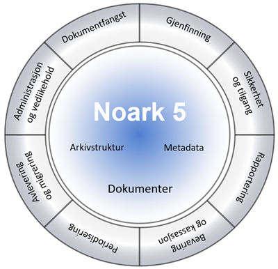

Spesifikasjon for Noark 5 Tjenestegrensesnitt
=============================================

Noark 5 tjenestegrensesnitt (API) er en spesifikasjon av en dataprotokoll for maskinell kommunikasjon med Noark-løsninger. 
Noark 5.5.0 tjenestegrensesnittet versjon 1.0 er nyeste versjon og følger opp betaversjonen som ble lansert som del 
av Noark 5.4.0 i oktober 2016. 

Formålet med Noark 5 tjenestegrensesnittet er å standardisere og forenkle kommunikasjonen mellom de ulike 
systemene i forvaltningen. Tjenestegrensesnittet er en spesifikasjon av en dataprotokoll for maskinell 
kommunikasjon med Noark-løsninger. Betaversjonen ble levert fra Samdok-prosjektet høsten 2016. Sommeren 
2017 innledet Arkivverket og Arkitektum AS (som utviklet betaversjonen) et pilotsamarbeid med Fredrikstad
kommune, Evry og HK Data for å verifisere betaversjonen (Proof of Concept).

Mer informasjon om denne standarden kan finnes på [Arkivverkets
sider](https://www.arkivverket.no/forvaltning-og-utvikling/noark-standarden/noark-5/tjenestegrensesnitt-noark5).

Ressurser
---------
Prosjektet vedlikeholdes på https://github.com/arkivverket/noark5-tjenestegrensesnitt-standard

XML-skjema (XSD)
https://github.com/arkivverket/noark5-tjenestegrensesnitt-standard/tree/master/xsd
