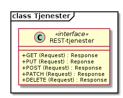

Konsepter og prinsipper
=======================

Utforming av tjenester
----------------------

Mandatet til prosjektgruppen i Samdok var å etablere CRUD tjenester (Create,
Read, Update, Delete) for Noark5 standarden. Både tjenestene og
datastrukturer er modellert i UML.

De aller fleste objekter i Noark trenger operasjoner/tjenester for å
opprette objekt, finne objekter, oppdatere objekter og i noen spesielle
tilfeller slette objekter. I noen av kravene i Noark er det også
beskrevet egne tjenester som skal kunne utføres.

Det er valgt å spesifisere REST for tjenestene. Prinsippene og eksempler
følger under, og ytterligere detaljer kan en finne i vedlegg 3.

Dette er videreført i det videre arbeidet med tjenestegrensesnittet.

REST tjenestene
~~~~~~~~~~~~~~~

For REST er HATEOAS prinsipper fulgt slik at en klient skal fra en
hoved-URL kunne navigere og oppdage selv alle mulig tjenester som kjernen
tilbyr.

Dette gjøres med ressurslenker og relasjonslenker som inneholder
beskrivelse av ressursen med eksempler på forespørsler, resultat og
statuskoder. Alle slike ressurslenker og relasjonslenker har
avsluttende skråstrek.

Det skilles mellom små og store tegn i alle JSON-attributter
og HATEOS-relasjoner, slik at disse har entydig definerte navn som
ikke er avhengig av språkspesifikke regler for konvertering mellom
små og store tegn.

|image0|

Under følger eksempler fra tjenestene.

Oppkobling og ressurslenker
^^^^^^^^^^^^^^^^^^^^^^^^^^^

Oppkobling skjer mot en hoved-URL og er den eneste ressursen klienten
trenger å vite for å starte interaksjon. Resten av endepunkter oppdages
av klienten via relasjonsnøkler som beskriver hva ressursen kan brukes
til.

**Request**

GET https://n5.example.com/api

Accept: application/vnd.noark5+json

**Response**

Content-Type: application/vnd.noark5+json

.. code:: python

   {
       "_links": {
           "https://rel.arkivverket.no/noark5/v5/api/arkivstruktur/": {
               "href": "https://n5.example.com/api/arkivstruktur"
           },
           "https://rel.arkivverket.no/noark5/v5/api/sakarkiv/": {
               "href": "https://n5.example.com/api/sakarkiv"
           },
           "https://rel.arkivverket.no/noark5/v5/api/admin/system/": {
               "href": "https://n5.example.com/api/admin/system/",
           }
       }
   }

Eksempelet viser at denne arkivkjernen støtter arkivstruktur
(https://rel.arkivverket.no/noark5/v5/api/arkivstruktur/) og sakarkiv
(https://rel.arkivverket.no/noark5/v5/api/sakarkiv/).
Ved å følge **href** til disse relasjonsnøkler vil tilgjengelige ressurser
innen disse områder annonseres på samme måte.

**Resultatkoder**

.. list-table::
   :header-rows: 1

 * - Statuskode
   - Beskrivelse
 * - 200
   - OK
 * - 400
   - BadRequest - ugyldig forespørsel
 * - 403
   - Forbidden - ingen tilgang
 * - 404
   - NotFound - ikke funnet
 * - 501
   - NotImplemented - ikke implementert

**href** kan være hva som helst og trenger ikke følge noe fast mønster
for oppbygning av url. Mens **rel** (relasjonsnøkkelen) har faste verdier
som beskriver hva ressursen kan brukes til. Denne kan klienten også åpne
for å vise beskrivelse, eksempel på bruk, statuskoder og annet som er
relevant for denne relasjonsnøkkelen.

**Relasjonsnøkler på rotnivå**

.. list-table::
   :header-rows: 1

 * - Relasjonsnøkkel (rel)
   - Beskrivelse
 * - https://rel.arkivverket.no/noark5/v5/api/arkivstruktur/
   - Arkivkjerne støtter konformitetsnivå 1 arkivstruktur
 * - https://rel.arkivverket.no/noark5/v5/api/sakarkiv/
   - Arkivkjerne støtter konformitetsnivå for sakarkiv (2a)

Relasjonsnøkler under de forskjellige konformitetsnivå listes ut i
kapittel 7 sammen med beskrivelse av klasser.

**Spesielle relasjonsnøkler**

.. list-table::
   :header-rows: 1

 * - Relasjonsnøkkel (rel)
   - Beskrivelse
 * - self
   - Brukes for å identifisere en ressurs, og kan brukes til oppdatering og sletting.
 * - next
   - Brukes for å angi neste side ved serverstyrt resultatoppdeling

Ressurser bør kun gjøres tilgjengelig i API når pålogget bruker har
tilgang til disse. Hvis en bruker ikke har tilgang til å avslutte en
mappe så bør ikke relasjonsnøkkel for dette annonseres i API for å gjøre
det lettere å navigere til aktuelle funksjoner.

Identifisere entitetstype
^^^^^^^^^^^^^^^^^^^^^^^^^

En kan identifisere hvilken entitet en oppføring har ved å først
identifisere «self»-relasjonsnøkkelen i «_links»-listen, deretter
identifisere hvilken annen oppføring som har samme href som
"self"-relasjonsnøkkelen. Relasjonsnøkkelen til oppføringen som har
samme href som «self» representerer entitetsrelasjonsnøkkelen til
«self». Dette kan se slik ut:

.. code:: python

   { "results": [
     { ...
       "_links": {
         "self": {
           "href": "https://n5.example.com/api/sakarkiv/saksmappe/2624ed49-dc39-47d5-8966-52f9fdc75868/"
         },
         "https://rel.arkivverket.no/noark5/v5/api/sakarkiv/saksmappe/": {
           "href": "https://n5.example.com/api/sakarkiv/saksmappe/2624ed49-dc39-47d5-8966-52f9fdc75868/"
         },
         ...
       }
     } ]
   }

Systeminformasjon
^^^^^^^^^^^^^^^^^

Når en tar GET mot href for relasjonsnøkkelen
``https://rel.arkivverket.no/noark5/v5/api/admin/system/``, så får en informasjon
om API-tjenersystemet. Responsen inneholder følgende felter:

-  ``leverandoer`` - tekststreng med navn på leverandør av
   tjenestegrensesnittimplementasjonen.
-  ``produkt`` - tekststreng med navn på produktet som leverer
   tjenestegrensesnittet.
-  ``versjon`` - tekststreng med versjon for produktet fra leverandøren.
-  ``versjonsdato`` - tekststreng med dato for når produktet ble lansert
   / programmet ble sist oppdatert.
-  ``protokollversjon`` - tekststreng med versjon av
   tjenestegrensesnittspesifikasjonen som støttes.
   For dagens utgave vil verdien være '1.0 beta'.

Responsen kan for eksempel se slik ut:

.. code:: python

   {
     "leverandoer": "Hoffleverandøren",
     "produkt": "Arkivsystemet Noark 5 kjerne",
     "versjon": "0.1",
     "versjonsdato": "2019-03-22",
     "protokollversjon": "1.0 Beta"
   }

Det kan være en sikkerhetsmessig fordel å unngå å fortelle
potensielle angripere hvilken versjon som kjører på maskinen. Det
kan derfor være lurt å kun gjøre dette endepunktet tilgjengelig for
innloggede brukere.

Finne objekter (Read)
^^^^^^^^^^^^^^^^^^^^^

For filter skal syntaks fra oData standarden
(http://docs.oasis-open.org/odata/odata/v4.01/odata-v4.01-part2-url-conventions.html)
benyttes. De ressurser som støtter filter skal annonserer dette under
**\_links** med **templated=true** og parametre som kan brukes til dette i
**href**. Feltet «templated» er valgfritt og verdien skal antas å være «false»
hvis det ikke finnes. Typiske parametre er **$filter**, **$top**, **$skip**
og **$orderby**. Alle lister med data bør støtte søk og filtrering. Ressurslisten
i \_links er alfabetisk sortert på «rel»-feltet i henhold til ASCII-verdi.

.. code:: python

   {
       "_links": {
           "https://rel.arkivverket.no/noark5/v5/api/arkivstruktur/arkiv/": {
               "href": "https://n5.example.com/api/arkivstruktur/arkiv{?$filter&$orderby&$top&$skip&$search}",
               "templated": true
           },
           "https://rel.arkivverket.no/noark5/v5/api/arkivstruktur/ny-arkivskaper/": {
               "href": "https://n5.example.com/api/arkivstruktur/ny-arkivskaper"
           },

Figur 1 annonsering av templated link for søk etter arkiv

Filter parametre som skal støttes er:

-  $filter
-  $top
-  $skip
-  $search
-  $orderby

**Nivå på filter**

-  Nivå basis (påkrevd):

   -  Filter på direkte felter.
   -  Filter på en-til-en gruppe relasjoner (blant annet kodelister)

-  Nivå utvidet:

   -  Filter på en-til-mange relasjoner (vha. 'any' og 'all' odata
      funksjonene)

Filtrering
''''''''''

Filtrering støttes med $filter parameter. Nedenfor følger en del
eksempler på ulike filtreringer med de innebygde oData-operatorene.
Flere filtre kan kombineres med operatorene **and** og **or**.

*Begynner med*

**Syntaks:** startswith(feltnavn, ‘tekst’)

**Eksempel:**

   /api/arkivstruktur/mappe/?$filter=startswith(tittel, 'allergisk testmappe')

*Er lik*

*Syntaks:* feltnavn eq verdi

**Eksempel:**

   /api/arkivstruktur/mappe/?$filter=systemID eq '1'

*Inneholder*

**Syntaks:** substringof(‘tekst’, feltnavn)

**Eksempel:**

   /api/arkivstruktur/mappe/?$filter=substringof('test', tittel)

*Større enn*

**Syntaks:** feltnavn gt verdi

**Eksempel:**

   /api/arkivstruktur/registrering/?$filter=year(oppdatertDato) gt 2012

..

   /api/sakarkiv/saksmappe?$filter=saksdato gt DateTime'2017-02-15'

*Mindre enn*

**Syntaks:** feltnavn lt verdi

**Eksempel:**

   /api/sakarkiv/saksmappe?$filter=saksdato lt DateTime'2017-02-15'

*Større enn eller lik*

**Syntaks:** feltnavn ge verdi

**Eksempel:**

   /api/sakarkiv/saksmappe?$filter=saksdato ge DateTime'2017-02-15'

*Mindre enn eller lik*

**Syntaks:** feltnavn le verdi

**Eksempel:**

   /api/sakarkiv/saksmappe?$filter=saksdato le DateTime'2017-02-15'

*Og*

**Syntaks:** uttrykk and utrykk

**Eksempel:**

   /api/sakarkiv/saksmappe/?$filter=saksdato gt DateTime'2017-02-10' and saksdato lt DateTime'2017-02-12'

*Eller*

**Syntaks:** uttrykk or utrykk

**Eksempel:**

   /api/sakarkiv/saksmappe/?$filter=year(saksdato) gt 2014 or year(opprettetDato) gt 2014

**Flere eksempler på filtrering**

*De to første mappene med test i tittelen*

   /api/arkivstruktur/mappe/?$top=2&$filter=substringof('test',tittel)

*Mapper med graderingskode B*

   /api/arkivstruktur/mappe/?$filter=gradering/graderingskode/kode eq 'B'

*Mapper med merknader som har merknadstype B*

.. list-table::
   :widths: 8 4 1
   :header-rows: 1

 * - Eksempel
   - Forklaring
   - Nivå
 * - ../arkivstruktur/mappe/?$expand=merknad&$filter=merknad/any(m:
     m/merknadstype/kode eq 'B')
   - Mapper med merknader som har merknadstype B
   - utvidet
 * - ../arkivdel/1235/mappe?$top=2&$filter=contains(‘testmappe’,
     tittel) eq true $orderby=oppdatertDato desc
   - De to første mapper hvor testmappe er en del av tittel sortert
     synkende på oppdatertDato
   - basis
 * - ../api/arkivstruktur/Mappe?$filter=klasse/klasseID eq '12/2' and
     klasse/klassifikasjonssystem/klassifikasjonstype/kode eq 'GBNR'
   - Mappe med klassering på eiendom
   - utvidet
 * - ../api/arkivstruktur/Mappe?$filter=klasse/klasseID eq
     '12345678901' and
     klasse/klassifikasjonssystem/klassifikasjonstype/kode eq 'PNR'
   - Mappe med klassering på fødselsnr
   - utvidet
 * - ../api/arkivstruktur/Mappe?$filter=klasse/klasseID eq '123456789'
     and klasse/klassifikasjonssystem/klassifikasjonstype/kode eq 'ORG'
   - Mappe med klassering på organisasjonsnr
   - utvidet
 * - ../api/sakarkiv/Saksmappe/?$filter=part/any(s:
     s/Default.PartPersonType/foedselsnummer eq '12334566')
   - Saksmapper med part(PartPerson) med gitt fødselsnummer
   - utvidet
 * - ../api/sakarkiv/Saksmappe/?$filter=part/any(s:
     s/Default.PartEnhetType/organisasjonsnummer eq '12334566')
   - Part med organisasjonsnummer
   - utvidet
 * - ..api/sakarkiv/journalpost/?$filter=korrespondansepart/any(s:
     s/Default.KorrespondansepartPersonType/foedselsnummer eq
     '12334566')
   - Korrespondansepart med fødselsnummer
   - utvidet
 * - ..api/arkivstruktur/mappe/?$filter=nasjonalidentifikator/any(i:
     i/Default.BygningType/byggidentifikator/bygningsNummer eq
     '12345678')
   - Nasjonal identifikator med bygningsnr
   - utvidet

**Søk**

$search brukes for generelt søk. Arkivkjernen bestemmer hvordan denne er
implementert med hensyn på hvilke felter den inkluderer i søk og om for
eksempel innhold i dokumenter er med.

Eksempel på hvordan syntaks for et søk i et arkiv kan se ut:

   /api/arkivstruktur/arkiv?$search='test'

**Sortering**

$orderby brukes for å angi sortering av resultat etter gitte felter.

**Resultatoppdeling (Paginering)**

På klientsiden kan $top og $skip brukes sammen for å angi hvilken side
av søkeresultatet en ønsker returnert. $top gir antallet som skal
returneres, og $skip gir antallet en skal hoppe over og ikke inkludere i
resultatet.

Serverstyrt resultatoppdeling kan settes av arkivkjernen med PageSize.
Pagesize setter max antall som kan returneres fra arkivkjerne og kjerne
må returnere en next link som gir neste siden.

**Filter på underobjekter**

Any eller All brukes for å filtrere på navigerbare objekter. Det kan
være begrensninger på hvor mange nivå/dybde en arkivkjerne støtter.

.. list-table::
   :header-rows: 1

 * - Eksempel:
 * - https://n5.example.com/api/sakarkiv/saksmappe?$filter=nasjonalidentifikator/any(i:
     i/Default.BygningType/byggidentifikator/bygningsNummer eq
     '12345678')
 * - https://n5.example.com/api/sakarkiv/saksmappe?$filter=nasjonalidentifikator/any(i:
     i/Default.BygningType/byggidentifikator/bygningsNummer eq
     '12345678')

**Resultat med underobjekter**

$expand brukes for å inkludere underobjekter i resultat. Det kan være
begrensninger på hvor mange nivå en arkivkjerne støtter. Som standard
skal ikke underobjekter returneres hvis dette ikke spesifiseres med
$expand. Hvor mange nivåer som støttes settes opp i kjernen med
MaxExpansionDepth.

**Filter og tilgangsstyring**

Ved søk skal arkivkjernen ta hensyn til tilgangsrettigheter slik at
brukere ikke får uautorisert tilgang til informasjon. Er informasjonen
unntatt offentlighet, skjermet eller gradert så skal ikke uautoriserte
brukere få tilgang til dette. Dette kan bety at en bruker har lov til å
registrere et objekt, men ikke rettigheter til å vise dette etterpå.

En liste med objekter eller et søkeresultat returneres som et
JSON-objekt med medlem «count» satt til antall elementer totalt i
søkeresultatet/listen, «results» satt til en liste med instansene i
listen, og «_links» til relevante relasjonsnøkler som «self» og
«next».

Det kan se ut som følger:

Forespørsel:

GET https://n5.example.com/api/arkivstruktur/mappe/
Accept: application/vnd.noark5+json

Respons:

.. code:: python

   { "results" : [
       { "mappeID": "1234/2017",
         "tittel": "testmappe 1",
         ...
       },
       { "mappeID": "1235/2017",
         "tittel": "testmappe 2",
         ...
       }
     ],
     "count" : 3,
     "_links" : {
       "next": {
         "href": "https://n5.example.com/noark5v4/api/arkivstruktur/mappe/?top=2&skip=2"
       },
       ...
     ]
   }

I dette eksemplet er det sideinndeling med 2 elementer per side, kun
to av tre søkeresultater returneres i første omgang, og en
«next»-lenke til resten av sideresultatet.

Når en forespurt listeressurs fra databasen er tom returneres
statuskode 200, medlem «count» satt til 0, intet medlem «results»,
samt relevante relasjonsnøkler i «_links» inkludert en «self»-relasjon
tilbake til forespørselen som produserte den tomme listen. Hvis en
søker etter listen over arkiv og det ikke finnes noen arkiv, så kan
JSON-strukturen se slik ut:

.. code:: python

   {
     "count": 0,
     "_links" : {
       "self": {
         "href": "https://n5.example.com/api/arkivstruktur/arkiv/"
       },
       "https://rel.arkivverket.no/noark5/v5/api/arkivstruktur/arkiv/": {
         "href": "https://n5.example.com/api/arkivstruktur/arkiv/"
       }
     }
   }

.. list-table:: Resultatkoder ved navigering/søk
   :widths: 1 3
   :header-rows: 1

 * - Statuskode
   - Beskrivelse
 * - 200
   - OK
 * - 400
   - BadRequest - ugyldig forespørsel
 * - 403
   - Forbidden - ingen tilgang
 * - 404
   - NotFound - ikke funnet
 * - 500
   - InternalServerError – generell feil på server
 * - 501
   - NotImplemented - ikke implementert

Opprette objekter (Create)
^^^^^^^^^^^^^^^^^^^^^^^^^^

Nye objekter opprettes fra andre objekter vha. ressurslenker. Slike ressurslenker, f.eks. .../ny-mappe, vises for de underobjekttypene som er aktuelle iht. datamodellen og tilgjengelige med den aktuelle brukerens rettigheter. GET-forespørsler kan benyttes for å få returnert en gyldig og delvis utfylt objektstruktur. POST-forespørsel oppretter nytt objekt. Opprettet objekt vil tilhøre objektet det opprettes fra.

For mappe og klasse som kan ha undermapper og underklasser så vil det være ressurslenkene .../ny-mappe og .../ny-klasse som benyttes for å opprette undermapper og underklasser. Disse blir så tilgjengelige for uthenting med GET-forespørsel til .../undermappe og .../underklasse.

For eksempel kan en opprette mapper på arkivdel, og da vil \_links under
en arkivdel inneholde relasjonsnøkkelen
rel="https://rel.arkivverket.no/noark5/v5/api/arkivstruktur/ny-mappe/"
om bruker har lov til å opprette mapper på denne arkivdelen. Den
aktuelle ressurslenke kan være
https://n5.example.com/api/arkivstruktur/Arkivdel/12345/ny-mappe .
Denne kan brukes til både GET og POST forespørsel.

GET-forespørselen forhånds utfyller en lovlig objektstruktur og gir
relasjonslenker til aktuelle kodelister. En slik forespørsel
oppretter ikke noe objekt og returverdien refererer ikke heller til et
objekt i databasen, og er derfor uten «self»-relasjon. Strukturen
(uten "_links" og felt med verdi «null») kan brukes som utgangspunkt for en POST
når et nytt objekt skal opprettes.

Attributter som henter verdier fra kodelister fylles inn med enten kun
**kode**-verdien fra kodelisten eller både **kode** og **kodenavn**.
Kodelisteverdiene kopieres fra kodelisten inn i instansen når
attributt settes første gang eller endres, slik at fremtidige
endringer i kodelister ikke påvirker verdier i eksisterende instanser.

Kun kodelisteverdier der «inaktiv»-attributten ikke er satt til «true»
skal brukes på nye instanser eller ved endring av kodelisteverdi på
eksisterende instanser.

Ved registrering av objektet så skal kjernen fylle ut systemID, opprettetAv og opprettetDato. OpprettetAv skal være personnavn, referanseOpprettetAv skal være en systemID. NB! Denne systemID-en kan være en entydig identifikator av brukeren i fagsystemet, slik at personen ikke nødvendigvis må være bruker i arkivkjernen. opprettetDato er datoen (eller dataTime) enheten er opprettet i fagsystemet.

.. code:: python

   {
       "mappetype": {
           "kode": "BYGG",
           "kodenavn": "Byggesak"
       },
       "tittel": "angi tittel på mappe",
       "dokumentmedium": {
           "kode": "E",
           "kodenavn": "Elektronisk arkiv"
       },
       "_links": {
           "https://rel.arkivverket.no/noark5/v5/api/metadata/dokumentmedium/": {
               "href": "https://n5.example.com/api/kodelister/Dokumentmedium{?$filter&$orderby&$top&$skip}",
               "templated": true
           },
           "https://rel.arkivverket.no/noark5/v5/api/metadata/mappetype/": {
               "href": "https://n5.example.com/api/kodelister/Mapetype{?$filter&$orderby&$top&$skip}",
               "templated": true
           }
       }
   }

Klienten sender en POST forespørsel med en lovlig objektstruktur til
gitt url. Responsen gir statuskode 201 Created om objektet ble opprettet
korrekt og komplett objekt samt location header for lese eller endre
url.

POST til https://n5.example.com/api/arkivstruktur/Arkivdel/12345/ny-mappe

Content-Type: application/vnd.noark5+json

.. code:: python

   {
       "mappetype": {
           "kode": "BYGG",
           "kodenavn": "Byggesak"
       },
       "tittel", "Testvegen 32, ny enebolig",
       "dokumentmedium": {
           "kode": "E",
           "kodenavn": "Elektronisk arkiv"
       }
   }

**Resultat**

201 Opprettet

Location →

https://n5.example.com/api/arkivstruktur/Mappe/a043d07b-9641-44ad-85d8-056730bc89c8

.. code:: python

   {
       "mappeID": "123456/2016",
       "mappetype": {
           "kode": "BYGG",
           "kodenavn": "Byggesak"
       },
       "tittel", "Testvegen 32, ny enebolig",
       "dokumentmedium": {
           "kode": "E",
           "kodenavn": "Elektronisk arkiv"
       },
       "systemID": "515c45b5-e903-4320-a085-2a98813878ba",
       "opprettetDato": "2016-04-03T15:45:28.4985538+02:00",
       "opprettetAv": "pålogget bruker",
       "referanseOpprettetAv": "4ff78c87-6e41-40cb-bc6b-edff1ce685b9",
       "_links": {
           "self": {
               "href": "https://n5.example.com/api/arkivstruktur/Mappe/515c45b5-e903-4320-a085-2a98813878ba"
           },
           "https://rel.arkivverket.no/noark5/v5/api/arkivstruktur/mappe/": {
               "href": "https://n5.example.com/api/arkivstruktur/Mappe/515c45b5-e903-4320-a085-2a98813878ba",
           },
           "https://rel.arkivverket.no/noark5/v5/api/sakarkiv/utvid-til-saksmappe/": {
               "href": "https://n5.example.com/api/arkivstruktur/Mappe/515c45b5-e903-4320-a085-2a98813878ba/utvid-til-saksmappe",
           },

Figur 2 respons fra opprett mappe (eksempel avkortet for liste over links)

.. list-table:: Resultatkoder ved oppretting av objekt
   :widths: 1 3
   :header-rows: 1

 * - Statuskode
   - Beskrivelse
 * - 200
   - OK
 * - 201
   - Created - opprettet
 * - 400
   - BadRequest - ugyldig forespørsel
 * - 403
   - Forbidden - ingen tilgang
 * - 404
   - NotFound - ikke funnet
 * - 409
   - Conflict – objektet kan være endret av andre
 * - 500
   - InternalServerError – generell feil på server
 * - 501
   - NotImplemented - ikke implementert

Heleide objekter(komposisjoner) kan opprettes sammen med hovedobjektet
og inngår i dens lovlige objektstruktur. For eksempel merknad på en
mappe kan registreres sammen med registreringen av mappe.

Preutfylling av objekt
^^^^^^^^^^^^^^^^^^^^^^

Ved å bruke GET på for eksempel ny-mappe
(https://rel.arkivverket.no/noark5/v5/api/arkivstruktur/ny-mappe/)
så kan arkivkjerne pre-utfylle og foreslå vanlige data for et objekt
basert på pålogget bruker samt annonsere hvor diverse lovlige koder kan
hentes fra slik som mappetype og dokumentmedium.

.. code:: python

   {
       "mappetype": {
           "kode": "BYGG",
           "kodenavn": "Byggesak"
       },
       "tittel": "angi tittel på mappe",
       "dokumentmedium": {
           "kode": "E",
           "kodenavn": "Elektronisk arkiv"
       },
       "_links": {
           "https://rel.arkivverket.no/noark5/v5/api/metadata/dokumentmedium/": {
               "href": "https://n5.example.com/api/kodelister/Dokumentmedium{?$filter&$orderby&$top&$skip}",
               "templated": true
           },
           "https://rel.arkivverket.no/noark5/v5/api/metadata/mappetype/": {
               "href": "https://n5.example.com/api/kodelister/Mapetype{?$filter&$orderby&$top&$skip}",
               "templated": true
           }
       }
   }

Oppdatere objekter (Update)
^^^^^^^^^^^^^^^^^^^^^^^^^^^

Alle ressurser kan med sin relasjonslenke rel="self" og ressurslenke
(href) benytte denne til oppdatering.

For oppdatering sender klienten enten en PUT forespørsel med alle data
for en lovlig objektstruktur, eller en PATCH-forespørsel med de
enkeltattributtene som skal endres. For PUT må alle egenskaper være
med, med unntak av underobjekter som har en mange relasjon (0..\*
eller 1..*) i oppdatering av et objekt. Underobjekter må oppdateres
separat med sine resurslenker.

For å hindre at data blir oppdatert samtidig av forskjellige brukere
og overskrevet med gamle data så må kjernen sjekke innkomne objekt og
lagret objekt. ETag (https://en.wikipedia.org/wiki/HTTP_ETag) skal
benyttes for å støtte «optimistic concurrency control». Om det oppstår
konflikt så kan resultatkode 409 benyttes. Da må klient hente opp ny
versjon fra arkivkjerne og gjøre fletting av data mellom server og
klient. For å redusere risikoen for konflikt bør derfor klienten
alltid hente en fersk utgave av objektet med en GET-forespørsel og
deretter oppdatere objektet med en PUT-forespørsel.

PUT til https://n5.example.com/api/arkivstruktur/Mappe/a043d07b-9641-44ad-85d8-056730bc89c8

Content-Type: application/vnd.noark5+json

.. code:: python

   {
       "mappeID": "123456/2016",
       "mappetype": {
           "kode": "BYGG",
           "kodenavn": "Byggesak"
       },
       "tittel", "Testvegen 32, ny enebolig",
       "dokumentmedium": {
           "kode": "E",
           "kodenavn": "Elektronisk arkiv"
       },
       "systemID": "515c45b5-e903-4320-a085-2a98813878ba",
       "opprettetDato": "2016-04-03T15:45:28.4985538+02:00",
       "opprettetAv": "pålogget bruker",
       "referanseOpprettetAv": "4ff78c87-6e41-40cb-bc6b-edff1ce685b9",
       "gradering": {
           "graderingskode": {
               "kode": "B"
           },
           "graderingsdato": "2016-05-03T16:05:48.4966742+02:00"
       }
   }

**Resultat**

200 OK

Location →

https://n5.example.com/api/arkivstruktur/Mappe/a043d07b-9641-44ad-85d8-056730bc89c8

.. code:: python

   {
       "mappeID": "123456/2016",
       "mappetype": {
           "kode": "BYGG",
           "kodenavn": "Byggesak"
       },
       "tittel", "Testvegen 32, ny enebolig",
       "dokumentmedium": {
           "kode": "E",
           "kodenavn": "Elektronisk arkiv"
       },
       "gradering": {
           "graderingskode": {
               "kode": "B"
           },
           "graderingsdato": "2016-05-03T16:05:48.4966742+02:00"
       },
       "systemID": "515c45b5-e903-4320-a085-2a98813878ba",
       "oppdatertDato": "2016-05-03T16:10:01.9386215+02:00",
       "opprettetDato": "2016-04-03T15:45:28.4985538+02:00",
       "opprettetAv": "pålogget bruker",
       "oppdatertAv": "pålogget bruker",
       "referanseOppdatertAv": "8f58d80c-9b5c-4ddf-af5a-764f08a7661e",
       "referanseOpprettetAv": "4ff78c87-6e41-40cb-bc6b-edff1ce685b9",
       "_links": {
           "self": {
               "href": "https://n5.example.com/api/arkivstruktur/Mappe/515c45b5-e903-4320-a085-2a98813878ba"
           },
           "https://rel.arkivverket.no/noark5/v5/api/arkivstruktur/mappe/": {
               "href": "https://n5.example.com/api/arkivstruktur/Mappe/515c45b5-e903-4320-a085-2a98813878ba"
           },
           "https://rel.arkivverket.no/noark5/v5/api/sakarkiv/utvid-til-saksmappe/": {
               "href": "https://n5.example.com/api/arkivstruktur/Mappe/515c45b5-e903-4320-a085-2a98813878ba/utvid-til-saksmappe"
           },

Figur 3 respons fra oppdatering av mappe med graderingsinformasjon (eksempel avkortet ved links liste)

Endring av instanser med PATCH gjøres slik det er beskrevet i IETF RFC
7396 (JSON Merge Patch). Kun de attributtene som skal endres i en
instans sendes over, med Content-Type satt til
«application/merge-patch+json». Dette sikrer at en API-klient kan
gjøre endringer i instanser uten å måtte forstå hele JSON-strukturen,
og uten å risikere å endre på andre felter enn ønsket.

API-klienter kan også endre på relasjoner i \_links ved hjelp av
PATCH.

Her er et eksempel som endrer Mappe-instansen som ble returnert for
PUT gjengitt over:

PATCH til https://n5.example.com/api/arkivstruktur/Mappe/a043d07b-9641-44ad-85d8-056730bc89c8

Content-Type: application/merge-patch+json

.. code:: python

   {
       "tittel", "Testvegen 33, ny enebolig",
       "gradering": {
           "graderingskode": {
               "kode": "F"
           }
       }
   }

**Resultat**

200 OK

Location →

https://n5.example.com/api/arkivstruktur/Mappe/a043d07b-9641-44ad-85d8-056730bc89c8

.. code:: python

   {
       "mappeID": "123456/2016",
       "mappetype": {
           "kode": "BYGG",
           "kodenavn": "Byggesak"
       },
       "tittel", "Testvegen 33, ny enebolig",
       "dokumentmedium": {
           "kode": "E",
           "kodenavn": "Elektronisk arkiv"
       },
       "gradering": {
           "graderingskode": {
               "kode": "F"
           },
           "graderingsdato": "2016-05-03T16:05:48.4966742+02:00"
       },
       "systemID": "515c45b5-e903-4320-a085-2a98813878ba",
       "oppdatertDato": "2016-05-03T16:10:01.9386215+02:00",
       "opprettetDato": "2016-04-03T15:45:28.4985538+02:00",
       "opprettetAv": "pålogget bruker",
       "oppdatertAv": "pålogget bruker",
       "referanseOppdatertAv": "8f58d80c-9b5c-4ddf-af5a-764f08a7661e",
       "referanseOpprettetAv": "4ff78c87-6e41-40cb-bc6b-edff1ce685b9",
       "_links": {
           "self": {
               "href": "https://n5.example.com/api/arkivstruktur/Mappe/515c45b5-e903-4320-a085-2a98813878ba"
           },
           "https://rel.arkivverket.no/noark5/v5/api/arkivstruktur/mappe/": {
               "href": "https://n5.example.com/api/arkivstruktur/Mappe/515c45b5-e903-4320-a085-2a98813878ba"
           },
       ...
       }
   }

Slik kan en flytter en dokumentbeskrivelse fra en registrering til en annen:

PATCH til https://n5.example.com/api/arkivstruktur/Dokumentbeskrivelse/1fa94a89-3550-470b-a220-92dd4d709044

.. code:: python

   {
       "_links": {
           "https://rel.arkivverket.no/noark5/v5/api/arkivstruktur/registrering/": {
               "href": "https://n5.example.com/api/arkivstruktur/registrering/cf8e1d0d-e94d-4d07-b5ed-46ba2df0465e/dokumentbeskrivelse/"
            }
       }
   }

.. list-table:: Resultatkoder ved oppdatering av objekt
   :widths: 1 3
   :header-rows: 1

 * - Statuskode
   - Beskrivelse
 * - 200
   - OK
 * - 400
   - BadRequest - ugyldig forespørsel
 * - 403
   - Forbidden - ingen tilgang
 * - 404
   - NotFound - ikke funnet
 * - 409
   - Conflict – objektet kan være endret av andre
 * - 500
   - InternalServerError – generell feil på server
 * - 501
   - NotImplemented - ikke implementert

Utvid objekter til andre typer
^^^^^^^^^^^^^^^^^^^^^^^^^^^^^^

Hvis en ikke ønsker å opprette en instans med riktig entitet direkte
ved å bruke **ny-xx**-metodene, men ønsker å utvide en entitet fra en
basisentitet til en underentitet uten å endre systemID, så kan en
bruke \**utvid-til-xx*-metodene. Dette gjelder for eksempel Mappe og
Saksmappe.

Ved uthenting av en mappe vil du få følgende relasjon tilbake:

.. code:: python

   "https://rel.arkivverket.no/noark5/v5/api/sakarkiv/utvid-til-saksmappe/": {
       "href": "https://n5.example.com/api/sakarkiv/Saksmappe/1/utvid-til-saksmappe"
   }

Ved å kjøre PUT-forespørsel på angitt href med tilhørende felter som
er påkrevd for saksmappe så skal objektet utvides til å bli en
saksmappe.

**PUT**\ https://n5.example.com/api/sakarkiv/Saksmappe/1/utvid-til-saksmappe

Content-Type: application/vnd.noark5+json

.. code:: python

   {
       "saksansvarlig": "Arne",
       "saksdato": "2017-12-08T00:00:00",
       "saksstatus": {
           "kode": "R",
       "kodenavn": "Opprettet av saksbehandler"
       }
   }

Respons skal være den nye saksmappen. Merk at **self** nå peker på
saksmappe og ikke mappe.

.. code:: python

   {
       "saksdato": "2017-12-08T00:00:00",
       "saksansvarlig": "Henning",
       "saksstatus": {
           "kode": "R",
           "kodenavn": "Opprettet av saksbehandler"
       },
       "mappeID": "1/2014",
       "tittel": "klok testmappe 1",
       "offentligTittel": "Dette er en offentlig tittel ****",
       "gradering": {
           "graderingskode": {
               "kode": "B"
           },
           "graderingsdato": "2017-12-08T15:32:10.739027+01:00",
           "_links": {}
       },
       /// Resten av objektet utelatt
       "_links": {
           "self": {
               "href": "https://n5.example.com/api/sakarkiv/saksmappe/1"
           },

.. list-table:: Resultatkoder ved utvidelse av objekt
   :widths: 1 3
   :header-rows: 1

 * - Statuskode
   - Beskrivelse
 * - 200
   - OK
 * - 400
   - BadRequest - ugyldig forespørsel

Resultatkode 400 leveres dersom id til eksisterende mappe er ugyldig eller
det mangler påkrevde felter.

Rekursive entitetshierarkier
^^^^^^^^^^^^^^^^^^^^^^^^^^^^

Noen entiteter kan ha samme type entitet under seg, og slik danne et
rekursivt hierarki av instanser. Det gjelder Arkiv, Klasse og Mappe,
og entiteter som arver fra disse (som Saksmappe).

Da det ikke er i tråd med HATEOAS-prinsippene å la samme
relasjonsnøkkel peke til flere ulike href-er, så må dette håndteres
litt annerledes enn relasjoner mellom entiteter av ulik type. Listen
over under-instanser til en gitt instans kan hentes ut ved å følge
href for relasjonsnøkkelen
https://rel.arkivverket.no/noark5/v5/api/arkivstruktur/underxx/, der
xx er navnet på entitet. Eksempler på slike relasjonsnøkler
https://rel.arkivverket.no/noark5/v5/api/arkivstruktur/underklasse/ og
https://rel.arkivverket.no/noark5/v5/api/arkivstruktur/undermappe/.

Av samme grunn er det ikke mulig å la foreldrerelasjonen gjenbruke
entitetens relasjonsnøkkel. En kan der finne foreldreinstans ved å
følge href for relasjonsnøkkelen
https://rel.arkivverket.no/noark5/v5/api/arkivstruktur/overxx/.
Eksempler på slike relasjonsnøkler
https://rel.arkivverket.no/noark5/v5/api/arkivstruktur/overklasse/
og
https://rel.arkivverket.no/noark5/v5/api/arkivstruktur/overmappe/.

Kun relasjoner som eksisterer skal vises i relasjonslisten.
JSON-listen over relasjoner for en klasseinstans midt i et slikt
hierarki kan for eksempel se slik ut:

.. code:: python

   "_links": {
     "self": {
       "href": "https://n5.example.com/api/arkivstruktur/klasse/7b3989b0-53d7-11e9-bd4e-17d6c4d53856/"
     },
     "https://rel.arkivverket.no/noark5/v5/api/arkivstruktur/klasse/": {
       "href": "https://n5.example.com/api/arkivstruktur/klasse/7b3989b0-53d7-11e9-bd4e-17d6c4d53856/"
     },
     "https://rel.arkivverket.no/noark5/v5/api/arkivstruktur/overklasse/": {
       "href": "https://n5.example.com/api/arkivstruktur/klasse/6787ba68-53d7-11e9-a583-8f084aaf5d19/"
     },
     "https://rel.arkivverket.no/noark5/v5/api/arkivstruktur/underklasse/": {
       "href": "https://n5.example.com/api/arkivstruktur/klasse/?$filter=overklasse eq 7b3989b0-53d7-11e9-bd4e-17d6c4d53856"
     },
     ...
   }

Merk at konkrete href-verdier ikke er standardisert, det er valgfritt
hvordan en implementerer oppslag i foreldre- og undermapper.

Overxx-relasjonen er kun tilstede når instansen er midt i og nederst i
hierarkiet, og underxx-relasjonen er kun til stede når instansen er
øverst og midt i hierarkiet.

Oppdatere referanser mellom objekter
^^^^^^^^^^^^^^^^^^^^^^^^^^^^^^^^^^^^

Relasjoner kan angis ved tildelte attributter eller via plassering på
gitt url. For eksempel ny mappe knyttes til arkivdel ved at url til ny
mappe også inneholder hvilken arkivdel denne skal opprettes på. Egne
attributter kan for eksempel være referanseForeldremappe for å lage
undermapper.

Mer generelt kan klienter benytte href for rel="self" for aktuelle
objekter sammen med $ref parameter for å slette, endre eller opprette
referanser mellom objekter.

Når en oppdaterer en toveis relasjon mellom to instanser med
relasjonsnavn på begge sider, så blir relasjonen også synlig på den
andre siden av relasjonen. For eksempel hvis en legger inn en lenke
fra en Arkivdel A til forrige Arkivdel B ved hjelp av
«forrigearkivdel»-relasjonsnøkkelen, så blir det automatisk en lenke
til neste Arkivdel A i Arkivdel B synlig med
«nestearkivdel»-relasjonsnøkkel.

**For å opprette ny referanse**

Her opprettes ny referanse mellom registrering og dokumentbeskrivelse.

POST
https://n5.example.com/api/arkivstruktur/registrering/cf8e1d0d-e94d-4d07-b5ed-46ba2df0465e/dokumentbeskrivelse/$ref?$id=https://n5.example.com/api/arkivstruktur/Dokumentbeskrivelse/1fa94a89-3550-470b-a220-92dd4d709044

Resultatkode 204 – NoContent

**For å oppdatere/flytte referanse**

Her flyttes mappen fra en arkivdel til en annen.

PUT
https://n5.example.com/api/arkivstruktur/mappe/cf8e1d0d-e94d-4d07-b5ed-46ba2df0465e/arkivdel/$ref

Body:

https://n5.example.com/api/arkivstruktur/arkivdel/092e497a-a528-4121-8f22-fbc78fa6c930

Resultatkode 204 – NoContent

**For å slette referanser fra en liste**

Ved sletting av referanser i en liste skal $id-parameteren
benyttes. Her slettes referansen til dokumentbeskrivelse fra
registrering.

DELETE
https://n5.example.com/api/arkivstruktur/registrering/cf8e1d0d-e94d-4d07-b5ed-46ba2df0465e/dokumentbeskrivelse/$ref?$id=https://n5.example.com/api/arkivstruktur/Dokumentbeskrivelse/092e497a-a528-4121-8f22-fbc78fa6c930

Resultatkode 204 – NoContent

**For å slette en enkelt-referanse**

Ved sletting av en enkelt-referanse så skal ikke $id-parameteren
benyttes. Her slettes referansen til registrering fra
dokumentbeskrivelse.

DELETE
https://n5.example.com/api/arkivstruktur/dokumentbeskrivelse/092e497a-a528-4121-8f22-fbc78fa6c930/registrering/$ref

Resultatkode 204 – NoContent

.. list-table:: Resultatkoder ved oppdatering av referanser til objekt
   :widths: 1 3
   :header-rows: 1

 * - Statuskode
   - Beskrivelse
 * - 200
   - OK
 * - 204
   - NoContent
 * - 400
   - BadRequest - ugyldig forespørsel
 * - 403
   - Forbidden - ingen tilgang
 * - 404
   - NotFound - ikke funnet
 * - 409
   - Conflict - objektet kan være endret av andre
 * - 500
   - InternalServerError – generell feil på server
 * - 501
   - NotImplemented - ikke implementert

Slette objekter (Delete)
^^^^^^^^^^^^^^^^^^^^^^^^

I Noark 5 er kassasjon beskrevet i et eget kapittel, mens sletting er
omtalt i ulike krav spredt utover i ulike kapitler i standarden.

Et viktig krav i Noark 5 er at arkiverte elektroniske dokumenter ikke
skal kunne slettes. Et arkivert dokument (Journalstatus på Journalpost
og Dokumentstatus på Dokumentbeskrivelse) har følgende kjente verdier:

Journalført (J), Ferdigstilt fra saksbehandler (F), Godkjent av leder
(G), Ekspedert (E), Utgår (U), Midlertidig registrering av innkommet
dokument (M), Saksbehandler har registrert innkommet dokument
(hovedsaklig e-post) (S) og Reservert dokument (ikke ferdigstilt) (R).

Dokumenter med status R (Reservert dokument) kan slettes. Dokumenter med
status M (Midlertidig) kan benyttes ulikt i forskjellige organ /
systemer, så disse kan eksempelvis ikke slettes om de er overført fra et
fagsystem hvor de har status F og er satt opp til å få status M i
Noark-systemet.

For dokumenter som ikke er knyttet til Journalpost, må man se på verdier
knyttet til Dokumentbeskrivelse og Dokumentstatus når man vurderer om et
dokument kan slettes.

Når det foreligger behov for autorisert kassasjon sender klienten en
DELETE forespørsel på aktuell ressurs (URL). Alle ressurslenker med
relasjonsnøkkel "self" kan potensielt slettes om autorisert bruker har
nødvendige rettigheter. Respons har statuskode 204 hvis ressursen ble
slettet.

Klienten sender en DELETE forespørsel på aktuell ressurs(url). Alle
ressurslenker med rel="self" kan potensielt slettes om bruker har
nødvendige rettigheter. Respons gir statuskode 204 om ressursen er
korrekt slettet.

.. code:: python

   {
       "tittel": "Arkivdel byggesak",
       "beskrivelse": "Lorem ipsum",
       "arkivdelstatus": {
           "kode": "",
           "kodenavn": ""
       },
       "dokumentmedium": {
           "kode": "",
           "kodenavn": ""
       },
       "avsluttetAv": "",
       "referanseAvsluttetAv": "",
       "referanseForloeper": "",
       "referanseArvtaker": "",
       "kassasjon": {
           "kassasjonsvedtak": {
               "kode": "",
               "kodenavn": ""
           },
           "kassasjonshjemmel": "",
           "bevaringstid": "",
           "kassasjonsdato": "0001-01-01T00:00:00"
       },
       "utfoertKassasjon": {
           "kassertDato": "0001-01-01T00:00:00"
           "kassertAv": "",
           "referanseKassertAv": ""
       },
       "sletting": {
           "slettingstype": {
               "kode": "SA",
               "kodenavn": "Sletting av hele innholdet i arkivdelen"
           },
           "slettedato": "2016-05-02T14:23:27.4065323+02:00",
           "slettetAv": "pålogget bruker"
       },
       "skjerming": {
           "tilgangsrestrisjon": {
               "kode": "",
               "kodenavn": ""
           },
           "skjermingshjemmel": "",
           "skjermingsdokument": {
               "kode": "",
               "kodenavn": ""
           },
           "skjermingsvarighet": ""
       },
       "gradering": {
           "graderingskode": {
               "kode": "",
               "kodenavn": ""
           },
           "graderingsdato": "0001-01-01T00:00:00",

.. list-table:: Resultatkoder ved sletting av objekt
   :widths: 1 3
   :header-rows: 1

 * - Statuskode
   - Beskrivelse
 * - 200
   - OK
 * - 204
   - NoContent – slettet ok
 * - 400
   - BadRequest - ugyldig forespørsel
 * - 403
   - Forbidden - ingen tilgang
 * - 404
   - NotFound - ikke funnet
 * - 409
   - Conflict - objektet kan være endret av andre
 * - 500
   - InternalServerError – generell feil på server
 * - 501
   - NotImplemented - ikke implementert

.. _overfringsformat:

Overføringsformat
^^^^^^^^^^^^^^^^^

Innholdstyper(Content-Type) som skal brukes:

.. list-table::
   :header-rows: 1

 * - Innholdstype (Content-Type)
 * - application/vnd.noark5+json

Datoformat skal være angitt i tråd med definisjonen i Noark 5 krav
5.12.7 (datoer uten klokkeslett) og 5.12.8 (datoer med klokkeslett),
det vil si definisjonen for date og dateTime i XML Schema 1.0
tilgjengelig fra https://www.w3.org/TR/xmlschema11-2/. Det skal alltid
være tidssone-informasjon knyttet til date og dateTime-verdier.

Tjenestegrensesnittet skal bruke UTF-8 tegnsett som beskrevet i IETF RFC 3629
i alle REST-forespørsler.

.. _hente-og-overfre-filer:

Hente og overføre filer
^^^^^^^^^^^^^^^^^^^^^^^

Ved navigering til dokumentobjekt så kan selve filen også åpnes ved å
følge referanseDokumentfil eller href til relasjonsnøkkel
https://rel.arkivverket.no/noark5/v4/arkivstruktur/fil/.

GET https://n5.example.com/api/arkivstruktur/Dokumentobjekt/a895c8ed-c15a-43f6-86de-86a626433785

.. code:: python

   {
       "systemID": "a895c8ed-c15a-43f6-86de-86a626433785",
       "versjonsnummer": "1",
       "variantformat": {
           "kode": "A",
           "kodenavn": "Arkivformat"
       },
       "format": {
           "kode": "fmt/95",
           "kodenavn": "PDF/A - ISO 19005-1:2005"
       },
       "referanseDokumentfil": "https://n5.example.com/api/arkivstruktur/Dokumentobjekt/a895c8ed-c15a-43f6-86de-86a626433785/referanseFil",
       "_links": {
           "self": {
               "href": "https://n5.example.com/api/arkivstruktur/Dokumentobjekt/a895c8ed-c15a-43f6-86de-86a626433785"
           },
           "https://rel.arkivverket.no/noark5/v5/api/arkivstruktur/dokumentobjekt/": {
               "href": "https://n5.example.com/api/arkivstruktur/Dokumentobjekt/a895c8ed-c15a-43f6-86de-86a626433785"
           },
           "https://rel.arkivverket.no/noark5/v5/api/arkivstruktur/fil/": {
               "href": "https://n5.example.com/api/arkivstruktur/Dokumentobjekt/a895c8ed-c15a-43f6-86de-86a626433785/referanseFil"
           }
       }
   }

Formatverdier (her «fmt/95») hentes fra kodelisten Format, se kapittel 7.

GET https://n5.example.com/api/arkivstruktur/Dokumentobjekt/a895c8ed-c15a-43f6-86de-86a626433785/referanseFil

Returnerer med Content-type=filens MIME-type, for eksempel
«application/pdf», og filen streames til klient. Hodefeltet
Content-type settes til filens MIME-type hentet fra
dokumentobjekt-entiteten. Merk, GET-forespørselen bør ikke inneholde
HTTPs Accept-hodefelt, alternativt bør akseptere enhver MIME-type.
HTTP-hodefeltet Accept brukes til å gi beskjed hvilket helst format
som ønskes lastet ned, og klienten har ikke noe valg av format og bør
derfor ikke forsøke å styre valg av format. Hvis Accept-hodefeltet er
satt, og ikke inneholder enten «\ */*\ » eller er stemmer med verdien i
mimeType-feltet til tilhørende dokumentobjekt, så returneres
resultatkoden 406, ikke resultatkode 200.

**Overføre små filer**

For å overføre en ny fil brukes POST til href til
rel="https://rel.arkivverket.no/noark5/v5/api/arkivstruktur/fil/" med headere for
content-type og content-length. Når overføringen er fullført og
filopplastingen vellykket, så returneres statuskode 201.

Et dokumentobjekt opprettes før opplasting. Hvis noen av feltene
«format», «mimeType», «filnavn», «sjekksum», «sjekksumAlgoritme» og
«filstoerrelse» er fylt inn ved opprettelsen skal tjeneren verifisere
at verdiene i de angitte feltene stemmer når den komplette filen er
lastet opp. Tjeneren sjekker ved opplasting for felt som er
forhåndsutfylt også at mimeType er identisk med Content-Type,
filstoerrelse er identisk med Content-Length (for komplett POST) eller
X-Upload-Content-Length (for overføring i bolker med PUT) og at
sjekksum stemmer overens med den overførte filen. Hvis tjeneren etter
opplasting ser at noen av verdiene avledet fra opplastet fil ikke
stemmer overens med verdiene i dokumentobjekt-entiteten, så returneres
statuskode 400 Bad Request. Hvis den opplastede filen har et format
tjeneren ikke kjenner igjen, så settes formatkoden til 'av/0'. Når
filopplasting er fullført setter tjeneren de feltene i dokumentobjekt
som ikke var satt ved oppretting av dokumentobjekt-entiteten, det vil
si utleder «format», «mimeType», «filnavn», «sjekksum», og
«filstoerrelse» basert på filens innhold samt, samt gir
«sjekksumAlgoritme» aktuell verdi.

::

   POST https://n5.example.com/api/arkivstruktur/Dokumentobjekt/a895c8ed-c15a-43f6-86de-86a626433785/referanseFil
   Content-Type: application/pdf
   Content-Length: 111111

   Pdf data

Respons: 201 Created

**Overføre store filer**

For store filer (over 150MB) så kan filen overføres i
bolker. Prosessen for å overføre store filer er inspirert av APIet til
Google Drive,
https://developers.google.com/drive/v3/web/resumable-upload . For
hver bolk returneres statuskode 200, unntatt den siste når
overføringen er fullført der det returneres statuskode 201.

For å starte en opplastingssesjon:

#. Send en POST til href til
   rel="https://rel.arkivverket.no/noark5/v5/api/arkivstruktur/fil/"

   Headeren Content-Length settes til 0

   Headeren X-Upload-Content-Type settes til filens MIME-type

   Headeren X-Upload-Content-Length settes til filens totalstørrelse

#. Responsen du mottar vil inneholde en Location-Header som inneholder
   en sesjons-URI som skal benyttes i en PUT-forespørsel for å overføre
   filen i bolker.

#. Deretter overføres filen med en PUT-forespørsel. Responsen fra
   serveren inneholder en Range-header, hvor øvre verdi benyttes som
   start verdi i Content-Range i neste oversending.

   Headeren Content-Range settes for å angi hvor mye av filen som
   blir oversendt.

#. Når siste overføring er gjort så returneres statuskode 201 Created.

Det er ikke mulig å overskrive filen tilhørende en eksisterende
dokumentobjekt-entitet med en POST eller en PUT-forespørsel. Hvis en
fil må erstattes etter fullført opplasting så skal
dokumentobjekt-entieten slettes og en ny POST/PUT utføres mot href til
rel=\ https://rel.arkivverket.no/noark5/v5/api/arkivstruktur/fil/.

Når en filopplasting er vellykket, så returneres tilhørende
dokumentobjekt som respons på avsluttende 200 OK / 201 Created.

Dersom det skjer en feil under opplasting eller lagringsprosessen skal
tjeneren returnere 422 Unprocessable Entity som svar. Det er da
klientens ansvar å slette relaterte dokumentbeskrivelse- og
dokumentobjekt-entiteter ved hjelp av DELETE på entitetenes
self-relasjon.

Komplett eksempel

Opprett sesjon:

::

   POST https://n5.example.com/api/arkivstruktur/Dokumentobjekt/a895c8ed-c15a-43f6-86de-86a626433785/referanseFil
   Content-Length: 0
   X-Upload-Content-Type: image/jpeg
   X-Upload-Content-Length: 2000000

   Respons: 200 OK

   Location: https://n5.example.com/api/arkivstruktur/Dokumentobjekt/a895c8ed-c15a-43f6-86de-86a626433785/referanseFil?filsesjon=abc1234567

Last opp første del:

::

   PUT https://n5.example.com/api/arkivstruktur/Dokumentobjekt/a895c8ed-c15a-43f6-86de-86a626433785/referanseFil?filsesjon=abc1234567
   Content-Length: 524288
   Content-Type: image/jpeg
   Content-Range: bytes 0-524287/2000000

   Respons: 200 OK

   Location: https://n5.example.com/api/arkivstruktur/Dokumentobjekt/a895c8ed-c15a-43f6-86de-86a626433785/referanseFil?filsesjon=abc1234567
   Range: bytes 0-524287

Last opp siste del:

::

   PUT https://n5.example.com/api/arkivstruktur/Dokumentobjekt/a895c8ed-c15a-43f6-86de-86a626433785/referanseFil?filsesjon=abc1234567
   Content-Length: 427136
   Content-Type: image/jpeg
   Content-Range: bytes 1572864-2000000/2000000

   Respons: 201 Created

   {
       "systemID": "e37be679-f87b-4485-a680-4c3e3c529bdf",
       "versjonsnummer": "1",
       "variantformat": {
           "kode": "A",
           "kodenavn": "Arkivformat"
       },
       "format": {
           "kode": "RA-JPEG",
           "kodenavn": "JPEG (ISO 10918-1:1994)"
       },
       "filnavn": "portrait.jpeg",
       "filstoerrelse": 2000000,
       "mimeType": "image/jpeg",
       "sjekksum": "40cbd5b88175e268ef3a1c286ad7d46ff69c22787d368e8635cae7edca4b5625",
       "sjekksumAlgoritme": "SHA-256",
       "referanseDokumentfil": "https://n5.example.com/api/arkivstruktur/Dokumentobjekt/e37be679-f87b-4485-a680-4c3e3c529bdf/referanseFil",
       "_links": {
           "self": {
               "href": "https://n5.example.com/api/arkivstruktur/Dokumentobjekt/e37be679-f87b-4485-a680-4c3e3c529bdf"
           },
           "https://rel.arkivverket.no/noark5/v5/api/arkivstruktur/dokumentobjekt/": {
               "href": "https://n5.example.com/api/arkivstruktur/Dokumentobjekt/e37be679-f87b-4485-a680-4c3e3c529bdf"
           },
           "https://rel.arkivverket.no/noark5/v5/api/arkivstruktur/fil/": {
               "href": "https://n5.example.com/api/arkivstruktur/Dokumentobjekt/e37be679-f87b-4485-a680-4c3e3c529bdf/referanseFil"
           }
       }
   }

.. list-table:: Resultatkoder for opplasting av filer
   :widths: 1 3
   :header-rows: 1

 * - Statuskode
   - Beskrivelse
 * - 200
   - OK
 * - 201
   - Created - opprettet
 * - 204
   - NoContent – slettet ok
 * - 400
   - BadRequest - ugyldig forespørsel
 * - 403
   - Forbidden - ingen tilgang
 * - 404
   - NotFound - ikke funnet
 * - 409
   - Conflict - objektet kan være endret av andre
 * - 415
   - UnsupportedMediaType – filtypen støttes ikke
 * - 422
   - Unprocessable Entity
 * - 500
   - InternalServerError – generell feil på server
 * - 501
   - NotImplemented - ikke implementert
 * - 503
   - ServiceUnavailable – tjeneste utilgjengelig

Validering av data
------------------

For de fleste objekter i Noark5 så er det knyttet forskjellige krav til
hva som er lovlige verdier og strukturer. Disse kravene må implementeres
i tjenestegrensesnitt/arkivkjerne som forretningsregler og sørge for at
data er konsistente.

Restriksjoner som er dokumentert under hvert objekt i
informasjonsmodellen skal valideres av kjernen. For eksempel hvis en
mappe er avsluttet så skal det ikke være mulig å registrere flere
registreringer på denne (jfr krav 5.4.7).

Merk at tallfelt som overføres som JSON alltid skal overføres
formatert som et JSON Number, dvs. uten anførselstegn.

.. _handtering-av-api-feil:

Håndtering av API-feil
----------------------

API-et returnerer to nivåer av tilbakemeldinger ved feil:

-  HTTP statuskoder og meldinger i HTTP-hodefelt
-  Et JSON-objekt som HTTP-responsens innhold (aka «body») med
   ytterligere detaljer for å forstå hva som gikk galt. Denne har
   en attributt «feil» som peker til et JSON-objekt med feltene
   «kode» og «beskrivelse».

Som et eksempel, hvis en forsøker å hente ned en instans
«.../arkivstruktur/arkivdel/9d5bda48-52b5-11e9-abc0-002354090596/» som
ikke finnes, så er JSON-responsen strukturert på denne måten. Konkret
verdi av beskrivelse er ikke standardisert:

::

   {
     "feil": {
       "kode": 404,
       "beskrivelse": "Not Found: arkivstruktur/arkivdel/9d5bda48-52b5-11e9-abc0-002354090596/"
     }
   }

.. list-table::
   :widths: 1 3
   :header-rows: 1

 * - Felt
   - Beskrivelse
 * - kode
   - Feilkoden, samme som HTTP statuskoden til feilmeldingen
 * - beskrivelse (valgfri)
   - En kort melding som beskriver feilen. Disse verdiene er ikke
     standardisert.

Identifikatorer
---------------

SystemID brukes som entydig identifikator for alle objekter.

SystemID tildeles av kjernen og skal være konsistente over tid.
Arkivkjernen må sørge for at dette blir en unik og persistent
identifikator på tvers av andre system. Den skal kunne brukes til å
identifisere og referere til objekter liggende i andre filer eller
databaser.

Generering av systemID-verdier skal følge UUID-algoritmen beskrevet i IETF RFC 4122, ISO/IEC 9834-8:2004 og ITU-T Rec. X.667. Slike UUID-verdier bør være frakoblet verdiene i objektet det henviser til.

Virksomhetsspesifikke metadata
------------------------------

Virksomhetsspesifikke metadata er felt som kan brukes for å legge ved
ekstra informasjon knyttet til enkelte objekter i
arkivet. Virksomhetsspesifikke metadatafelter kan brukes til å utvide
de arkivenhetene i Noark 5 som har feltet definert i sitt XML-skjema,
det vil si *mappe*, *registrering* og *part* (N5.4 bruker sakspart, N5.5 bruker part).
I tillegg kan de brukes på endel administrasjonsfelter som *bruker*. Det er ingen
teknisk begrensning på hvilken entitet et gitt felt kan brukes på. Det
er opp til API-klienter og virksomheter å velge hvilke felt som gir
mening for dem.

Feltet virksomhetsspesifikkeMetadata er et JSON «object» med
nøkkel/verdi-oppføringer. Nøkkelen er feltnavn registrert i
metadatakatalogen, og verdiens type er formattert i tråd med typen
registrert på feltnavnet i metadatakatalogen.

Slike virksomhetsspesifikke metadata blir en del av arkivstrukturen og
skal tas med i et arkivuttrekk.

For informasjon om felles og velkjente virksomhetsspesifikke
metadatafelter, se vedlegg 4.

Her er en eksempelmappe med tre slike metadatafelt:

**GET /api/sakarkiv/saksmappe/494c05c6-496f-11e9-b8fe-002354090596**

::

   {
        "systemID": "494c05c6-496f-11e9-b8fe-002354090596",
        "tittel": "saksmappe 1",
        "virksomhetsspesifikkeMetadata": {
            "ppt-v1:henvisningdato": "2018-04-22T13:30:00" ,
            "ppt-v1:skoleaar": "2018/2019",
            "ppt-v1:saksnummer": 123
        }
   }

Metadatafelt har et navnerom-navn og en verdi. Navnerom-navnet er en
string inndelt i delstrenger skilt med bindestrek (-) og kolon (:).
Kolon skiller navnerom og felt, mens bindestrek i navnerom skiller
individuelle deler i navnet på navnerommet. Feltene skal navngis på
formatet <type>-<versjon>:<feltnavn> hvis feltet er sentralt
registrert hos arkivverket, og
vnd-<enhet/leverandør>-<versjon>:<feltnavn> hvis feltet ikke
er registrert hos Arkivverket. Delstrengene som utgjør navn på
navnerom og feltnavn består utelukkende av ASCII-tegnene for små
bokstaver (a-z) samt siffer (0-9). I stedet for de særnorske tegnene
«æ», «ø» og «å» benyttes henholdsvis «ae», «oe» og «aa».

Det anbefales å registrere felt i det sentrale registeret for å
forenkle samhandling og bruk av samme feltdefinisjon på tvers av ulike
fagsystemer og løsninger. <enhet/leverandør> henviser her til
API-klient eller leverandør av API-klient, eller leverandør av
API-tjeneste.

En entitet kan ha virksomhetsspesifikke metadatafelt fra ulike
aktører, det vil si med ulike prefikser. Her er et eksempel på dette:

**GET /api/sakarkiv/saksmappe/4eb9647c-496f-11e9-b445-002354090596**

::

   {
        "systemID": "4eb9647c-496f-11e9-b445-002354090596",
        "tittel": "saksmappe 1",
        "virksomhetsspesifikkeMetadata": {
            "ppt-v1:innskrivingsdato": "2018-04-22T13:30:00",
            "ppt-v1:skoleaar": "2018/2019",
            "ppt-v1:saksnummer": 123,
            "vnd-nikita-v1:eksempelfelt": "ett eller annet",
            "barnehage-v2:skoleaar": "2017/2018"
        }
   }

Her kan en se at det er to ulike felt som henviser til skoleaar. For
å unngå slik duplisering, som kan gi problemer når et system
oppdaterer kun det ene feltet det forstår, så oppfordres det til
gjenbruk av feltdefinisjoner og samkjøring mellom fagsystemer og andre
som bruker virksomhetsspesifikke metadata.

Det kan kun være en (1) *virksomhetsspesifikkeMetadata*-attributt
tilknyttet entiteter som støtter dette feltet.

Metadatakatalog for virksomhetsspesifikke metadata
~~~~~~~~~~~~~~~~~~~~~~~~~~~~~~~~~~~~~~~~~~~~~~~~~~

Definisjonen over alle virksomhetsspesifikke metadatafelt som er kjent
for API-tjenesten skal kunne hentes ut fra metadatadelen av API-et.
API-et annonserer at virksomhetsspesifikke metadata støttes ved at det
vil finnes en HREF/REL par under HREFen som tilsvarer RELen til
https://rel.arkivverket.no/noark5/v5/api/metadata/.

Ved GET mot href for relasjonen
https://rel.arkivverket.no/noark5/v5/api/metadata/virksomhetsspesifikkeMetadata/
så kan en hente ut listen over virksomhetsspesifikke metadatafelt som
er kjent for API-implementasjonen. Den kan for eksempel se slik ut:

**GET /api/metadata/virksomhetsspesifikkeMetadata/**

::

   {
       "results": [
           {
               "systemID": "4f8f7d94-4a43-11e9-ab36-002354090596",
               "navn": "ppt-v1:skoleaar",
               "type": "string",
               "utdatert": true,
               "beskrivelse": "Hvilket skoleår saken gjelder",
               "kilde": "https://some/where/with/explanation",
               "_links": {
                   "self": {
                       "href": "https://n5.example.com/api/metadata/virksomhetsspesifikkeMetadata/4f8f7d94-4a43-11e9-ab36-002354090596"
                   },
                   "https://rel.arkivverket.no/noark5/v5/api/metadata/virksomhetsspesifikkeMetadata/": {
                       "href": "https://n5.example.com/api/metadata/virksomhetsspesifikkeMetadata/4f8f7d94-4a43-11e9-ab36-002354090596"
                   }
               }
           },
           {
               "systemID": "2f6e8634-4a45-11e9-844a-f3021c6321a6",
               "navn": "ppt-v1:saksnummer",
               "type": "integer",
               "beskrivelse": "Saksnummer i fagsystemet",
               "kilde": "https://some/where/with/explanation",
               "_links": {
                   "self": {
                       "href": "https://n5.example.com/api/metadata/virksomhetsspesifikkeMetadata/2f6e8634-4a45-11e9-844a-f3021c6321a6"
                   },
                   "https://rel.arkivverket.no/noark5/v5/api/metadata/virksomhetsspesifikkeMetadata/": {
                       "href": "https://n5.example.com/api/metadata/virksomhetsspesifikkeMetadata/2f6e8634-4a45-11e9-844a-f3021c6321a6"
                   }
               }
           },
           {
               "systemID": "25c93304-4a45-11e9-94b8-bf76fc1ca3ac",
               "navn": "ppt-v1:innskrivingsdato",
               "type": "datetime",
               "beskrivelse": "Dato barnet blir innskrevet til skolen",
               "kilde": "https://some/where/with/explanation",
               "_links": {
                   "self": {
                       "href": "https://n5.example.com/api/metadata/virksomhetsspesifikkeMetadata/25c93304-4a45-11e9-94b8-bf76fc1ca3ac"
                   },
                   "https://rel.arkivverket.no/noark5/v5/api/metadata/virksomhetsspesifikkeMetadata/": {
                       "href": "https://n5.example.com/api/metadata/virksomhetsspesifikkeMetadata/25c93304-4a45-11e9-94b8-bf76fc1ca3ac"
                   }
               }
           }
       ]
   }

En slik metadataoppføring består av følgende felt:

.. list-table::
   :widths: 1 4
   :header-rows: 1

 * - **Navn**
   - **Beskrivelse**
 * - systemID
   - en UUID som identifiserer metadatafeltet. Denne UUID-verdien er
     unik internt i hver API-instans, men trenger ikke være lik for
     samme feltnavn på tvers av API-instanser.
 * - navn
   - navn på formen «<type>-<versjon>:<feltnavn>» eller «vnd-<enhet /
     leverandør>-<versjon>:<feltnavn>». Navnet skal kun forekomme en
     gang i metadatalisten.
 * - type
   - feltets type, se liste over tilgjengelige typer i tabellen under.
 * - beskrivelse (valgfri)
   - beskrivelse / definisjon av feltets innhold.
 * - kilde (valgfri)
   - en URL med nærmere beskrivelse av feltets innhold.
 * - utdatert (valgfri)
   - en boolsk verdi som sier om feltet kan brukes på nye
     oppføringer. Feltet skal kun vises hvis verdien er «true». Hvis
     verdien er «true», så skal POST til for eksempel *ny-entitet*
     avvise forsøk på å sette feltet.

Følgende typer er tilgjengelige for virksomhetsspesifikke metadata.
Alle typene er kompatible med datatyper tilgjengelig i `XML Skjema /
XSD <https://www.w3.org/TR/xmlschema-2/#built-in-datatypes>`__:

.. list-table::
   :widths: 1 13
   :header-rows: 1

 * - **Type**
   - **Beskrivelse**
 * - boolean
   - En boolsk verdi, sann eller usann. Gyldige verdier er true og
     false, dvs. lik JSON-notasjon for samme felttype.
 * - date
   - En datoverdi. Syntaksen er beskrevet i del 6.1.1.8 (Overføringsformat).
 * - datetime
   - En dato og tidspunkt-verdi. Syntaksen er beskrevet i del 6.1.1.8
     (Overføringsformat).
 * - integer
   - En heltallsverdi. Syntaksen er i tråd med JSON-typen «number»
     uten desimalpunktum og fraksjoner.
 * - decimal
   - En desimaltallsverdi. Syntaksen er i tråd med JSON-typen
     «number».
 * - string
   - UTF-8-sekvens med tegn.
 * - uri
   - Verdien samsvarer med syntaksen til en URI definert i IETF RFC
     2396 og endret av IETF RFC 2732. Dette er en undertype av string.

Det er ingen begresning på hvilke verdier som kan lages i integer og
decimal, dvs. de har ingen fast bitlengde og oppløsning. Det er
heller ingen begrensning på lengden på streng og uri.

For mapper som støtter virksomhetsspesifikke metadata, så skal GET på
ny-mappe returnere feltet virksomhetsspesifikkeMetadata, der verdien
enten skal være ``null`` for å markere at ingen slike felter er
satt, eller inneholde forvalgte felter med verdier som API-kjernen
foreslår å sette på alle / de fleste slike objekter.

Her er et eksempel for ``GET /api/arkivstruktur/klasse/7c9246ff-effe-4edd-ad8a-8cab317229df/ny-mappe``:

::

   {
       "dokumentmedium" : "Elektronisk arkiv",
       "virsomhetsspesifikkeMetadata": null
   }

.. _sk-i-virksomhetsspesifikke-metadata:

Søk i virksomhetsspesifikke metadata
~~~~~~~~~~~~~~~~~~~~~~~~~~~~~~~~~~~~

Det skal være mulig å utføre søk i virksomhetsspesifikke metadata, på
samme måte som andre metadatafelt. Merk at fullt feltnavn inkludert
prefiks må brukes når en navngir feltnavn i søk. For eksempel ved søk
på feltet skoleaar, brukt i ppt-v1:skoleaar, må det brukes
«ppt-v1:skoleaar». Her er to enkle OData-søkeeksempel:

::

   .../mappe?$filter=ppt-v1:skoleaar eq '2018/2019'
   .../saksmappe?$filter=contains(vnd-nikita-v1:eksempelfelt, ‘verdi’)

