# Tjenester og informasjonsmodell

## Om UML og notasjon som er benyttet
|         |            |
| ------------- |---------------  | 
| | ***Klassediagram*** brukes for å vise utvalgte klasser i en UML-modell. Klassediagram ***trenger ikke være fullstendige***, hverken mhp hvilke klasser som vises eller hvilke assosiasjoner somvises. For kompliserte modeller (som NOARK-modellen) trengs flere klassediagram for å vise hele modellen. |
|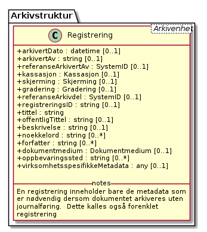 |I et ***klassediagram*** vises en klasse som en firkantet boks. ***Klassenavnet*** står i øverste «etasje», og er i eksempelet Registrering. ***Klasseattributtene*** karakteriserer klassen, og listes opp en i nest øverste etasje (i eksempelet i alt 7, den første/øverste har navnet arkivertDato). Firkanten kan også ha flere frivillige etasjer for å vise mer informasjon. I klassen Registrering vises en «etasje» med notes (ofte brukt for ***klassedefinisjon***) |
| | Klasser kan knyttes sammen med ***assosiasjoner***. Assosiasjoner vises som streker mellom to klasser. En assosiasjon der begge ender er knytta til samme klasse kalles ***selv-assosiasjon***. Eksempel: Mappe kan ha undermappe med samme struktur som mappa selv. Dette brukes der en trenger et hierarki av like klasser. En assosiasjon kan være ***aggregering***. Symbolet er en strek mellom to klasser med åpen diamant i ene enden. Eksempel: Ei Mappe ***har*** Registrering(er). En registrering er en selvstendig enhet, som «overlever» selv om Mappa blir sletta. |
|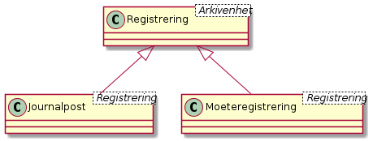 | Assosiasjoner kan være ***generalisering/spesialisering***. Symbolet er en strek med en trekant i ene enden. Eksempel er Basisregistrering som er en generalisering av Journalpost og Møteregistrering. En kan også si at Journalpost er en spesialisering av basisregistrering. I Basisregistrering legges alle felles-kjennetegnene. Felleskjennetegnene arves så ned på Journalpost og Møteregistrering. Dette leses som Journalpost ***er en*** Basisregistrering. Dersom en klasse er en spesialisering av en annen klasse som ikke er tatt med i diagrammet, skrives ofte navnet på den generaliserte klassen i øvre høyre hjørne av klasse-firkanten. I eksempelet kan vi derfor se at Basisregistrering er en spesialisering av Registrering, selv om klassen Registrering ikke finnes i diagrammet. |
|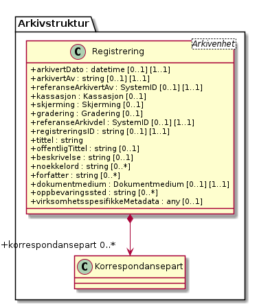 | En assosiasjon kan også være ***komposisjon***. Symbolet er en strek mellom to klasser med lukka diamant i den ene enden. En Basisregistrering ***har*** Korrespondansepart(er). En Korrespondansepart kan ikke eksistere uten at den er knytta til en mappe. Slettes («dør») basisregistreringen vil også korrespondanseparten bli sletta («vil dø»). Assosiasjonene forteller også hvilken vei de er ***navigerbare***. Symbolet for dette er piler i endene på streken. Eksempel: En basisregistrering «vet» hvilke korrespondansepart(er) som tilhører basisregistreringen, mens korrespondanseparten ikke vet hvilken basisregistrering den tilhører.|
| | ***Multiplisiteten*** forteller hvor mange forekomster som kan inngå. Multiplisitet kan brukes i forbindelse med assosiasjoner og også på klasseattributter. Dette vises med minst ett tall, men ofte to tall med to prikker mellom (0..1). Det første tallet angir minimums-multiplisitet (så mange det minst må være), det andre tallet er maksimumsmultiplisitet (så mange det maksimalt kan være). Eksempel: En Mappe kan høre til ingen eller en (0..1) Klasse, mens en Klasse kan «ha» ingen eller flere (0..***) Mapper(er). Stjernesymbol brukes til å angi «mange» (ubestemt tall større enn 1).En klasseattributt har angitt multiplisitet med klammeparenteser ([0..1]). Klasseattributten nøkkelord kan forekomme ingen eller en gang. Når det ikke er angitt multiplisitet, skal dette oftest tolkes som (1..1). En Klasse skal alltid ha en klasseID, og kan bare ha en.|
| | Datatypene kan også være ***simple datatyper*** eller ***primitiver***. Disse brukes for å gi mulighet for restriksjoner også på primitivene. Epostadresse kan være modellert som en slik primitiv. Epost er en tekst-streng, men som i tillegg til å være tekst-streng også må oppfylle visse regler knytta til det å være gyldig epostadresse (bl.a. inneholde en og bare en forekomst av tegnet @). I eksempelet i figuren er SystemID en tekststreng (string) som i tillegg må oppfylle tilleggskrav. I store modeller kan det være hensiktsmessig å plassere ulike modell-elementer i ulike pakker. Da kan det også bli lettere for leseren å forstå modellen når han får vite hvilken pakke de ulike klassene er plassert i. Modellpakker kalles ofte ***navnerom*** (namespace) Dette kan angis foran klassenavnet, skilt fra klassenavnet med kolon (:). I eksempelet hører klassen SystemID til pakken/navnerommet Metadata og klassen string tilhører pakken/navnerommet BasicTypes.|

## Noark5v4 

### Noark5 kjerne arkivstruktur

Diagrammet viser pakkene som inngår i arkivstruktur kjernen

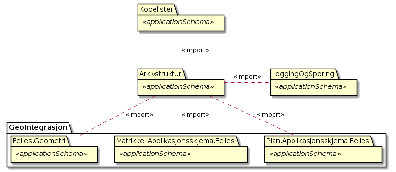

Figur: 1

### Noark5 spesialisering sakarkiv - (diagram)

Diagrammet viser oversikt over spesialiseringen sakarkiv

Figur: 2

### Noark5 struktur - (diagram)

Diagrammet viser oversikt over pakker som kan inngå i en noark kjerne.

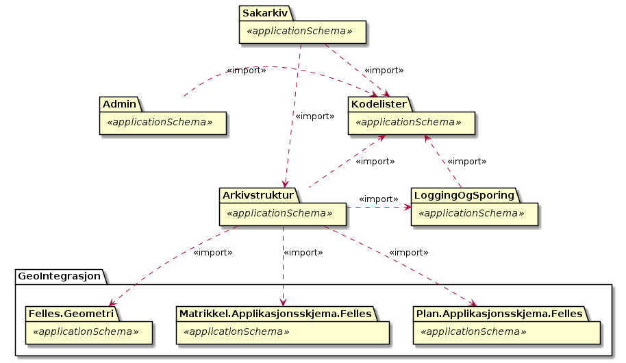

Figur: 3

### Noark5 elementlister - (diagram)

Diagrammet viser oversikt over alle klasser og hvor de er definert

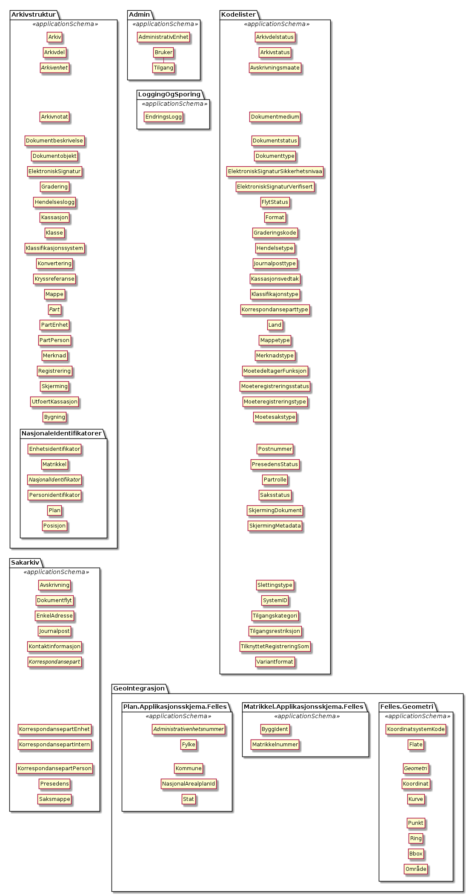

Figur: 4

### Arkivstruktur 

Basis skjema for arkivstruktur og indre kjerne

#### Arkivenheter - (diagram)

Figur: 5

#### BevaringOgKassasjon - (diagram)

Figur: 6

#### Hovedmodell - (diagram)

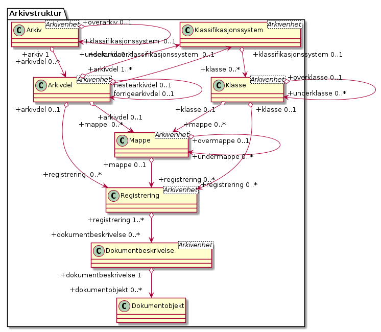

Figur: 7

#### Forenklet struktur - (diagram)

Figur: 8

#### Arkiv og arkivdel - (diagram)

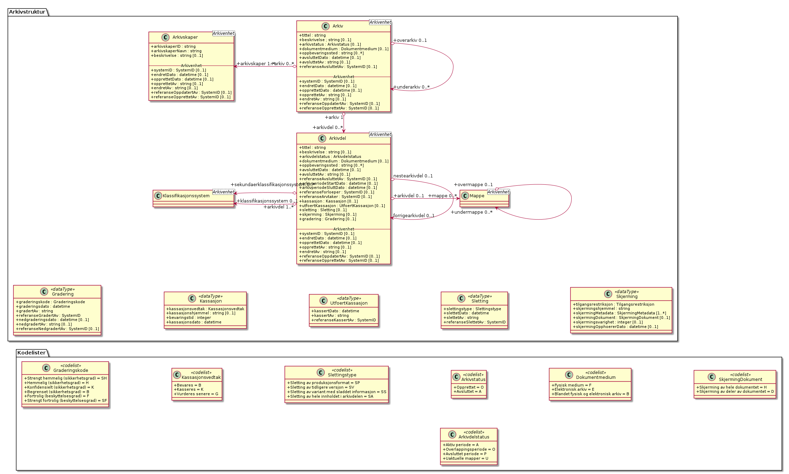

Figur: 9

#### Mappestrukturen - (diagram)

Figur: 10

#### Mappe - (diagram)

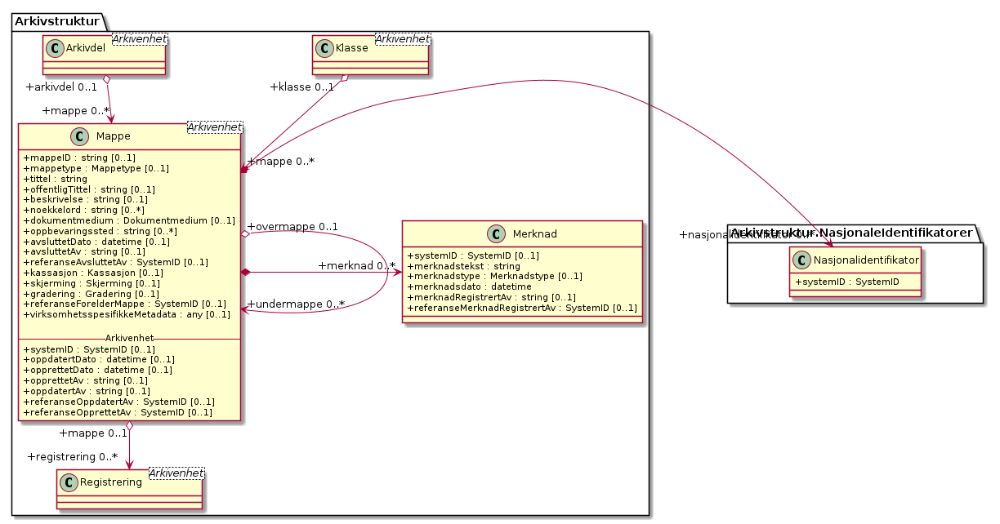

Figur: 11

#### Klassifikasjonssystem - (diagram)

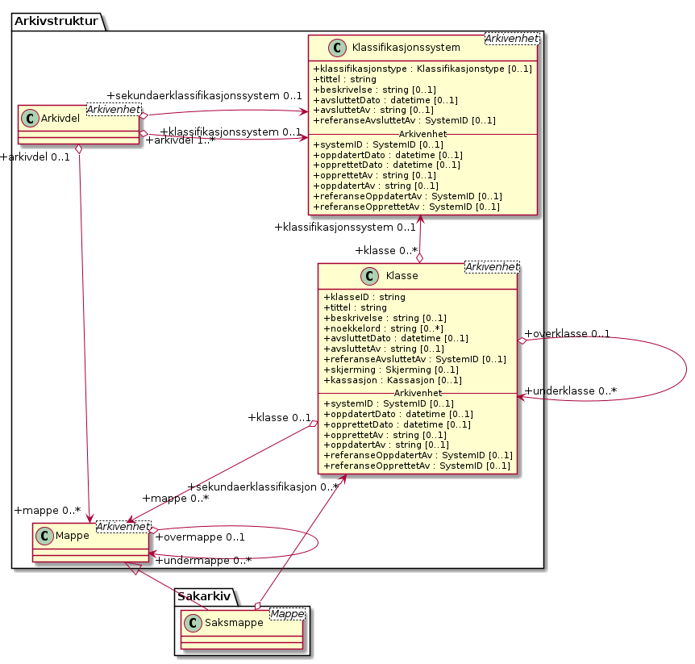

Figur: 12

#### Registrering - (diagram)

I fysiske sakarkiver har det vært vanlig å legge dokumenter som ikke
er journalføringspliktige - men som likevel er arkivpliktige (ikke
underlagt arkivbegrensning) - inn i saksomslaget uten at dette ble
registrert i journalen. Tilsvarende funksjonalitet bør også være mulig
i et elektronisk arkivsystem. Her må dokumentene nødvendigvis bli
registrert, men dette skal skje på en automatisk måte og med minst
mulig metadata. Denne typen dokumenter skal ikke kunne søkes fram
etter innhold, og de skal heller ikke inngå i den ordinære
identifikasjonen (nummereringen) av journalposter. Disse dokumentene
vil heller ikke komme på offentlig journal. Men de skal kunne inngå i
arkivuttrekk dersom de er bevaringsverdige, og det må være mulig å
skjerme dem internt. I Noark-4 ble dette kalt "loggede dokumenter". I
Noark 5 spesifiseres dette som en egen registreringstype kalt
registrering. En registrering inneholder alle metadata som er
nødvendig for å knytte registreringen til resten av
arkivstrukturen. Dette er metadata som også skal inngå i alle de andre
registreringstypene.  Metadata for registrering er derfor
obligatorisk, selv om det i selve løsningen ikke er implementert noen
funksjon for "arkivering uten journalføring".

Figur: 13

#### Merknad - (diagram)

Figur: 14

#### Dokumentbeskrivelse - (diagram)

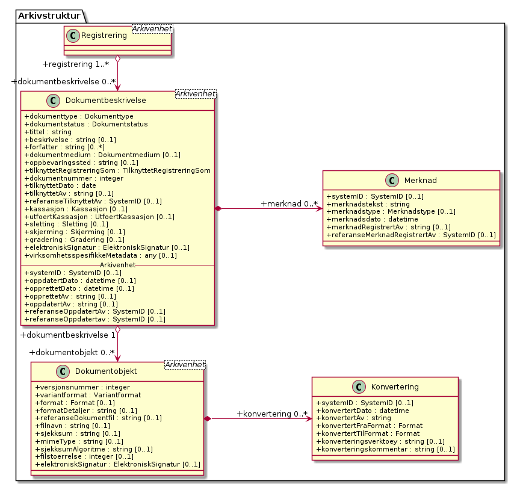

Figur: 15

#### Arkivstruktur med attributter  - (diagram)

Figur: 16

#### Kryssreferanse - (diagram)

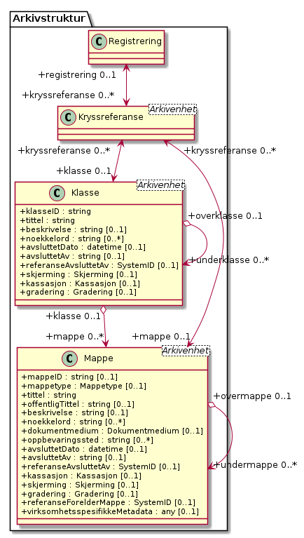

Figur: 17

#### Arkivstruktur alternativ - (diagram)

henter korrespondansepart objekt

Figur: 18

#### Skjerming - (diagram)

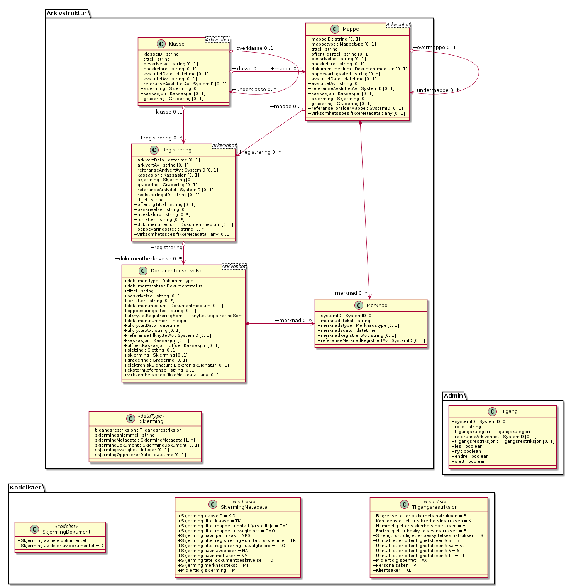

Figur: 19

#### Arkiv

*Type:* ***Class***

*Arver:* ***Arkivenhet***

Arkiv er det øverste nivået i arkivstrukturen. De fleste brukere vil
bare ha behov for å opprette ett arkiv i sin Noark 5-løsning. Men det
skal være mulig å opprette flere arkiver. Det kan være aktuelt dersom
flere organer deler samme løsning. Det kan også være aktuelt dersom en
hel etat deler samme løsning. Her kan da f.eks. hovedkontoret og hvert
distriktskontor settes opp med hvert sitt arkiv. Men ved elektronisk
arkivering er det heller ikke noe i veien for at hele etaten deler
samme arkiv, selv om de enkelte avdelinger er spredt over et stort
geografisk område.

Arkiv er obligatorisk i et arkivuttrekk. Toppnivået skal bare ha én
forekomst, men kan ha ett eller flere undernivåer, se om underarkiv
nedenfor. Et arkiv skal inneholde en eller flere arkivdeler. Dersom
arkivet består av underarkiver, skal arkivdel være knyttet til det
laveste nivået av disse.

*Relasjoner*

<table>
<thead>
<tr class="header">
<th><strong>Relasjon</strong></th>
<th><strong>Kilde</strong></th>
<th><strong>Mål</strong></th>
<th><strong>Merknad</strong></th>
</tr>
</thead>
<tbody>
<tr class="odd">
<td>
<strong>Aggregation</strong>

Destination -&gt; Source
</td>
<td>
underarkiv

0..*

Arkiv
</td>
<td>Arkiv</td>
<td></td>
</tr>
<tr class="even">
<td>
<strong>Generalization</strong>

Source -&gt; Destination
</td>
<td>Arkiv</td>
<td>Arkivenhet</td>
<td></td>
</tr>
<tr class="odd">
<td>
<strong>Aggregation</strong>

Bi-Directional
</td>
<td>
arkivskaper

1..*

Arkivskaper
</td>
<td>
arkiv

0..*

Arkiv
</td>
<td></td>
</tr>
<tr class="even">
<td>
<strong>Aggregation</strong>

Bi-Directional
</td>
<td>
arkivdel

0..*

Arkivdel
</td>
<td>
arkiv

1

Arkiv
</td>
<td></td>
</tr>
<tr class="odd">
<td>
<strong>Aggregation</strong>

Destination -&gt; Source
</td>
<td>
underarkiv

0..*

Arkiv
</td>
<td>Arkiv</td>
<td></td>
</tr>
</tbody>
</table>

*Relasjonsnøkler*

| **Tag**   | **Verdi**                                                      |
| --------- | -------------------------------------------------------------- |
| REST\_REL | http://rel.kxml.no/noark5/v4/api/metadata/dokumentmedium/      |
| REST\_REL | http://rel.kxml.no/noark5/v4/api/arkivstruktur/arkivskaper/    |
| REST\_REL | http://rel.kxml.no/noark5/v4/api/arkivstruktur/arkivdel/       |
| REST\_REL | http://rel.kxml.no/noark5/v4/api/arkivstruktur/arkiv/          |
| REST\_REL | self                                                           |
| REST\_REL | http://rel.kxml.no/noark5/v4/api/arkivstruktur/ny-arkivskaper/ |
| REST\_REL | http://rel.kxml.no/noark5/v4/api/arkivstruktur/underarkiv/     |
| REST\_REL | http://rel.kxml.no/noark5/v4/api/metadata/arkivstatus/         |
| REST\_REL | http://rel.kxml.no/noark5/v4/api/arkivstruktur/ny-arkivdel/    |
| REST\_REL | http://rel.kxml.no/noark5/v4/api/arkivstruktur/ny-arkiv/       |

*Attributter*

<table>
<thead>
<tr class="header">
<th><strong>Navn</strong></th>
<th><strong>Merknad</strong></th>
<th><strong>Multipl.</strong></th>
<th><strong>Kode</strong></th>
<th><strong>Type</strong></th>
</tr>
</thead>
<tbody>
<tr class="odd">
<td><strong>tittel</strong></td>
<td>
Definisjon: Tittel eller navn på arkivenheten

Kilde: Registreres manuelt eller hentes automatisk fra innholdet i arkivdokumentet. Ja fra klassetittel dersom alle mapper skal ha samme tittel som klassen. Kan også hentes automatisk fra et fagsystem.

Kommentarer: For saksmappe og journalpost vil dette tilsvare &quot;Sakstittel&quot; og &quot;Dokumentbeskrivelse&quot;. Disse navnene kan beholdes i grensesnittet.

M020
</td>
<td>[1..1]</td>
<td></td>
<td>string</td>
</tr>
<tr class="even">
<td><strong>beskrivelse</strong></td>
<td>
Definisjon: Tekstlig beskrivelse av arkivenheten

Kilde: Registreres manuelt

Kommentarer: Tilsvarende attributt finnes ikke i Noark 4 (men noen tabeller hadde egne attributter for merknad som kunne brukes som et beskrivelsesfelt)

M021
</td>
<td>[0..1]</td>
<td></td>
<td>string</td>
</tr>
<tr class="odd">
<td><strong>arkivstatus</strong></td>
<td>
Definisjon: Status til arkivet

Kilde: Registreres manuelt når arkivet opprettes eller ved skifte av status.

Kommentarer: (ingen)

M050
</td>
<td>[0..1]</td>
<td></td>
<td>Arkivstatus</td>
</tr>
<tr class="even">
<td><strong>dokumentmedium</strong></td>
<td>
Definisjon: Angivelse av om arkivenheten inneholder fysiske dokumenter, elektroniske dokumenter eller en blanding av fysiske og elektroniske dokumenter

Kilde: Arves fra overordnet nivå, kan overstyres manuelt

Kommentarer: Obligatorisk ved blanding av fysisk og elektronisk arkiv. Er hele arkivet enten fysisk eller elektronisk, er det tilstrekkelig med verdi på arkivnivå. Er en hel arkivdel enten fysisk eller elektronisk, er det tilstrekkelig å angi det på arkivdelnivå. Dersom underordnede arkivdeler inneholder både fysiske og elektroniske dokumenter, må informasjon om dette arves nedover i hierarkiet. Se også kommentar til M208 referanseArkivdel.

M300
</td>
<td>[0..1]</td>
<td></td>
<td>Dokumentmedium</td>
</tr>
<tr class="odd">
<td><strong>oppbevaringssted</strong></td>
<td>
Definisjon: Stedet hvor de fysiske dokumentene oppbevares. Kan være angivelse av rom, hylle, skap osv. Overordnede arkivdeler (f.eks. en arkivdel) kan oppbevares på flere steder.

Kilde: Arves fra overordnet nivå, kan overstyres manuelt

Kommentarer: Fysiske dokumenters plassering skal ellers gå fram av arkivstrukturen. Fysiske dokumenter i et sakarkiv skal i utgangspunktet være ordnet i overordnede omslag (f.eks. hengemapper) etter stigende klasseID. Innenfor hver av disse skal omslagene skal dokumentene ligge i fysiske saksmapper som er ordnet etter stigende mappeID. Innenfor saksmappene skal dokumentene være ordnet etter stigende journalpostnummer (&quot;dokumentnummer&quot;). Vedlegg skal legges sammen med tilhørende hoveddokument.

M301
</td>
<td>[0..*]</td>
<td></td>
<td>string</td>
</tr>
<tr class="even">
<td><strong>avsluttetDato</strong></td>
<td>
Definisjon: Dato og klokkeslett når arkivenheten ble avsluttet/lukket

Kilde: Registreres automatisk av systemet når enheten avsluttes

Kommentarer: (ingen)

M602
</td>
<td>[0..1]</td>
<td></td>
<td>datetime</td>
</tr>
<tr class="odd">
<td><strong>avsluttetAv</strong></td>
<td>
Definisjon: Navn på person som avsluttet/lukket arkivenheten

Kilde: Registreres automatisk av systemet ved opprettelse av enheten

Kommentarer: (ingen)

M603
</td>
<td>[0..1]</td>
<td></td>
<td>string</td>
</tr>
<tr class="even">
<td><strong>referanseAvsluttetAv</strong></td>
<td>referanse til Bruker sin systemID</td>
<td>[0..1]</td>
<td></td>
<td>SystemID</td>
</tr>
</tbody>
</table>

*Restriksjoner*

<table>
<thead>
<tr class="header">
<th><strong>Navn</strong></th>
<th><strong>Merknad</strong></th>
</tr>
</thead>
<tbody>
<tr class="odd">
<td>5.2.1 En Noark 5-løsning skal kunne bestå av ett eller flere selvstendige Arkiv</td>
<td></td>
</tr>
<tr class="even">
<td>5.2.2 Det skal være mulig å opprette ingen, ett eller flere Arkiv for en Arkivskaper (virksomhet) og det skal være mulig å angi at flere arkivskapere sammen skaper ett Arkiv.</td>
<td></td>
</tr>
<tr class="odd">
<td>5.2.3 Et Arkiv skal bestå av en eller flere arkivdeler og en Arkivdel skal inngå i (kun) ett Arkiv.</td>
<td></td>
</tr>
<tr class="even">
<td>5.2.4 Dersom Arkiv er registrert som ”Avsluttet”, skal det ikke være mulig å legge til flere underliggende Arkivdeler.</td>
<td></td>
</tr>
<tr class="odd">
<td>5.2.5 Når en tjeneste/funksjon sletter et helt Arkiv med alle underliggende nivå, skal dette logges.</td>
<td></td>
</tr>
<tr class="even">
<td>
5.2.6 Det skal ikke være mulig å endre dato for opprettelse av

Arkiv.
</td>
<td></td>
</tr>
<tr class="odd">
<td>
5.2.7 Det skal ikke være mulig å slette dato for opprettelse av

Arkiv.
</td>
<td></td>
</tr>
<tr class="even">
<td>
5.2.8 Det skal ikke være mulig å slette dato for avslutning av

Arkiv.
</td>
<td></td>
</tr>
<tr class="odd">
<td>
5.2.9 Det skal være mulig å definere statusverdier for Arkiv. Følgende verdier er anbefalt:

Opprettet, Avsluttet
</td>
<td></td>
</tr>
<tr class="even">
<td>5.2.10 Et Arkiv bør kunne inndeles i et hierarki (skissert i modellen ved bruk av egenrelasjon) av Underarkiver.</td>
<td>
/* Merknad: Det bør være mulig med ett eller flere nivåer under Arkiv, f.eks. for å representere fysiske delarkiver.

Dette kan være aktuelt for virksomheter som har arkiver

fysisk plassert på flere forskjellige steder.

*/
</td>
</tr>
<tr class="odd">
<td>5.2.11 Systemet bør ha en tjeneste/funksjon for å angi et Arkiv som Underarkiv til et Arkiv.</td>
<td></td>
</tr>
<tr class="even">
<td>5.2.12 Et Underarkiv skal kun opprettes og endres gjennom Administrasjonssystemet for Noark 5.</td>
<td></td>
</tr>
<tr class="odd">
<td>Ny - Når arkivet settes &quot;Avsluttet&quot; så skal avsluttetDato og avsluttetAv registreres</td>
<td></td>
</tr>
<tr class="even">
<td>Ny - Etter registrering av arkiv skal systemID, opprettetAv og opprettetDato være utfylt</td>
<td></td>
</tr>
<tr class="odd">
<td>
5.13.4 Et Arkiv og arkivets metadata skal kun opprettes

gjennom Administratorfunksjonen for Noark 5 kjerne.
</td>
<td></td>
</tr>
<tr class="even">
<td>
5.13.5 Et Underarkiv skal kun defineres og endres gjennom

Administratorfunksjonen for Noark 5 kjerne.
</td>
<td></td>
</tr>
<tr class="odd">
<td>avsluttetAv_M603A</td>
<td>avsluttetAv: Skal ikke kunne endres</td>
</tr>
<tr class="even">
<td>avsluttetAv_M603B</td>
<td>avsluttetAv: Obligatorisk dersom arkivenheten er avsluttet.</td>
</tr>
<tr class="odd">
<td>avsluttetDato_M602A</td>
<td>avsluttetDato: Skal ikke kunne endres.</td>
</tr>
<tr class="even">
<td>avsluttetDato_M602B</td>
<td>avsluttetDato: Obligatorisk dersom arkivenheten er avsluttet.</td>
</tr>
<tr class="odd">
<td>tittel_M020</td>
<td>tittel: Skal normalt ikke kunne endres etter at enheten er lukket, eller dokumentene arkivert</td>
</tr>
</tbody>
</table>

#### Arkivdel

*Type:* ***Class***

*Arver:* ***Arkivenhet***

Et arkiv skal kunne deles opp i arkivdeler for å gruppere arkivet
etter overordnede kriterier. De viktigste kriteriene for oppdeling i
arkivdeler er:

 - Skille mellom aktivt arkiv og avsluttede arkivperioder
   (tradisjonelt kalt bortsettingsarkiver). Viktige funksjoner i
   forbindelse med periodisering og produksjon av arkivuttrekk er
   knyttet til en arkivdel.
 - Skille mellom mapper som skal periodiseres etter forskjellige
   prinsipper. Emneordnede saksmapper kan periodiseres f.eks. hvert
   femte år, mens personalmapper kan beholdes i et aktiv arkiv så
   lenge en person er ansatt.
 - Skille mellom saksmapper som er klassifisert etter forskjellige
   prinsipper.
 - Skille mellom elektronisk arkiv og fysisk arkiv. Hovedregelen er at
   hele mapper enten skal være fysiske eller elektroniske. Men det kan
   gis dispensasjon fra denne regelen, slik at enkelte registreringer
   kan være fysiske og andre elektroniske i samme mappe.  Dersom et
   stort vedlegg (f.eks. en trykksak) ikke er blitt skannet, kan også
   fysiske dokumenter forekomme sammen med elektroniske dokumenter i
   samme registrering (journalpost).
 - Skille mellom sakarkivet og andre typer arkiver, f.eks. arkiver
   tilknyttet fagsystemer.  Noen vil ha behov for et klart skille
   mellom de administrative sakene og fagsakene. Det vil også være et
   behov for å skille ut møtedokumenter.
 - Skille mellom mapper, registreringer eller dokumenttyper som skal
   bevares eller som skal kasseres.
 - Skille mellom mapper, registreringer eller dokumenttyper som er
   offentlige eller som skal skjermes.

Arkivdel er obligatorisk i et arkivuttrekk, og skal forekomme én eller
flere ganger i et arkiv.  Dersom arkivet er delt opp i underarkiver,
skal arkivdel bare kunne knyttes til det laveste arkivnivået. Dersom
det dreier seg om et sakarkiv, skal arkivdelen inneholde et primært
klassifikasjonssystem. Arkivdelen kan i tillegg inneholde et eller
flere sekundære klassifikasjonssystemer. I et fagsystem uten
klassifikasjon, skal arkivdelen inneholde én eller flere mapper. I et
fagsystem uten klassifikasjon og mapper, skal arkivdelen inneholde én
eller flere registreringer.

Arkivdeler kan brukes til å skille ut dokumenter som skal kasseres
etter andre regler enn resten av dokumentene i mappen (f.eks. alle
inngående dokumenter) eller registreringen (f.eks. alle
vedlegg). Slike regler kan da knyttes til en egen arkivdel.  Se mer om
dette i NOARK 5 v3.1 kapittel 5.10 Bevaring og kassasjon, om kassasjon
av dokumenttyper.  Det samme gjelder dokumenter som skal skjermes
etter andre regler enn resten av dokumentene i mappen eller
registreringen. Se mer under NOARK 5 v3.1 kapittel 6.6.1 Skjerming.

Dessuten kan det være tilfeller hvor noen dokumenter i en mappe eller
registrering er arkivert på papir, mens resten av dokumentene er
elektroniske. En egen arkivdel skiller da ut disse dokumentene.

Arkivdeler som brukes til å angi andre kassasjonsvedtak,
skjermingsregler og dokumentmedium enn de som gjelder for resten av
innholdet i arkivet, vil være "tomme" – dvs. de har ikke egne
barn. Mapper, registreringer og dokumentbeskrivelse som har referanse
til slike arkivdeler, skal arve metadata fra disse. Disse mappene,
registreringene og dokumentbeskrivelsene vil indirekte også tilhøre
arkivdelen som er utgangspunktet for den hierarkiske arkivstrukturen,
men arv herfra blir overstyrt.

*Relasjoner*

<table>
<thead>
<tr class="header">
<th><strong>Relasjon</strong></th>
<th><strong>Kilde</strong></th>
<th><strong>Mål</strong></th>
<th><strong>Merknad</strong></th>
</tr>
</thead>
<tbody>
<tr class="odd">
<td>
<strong>Generalization</strong>

Source -&gt; Destination
</td>
<td>Arkivdel</td>
<td>Arkivenhet</td>
<td></td>
</tr>
<tr class="even">
<td>
<strong>Aggregation</strong>

Bi-Directional
</td>
<td>
arkivdel

0..*

Arkivdel
</td>
<td>
arkiv

1

Arkiv
</td>
<td></td>
</tr>
<tr class="odd">
<td>
<strong>Aggregation</strong>

Bi-Directional
</td>
<td>
klassifikasjonssystem

0..1

Klassifikasjonssystem
</td>
<td>
arkivdel

1..*

Arkivdel
</td>
<td></td>
</tr>
<tr class="even">
<td>
<strong>Aggregation</strong>

Bi-Directional
</td>
<td>
registrering

0..*

Registrering
</td>
<td>
arkivdel

0..1

Arkivdel
</td>
<td></td>
</tr>
<tr class="odd">
<td>
<strong>Aggregation</strong>

Bi-Directional
</td>
<td>
mappe

0..*

Mappe
</td>
<td>
arkivdel

0..1

Arkivdel
</td>
<td></td>
</tr>
<tr class="even">
<td>
<strong>Aggregation</strong>

Destination -&gt; Source
</td>
<td>
sekundærklassifikasjonssystem

0..*

Klassifikasjonssystem
</td>
<td>Arkivdel</td>
<td></td>
</tr>
</tbody>
</table>

*Relasjonsnøkler*

| **Tag**   | **Verdi**                                                                |
| --------- | ------------------------------------------------------------------------ |
| REST\_REL | http://rel.kxml.no/noark5/v4/api/arkivstruktur/ny-arkivdel/              |
| REST\_REL | http://rel.kxml.no/noark5/v4/api/arkivstruktur/ny-registrering/          |
| REST\_REL | http://rel.kxml.no/noark5/v4/api/arkivstruktur/ny-mappe/                 |
| REST\_REL | http://rel.kxml.no/noark5/v4/api/arkivstruktur/ny-arkiv/                 |
| REST\_REL | http://rel.kxml.no/noark5/v4/api/arkivstruktur/arkivdel/                 |
| REST\_REL | http://rel.kxml.no/noark5/v4/api/arkivstruktur/ny-klassifikasjonssystem/ |
| REST\_REL | http://rel.kxml.no/noark5/v4/api/arkivstruktur/registrering/             |
| REST\_REL | http://rel.kxml.no/noark5/v4/api/arkivstruktur/klassifikasjonssystem/    |
| REST\_REL | http://rel.kxml.no/noark5/v4/api/arkivstruktur/arkiv/                    |
| REST\_REL | http://rel.kxml.no/noark5/v4/api/arkivstruktur/mappe/                    |
| REST\_REL | http://rel.kxml.no/noark5/v4/api/metadata/dokumentmedium/                |
| REST\_REL | http://rel.kxml.no/noark5/v4/api/metadata/arkivdelstatus/                |
| REST\_REL | self                                                                     |

*Attributter*

<table>
<thead>
<tr class="header">
<th><strong>Navn</strong></th>
<th><strong>Merknad</strong></th>
<th><strong>Multipl.</strong></th>
<th><strong>Kode</strong></th>
<th><strong>Type</strong></th>
</tr>
</thead>
<tbody>
<tr class="odd">
<td><strong>tittel</strong></td>
<td>
Definisjon: Tittel eller navn på arkivenheten

Kilde: Registreres manuelt eller hentes automatisk fra innholdet i arkivdokumentet. Ja fra klassetittel dersom alle mapper skal ha samme tittel som klassen. Kan også hentes automatisk fra et fagsystem.

Kommentarer: For saksmappe og journalpost vil dette tilsvare &quot;Sakstittel&quot; og &quot;Dokumentbeskrivelse&quot;. Disse navnene kan beholdes i grensesnittet.

M020
</td>
<td>[1..1]</td>
<td></td>
<td>string</td>
</tr>
<tr class="even">
<td><strong>beskrivelse</strong></td>
<td>
Definisjon: Tekstlig beskrivelse av arkivenheten

Kilde: Registreres manuelt

Kommentarer: Tilsvarende attributt finnes ikke i Noark 4 (men noen tabeller hadde egne attributter for merknad som kunne brukes som et beskrivelsesfelt)

M021
</td>
<td>[0..1]</td>
<td></td>
<td>string</td>
</tr>
<tr class="odd">
<td><strong>arkivdelstatus</strong></td>
<td>
Definisjon: Status til den arkivperioden som arkivdelen omfatter

Kilde: Registreres manuelt når arkivdelen opprettes eller ved skifte av status.

Kommentarer: Arkivdeler som avleveres skal ha status &quot;Avsluttet periode&quot;

M051
</td>
<td>[1..1]</td>
<td></td>
<td>Arkivdelstatus</td>
</tr>
<tr class="even">
<td><strong>dokumentmedium</strong></td>
<td>
Definisjon: Angivelse av om arkivenheten inneholder fysiske dokumenter, elektroniske dokumenter eller en blanding av fysiske og elektroniske dokumenter

Kilde: Arves fra overordnet nivå, kan overstyres manuelt

Kommentarer: Obligatorisk ved blanding av fysisk og elektronisk arkiv. Er hele arkivet enten fysisk eller elektronisk, er det tilstrekkelig med verdi på arkivnivå. Er en hel arkivdel enten fysisk eller elektronisk, er det tilstrekkelig å angi det på arkivdelnivå. Dersom underordnede arkivdeler inneholder både fysiske og elektroniske dokumenter, må informasjon om dette arves nedover i hierarkiet. Se også kommentar til M208 referanseArkivdel.

M300
</td>
<td>[0..1]</td>
<td></td>
<td>Dokumentmedium</td>
</tr>
<tr class="odd">
<td><strong>oppbevaringssted</strong></td>
<td>
Definisjon: Stedet hvor de fysiske dokumentene oppbevares. Kan være angivelse av rom, hylle, skap osv. Overordnede arkivdeler (f.eks. en arkivdel) kan oppbevares på flere steder.

Kilde: Arves fra overordnet nivå, kan overstyres manuelt

Kommentarer: Fysiske dokumenters plassering skal ellers gå fram av arkivstrukturen. Fysiske dokumenter i et sakarkiv skal i utgangspunktet være ordnet i overordnede omslag (f.eks. hengemapper) etter stigende klasseID. Innenfor hver av disse skal omslagene skal dokumentene ligge i fysiske saksmapper som er ordnet etter stigende mappeID. Innenfor saksmappene skal dokumentene være ordnet etter stigende journalpostnummer (&quot;dokumentnummer&quot;). Vedlegg skal legges sammen med tilhørende hoveddokument.

M301
</td>
<td>[0..*]</td>
<td></td>
<td>string</td>
</tr>
<tr class="even">
<td><strong>avsluttetDato</strong></td>
<td>
Definisjon: Dato og klokkeslett når arkivenheten ble avsluttet/lukket

Kilde: Registreres automatisk av systemet når enheten avsluttes

Kommentarer: (ingen)

M602
</td>
<td>[0..1]</td>
<td></td>
<td>datetime</td>
</tr>
<tr class="odd">
<td><strong>avsluttetAv</strong></td>
<td>
Definisjon: Navn på person som avsluttet/lukket arkivenheten

Kilde: Registreres automatisk av systemet ved opprettelse av enheten

Kommentarer: (ingen)

M603
</td>
<td>[0..1]</td>
<td></td>
<td>string</td>
</tr>
<tr class="even">
<td><strong>referanseAvsluttetAv</strong></td>
<td></td>
<td>[0..1]</td>
<td></td>
<td>SystemID</td>
</tr>
<tr class="odd">
<td><strong>arkivperiodeStartDato</strong></td>
<td>
Definisjon: Dato for starten av en arkivperiode

Kilde: Settes automatisk til samme dato som M600 opprettetDato

Kommentarer: Det kan tenkes tilfeller hvor startdatoen ikke er identisk med datoen arkivdelen ble opprettet

M107
</td>
<td>[0..1]</td>
<td></td>
<td>date</td>
</tr>
<tr class="even">
<td><strong>arkivperiodeSluttDato</strong></td>
<td>
Definisjon: Dato for slutten av en arkivperiode

Kilde: Settes automatisk til samme dato som M602 avsluttetDato

Kommentarer: Det kan forekomme tilfeller hvor sluttdatoen ikke er identisk med datoen arkivdelen ble avsluttet.

M108
</td>
<td>[0..1]</td>
<td></td>
<td>date</td>
</tr>
<tr class="odd">
<td><strong>referanseForløper</strong></td>
<td>M202</td>
<td>[0..1]</td>
<td></td>
<td>SystemID</td>
</tr>
<tr class="even">
<td><strong>referanseArvtaker</strong></td>
<td>M203</td>
<td>[0..1]</td>
<td></td>
<td>SystemID</td>
</tr>
<tr class="odd">
<td><strong>kassasjon</strong></td>
<td></td>
<td>[0..1]</td>
<td></td>
<td>Kassasjon</td>
</tr>
<tr class="even">
<td><strong>utførtKassasjon</strong></td>
<td></td>
<td>[0..1]</td>
<td></td>
<td>UtførtKassasjon</td>
</tr>
<tr class="odd">
<td><strong>sletting</strong></td>
<td></td>
<td>[0..1]</td>
<td></td>
<td>Sletting</td>
</tr>
<tr class="even">
<td><strong>skjerming</strong></td>
<td></td>
<td>[0..1]</td>
<td></td>
<td>Skjerming</td>
</tr>
<tr class="odd">
<td><strong>gradering</strong></td>
<td></td>
<td>[0..1]</td>
<td></td>
<td>Gradering</td>
</tr>
</tbody>
</table>

*Restriksjoner*

<table>
<thead>
<tr class="header">
<th><strong>Navn</strong></th>
<th><strong>Merknad</strong></th>
</tr>
</thead>
<tbody>
<tr class="odd">
<td>
5.2.13 En Arkivdel kan ha registrert ingen eller ett preferert

Klassifikasjonssystem og et Klassifikasjonssystem kan

inngå i ingen, en eller flere Arkivdel(er).
</td>
<td></td>
</tr>
<tr class="even">
<td>
5.2.14 En Arkivdel kan ha registrert ingen eller en Skjerming og

en Skjerming kan inngå i ingen, en eller flere Arkivdeler
</td>
<td></td>
</tr>
<tr class="odd">
<td>
5.2.15 En Arkivdel kan ha registrert ingen eller en Bevaring og

kassasjon og en Bevaring og kassasjon kan inngå i ingen,

en eller flere Arkivdeler.
</td>
<td></td>
</tr>
<tr class="even">
<td>
5.2.16 En Arkivdel kan ha tilknyttet (inneholde) ingen, en eller

flere Mapper.
</td>
<td></td>
</tr>
<tr class="odd">
<td>
5.2.17 Når en tjeneste/funksjon sletter en Arkivdel, skal dette

logges.
</td>
<td></td>
</tr>
<tr class="even">
<td>
5.2.18 Det skal finnes en tjeneste/funksjon for å ajourholde

primært Klassifikasjonssystem for en Arkivdel.

(referanseKlassifikasjonssystem)
</td>
<td></td>
</tr>
<tr class="odd">
<td>
5.2.19 Dersom Arkivdel er registrert som avsluttet (avsluttetDato

er satt) skal det ikke være mulig å legge til flere

tilhørende Mapper eller Registreringer
</td>
<td></td>
</tr>
<tr class="even">
<td>
5.2.20 En arkivdel skal inneholde informasjon om hvilken

status arkivperioden har.
</td>
<td>
/*

Autoriserte brukere skal kunne

endre statusverdier. Obligatoriske verdier er:

1. Aktiv periode

2. Overlappingsperiode

3. Avsluttet periode

Andre verdier kan brukes ved behov.

*/
</td>
</tr>
<tr class="odd">
<td>
5.2.21 En arkivdel skal inneholde dato for når arkivperioden

starter.
</td>
<td></td>
</tr>
<tr class="even">
<td>
5.2.22 En avsluttet arkivdel skal inneholde dato for når

perioden ble avsluttet.
</td>
<td></td>
</tr>
<tr class="odd">
<td>
5.2.23 En arkivdel skal inneholde informasjon om de

tilhørende dokumentene er fysiske eller elektroniske.
</td>
<td></td>
</tr>
<tr class="even">
<td>Ny - arkivdel kan ha liste med enten klassifikasjonssystem eller mapper</td>
<td></td>
</tr>
<tr class="odd">
<td>Ny - Når arkivdel settes &quot;Avsluttet&quot; så skal avsluttetDato og avsluttetAv registreres</td>
<td></td>
</tr>
<tr class="even">
<td>Ny - Etter registrering av arkivdel skal systemID, opprettetAv og opprettetDato være utfylt</td>
<td></td>
</tr>
<tr class="odd">
<td>
5.10.1 En Arkivdel skal kunne ha registrert ingen eller ett

Kassasjonsvedtak og et Kassasjonsvedtak kan inngå i

ingen, en eller flere Arkivdeler.
</td>
<td></td>
</tr>
<tr class="even">
<td>
5.10.8 Det skal finnes en tjeneste/funksjon for å ajourholde

kassasjonsvedtak, kassasjonshjemmel og bevaringstid

for en Arkivdel.
</td>
<td></td>
</tr>
<tr class="odd">
<td>
5.10.9 Metadata om bevaring og kassasjon på en Arkivdel skal

kunne arves til Mappe, Registrering og

Dokumentbeskrivelse.
</td>
<td></td>
</tr>
<tr class="even">
<td>
5.10.10 Dersom arv av metadata om bevaring og kassasjon skal

skje fra arkivdel, skal dette overstyre arv av metadata fra

klassene.
</td>
<td></td>
</tr>
<tr class="odd">
<td>
5.10.16 Det skal være mulig å slå av funksjonen for arv fra

klasser og arkivdeler, slik at metadata om bevaring og

kassasjon ikke arves til underliggende mapper.
</td>
<td></td>
</tr>
<tr class="even">
<td>
5.11.1 En arkivdel skal kunne inneholde en tekstlig beskrivelse

av hvilke prinsipper den skal periodiseres etter.
</td>
<td></td>
</tr>
<tr class="odd">
<td>
5.11.2 En arkivdel skal inneholde referanser til eventuelle

forløpere og arvtakere.
</td>
<td></td>
</tr>
<tr class="even">
<td>
5.11.4 En arkivdel som inneholder en overlappingsperiode,

skal være sperret for tilføyelse av nyopprettede mapper.

Men eksisterende mapper i en overlappingsperiode skal

være åpne for nye registreringer
</td>
<td></td>
</tr>
<tr class="odd">
<td>
5.11.5 Dersom en ny registrering føyes til en mappe som

tilhører en arkivdel i overlappingsperiode, skal mappen

automatisk overføres til arkivdelens arvtaker.
</td>
<td></td>
</tr>
<tr class="even">
<td>
5.11.6 En arkivdel som inneholder en avsluttet arkivperiode,

skal være sperret for tilføyelse av nye mapper. Alle

mapper skal være lukket, slik at heller ingen

registreringer og dokumenter kan føyes til.
</td>
<td></td>
</tr>
<tr class="odd">
<td>
5.11.7 Det skal være umulig å avslutte en arkivdel i

overlappingsperiode dersom den fremdeles inneholder

åpne mapper.
</td>
<td></td>
</tr>
<tr class="even">
<td>
5.11.13 Dersom dokumentene i en arkivdel er ikke-elektroniske

(fysiske), skal det også være mulig å registrere

oppbevaringssted.
</td>
<td></td>
</tr>
<tr class="odd">
<td>
5.13.6 En Arkivdel og arkivdelens metadata skal kun opprettes

og endres gjennom Administratorfunksjonen for

Noark 5 kjerne.
</td>
<td></td>
</tr>
<tr class="even">
<td>6.6.9 - 6.6.19 rettighetsangivelser</td>
<td></td>
</tr>
<tr class="odd">
<td>
6.6.25 Det skal finnes en tjeneste/funksjon for å ajourholde

opplysninger om skjermingskode (skjermingsgrad,

skjermingshjemmel og skjermingsvarighet) for en verdi

av Arkivdel, klasse, Mappe, Registrering og

Dokumentbeskrivelse
</td>
<td></td>
</tr>
<tr class="even">
<td>
6.6.26 Skjerming bør kunne arves til mappe, journalpost,

dokumentbeskrivelse og dokumentobjekt.

Arvede verdier skal kunne overstyres.
</td>
<td></td>
</tr>
<tr class="odd">
<td>M020 tittel: Skal normalt ikke kunne endres etter at enheten er lukket, eller dokumentene arkivert</td>
<td></td>
</tr>
<tr class="even">
<td>M107 arkivperiodeStartDato: Skal kunne endres manuelt</td>
<td></td>
</tr>
<tr class="odd">
<td>M108 arkivperiodeSluttDato: Skal kunne endres manuelt</td>
<td></td>
</tr>
<tr class="even">
<td>M601 avsluttetDato: Skal ikke kunne endres. Obligatorisk dersom arkivdelen er avsluttet.</td>
<td></td>
</tr>
<tr class="odd">
<td>M603 avsluttetAv: Skal ikke kunne endres. Obligatorisk dersom arkivenheten er avsluttet.</td>
<td></td>
</tr>
</tbody>
</table>

#### Arkivenhet

*Type:* ***Class***

*Arver:* 

En arkivenhet (se NOARK 5 v3.1 krav 5.1.2 og 5.1.3) skal kunne
identifiseres entydig innenfor det arkivskapende organet. I et
arkivuttrekk skal denne identifikasjonen hete systemID, og være
entydig på tvers av alle uttrekk som organet produserer, dermed også
på tvers av alle systemer organet benytter. Også arkivenheter som
dupliseres i et arkivuttrekk, skal identifiseres entydig, slik at
identiske arkivenheter har ulik systemID.

*Relasjoner*

<table>
<thead>
<tr class="header">
<th><strong>Relasjon</strong></th>
<th><strong>Kilde</strong></th>
<th><strong>Mål</strong></th>
<th><strong>Merknad</strong></th>
</tr>
</thead>
<tbody>
<tr class="odd">
<td>
<strong>Generalization</strong>

Source -&gt; Destination
</td>
<td>Arkivdel</td>
<td>Arkivenhet</td>
<td></td>
</tr>
<tr class="even">
<td>
<strong>Aggregation</strong>

Destination -&gt; Source
</td>
<td>
logg

0..*

Hendelseslogg
</td>
<td>
0..1

Arkivenhet
</td>
<td></td>
</tr>
<tr class="odd">
<td>
<strong>Generalization</strong>

Source -&gt; Destination
</td>
<td>Klassifikasjonssystem</td>
<td>Arkivenhet</td>
<td></td>
</tr>
<tr class="even">
<td>
<strong>Generalization</strong>

Source -&gt; Destination
</td>
<td>Arkiv</td>
<td>Arkivenhet</td>
<td></td>
</tr>
<tr class="odd">
<td>
<strong>Generalization</strong>

Source -&gt; Destination
</td>
<td>Mappe</td>
<td>Arkivenhet</td>
<td></td>
</tr>
<tr class="even">
<td>
<strong>Generalization</strong>

Source -&gt; Destination
</td>
<td>Klasse</td>
<td>Arkivenhet</td>
<td></td>
</tr>
<tr class="odd">
<td>
<strong>Generalization</strong>

Source -&gt; Destination
</td>
<td>Arkivskaper</td>
<td>Arkivenhet</td>
<td></td>
</tr>
<tr class="even">
<td>
<strong>Generalization</strong>

Source -&gt; Destination
</td>
<td>Registrering</td>
<td>Arkivenhet</td>
<td></td>
</tr>
<tr class="odd">
<td>
<strong>Generalization</strong>

Source -&gt; Destination
</td>
<td>Dokumentbeskrivelse</td>
<td>Arkivenhet</td>
<td></td>
</tr>
</tbody>
</table>

*Relasjonsnøkler*

| **Tag**   | **Verdi**                                                        |
| --------- | ---------------------------------------------------------------- |
| NEW       | 5.4.0                                                            |
| REST\_REL | http://rel.kxml.no/noark5/v4/api/arkivstruktur/ny-hendelseslogg/ |
| REST\_REL | http://rel.kxml.no/noark5/v4/api/arkivstruktur/logg/             |

*Attributter*

<table>
<thead>
<tr class="header">
<th><strong>Navn</strong></th>
<th><strong>Merknad</strong></th>
<th><strong>Multipl.</strong></th>
<th><strong>Kode</strong></th>
<th><strong>Type</strong></th>
</tr>
</thead>
<tbody>
<tr class="odd">
<td><strong>systemID</strong></td>
<td>
M001

Entydig identifikasjon av arkivenheten innenfor det arkivskapende organet. Dersom organet har flere arkivsystemer, skal altså <em>systemID</em> være gjennomgående entydig. Systemidentifikasjonen vil som oftest være en nummerisk kode uten noe logisk meningsinnhold. Identifikasjonen trenger ikke å være synlig for brukerne.

Registreres automatisk av systemet

Skal ikke kunne endres

Alle referanser fra en arkivenhet til en annen skal peke til arkivenhetens systemidentifikasjon. Dette gjelder også referanser fra en arkivdel til en annen, f.eks. mellom to arkivperioder som avleveres på forskjellig tidspunkt. I et arkivuttrekk skal <em>systemID</em> være entydig (unik). Dokumentobjekt har ingen systemidentifikasjon fordi enheten kan være duplisert i et arkivuttrekk dersom samme dokumentfil er knyttet til flere forskjellige registreringer.
</td>
<td>[0..1]</td>
<td></td>
<td>SystemID</td>
</tr>
<tr class="even">
<td><strong>oppdatertDato</strong></td>
<td></td>
<td>[0..1]</td>
<td></td>
<td>datetime</td>
</tr>
<tr class="odd">
<td><strong>opprettetDato</strong></td>
<td>
Definisjon: Dato og klokkeslett når arkivenheten ble opprettet/registrert

Kilde: Registreres automatisk av systemet ved opprettelse av enheten

Kommentarer: (ingen)

M600
</td>
<td>[0..1]</td>
<td></td>
<td>datetime</td>
</tr>
<tr class="even">
<td><strong>opprettetAv</strong></td>
<td>
Definisjon: Navn på person som opprettet/registrerte arkivenheten

Kilde: Registreres automatisk av systemet ved opprettelse av enheten

Kommentarer: (ingen)

M601
</td>
<td>[0..1]</td>
<td></td>
<td>string</td>
</tr>
<tr class="odd">
<td><strong>oppdatertAv</strong></td>
<td>
Definisjon: Navn på person som oppdaterte arkivenheten

Kilde: Registreres automatisk av systemet ved oppdatering av enheten
</td>
<td>[0..1]</td>
<td></td>
<td>string</td>
</tr>
<tr class="even">
<td><strong>referanseOppdatertAv</strong></td>
<td>
Definisjon: SystemID på person som oppdaterte arkivenheten

Kilde: Registreres automatisk av systemet ved oppdatering av enheten
</td>
<td>[0..1]</td>
<td></td>
<td>SystemID</td>
</tr>
<tr class="odd">
<td><strong>referanseOpprettetAv</strong></td>
<td>
Definisjon: SystemID på person som opprettet/registrerte arkivenheten

Kilde: Registreres automatisk av systemet ved opprettelse av enheten
</td>
<td>[0..1]</td>
<td></td>
<td>SystemID</td>
</tr>
</tbody>
</table>

*Restriksjoner*

| **Navn**                                          | **Merknad** |
| ------------------------------------------------- | ----------- |
| Ny - Etter registrering skal systemID være utfylt |             |
| M001 systemID: Skal ikke kunne endres             |             |
| M600 opprettetDato: Skal ikke kunne endres        |             |
| M601 opprettetAv: Skal ikke kunne endres          |             |

#### Arkivskaper

*Type:* ***Class***

*Arver:* ***Arkivenhet***

Tradisjonelt har et arkiv blitt definert etter organisasjon. Ett organ
skaper ett arkiv, dvs.  organet er arkivskaperen. Men elektronisk
informasjonsteknologi har ført til at det blir stadig vanligere at
flere arkivskapere sammen skaper ett arkiv. Arkivet vil da være
definert etter funksjon, ikke organisasjon.

I en Noark 5-løsning skal det altså være mulig å knytte en eller flere
arkivskapere til ett arkiv.  Informasjon om arkivskapere er
obligatorisk i arkivuttrekk.

*Relasjoner*

<table>
<thead>
<tr class="header">
<th><strong>Relasjon</strong></th>
<th><strong>Kilde</strong></th>
<th><strong>Mål</strong></th>
<th><strong>Merknad</strong></th>
</tr>
</thead>
<tbody>
<tr class="odd">
<td>
<strong>Aggregation</strong>

Bi-Directional
</td>
<td>
arkivskaper

1..*

Arkivskaper
</td>
<td>
arkiv

0..*

Arkiv
</td>
<td></td>
</tr>
<tr class="even">
<td>
<strong>Generalization</strong>

Source -&gt; Destination
</td>
<td>Arkivskaper</td>
<td>Arkivenhet</td>
<td></td>
</tr>
</tbody>
</table>

*Relasjonsnøkler*

| **Tag**   | **Verdi**                                                      |
| --------- | -------------------------------------------------------------- |
| REST\_REL | http://rel.kxml.no/noark5/v4/api/arkivstruktur/arkivskaper/    |
| REST\_REL | self                                                           |
| REST\_REL | http://rel.kxml.no/noark5/v4/api/arkivstruktur/ny-arkivskaper/ |
| REST\_REL | http://rel.kxml.no/noark5/v4/api/arkivstruktur/ny-arkiv/       |
| REST\_REL | http://rel.kxml.no/noark5/v4/api/arkivstruktur/arkiv/          |

*Attributter*

<table>
<thead>
<tr class="header">
<th><strong>Navn</strong></th>
<th><strong>Merknad</strong></th>
<th><strong>Multipl.</strong></th>
<th><strong>Kode</strong></th>
<th><strong>Type</strong></th>
</tr>
</thead>
<tbody>
<tr class="odd">
<td><strong>arkivskaperID</strong></td>
<td>
Definisjon: Unik ID for arkivskaperen

Kilde: Registreres manuelt ved opprettelsen av arkivet

Kommentar: Kan være organisasjonsnummer (Brønnøysundregistrene) eller annen identifikasjon avtalt med arkivdepotet

M006
</td>
<td>[1..1]</td>
<td></td>
<td>string</td>
</tr>
<tr class="even">
<td><strong>arkivskaperNavn</strong></td>
<td>
Definisjon: Navn på organisasjonen som har skapt arkivet

Kilde: Registreres manuelt ved opprettelsen av arkivet.

Kommentarer: (ingen)

M023
</td>
<td>[1..1]</td>
<td></td>
<td>string</td>
</tr>
<tr class="odd">
<td><strong>beskrivelse</strong></td>
<td>
Definisjon: Tekstlig beskrivelse av arkivenheten

Kilde: Registreres manuelt

Kommentarer: Tilsvarende attributt finnes ikke i Noark 4 (men noen tabeller

hadde egne attributter for merknad som kunne brukes som et

beskrivelsesfelt)

M021
</td>
<td>[0..1]</td>
<td></td>
<td>string</td>
</tr>
</tbody>
</table>

*Restriksjoner*

| **Navn**                                          | **Merknad** |
| ------------------------------------------------- | ----------- |
| Ny - Etter registrering skal systemID være utfylt |             |

#### Basisregistrering

*Type:* ***Class***

*Arver:* ***Registrering***

En basisregistrering inneholder alle metadata fra registrering, samt
andre metadata som er obligatoriske i alle typer arkivsystemer. En
basisregistrering kan danne utgangspunkt for andre registreringstyper
for spesialiserte fagsystemer

*Relasjoner*

<table>
<thead>
<tr class="header">
<th><strong>Relasjon</strong></th>
<th><strong>Kilde</strong></th>
<th><strong>Mål</strong></th>
<th><strong>Merknad</strong></th>
</tr>
</thead>
<tbody>
<tr class="odd">
<td>
<strong>Generalization</strong>

Source -&gt; Destination
</td>
<td>Basisregistrering</td>
<td>Registrering</td>
<td></td>
</tr>
<tr class="even">
<td>
<strong>Association</strong>

Bi-Directional
</td>
<td>
kryssreferanse

0..*

Kryssreferanse
</td>
<td>
registrering

0..1

Basisregistrering
</td>
<td></td>
</tr>
<tr class="odd">
<td>
<strong>Generalization</strong>

Source -&gt; Destination
</td>
<td>Møteregistrering</td>
<td>Basisregistrering</td>
<td></td>
</tr>
<tr class="even">
<td>
<strong>Generalization</strong>

Source -&gt; Destination
</td>
<td>Journalpost</td>
<td>Basisregistrering</td>
<td></td>
</tr>
<tr class="odd">
<td>
<strong>Association</strong>

Destination -&gt; Source
</td>
<td>
merknad

0..*

Merknad
</td>
<td>Basisregistrering</td>
<td></td>
</tr>
</tbody>
</table>

*Relasjonsnøkler*

| **Tag**   | **Verdi**                                                            |
| --------- | -------------------------------------------------------------------- |
| REST\_REL | http://rel.kxml.no/noark5/v4/api/arkivstruktur/merknad/              |
| REST\_REL | http://rel.kxml.no/noark5/v4/api/metadata/dokumentmedium/            |
| REST\_REL | http://rel.kxml.no/noark5/v4/api/arkivstruktur/ny-kryssreferanse/    |
| REST\_REL | http://rel.kxml.no/noark5/v4/api/arkivstruktur/ny-basisregistrering/ |
| REST\_REL | self                                                                 |
| REST\_REL | http://rel.kxml.no/noark5/v4/api/arkivstruktur/ny-merknad/           |
| REST\_REL | http://rel.kxml.no/noark5/v4/api/arkivstruktur/basisregistrering/    |
| REST\_REL | http://rel.kxml.no/noark5/v4/api/arkivstruktur/kryssreferanse/       |

*Attributter*

<table>
<thead>
<tr class="header">
<th><strong>Navn</strong></th>
<th><strong>Merknad</strong></th>
<th><strong>Multipl.</strong></th>
<th><strong>Kode</strong></th>
<th><strong>Type</strong></th>
</tr>
</thead>
<tbody>
<tr class="odd">
<td><strong>registreringsID</strong></td>
<td>
Definisjon: Entydig identifikasjon av registreringen innenfor arkivet. Andre arkiver innenfor samme system kan inneholde den samme koden. Koden kan være rent nummerisk, men kan også ha en logisk oppbygging. Merk at registreringsID er identisk med saksår og sekvensnummer (oftest bare kalt &quot;saksnummer&quot;) i kombinasjon med &quot;dokumentnummer&quot; i Noark 4, se kommentar.

Kilde: Registreres automatisk av systemet etter interne regler

Kommentarer: Saksnummer og dokumentnummer (f.eks. 2011/3869-8, dvs. dokumentnummer 8 i saksnummer 2011/3869) er ikke lenger obligatorisk identifikasjon i Noark 5, men det anbefales at dette mønsteret fremdeles brukes i sakarkiver. I slike tilfeller skal verdien for &quot;dokumentnummer&quot; kopieres til M015 journalpostnummer i journalposten.

M004
</td>
<td>[0..1]</td>
<td></td>
<td>string</td>
</tr>
<tr class="even">
<td><strong>tittel</strong></td>
<td>
Definisjon: Tittel eller navn på arkivenheten

Kilde: Registreres manuelt eller hentes automatisk fra innholdet i arkivdokumentet. Ja fra klassetittel dersom alle mapper skal ha samme tittel som klassen. Kan også hentes automatisk fra et fagsystem.

Kommentarer: For saksmappe og journalpost vil dette tilsvare &quot;Sakstittel&quot; og &quot;Dokumentbeskrivelse&quot;. Disse navnene kan beholdes i grensesnittet.

M020
</td>
<td>[1..1]</td>
<td></td>
<td>string</td>
</tr>
<tr class="odd">
<td><strong>offentligTittel</strong></td>
<td>
Definisjon: Offentlig tittel på arkivenheten, ord som skal skjermes er fjernet fra innholdet i tittelen (erstattet med ******)

Kilde: (ingen)

Kommentarer: I løpende og offentlig journaler skal også offentligTittel være med dersom ord i tittelfeltet skal skjermes.

M025
</td>
<td>[0..1]</td>
<td></td>
<td>string</td>
</tr>
<tr class="even">
<td><strong>beskrivelse</strong></td>
<td>
Definisjon: Tekstlig beskrivelse av arkivenheten

Kilde: Registreres manuelt

Kommentarer: Tilsvarende attributt finnes ikke i Noark 4 (men noen tabeller hadde egne attributter for merknad som kunne brukes som et beskrivelsesfelt)

M021
</td>
<td>[0..1]</td>
<td></td>
<td>string</td>
</tr>
<tr class="odd">
<td><strong>nøkkelord</strong></td>
<td>
Definisjon: Nøkkeord eller stikkord som beskriver innholdet i enheten

Kilde: Registreres vanligvis ved oppslag fra liste (f.eks. en tesaurus). Kan også registreres automatisk på grunnlag av dokumentinnhold eller integrering med fagsystem.

Kommentarer: Nøkkelord kan brukes for å forbedre mulighetene for søking og gjenfinning. Nøkkelord skal ikke erstatte klassifikasjon.

M022
</td>
<td>[0..*]</td>
<td></td>
<td>string</td>
</tr>
<tr class="even">
<td><strong>forfatter</strong></td>
<td>
Definisjon: Navn på person (eller eventuelt organisasjon) som har forfattet eller skapt dokumentet.

Kilde: Registreres automatisk av systemet, automatisk fra innholdet i dokumentet eller manuelt

Kommentarer: Sakarkiver har tradisjonelt ikke noen forfatter på journalposten, men kan eventuelt ha det på dokumentbeskrivelsen. I en journalpost vil derfor forfatter vanligvis være forstått som M307 saksbehandler (utgående og organinterne dokumenter) eller eventuelt M400 korrespondansepartNavn (ved inngående dokumenter). Fagsystemer uten korrespondansedokumenter bør normal ha en forfatter. Her kan personnavn eventuelt erstattes med en kilde (f.eks. et system).

M024
</td>
<td>[0..*]</td>
<td></td>
<td>string</td>
</tr>
<tr class="odd">
<td><strong>dokumentmedium</strong></td>
<td>
Definisjon: Angivelse av om arkivenheten inneholder fysiske dokumenter, elektroniske dokumenter eller en blanding av fysiske og elektroniske dokumenter

Kilde: Arves fra overordnet nivå, kan overstyres manuelt

Kommentarer: Obligatorisk ved blanding av fysisk og elektronisk arkiv. Er hele arkivet enten fysisk eller elektronisk, er det tilstrekkelig med verdi på arkivnivå. Er en hel arkivdel enten fysisk eller elektronisk, er det tilstrekkelig å angi det på arkivdelnivå. Dersom underordnede arkivdeler inneholder både fysiske og elektroniske dokumenter, må informasjon om dette arves nedover i hierarkiet. Se også kommentar til M208 referanseArkivdel.

M300
</td>
<td>[0..1]</td>
<td></td>
<td>Dokumentmedium</td>
</tr>
<tr class="even">
<td><strong>oppbevaringssted</strong></td>
<td>
Definisjon: Stedet hvor de fysiske dokumentene oppbevares. Kan være angivelse av rom, hylle, skap osv. Overordnede arkivdeler (f.eks. en arkivdel) kan oppbevares på flere steder.

Kilde: Arves fra overordnet nivå, kan overstyres manuelt

Kommentarer: Fysiske dokumenters plassering skal ellers gå fram av arkivstrukturen. Fysiske dokumenter i et sakarkiv skal i utgangspunktet være ordnet i overordnede omslag (f.eks. hengemapper) etter stigende klasseID. Innenfor hver av disse skal omslagene skal dokumentene ligge i fysiske saksmapper som er ordnet etter stigende mappeID. Innenfor saksmappene skal dokumentene være ordnet etter stigende journalpostnummer (&quot;dokumentnummer&quot;). Vedlegg skal legges sammen med tilhørende hoveddokument.

M301
</td>
<td>[0..*]</td>
<td></td>
<td>string</td>
</tr>
<tr class="odd">
<td><strong>virksomhetsspesifikkeMetadata</strong></td>
<td></td>
<td>[0..1]</td>
<td></td>
<td>any</td>
</tr>
</tbody>
</table>

*Restriksjoner*

<table>
<thead>
<tr class="header">
<th><strong>Navn</strong></th>
<th><strong>Merknad</strong></th>
</tr>
</thead>
<tbody>
<tr class="odd">
<td>
5.5.7 En Basisregistrering skal kunne utvides til en

Journalpost.
</td>
<td></td>
</tr>
<tr class="even">
<td>M004 registreringsID: Skal normalt ikke kunne endres. Ved flytting til en annen mappe, kan endring av registreringsID forekomme.</td>
<td></td>
</tr>
<tr class="odd">
<td>M020 tittel: Skal normalt ikke kunne endres etter at enheten er lukket, eller dokumentene arkivert</td>
<td></td>
</tr>
<tr class="even">
<td>M025 offentligTittel: Obligatorisk i arkivuttrekk dersom tittelen inneholder ord som skal skjermes, jf. M504 skjermingMetadata.</td>
<td></td>
</tr>
</tbody>
</table>

#### Dokumentbeskrivelse

*Type:* ***Class***

*Arver:* ***Arkivenhet***

Et dokument er et informasjonsobjekt som kan behandles som en
enhet. For å understreke at det dreier seg om en enhet, kan vi bruke
begrepet enkeltdokument. En registrering som dokumenterer en
transaksjon, vil vanligvis bestå av bare ett enkeltdokument.
Dokumentbeskrivelsen inneholder altså metadata for enkeltdokumenter.

*Relasjoner*

<table>
<thead>
<tr class="header">
<th><strong>Relasjon</strong></th>
<th><strong>Kilde</strong></th>
<th><strong>Mål</strong></th>
<th><strong>Merknad</strong></th>
</tr>
</thead>
<tbody>
<tr class="odd">
<td><strong>NoteLink</strong></td>
<td>Dokumentbeskrivelse</td>
<td>&lt;anonymous&gt;</td>
<td></td>
</tr>
<tr class="even">
<td>
<strong>Aggregation</strong>

Bi-Directional
</td>
<td>
dokumentbeskrivelse

0..*

Dokumentbeskrivelse
</td>
<td>
registrering

1..*

Registrering
</td>
<td></td>
</tr>
<tr class="odd">
<td>
<strong>Generalization</strong>

Source -&gt; Destination
</td>
<td>Dokumentbeskrivelse</td>
<td>Arkivenhet</td>
<td></td>
</tr>
<tr class="even">
<td>
<strong>Association</strong>

Destination -&gt; Source
</td>
<td>
merknad

0..*

Merknad
</td>
<td>Dokumentbeskrivelse</td>
<td></td>
</tr>
<tr class="odd">
<td>
<strong>Aggregation</strong>

Bi-Directional
</td>
<td>
dokumentobjekt

0..*

Dokumentobjekt
</td>
<td>
dokumentbeskrivelse

1

Dokumentbeskrivelse
</td>
<td></td>
</tr>
</tbody>
</table>

*Relasjonsnøkler*

| **Tag**   | **Verdi**                                                              |
| --------- | ---------------------------------------------------------------------- |
| REST\_REL | self                                                                   |
| REST\_REL | http://rel.kxml.no/noark5/v4/api/metadata/dokumenttype/                |
| REST\_REL | http://rel.kxml.no/noark5/v4/api/arkivstruktur/ny-merknad/             |
| REST\_REL | http://rel.kxml.no/noark5/v4/api/arkivstruktur/ny-dokumentbeskrivelse/ |
| REST\_REL | http://rel.kxml.no/noark5/v4/api/arkivstruktur/dokumentobjekt/         |
| REST\_REL | http://rel.kxml.no/noark5/v4/api/metadata/dokumentstatus/              |
| REST\_REL | http://rel.kxml.no/noark5/v4/api/arkivstruktur/ny-dokumentobjekt/      |
| REST\_REL | http://rel.kxml.no/noark5/v4/api/arkivstruktur/registrering/           |
| REST\_REL | http://rel.kxml.no/noark5/v4/api/metadata/tilknyttetregistreringsom/   |
| REST\_REL | http://rel.kxml.no/noark5/v4/api/metadata/dokumentmedium/              |
| REST\_REL | http://rel.kxml.no/noark5/v4/api/arkivstruktur/dokumentbeskrivelse/    |
| REST\_REL | http://rel.kxml.no/noark5/v4/api/arkivstruktur/ny-registrering/        |
| REST\_REL | http://rel.kxml.no/noark5/v4/api/arkivstruktur/merknad/                |

*Attributter*

<table>
<thead>
<tr class="header">
<th><strong>Navn</strong></th>
<th><strong>Merknad</strong></th>
<th><strong>Multipl.</strong></th>
<th><strong>Kode</strong></th>
<th><strong>Type</strong></th>
</tr>
</thead>
<tbody>
<tr class="odd">
<td><strong>dokumenttype</strong></td>
<td>
Definisjon: Navn på type dokument

Kilde: Registreres automatisk av systemet eller manuelt

Kommentarer: (ingen)

M083
</td>
<td>[1..1]</td>
<td></td>
<td>Dokumenttype</td>
</tr>
<tr class="even">
<td><strong>dokumentstatus</strong></td>
<td>
Definisjon: Status til dokumentet

Kilde: Kan endres automatisk ved endring i saksstatus eller journalstatus.

Kommentarer: Dokumentbeskrivelser som avlevers skal ha status &quot;Dokumentet er ferdigstilt&quot;.

M054
</td>
<td>[1..1]</td>
<td></td>
<td>Dokumentstatus</td>
</tr>
<tr class="odd">
<td><strong>tittel</strong></td>
<td>
Definisjon: Tittel eller navn på arkivenheten

Kilde: Registreres manuelt eller hentes automatisk fra innholdet i arkivdokumentet. Ja fra klassetittel dersom alle mapper skal ha samme tittel som klassen. Kan også hentes automatisk fra et fagsystem.

Kommentarer: For saksmappe og journalpost vil dette tilsvare &quot;Sakstittel&quot; og &quot;Dokumentbeskrivelse&quot;. Disse navnene kan beholdes i grensesnittet.

M020
</td>
<td>[1..1]</td>
<td></td>
<td>string</td>
</tr>
<tr class="even">
<td><strong>beskrivelse</strong></td>
<td>
Definisjon: Tekstlig beskrivelse av arkivenheten

Kilde: Registreres manuelt

Kommentarer: Tilsvarende attributt finnes ikke i Noark 4 (men noen tabeller hadde egne attributter for merknad som kunne brukes som et beskrivelsesfelt)

M021
</td>
<td>[0..1]</td>
<td></td>
<td>string</td>
</tr>
<tr class="odd">
<td><strong>forfatter</strong></td>
<td>
Definisjon: Navn på person (eller eventuelt organisasjon) som har forfattet eller skapt dokumentet.

Kilde: Registreres automatisk av systemet, automatisk fra innholdet i dokumentet eller manuelt

Kommentarer: Sakarkiver har tradisjonelt ikke noen forfatter på journalposten, men kan eventuelt ha det på dokumentbeskrivelsen. I en journalpost vil derfor forfatter vanligvis være forstått som M307 saksbehandler (utgående og organinterne dokumenter) eller eventuelt M400 korrespondansepartNavn (ved inngående dokumenter). Fagsystemer uten korrespondansedokumenter bør normal ha en forfatter. Her kan personnavn eventuelt erstattes med en kilde (f.eks. et system).

M024
</td>
<td>[0..*]</td>
<td></td>
<td>string</td>
</tr>
<tr class="even">
<td><strong>dokumentmedium</strong></td>
<td>
Definisjon: Angivelse av om arkivenheten inneholder fysiske dokumenter, elektroniske dokumenter eller en blanding av fysiske og elektroniske dokumenter

Kilde: Arves fra overordnet nivå, kan overstyres manuelt

Kommentarer: Obligatorisk ved blanding av fysisk og elektronisk arkiv. Er hele arkivet enten fysisk eller elektronisk, er det tilstrekkelig med verdi på arkivnivå. Er en hel arkivdel enten fysisk eller elektronisk, er det tilstrekkelig å angi det på arkivdelnivå. Dersom underordnede arkivdeler inneholder både fysiske og elektroniske dokumenter, må informasjon om dette arves nedover i hierarkiet. Se også kommentar til M208 referanseArkivdel.

M300
</td>
<td>[0..1]</td>
<td></td>
<td>Dokumentmedium</td>
</tr>
<tr class="odd">
<td><strong>oppbevaringssted</strong></td>
<td>
Definisjon: Stedet hvor de fysiske dokumentene oppbevares. Kan være angivelse av rom, hylle, skap osv. Overordnede arkivdeler (f.eks. en arkivdel) kan oppbevares på flere steder.

Kilde: Arves fra overordnet nivå, kan overstyres manuelt

Kommentarer: Fysiske dokumenters plassering skal ellers gå fram av arkivstrukturen. Fysiske dokumenter i et sakarkiv skal i utgangspunktet være ordnet i overordnede omslag (f.eks. hengemapper) etter stigende klasseID. Innenfor hver av disse skal omslagene skal dokumentene ligge i fysiske saksmapper som er ordnet etter stigende mappeID. Innenfor saksmappene skal dokumentene være ordnet etter stigende journalpostnummer (&quot;dokumentnummer&quot;). Vedlegg skal legges sammen med tilhørende hoveddokument.

M301
</td>
<td>[0..1]</td>
<td></td>
<td>string</td>
</tr>
<tr class="even">
<td><strong>tilknyttetRegistreringSom</strong></td>
<td>
Definisjon: Angivelse av hvilken &quot;rolle&quot; dokumentet har i forhold til registreringen

Kilde: Registreres automatisk eller manuelt når et dokument blir tilknyttet en registrering

Kommentarer: (ingen)

M217
</td>
<td>[1..1]</td>
<td></td>
<td>TilknyttetRegistreringSom</td>
</tr>
<tr class="odd">
<td><strong>dokumentnummer</strong></td>
<td>
Definisjon: Identifikasjon av dokumentene innenfor en registrering

Kilde: Registreres automatisk av systemet

Kommentarer: Dokumentnummeret avgjør i hvilken rekkefølge dokumentene vises i brukergrensesnittet. Normalt skal hoveddokument vises før vedleggene.

M007
</td>
<td>[1..1]</td>
<td></td>
<td>integer</td>
</tr>
<tr class="even">
<td><strong>tilknyttetDato</strong></td>
<td>
Definisjon: Datoen et dokument ble knyttet til en registrering

Kilde: Registreres automatisk nå tilknytning foretas

Kommentarer: (ingen)

M620
</td>
<td>[1..1]</td>
<td></td>
<td>date</td>
</tr>
<tr class="odd">
<td><strong>tilknyttetAv</strong></td>
<td>
Definisjon: Navn på person som knyttet et dokument til en registrering

Kilde: Registreres automatisk når tilknytning foretas

Kommentarer: (ingen)

M621
</td>
<td>[0..1]</td>
<td></td>
<td>string</td>
</tr>
<tr class="even">
<td><strong>referanseTilknyttetAv</strong></td>
<td></td>
<td>[0..1]</td>
<td></td>
<td>SystemID</td>
</tr>
<tr class="odd">
<td><strong>kassasjon</strong></td>
<td></td>
<td>[0..1]</td>
<td></td>
<td>Kassasjon</td>
</tr>
<tr class="even">
<td><strong>utførtKassasjon</strong></td>
<td></td>
<td>[0..1]</td>
<td></td>
<td>UtførtKassasjon</td>
</tr>
<tr class="odd">
<td><strong>sletting</strong></td>
<td></td>
<td>[0..1]</td>
<td></td>
<td>Sletting</td>
</tr>
<tr class="even">
<td><strong>skjerming</strong></td>
<td></td>
<td>[0..1]</td>
<td></td>
<td>Skjerming</td>
</tr>
<tr class="odd">
<td><strong>gradering</strong></td>
<td></td>
<td>[0..1]</td>
<td></td>
<td>Gradering</td>
</tr>
<tr class="even">
<td><strong>elektroniskSignatur</strong></td>
<td></td>
<td>[0..1]</td>
<td></td>
<td>ElektroniskSignatur</td>
</tr>
<tr class="odd">
<td><strong>virksomhetsspesifikkeMetadata</strong></td>
<td>
Definisjon: Et overordnet metadataelement som kan inneholde egendefinerte metadata. Disse metadataene må da være spesifisert i et eller flere XML-skjema.

Kilde: (ingen)

Kommentar: (ingen)

M711 virksomhetsspesifikkeMetadata
</td>
<td>[0..1]</td>
<td></td>
<td>any</td>
</tr>
</tbody>
</table>

*Restriksjoner*

<table>
<thead>
<tr class="header">
<th><strong>Navn</strong></th>
<th><strong>Merknad</strong></th>
</tr>
</thead>
<tbody>
<tr class="odd">
<td>Ny - Etter registrering skal systemID, opprettetAv og opprettetDato være utfylt</td>
<td></td>
</tr>
<tr class="even">
<td>
5.13.17 Autoriserte brukere skal kunne slette en arkivert inaktiv

dokumentversjon. Den siste, endelige versjonen skal

ikke kunne slettes.
</td>
<td></td>
</tr>
<tr class="odd">
<td>
5.13.18 Det skal være mulig å søke fram dokumenter som er

arkivert i flere versjoner
</td>
<td></td>
</tr>
<tr class="even">
<td>
5.13.19 Det bør være mulig å utføre sletting av mange inaktive

dokumentversjoner samtidig, f.eks. alle inaktive

dokumentversjoner som funnet etter et søk.
</td>
<td></td>
</tr>
<tr class="odd">
<td>
5.13.20 Sletting av arkiverte inaktive dokumentversjoner skal

logges.
</td>
<td></td>
</tr>
<tr class="even">
<td>
5.13.21 Autoriserte brukere skal kunne slette en arkivert

dokumentvariant. Det opprinnelige dokumentet skal

ikke kunne slettes.
</td>
<td></td>
</tr>
<tr class="odd">
<td>
5.13.22 Det skal være mulig å søke fram arkiverte

dokumentvarianter.
</td>
<td></td>
</tr>
<tr class="even">
<td>
5.13.23 Det bør være mulig å slette mange dokumentvarianter

samtidig, f.eks. alle dokumentvarianter som er funnet

etter et søk.
</td>
<td></td>
</tr>
<tr class="odd">
<td>5.13.24 Sletting av arkiverte dokumentvarianter skal logges.</td>
<td></td>
</tr>
<tr class="even">
<td>
5.13.25 Autoriserte brukere skal kunne slette et arkivert

dokument i produksjonsformat dersom dokumentet er

blitt konvertert til arkivformat. Dokumentet i

arkivformat skal ikke kunne slettes.
</td>
<td></td>
</tr>
<tr class="odd">
<td>
5.13.26 Det skal være mulig å søke fram dokumenter arkivert i

produksjonsformat.
</td>
<td></td>
</tr>
<tr class="even">
<td>
5.13.27 Det bør være mulig å slette mange produksjonsformater

samtidig, f.eks. alle produksjonsformater som er funnet

etter et søk.
</td>
<td></td>
</tr>
<tr class="odd">
<td>5.13.28 Sletting av arkiverte produksjonsformater skal logges</td>
<td></td>
</tr>
<tr class="even">
<td>M007 dokumentnummer: Skal ikke kunne endres</td>
<td></td>
</tr>
<tr class="odd">
<td>M020 tittel: Skal normalt ikke kunne endres etter at enheten er lukket, eller dokumentene arkivert</td>
<td></td>
</tr>
<tr class="even">
<td>M620 tilknyttetDato: Kan ikke endres</td>
<td></td>
</tr>
<tr class="odd">
<td>M621 tilknyttetAv: Kan ikke endres</td>
<td></td>
</tr>
</tbody>
</table>

#### Dokumentobjekt

*Type:* ***Class***

*Arver:* 

Dokumentobjekt er det laveste metadatanivået i arkivstrukturen. Et
dokumentobjekt skal referere til én og kun en
dokumentfil. Dokumentfila inneholder selve dokumentet. Dersom
dokumentet er arkivert i flere versjoner, må vi ha et dokumentobjekt
og en dokumentfil for hver versjon. Hver versjon av dokumentet kan
dessuten arkiveres i flere forskjellige formater, og da må det i
tillegg opprettes egne dokumentobjekter og dokumentfiler for hvert
format. I noen tilfeller kan det også være aktuelt å lage varianter av
enkelte dokumenter. Den mest vanlige varianten vil være et "sladdet"
dokument hvor taushetsbelagt informasjon er fjernet slik at varianten
kan være offentlig tilgjengelig. Dokumentobjektet inneholder mer
tekniske metadata enn de andre arkivenhetene, bl.a. sjekksummen til
bytesekvensen som representerer dokumentet.

*Relasjoner*

<table>
<thead>
<tr class="header">
<th><strong>Relasjon</strong></th>
<th><strong>Kilde</strong></th>
<th><strong>Mål</strong></th>
<th><strong>Merknad</strong></th>
</tr>
</thead>
<tbody>
<tr class="odd">
<td>
<strong>Aggregation</strong>

Bi-Directional
</td>
<td>
dokumentobjekt

0..*

Dokumentobjekt
</td>
<td>
dokumentbeskrivelse

1

Dokumentbeskrivelse
</td>
<td></td>
</tr>
<tr class="even">
<td>
<strong>Aggregation</strong>

Destination -&gt; Source
</td>
<td>
konvertering

0..*

Konvertering
</td>
<td>Dokumentobjekt</td>
<td></td>
</tr>
</tbody>
</table>

*Relasjonsnøkler*

| **Tag**   | **Verdi**                                                              |
| --------- | ---------------------------------------------------------------------- |
| REST\_REL | http://rel.kxml.no/noark5/v4/api/arkivstruktur/dokumentbeskrivelse/    |
| REST\_REL | http://rel.kxml.no/noark5/v4/api/arkivstruktur/ny-dokumentobjekt/      |
| REST\_REL | http://rel.kxml.no/noark5/v4/api/arkivstruktur/ny-dokumentbeskrivelse/ |
| REST\_REL | http://rel.kxml.no/noark5/v4/api/metadata/variantformat/               |
| REST\_REL | self                                                                   |
| REST\_REL | http://rel.kxml.no/noark5/v4/api/arkivstruktur/dokumentobjekt/         |
| REST\_REL | http://rel.kxml.no/noark5/v4/api/metadata/format/                      |
| REST\_REL | http://rel.kxml.no/noark5/v4/api/arkivstruktur/ny-konvertering/        |
| REST\_REL | http://rel.kxml.no/noark5/v4/api/arkivstruktur/konvertering/           |
| REST\_REL | http://rel.kxml.no/noark5/v4/api/arkivstruktur/fil/                    |

*Attributter*

<table>
<thead>
<tr class="header">
<th><strong>Navn</strong></th>
<th><strong>Merknad</strong></th>
<th><strong>Multipl.</strong></th>
<th><strong>Kode</strong></th>
<th><strong>Type</strong></th>
</tr>
</thead>
<tbody>
<tr class="odd">
<td><strong>systemID</strong></td>
<td>
Definisjon: Entydig identifikasjon av arkivenheten innenfor det arkivskapende organet. Dersom organet har flere arkivsystemer, skal altså systemID være gjennomgående entydig. Systemidentifikasjonen vil som oftest være en nummerisk kode uten noe logisk meningsinnhold. Identifikasjonen trenger ikke å være synlig for brukerne.

Kilde: Registreres automatisk av systemet

Kommentarer: Alle referanser fra en arkivenhet til en annen skal peke til arkivenhetens systemidentifikasjon. Dette gjelder også referanser fra en arkivdel til en annen, f.eks. mellom to arkivperioder som avleveres på forskjellig tidspunkt. I et arkivuttrekk skal systemID være entydig (unik). Dokumentobjekt har ingen systemidentifikasjon fordi enheten kan være duplisert i et arkivuttrekk dersom samme dokumentfil er knyttet til flere forskjellige registreringer.

M001
</td>
<td>[0..1]</td>
<td></td>
<td>SystemID</td>
</tr>
<tr class="even">
<td><strong>versjonsnummer</strong></td>
<td>
Definisjon: Identifikasjon av versjoner innenfor ett og samme dokument.

Kilde: Registreres automatisk når en ny versjon arkiveres

Kommentarer: Versjonsnummer gjelder bare arkiverte versjoner. Annen versjons-håndtering ligger i komplett Noark, og genererer ikke metadata skal følge med i et arkivuttrekk.

M005
</td>
<td>[1..1]</td>
<td></td>
<td>integer</td>
</tr>
<tr class="odd">
<td><strong>variantformat</strong></td>
<td>
Definisjon: Angivelse av hvilken variant et dokument forekommer i

Kilde: Registreres automatisk når dokumentet arkiveres

Kommentarer: (ingen)

M700
</td>
<td>[1..1]</td>
<td></td>
<td>Variantformat</td>
</tr>
<tr class="even">
<td><strong>format</strong></td>
<td>
Definisjon: Dokumentets format

Kilde: Registreres automatisk når dokumentet arkiveres

Kommentarer: Faste verdier bestemmes senere

M701
</td>
<td>[0..1]</td>
<td></td>
<td>Format</td>
</tr>
<tr class="odd">
<td><strong>formatDetaljer</strong></td>
<td>
Definisjon: Nærmere spesifikasjon av dokuments format, f.eks. informasjon om komprimering

Kilde: (ingen)

Kommentarer: (ingen)

M702
</td>
<td>[0..1]</td>
<td></td>
<td>string</td>
</tr>
<tr class="even">
<td><strong>opprettetDato</strong></td>
<td>
Definisjon: Dato og klokkeslett når arkivenheten ble opprettet/registrert

Kilde: Registreres automatisk av systemet ved opprettelse av enheten

Kommentarer: (ingen)

M600
</td>
<td>[0..1]</td>
<td></td>
<td>datetime</td>
</tr>
<tr class="odd">
<td><strong>opprettetAv</strong></td>
<td>
Definisjon: Navn på person som opprettet/registrerte arkivenheten

Kilde: Registreres automatisk av systemet ved opprettelse av enheten

Kommentarer: (ingen)

M601
</td>
<td>[0..1]</td>
<td></td>
<td>string</td>
</tr>
<tr class="even">
<td><strong>referanseDokumentfil</strong></td>
<td>
Definisjon: Referanse til filen som inneholder det elektroniske dokumentet som dokumentobjektet beskriver

Kilde: Registreres automatisk når et dokument tilknyttes en registrering, når det arkiveres flere versjoner av et dokument, når det lages en egen variant av dokumentet og når dokumentet konverteres til nye formater

Kommentarer: Referansen skal være en &quot;sti&quot; (dvs. også inneholde katalogstrukturen) til filnavnet som gjør det mulig å identifisere riktig fil i et arkivuttrekk.

M218
</td>
<td>[0..1]</td>
<td></td>
<td>string</td>
</tr>
<tr class="odd">
<td><strong>filnavn</strong></td>
<td>veFilnavn i n4</td>
<td>[0..1]</td>
<td></td>
<td>string</td>
</tr>
<tr class="even">
<td><strong>sjekksum</strong></td>
<td>
Definisjon: En verdi som beregnes ut fra innholdet i dokumentet, og som dermed gir integritetssikring til dokumentets innhold

Kilde: Påføres automatisk i forbindelse med eksport for avlevering

Kommentarer: (ingen)

M705
</td>
<td>[0..1]</td>
<td></td>
<td>string</td>
</tr>
<tr class="odd">
<td><strong>mimeType</strong></td>
<td>veMimeType i n4</td>
<td>[0..1]</td>
<td></td>
<td>string</td>
</tr>
<tr class="even">
<td><strong>sjekksumAlgoritme</strong></td>
<td>
Definisjon: Algoritmen som er brukt for å beregne sjekksummen

Kilde: Registreres automatisk i forbindelse med eksport for avlevering

Kommentarer: (ingen)

M706
</td>
<td>[0..1]</td>
<td></td>
<td>string</td>
</tr>
<tr class="odd">
<td><strong>filstørrelse</strong></td>
<td>
Definisjon: Størrelsen på fila i antall bytes oppgitt med desimaltall

Kilde: Registreres automatisk i forbindelse med eksport for avlevering

Kommentarer: (ingen)

M707
</td>
<td>[0..1]</td>
<td></td>
<td>string</td>
</tr>
<tr class="even">
<td><strong>elektroniskSignatur</strong></td>
<td></td>
<td>[0..1]</td>
<td></td>
<td>ElektroniskSignatur</td>
</tr>
</tbody>
</table>

*Restriksjoner*

<table>
<thead>
<tr class="header">
<th><strong>Navn</strong></th>
<th><strong>Merknad</strong></th>
</tr>
</thead>
<tbody>
<tr class="odd">
<td>Ny - Etter registrering skal systemID, opprettetAv og opprettetDato være utfylt</td>
<td></td>
</tr>
<tr class="even">
<td>
5.13.13 Det skal finnes en tjeneste/funksjon som gjør at

arkivadministrator kan sette opp regler for når (hvilke

statuser) arkivdokumenter skal konverteres til

arkivformat.
</td>
<td></td>
</tr>
<tr class="odd">
<td>
5.13.14 Det skal være konfigurerbart om dokumenter skal

konverteres til arkivformat når status på

dokumentbeskrivelse settes til ”Dokumentet er

ferdigstilt”.
</td>
<td></td>
</tr>
<tr class="even">
<td>
5.13.15 Det skal være konfigurerbart om alle eller spesielt

merkede versjoner skal konverteres til arkivformat.
</td>
<td></td>
</tr>
<tr class="odd">
<td>
5.13.16 Det skal finnes en tjeneste/funksjon og rapportering for

filformattesting av dokumentene som er lagret i kjernen.
</td>
<td>
/*

Rapporten skal gi oversikt over hvilke mapper,

registreringer og/eller dokumentbeskrivelser som ikke

inneholder dokumenter lagret i godkjent arkivformat. */
</td>
</tr>
<tr class="even">
<td>M001 systemID: Skal ikke kunne endres</td>
<td></td>
</tr>
<tr class="odd">
<td>M005 versjonsnummer: Skal ikke endres</td>
<td></td>
</tr>
<tr class="even">
<td>M005 versjonsnummer: Den eldste versjonen skal ha det laveste nummeret</td>
<td>
Dersom arkiverte versjoner er slettet (gjelder ikke siste versjon), vil dette skape

&quot;huller&quot; i nummerrekkefølgen.
</td>
</tr>
<tr class="odd">
<td>M600 opprettetDato: Skal ikke kunne endres</td>
<td></td>
</tr>
<tr class="even">
<td>M601 opprettetAv: Skal ikke kunne endres</td>
<td></td>
</tr>
<tr class="odd">
<td>M700 veriantformat: Kan ikke endres</td>
<td></td>
</tr>
<tr class="even">
<td>M701 format: Kan ikke endres</td>
<td></td>
</tr>
<tr class="odd">
<td>M702 formatDetaljer: Kan ikke endres</td>
<td></td>
</tr>
<tr class="even">
<td>M705 sjekksum: Kan ikke endres.</td>
<td></td>
</tr>
<tr class="odd">
<td>
M705 sjekksum: Sjekksummen skal være heksadesimal uten noen

formatteringstegn.
</td>
<td></td>
</tr>
<tr class="even">
<td>M706 sjekksumAlgoritme: Kan ikke endres</td>
<td></td>
</tr>
<tr class="odd">
<td>M706 sjekksumAlgoritme: Algoritmen som skal brukes inntil videre er SHA256.</td>
<td></td>
</tr>
<tr class="even">
<td>M707 fulstoerrelse: Kan ikke endres</td>
<td></td>
</tr>
</tbody>
</table>

#### ElektroniskSignatur

*Type:* ***Class «dataType»***

*Arver:*

*Relasjonsnøkler*

| **Tag**   | **Verdi**                                                                     |
| --------- | ----------------------------------------------------------------------------- |
| REST\_REL | http://rel.kxml.no/noark5/v4/api/arkivstruktur/ny-elektronisksignatur/        |
| REST\_REL | http://rel.kxml.no/noark5/v4/api/metadata/elektronisksignatursikkerhetsnivaa/ |
| REST\_REL | self                                                                          |
| REST\_REL | http://rel.kxml.no/noark5/v4/api/arkivstruktur/elektronisksignatur/           |
| REST\_REL | http://rel.kxml.no/noark5/v4/api/metadata/elektronisksignaturverifisert/      |

*Attributter*

<table>
<thead>
<tr class="header">
<th><strong>Navn</strong></th>
<th><strong>Merknad</strong></th>
<th><strong>Multipl.</strong></th>
<th><strong>Kode</strong></th>
<th><strong>Type</strong></th>
</tr>
</thead>
<tbody>
<tr class="odd">
<td><strong>elektroniskSignaturSikkerhetsnivå</strong></td>
<td>
Definisjon: Angivelse av hvilket sikkerhetsnivå som ble brukt ved forsendelse og mottak av elektroniske dokumenter

Kilde: Registreres automatisk knyttet til funksjonalitet for elektronisk signatur

Kommentarer: (ingen)

M507 elektroniskSignaturSikkerhetsnivaa
</td>
<td>[1..1]</td>
<td></td>
<td>ElektroniskSignaturSikkerhetsnivå</td>
</tr>
<tr class="even">
<td><strong>elektroniskSignaturVerifisert</strong></td>
<td>
Definisjon: Angivelse av om et dokument er mottatt med elektronisk signatur, og om signaturen er verifisert.

Kilde: Registreres automatisk knyttet til funksjonalitet for elektronisk signatur

Kommentarer: Dersom signaturen er verifisert, skal det logges hvem som verifiserte den og når det skjedde

M508
</td>
<td>[1..1]</td>
<td></td>
<td>ElektroniskSignaturVerifisert</td>
</tr>
<tr class="odd">
<td><strong>verifisertDato</strong></td>
<td>
Definisjon: Dato en elektronisk signatur ble verifisert

Kilde: Registreres automatisk når verifisering utføres

Kommentarer: (ingen)

M622
</td>
<td>[1..1]</td>
<td></td>
<td>date</td>
</tr>
<tr class="even">
<td><strong>verifisertAv</strong></td>
<td>
Definisjon: Navn på person som har verifisert en elektronisk signatur

Kilde: Registreres automatisk når verifisering utføres

Kommentarer: (ingen)

M623
</td>
<td>[1..1]</td>
<td></td>
<td>string</td>
</tr>
<tr class="odd">
<td><strong>referanseVerifisertAv</strong></td>
<td></td>
<td>[0..1]</td>
<td></td>
<td>SystemID</td>
</tr>
</tbody>
</table>

*Restriksjoner*

| **Navn**                             | **Merknad**                     |
| ------------------------------------ | ------------------------------- |
| M622 verifisertDato: kan ikke endres | verifisertDato: kan ikke endres |
| M623 verifisertAv: Kan ikke endres   |                                 |

#### Gradering

*Type:* ***Class «dataType»***

*Arver:* 

Metadata for gradering skal grupperes inn i metadata for mappe,
registrering og dokumentbeskrivelse. Gradering er valgfritt, og kan
forekomme en gang

*Attributter*

<table>
<thead>
<tr class="header">
<th><strong>Navn</strong></th>
<th><strong>Merknad</strong></th>
<th><strong>Multipl.</strong></th>
<th><strong>Kode</strong></th>
<th><strong>Type</strong></th>
</tr>
</thead>
<tbody>
<tr class="odd">
<td><strong>graderingskode</strong></td>
<td>
Definisjon: Angivelse av at dokumentene er gradert i henhold til sikkerhetsloven eller beskyttelsesinstruksen.

Kilde: Registreres manuelt ved valg fra liste, kan også registres automatisk

Kommentarer: Dokumenter gradert &quot;Strengt hemmelig&quot;, &quot;Hemmelig&quot;, &quot;Konfidensielt&quot; og &quot;Strengt fortrolig&quot; skal føres i en egen journal som i sin helhet er unntatt fra innsyn.

M506 gradering
</td>
<td>[1..1]</td>
<td></td>
<td>Graderingskode</td>
</tr>
<tr class="even">
<td><strong>graderingsdato</strong></td>
<td>
Definisjon: Dato og klokkeslett når et dokument ble gradert

Kilde: Registreres automatisk ved gradering

Kommentarer: (ingen)

M624
</td>
<td>[1..1]</td>
<td></td>
<td>datetime</td>
</tr>
<tr class="odd">
<td><strong>gradertAv</strong></td>
<td>
Definisjon: Navn på person som foretok graderingen

Kilde: Registreres automatisk ved gradering

Kommentarer: (ingen)

M625
</td>
<td>[1..1]</td>
<td></td>
<td>string</td>
</tr>
<tr class="even">
<td><strong>referanseGradertAv</strong></td>
<td></td>
<td>[1..1]</td>
<td></td>
<td>SystemID</td>
</tr>
<tr class="odd">
<td><strong>nedgraderingsdato</strong></td>
<td>
Definisjon: Dato og klokkeslett når et dokument ble nedgradert

Kilde: Registreres automatisk ved nedgradering

Kommentarer: (ingen)

M626
</td>
<td>[0..1]</td>
<td></td>
<td>datetime</td>
</tr>
<tr class="even">
<td><strong>nedgradertAv</strong></td>
<td>
Definisjon: Navn på person som foretok nedgraderingen

Kilde: Registreres automatisk ved nedgradering

Kommentarer: (ingen)

M627
</td>
<td>[0..1]</td>
<td></td>
<td>string</td>
</tr>
<tr class="odd">
<td><strong>referanseNedgradertAv</strong></td>
<td></td>
<td>[0..1]</td>
<td></td>
<td>SystemID</td>
</tr>
</tbody>
</table>

#### Hendelseslogg

*Type:* ***Class***

*Arver:* ***Endringslogg***

*Relasjoner*

<table>
<thead>
<tr class="header">
<th><strong>Relasjon</strong></th>
<th><strong>Kilde</strong></th>
<th><strong>Mål</strong></th>
<th><strong>Merknad</strong></th>
</tr>
</thead>
<tbody>
<tr class="odd">
<td>
<strong>Aggregation</strong>

Destination -&gt; Source
</td>
<td>
logg

0..*

Hendelseslogg
</td>
<td>
0..1

Arkivenhet
</td>
<td></td>
</tr>
<tr class="even">
<td>
<strong>Generalization</strong>

Source -&gt; Destination
</td>
<td>Hendelseslogg</td>
<td>Endringslogg</td>
<td></td>
</tr>
</tbody>
</table>

*Relasjonsnøkler*

| **Tag**   | **Verdi**                                                        |
| --------- | ---------------------------------------------------------------- |
| NEW       | 5.4.0                                                            |
| REST\_REL | http://rel.kxml.no/noark5/v4/api/arkivstruktur/ny-hendelseslogg/ |
| REST\_REL | http://rel.kxml.no/noark5/v4/api/metadata/hendelsetype/          |
| REST\_REL | self                                                             |
| REST\_REL | http://rel.kxml.no/noark5/v4/api/arkivstruktur/hendelseslogg/    |

*Attributter*

| **Navn**         | **Merknad** | **Multipl.** | **Kode** | **Type**     |
| ---------------- | ----------- | ------------ | -------- | ------------ |
| **hendelsetype** |             | \[1..1\]     |          | Hendelsetype |
| **beskrivelse**  |             | \[0..1\]     |          | string       |
| **hendelseDato** |             | \[1..1\]     |          | datetime     |

#### Kassasjon

*Type:* ***Class «dataType»***

*Arver:* 

Kassasjon vil si at elektroniske dokumenter fjernes fra
arkivstrukturen.  Dersom dokumentet ikke er tilknyttet andre
registreringer, innebærer en kassasjon også at dokumentet slettes helt
fra Noark 5-løsningen. Kassasjon av fysiske dokumenter vil si at de
plukkes ut fra stedet de oppbevares, og makuleres eller destrueres på
en betryggende måte.

Inneholder vedtak om kassasjon. Kassasjonsvedtak bestemmer hvilket
arkivmateriale som skal fjernes fra arkivet og tilintetgjøres. (Se
NOARK 5 v3.1 eget kapittel: 5.10 Bevaring og kassasjon)

Metadata for bevaring og kassasjon skal grupperes inn i metadata for
arkivdel, klasse, mappe, registrering og
dokumentbeskrivelse. Funksjonalitet for kassasjon er obligatorisk i
alle Noark 5-løsninger, men det kan gis dispensasjon til
fagsystemløsninger hvor kassasjon er uaktuelt.

Overordnede kassasjonsbestemmelser kan settes på arkiv- og klassenivå,
og skal da arves nedover i arkivstrukturen til mappe, registrering og
dokumentbeskrivelse. Verdiene som arves skal kunne overstyres. Ved
deponering/avlevering er det bare kassasjonsvedtak som innebærer
kassasjon som skal være med. Det skal altså ikke knyttes opplysninger
om kassasjon til arkivenheter hvor alle tilordnede dokumenter skal
bevares. Kassasjon kan altså være knyttet en gang til arkivdel,
klasse, mappe, registrering og dokumentbeskrivelse.

*Attributter*

<table>
<thead>
<tr class="header">
<th><strong>Navn</strong></th>
<th><strong>Merknad</strong></th>
<th><strong>Multipl.</strong></th>
<th><strong>Kode</strong></th>
<th><strong>Type</strong></th>
</tr>
</thead>
<tbody>
<tr class="odd">
<td><strong>kassasjonsvedtak</strong></td>
<td>
Definisjon:Handling som skal utføres ved bevaringstidens slutt.

Kilde: Registreres manuelt ved opprettelse av arkivdel eller klasse. Arves til underliggende enheter, men kan endres manuelt.

Kommentarer: (ingen)

M450
</td>
<td>[1..1]</td>
<td></td>
<td>Kassasjonsvedtak</td>
</tr>
<tr class="even">
<td><strong>kassasjonshjemmel</strong></td>
<td>
Definisjon: Angivelse av hjemmel for kassasjon

Kilde: Registreres manuelt ved opprettelse av arkivdel eller klasse. Arves til underliggende enheter, men kan endres manuelt

Kommentarer: Hjemmel kan f.eks. være Riksarkivarens bevarings- og kassasjons-vedtak.

M453
</td>
<td>[0..1]</td>
<td></td>
<td>string</td>
</tr>
<tr class="odd">
<td><strong>bevaringstid</strong></td>
<td>
Definisjon: Antall år dokumentene som tilhører denne arkivdelen skal bevares.

Kilde: Registreres manuelt ved opprettelse av arkivdel eller klasse. Arves til underliggende enheter, men kan endres manuelt.

Kommentarer: Tidspunktet for når bevaringstiden starter å løpe, vil vanligvis være når en mappe avsluttes. Men andre regler kan være aktuelle.

M451
</td>
<td>[1..1]</td>
<td></td>
<td>integer</td>
</tr>
<tr class="even">
<td><strong>kassasjonsdato</strong></td>
<td>
Definisjon: Dato for når dokumentene som tilhører denne arkivenheten skal kunne kasseres, eller vurderes for bevaring og kassasjon på ny

Kilde: Datoen beregnes automatisk på grunnlag av M451 Bevaringstid, eller registreres manuelt

Kommentarer: (ingen)

M452
</td>
<td>[1..1]</td>
<td></td>
<td>date</td>
</tr>
</tbody>
</table>

#### Klasse

*Type:* ***Class***

*Arver:* ***Arkivenhet***

Et klassifikasjonssystem er bygd opp av klasser. Ved funksjonsbasert
(emnebasert) klassifikasjon vil klassene vanligvis inngå i et
hierarki, hvor tre eller fire nivåer er det vanlige.  I den
konseptuelle modellen er undernivåene kalt underklasser, og fremkommer
som en egenrelasjon i Klasse5.

ISO 15489 anbefaler at klassene beskriver organets funksjoner og
aktiviteter (forretningsprosesser). Øverste nivå vil da typisk
beskrive hovedfunksjonene, nivå to kan beskrive underfunksjoner og
nivå tre prosessene (dvs. aktiviteter som stadig gjentas).

Klassene skal ha en egen identifikasjon som er unik innenfor
klassifikasjonssystemet. Dette tilsvarer det som er kalt ordningsverdi
eller arkivkode i Noark-4. Identifikasjoner fra overordnede klasser skal
arves nedover i hierarkiet, slik at det er lett å si hvilket nivå en
befinner seg på6

*Relasjoner*

<table>
<thead>
<tr class="header">
<th><strong>Relasjon</strong></th>
<th><strong>Kilde</strong></th>
<th><strong>Mål</strong></th>
<th><strong>Merknad</strong></th>
</tr>
</thead>
<tbody>
<tr class="odd">
<td>
<strong>Aggregation</strong>

Destination -&gt; Source
</td>
<td>
underklasse

0..*

Klasse
</td>
<td>Klasse</td>
<td></td>
</tr>
<tr class="even">
<td>
<strong>Generalization</strong>

Source -&gt; Destination
</td>
<td>Klasse</td>
<td>Arkivenhet</td>
<td></td>
</tr>
<tr class="odd">
<td>
<strong>Aggregation</strong>

Bi-Directional
</td>
<td>
klasse

0..*

Klasse
</td>
<td>
klassifikasjonssystem

0..1

Klassifikasjonssystem
</td>
<td></td>
</tr>
<tr class="even">
<td>
<strong>Aggregation</strong>

Destination -&gt; Source
</td>
<td>
underklasse

0..*

Klasse
</td>
<td>Klasse</td>
<td></td>
</tr>
<tr class="odd">
<td>
<strong>Aggregation</strong>

Bi-Directional
</td>
<td>
mappe

0..*

Mappe
</td>
<td>
klasse

0..1

Klasse
</td>
<td></td>
</tr>
<tr class="even">
<td>
<strong>Association</strong>

Bi-Directional
</td>
<td>
kryssreferanse

0..*

Kryssreferanse
</td>
<td>
klasse

0..1

Klasse
</td>
<td></td>
</tr>
<tr class="odd">
<td>
<strong>Association</strong>

Source -&gt; Destination
</td>
<td>Saksmappe</td>
<td>
sekundærklassifikasjon

0..*

Klasse
</td>
<td></td>
</tr>
<tr class="even">
<td>
<strong>Aggregation</strong>

Bi-Directional
</td>
<td>
registrering

0..*

Registrering
</td>
<td>
klasse

0..1

Klasse
</td>
<td></td>
</tr>
</tbody>
</table>

*Relasjonsnøkler*

| **Tag**   | **Verdi**                                                                |
| --------- | ------------------------------------------------------------------------ |
| REST\_REL | http://rel.kxml.no/noark5/v4/api/arkivstruktur/ny-klassifikasjonssystem/ |
| REST\_REL | http://rel.kxml.no/noark5/v4/api/arkivstruktur/registrering/             |
| REST\_REL | http://rel.kxml.no/noark5/v4/api/arkivstruktur/ny-kryssreferanse/        |
| REST\_REL | http://rel.kxml.no/noark5/v4/api/arkivstruktur/ny-klasse/                |
| REST\_REL | http://rel.kxml.no/noark5/v4/api/arkivstruktur/underklasse/              |
| REST\_REL | http://rel.kxml.no/noark5/v4/api/arkivstruktur/klassifikasjonssystem/    |
| REST\_REL | http://rel.kxml.no/noark5/v4/api/arkivstruktur/klasse/                   |
| REST\_REL | http://rel.kxml.no/noark5/v4/api/arkivstruktur/kryssreferanse/           |
| REST\_REL | http://rel.kxml.no/noark5/v4/api/arkivstruktur/mappe/                    |
| REST\_REL | http://rel.kxml.no/noark5/v4/api/arkivstruktur/ny-mappe/                 |
| REST\_REL | http://rel.kxml.no/noark5/v4/api/arkivstruktur/ny-registrering/          |
| REST\_REL | self                                                                     |

*Attributter*

<table>
<thead>
<tr class="header">
<th><strong>Navn</strong></th>
<th><strong>Merknad</strong></th>
<th><strong>Multipl.</strong></th>
<th><strong>Kode</strong></th>
<th><strong>Type</strong></th>
</tr>
</thead>
<tbody>
<tr class="odd">
<td><strong>klasseID</strong></td>
<td>
Definisjon: Entydig identifikasjon av klassen innenfor klassifikasjonssystemet. Andre klassifikasjonssystemer innenfor samme arkivsystem kan imidlertid inneholde en eller flere av de samme identifikasjonene. Identifikasjonen kan være rent nummerisk, men kan også være alfanumerisk og ha et logisk meningsinnhold. Merk at klasseID er identisk med begrepene ordningsverdi og arkivkode i Noark 4.

Kilde: Alle klasser i et klassifikasjonssystem opprettes vanligvis når et arkivsystem tas i bruk. Men enkelte løsninger kan tillate at det opprettes nye klasser ved behov (mest aktuelt ved objektbasert klassifikasjon).

Kommentarer: Eksempel på klasseID og tittel i tre nivåer fra statens arkivnøkkel (emne-/funksjonsbasert klassifikasjonssystem):

2 Stillinger og personell

2.3 Lønn og pensjon

2.3.6 Arbeidsgiveravgift

Ved personbasert klassifikasjonssystem, kan f.eks. fødselsnummer og navn utgjøre klasseID og tittel.

M002
</td>
<td>[1..1]</td>
<td></td>
<td>string</td>
</tr>
<tr class="even">
<td><strong>tittel</strong></td>
<td>
Definisjon: Tittel eller navn på arkivenheten

Kilde: Registreres manuelt eller hentes automatisk fra innholdet i arkivdokumentet. Ja fra klassetittel dersom alle mapper skal ha samme tittel som klassen. Kan også hentes automatisk fra et fagsystem.

Kommentarer: For saksmappe og journalpost vil dette tilsvare &quot;Sakstittel&quot; og &quot;Dokumentbeskrivelse&quot;. Disse navnene kan beholdes i grensesnittet.

M020
</td>
<td>[1..1]</td>
<td></td>
<td>string</td>
</tr>
<tr class="odd">
<td><strong>beskrivelse</strong></td>
<td>
Definisjon: Tekstlig beskrivelse av arkivenheten

Kilde: Registreres manuelt

Kommentarer: Tilsvarende attributt finnes ikke i Noark 4 (men noen tabeller hadde egne attributter for merknad som kunne brukes som et beskrivelsesfelt)

M021
</td>
<td>[0..1]</td>
<td></td>
<td>string</td>
</tr>
<tr class="even">
<td><strong>nøkkelord</strong></td>
<td>
Definisjon: Nøkkeord eller stikkord som beskriver innholdet i enheten

Kilde: Registreres vanligvis ved oppslag fra liste (f.eks. en tesaurus). Kan også registreres automatisk på grunnlag av dokumentinnhold eller integrering med fagsystem.

Kommentarer: Nøkkelord kan brukes for å forbedre mulighetene for søking og gjenfinning. Nøkkelord skal ikke erstatte klassifikasjon.

M022
</td>
<td>[0..*]</td>
<td></td>
<td>string</td>
</tr>
<tr class="odd">
<td><strong>avsluttetDato</strong></td>
<td>
Definisjon: Dato og klokkeslett når arkivenheten ble avsluttet/lukket

Kilde: Registreres automatisk av systemet når enheten avsluttes

Kommentarer: (ingen)

M602
</td>
<td>[0..1]</td>
<td></td>
<td>datetime</td>
</tr>
<tr class="even">
<td><strong>avsluttetAv</strong></td>
<td>
Definisjon: Navn på person som avsluttet/lukket arkivenheten

Kilde: Registreres automatisk av systemet ved opprettelse av enheten

Kommentarer: (ingen)

M603
</td>
<td>[0..1]</td>
<td></td>
<td>string</td>
</tr>
<tr class="odd">
<td><strong>referanseAvsluttetAv</strong></td>
<td></td>
<td>[0..1]</td>
<td></td>
<td>SystemID</td>
</tr>
<tr class="even">
<td><strong>skjerming</strong></td>
<td></td>
<td>[0..1]</td>
<td></td>
<td>Skjerming</td>
</tr>
<tr class="odd">
<td><strong>kassasjon</strong></td>
<td></td>
<td>[0..1]</td>
<td></td>
<td>Kassasjon</td>
</tr>
</tbody>
</table>

*Restriksjoner*

<table>
<thead>
<tr class="header">
<th><strong>Navn</strong></th>
<th><strong>Merknad</strong></th>
</tr>
</thead>
<tbody>
<tr class="odd">
<td>Ny - Etter registrering skal systemID, opprettetAv og opprettetDato være utfylt</td>
<td></td>
</tr>
<tr class="even">
<td>Ny - Kan ha enten underklasse eller mappe eller registrering</td>
<td></td>
</tr>
<tr class="odd">
<td>M002 klasseID: Skal ikke kunne endres</td>
<td></td>
</tr>
<tr class="even">
<td>
M020 tittel: Skal normalt ikke kunne endres etter at enheten er lukket, eller

dokumentene arkivert
</td>
<td></td>
</tr>
<tr class="odd">
<td>M602 avsluttetDato: Skal ikke kunne endres</td>
<td></td>
</tr>
<tr class="even">
<td>M602 avsluttetDato: Obligatorisk dersom arkivdelen er avsluttet.</td>
<td></td>
</tr>
</tbody>
</table>

#### Klassifikasjonssystem

*Type:* ***Class***

*Arver:* ***Arkivenhet***

Moderne arkivteori legger vekt på at klassifikasjonssystemet skal være
funksjonsbasert. Alle
virksomheter utøver et bestemt antall funksjoner. Disse er ofte stabile
over tid, men funksjoner kan overføres fra en virksomhet til en annen.
Et eksempel på en slik overføring er når saksområder flytter fra et
departement til et annet, noe som ofte skjer i forbindelse med et
regjeringsskifte. En virksomhet vil vanligvis bare ha et fåtall
hovedfunksjoner, men disse er det naturlig å dele opp i underfunksjoner.

Funksjoner/underfunksjoner deles inn i aktiviteter. I motsetning til en
funksjon, har en aktivitet en begynnelse og en slutt. En aktivitet har
også deltakere, og den fører til et resultat. Dersom en aktivitet stadig
gjentar seg, tilhører den en prosess. Alle arkivdokumenter som
produseres når en aktivitet utføres, skal normalt tilhøre samme
(saks)mappe.

*Relasjoner*

<table>
<thead>
<tr class="header">
<th><strong>Relasjon</strong></th>
<th><strong>Kilde</strong></th>
<th><strong>Mål</strong></th>
<th><strong>Merknad</strong></th>
</tr>
</thead>
<tbody>
<tr class="odd">
<td>
<strong>Aggregation</strong>

Bi-Directional
</td>
<td>
klassifikasjonssystem

0..1

Klassifikasjonssystem
</td>
<td>
arkivdel

1..*

Arkivdel
</td>
<td></td>
</tr>
<tr class="even">
<td>
<strong>Generalization</strong>

Source -&gt; Destination
</td>
<td>Klassifikasjonssystem</td>
<td>Arkivenhet</td>
<td></td>
</tr>
<tr class="odd">
<td>
<strong>Aggregation</strong>

Destination -&gt; Source
</td>
<td>
sekundærklassifikasjonssystem

0..*

Klassifikasjonssystem
</td>
<td>Arkivdel</td>
<td></td>
</tr>
<tr class="even">
<td>
<strong>Aggregation</strong>

Bi-Directional
</td>
<td>
klasse

0..*

Klasse
</td>
<td>
klassifikasjonssystem

0..1

Klassifikasjonssystem
</td>
<td></td>
</tr>
</tbody>
</table>

*Relasjonsnøkler*

| **Tag**   | **Verdi**                                                                         |
| --------- | --------------------------------------------------------------------------------- |
| REST\_REL | http://rel.kxml.no/noark5/v4/api/arkivstruktur/ny-klassifikasjonssystem/          |
| REST\_REL | http://rel.kxml.no/noark5/v4/api/arkivstruktur/ny-sekundaerklassifikasjonssystem/ |
| REST\_REL | http://rel.kxml.no/noark5/v4/api/arkivstruktur/sekundaerklassifikasjonssystem/    |
| REST\_REL | http://rel.kxml.no/noark5/v4/api/metadata/klassifikasjonstype/                    |
| REST\_REL | http://rel.kxml.no/noark5/v4/api/arkivstruktur/ny-arkivdel/                       |
| REST\_REL | http://rel.kxml.no/noark5/v4/api/arkivstruktur/ny-klasse/                         |
| REST\_REL | http://rel.kxml.no/noark5/v4/api/arkivstruktur/arkivdel/                          |
| REST\_REL | http://rel.kxml.no/noark5/v4/api/arkivstruktur/klasse/                            |
| REST\_REL | http://rel.kxml.no/noark5/v4/api/arkivstruktur/klassifikasjonssystem/             |
| REST\_REL | self                                                                              |

*Attributter*

<table>
<thead>
<tr class="header">
<th><strong>Navn</strong></th>
<th><strong>Merknad</strong></th>
<th><strong>Multipl.</strong></th>
<th><strong>Kode</strong></th>
<th><strong>Type</strong></th>
</tr>
</thead>
<tbody>
<tr class="odd">
<td><strong>klassifikasjonstype</strong></td>
<td>
Definisjon: Type klassifikasjonssystem

Kilde: Registreres manuelt ved opprettelse av klassifikasjonssystem

Kommentarer: (ingen)

M086
</td>
<td>[0..1]</td>
<td></td>
<td>Klassifikasjonstype</td>
</tr>
<tr class="even">
<td><strong>tittel</strong></td>
<td>
Definisjon: Tittel eller navn på arkivenheten

Kilde: Registreres manuelt eller hentes automatisk fra innholdet i arkivdokumentet. Ja fra klassetittel dersom alle mapper skal ha samme tittel som klassen. Kan også hentes automatisk fra et fagsystem.

Kommentarer: For saksmappe og journalpost vil dette tilsvare &quot;Sakstittel&quot;

og &quot;Dokumentbeskrivelse&quot;. Disse navnene kan beholdes i grensesnittet.

M020
</td>
<td>[1..1]</td>
<td></td>
<td>string</td>
</tr>
<tr class="odd">
<td><strong>beskrivelse</strong></td>
<td>
Definisjon: Tekstlig beskrivelse av arkivenheten

Kilde: Registreres manuelt

Kommentarer: Tilsvarende attributt finnes ikke i Noark 4 (men noen tabeller

hadde egne attributter for merknad som kunne brukes som et

beskrivelsesfelt)

M021
</td>
<td>[0..1]</td>
<td></td>
<td>string</td>
</tr>
<tr class="even">
<td><strong>avsluttetDato</strong></td>
<td>
Definisjon: Dato og klokkeslett når arkivenheten ble avsluttet/lukket

Kilde: Registreres automatisk av systemet når enheten avsluttes

Kommentarer: (ingen)

M602
</td>
<td>[0..1]</td>
<td></td>
<td>datetime</td>
</tr>
<tr class="odd">
<td><strong>avsluttetAv</strong></td>
<td>
Definisjon: Navn på person som avsluttet/lukket arkivenheten

Kilde: Registreres automatisk av systemet ved opprettelse av enheten

Kommentarer: (ingen)

M603
</td>
<td>[0..1]</td>
<td></td>
<td>string</td>
</tr>
<tr class="even">
<td><strong>referanseAvsluttetAv</strong></td>
<td></td>
<td>[0..1]</td>
<td></td>
<td>SystemID</td>
</tr>
</tbody>
</table>

*Restriksjoner*

<table>
<thead>
<tr class="header">
<th><strong>Navn</strong></th>
<th><strong>Merknad</strong></th>
</tr>
</thead>
<tbody>
<tr class="odd">
<td>Ny - Etter registrering skal systemID, opprettetAv og opprettetDato være utfylt</td>
<td></td>
</tr>
<tr class="even">
<td>
M020 tittel: Skal normalt ikke kunne endres etter at enheten er lukket, eller

dokumentene arkivert
</td>
<td></td>
</tr>
</tbody>
</table>

#### Konvertering

*Type:* ***Class***

*Arver:* 

Alle arkivdokumenter som skal avleveres må være i arkivformat.
Konvertering til arkivformat skal foretas senest ved avslutning av
mappe (jf. NOARK 5 v3.1 krav 6.1.11). Systemet skal logge alle
konverteringer, og informasjon om dette skal tas med ved
deponering/avlevering.

*Relasjoner*

<table>
<thead>
<tr class="header">
<th><strong>Relasjon</strong></th>
<th><strong>Kilde</strong></th>
<th><strong>Mål</strong></th>
<th><strong>Merknad</strong></th>
</tr>
</thead>
<tbody>
<tr class="odd">
<td>
<strong>Aggregation</strong>

Destination -&gt; Source
</td>
<td>
konvertering

0..*

Konvertering
</td>
<td>Dokumentobjekt</td>
<td></td>
</tr>
</tbody>
</table>

*Relasjonsnøkler*

| **Tag**   | **Verdi**                                                       |
| --------- | --------------------------------------------------------------- |
| REST\_REL | http://rel.kxml.no/noark5/v4/api/arkivstruktur/konvertering/    |
| REST\_REL | self                                                            |
| REST\_REL | http://rel.kxml.no/noark5/v4/api/arkivstruktur/ny-konvertering/ |

*Attributter*

<table>
<thead>
<tr class="header">
<th><strong>Navn</strong></th>
<th><strong>Merknad</strong></th>
<th><strong>Multipl.</strong></th>
<th><strong>Kode</strong></th>
<th><strong>Type</strong></th>
</tr>
</thead>
<tbody>
<tr class="odd">
<td><strong>systemID</strong></td>
<td>
Definisjon: Entydig identifikasjon av arkivenheten innenfor det arkivskapende organet. Dersom organet har flere arkivsystemer, skal altså systemID være gjennomgående entydig. Systemidentifikasjonen vil som oftest være en nummerisk kode uten noe logisk meningsinnhold. Identifikasjonen trenger ikke å være synlig for brukerne.

Kilde: Registreres automatisk av systemet

Kommentarer: Alle referanser fra en arkivenhet til en annen skal peke til arkivenhetens systemidentifikasjon. Dette gjelder også referanser fra en arkivdel til en annen, f.eks. mellom to arkivperioder som avleveres på forskjellig tidspunkt. I et arkivuttrekk skal systemID være entydig (unik). Dokumentobjekt har ingen systemidentifikasjon fordi enheten kan være duplisert i et arkivuttrekk dersom samme dokumentfil er knyttet til flere forskjellige registreringer.

M001
</td>
<td>[0..1]</td>
<td></td>
<td>SystemID</td>
</tr>
<tr class="even">
<td><strong>konvertertDato</strong></td>
<td>
Definisjon: Dato og klokkeslett for når et dokument ble konvertert fra et format til et annet

Kilde: Registreres automatisk ved konvertering

Kommentarer: (ingen)

M615
</td>
<td>[1..1]</td>
<td></td>
<td>datetime</td>
</tr>
<tr class="odd">
<td><strong>konvertertAv</strong></td>
<td>
Definisjon: Person eller system som har foretatt konverteringen

Kilde: Registreres automatisk ved konvertering

Kommentarer: (ingen)

M616
</td>
<td>[1..1]</td>
<td></td>
<td>string</td>
</tr>
<tr class="even">
<td><strong>konvertertFraFormat</strong></td>
<td>
Definisjon: Formatet dokumentet hadde før det ble konvertert

Kilde: Registreres automatisk ved konvertering

Kommentarer: Dette vil vanligvis være produksjonsformatet, men kan også være et annet arkivformat. Faste verdier bestemmes senere

M712
</td>
<td>[1..1]</td>
<td></td>
<td>string</td>
</tr>
<tr class="odd">
<td><strong>konvertertTilFormat</strong></td>
<td>
Definisjon: Formatet dokumentet fikk etter konvertering

Kilde: Registreres automatisk ved konvertering

Kommentarer: Faste verdier bestemmes senere

M713
</td>
<td>[1..1]</td>
<td></td>
<td>string</td>
</tr>
<tr class="even">
<td><strong>konverteringsverktøy</strong></td>
<td>
Definisjon: Navn på det IT-verktøyet som ble brukt til å foreta konverteringen

Kilde: (ingen)

Kommentarer: (ingen)

M714
</td>
<td>[0..1]</td>
<td></td>
<td>string</td>
</tr>
<tr class="odd">
<td><strong>konverteringskommentar</strong></td>
<td>
Definisjon: Kommentarer til konverteringen

Kilde: (ingen)

Kommentarer: (ingen)

M715
</td>
<td>[0..1]</td>
<td></td>
<td>string</td>
</tr>
</tbody>
</table>

*Restriksjoner*

| **Navn**                                  | **Merknad** |
| ----------------------------------------- | ----------- |
| M001 systemID: Skal ikke kunne endres     |             |
| M615 konvertertdato: Kan ikke endres      |             |
| M616 konvertertAv: Kan ikke endres        |             |
| M712 konvertertFraFormat: Kan ikke endres |             |
| M713 konvertertTilFormat: Kan ikke endres |             |

#### Kryssreferanse

*Type:* ***Class***

*Arver:* 

Dette er en referanse på tvers av hierarkiet i arkivstrukturen.
Referansen kan gå fra en mappe til en annen mappe, fra en registrering
til en annen registrering, fra en mappe til en registrering og fra en
registrering til en mappe. Det kan også refereres fra en klasse til en
annen klasse.

Kryssreferanse er valgfritt, og kan knyttes en eller flere ganger til
klasse, mappe og basisregistrering. Referansen går en vei, dvs. den
kan kun være en referanse til en arkivenhet. I og med at
kryssreferanser knyttes til Mappe og Basisregistrering, vil det si at
Referanser også knyttes til alle utvidelsene (spesialiseringer) under
disse (Saksmappe, Møtemappe og Journalpost, Møteregistrering).

*Relasjoner*

<table>
<thead>
<tr class="header">
<th><strong>Relasjon</strong></th>
<th><strong>Kilde</strong></th>
<th><strong>Mål</strong></th>
<th><strong>Merknad</strong></th>
</tr>
</thead>
<tbody>
<tr class="odd">
<td>
<strong>Association</strong>

Bi-Directional
</td>
<td>
kryssreferanse

0..*

Kryssreferanse
</td>
<td>
registrering

0..1

Basisregistrering
</td>
<td></td>
</tr>
<tr class="even">
<td>
<strong>Association</strong>

Bi-Directional
</td>
<td>
kryssreferanse

0..*

Kryssreferanse
</td>
<td>
klasse

0..1

Klasse
</td>
<td></td>
</tr>
<tr class="odd">
<td>
<strong>Association</strong>

Bi-Directional
</td>
<td>
kryssreferanse

0..*

Kryssreferanse
</td>
<td>
mappe

0..1

Mappe
</td>
<td></td>
</tr>
</tbody>
</table>

*Relasjonsnøkler*

| **Tag**   | **Verdi**                                                      |
| --------- | -------------------------------------------------------------- |
| REST\_REL | self                                                           |
| REST\_REL | http://rel.kxml.no/noark5/v4/api/arkivstruktur/kryssreferanse/ |
| REST\_REL | http://rel.kxml.no/noark5/v4/api/arkivstruktur/mappe/          |
| REST\_REL | http://rel.kxml.no/noark5/v4/api/arkivstruktur/registrering/   |
| REST\_REL | http://rel.kxml.no/noark5/v4/api/arkivstruktur/klasse/         |

*Attributter*

| **Navn**                     | **Merknad** | **Multipl.** | **Kode** | **Type** |
| ---------------------------- | ----------- | ------------ | -------- | -------- |
| **referanseTilMappe**        | M210        | \[0..1\]     |          | SystemID |
| **referanseTilKlasse**       | M219        | \[0..1\]     |          | SystemID |
| **referanseTilRegistrering** | M212        | \[0..1\]     |          | SystemID |

#### Mappe

*Type:* ***Class***

*Arver:* ***Arkivenhet***

En mappe grupperer dokumenter som på en eller annen måte hører sammen.
Helst bør dokumentene i en mappe utgjøre en instans (dvs. en utførelse)
av en aktivitet, med en definert begynnelse og slutt. Et eksempel på
dette er enkeltsaker i et sakarkiv. En slik sak kan f.eks. omhandle et
spørsmål som er til behandling, og dokumentene i saken vil da utgjøre
behandlingsforløpet for dette spørsmålet. Slike saker kan typisk starte
med en søknad eller henvendelse utenfra, og ende med et vedtak.

Men av og til er det naturlig å gruppere dokumentene i en mappe etter
andre kriterier. I noen tilfeller legges alle dokumenter som omhandler
et objekt i én mappe, f.eks. personalmapper. Slike mapper kalles også
dossiermapper. I andre tilfeller kan det være naturlig å legge alle
dokumentene som tilhører samme prosess (dvs. gjentakelse av samme type
aktivitet) i samme mappe. Dette vil ofte dreie seg om svært
rutinemessige aktiviteter, hvor hver aktivitet kanskje bare skaper ett
dokument. I sakarkiver er dette kjent som samlemapper eller samlesaker.

Måten innholdet i en mappe grupperes på, vil avhenge av
klassifikasjonssystemet. En trenger ikke nødvendigvis å ha egne
personalmapper dersom klassifikasjonssystemet er objektbasert på person.
Innholdet i personalmappen kan da ordnes etter aktivitet. Dersom en
likevel velger å ha personalmapper, kan klassifikasjonssystemet være på
et overordnet nivå med bare noen få klasser. Dokumentene som skapes i et
bestemt prosjekt kan samles i en prosjektmappe (med
undermapper), men det er sannsynligvis bedre å definere prosjektet i
klassifikasjonssystemet og gruppere mappene etter instanser av
aktiviteter.

Mapper skal ha en egen identifikasjon som er unik innenfor et og samme
arkiv. Noark 5 stiller ingen krav til hvordan denne koden skal se ut.
Når det gjelder saksmapper, anbefales det at en fortsetter med samme
mal som i tidligere versjoner av Noark-standarden - dvs. en kombinasjon
av årstallet da mappen ble opprettet og et fortløpende seksjonsnummer
innenfor året, f.eks. 2011/3869.

*Relasjoner*

<table>
<thead>
<tr class="header">
<th><strong>Relasjon</strong></th>
<th><strong>Kilde</strong></th>
<th><strong>Mål</strong></th>
<th><strong>Merknad</strong></th>
</tr>
</thead>
<tbody>
<tr class="odd">
<td>
<strong>Aggregation</strong>

Bi-Directional
</td>
<td>
mappe

0..*

Mappe
</td>
<td>
arkivdel

0..1

Arkivdel
</td>
<td></td>
</tr>
<tr class="even">
<td>
<strong>Aggregation</strong>

Bi-Directional
</td>
<td>
mappe

0..*

Mappe
</td>
<td>
klasse

0..1

Klasse
</td>
<td></td>
</tr>
<tr class="odd">
<td>
<strong>Generalization</strong>

Source -&gt; Destination
</td>
<td>Mappe</td>
<td>Arkivenhet</td>
<td></td>
</tr>
<tr class="even">
<td>
<strong>Aggregation</strong>

Destination -&gt; Source
</td>
<td>
undermappe

0..*

Mappe
</td>
<td>Mappe</td>
<td></td>
</tr>
<tr class="odd">
<td>
<strong>Aggregation</strong>

Bi-Directional
</td>
<td>
registrering

0..*

Registrering
</td>
<td>
mappe

0..1

Mappe
</td>
<td></td>
</tr>
<tr class="even">
<td>
<strong>Aggregation</strong>

Destination -&gt; Source
</td>
<td>
nasjonalidentifikator

0..*

Nasjonalidentifikator
</td>
<td>Mappe</td>
<td></td>
</tr>
<tr class="odd">
<td>
<strong>Association</strong>

Destination -&gt; Source
</td>
<td>
merknad

0..*

Merknad
</td>
<td>Mappe</td>
<td></td>
</tr>
<tr class="even">
<td>
<strong>Generalization</strong>

Source -&gt; Destination
</td>
<td>Møtemappe</td>
<td>Mappe</td>
<td></td>
</tr>
<tr class="odd">
<td>
<strong>Generalization</strong>

Source -&gt; Destination
</td>
<td>Saksmappe</td>
<td>Mappe</td>
<td></td>
</tr>
<tr class="even">
<td>
<strong>Association</strong>

Bi-Directional
</td>
<td>
kryssreferanse

0..*

Kryssreferanse
</td>
<td>
mappe

0..1

Mappe
</td>
<td></td>
</tr>
<tr class="odd">
<td>
<strong>Aggregation</strong>

Destination -&gt; Source
</td>
<td>
undermappe

0..*

Mappe
</td>
<td>Mappe</td>
<td></td>
</tr>
</tbody>
</table>

*Relasjonsnøkler*

| **Tag**   | **Verdi**                                                                |
| --------- | ------------------------------------------------------------------------ |
| REST\_REL | http://rel.kxml.no/noark5/v4/api/arkivstruktur/kryssreferanse/           |
| REST\_REL | http://rel.kxml.no/noark5/v4/api/arkivstruktur/arkivdel/                 |
| REST\_REL | http://rel.kxml.no/noark5/v4/api/arkivstruktur/ny-kryssreferanse/        |
| REST\_REL | http://rel.kxml.no/noark5/v4/api/arkivstruktur/ny-arkivdel/              |
| REST\_REL | self                                                                     |
| REST\_REL | http://rel.kxml.no/noark5/v4/api/arkivstruktur/ny-merknad/               |
| REST\_REL | http://rel.kxml.no/noark5/v4/api/arkivstruktur/ny-registrering/          |
| REST\_REL | http://rel.kxml.no/noark5/v4/api/arkivstruktur/klasse/                   |
| REST\_REL | http://rel.kxml.no/noark5/v4/api/arkivstruktur/ny-klasse/                |
| REST\_REL | http://rel.kxml.no/noark5/v4/api/arkivstruktur/registrering/             |
| REST\_REL | http://rel.kxml.no/noark5/v4/api/arkivstruktur/ny-nasjonalidentifikator/ |
| REST\_REL | http://rel.kxml.no/noark5/v4/api/arkivstruktur/merknad/                  |
| REST\_REL | http://rel.kxml.no/noark5/v4/api/arkivstruktur/ny-mappe/                 |
| REST\_REL | http://rel.kxml.no/noark5/v4/api/arkivstruktur/mappe/                    |
| REST\_REL | http://rel.kxml.no/noark5/v4/api/metadata/dokumentmedium/                |
| REST\_REL | http://rel.kxml.no/noark5/v4/api/metadata/mappetype/                     |
| REST\_REL | http://rel.kxml.no/noark5/v4/api/arkivstruktur/undermappe/               |
| REST\_REL | http://rel.kxml.no/noark5/v4/api/arkivstruktur/nasjonaleidentifikator/   |

*Attributter*

<table>
<thead>
<tr class="header">
<th><strong>Navn</strong></th>
<th><strong>Merknad</strong></th>
<th><strong>Multipl.</strong></th>
<th><strong>Kode</strong></th>
<th><strong>Type</strong></th>
</tr>
</thead>
<tbody>
<tr class="odd">
<td><strong>mappeID</strong></td>
<td>
Definisjon: Entydig identifikasjon av mappen innenfor det arkivet mappen tilhører. Andre arkiver innenfor samme arkivsystem, kan inneholde en eller flere av de samme kodene. Koden kan være rent nummerisk, men kan også ha en logisk oppbygning. Merk at <em>mappeID</em> er identisk med kombinasjonen saksår og sekvensnummer (oftest bare kalt &quot;saksnummer&quot;) i Noark 4, se kommentarfeltet.

Kilde: Registreres automatisk av systemet etter interne regler

Kommentarer: Saksår og sekvensnummer er ikke lenger obligatorisk identifikasjon i Noark 5, men det anbefales at dette mønsteret fremdeles brukes i sakarkiver. I slike tilfeller skal verdien i mappeID også kopieres til de to metadataelementene <em>M011 saksaar</em> og <em>M012 sakssekvensnummer</em> i saksmappen. Grunnen til dette er at det i noen tilfeller er nødvendig å skille de to elementene i saksnummeret, f.eks. ved sortering og i tjenestegrensesnittet.

M003
</td>
<td>[0..1]</td>
<td></td>
<td>string</td>
</tr>
<tr class="even">
<td><strong>mappetype</strong></td>
<td>angir mappetype som blant annet kan brukes som hint til hva som ligger i virksomhetsspesifikkemetadata</td>
<td>[0..1]</td>
<td></td>
<td>Mappetype</td>
</tr>
<tr class="odd">
<td><strong>tittel</strong></td>
<td>
Definisjon: Tittel eller navn på arkivenheten

Kilde: Registreres manuelt eller hentes automatisk fra innholdet i arkivdokumentet. Ja fra klassetittel dersom alle mapper skal ha samme tittel som klassen. Kan også hentes automatisk fra et fagsystem.

Kommentarer: For saksmappe og journalpost vil dette tilsvare &quot;Sakstittel&quot; og &quot;Dokumentbeskrivelse&quot;. Disse navnene kan beholdes i grensesnittet.

M020
</td>
<td>[1..1]</td>
<td></td>
<td>string</td>
</tr>
<tr class="even">
<td><strong>offentligTittel</strong></td>
<td>
Definisjon: Offentlig tittel på arkivenheten, ord som skal skjermes er fjernet fra innholdet i tittelen (erstattet med ******)

Kommentarer: I løpende og offentlig journaler skal også offentligTittel være med dersom ord i tittelfeltet skal skjermes.

M025
</td>
<td>[0..1]</td>
<td></td>
<td>string</td>
</tr>
<tr class="odd">
<td><strong>beskrivelse</strong></td>
<td>
Definisjon: Tekstlig beskrivelse av arkivenheten

Kilde: Registreres manuelt

Kommentarer: Tilsvarende attributt finnes ikke i Noark 4 (men noen tabeller hadde egne attributter for merknad som kunne brukes som et beskrivelsesfelt)

M021
</td>
<td>[0..1]</td>
<td></td>
<td>string</td>
</tr>
<tr class="even">
<td><strong>nøkkelord</strong></td>
<td>
Definisjon: Nøkkeord eller stikkord som beskriver innholdet i enheten

Kilde: Registreres vanligvis ved oppslag fra liste (f.eks. en tesaurus). Kan også registreres automatisk på grunnlag av dokumentinnhold eller integrering med fagsystem.

Kommentarer: Nøkkelord kan brukes for å forbedre mulighetene for søking og gjenfinning. Nøkkelord skal ikke erstatte klassifikasjon.

M022
</td>
<td>[0..*]</td>
<td></td>
<td>string</td>
</tr>
<tr class="odd">
<td><strong>dokumentmedium</strong></td>
<td>
Definisjon: Angivelse av om arkivenheten inneholder fysiske dokumenter, elektroniske dokumenter eller en blanding av fysiske og elektroniske

dokumenter

Kilde: Arves fra overordnet nivå, kan overstyres manuelt

Kommentarer: Obligatorisk ved blanding av fysisk og elektronisk arkiv. Er hele arkivet enten fysisk eller elektronisk, er det tilstrekkelig med verdi på arkivnivå. Er en hel arkivdel enten fysisk eller elektronisk, er det tilstrekkelig å angi det på arkivdelnivå. Dersom underordnede arkivdeler inneholder både fysiske og elektroniske dokumenter, må informasjon om dette arves nedover i hierarkiet. Se også kommentar til M208 referanseArkivdel.

M300
</td>
<td>[0..1]</td>
<td></td>
<td>Dokumentmedium</td>
</tr>
<tr class="even">
<td><strong>oppbevaringssted</strong></td>
<td>
Definisjon: Stedet hvor de fysiske dokumentene oppbevares. Kan være angivelse av rom, hylle, skap osv. Overordnede arkivdeler (f.eks. en arkivdel) kan oppbevares på flere steder.

Kilde: Arves fra overordnet nivå, kan overstyres manuelt

Kommentarer: Fysiske dokumenters plassering skal ellers gå fram av arkivstrukturen. Fysiske dokumenter i et sakarkiv skal i utgangspunktet være ordnet i overordnede omslag (f.eks. hengemapper) etter stigende klasseID. Innenfor hver av disse skal omslagene skal dokumentene ligge i fysiske saksmapper som er ordnet etter stigende mappeID. Innenfor saksmappene skal dokumentene være ordnet etter stigende journalpostnummer (&quot;dokumentnummer&quot;). Vedlegg skal legges sammen med tilhørende hoveddokument.

M301
</td>
<td>[0..*]</td>
<td></td>
<td>string</td>
</tr>
<tr class="odd">
<td><strong>avsluttetDato</strong></td>
<td>
Definisjon: Dato og klokkeslett når arkivenheten ble avsluttet/lukket

Kilde: Registreres automatisk av systemet når enheten avsluttes

Kommentarer: (ingen)

M602
</td>
<td>[0..1]</td>
<td></td>
<td>datetime</td>
</tr>
<tr class="even">
<td><strong>avsluttetAv</strong></td>
<td>
Definisjon: Navn på person som avsluttet/lukket arkivenheten

Kilde: Registreres automatisk av systemet ved opprettelse av enheten

Kommentarer: (ingen)

M603
</td>
<td>[0..1]</td>
<td></td>
<td>string</td>
</tr>
<tr class="odd">
<td><strong>referanseAvsluttetAv</strong></td>
<td></td>
<td>[0..1]</td>
<td></td>
<td>SystemID</td>
</tr>
<tr class="even">
<td><strong>kassasjon</strong></td>
<td></td>
<td>[0..1]</td>
<td></td>
<td>Kassasjon</td>
</tr>
<tr class="odd">
<td><strong>skjerming</strong></td>
<td></td>
<td>[0..1]</td>
<td></td>
<td>Skjerming</td>
</tr>
<tr class="even">
<td><strong>gradering</strong></td>
<td></td>
<td>[0..1]</td>
<td></td>
<td>Gradering</td>
</tr>
<tr class="odd">
<td><strong>referanseForelderMappe</strong></td>
<td></td>
<td>[0..1]</td>
<td></td>
<td>SystemID</td>
</tr>
<tr class="even">
<td><strong>virksomhetsspesifikkeMetadata</strong></td>
<td>
Definisjon: Et overordnet metadataelement som kan inneholde egendefinerte metadata. Disse metadataene må da være spesifisert i et eller flere XML-skjema.

Kilde: (ingen)

Kommentar: (ingen)

M711 virksomhetsspesifikkeMetadata
</td>
<td>[0..1]</td>
<td></td>
<td>any</td>
</tr>
</tbody>
</table>

*Restriksjoner*

<table>
<thead>
<tr class="header">
<th><strong>Navn</strong></th>
<th><strong>Merknad</strong></th>
</tr>
</thead>
<tbody>
<tr class="odd">
<td>5.4.1 En mappe skal kunne være av forskjellig type.</td>
<td></td>
</tr>
<tr class="even">
<td>5.4.2 En Mappe skal tilhøre en Arkivdel og en Arkivdel kan innehold ingen, en eller flere Mapper.</td>
<td></td>
</tr>
<tr class="odd">
<td>5.4.3 En Mappe skal tilhøre en Klasse og en Klasse kan klassifisere ingen, en eller flere Mapper.</td>
<td></td>
</tr>
<tr class="even">
<td>5.4.5 En Mappe bør kunne inngå i andre Mapper i et hierarki</td>
<td></td>
</tr>
<tr class="odd">
<td>5.4.6 En Mappe skal kunne bestå av ingen, en eller flere Registreringer og en Registrering kan inngå i (kun) en Mappe.</td>
<td></td>
</tr>
<tr class="even">
<td>5.4.7 Dersom en Mappe er registrert som avsluttet (avsluttetDato) skal det ikke være mulig å legge flere Registreringer til Mappen.</td>
<td></td>
</tr>
<tr class="odd">
<td>5.4.8 En Mappe skal kunne utvides til en Saksmappe</td>
<td></td>
</tr>
<tr class="even">
<td>
5.4.14 Dersom det er angitt et primært klassifikasjonssystem for

Arkivdel, skal alle Mapper i arkivdelen ha verdier fra

dette klassifikasjonssystemet som primær klasse.
</td>
<td></td>
</tr>
<tr class="odd">
<td>
5.4.19 Det bør finnes en tjeneste/funksjon for å legge opp og

ajourholde undermapper for en Mappe (mappehierarki).
</td>
<td></td>
</tr>
<tr class="even">
<td>
6.1.1 Det skal finnes en tjeneste/funksjon for å avslutte en

Mappe (dvs. at avsluttetDato settes).
</td>
<td></td>
</tr>
<tr class="odd">
<td>6.1.2 For en Mappe som er avsluttet skal det ikke være mulig å endre følgende metadata: tittel ,dokumentmedium</td>
<td></td>
</tr>
<tr class="even">
<td>
6.1.17 Det skal ikke være mulig å slette en Mappe som er

avsluttet.
</td>
<td></td>
</tr>
<tr class="odd">
<td>Ny - Etter at mappe er registrert så skal kjernen fylle ut systemid, opprettetAv og opprettetDato</td>
<td></td>
</tr>
<tr class="even">
<td>Ny - Når mappe avsluttes så skal avsluttetDato og avsluttetAv registreres</td>
<td></td>
</tr>
<tr class="odd">
<td>Ny - Mappe kan enten være tilknyttet arkivdel eller referanseForelderMappe eller klasse</td>
<td></td>
</tr>
<tr class="even">
<td>M003 mappeID: Skal ikke kunne endres</td>
<td></td>
</tr>
<tr class="odd">
<td>
M025 offentligTittel: Obligatorisk i arkivuttrekk dersom tittelen inneholder ord som skal

skjermes, jf. M504 skjermingMetadata.
</td>
<td></td>
</tr>
<tr class="even">
<td>M602 avsluttetDato: Skal ikke kunne endres.</td>
<td></td>
</tr>
<tr class="odd">
<td>M602 avsluttetDato: Obligatorisk dersom arkivdelen er avsluttet.</td>
<td></td>
</tr>
<tr class="even">
<td>M603 avsluttetAv: Skal ikke kunne endres</td>
<td></td>
</tr>
<tr class="odd">
<td>M603 avsluttetAv: Obligatorisk dersom arkivenheten er avsluttet.</td>
<td></td>
</tr>
</tbody>
</table>

#### Merknad

*Type:* ***Class***

*Arver:* 

En eller flere merknader skal kunne knyttes til en mappe,
basisregistrering eller en dokumentbeskrivelse. Merknader skal brukes
for å dokumentere spesielle forhold rundt saksbehandlingen og
arkivering av dokumenter, og denne informasjonen skal tas med i
arkivuttrekket.

*Relasjoner*

<table>
<thead>
<tr class="header">
<th><strong>Relasjon</strong></th>
<th><strong>Kilde</strong></th>
<th><strong>Mål</strong></th>
<th><strong>Merknad</strong></th>
</tr>
</thead>
<tbody>
<tr class="odd">
<td>
<strong>Association</strong>

Destination -&gt; Source
</td>
<td>
merknad

0..*

Merknad
</td>
<td>Mappe</td>
<td></td>
</tr>
<tr class="even">
<td>
<strong>Association</strong>

Destination -&gt; Source
</td>
<td>
merknad

0..*

Merknad
</td>
<td>Basisregistrering</td>
<td></td>
</tr>
<tr class="odd">
<td>
<strong>Association</strong>

Destination -&gt; Source
</td>
<td>
merknad

0..*

Merknad
</td>
<td>Dokumentbeskrivelse</td>
<td></td>
</tr>
</tbody>
</table>

*Relasjonsnøkler*

| **Tag**   | **Verdi**                                                  |
| --------- | ---------------------------------------------------------- |
| REST\_REL | http://rel.kxml.no/noark5/v4/api/arkivstruktur/merknad/    |
| REST\_REL | http://rel.kxml.no/noark5/v4/api/arkivstruktur/ny-merknad/ |
| REST\_REL | self                                                       |
| REST\_REL | http://rel.kxml.no/noark5/v4/api/metadata/merknadstype/    |

*Attributter*

<table>
<thead>
<tr class="header">
<th><strong>Navn</strong></th>
<th><strong>Merknad</strong></th>
<th><strong>Multipl.</strong></th>
<th><strong>Kode</strong></th>
<th><strong>Type</strong></th>
</tr>
</thead>
<tbody>
<tr class="odd">
<td><strong>systemID</strong></td>
<td>
Definisjon: Entydig identifikasjon av arkivenheten innenfor det arkivskapende organet. Dersom organet har flere arkivsystemer, skal altså systemID være gjennomgående entydig. Systemidentifikasjonen vil som oftest være en nummerisk kode uten noe logisk meningsinnhold. Identifikasjonen trenger ikke å være synlig for brukerne.

Kilde: Registreres automatisk av systemet

Kommentarer: Alle referanser fra en arkivenhet til en annen skal peke til arkivenhetens systemidentifikasjon. Dette gjelder også referanser fra en arkivdel til en annen, f.eks. mellom to arkivperioder som avleveres på forskjellig tidspunkt. I et arkivuttrekk skal systemID være entydig (unik). Dokumentobjekt har ingen systemidentifikasjon fordi enheten kan være duplisert i et arkivuttrekk dersom samme dokumentfil er knyttet til flere forskjellige registreringer.

M001
</td>
<td>[0..1]</td>
<td></td>
<td>SystemID</td>
</tr>
<tr class="even">
<td><strong>merknadstekst</strong></td>
<td>
Definisjon: Merknad fra saksbehandler, leder eller arkivpersonale.

Kilde: Registreres manuelt

Kommentarer: Merknaden bør gjelde selve saksbehandlingen eller forhold arkiveringen av dokumentene som tilhører arkivenheten.

M310
</td>
<td>[1..1]</td>
<td></td>
<td>string</td>
</tr>
<tr class="odd">
<td><strong>merknadstype</strong></td>
<td>
Definisjon: Navn på type merknad

M084
</td>
<td>[0..1]</td>
<td></td>
<td>Merknadstype</td>
</tr>
<tr class="even">
<td><strong>merknadsdato</strong></td>
<td>
Definisjon: Dato og klokkeslett når merknaden ble registrert

Kilde: Registreres automatisk av systemet

Kommentarer: (ingen)

M611
</td>
<td>[1..1]</td>
<td></td>
<td>datetime</td>
</tr>
<tr class="odd">
<td><strong>merknadRegistrertAv</strong></td>
<td>
Definisjon: Navn på person som har registrert merknaden

Kilde: Registreres automatisk av systemet

Kommentarer: (ingen)

M612
</td>
<td>[0..1]</td>
<td></td>
<td>string</td>
</tr>
<tr class="even">
<td><strong>referanseMerknadRegistrertAv</strong></td>
<td></td>
<td>[0..1]</td>
<td></td>
<td>SystemID</td>
</tr>
</tbody>
</table>

*Restriksjoner*

| **Navn**                                  | **Merknad** |
| ----------------------------------------- | ----------- |
| M001 systemID: Skal ikke kunne endres     |             |
| M611 merknadsdato: Kan ikke endres        |             |
| M612 merknadRegistrertAv: Kan ikke endres |             |

#### Registrering

*Type:* ***Class***

*Arver:* ***Arkivenhet***

En registrering inneholder bare de metadata som er nødvendig dersom
dokumentet arkiveres uten journalføring. Dette kalles også forenklet
registrering.

*Relasjoner*

<table>
<thead>
<tr class="header">
<th><strong>Relasjon</strong></th>
<th><strong>Kilde</strong></th>
<th><strong>Mål</strong></th>
<th><strong>Merknad</strong></th>
</tr>
</thead>
<tbody>
<tr class="odd">
<td>
<strong>Aggregation</strong>

Bi-Directional
</td>
<td>
registrering

0..*

Registrering
</td>
<td>
mappe

0..1

Mappe
</td>
<td></td>
</tr>
<tr class="even">
<td>
<strong>Aggregation</strong>

Bi-Directional
</td>
<td>
registrering

0..*

Registrering
</td>
<td>
arkivdel

0..1

Arkivdel
</td>
<td></td>
</tr>
<tr class="odd">
<td>
<strong>Generalization</strong>

Source -&gt; Destination
</td>
<td>Registrering</td>
<td>Arkivenhet</td>
<td></td>
</tr>
<tr class="even">
<td>
<strong>Aggregation</strong>

Bi-Directional
</td>
<td>
registrering

0..*

Registrering
</td>
<td>
klasse

0..1

Klasse
</td>
<td></td>
</tr>
<tr class="odd">
<td>
<strong>Aggregation</strong>

Bi-Directional
</td>
<td>
dokumentbeskrivelse

0..*

Dokumentbeskrivelse
</td>
<td>
registrering

1..*

Registrering
</td>
<td></td>
</tr>
<tr class="even">
<td>
<strong>Aggregation</strong>

Destination -&gt; Source
</td>
<td>
nasjonalidentifikator

0..*

Nasjonalidentifikator
</td>
<td>Registrering</td>
<td></td>
</tr>
<tr class="odd">
<td>
<strong>Generalization</strong>

Source -&gt; Destination
</td>
<td>Basisregistrering</td>
<td>Registrering</td>
<td></td>
</tr>
</tbody>
</table>

*Relasjonsnøkler*

| **Tag**   | **Verdi**                                                                |
| --------- | ------------------------------------------------------------------------ |
| REST\_REL | http://rel.kxml.no/noark5/v4/api/arkivstruktur/mappe/                    |
| REST\_REL | http://rel.kxml.no/noark5/v4/api/arkivstruktur/ny-dokumentbeskrivelse/   |
| REST\_REL | self                                                                     |
| REST\_REL | http://rel.kxml.no/noark5/v4/api/arkivstruktur/ny-klasse/                |
| REST\_REL | http://rel.kxml.no/noark5/v4/api/arkivstruktur/dokumentbeskrivelse/      |
| REST\_REL | http://rel.kxml.no/noark5/v4/api/arkivstruktur/arkivdel/                 |
| REST\_REL | http://rel.kxml.no/noark5/v4/api/arkivstruktur/ny-mappe/                 |
| REST\_REL | http://rel.kxml.no/noark5/v4/api/arkivstruktur/klasse/                   |
| REST\_REL | http://rel.kxml.no/noark5/v4/api/arkivstruktur/nasjonaleidentifikator/   |
| REST\_REL | http://rel.kxml.no/noark5/v4/api/arkivstruktur/ny-arkivdel/              |
| REST\_REL | http://rel.kxml.no/noark5/v4/api/arkivstruktur/ny-registrering/          |
| REST\_REL | http://rel.kxml.no/noark5/v4/api/arkivstruktur/ny-nasjonalidentifikator/ |
| REST\_REL | http://rel.kxml.no/noark5/v4/api/arkivstruktur/registrering/             |

*Attributter*

<table>
<thead>
<tr class="header">
<th><strong>Navn</strong></th>
<th><strong>Merknad</strong></th>
<th><strong>Multipl.</strong></th>
<th><strong>Kode</strong></th>
<th><strong>Type</strong></th>
</tr>
</thead>
<tbody>
<tr class="odd">
<td><strong>arkivertDato</strong></td>
<td>
Definisjon. Dato og klokkeslett når alle dokumentene som er tilknyttet registreringen ble arkivert

Kilde: Registreres automatisk ved utførelse av en funksjon som markerer at dokumentene er arkivert. For journalposter kan dette knyttes til endring av journalstatus.

Kommentarer: Arkivering innebærer at dokumentene blir &quot;frosset&quot;, dvs. sperret for all videre redigering/endring

M604
</td>
<td>[0..1]</td>
<td></td>
<td>datetime</td>
</tr>
<tr class="even">
<td><strong>arkivertAv</strong></td>
<td>
Definisjon: Navn på person som arkiverte dokumentet og frøs det for all videre redigering

Kilde: Registreres automatisk ved utførelse av en funksjon som markerer at dokumentene er arkivert. For journalposter kan dette knyttes til endring av journalstatus.

Kommentarer: (ingen)

M605
</td>
<td>[0..1]</td>
<td></td>
<td>string</td>
</tr>
<tr class="odd">
<td><strong>referanseArkivertAv</strong></td>
<td></td>
<td>[0..1]</td>
<td></td>
<td>SystemID</td>
</tr>
<tr class="even">
<td><strong>kassasjon</strong></td>
<td></td>
<td>[0..1]</td>
<td></td>
<td>Kassasjon</td>
</tr>
<tr class="odd">
<td><strong>skjerming</strong></td>
<td></td>
<td>[0..1]</td>
<td></td>
<td>Skjerming</td>
</tr>
<tr class="even">
<td><strong>gradering</strong></td>
<td></td>
<td>[0..1]</td>
<td></td>
<td>Gradering</td>
</tr>
<tr class="odd">
<td><strong>referanseArkivdel</strong></td>
<td></td>
<td>[0..1]</td>
<td></td>
<td>SystemID</td>
</tr>
</tbody>
</table>

*Restriksjoner*

<table>
<thead>
<tr class="header">
<th><strong>Navn</strong></th>
<th><strong>Merknad</strong></th>
</tr>
</thead>
<tbody>
<tr class="odd">
<td>
5.5.2 Hvis Mappenivået er benyttet, skal en Registrering

tilhøre (kun) en Mappe og en Mappe kan innehold ingen,

en eller flere Registreringer.
</td>
<td></td>
</tr>
<tr class="even">
<td>
5.5.3 Hvis Mappenivået ikke er benyttet, skal Registrering

tilhøre (kun) én Arkivdel og en Arkivdel kan inneholde

ingen, én eller flere Registreringer.
</td>
<td></td>
</tr>
<tr class="odd">
<td>
5.5.4 Hvis Mappenivået ikke er benyttet, skal Registrering

tilhøre kun en Klasse og en Klasse kan inngå i ingen, en

eller flere Registreringer.
</td>
<td></td>
</tr>
<tr class="even">
<td>
5.5.5 En Registrering skal kunne inneholde ingen, en eller flere

Dokumentbeskrivelser og en Dokumentbeskrivelse skal

inngå i en eller flere Registreringer.
</td>
<td></td>
</tr>
<tr class="odd">
<td>
5.5.6 En Registrering skal kunne utvides til en

Basisregistrering
</td>
<td></td>
</tr>
<tr class="even">
<td>Ny - Etter at registrering er registrert så skal kjernen fylle ut systemid, opprettetAv og opprettetDato</td>
<td></td>
</tr>
<tr class="odd">
<td>Ny - Når registrering arkiveres så skal arkivertDato og arkivertAv/referanseArkivertAv registreres</td>
<td></td>
</tr>
<tr class="even">
<td>M604 arkivertDato: Kan ikke endres</td>
<td></td>
</tr>
<tr class="odd">
<td>M605 arkivertAv: Kan ikke endres</td>
<td></td>
</tr>
</tbody>
</table>

#### Skjerming

*Type:* ***Class «dataType»***

*Arver:* 

Skjerming benyttes til å skjerme registrerte opplysninger eller
enkeltdokumenter. Skjermingen trer i kraft når en tilgangskode påføres
den enkelte mappe, registrering eller det enkelte dokument. (Se NOARK
5 v3.1 eget kapittel: 6.6.1 Skjerming)

*Attributter*

<table>
<thead>
<tr class="header">
<th><strong>Navn</strong></th>
<th><strong>Merknad</strong></th>
<th><strong>Multipl.</strong></th>
<th><strong>Kode</strong></th>
<th><strong>Type</strong></th>
</tr>
</thead>
<tbody>
<tr class="odd">
<td><strong>tilgangsrestriksjon</strong></td>
<td>
Definisjon: Angivelse av at dokumentene som tilhører arkivenheten ikke er offentlig tilgjengelig i henhold til offentlighetsloven eller av en annen grunn

Kilde: Registreres manuelt ved valg fra liste, kan også registres automatisk

Kommentarer: (ingen)

M500
</td>
<td>[1..1]</td>
<td></td>
<td>Tilgangsrestriksjon</td>
</tr>
<tr class="even">
<td><strong>skjermingshjemmel</strong></td>
<td>
Definisjon: Henvisning til hjemmel (paragraf) i offentlighetsloven, sikkerhetsloven eller beskyttelsesinstruksen

Kilde: Registreres automatisk på grunnlag av valgt tilgangskode, kan overstyres manuelt

Kommentarer: (ingen)

M501
</td>
<td>[1..1]</td>
<td></td>
<td>string</td>
</tr>
<tr class="odd">
<td><strong>skjermingMetadata</strong></td>
<td>
Definisjon: Angivelse av hvilke metadataelementer som skal skjermes.

Kilde: Registreres manuelt ved valg fra liste eller annen funksjonalitet, kan også registreres automatisk

Kommentarer: Skjerming av klasseID (arkivnøkkel, arkivkode) er f.eks. aktuelt når identifikasjonen er et fødselsnummer. Dersom utvalgte ord fra tittel skjermes, er metadataelementet M025 offentligTittel obligatorisk. Skjerming av navn på part i sak angis for saksmappe, skjerming av navn på avsender og mottaker angis for journalpost, skjerming av merknader angis for saksmappe og journalpost. Ved midlertidig skjerming skal alle metadata ovenfor skjermes, må bare brukes inntil skjermingsbehovet er vurdert.

M502
</td>
<td>[0..*]</td>
<td></td>
<td>SkjermingMetadata</td>
</tr>
<tr class="even">
<td><strong>skjermingDokument</strong></td>
<td>
Definisjon: Angivelse av at hele dokumentet eller deler av det må skjermes.

Kilde: Registreres manuelt ved valg fra liste eller annen funksjonalitet, kan også registreres automatisk

Kommentarer: Dersom deler av dokumentet skal skjermes, må dokumentet også finnes i en variant. Her må all informasjon som skal skjermes, være &quot;sladdet&quot;.

M503
</td>
<td>[0..1]</td>
<td></td>
<td>SkjermingDokument</td>
</tr>
<tr class="odd">
<td><strong>skjermingsvarighet</strong></td>
<td>
Definisjon: Antall år skjermingen skal opprettholdes.

Kilde: Registreres automatisk knyttet til valg av tilgangskode, kan registreres manuelt.

Kommentarer: Tidspunktet for når skjermingsvarigheten starter å løpe, vil vanligvis være når journalposten ble registrert, men det skal være mulig med andre regler.

M504
</td>
<td>[0..1]</td>
<td></td>
<td>integer</td>
</tr>
<tr class="even">
<td><strong>skjermingOpphørerDato</strong></td>
<td>
Definisjon: Datoen skjermingen skal oppheves.

Kilde: Datoen beregnes automatisk på grunnlag av M504 skjermingsvarighet

Kommentarer: (ingen)

M505
</td>
<td>[0..1]</td>
<td></td>
<td>date</td>
</tr>
</tbody>
</table>

#### Sletting

*Type:* ***Class «dataType»***

*Arver:* 

Et viktig krav i Noark 5 er at arkiverte elektroniske dokumenter ikke
skal kunne slettes.  Kontrollert sletting skal bare kunne foretas av
autoriserte brukere i forbindelse med kassasjon, se NOARK 5 v3.1
kapittel 5.10 Bevaring og kassasjon.

Dessuten kan dokumenter slettes av autoriserte brukere dersom de er
formelt avlevert til et arkivdepot, se NOARK 5 v3.1 kapittel 5.12
Avlevering. Det understrekes at dette siste bare gjelder avleverte
dokumenter, ikke dokumenter som bare er deponert til arkivdepotet.

Dersom et dokument er arkivert i mer enn én versjon, skal det være
mulig å slette de eldre versjonene. Vanligvis er det bare den siste,
ferdiggjorte versjon som skal arkiveres. Men det kan også være aktuelt
å arkivere tidligere versjoner dersom disse har
dokumentasjonsverdi. Det kan f.eks. være tilfelle dersom en leder har
gjort vesentlige endringer i utkastet til en
saksbehandler. Saksbehandlers utkast kan da arkiveres som en tidligere
versjon av det ferdige dokumentet. Dette vil gi ekstra dokumentasjon
om selve saksbehandlingsforløpet.

Dersom tidligere versjoner er blitt arkivert unødvendig, skal det være
mulig å rydde opp på en effektiv måte. Slik opprydding skal alltid
skje før det produseres et arkivuttrekk.

*Attributter*

<table>
<thead>
<tr class="header">
<th><strong>Navn</strong></th>
<th><strong>Merknad</strong></th>
<th><strong>Multipl.</strong></th>
<th><strong>Kode</strong></th>
<th><strong>Type</strong></th>
</tr>
</thead>
<tbody>
<tr class="odd">
<td><strong>slettingstype</strong></td>
<td>
Definisjon: Navn på hvilket objekt som er slettet

Kilde: (ingen)

Kommentarer: Siste versjon av et dokument skal vanligvis ikke kunne slettes. Sletting av innholdet i en arkivdel skal bare kunne utføres av autorisert personale.

M089
</td>
<td>[1..1]</td>
<td></td>
<td>Slettingstype</td>
</tr>
<tr class="even">
<td><strong>slettetDato</strong></td>
<td>
Definisjon: Dato og klokkeslett når et dokument ble slettet

Kilde: Registreres automatisk når en tidligere versjon eller en variant av et dokument slettes.

Kommentarer: Informasjon om sletting av dokumenter i produksjonsformat skal ikke avleveres. Sletting må ikke blandes sammen med kassasjon.

M613
</td>
<td>[1..1]</td>
<td></td>
<td>datetime</td>
</tr>
<tr class="odd">
<td><strong>slettetAv</strong></td>
<td>
Definisjon: Navn på person som har utført en kontrollert kassasjon av dokumenter, eller sletting av versjoner, formater og varianter.

Kilde: Registreres automatisk når et dokument blir slettet

Kommentarer: Sletting må ikke blandes sammen med kassasjon.

M614
</td>
<td>[1..1]</td>
<td></td>
<td>string</td>
</tr>
<tr class="even">
<td><strong>referanseSlettetAv</strong></td>
<td></td>
<td>[1..1]</td>
<td></td>
<td>SystemID</td>
</tr>
</tbody>
</table>

*Restriksjoner*

| **Navn**          | **Merknad**                  |
| ----------------- | ---------------------------- |
| slettetAv\_M614   | slettetAv: Kan ikke endres   |
| slettetDato\_M613 | slettetDato: Kan ikke endres |

#### UtførtKassasjon

*Type:* ***Class «dataType»***

*Arver:* 

Metadata for utført kassasjon er obligatorisk når kassasjon er utført
før arkivuttrekket

produseres. Det skal grupperes inn i metadata for dokumentbeskrivelse.
Dersom en hel

arkivdel er kassert, skal metadata grupperes inn i arkivdel.

*Attributter*

<table>
<thead>
<tr class="header">
<th><strong>Navn</strong></th>
<th><strong>Merknad</strong></th>
<th><strong>Multipl.</strong></th>
<th><strong>Kode</strong></th>
<th><strong>Type</strong></th>
</tr>
</thead>
<tbody>
<tr class="odd">
<td><strong>kassertDato</strong></td>
<td>
Definisjon: Dato og klokkeslett når kassasjonen ble utført

Kilde: Registreres automatisk når kassasjon utføres

Kommentarer: (ingen)

M630
</td>
<td>[1..1]</td>
<td></td>
<td>datetime</td>
</tr>
<tr class="even">
<td><strong>kassertAv</strong></td>
<td>
Definisjon: Navn på person som har utført kassasjonen

Kilde: Registreres automatisk når kassasjon utføres

Kommentarer: (ingen)

M631
</td>
<td>[1..1]</td>
<td></td>
<td>string</td>
</tr>
<tr class="odd">
<td><strong>referanseKassertAv</strong></td>
<td></td>
<td>[1..1]</td>
<td></td>
<td>SystemID</td>
</tr>
</tbody>
</table>

*Restriksjoner*

| **Navn**          | **Merknad**                         |
| ----------------- | ----------------------------------- |
| kassertAv\_M631   | kassertAv: Skal ikke kunne endres   |
| kassertDato\_M630 | kassertdato: Skal ikke kunne endres |

#### NasjonaleIdentifikatorer 

**Nasjonale identifikatorer** -
*(diagram) *

Figur: 20

##### **Bygning**

*Type:* ***Class***

*Arver:* ***Nasjonalidentifikator***

*Relasjoner*

<table>
<thead>
<tr class="header">
<th><strong>Relasjon</strong></th>
<th><strong>Kilde</strong></th>
<th><strong>Mål</strong></th>
<th><strong>Merknad</strong></th>
</tr>
</thead>
<tbody>
<tr class="odd">
<td>
<strong>Generalization</strong>

Source -&gt; Destination
</td>
<td>Bygning</td>
<td>Nasjonalidentifikator</td>
<td></td>
</tr>
</tbody>
</table>

*Relasjonsnøkler*

| **Tag**   | **Verdi**                                                  |
| --------- | ---------------------------------------------------------- |
| REST\_REL | http://rel.kxml.no/noark5/v4/api/arkivstruktur/bygning/    |
| REST\_REL | self                                                       |
| REST\_REL | http://rel.kxml.no/noark5/v4/api/arkivstruktur/ny-bygning/ |

*Attributter*

| **Navn**              | **Merknad** | **Multipl.** | **Kode** | **Type**  |
| --------------------- | ----------- | ------------ | -------- | --------- |
| **byggidentifikator** |             | \[1..1\]     |          | ByggIdent |

##### **Enhetsidentifikator**

*Type:* ***Class***

*Arver:* ***Nasjonalidentifikator***

*Relasjoner*

<table>
<thead>
<tr class="header">
<th><strong>Relasjon</strong></th>
<th><strong>Kilde</strong></th>
<th><strong>Mål</strong></th>
<th><strong>Merknad</strong></th>
</tr>
</thead>
<tbody>
<tr class="odd">
<td>
<strong>Generalization</strong>

Source -&gt; Destination
</td>
<td>Enhetsidentifikator</td>
<td>Nasjonalidentifikator</td>
<td></td>
</tr>
</tbody>
</table>

*Attributter*

| **Navn**                | **Merknad** | **Multipl.** | **Kode** | **Type** |
| ----------------------- | ----------- | ------------ | -------- | -------- |
| **organisasjonsnummer** |             | \[1..1\]     |          | string   |

##### **Matrikkel**

*Type:* ***Class***

*Arver:* ***Nasjonalidentifikator***

*Relasjoner*

<table>
<thead>
<tr class="header">
<th><strong>Relasjon</strong></th>
<th><strong>Kilde</strong></th>
<th><strong>Mål</strong></th>
<th><strong>Merknad</strong></th>
</tr>
</thead>
<tbody>
<tr class="odd">
<td>
<strong>Generalization</strong>

Source -&gt; Destination
</td>
<td>Matrikkel</td>
<td>Nasjonalidentifikator</td>
<td></td>
</tr>
</tbody>
</table>

*Relasjonsnøkler*

| **Tag**   | **Verdi**                                                    |
| --------- | ------------------------------------------------------------ |
| REST\_REL | http://rel.kxml.no/noark5/v4/api/arkivstruktur/ny-matrikkel/ |
| REST\_REL | http://rel.kxml.no/noark5/v4/api/arkivstruktur/matrikkel/    |
| REST\_REL | self                                                         |

*Attributter*

| **Navn**            | **Merknad** | **Multipl.** | **Kode** | **Type**        |
| ------------------- | ----------- | ------------ | -------- | --------------- |
| **matrikkelnummer** |             | \[1..1\]     |          | Matrikkelnummer |

##### **Nasjonalidentifikator**

*Type:* ***Class***

*Arver:* 

*Relasjoner*

<table>
<thead>
<tr class="header">
<th><strong>Relasjon</strong></th>
<th><strong>Kilde</strong></th>
<th><strong>Mål</strong></th>
<th><strong>Merknad</strong></th>
</tr>
</thead>
<tbody>
<tr class="odd">
<td>
<strong>Aggregation</strong>

Destination -&gt; Source
</td>
<td>
nasjonalidentifikator

0..*

Nasjonalidentifikator
</td>
<td>Mappe</td>
<td></td>
</tr>
<tr class="even">
<td>
<strong>Aggregation</strong>

Destination -&gt; Source
</td>
<td>
nasjonalidentifikator

0..*

Nasjonalidentifikator
</td>
<td>Registrering</td>
<td></td>
</tr>
<tr class="odd">
<td>
<strong>Generalization</strong>

Source -&gt; Destination
</td>
<td>Bygning</td>
<td>Nasjonalidentifikator</td>
<td></td>
</tr>
<tr class="even">
<td>
<strong>Generalization</strong>

Source -&gt; Destination
</td>
<td>Enhetsidentifikator</td>
<td>Nasjonalidentifikator</td>
<td></td>
</tr>
<tr class="odd">
<td>
<strong>Generalization</strong>

Source -&gt; Destination
</td>
<td>Matrikkel</td>
<td>Nasjonalidentifikator</td>
<td></td>
</tr>
<tr class="even">
<td>
<strong>Generalization</strong>

Source -&gt; Destination
</td>
<td>Plan</td>
<td>Nasjonalidentifikator</td>
<td></td>
</tr>
<tr class="odd">
<td>
<strong>Generalization</strong>

Source -&gt; Destination
</td>
<td>Posisjon</td>
<td>Nasjonalidentifikator</td>
<td></td>
</tr>
<tr class="even">
<td>
<strong>Generalization</strong>

Source -&gt; Destination
</td>
<td>Personidentifikator</td>
<td>Nasjonalidentifikator</td>
<td></td>
</tr>
</tbody>
</table>

*Relasjonsnøkler*

| **Tag**   | **Verdi**                                                                |
| --------- | ------------------------------------------------------------------------ |
| NEW       | 5.4.0                                                                    |
| REST\_REL | http://rel.kxml.no/noark5/v4/api/arkivstruktur/ny-nasjonalidentifikator/ |
| REST\_REL | http://rel.kxml.no/noark5/v4/api/arkivstruktur/nasjonalidentifikator/    |
| REST\_REL | self                                                                     |

*Attributter*

| **Navn**        | **Merknad** | **Multipl.** | **Kode** | **Type** |
| --------------- | ----------- | ------------ | -------- | -------- |
| **systemID**    |             | \[0..1\]     |          | SystemID |
| **beskrivelse** |             | \[0..1\]     |          | string   |

##### **Personidentifikator**

*Type:* ***Class***

*Arver:* ***Nasjonalidentifikator***

*Relasjoner*

<table>
<thead>
<tr class="header">
<th><strong>Relasjon</strong></th>
<th><strong>Kilde</strong></th>
<th><strong>Mål</strong></th>
<th><strong>Merknad</strong></th>
</tr>
</thead>
<tbody>
<tr class="odd">
<td>
<strong>Generalization</strong>

Source -&gt; Destination
</td>
<td>Personidentifikator</td>
<td>Nasjonalidentifikator</td>
<td></td>
</tr>
</tbody>
</table>

*Relasjonsnøkler*

| **Tag** | **Verdi**                                        |
| ------- | ------------------------------------------------ |
| LOV     | https://lovdata.no/dokument/NL/lov/2000-04-14-31 |

*Attributter*

<table>
<thead>
<tr class="header">
<th><strong>Navn</strong></th>
<th><strong>Merknad</strong></th>
<th><strong>Multipl.</strong></th>
<th><strong>Kode</strong></th>
<th><strong>Type</strong></th>
</tr>
</thead>
<tbody>
<tr class="odd">
<td><strong>fødselsnummer</strong></td>
<td>
Personopplysningsloven § 12. Bruk av fødselsnummer m.v.

Fødselsnummer og andre entydige identifikasjonsmidler kan bare nyttes i behandlingen når det er saklig behov for sikker identifisering og metoden er nødvendig for å oppnå slik identifisering.

Datatilsynet kan pålegge en behandlingsansvarlig å bruke identifikasjonsmidler som nevnt i første ledd for å sikre at personopplysningene har tilstrekkelig kvalitet.

Kongen kan gi forskrift med nærmere regler om bruk av fødselsnummer og andre entydige identifikasjonsmidler.
</td>
<td>[0..1]</td>
<td></td>
<td>string</td>
</tr>
<tr class="even">
<td><strong>dNummer</strong></td>
<td>Et D-nummer er et midlertidig nummer som blant annet tildeles utenlandske statsborgere som er skatte- eller avgiftspliktige til Norge. Det kreves et D-nummer for å bli registrert i Folkeregisteret.</td>
<td>[0..1]</td>
<td></td>
<td>string</td>
</tr>
</tbody>
</table>

##### **Plan**

*Type:* ***Class***

*Arver:* ***Nasjonalidentifikator***

*Relasjoner*

<table>
<thead>
<tr class="header">
<th><strong>Relasjon</strong></th>
<th><strong>Kilde</strong></th>
<th><strong>Mål</strong></th>
<th><strong>Merknad</strong></th>
</tr>
</thead>
<tbody>
<tr class="odd">
<td>
<strong>Generalization</strong>

Source -&gt; Destination
</td>
<td>Plan</td>
<td>Nasjonalidentifikator</td>
<td></td>
</tr>
</tbody>
</table>

*Relasjonsnøkler*

| **Tag**   | **Verdi**                                               |
| --------- | ------------------------------------------------------- |
| REST\_REL | self                                                    |
| REST\_REL | http://rel.kxml.no/noark5/v4/api/arkivstruktur/plan/    |
| REST\_REL | http://rel.kxml.no/noark5/v4/api/arkivstruktur/ny-plan/ |

*Attributter*

| **Navn**              | **Merknad** | **Multipl.** | **Kode** | **Type**            |
| --------------------- | ----------- | ------------ | -------- | ------------------- |
| **planidentifikator** |             | \[1..1\]     |          | NasjonalArealplanId |

##### **Posisjon**

*Type:* ***Class***

*Arver:* ***Nasjonalidentifikator***

*Relasjoner*

<table>
<thead>
<tr class="header">
<th><strong>Relasjon</strong></th>
<th><strong>Kilde</strong></th>
<th><strong>Mål</strong></th>
<th><strong>Merknad</strong></th>
</tr>
</thead>
<tbody>
<tr class="odd">
<td>
<strong>Generalization</strong>

Source -&gt; Destination
</td>
<td>Posisjon</td>
<td>Nasjonalidentifikator</td>
<td></td>
</tr>
</tbody>
</table>

*Relasjonsnøkler*

| **Tag**   | **Verdi**                                                   |
| --------- | ----------------------------------------------------------- |
| REST\_REL | http://rel.kxml.no/noark5/v4/api/arkivstruktur/ny-posisjon/ |
| REST\_REL | self                                                        |
| REST\_REL | http://rel.kxml.no/noark5/v4/api/arkivstruktur/posisjon/    |

*Attributter*

| **Navn**       | **Merknad** | **Multipl.** | **Kode** | **Type** |
| -------------- | ----------- | ------------ | -------- | -------- |
| **plassering** |             | \[1..1\]     |          | Punkt    |

### Kodelister 

Felles skjema for alle kodelister og felles typer

**Kodelister** - *(diagram) *

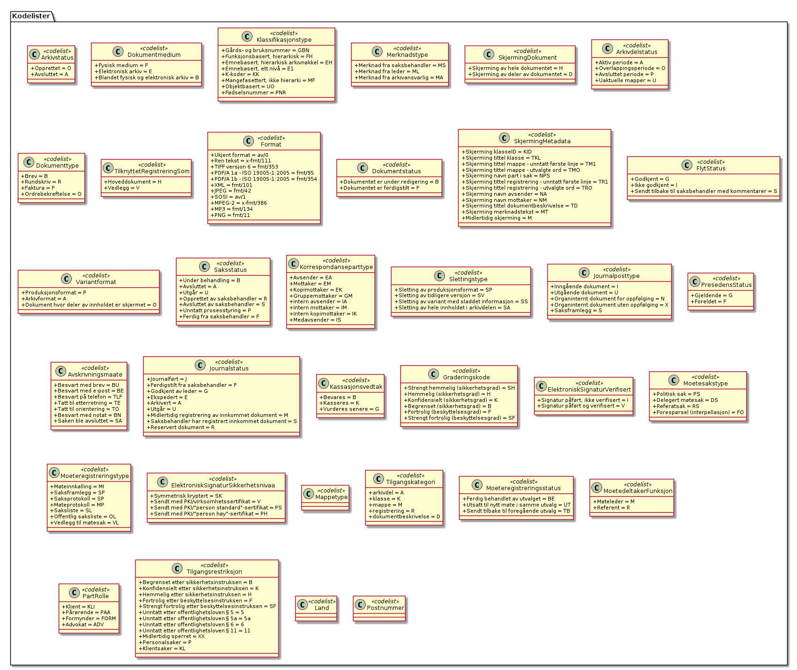

Figur: 21

**Metadata** - *(diagram) *

Figur: 22

#### Arkivdelstatus

*Type:* ***Class «codelist»***

*Arver:* 

Åpen kodeliste

Status til den arkivperioden som arkivdelen omfatter

M051

*Relasjonsnøkler*

| **Tag**  | **Verdi**                                                 |
| -------- | --------------------------------------------------------- |
| codeList | http://rel.kxml.no/noark5/v4/api/metadata/arkivdelstatus/ |

*Attributter*

| **Navn**                | **Merknad** | **Multipl.** | **Kode** | **Type** |
| ----------------------- | ----------- | ------------ | -------- | -------- |
| **Aktiv periode**       |             |              | A        |          |
| **Overlappingsperiode** |             |              | O        |          |
| **Avsluttet periode**   |             |              | P        |          |
| **Uaktuelle mapper**    |             |              | U        |          |

#### Arkivstatus

*Type:* ***Class «codelist»***

*Arver:* 

Åpen kodeliste

Status til arkivet

M050

*Relasjonsnøkler*

| **Tag**  | **Verdi**                                              |
| -------- | ------------------------------------------------------ |
| codeList | http://rel.kxml.no/noark5/v4/api/metadata/arkivstatus/ |

*Attributter*

| **Navn**      | **Merknad** | **Multipl.** | **Kode** | **Type** |
| ------------- | ----------- | ------------ | -------- | -------- |
| **Opprettet** |             |              | O        |          |
| **Avsluttet** |             |              | A        |          |

#### Avskrivningsmåte

*Type:* ***Class «codelist»***

*Arver:* 

Åpen kodeliste

Måten en journalpost har blitt avskrevet på

M619

*Relasjonsnøkler*

| **Tag**  | **Verdi**                                                    |
| -------- | ------------------------------------------------------------ |
| codeList | http://rel.kxml.no/noark5/v4/api/metadata/avskrivningsmaate/ |

*Attributter*

| **Navn**                  | **Merknad** | **Multipl.** | **Kode** | **Type** |
| ------------------------- | ----------- | ------------ | -------- | -------- |
| **Besvart med brev**      |             |              | BU       |          |
| **Besvart med e-post**    |             |              | BE       |          |
| **Besvart på telefon**    |             |              | TLF      |          |
| **Tatt til etterretning** |             |              | TE       |          |
| **Tatt til orientering**  |             |              | TO       |          |

#### Dokumentmedium

*Type:* ***Class «codelist»***

*Arver:* 

Åpen kodeliste

Definisjon: Angivelse av om arkivenheten inneholder fysiske dokumenter,
elektroniske dokumenter eller en blanding av fysiske og elektroniske
dokumenter

M300

*Relasjonsnøkler*

| **Tag**  | **Verdi**                                                 |
| -------- | --------------------------------------------------------- |
| codeList | http://rel.kxml.no/noark5/v4/api/metadata/dokumentmedium/ |

*Attributter*

| **Navn**                                | **Merknad** | **Multipl.** | **Kode** | **Type** |
| --------------------------------------- | ----------- | ------------ | -------- | -------- |
| **Fysisk medium**                       |             |              | F        |          |
| **Elektronisk arkiv**                   |             |              | E        |          |
| **Blandet fysisk og elektronisk arkiv** |             |              | B        |          |

#### Dokumentstatus

*Type:* ***Class «codelist»***

*Arver:* 

Åpen kodeliste

Definisjon: Status til dokumentet

M054

*Relasjonsnøkler*

| **Tag**  | **Verdi**                                                 |
| -------- | --------------------------------------------------------- |
| codeList | http://rel.kxml.no/noark5/v4/api/metadata/dokumentstatus/ |

*Attributter*

| **Navn**                           | **Merknad** | **Multipl.** | **Kode** | **Type** |
| ---------------------------------- | ----------- | ------------ | -------- | -------- |
| **Dokumentet er under redigering** |             |              | B        |          |
| **Dokumentet er ferdigstilt**      |             |              | F        |          |

#### Dokumenttype

*Type:* ***Class «codelist»***

*Arver:* 

Åpen kodeliste

Definisjon: Navn på type dokument

M083

*Relasjonsnøkler*

| **Tag**  | **Verdi**                                               |
| -------- | ------------------------------------------------------- |
| codeList | http://rel.kxml.no/noark5/v4/api/metadata/dokumenttype/ |

*Attributter*

| **Navn**             | **Merknad** | **Multipl.** | **Kode** | **Type** |
| -------------------- | ----------- | ------------ | -------- | -------- |
| **Brev**             | Valgfri     |              | B        |          |
| **Rundskriv**        | Valgfri     |              | R        |          |
| **Faktura**          | Valgfri     |              | F        |          |
| **Ordrebekreftelse** | Valgfri     |              | O        |          |

#### ElektroniskSignaturSikkerhetsnivå

*Type:* ***Class «codeList»***

*Arver:* 

Åpen kodeliste

Definisjon: Angivelse av hvilket sikkerhetsnivå som ble brukt ved
forsendelse og mottak av elektroniske dokumenter

Kilde: Registreres automatisk knyttet til funksjonalitet for elektronisk
signatur

Kommentar: (ingen)

M507
elektroniskSignaturSikkerhetsnivåå

*Relasjonsnøkler*

| **Tag**  | **Verdi**                                                                     |
| -------- | ----------------------------------------------------------------------------- |
| codeList | http://rel.kxml.no/noark5/v4/api/metadata/elektronisksignatursikkerhetsnivaa/ |

*Attributter*

| **Navn**                                       | **Merknad** | **Multipl.** | **Kode** | **Type** |
| ---------------------------------------------- | ----------- | ------------ | -------- | -------- |
| **Symmetrisk kryptert**                        | Valgfri     |              | SK       |          |
| **Sendt med PKI/virksomhetssertifikat**        | Valgfri     |              | V        |          |
| **Sendt med PKI/"person standard"-sertifikat** | Valgfri     |              | PS       |          |
| **Sendt med PKI/"person høy"-sertifikat**      | Valgfri     |              | PH       |          |

#### ElektroniskSignaturVerifisert

*Type:* ***Class «codelist»***

*Arver:* 

Åpen kodeliste

Definisjon: Angivelse av om et dokument er mottatt med elektronisk
signatur, og om signaturen er
verifisert.

M508

*Relasjonsnøkler*

| **Tag**  | **Verdi**                                                                |
| -------- | ------------------------------------------------------------------------ |
| codeList | http://rel.kxml.no/noark5/v4/api/metadata/elektronisksignaturverifisert/ |

*Attributter*

| **Navn**                             | **Merknad** | **Multipl.** | **Kode** | **Type** |
| ------------------------------------ | ----------- | ------------ | -------- | -------- |
| **Signatur påført, ikke verifisert** |             |              | I        |          |
| **Signatur påført og verifisert**    |             |              | V        |          |

#### FlytStatus

*Type:* ***Class «codeList»***

*Arver:* 

Åpen kodeliste

*Relasjonsnøkler*

| **Tag**  | **Verdi**                                             |
| -------- | ----------------------------------------------------- |
| codeList | http://rel.kxml.no/noark5/v4/api/metadata/flytstatus/ |

*Attributter*

| **Navn**                                            | **Merknad** | **Multipl.** | **Kode** | **Type** |
| --------------------------------------------------- | ----------- | ------------ | -------- | -------- |
| **Godkjent**                                        | Valgfri     |              | G        |          |
| **Ikke godkjent**                                   | Valgfri     |              | I        |          |
| **Sendt tilbake til saksbehandler med kommentarer** | Valgfri     |              | S        |          |

#### Format

*Type:* ***Class «codelist»***

*Arver:* 

Åpen kodeliste

*Relasjonsnøkler*

| **Tag**  | **Verdi**                                         |
| -------- | ------------------------------------------------- |
| codeList | http://rel.kxml.no/noark5/v4/api/metadata/format/ |

*Attributter*

| **Navn**                     | **Merknad**                                                                                                                                                              | **Multipl.** | **Kode**  | **Type** |
| ---------------------------- | ------------------------------------------------------------------------------------------------------------------------------------------------------------------------ | ------------ | --------- | -------- |
| **Ren tekst**                | Som ren tekst: UTF-8 (ISO/IEC 10646-1:2000 Annex D) eller ISO 8859-1:1998, Latin 1. ISO 8859-1:1998, Latin 1 kan erstattes med ISO 8859-4:1998, Latin 4 for samiske tegn |              | RA-TEKST  |          |
| **TIFF versjon 6**           | TIFF - Tag Image File Format versjon 6, med de presiseringer som fremgår av forskriftens § 8-18                                                                          |              | RA-TIFF6  |          |
| **PDF/A - ISO 19005-1:2005** | PDF/A - ISO 19005-1:2005, versjon 1a eller 1b («Conformance Level» A eller B). PDF/A erstatter Adobe PDF, jf. forskriftens § 8-20 tredje ledd.                           |              | RA-PDF    |          |
| **XML**                      | XML - Extensible Markup Language versjon 1.0, med de presiseringer som fremgår av forskriftens § 8-19                                                                    |              | RA-XML    |          |
| **JPEG**                     | JPEG (ISO 10918-1:1994)                                                                                                                                                  |              | RA-JPEG   |          |
| **SOSI**                     | SOSI versjon 2.2 (1995) eller nyere                                                                                                                                      |              | RA-SOSI   |          |
| **MPEG-2**                   | MPEG-2 (ISO 13818-2.)                                                                                                                                                    |              | RA-MPEG-2 |          |
| **MP3**                      | lyd: MP3 (ISO 11172-3), PCM eller PCM-basert Wave. Valget mellom disse lydformatene skal i hvert tilfelle være avtalt med Arkivverket før deponering eller avlevering    |              | RA-MP3    |          |

#### Graderingskode

*Type:* ***Class «codelist»***

*Arver:* 

Åpen kodeliste

*Relasjonsnøkler*

| **Tag**  | **Verdi**                                                 |
| -------- | --------------------------------------------------------- |
| codeList | http://rel.kxml.no/noark5/v4/api/metadata/graderingskode/ |

*Attributter*

| **Navn**                                 | **Merknad** | **Multipl.** | **Kode** | **Type** |
| ---------------------------------------- | ----------- | ------------ | -------- | -------- |
| **Strengt hemmelig (sikkerhetsgrad)**    |             |              | SH       |          |
| **Hemmelig (sikkerhetsgrad)**            |             |              | H        |          |
| **Konfidensielt (sikkerhetsgrad)**       |             |              | K        |          |
| **Begrenset (sikkerhetsgrad)**           |             |              | B        |          |
| **Fortrolig (beskyttelsesgrad)**         |             |              | F        |          |
| **Strengt fortrolig (beskyttelsesgrad)** |             |              | SF       |          |

#### Hendelsetype

*Type:* ***Class «codelist»***

*Arver:* 

*Relasjonsnøkler*

| **Tag**  | **Verdi**                                               |
| -------- | ------------------------------------------------------- |
| codeList | http://rel.kxml.no/noark5/v4/api/metadata/hendelsetype/ |

*Attributter*

| **Navn**            | **Merknad** | **Multipl.** | **Kode** | **Type** |
| ------------------- | ----------- | ------------ | -------- | -------- |
| **Endringslogg**    |             |              |          |          |
| **Søknad mottatt**  |             |              |          |          |
| **Søknad komplett** |             |              |          |          |
| **Vedtak**          |             |              |          |          |

#### Journalposttype

*Type:* ***Class «codelist»***

*Arver:* 

Åpen kodeliste

Definisjon: Navn på type
journalpost

M082

*Relasjonsnøkler*

| **Tag**  | **Verdi**                                                  |
| -------- | ---------------------------------------------------------- |
| codeList | http://rel.kxml.no/noark5/v4/api/metadata/journalposttype/ |

*Attributter*

| **Navn**                                  | **Merknad** | **Multipl.** | **Kode** | **Type** |
| ----------------------------------------- | ----------- | ------------ | -------- | -------- |
| **Inngående dokument**                    |             |              | I        |          |
| **Utgående dokument**                     |             |              | U        |          |
| **Organinternt dokument for oppfølging**  |             |              | N        |          |
| **Organinternt dokument uten oppfølging** |             |              | X        |          |
| **Saksframlegg**                          |             |              | S        |          |

#### Journalstatus

*Type:* ***Class «codelist»***

*Arver:* 

Definisjon: Status til journalposten, dvs. om dokumentet er registrert,
under behandling eller endelig arkivert.

M053

*Relasjonsnøkler*

| **Tag**  | **Verdi**                                                |
| -------- | -------------------------------------------------------- |
| codeList | http://rel.kxml.no/noark5/v4/api/metadata/journalstatus/ |

*Attributter*

<table>
<thead>
<tr class="header">
<th><strong>Navn</strong></th>
<th><strong>Merknad</strong></th>
<th><strong>Multipl.</strong></th>
<th><strong>Kode</strong></th>
<th><strong>Type</strong></th>
</tr>
</thead>
<tbody>
<tr class="odd">
<td><strong>Journalført</strong></td>
<td></td>
<td></td>
<td>J</td>
<td></td>
</tr>
<tr class="even">
<td><strong>Ferdigstilt fra saksbehandler</strong></td>
<td></td>
<td></td>
<td>F</td>
<td></td>
</tr>
<tr class="odd">
<td><strong>Godkjent av leder</strong></td>
<td></td>
<td></td>
<td>G</td>
<td></td>
</tr>
<tr class="even">
<td><strong>Ekspedert</strong></td>
<td></td>
<td></td>
<td>E</td>
<td></td>
</tr>
<tr class="odd">
<td><strong>Arkivert</strong></td>
<td></td>
<td></td>
<td>A</td>
<td></td>
</tr>
<tr class="even">
<td><strong>Utgår</strong></td>
<td></td>
<td></td>
<td>U</td>
<td></td>
</tr>
<tr class="odd">
<td><strong>Midlertidig registrering av innkommet dokument</strong></td>
<td>anbefalt</td>
<td></td>
<td>M</td>
<td></td>
</tr>
<tr class="even">
<td><strong>Saksbehandler har registrert innkommet dokument</strong></td>
<td>anbefalt</td>
<td></td>
<td>S</td>
<td></td>
</tr>
<tr class="odd">
<td><strong>Reservert dokument</strong></td>
<td>
Reservert dokument, dvs. egenprodusert dokument

er under arbeid
</td>
<td></td>
<td>R</td>
<td></td>
</tr>
</tbody>
</table>

#### Kassasjonsvedtak

*Type:* ***Class «codelist»***

*Arver:* 

Åpen kodeliste

Definisjon:Handling som skal utføres ved bevaringstidens
slutt.

M450

*Relasjonsnøkler*

| **Tag**  | **Verdi**                                                   |
| -------- | ----------------------------------------------------------- |
| codeList | http://rel.kxml.no/noark5/v4/api/metadata/kassasjonsvedtak/ |

*Attributter*

| **Navn**            | **Merknad** | **Multipl.** | **Kode** | **Type** |
| ------------------- | ----------- | ------------ | -------- | -------- |
| **Bevares**         |             |              | B        |          |
| **Kasseres**        |             |              | K        |          |
| **Vurderes senere** |             |              | G        |          |

#### Klassifikasjonstype

*Type:* ***Class «codelist»***

*Arver:* 

Åpen kodeliste

Definisjon: Type
klassifikasjonssystem

M086

*Relasjonsnøkler*

| **Tag**  | **Verdi**                                                      |
| -------- | -------------------------------------------------------------- |
| codeList | http://rel.kxml.no/noark5/v4/api/metadata/klassifikasjonstype/ |

*Attributter*

| **Navn**                               | **Merknad** | **Multipl.** | **Kode** | **Type** |
| -------------------------------------- | ----------- | ------------ | -------- | -------- |
| **Gårds- og bruksnummer**              | Valgfri     |              | GBN      |          |
| **Funksjonsbasert, hierarkisk**        | Valgfri     |              | FH       |          |
| **Emnebasert, hierarkisk arkivnøkkel** | Valgfri     |              | EH       |          |
| **Emnebasert, ett nivå**               | Valgfri     |              | E1       |          |
| **K-koder**                            | Valgfri     |              | KK       |          |
| **Mangefasettert, ikke hierarki**      | Valgfri     |              | MF       |          |
| **Objektbasert**                       | Valgfri     |              | UO       |          |
| **Fødselsnummer**                      | Valgfri     |              | PNR      |          |

#### Korrespondanseparttype

*Type:* ***Class «codelist»***

*Arver:* 

Åpen kodeliste

Definisjon: Type
korrespondansepart

M087

*Relasjonsnøkler*

| **Tag**  | **Verdi**                                                         |
| -------- | ----------------------------------------------------------------- |
| codeList | http://rel.kxml.no/noark5/v4/api/metadata/korrespondanseparttype/ |

*Attributter*

| **Navn**                | **Merknad** | **Multipl.** | **Kode** | **Type** |
| ----------------------- | ----------- | ------------ | -------- | -------- |
| **Avsender**            |             |              | EA       |          |
| **Mottaker**            |             |              | EM       |          |
| **Kopimottaker**        |             |              | EK       |          |
| **Gruppemottaker**      |             |              | GM       |          |
| **Intern avsender**     |             |              | IA       |          |
| **Intern mottaker**     |             |              | IM       |          |
| **Intern kopimottaker** |             |              | IK       |          |

#### Land

*Type:* ***Class «codelist»***

*Arver:* 

Landkoder ihht ISO 3166
https://no.wikipedia.org/wiki/ISO\_3166-1\_alfa-2\#Offisielle\_koder

*Relasjonsnøkler*

| **Tag**  | **Verdi**                                       |
| -------- | ----------------------------------------------- |
| codeList | http://rel.kxml.no/noark5/v4/api/metadata/land/ |

#### Mappetype

*Type:* ***Class «codelist»***

*Arver:* 

Åpen kodeliste

*Relasjonsnøkler*

| **Tag**  | **Verdi**                                            |
| -------- | ---------------------------------------------------- |
| codeList | http://rel.kxml.no/noark5/v4/api/metadata/mappetype/ |
| NEW      | 5.4.0                                                |

#### Merknadstype

*Type:* ***Class «codelist»***

*Arver:* 

Åpen kodeliste

Definisjon: Navn på type merknad

M084

*Relasjonsnøkler*

| **Tag**  | **Verdi**                                               |
| -------- | ------------------------------------------------------- |
| codeList | http://rel.kxml.no/noark5/v4/api/metadata/merknadstype/ |

*Attributter*

| **Navn**                       | **Merknad** | **Multipl.** | **Kode** | **Type** |
| ------------------------------ | ----------- | ------------ | -------- | -------- |
| **Merknad fra saksbehandler**  | Valgfri     |              | MS       |          |
| **Merknad fra leder**          | Valgfri     |              | ML       |          |
| **Merknad fra arkivansvarlig** | Valgfri     |              | MA       |          |

#### MøtedeltakerFunksjon

*Type:* ***Class «codeList»***

*Arver:* 

Åpen kodeliste

Definisjon: Funksjon eller rolle til personen som deltok på møtet

M373
moetedeltakerFunksjon

*Relasjonsnøkler*

| **Tag**  | **Verdi**                                                        |
| -------- | ---------------------------------------------------------------- |
| codeList | http://rel.kxml.no/noark5/v4/api/metadata/moetedeltakerfunksjon/ |

*Attributter*

| **Navn**      | **Merknad** | **Multipl.** | **Kode** | **Type** |
| ------------- | ----------- | ------------ | -------- | -------- |
| **Møteleder** | Valgfri     |              | M        |          |
| **Referent**  | Valgfri     |              | R        |          |

#### Møteregistreringsstatus

*Type:* ***Class «codelist»***

*Arver:* 

Åpen kodeliste

Definisjon: Status til møteregistreringen

Kilde: (ingen)

Kommentar: Valgfrie verdier, eksempler:

 - "Ferdig behandlet av utvalget"
 - "Utsatt til nytt møte i samme utvalg"
 - "Sendt tilbake til foregående utvalg"

M055 moeteregistreringsstatus

*Relasjonsnøkler*

| **Tag**  | **Verdi**                                                           |
| -------- | ------------------------------------------------------------------- |
| codeList | http://rel.kxml.no/noark5/v4/api/metadata/moeteregistreringsstatus/ |

*Attributter*

| **Navn**                                | **Merknad** | **Multipl.** | **Kode** | **Type** |
| --------------------------------------- | ----------- | ------------ | -------- | -------- |
| **Ferdig behandlet av utvalget**        | Valgfri     |              | BE       |          |
| **Utsatt til nytt møte i samme utvalg** | Valgfri     |              | UT       |          |
| **Sendt tilbake til foregående utvalg** | Valgfri     |              | TB       |          |

#### Møteregistreringstype

*Type:* ***Class «codelist»***

*Arver:* 

Definisjon: Navn på type møteregistrering

Kommentar: utvidet i forhold til forslagene i NOARK 5 Vedlegg 1

Vedlegg 1 Metadatakatalog v 3.1, M085 lister følgende "aktuelle
verdier":

 - Møteinnkallelse
 - Saksliste
 - Saksframlegg
 - Vedlegg til møtesak

M085 moeteregistreringstype

*Relasjonsnøkler*

| **Tag**  | **Verdi**                                                         |
| -------- | ----------------------------------------------------------------- |
| codeList | http://rel.kxml.no/noark5/v4/api/metadata/moeteregistreringstype/ |

*Attributter*

| **Navn**                | **Merknad**                                                                                                                     | **Multipl.** | **Kode** | **Type** |
| ----------------------- | ------------------------------------------------------------------------------------------------------------------------------- | ------------ | -------- | -------- |
| **Møteinnkalling**      |                                                                                                                                 |              | MI       |          |
| **Saksframlegg**        |                                                                                                                                 |              | SF       |          |
| **Saksprotokoll**       |                                                                                                                                 |              | SP       |          |
| **Møteprotokoll**       |                                                                                                                                 |              | MP       |          |
| **Saksliste**           |                                                                                                                                 |              | SL       |          |
| **Offentlig saksliste** | Offentlig saksliste, dvs en saksliste hvor informasjon (vanligvis kun i sakstittel) som skal unntas offentligheten, er skjermet |              | OL       |          |
| **Vedlegg til møtesak** |                                                                                                                                 |              | VL       |          |

#### Møtesakstype

*Type:* ***Class «codelist»***

*Arver:* 

Åpen kodeliste

Definisjon: Navn på type møtesak

Kilde: (ingen)

Kommentar: (ingen)

M088 moetesakstype

*Relasjonsnøkler*

| **Tag**  | **Verdi**                                                |
| -------- | -------------------------------------------------------- |
| codeList | http://rel.kxml.no/noark5/v4/api/metadata/moetesakstype/ |

*Attributter*

| **Navn**                         | **Merknad** | **Multipl.** | **Kode** | **Type** |
| -------------------------------- | ----------- | ------------ | -------- | -------- |
| **Politisk sak**                 |             |              | PS       |          |
| **Delegert møtesak**             |             |              | DS       |          |
| **Referatsak**                   |             |              | RS       |          |
| **Forespørsel (interpellasjon)** |             |              | FO       |          |

#### Postnummer

*Type:* ***Class «codelist»***

*Arver:* 

Postens postnummer liste
http://adressesok.posten.no/nb/postal\_codes/search

*Relasjoner*

| **Relasjon**                                | **Kilde**  | **Mål**       | **Merknad** |
| ------------------------------------------- | ---------- | ------------- | ----------- |
| **NoteLink** | Postnummer | \<anonymous\> |             |

*Relasjonsnøkler*

| **Tag**  | **Verdi**                                             |
| -------- | ----------------------------------------------------- |
| codeList | http://rel.kxml.no/noark5/v4/api/metadata/postnummer/ |

#### Presedensstatus

*Type:* ***Class «codelist»***

*Arver:* 

Åpen kodeliste

Definisjon: Informasjon om presedensen er gjeldende eller
foreldet

M056

*Relasjonsnøkler*

| **Tag**  | **Verdi**                                                  |
| -------- | ---------------------------------------------------------- |
| codeList | http://rel.kxml.no/noark5/v4/api/metadata/presedensstatus/ |

*Attributter*

| **Navn**      | **Merknad** | **Multipl.** | **Kode** | **Type** |
| ------------- | ----------- | ------------ | -------- | -------- |
| **Gjeldende** |             |              | G        |          |
| **Foreldet**  |             |              | F        |          |

#### SakspartRolle

*Type:* ***Class «codelist»***

*Arver:* 

Åpen kodeliste

*Relasjonsnøkler*

| **Tag**  | **Verdi**                                                |
| -------- | -------------------------------------------------------- |
| codeList | http://rel.kxml.no/noark5/v4/api/metadata/sakspartrolle/ |

*Attributter*

| **Navn**      | **Merknad** | **Multipl.** | **Kode** | **Type** |
| ------------- | ----------- | ------------ | -------- | -------- |
| **Klient**    | Valgfri     |              | KLI      |          |
| **Pårørende** | Valgfri     |              | PÅ       |          |
| **Formynder** | Valgfri     |              | FORM     |          |
| **Advokat**   | Valgfri     |              | ADV      |          |

#### Saksstatus

*Type:* ***Class «codelist»***

*Arver:* 

Åpen kodeliste

Definisjon: Status til saksmappen, dvs. hvor langt saksbehandlingen har
kommet.

M052

*Relasjonsnøkler*

| **Tag**  | **Verdi**                                             |
| -------- | ----------------------------------------------------- |
| codeList | http://rel.kxml.no/noark5/v4/api/metadata/saksstatus/ |

*Attributter*

| **Navn**                        | **Merknad** | **Multipl.** | **Kode** | **Type** |
| ------------------------------- | ----------- | ------------ | -------- | -------- |
| **Under behandling**            |             |              | B        |          |
| **Avsluttet**                   |             |              | A        |          |
| **Utgår**                       |             |              | U        |          |
| **Opprettet av saksbehandler ** | anbefalt    |              | R        |          |
| **Avsluttet av saksbehandler**  | anbefalt    |              | S        |          |
| **Unntatt prosesstyring**       | anbefalt    |              | P        |          |
| **Ferdig fra saksbehandler**    |             |              | F        |          |

#### SkjermingDokument

*Type:* ***Class «codelist»***

*Arver:* 

Åpen kodeliste

Definisjon: Angivelse av at hele dokumentet eller deler av det må
skjermes.

M503

*Relasjonsnøkler*

| **Tag**  | **Verdi**                                                    |
| -------- | ------------------------------------------------------------ |
| codeList | http://rel.kxml.no/noark5/v4/api/metadata/skjermingdokument/ |

*Attributter*

| **Navn**                             | **Merknad** | **Multipl.** | **Kode** | **Type** |
| ------------------------------------ | ----------- | ------------ | -------- | -------- |
| **Skjerming av hele dokumentet**     |             |              | H        |          |
| **Skjerming av deler av dokumentet** |             |              | D        |          |

#### SkjermingMetadata

*Type:* ***Class «codeList»***

*Arver:* 

Åpen kodeliste

Definisjon: Angivelse av hvilke metadataelementer som skal
skjermes.

M502

*Relasjonsnøkler*

| **Tag**  | **Verdi**                                                    |
| -------- | ------------------------------------------------------------ |
| codeList | http://rel.kxml.no/noark5/v4/api/metadata/skjermingmetadata/ |

*Attributter*

| **Navn**                                                 | **Merknad** | **Multipl.** | **Kode** | **Type** |
| -------------------------------------------------------- | ----------- | ------------ | -------- | -------- |
| **Skjerming klasseID**                                   |             |              | KID      |          |
| **Skjerming tittel klasse**                              |             |              | TKL      |          |
| **Skjerming tittel mappe - unntatt første linje**        |             |              | TM1      |          |
| **Skjerming tittel mappe - utvalgte ord**                |             |              | TMO      |          |
| **Skjerming navn part i sak**                            |             |              | NPS      |          |
| **Skjerming tittel registrering - unntatt første linje** |             |              | TR1      |          |
| **Skjerming tittel registrering - utvalgte ord**         |             |              | TRO      |          |
| **Skjerming navn avsender**                              |             |              | NA       |          |
| **Skjerming navn mottaker**                              |             |              | NM       |          |
| **Skjerming tittel dokumentbeskrivelse**                 |             |              | TD       |          |
| **Skjerming merknadstekst**                              |             |              | MT       |          |
| **Midlertidig skjerming**                                |             |              | M        |          |

#### Slettingstype

*Type:* ***Class «codelist»***

*Arver:* 

Åpen kodeliste

Definisjon: Navn på hvilket objekt som er slettet

M089

*Relasjonsnøkler*

| **Tag**  | **Verdi**                                                |
| -------- | -------------------------------------------------------- |
| codeList | http://rel.kxml.no/noark5/v4/api/metadata/slettingstype/ |

*Attributter*

| **Navn**                                        | **Merknad** | **Multipl.** | **Kode** | **Type** |
| ----------------------------------------------- | ----------- | ------------ | -------- | -------- |
| **Sletting av produksjonsformat**               |             |              | SP       |          |
| **Sletting av tidligere versjon**               |             |              | SV       |          |
| **Sletting av variant med sladdet informasjon** |             |              | SS       |          |
| **Sletting av hele innholdet i arkivdelen**     |             |              | SA       |          |

#### SystemID

*Type:* ***Class «simple»***

*Arver:* ***string***

Definisjon: Entydig identifikasjon av arkivenheten innenfor det
arkivskapende organet. Dersom organet har flere arkivsystemer, skal
altså systemID være gjennomgående entydig. Systemidentifikasjonen vil
som oftest være en nummerisk kode uten noe logisk meningsinnhold.
Identifikasjonen trenger ikke å være synlig for brukerne.

Kilde: Registreres automatisk av systemet

Kommentarer: Alle referanser fra en arkivenhet til en annen skal peke
til arkivenhetens systemidentifikasjon. Dette gjelder også referanser
fra en arkivdel til en annen, f.eks. mellom to arkivperioder som
avleveres på forskjellig tidspunkt. I et arkivuttrekk skal systemID være
entydig (unik). Dokumentobjekt har ingen systemidentifikasjon fordi
enheten kan være duplisert i et arkivuttrekk dersom samme dokumentfil er
knyttet til flere forskjellige registreringer.

M001

*Relasjoner*

<table>
<thead>
<tr class="header">
<th><strong>Relasjon</strong></th>
<th><strong>Kilde</strong></th>
<th><strong>Mål</strong></th>
<th><strong>Merknad</strong></th>
</tr>
</thead>
<tbody>
<tr class="odd">
<td>
<strong>Generalization</strong>

Source -&gt; Destination
</td>
<td>SystemID</td>
<td>string</td>
<td></td>
</tr>
</tbody>
</table>

#### Tilgangskategori

*Type:* ***Class «codelist»***

*Arver:* 

Åpen kodeliste

ny kodeliste jfr NOARK 5 v3.1 krav
6.6.32

*Relasjonsnøkler*

| **Tag**  | **Verdi**                                                   |
| -------- | ----------------------------------------------------------- |
| codeList | http://rel.kxml.no/noark5/v4/api/metadata/tilgangskategori/ |
| NEW      | 5.4.0                                                       |

*Attributter*

| **Navn**                | **Merknad** | **Multipl.** | **Kode** | **Type** |
| ----------------------- | ----------- | ------------ | -------- | -------- |
| **arkivdel**            |             |              | A        |          |
| **klasse**              |             |              | K        |          |
| **mappe**               |             |              | M        |          |
| **registrering**        |             |              | R        |          |
| **dokumentbeskrivelse** |             |              | D        |          |

#### Tilgangsrestriksjon

*Type:* ***Class «codelist»***

*Arver:* 

Åpen kodeliste

*Relasjonsnøkler*

| **Tag**  | **Verdi**                                                      |
| -------- | -------------------------------------------------------------- |
| codeList | http://rel.kxml.no/noark5/v4/api/metadata/tilgangsrestriksjon/ |
| NEW      | 5.4.0                                                          |

*Attributter*

| **Navn**                                           | **Merknad** | **Multipl.** | **Kode** | **Type** |
| -------------------------------------------------- | ----------- | ------------ | -------- | -------- |
| **Begrenset etter sikkerhetsinstruksen**           |             |              | B        |          |
| **Konfidensielt etter sikkerhetsinstruksen**       |             |              | K        |          |
| **Hemmelig etter sikkerhetsinstruksen**            |             |              | H        |          |
| **Fortrolig etter beskyttelsesinstruksen**         |             |              | F        |          |
| **Strengt fortrolig etter beskyttelsesinstruksen** |             |              | SF       |          |
| **Unntatt etter offentlighetsloven § 5**           |             |              | 5        |          |
| **Unntatt etter offentlighetsloven § 5a**          |             |              | 5a       |          |
| **Unntatt etter offentlighetsloven § 6**           |             |              | 6        |          |
| **Unntatt etter offentlighetsloven § 11**          |             |              | 11       |          |
| **Midlertidig sperret **                           |             |              | XX       |          |
| **Personalsaker**                                  |             |              | P        |          |
| **Klientsaker**                                    |             |              | KL       |          |

#### TilknyttetRegistreringSom

*Type:* ***Class «codelist»***

*Arver:* 

Åpen kodeliste

*Relasjonsnøkler*

| **Tag**  | **Verdi**                                                            |
| -------- | -------------------------------------------------------------------- |
| codeList | http://rel.kxml.no/noark5/v4/api/metadata/tilknyttetregistreringsom/ |

*Attributter*

| **Navn**          | **Merknad** | **Multipl.** | **Kode** | **Type** |
| ----------------- | ----------- | ------------ | -------- | -------- |
| **Hoveddokument** |             |              | H        |          |
| **Vedlegg**       |             |              | V        |          |

#### Variantformat

*Type:* ***Class «codelist»***

*Arver:* 

Åpen kodeliste

Definisjon: Angivelse av hvilken variant et dokument forekommer i

M700

*Relasjonsnøkler*

| **Tag**  | **Verdi**                                                |
| -------- | -------------------------------------------------------- |
| codeList | http://rel.kxml.no/noark5/v4/api/metadata/variantformat/ |

*Attributter*

| **Navn**                                         | **Merknad** | **Multipl.** | **Kode** | **Type** |
| ------------------------------------------------ | ----------- | ------------ | -------- | -------- |
| **Produksjonsformat**                            |             |              | P        |          |
| **Arkivformat**                                  |             |              | A        |          |
| **Dokument hvor deler av innholdet er skjermet** |             |              | O        |          |

### Sakarkiv 

Utvidelse for sakarkiv metadata

**Sakarkiv** - *(diagram) *

Figur: 23

**Sakarkiv kun** - *(diagram) *

Figur: 24

**Saksbehandling** - *(diagram) *

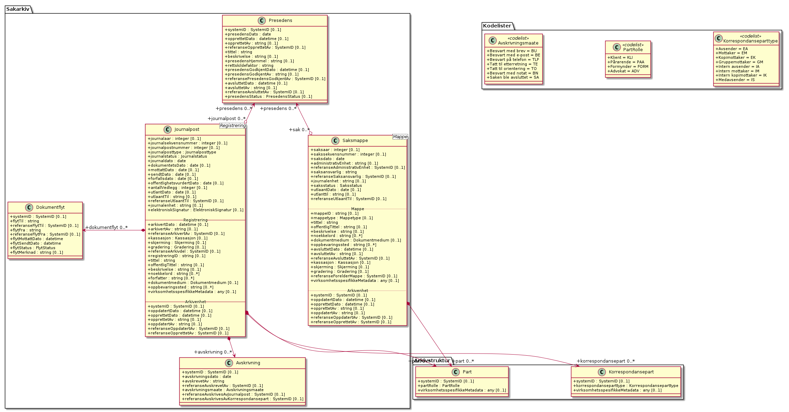

Figur: 25

**Avskrivning** - *(diagram) *

Figur: 26

**Person og organisasjonsdata** -
*(diagram) *

Figur: 27

**Hovedmodell** - *(diagram) *

Figur: 28

**Saksmappe** - *(diagram) *

Figur: 29

**Journalpost** - *(diagram) *

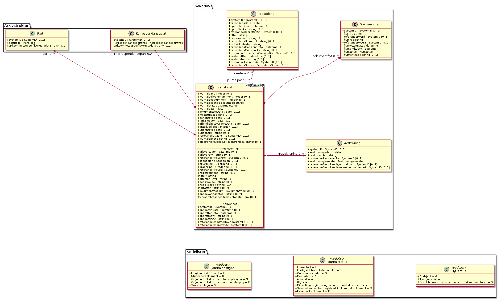

Figur: 30

**Elektronisk signatur** - *(diagram) *

Figur: 31

#### Avskrivning

*Type:* ***Class***

*Arver:* 

En Journalpost av typene ”inngående dokument” eller ”organinternt
dokument for oppfølging” står i restanse inntil de er markert som
ferdigbehandlet, eller avskrives. Dette kapitlet angir krav til
avskrivning.

Metadata for avskrivning skal kunne grupperes inn i metadata for
journalpost. Avskrivning er obligatorisk for inngående dokumenter og
organinterne dokumenter som skal følges opp, og kan forekomme en eller
flere ganger i en journalpost.

*Relasjoner*

<table>
<thead>
<tr class="header">
<th><strong>Relasjon</strong></th>
<th><strong>Kilde</strong></th>
<th><strong>Mål</strong></th>
<th><strong>Merknad</strong></th>
</tr>
</thead>
<tbody>
<tr class="odd">
<td>
<strong>Association</strong>

Source -&gt; Destination
</td>
<td>Journalpost</td>
<td>
avskrivning

0..*

Avskrivning
</td>
<td></td>
</tr>
</tbody>
</table>

*Relasjonsnøkler*

| **Tag**   | **Verdi**                                                    |
| --------- | ------------------------------------------------------------ |
| REST\_REL | http://rel.kxml.no/noark5/v4/api/sakarkiv/ny-avskrivning/    |
| REST\_REL | http://rel.kxml.no/noark5/v4/api/metadata/avskrivningsmaate/ |
| REST\_REL | self                                                         |
| REST\_REL | http://rel.kxml.no/noark5/v4/api/sakarkiv/avskrivning/       |

*Attributter*

<table>
<thead>
<tr class="header">
<th><strong>Navn</strong></th>
<th><strong>Merknad</strong></th>
<th><strong>Multipl.</strong></th>
<th><strong>Kode</strong></th>
<th><strong>Type</strong></th>
</tr>
</thead>
<tbody>
<tr class="odd">
<td><strong>systemID</strong></td>
<td>
Definisjon: Entydig identifikasjon av arkivenheten innenfor det arkivskapende organet. Dersom organet har flere arkivsystemer, skal altså systemID være gjennomgående entydig. Systemidentifikasjonen vil som oftest være en nummerisk kode uten noe logisk meningsinnhold. Identifikasjonen trenger ikke å være synlig for brukerne.

Kilde: Registreres automatisk av systemet

Kommentarer: Alle referanser fra en arkivenhet til en annen skal peke til arkivenhetens systemidentifikasjon. Dette gjelder også referanser fra en arkivdel til en annen, f.eks. mellom to arkivperioder som avleveres på forskjellig tidspunkt. I et arkivuttrekk skal systemID være entydig (unik). Dokumentobjekt har ingen systemidentifikasjon fordi enheten kan være duplisert i et arkivuttrekk dersom samme dokumentfil er knyttet til flere forskjellige registreringer.

M001
</td>
<td>[0..1]</td>
<td></td>
<td>SystemID</td>
</tr>
<tr class="even">
<td><strong>avskrivningsdato</strong></td>
<td>
Definisjon: Dato et dokument ble avskrevet

Kilde: Registreres automatisk nå avskrivning foretas

Kommentar: (ingen)

M617
</td>
<td>[1..1]</td>
<td></td>
<td>date</td>
</tr>
<tr class="odd">
<td><strong>avskrevetAv</strong></td>
<td>
Definisjon: Navn på person som har foretatt avskrivning

Kilde: Registreres automatisk nå avskrivning foretas

Kommentar: (ingen)

M618
</td>
<td>[1..1]</td>
<td></td>
<td>string</td>
</tr>
<tr class="even">
<td><strong>referanseAvskrevetAv</strong></td>
<td></td>
<td>[0..1]</td>
<td></td>
<td>SystemID</td>
</tr>
<tr class="odd">
<td><strong>avskrivningsmåte</strong></td>
<td>
Definisjon: Måten en journalpost har blitt avskrevet på

Kilde: Registreres automatisk når konvertering utføres.

Kommentar: (ingen)

M619 avskrivningsmaate
</td>
<td>[1..1]</td>
<td></td>
<td>Avskrivningsmåte</td>
</tr>
<tr class="even">
<td><strong>referanseAvskrivesAvJournalpost</strong></td>
<td>
Definisjon: Referanse til en eller flere journalposter som avskriver denne journalposten

Kilde: Registreres manuelt eller automatisk ved avskrivning

Kommentar: (ingen)

M215
</td>
<td>[0..1]</td>
<td></td>
<td>SystemID</td>
</tr>
<tr class="odd">
<td><strong>referanseAvskrivesAvKorrespondansepart</strong></td>
<td>angir referanse til hvilken korrespondansepart som har avskrevet journalposten</td>
<td>[0..1]</td>
<td></td>
<td>SystemID</td>
</tr>
</tbody>
</table>

*Restriksjoner*

| **Navn**                               | **Merknad** |
| -------------------------------------- | ----------- |
| M001 systemID: Skal ikke kunne endres  |             |
| M617 avskrivningsdato: Kan ikke endres |             |
| M618 avskrevetAv: Kan ikke endres      |             |

#### Dokumentflyt

*Type:* ***Class***

*Arver:* 

Et dokument som er under produksjon, skal kunne sendes fram og tilbake
i linjen det nødvendige antall ganger. Saksbehandler og lederne i
linjen skal kunne se hvor dokumentet befinner seg til enhver tid. Det
skal være mulig å definere funksjoner for at dokumentet låses for
endringer når det (videre)sendes, eller at det automatisk opprettes en
ny versjon ved hver (videre)forsendelse. All funksjonalitet for
korrektur og merknader i tilknyttet tekstbehandlingssystem skal kunne
brukes på et dokument som er under produksjon.

*Relasjoner*

<table>
<thead>
<tr class="header">
<th><strong>Relasjon</strong></th>
<th><strong>Kilde</strong></th>
<th><strong>Mål</strong></th>
<th><strong>Merknad</strong></th>
</tr>
</thead>
<tbody>
<tr class="odd">
<td>
<strong>Association</strong>

Source -&gt; Destination
</td>
<td>Journalpost</td>
<td>
dokumentflyt

0..*

Dokumentflyt
</td>
<td></td>
</tr>
</tbody>
</table>

*Relasjonsnøkler*

| **Tag**   | **Verdi**                                                  |
| --------- | ---------------------------------------------------------- |
| REST\_REL | http://rel.kxml.no/noark5/v4/api/metadata/flytstatus/      |
| REST\_REL | self                                                       |
| REST\_REL | http://rel.kxml.no/noark5/v4/api/sakarkiv/dokumentflyt/    |
| REST\_REL | http://rel.kxml.no/noark5/v4/api/sakarkiv/ny-dokumentflyt/ |

*Attributter*

<table>
<thead>
<tr class="header">
<th><strong>Navn</strong></th>
<th><strong>Merknad</strong></th>
<th><strong>Multipl.</strong></th>
<th><strong>Kode</strong></th>
<th><strong>Type</strong></th>
</tr>
</thead>
<tbody>
<tr class="odd">
<td><strong>systemID</strong></td>
<td>
Definisjon: Entydig identifikasjon av arkivenheten innenfor det arkivskapende organet. Dersom organet har flere arkivsystemer, skal altså systemID være gjennomgående entydig. Systemidentifikasjonen vil som oftest være en nummerisk kode uten noe logisk meningsinnhold. Identifikasjonen trenger ikke å være synlig for brukerne.

Kilde: Registreres automatisk av systemet

Kommentarer: Alle referanser fra en arkivenhet til en annen skal peke til arkivenhetens systemidentifikasjon. Dette gjelder også referanser fra en arkivdel til en annen, f.eks. mellom to arkivperioder som avleveres på forskjellig tidspunkt. I et arkivuttrekk skal systemID være entydig (unik). Dokumentobjekt har ingen systemidentifikasjon fordi enheten kan være duplisert i et arkivuttrekk dersom samme dokumentfil er knyttet til flere forskjellige registreringer.

M001
</td>
<td>[0..1]</td>
<td></td>
<td>SystemID</td>
</tr>
<tr class="even">
<td><strong>flytTil</strong></td>
<td>
Definisjon: Person som har mottatt for godkjennelse et dokument som har vært sendt på flyt

Kilde: Registreres automatisk av funksjonalitet knyttet til arbeidsflyt

Kommentar: (ingen)

M660 flytTil
</td>
<td>[1..1]</td>
<td></td>
<td>string</td>
</tr>
<tr class="odd">
<td><strong>referanseFlytTil</strong></td>
<td></td>
<td>[0..1]</td>
<td></td>
<td>SystemID</td>
</tr>
<tr class="even">
<td><strong>flytFra</strong></td>
<td>
Definisjon: Person som har sendt et dokument på flyt

Kilde: Registreres automatisk av funksjonalitet knyttet til arbeidsflyt

Kommentar: (ingen)

M665 flytFra
</td>
<td>[1..1]</td>
<td></td>
<td>string</td>
</tr>
<tr class="odd">
<td><strong>referanseFlytFra</strong></td>
<td></td>
<td>[0..1]</td>
<td></td>
<td>SystemID</td>
</tr>
<tr class="even">
<td><strong>flytMottattDato</strong></td>
<td>
Definisjon: Dato og klokkeslett et dokument på flyt ble mottatt

Kilde: Registreres automatisk av funksjonalitet knyttet til arbeidsflyt

Kommentar: (ingen)

M661 flytMottattDato
</td>
<td>[1..1]</td>
<td></td>
<td>datetime</td>
</tr>
<tr class="odd">
<td><strong>flytSendtDato</strong></td>
<td>
Definisjon: Dato og klokkeslett et dokument på flyt ble sendt videre

Kilde: Registreres automatisk av funksjonalitet knyttet til arbeidsflyt

Kommentar: (ingen)

M662 flytSendtDato
</td>
<td>[1..1]</td>
<td></td>
<td>datetime</td>
</tr>
<tr class="even">
<td><strong>flytStatus</strong></td>
<td>
Definisjon: Godkjennelse/ikke godkjennelse av dokumentet som er sendt på flyt

Kilde: Registreres automatisk av funksjonalitet knyttet til arbeidsflyt

Kommentar: (ingen)

M663 flytStatus
</td>
<td>[1..1]</td>
<td></td>
<td>FlytStatus</td>
</tr>
<tr class="odd">
<td><strong>flytMerknad</strong></td>
<td>
Definisjon: Merknad eller kommentar til et dokument som er sendt på flyt

Kilde: Registreres manuelt

Kommentar: (ingen)

M664 flytMerknad
</td>
<td>[0..1]</td>
<td></td>
<td>string</td>
</tr>
</tbody>
</table>

*Restriksjoner*

<table>
<thead>
<tr class="header">
<th><strong>Navn</strong></th>
<th><strong>Merknad</strong></th>
</tr>
</thead>
<tbody>
<tr class="odd">
<td>M001 systemID: Skal ikke kunne endres</td>
<td></td>
</tr>
<tr class="even">
<td>M660 flytTil: Obligatorisk dersom dokumentet har blitt sendt på flyt. Skal ikke kunne endres</td>
<td></td>
</tr>
<tr class="odd">
<td>M661 flytMottattDato: Obligatorisk dersom dokumentet har blitt sendt på flyt. Skal ikke kunne endres.</td>
<td></td>
</tr>
<tr class="even">
<td>M662 flytSendtDato: Obligatorisk dersom dokumentet har blitt sendt på flyt. Skal ikke kunne endres.</td>
<td></td>
</tr>
<tr class="odd">
<td>
M665 flytFra: Obligatorisk dersom dokumentet har blitt sendt på flyt. Skal ikke kunne

endres.
</td>
<td></td>
</tr>
</tbody>
</table>

#### EnkelAdresse

*Type:* ***Class «dataType»***

*Arver:*

*Relasjonsnøkler*

| **Tag**   | **Verdi**                                                  |
| --------- | ---------------------------------------------------------- |
| REST\_REL | http://rel.kxml.no/noark5/v4/api/sakarkiv/enkeladresse/    |
| REST\_REL | http://rel.kxml.no/noark5/v4/api/sakarkiv/ny-enkeladresse/ |
| REST\_REL | self                                                       |
| REST\_REL | http://rel.kxml.no/noark5/v4/api/metadata/land/            |
| REST\_REL | http://rel.kxml.no/noark5/v4/api/metadata/postnummer/      |

*Attributter*

| **Navn**          | **Merknad** | **Multipl.** | **Kode** | **Type**   |
| ----------------- | ----------- | ------------ | -------- | ---------- |
| **adresselinje1** |             | \[0..1\]     |          | string     |
| **adresselinje2** |             | \[0..1\]     |          | string     |
| **adresselinje3** |             | \[0..1\]     |          | string     |
| **postnr**        |             | \[0..1\]     |          | Postnummer |
| **poststed**      |             | \[1..1\]     |          | string     |
| **landkode**      |             | \[0..1\]     |          | Land       |

#### Journalpost

*Type:* ***Class***

*Arver:* ***Basisregistrering***

En journalpost fra Noark-4 utgjør en egen registreringstype i Noark 5.
En journalpost representer en "innføring i journalen". Journalen er en
kronologisk fortegnelse over inn- og utgående dokumenter
(dvs. korrespondansedokumenter), og eventuelt også interne dokumenter
som inngår i saksbehandlingen. Til sammenligning representerer en
basisregistrering en generell "innføring" i alle typer arkivsystemer,
også de som ikke inneholder korrespondansebaserte
dokumenter. Journalposten inneholder bl.a.  metadata om
korrespondanseparter (avsender og mottaker), og om saksbehandlere. Det
finnes flere typer journalposter. De viktigste er inngående dokument,
utgående dokument, organinternt dokument for oppfølging og
organinternt dokument uten oppfølging. Ved organinterne dokumenter kan
en og samme journalpost inneholde metadata om både avsender og
mottaker, og om saksbehandler både på avsender- og mottakersiden.

Registreringstypen journalpost er obligatorisk for sakarkiver. Alle
journalføringspliktige dokumenter i offentlig forvaltning skal
registreres som journalposter og inngå i et sakarkiv.  Dersom et
system basert på Noark 5 bare skal brukes for sakarkiver, er det ikke
noe i veien for å fortsette å anvende begrepet "journalpost" i alle
grensesnitt mot brukerne, på samme måte som en er vant til fra
Noark-4. I denne standarden brukes registrering som en generell
betegnelse på arkivenheter som dokumenter transaksjoner. (Registrering
er dessuten en dekkende norsk oversettelse av det tilsvarende begrepet
i MoReq2 som heter Record.)

*Relasjoner*

<table>
<thead>
<tr class="header">
<th><strong>Relasjon</strong></th>
<th><strong>Kilde</strong></th>
<th><strong>Mål</strong></th>
<th><strong>Merknad</strong></th>
</tr>
</thead>
<tbody>
<tr class="odd">
<td>
<strong>Association</strong>

Bi-Directional
</td>
<td>
journalpost

0..*

Journalpost
</td>
<td>
presedens

0..*

Presedens
</td>
<td></td>
</tr>
<tr class="even">
<td>
<strong>Association</strong>

Source -&gt; Destination
</td>
<td>Journalpost</td>
<td>
dokumentflyt

0..*

Dokumentflyt
</td>
<td></td>
</tr>
<tr class="odd">
<td>
<strong>Association</strong>

Source -&gt; Destination
</td>
<td>Journalpost</td>
<td>
avskrivning

0..*

Avskrivning
</td>
<td></td>
</tr>
<tr class="even">
<td>
<strong>Generalization</strong>

Source -&gt; Destination
</td>
<td>Journalpost</td>
<td>Basisregistrering</td>
<td></td>
</tr>
<tr class="odd">
<td>
<strong>Association</strong>

Source -&gt; Destination
</td>
<td>Journalpost</td>
<td>
korrespondansepart

0..*

Korrespondansepart
</td>
<td></td>
</tr>
</tbody>
</table>

*Relasjonsnøkler*

| **Tag**   | **Verdi**                                                        |
| --------- | ---------------------------------------------------------------- |
| REST\_REL | http://rel.kxml.no/noark5/v4/api/sakarkiv/avskrivning/           |
| REST\_REL | http://rel.kxml.no/noark5/v4/api/sakarkiv/ny-avskrivning/        |
| REST\_REL | http://rel.kxml.no/noark5/v4/api/sakarkiv/presedens/             |
| REST\_REL | http://rel.kxml.no/noark5/v4/api/sakarkiv/ny-presedens/          |
| REST\_REL | http://rel.kxml.no/noark5/v4/api/sakarkiv/ny-journalpost/        |
| REST\_REL | self                                                             |
| REST\_REL | http://rel.kxml.no/noark5/v4/api/sakarkiv/journalpost/           |
| REST\_REL | http://rel.kxml.no/noark5/v4/api/sakarkiv/ny-dokumentflyt/       |
| REST\_REL | http://rel.kxml.no/noark5/v4/api/metadata/journalstatus/         |
| REST\_REL | http://rel.kxml.no/noark5/v4/api/sakarkiv/ny-korrespondansepart/ |
| REST\_REL | http://rel.kxml.no/noark5/v4/api/metadata/journalposttype/       |
| REST\_REL | http://rel.kxml.no/noark5/v4/api/sakarkiv/korrespondansepart/    |
| REST\_REL | http://rel.kxml.no/noark5/v4/api/sakarkiv/dokumentflyt/          |

*Attributter*

<table>
<thead>
<tr class="header">
<th><strong>Navn</strong></th>
<th><strong>Merknad</strong></th>
<th><strong>Multipl.</strong></th>
<th><strong>Kode</strong></th>
<th><strong>Type</strong></th>
</tr>
</thead>
<tbody>
<tr class="odd">
<td><strong>journalår</strong></td>
<td>
Definisjon: Viser året journalposten ble opprettet

Kilde: Registreres automatisk når journalposten opprettes

Kommentar: (ingen)

M013 journalaar
</td>
<td>[0..1]</td>
<td></td>
<td>integer</td>
</tr>
<tr class="even">
<td><strong>journalsekvensnummer</strong></td>
<td>
Definisjon: Viser rekkefølgen når journalposten ble opprettet under året

Kilde: Registreres automatisk når journalposten opprettes

Kommentar: Kombinasjonen journalår og sekvensnummer er ikke obligatorisk, men anbefales brukt i sakarkiver. Noen rapporter er sortert på denne kombinasjonen, f.eks. løpende- og offentlig journal. Dersom journalår og sekvensnummer ikke brukes, må kronologiske utskrifter sorteres etter andre kriterier (f.eks. journalpostens opprettetDato). I Noark 4 skal sekvensnummeret vises før journalåret (f.eks. 25367/2011) for at det ikke skal blandes sammen med saksnummeret som har året først.

M014 journalsekvensnummer
</td>
<td>[0..1]</td>
<td></td>
<td>integer</td>
</tr>
<tr class="odd">
<td><strong>journalpostnummer</strong></td>
<td>
Definisjon: Inngår i M004 journalpostID. Viser rekkefølgen journalpostene ble opprettet innenfor saksmappen, f.eks. 2011/3869-8 (dokument nr. 8 i sak 2011/3869).

Kilde: Registreres automatisk når journalposten opprettes

Kommentar: Er ikke obligatorisk, men anbefales brukt i sakarkiver. Dersom journalpostnummer ikke brukes, må andre kriterier kunne identifisere journalpostenes rekkefølge innenfor saksmappen.

M015 journalpostnummer
</td>
<td>[0..1]</td>
<td></td>
<td>integer</td>
</tr>
<tr class="even">
<td><strong>journalposttype</strong></td>
<td>
Definisjon: Navn på type journalpost

Kilde: Registreres automatisk av systemet eller manuelt

Kommentar: Tilsvarer &quot;Noark dokumenttype&quot; i Noark 4

M082 journalposttype
</td>
<td>[1..1]</td>
<td></td>
<td>Journalposttype</td>
</tr>
<tr class="odd">
<td><strong>journalstatus</strong></td>
<td>
Definisjon: Status til journalposten, dvs. om dokumentet er registrert, under behandling eller endelig arkivert.

Kilde: Registreres automatisk gjennom forskjellig saksbehandlings-funksjonalitet, eller overstyres manuelt.

Kommentar: Journalposter som avleveres skal ha status &quot;Arkivert&quot; eller &quot;Utgår&quot;.

M053 journalstatus
</td>
<td>[1..1]</td>
<td></td>
<td>Journalstatus</td>
</tr>
<tr class="even">
<td><strong>journaldato</strong></td>
<td>
Definisjon: Datoen journalposten er opprettet/arkivert

Kilde: Settes automatisk til samme dato som M600 opprettetDato. Oppdateres til M604 arkivertDato når dokumentene som tilhørere journalposten arkiveres.

Kommentar: (ingen)

M101 journaldato
</td>
<td>[1..1]</td>
<td></td>
<td>date</td>
</tr>
<tr class="odd">
<td><strong>dokumentetsDato</strong></td>
<td>
Definisjon: Dato som er påført selve dokumentet

Kilde: Datoen hentes automatisk fra dokumentet, eller registreres manuelt

Kommentar: Kan brukes både for inngående, utgående og organinterne dokumenter

M103 dokumentetsDato
</td>
<td>[0..1]</td>
<td></td>
<td>date</td>
</tr>
<tr class="even">
<td><strong>mottattDato</strong></td>
<td>
Definisjon: Dato et eksternt dokument ble mottatt

Kilde: Registreres manuelt eller automatisk av systemet ved elektronisk kommunikasjon

Kommentar: Merk at mottattDato ikke behøver å være identisk med M600 opprettetDato

M104 mottattDato
</td>
<td>[0..1]</td>
<td></td>
<td>date</td>
</tr>
<tr class="odd">
<td><strong>sendtDato</strong></td>
<td>
Definisjon: Dato et internt produsert dokument ble sendt/ekspedert

Kilde: Registreres manuelt eller automatisk av systemet ved elektronisk kommunikasjon

Kommentar: (ingen)

M105 sendtDato
</td>
<td>[0..1]</td>
<td></td>
<td>date</td>
</tr>
<tr class="even">
<td><strong>forfallsdato</strong></td>
<td>
Definisjon: Dato som angir fristen for når et inngående dokument må være besvart

Kilde: Registreres manuelt

Kommentar: Forfallsdato kan være angitt som en betingelse i det inngående dokumentet

M109 forfallsdato
</td>
<td>[0..1]</td>
<td></td>
<td>date</td>
</tr>
<tr class="odd">
<td><strong>offentlighetsvurdertDato</strong></td>
<td>
Definisjon: Datoen da offentlighetsvurdering ble foretatt

Kilde: Registreres automatisk knyttet til funksjonalitet for skjerming

Kommentar: Dato for offentlighetsvurdering kan brukes dersom inngående dokumenter automatisk blir midlertidig skjermet ved mottak, og offentlighetsvurderingen skjer på et litt senere tidspunkt.

M110 offentlighetsvurdertDato
</td>
<td>[0..1]</td>
<td></td>
<td>date</td>
</tr>
<tr class="even">
<td><strong>antallVedlegg</strong></td>
<td>
Definisjon: Antall fysiske vedlegg til et fysisk hoveddokument

Kilde: Registreres manuelt

Kommentar: (ingen)

M304 antallVedlegg
</td>
<td>[0..1]</td>
<td></td>
<td>integer</td>
</tr>
<tr class="odd">
<td><strong>utlåntDato</strong></td>
<td>
Definisjon: Dato når en fysisk saksmappe eller journalpost ble utlånt

Kilde: Registreres manuelt ved utlån

Kommentar: Det er ikke spesifisert noen dato for tilbakelevering. Tilbakelevering kan markeres ved at M106 utlaantDato slettes. Det er ingen krav om obligatorisk logging av utlån av fysiske dokumenter.

M106 utlaantDato
</td>
<td>[0..1]</td>
<td></td>
<td>date</td>
</tr>
<tr class="even">
<td><strong>utlåntTil</strong></td>
<td>
Definisjon: Navnet på person som har lånt en fysisk saksmappe

Kilde: Registreres manuelt ved utlån

Kommentar: (ingen)

M309 utlaantTil
</td>
<td>[0..1]</td>
<td></td>
<td>string</td>
</tr>
<tr class="odd">
<td><strong>referanseUtlåntTil</strong></td>
<td></td>
<td>[0..1]</td>
<td></td>
<td>SystemID</td>
</tr>
<tr class="even">
<td><strong>journalenhet</strong></td>
<td>
Definisjon: Navn på enhet som har det arkivmessige ansvaret for kvalitetssikring av arkivdanningen, og eventuelt registrering (journalføring) og arkivering av fysiske dokumenter

Kilde: Registreres automatisk på grunnlag av innlogget bruker, kan overstyres manuelt

Kommentar: (ingen)

M308 journalenhet
</td>
<td>[0..1]</td>
<td></td>
<td>string</td>
</tr>
<tr class="odd">
<td><strong>elektroniskSignatur</strong></td>
<td></td>
<td>[0..1]</td>
<td></td>
<td>ElektroniskSignatur</td>
</tr>
</tbody>
</table>

*Restriksjoner*

| **Navn**                                                      | **Merknad** |
| ------------------------------------------------------------- | ----------- |
| 5.5.8 En journalpost skal kunne defineres til å være av forskjellig type, se M082journalposttype. | |
| 5.5.10 En Journalpost skal ha registrert en Saksansvar (dvs. administrativ enhet, Saksbehandler og eventuelt journalenhet) og en Saksansvar skal kunne inngå i ingen, en eller flere Journalposter. | |
| 5.5.11 En Journalpost skal ha registrert en Korrespondansepart og en Korrespondansepart skal inngå i (kun) en Journalpost. | |
| 5.5.12 Det bør finnes en tjeneste/funksjon for å ajourholde Journalenhet på en Registrering (Journalpost). | |
| 5.5.13 Det skal finnes en tjeneste/funksjon for å ajourholde Administrativ enhet og Saksbehandler på en Registrering (Journalpost). | |
| 5.5.14 Det skal finnes en tjeneste/funksjon for å ajourholde Korrespondansepart på en Journalpost. |
| M013 journalår: Skal ikke kunne endres. | |
| M014 journalsekvensnummer: Skal ikke kunne endres. | |
| M015 journalpostnummer: Skal normalt ikke endres, men ved flytting til en annen saksmappe kan journalposten få et nytt nummer (fordi det inngår i en annen nummerrekkefølge i denne mappen). | |
| M101 journaldato: Skal kunne endres manuelt inntil arkivering. | | 
| M103 dokumentetsDato: Skal kunne endres manuelt inntil arkivering. | |
| M104 mottattDato: Skal ikke kunne endres ved automatisk registrering, dato for mottak av fysiske dokumenter skal kunne endres inntil arkivering. | |
| M105 sendtDato: Skal ikke kunne endres ved automatisk registrering, dato for forsendelse av fysiske dokumenter skal kunne endres inntil arkivering. |
| M106 utlåntDato: Utlån skal også kunne registreres etter at en saksmappe er avsluttet, eller etter at dokumentene i en journalpost ble arkivert. | |
| M308 journalenhet: Er ikke lenger obligatorisk i Noark 5. Journalenhet er helt uavhengig av administrativ enhet. Kan f.eks. brukes som seleksjonskriterium ved produksjon av rapporter. Det anbefales ikke å knytte tilgangsrettigheter til journalenhet. | |
| M309 utlåntTil: Utlån skal også kunne registreres etter at en saksmappe er avsluttet, eller at dokumentene i en journalpost ble arkivert. |

#### Kontaktinformasjon

*Type:* ***Class «dataType»***

*Arver:*

*Relasjonsnøkler*

| **Tag**   | **Verdi**                                                        |
| --------- | ---------------------------------------------------------------- |
| REST\_REL | http://rel.kxml.no/noark5/v4/api/sakarkiv/ny-kontaktinformasjon/ |
| REST\_REL | http://rel.kxml.no/noark5/v4/api/sakarkiv/kontaktinformasjon/    |
| REST\_REL | self                                                             |

*Attributter*

| **Navn**         | **Merknad** | **Multipl.** | **Kode** | **Type** |
| ---------------- | ----------- | ------------ | -------- | -------- |
| **epostadresse** |             | \[0..1\]     |          | string   |
| **mobiltelefon** |             | \[0..1\]     |          | string   |
| **telefon**      |             | \[0..1\]     |          | string   |

#### Korrespondansepart

*Type:* ***Class***

*Arver:* 

Korrespondansepart er obligatorisk, og skal forekomme en eller flere
ganger i en journalpost.

Ved inngående dokumenter er det obligatorisk å registrere avsender(e),
ved utgående

dokumenter mottaker(e). Ved organinterne dokumenter som skal følges opp,
må både

avsender(e) og mottaker(e) registreres.

*Relasjoner*

<table>
<thead>
<tr class="header">
<th><strong>Relasjon</strong></th>
<th><strong>Kilde</strong></th>
<th><strong>Mål</strong></th>
<th><strong>Merknad</strong></th>
</tr>
</thead>
<tbody>
<tr class="odd">
<td>
<strong>Generalization</strong>

Source -&gt; Destination
</td>
<td>KorrespondansepartEnhet</td>
<td>Korrespondansepart</td>
<td></td>
</tr>
<tr class="even">
<td>
<strong>Generalization</strong>

Source -&gt; Destination
</td>
<td>KorrespondansepartPerson</td>
<td>Korrespondansepart</td>
<td></td>
</tr>
<tr class="odd">
<td>
<strong>Generalization</strong>

Source -&gt; Destination
</td>
<td>KorrespondansepartIntern</td>
<td>Korrespondansepart</td>
<td></td>
</tr>
<tr class="even">
<td>
<strong>Association</strong>

Source -&gt; Destination
</td>
<td>Journalpost</td>
<td>
korrespondansepart

0..*

Korrespondansepart
</td>
<td></td>
</tr>
</tbody>
</table>

*Relasjonsnøkler*

| **Tag**   | **Verdi**                                                         |
| --------- | ----------------------------------------------------------------- |
| REST\_REL | self                                                              |
| REST\_REL | http://rel.kxml.no/noark5/v4/api/metadata/korrespondanseparttype/ |
| REST\_REL | http://rel.kxml.no/noark5/v4/api/sakarkiv/korrespondansepart/     |

*Attributter*

<table>
<thead>
<tr class="header">
<th><strong>Navn</strong></th>
<th><strong>Merknad</strong></th>
<th><strong>Multipl.</strong></th>
<th><strong>Kode</strong></th>
<th><strong>Type</strong></th>
</tr>
</thead>
<tbody>
<tr class="odd">
<td><strong>systemID</strong></td>
<td>
Definisjon: Entydig identifikasjon av arkivenheten innenfor det

arkivskapende organet. Dersom organet har flere arkivsystemer, skal altså

systemID være gjennomgående entydig. Systemidentifikasjonen vil som oftest

være en nummerisk kode uten noe logisk meningsinnhold. Identifikasjonen

trenger ikke å være synlig for brukerne.

Kilde: Registreres automatisk av systemet

Kommentarer: Alle referanser fra en arkivenhet til en annen skal peke til

arkivenhetens systemidentifikasjon. Dette gjelder også referanser fra en

arkivdel til en annen, f.eks. mellom to arkivperioder som avleveres på

forskjellig tidspunkt. I et arkivuttrekk skal systemID være entydig (unik).

Dokumentobjekt har ingen systemidentifikasjon fordi enheten kan være

duplisert i et arkivuttrekk dersom samme dokumentfil er knyttet til flere

forskjellige registreringer.

M001
</td>
<td>[0..1]</td>
<td></td>
<td>SystemID</td>
</tr>
<tr class="even">
<td><strong>korrespondanseparttype</strong></td>
<td>
Definisjon: Type korrespondansepart

Kilde: Registreres automatisk knyttet til funksjonalitet i forbindelse med opprettelse av journalpost, kan også registreres manuelt

Kommentarer: Korrespondansetype forekommer én gang innenfor objektet korrespondansepart, men denne kan forekomme flere ganger innenfor en journalpost.

M087
</td>
<td>[1..1]</td>
<td></td>
<td>Korrespondanseparttype</td>
</tr>
<tr class="odd">
<td><strong>virksomhetsspesifikkeMetadata</strong></td>
<td>
Definisjon: Et overordnet metadataelement som kan inneholde egendefinerte metadata. Disse metadataene må da være spesifisert i et eller flere XML-skjema.

Kilde: (ingen)

Kommentar: (ingen)

M711 virksomhetsspesifikkeMetadata
</td>
<td>[0..1]</td>
<td></td>
<td>any</td>
</tr>
</tbody>
</table>

*Restriksjoner*

| **Navn**                              | **Merknad** |
| ------------------------------------- | ----------- |
| M001 systemID: Skal ikke kunne endres |             |

#### KorrespondansepartEnhet

*Type:* ***Class***

*Arver:* ***Korrespondansepart***

*Relasjoner*

<table>
<thead>
<tr class="header">
<th><strong>Relasjon</strong></th>
<th><strong>Kilde</strong></th>
<th><strong>Mål</strong></th>
<th><strong>Merknad</strong></th>
</tr>
</thead>
<tbody>
<tr class="odd">
<td>
<strong>Generalization</strong>

Source -&gt; Destination
</td>
<td>KorrespondansepartEnhet</td>
<td>Korrespondansepart</td>
<td></td>
</tr>
</tbody>
</table>

*Relasjonsnøkler*

| **Tag**   | **Verdi**                                                             |
| --------- | --------------------------------------------------------------------- |
| NEW       | 5.4.0                                                                 |
| REST\_REL | http://rel.kxml.no/noark5/v4/api/sakarkiv/korrespondansepartenhet/    |
| REST\_REL | self                                                                  |
| REST\_REL | http://rel.kxml.no/noark5/v4/api/sakarkiv/ny-korrespondansepartenhet/ |

*Attributter*

| **Navn**                | **Merknad** | **Multipl.** | **Kode** | **Type**           |
| ----------------------- | ----------- | ------------ | -------- | ------------------ |
| **organisasjonsnummer** |             | \[0..1\]     |          | string             |
| **navn**                |             | \[1..1\]     |          | string             |
| **forretningsadresse**  |             | \[0..1\]     |          | EnkelAdresse       |
| **postadresse**         |             | \[0..1\]     |          | EnkelAdresse       |
| **kontaktinformasjon**  |             | \[0..1\]     |          | Kontaktinformasjon |
| **kontaktperson**       |             | \[0..1\]     |          | string             |

#### KorrespondansepartIntern

*Type:* ***Class***

*Arver:* ***Korrespondansepart***

*Relasjoner*

<table>
<thead>
<tr class="header">
<th><strong>Relasjon</strong></th>
<th><strong>Kilde</strong></th>
<th><strong>Mål</strong></th>
<th><strong>Merknad</strong></th>
</tr>
</thead>
<tbody>
<tr class="odd">
<td>
<strong>Generalization</strong>

Source -&gt; Destination
</td>
<td>KorrespondansepartIntern</td>
<td>Korrespondansepart</td>
<td></td>
</tr>
</tbody>
</table>

*Relasjonsnøkler*

| **Tag**   | **Verdi**                                                              |
| --------- | ---------------------------------------------------------------------- |
| NEW       | 5.4.0                                                                  |
| REST\_REL | http://rel.kxml.no/noark5/v4/api/sakarkiv/korrespondansepartintern/    |
| REST\_REL | self                                                                   |
| REST\_REL | http://rel.kxml.no/noark5/v4/api/sakarkiv/ny-korrespondansepartintern/ |

*Attributter*

| **Navn**                        | **Merknad**                                   | **Multipl.** | **Kode** | **Type** |
| ------------------------------- | --------------------------------------------- | ------------ | -------- | -------- |
| **administrativEnhet**          |                                               | \[0..1\]     |          | string   |
| **referanseAdministrativEnhet** | referanse til AdministrativEnhet sin systemID | \[0..1\]     |          | SystemID |
| **saksbehandler**               |                                               | \[0..1\]     |          | string   |
| **referanseSaksbehandler**      | referanse til Bruker sin systemID             | \[0..1\]     |          | SystemID |

#### KorrespondansepartPerson

*Type:* ***Class***

*Arver:* ***Korrespondansepart***

*Relasjoner*

<table>
<thead>
<tr class="header">
<th><strong>Relasjon</strong></th>
<th><strong>Kilde</strong></th>
<th><strong>Mål</strong></th>
<th><strong>Merknad</strong></th>
</tr>
</thead>
<tbody>
<tr class="odd">
<td>
<strong>Generalization</strong>

Source -&gt; Destination
</td>
<td>KorrespondansepartPerson</td>
<td>Korrespondansepart</td>
<td></td>
</tr>
</tbody>
</table>

*Relasjonsnøkler*

| **Tag**   | **Verdi**                                                              |
| --------- | ---------------------------------------------------------------------- |
| NEW       | 5.4.0                                                                  |
| REST\_REL | self                                                                   |
| REST\_REL | http://rel.kxml.no/noark5/v4/api/sakarkiv/korrespondansepartperson/    |
| REST\_REL | http://rel.kxml.no/noark5/v4/api/sakarkiv/ny-korrespondansepartperson/ |

*Attributter*

| **Navn**               | **Merknad** | **Multipl.** | **Kode** | **Type**           |
| ---------------------- | ----------- | ------------ | -------- | ------------------ |
| **fødselsnummer**      |             | \[0..1\]     |          | string             |
| **DNummer**            |             | \[0..1\]     |          | string             |
| **navn**               |             | \[1..1\]     |          | string             |
| **postadresse**        |             | \[0..1\]     |          | EnkelAdresse       |
| **bostedsadresse**     |             | \[0..1\]     |          | EnkelAdresse       |
| **kontaktinformasjon** |             | \[0..1\]     |          | Kontaktinformasjon |

#### Presedens

*Type:* ***Class***

*Arver:* 

Med presedens menes en (retts)avgjørelse som siden kan tjene som
rettesnor i lignende tilfeller

eller saker. En presedens kan også være en sak som er regeldannende for
behandling av

tilsvarende saker. Det er som oftest snakk om et forvaltningsmessig
vedtak, dvs. et

enkeltvedtak fattet i henhold til det aktuelle organets
forvaltningsområde, som inneholder en

rettsoppfatning som senere blir lagt til grunn i andre lignende
tilfeller. Prinsippavgjørelser

knyttet til ulike saksområder skal derfor kunne etableres på en
hensiktsmessig måte og være

tilgjengelig for saksbehandlere.

Man snakker vanligvis om presedenssaker, men det er vanligvis ett eller
noen få av

dokumentene i saken som danner presedens. Foruten å registrere hele
saken, må derfor det eller

de dokumentene som inneholder presedensavgjørelser kunne identifiseres.
Hvis opplysninger

om presedens er registrert, er presedens obligatorisk for avlevering.

*Relasjoner*

<table>
<thead>
<tr class="header">
<th><strong>Relasjon</strong></th>
<th><strong>Kilde</strong></th>
<th><strong>Mål</strong></th>
<th><strong>Merknad</strong></th>
</tr>
</thead>
<tbody>
<tr class="odd">
<td>
<strong>Association</strong>

Bi-Directional
</td>
<td>
journalpost

0..*

Journalpost
</td>
<td>
presedens

0..*

Presedens
</td>
<td></td>
</tr>
<tr class="even">
<td>
<strong>Association</strong>

Bi-Directional
</td>
<td>
sak

0..*

Saksmappe
</td>
<td>
presedens

0..*

Presedens
</td>
<td></td>
</tr>
</tbody>
</table>

*Relasjonsnøkler*

| **Tag**   | **Verdi**                                                  |
| --------- | ---------------------------------------------------------- |
| REST\_REL | http://rel.kxml.no/noark5/v4/api/metadata/presedensstatus/ |
| REST\_REL | http://rel.kxml.no/noark5/v4/api/sakarkiv/ny-saksmappe/    |
| REST\_REL | http://rel.kxml.no/noark5/v4/api/sakarkiv/sak/             |
| REST\_REL | http://rel.kxml.no/noark5/v4/api/sakarkiv/ny-presedens/    |
| REST\_REL | self                                                       |
| REST\_REL | http://rel.kxml.no/noark5/v4/api/sakarkiv/presedens/       |
| REST\_REL | http://rel.kxml.no/noark5/v4/api/sakarkiv/journalpost/     |
| REST\_REL | http://rel.kxml.no/noark5/v4/api/sakarkiv/ny-journalpost/  |

*Attributter*

<table>
<thead>
<tr class="header">
<th><strong>Navn</strong></th>
<th><strong>Merknad</strong></th>
<th><strong>Multipl.</strong></th>
<th><strong>Kode</strong></th>
<th><strong>Type</strong></th>
</tr>
</thead>
<tbody>
<tr class="odd">
<td><strong>systemID</strong></td>
<td>
Definisjon: Entydig identifikasjon av arkivenheten innenfor det arkivskapende

organet. Dersom organet har flere arkivsystemer, skal altså systemID være

gjennomgående entydig. Systemidentifikasjonen vil som oftest være en

nummerisk kode uten noe logisk meningsinnhold. Identifikasjonen trenger ikke

å være synlig for brukerne.

Kilde: Registreres automatisk av systemet

Kommentarer: Alle referanser fra en arkivenhet til en annen skal peke til

arkivenhetens systemidentifikasjon. Dette gjelder også referanser fra en

arkivdel til en annen, f.eks. mellom to arkivperioder som avleveres på

forskjellig tidspunkt. I et arkivuttrekk skal systemID være entydig (unik).

Dokumentobjekt har ingen systemidentifikasjon fordi enheten kan være

duplisert i et arkivuttrekk dersom samme dokumentfil er knyttet til flere

forskjellige registreringer.

M001 systemID
</td>
<td>[0..1]</td>
<td></td>
<td>SystemID</td>
</tr>
<tr class="even">
<td><strong>presedensDato</strong></td>
<td>
Definisjon: Datoen på presedensen

Kilde: Registreres manuelt ved opprettelse av presedens, men bør også kunne hentes automatisk fra M103 dokumentetsDato på journalposten presedensen opprettes på.

Kommentar: (ingen)

M111 presedensDato
</td>
<td>[1..1]</td>
<td></td>
<td>date</td>
</tr>
<tr class="odd">
<td><strong>opprettetDato</strong></td>
<td>
Definisjon: Dato og klokkeslett når arkivenheten ble opprettet/registrert

Kilde: Registreres automatisk av systemet ved opprettelse av enheten

Kommentarer: (ingen)

M600 opprettetDato
</td>
<td>[0..1]</td>
<td></td>
<td>datetime</td>
</tr>
<tr class="even">
<td><strong>opprettetAv</strong></td>
<td>
Definisjon: Navn på person som opprettet/registrerte arkivenheten

Kilde: Registreres automatisk av systemet ved opprettelse av enheten

Kommentarer: (ingen)

M601 opprettetAv
</td>
<td>[0..1]</td>
<td></td>
<td>string</td>
</tr>
<tr class="odd">
<td><strong>referanseOpprettetAv</strong></td>
<td></td>
<td>[0..1]</td>
<td></td>
<td>SystemID</td>
</tr>
<tr class="even">
<td><strong>tittel</strong></td>
<td>
Definisjon: Tittel eller navn på arkivenheten

Kilde: Registreres manuelt eller hentes automatisk fra innholdet i

arkivdokumentet. Ja fra klassetittel dersom alle mapper skal ha samme tittel

som klassen. Kan også hentes automatisk fra et fagsystem.

Kommentarer: For saksmappe og journalpost vil dette tilsvare &quot;Sakstittel&quot; og

&quot;Dokumentbeskrivelse&quot;. Disse navnene kan beholdes i grensesnittet.

M020 tittel
</td>
<td>[1..1]</td>
<td></td>
<td>string</td>
</tr>
<tr class="odd">
<td><strong>beskrivelse</strong></td>
<td>
Definisjon: Tekstlig beskrivelse av arkivenheten

Kilde: Registreres manuelt

Kommentarer: Tilsvarende attributt finnes ikke i Noark 4 (men noen tabeller

hadde egne attributter for merknad som kunne brukes som et beskrivelsesfelt)

M021 beskrivelse
</td>
<td>[0..1]</td>
<td></td>
<td>string</td>
</tr>
<tr class="even">
<td><strong>presedensHjemmel</strong></td>
<td>
Definisjon: Lovparagrafen som saken eller journalposten danner presedens for

Kilde: Registreres manuelt ved opprettelse av presedens

Kommentar: (ingen)

M311 presedensHjemmel
</td>
<td>[0..1]</td>
<td></td>
<td>string</td>
</tr>
<tr class="odd">
<td><strong>rettskildefaktor</strong></td>
<td>
Definisjon: En argumentkilde som brukes til å løse rettslige problemer. En retts-anvender som skal ta stilling til et juridisk spørsmål, vil ta utgangspunkt i en rettskildefaktor.

Kilde: Registreres manuelt ved opprettelse av presedens

Kommentar: En rettskildefaktor kan være en lov- eller forskriftstekst, lovforarbeider, domstolspraksis, andre myndigheters praksis, privates praksis (kontraktspraksis), rettsoppfatninger, reelle hensyn, folkerett, EU-/ EØS-rett mv.

M312 rettskildefaktor
</td>
<td>[1..1]</td>
<td></td>
<td>string</td>
</tr>
<tr class="even">
<td><strong>presedensGodkjentDato</strong></td>
<td>
Definisjon:Dato og klokkeslett for når presedensen er godkjent

Kilde: Registreres automatisk dersom det finnes funksjonalitet for å godkjenne presedenser

Kommentar: (ingen)

M628 presedensGodkjentDato
</td>
<td>[0..1]</td>
<td></td>
<td>datetime</td>
</tr>
<tr class="odd">
<td><strong>presedensGodkjentAv</strong></td>
<td>
Definisjon: Navn på person som har godkjent presedensen

Kilde: Registreres automatisk dersom det finnes funksjonalitet for å godkjenne presedenser

Kommentar: (ingen)

M629 presedensGodkjentAv
</td>
<td>[0..1]</td>
<td></td>
<td>string</td>
</tr>
<tr class="even">
<td><strong>referansePresedensGodkjentAv</strong></td>
<td></td>
<td>[0..1]</td>
<td></td>
<td>SystemID</td>
</tr>
<tr class="odd">
<td><strong>avsluttetDato</strong></td>
<td>
Definisjon: Dato og klokkeslett når arkivenheten ble avsluttet/lukket

Kilde: Registreres automatisk av systemet når enheten avsluttes

Kommentarer: (ingen)

M602 avsluttetDato
</td>
<td>[0..1]</td>
<td></td>
<td>datetime</td>
</tr>
<tr class="even">
<td><strong>avsluttetAv</strong></td>
<td>
Definisjon: Navn på person som avsluttet/lukket arkivenheten

Kilde: Registreres automatisk av systemet ved opprettelse av enheten

Kommentarer: (ingen)

M603 avsluttetAv
</td>
<td>[0..1]</td>
<td></td>
<td>string</td>
</tr>
<tr class="odd">
<td><strong>referanseAvsluttetAv</strong></td>
<td></td>
<td>[0..1]</td>
<td></td>
<td>SystemID</td>
</tr>
<tr class="even">
<td><strong>presedensStatus</strong></td>
<td>
Definisjon: Informasjon om presedensen er gjeldende eller foreldet

Kilde: Registreres manuelt ved foreldelse

Kommentar: (ingen)

M056 presedensstatus
</td>
<td>[0..1]</td>
<td></td>
<td>Presedensstatus</td>
</tr>
</tbody>
</table>

*Restriksjoner*

| **Navn**                                                                                           | **Merknad** |
| -------------------------------------------------------------------------------------------------- | ----------- |
| M001 systemID: Skal ikke kunne endres                                                              |             |
| M020 tittel: Skal normalt ikke kunne endres etter at enheten er lukket, eller dokumentene arkivert |             |
| M600 opprettetDato: Skal ikke kunne endres                                                         |             |
| M601 opprettetAv: Skal ikke kunne endres                                                           |             |
| M602 avsluttetDato: Skal ikke kunne endres. Obligatorisk dersom arkivdelen er avsluttet.           |             |
| M603 avsluttetAv: Skal ikke kunne endres. Obligatorisk dersom arkivenheten er avsluttet.           |             |

#### Saksmappe

*Type:* ***Class***

*Arver:* ***Mappe***

I denne versjonen av Noark 5 er det i tillegg til Mappe definert en
spesialisering kalt

Saksmappe, som tilsvarer en ”sak” i Noark-4. Saksmappen skal inneholde
metadata fra Mappe

i tillegg til egne metadata. En saksmappe er bakoverkompatibel med en
sak i Noark-4, men har

en del nye metadata. . For sakarkiver er det obligatorisk å bruke en
saksmappe.

*Relasjoner*

<table>
<thead>
<tr class="header">
<th><strong>Relasjon</strong></th>
<th><strong>Kilde</strong></th>
<th><strong>Mål</strong></th>
<th><strong>Merknad</strong></th>
</tr>
</thead>
<tbody>
<tr class="odd">
<td>
<strong>Association</strong>

Source -&gt; Destination
</td>
<td>Saksmappe</td>
<td>
sakspart

0..*

Sakspart
</td>
<td></td>
</tr>
<tr class="even">
<td>
<strong>Generalization</strong>

Source -&gt; Destination
</td>
<td>Saksmappe</td>
<td>Mappe</td>
<td></td>
</tr>
<tr class="odd">
<td>
<strong>Association</strong>

Source -&gt; Destination
</td>
<td>Saksmappe</td>
<td>
sekundærklassifikasjon

0..*

Klasse
</td>
<td></td>
</tr>
<tr class="even">
<td>
<strong>Association</strong>

Bi-Directional
</td>
<td>
sak

0..*

Saksmappe
</td>
<td>
presedens

0..*

Presedens
</td>
<td></td>
</tr>
</tbody>
</table>

*Relasjonsnøkler*

| **Tag**   | **Verdi**                                                          |
| --------- | ------------------------------------------------------------------ |
| REST\_REL | http://rel.kxml.no/noark5/v4/api/sakarkiv/saksmappe/               |
| REST\_REL | http://rel.kxml.no/noark5/v4/api/arkivstruktur/ny-klasse/          |
| REST\_REL | http://rel.kxml.no/noark5/v4/api/sakarkiv/presedens/               |
| REST\_REL | http://rel.kxml.no/noark5/v4/api/sakarkiv/saksparter/              |
| REST\_REL | http://rel.kxml.no/noark5/v4/api/sakarkiv/sekundaerklassifikasjon/ |
| REST\_REL | http://rel.kxml.no/noark5/v4/api/metadata/saksstatus/              |
| REST\_REL | http://rel.kxml.no/noark5/v4/api/sakarkiv/ny-sakspart/             |
| REST\_REL | http://rel.kxml.no/noark5/v4/api/sakarkiv/ny-presedens/            |
| REST\_REL | self                                                               |
| REST\_REL | http://rel.kxml.no/noark5/v4/api/sakarkiv/ny-saksmappe/            |

*Attributter*

<table>
<thead>
<tr class="header">
<th><strong>Navn</strong></th>
<th><strong>Merknad</strong></th>
<th><strong>Multipl.</strong></th>
<th><strong>Kode</strong></th>
<th><strong>Type</strong></th>
</tr>
</thead>
<tbody>
<tr class="odd">
<td><strong>saksår</strong></td>
<td>
Definisjon: Inngår i M003 mappeID. Viser året saksmappen ble opprettet.

Kilde: Registreres automatisk når saksmappen opprettes

Kommentar: Se kommentar under M012 sakssekvensnummer

M011 saksaar
</td>
<td>[0..1]</td>
<td></td>
<td>integer</td>
</tr>
<tr class="even">
<td><strong>sakssekvensnummer</strong></td>
<td>
Definisjon: Inngår i M003 mappeID. Viser rekkefølgen når saksmappen ble opprettet innenfor året.

Kilde: Registreres automatisk når saksmappen opprettes

Kommentar: Kombinasjonen saksår og sakssekvensnummer er ikke obligatorisk, men anbefales brukt i sakarkiver.

M012 sakssekvensnummer
</td>
<td>[0..1]</td>
<td></td>
<td>integer</td>
</tr>
<tr class="odd">
<td><strong>saksdato</strong></td>
<td>
Definisjon: Datoen saken er opprettet

Kilde: Settes automatisk til samme dato som M600 opprettetDato

Kommentar: (ingen)

M100 saksdato
</td>
<td>[1..1]</td>
<td></td>
<td>date</td>
</tr>
<tr class="even">
<td><strong>administrativEnhet</strong></td>
<td>
Definisjon: Navn på avdeling, kontor eller annen administrativ enhet som har ansvaret for saksbehandlingen.

Kilde: Registreres automatisk f.eks. på grunnlag av innlogget bruker, kan overstyres

Kommentar: Merk at på journalpostnivå grupperes administrativEnhet sammen med M307 saksbehandler inn i korrespondansepart. Dette muliggjør individuell behandling når det er flere mottakere, noe som er særlig aktuelt ved organinterne dokumenter som skal følges opp.

M305 administrativEnhet
</td>
<td>[0..1]</td>
<td></td>
<td>string</td>
</tr>
<tr class="odd">
<td><strong>referanseAdministrativEnhet</strong></td>
<td></td>
<td>[0..1]</td>
<td></td>
<td>SystemID</td>
</tr>
<tr class="even">
<td><strong>saksansvarlig</strong></td>
<td>
Definisjon: Navn på person som er saksansvarlig

Kilde: Registreres automatisk på grunnlag av innlogget bruker eller annen saksbehandlingsfunksjonalitet (f.eks. saksfordeling), kan overstyres manuelt

Kommentar: (ingen)

M306 saksansvarlig
</td>
<td>[1..1]</td>
<td></td>
<td>string</td>
</tr>
<tr class="odd">
<td><strong>referanseSaksansvarlig</strong></td>
<td></td>
<td>[0..1]</td>
<td></td>
<td>SystemID</td>
</tr>
<tr class="even">
<td><strong>journalenhet</strong></td>
<td>
Definisjon: Navn på enhet som har det arkivmessige ansvaret for

kvalitetssikring av arkivdanningen, og eventuelt registrering (journalføring)

og arkivering av fysiske dokumenter

Kilde: Registreres automatisk på grunnlag av innlogget bruker, kan overstyres

manuelt

Kommentar: (ingen)

M308 journalenhet
</td>
<td>[0..1]</td>
<td></td>
<td>string</td>
</tr>
<tr class="odd">
<td><strong>saksstatus</strong></td>
<td>
Definisjon: Status til saksmappen, dvs. hvor langt saksbehandlingen har kommet.

Kilde: Registreres automatisk gjennom forskjellig saksbehandlings-funksjonalitet, eller overstyres manuelt.

Kommentar: Saksmapper som avleveres skal ha status &quot;Avsluttet&quot; eller &quot;Utgår&quot;.

M052 saksstatus
</td>
<td>[1..1]</td>
<td></td>
<td>Saksstatus</td>
</tr>
<tr class="even">
<td><strong>utlåntDato</strong></td>
<td>
Definisjon: Dato når en fysisk saksmappe eller journalpost ble utlånt

Kilde: Registreres manuelt ved utlån

Kommentar: Det er ikke spesifisert noen dato for tilbakelevering. Tilbakelevering

kan markeres ved at M106 utlaantDato slettes. Det er ingen krav om obligatorisk

logging av utlån av fysiske dokumenter.

M106 utlaantDato
</td>
<td>[0..1]</td>
<td></td>
<td>date</td>
</tr>
<tr class="odd">
<td><strong>utlåntTil</strong></td>
<td>
Definisjon: Navnet på person som har lånt en fysisk saksmappe

Kilde: Registreres manuelt ved utlån

Kommentar: (ingen)

M309 utlaantTil
</td>
<td>[0..1]</td>
<td></td>
<td>string</td>
</tr>
<tr class="even">
<td><strong>referanseUtlåntTil</strong></td>
<td></td>
<td>[0..1]</td>
<td></td>
<td>SystemID</td>
</tr>
</tbody>
</table>

*Restriksjoner*

<table>
<thead>
<tr class="header">
<th><strong>Navn</strong></th>
<th><strong>Merknad</strong></th>
</tr>
</thead>
<tbody>
<tr class="odd">
<td>5.4.9 En Saksmappe skal kunne identifiseres entydig innenfor arkivet.</td>
<td>
/* Det anbefales at denne identifikasjonen er en

kombinasjon av saksår og et forløpende sekvensnummer

for saksmappene innenfor året.

*/
</td>
</tr>
<tr class="even">
<td>5.4.10 En Saksmappe skal kunne ha registrert ingen, en eller flere Sekundærklassering og en Sekundærklassering tilhører kun en Saksmappe og kun en Klasse.</td>
<td></td>
</tr>
<tr class="odd">
<td>
5.4.11 En Saksmappe bør kunne ha registrert ingen eller en

Journalenhet og en Journalenhet kan inngå i ingen, en

eller flere Saksmapper.
</td>
<td></td>
</tr>
<tr class="even">
<td>
5.4.12 En Saksmappe skal kunne ha registrert ingen eller en

Administrativ enhet og en Administrativ enhet kan inngå i

ingen, en eller flere Saksmapper.
</td>
<td></td>
</tr>
<tr class="odd">
<td>
5.4.13 En Saksmappe skal kunne inneha ingen, en eller flere

Saksparter og en Sakspart skal alltid tilhøre en

Saksmappe.
</td>
<td></td>
</tr>
<tr class="even">
<td>
6.1.3 Det skal finnes en tjeneste/funksjon for å sette Status på

en Saksmappe.
</td>
<td></td>
</tr>
<tr class="odd">
<td>6.1.4 Følgende statusverdier er obligatorisk for Saksmappe: Under behandling, Avsluttet, Utgår</td>
<td></td>
</tr>
<tr class="even">
<td>6.1.5 Følgende statusverdier er anbefalt for Saksmappe: Opprettet av saksbehandler, Avsluttet av saksbehandler, Unntatt prosesstyring</td>
<td></td>
</tr>
<tr class="odd">
<td>
6.1.6 Når status på Saksmappe settes til Avsluttet, skal

avsluttetDato settes automatisk.
</td>
<td></td>
</tr>
<tr class="even">
<td>
6.1.7 Det skal ikke være mulig å avslutte en Saksmappe uten

at det er angitt en primær klassifikasjon (Klasse).
</td>
<td></td>
</tr>
<tr class="odd">
<td>
6.1.8 Det skal ikke være mulig å avslutte en Saksmappe som

inneholder Registreringer som ikke er avsluttet
</td>
<td></td>
</tr>
<tr class="even">
<td>
6.1.11 Det skal ikke være mulig å avslutte en Saksmappe uten

at alle dokumenter på registreringene i mappen er lagret

i arkivformat
</td>
<td></td>
</tr>
<tr class="odd">
<td>
6.1.12 Det skal ikke være mulig å avslutte en Saksmappe uten

at alle restanser på Registreringer er avskrevet
</td>
<td></td>
</tr>
<tr class="even">
<td>
6.1.13 Når statusen til en Saksmappe settes til avsluttet, skal det

på mappenivå ikke være mulig å endre metadataene: saksdato, administrativEnhet , saksansvarlig
</td>
<td></td>
</tr>
<tr class="odd">
<td>
6.1.14 Når statusen til en Saksmappe settes til avsluttet, bør det

på Saksmappe fortsatt være mulig å endre de øvrige

metadataene. Endringer skal logges
</td>
<td></td>
</tr>
<tr class="even">
<td>
6.1.15 En avsluttet Saksmappe bør kunne åpnes igjen av

autoriserte roller og personer. Det skal være mulig å

parameterstyre hvem som er autorisert for å åpne en

mappe. Åpning av mappe skal logges.
</td>
<td></td>
</tr>
<tr class="odd">
<td>
6.1.18 Det skal ikke være mulig å slette en Saksmappe som

inneholder eller har inneholdt Journalposter med status

ekspedert, journalført eller arkivert
</td>
<td></td>
</tr>
<tr class="even">
<td>
6.2.1 Det skal finnes en tjeneste/funksjon for å ajourholde

utlån av en Saksmappe.
</td>
<td></td>
</tr>
<tr class="odd">
<td>M011 saksår: Skal ikke kunne endres</td>
<td></td>
</tr>
<tr class="even">
<td>M012 sakssekvensnummer: Skal ikke kunne endres</td>
<td></td>
</tr>
<tr class="odd">
<td>M100 saksdato: Skal kunne endres manuelt inntil saksmappen avsluttes</td>
<td></td>
</tr>
<tr class="even">
<td>
M106 utlåntDato: Utlån skal også kunne registreres etter at en saksmappe er avsluttet,

eller etter at dokumentene i en journalpost ble arkivert.
</td>
<td></td>
</tr>
</tbody>
</table>

#### Sakspart

*Type:* ***Class***

*Arver:* 

En eller flere virksomheter eller personer kan være knyttet til en
saksmappe som saksparter.

Metadata for sakspart skal kunne grupperes inn i metadata for saksmappe.
Sakspart er valgfritt,

og kan forekomme en eller flere ganger i tilknytning til en saksmappe.
Dersom det er mer enn

én sakspart, må metadataene grupperes sammen ved eksport og utveksling.

*Relasjoner*

<table>
<thead>
<tr class="header">
<th><strong>Relasjon</strong></th>
<th><strong>Kilde</strong></th>
<th><strong>Mål</strong></th>
<th><strong>Merknad</strong></th>
</tr>
</thead>
<tbody>
<tr class="odd">
<td>
<strong>Generalization</strong>

Source -&gt; Destination
</td>
<td>SakspartPerson</td>
<td>Sakspart</td>
<td></td>
</tr>
<tr class="even">
<td>
<strong>Association</strong>

Source -&gt; Destination
</td>
<td>Saksmappe</td>
<td>
sakspart

0..*

Sakspart
</td>
<td></td>
</tr>
<tr class="odd">
<td>
<strong>Generalization</strong>

Source -&gt; Destination
</td>
<td>SakspartEnhet</td>
<td>Sakspart</td>
<td></td>
</tr>
</tbody>
</table>

*Relasjonsnøkler*

| **Tag**   | **Verdi**                                                |
| --------- | -------------------------------------------------------- |
| REST\_REL | self                                                     |
| REST\_REL | http://rel.kxml.no/noark5/v4/api/metadata/sakspartrolle/ |
| REST\_REL | http://rel.kxml.no/noark5/v4/api/sakarkiv/sakspart/      |
| REST\_REL | http://rel.kxml.no/noark5/v4/api/sakarkiv/ny-sakspart/   |

*Attributter*

<table>
<thead>
<tr class="header">
<th><strong>Navn</strong></th>
<th><strong>Merknad</strong></th>
<th><strong>Multipl.</strong></th>
<th><strong>Kode</strong></th>
<th><strong>Type</strong></th>
</tr>
</thead>
<tbody>
<tr class="odd">
<td><strong>systemID</strong></td>
<td>
Definisjon: Entydig identifikasjon av arkivenheten innenfor det

arkivskapende organet. Dersom organet har flere arkivsystemer, skal altså

systemID være gjennomgående entydig. Systemidentifikasjonen vil som oftest

være en nummerisk kode uten noe logisk meningsinnhold. Identifikasjonen

trenger ikke å være synlig for brukerne.

Kilde: Registreres automatisk av systemet

Kommentarer: Alle referanser fra en arkivenhet til en annen skal peke til

arkivenhetens systemidentifikasjon. Dette gjelder også referanser fra en

arkivdel til en annen, f.eks. mellom to arkivperioder som avleveres på

forskjellig tidspunkt. I et arkivuttrekk skal systemID være entydig (unik).

Dokumentobjekt har ingen systemidentifikasjon fordi enheten kan være

duplisert i et arkivuttrekk dersom samme dokumentfil er knyttet til flere

forskjellige registreringer.

M001
</td>
<td>[0..1]</td>
<td></td>
<td>SystemID</td>
</tr>
<tr class="even">
<td><strong>sakspartRolle</strong></td>
<td>
Definisjon: Angivelse av rollen til saksparten

Kilde: Registreres manuelt eller automatisk fra fagsystem

Kommentarer: (ingen)

Betingelser: Her er det mange tenkelige roller avhengig av type sak, f.eks. Klient, Pårørende, Formynder, Advokat

M303
</td>
<td>[1..1]</td>
<td></td>
<td>SakspartRolle</td>
</tr>
<tr class="odd">
<td><strong>virksomhetsspesifikkeMetadata</strong></td>
<td></td>
<td>[0..1]</td>
<td></td>
<td>any</td>
</tr>
</tbody>
</table>

*Restriksjoner*

| **Navn**                              | **Merknad** |
| ------------------------------------- | ----------- |
| M001 systemID: Skal ikke kunne endres |             |

#### SakspartEnhet

*Type:* ***Class***

*Arver:* ***Sakspart***

*Relasjoner*

<table>
<thead>
<tr class="header">
<th><strong>Relasjon</strong></th>
<th><strong>Kilde</strong></th>
<th><strong>Mål</strong></th>
<th><strong>Merknad</strong></th>
</tr>
</thead>
<tbody>
<tr class="odd">
<td>
<strong>Generalization</strong>

Source -&gt; Destination
</td>
<td>SakspartEnhet</td>
<td>Sakspart</td>
<td></td>
</tr>
</tbody>
</table>

*Relasjonsnøkler*

| **Tag**   | **Verdi**                                                   |
| --------- | ----------------------------------------------------------- |
| NEW       | 5.4.0                                                       |
| REST\_REL | self                                                        |
| REST\_REL | http://rel.kxml.no/noark5/v4/api/sakarkiv/ny-sakspartenhet/ |
| REST\_REL | http://rel.kxml.no/noark5/v4/api/sakarkiv/sakspartenhet/    |

*Attributter*

| **Navn**                | **Merknad** | **Multipl.** | **Kode** | **Type**           |
| ----------------------- | ----------- | ------------ | -------- | ------------------ |
| **organisasjonsnummer** |             | \[0..1\]     |          | string             |
| **navn**                |             | \[1..1\]     |          | string             |
| **forretningsadresse**  |             | \[0..1\]     |          | EnkelAdresse       |
| **postadresse**         |             | \[0..1\]     |          | EnkelAdresse       |
| **kontaktinformasjon**  |             | \[0..1\]     |          | Kontaktinformasjon |
| **kontaktperson**       |             | \[0..1\]     |          | string             |

#### SakspartPerson

*Type:* ***Class***

*Arver:* ***Sakspart***

*Relasjoner*

<table>
<thead>
<tr class="header">
<th><strong>Relasjon</strong></th>
<th><strong>Kilde</strong></th>
<th><strong>Mål</strong></th>
<th><strong>Merknad</strong></th>
</tr>
</thead>
<tbody>
<tr class="odd">
<td>
<strong>Generalization</strong>

Source -&gt; Destination
</td>
<td>SakspartPerson</td>
<td>Sakspart</td>
<td></td>
</tr>
</tbody>
</table>

*Relasjonsnøkler*

| **Tag**   | **Verdi**                                                    |
| --------- | ------------------------------------------------------------ |
| NEW       | 5.4.0                                                        |
| REST\_REL | self                                                         |
| REST\_REL | http://rel.kxml.no/noark5/v4/api/sakarkiv/sakspartperson/    |
| REST\_REL | http://rel.kxml.no/noark5/v4/api/sakarkiv/ny-sakspartperson/ |

*Attributter*

| **Navn**               | **Merknad** | **Multipl.** | **Kode** | **Type**           |
| ---------------------- | ----------- | ------------ | -------- | ------------------ |
| **fødselsnummer**      |             | \[0..1\]     |          | string             |
| **DNummer**            |             | \[0..1\]     |          | string             |
| **navn**               |             | \[1..1\]     |          | string             |
| **postadresse**        |             | \[0..1\]     |          | EnkelAdresse       |
| **bostedsadresse**     |             | \[0..1\]     |          | EnkelAdresse       |
| **kontaktinformasjon** |             | \[0..1\]     |          | Kontaktinformasjon |

### Admin 

I dette kapitlet ligger Noark 5 kjernens krav til systemteknisk
administrasjon av Noark 5

kjernen. Kravene skal legge til rette for at arkivansvarlige skal kunne
administrere og ha

kontroll på arkivet, arkivstrukturen og metadataene som hører til
arkivenhetene i strukturen,

dvs. legge inn grunnlagsdata som typer mapper og registreringer, og
hvilke metadata utover de

obligatoriske som skal kunne legges til disse.

Det skal også gi muligheter for feilretting utover det som ellers er
tillatt etter reglene for

endring og frysing av metadata og dokumenter i løsningen.

Løsningen må dessuten legge til rette for at administratorer har
kontroll på arkivdokumentene

og hvilke formater disse er lagret i. Det vil også si å kunne
implementere vedtatte regler for når

konvertering skal skje.

**Admin** - *(diagram) *

Figur: 32

#### AdministrativEnhet

*Type:* ***Class***

*Arver:* 

*Relasjoner*

<table>
<thead>
<tr class="header">
<th><strong>Relasjon</strong></th>
<th><strong>Kilde</strong></th>
<th><strong>Mål</strong></th>
<th><strong>Merknad</strong></th>
</tr>
</thead>
<tbody>
<tr class="odd">
<td>
<strong>Association</strong>

Bi-Directional
</td>
<td>
bruker

0..*

Bruker
</td>
<td>
enhet

0..*

AdministrativEnhet
</td>
<td></td>
</tr>
</tbody>
</table>

*Relasjonsnøkler*

| **Tag**   | **Verdi**                                                     |
| --------- | ------------------------------------------------------------- |
| REST\_REL | http://rel.kxml.no/noark5/v4/api/admin/bruker/                |
| REST\_REL | http://rel.kxml.no/noark5/v4/api/admin/ny-administrativenhet/ |
| REST\_REL | http://rel.kxml.no/noark5/v4/api/admin/ny-bruker/             |
| REST\_REL | self                                                          |
| REST\_REL | http://rel.kxml.no/noark5/v4/api/admin/administrativenhet/    |

*Attributter*

<table>
<thead>
<tr class="header">
<th><strong>Navn</strong></th>
<th><strong>Merknad</strong></th>
<th><strong>Multipl.</strong></th>
<th><strong>Kode</strong></th>
<th><strong>Type</strong></th>
</tr>
</thead>
<tbody>
<tr class="odd">
<td><strong>systemID</strong></td>
<td>
Definisjon: Entydig identifikasjon av arkivenheten innenfor det arkivskapende organet. Dersom organet

har flere arkivsystemer, skal altså systemID være gjennomgående entydig. Systemidentifikasjonen vil

som oftest være en nummerisk kode uten noe logisk meningsinnhold. Identifikasjonen trenger ikke å

være synlig for brukerne.

Kilde: Registreres automatisk av systemet

Kommentarer: Alle referanser fra en arkivenhet til en annen skal peke til arkivenhetens

systemidentifikasjon. Dette gjelder også referanser fra en arkivdel til en annen, f.eks. mellom to

arkivperioder som avleveres på forskjellig tidspunkt. I et arkivuttrekk skal systemID være entydig

(unik). Dokumentobjekt har ingen systemidentifikasjon fordi enheten kan være duplisert i et

arkivuttrekk dersom samme dokumentfil er knyttet til flere forskjellige registreringer.

M001 systemID
</td>
<td>[0..1]</td>
<td></td>
<td>SystemID</td>
</tr>
<tr class="even">
<td><strong>administrativEnhetNavn</strong></td>
<td>
Definisjon: Navn på administrativ enhet

Kilde: Registreres manuelt av administrator

Kommentar: Navn på administrativ enhet vil registreres flere steder i arkivstrukturen, f.eks. sammen med saksansvarlig eller saksbehandler på saksmappe eller journalpost. Administrasjonsstrukturen inngår ikke i arkivstrukturen.

M583 administrativEnhetNavn
</td>
<td>[1..1]</td>
<td></td>
<td>string</td>
</tr>
<tr class="odd">
<td><strong>kortnavn</strong></td>
<td></td>
<td>[0..1]</td>
<td></td>
<td>string</td>
</tr>
<tr class="even">
<td><strong>opprettetDato</strong></td>
<td>
Definisjon: Dato og klokkeslett når arkivenheten ble opprettet/registrert

Kilde: Registreres automatisk av systemet ved opprettelse av enheten

Kommentarer: (ingen)

M600 opprettetDato
</td>
<td>[1..1]</td>
<td></td>
<td>datetime</td>
</tr>
<tr class="odd">
<td><strong>opprettetAv</strong></td>
<td>
Definisjon: Navn på person som opprettet/registrerte arkivenheten

Kilde: Registreres automatisk av systemet ved opprettelse av enheten

Kommentarer: (ingen)

M601 opprettetAv
</td>
<td>[0..1]</td>
<td></td>
<td>string</td>
</tr>
<tr class="even">
<td><strong>avsluttetDato</strong></td>
<td>
Definisjon: Dato og klokkeslett når arkivenheten ble avsluttet/lukket

Kilde: Registreres automatisk av systemet når enheten avsluttes

Kommentarer: (ingen)

M602 avsluttetDato
</td>
<td>[0..1]</td>
<td></td>
<td>datetime</td>
</tr>
<tr class="odd">
<td><strong>administrativEnhetsstatus</strong></td>
<td>
Definisjon: Status til den administrative enheten

Kilde: Registreres manuelt av administrator

Kommentar: Ingen obligatoriske verdier. Aktuelle verdier kan være:

- &quot;Aktiv enhet&quot;

- &quot;Passiv enhet&quot;

Administrasjonsstrukturen inngår ikke i arkivstrukturen

M584 administrativEnhetsstatus
</td>
<td>[1..1]</td>
<td></td>
<td>string</td>
</tr>
<tr class="even">
<td><strong>referanseOverordnetEnhet</strong></td>
<td>
Definisjon: Referanse til enhet som er direkte overordnet denne enheten

Kilde: Registreres manuelt av administrator

Kommentar: (ingen)

NB 20150527: attributtnavnet endret fra overordnetEnhet til referanseOverordnetEnhet for å samsvare med M585

M585 referanseOverordnetEnhet
</td>
<td>[0..1]</td>
<td></td>
<td>SystemID</td>
</tr>
<tr class="odd">
<td><strong>virksomhetsspesifikkeMetadata</strong></td>
<td>
Definisjon: Et overordnet metadataelement som kan inneholde egendefinerte metadata. Disse metadataene må da være spesifisert i et eller flere XML-skjema.

Kilde: (ingen)

Kommentar: (ingen)

M711 virksomhetsspesifikkeMetadata
</td>
<td>[0..1]</td>
<td></td>
<td>any</td>
</tr>
</tbody>
</table>

*Restriksjoner*

| **Navn**                                                                                                                               | **Merknad** |
| -------------------------------------------------------------------------------------------------------------------------------------- | ----------- |
| M001 systemID: Skal ikke kunne endres                                                                                                  |             |
| M600 opprettetDato: Skal ikke kunne endres                                                                                             |             |
| M601 opprettetAv: Skal ikke kunne endres                                                                                               |             |
| M602a avsluttetDato: Skal ikke kunne endres.                                                                                           |             |
| M602b avsluttetDato: Obligatorisk dersom arkivdelen er avsluttet.                                                                      |             |
| Ny - navn skal ikke endres. Hvis enhet får nytt navn så opprettes ny enhet med ny systemid. Den gamle kan da settes avsluttet dato på. |             |

#### Bruker

*Type:* ***Class***

*Arver:* 

definerer alle brukere som har eller har hatt interaksjon med
arkivkjernen. Fungerer som brukerregister til valg av saksbehandler i
kjernen og bevarer alle brukere for ettertiden. Opprettes nye av kjernen
når pålogget bruker ikke finnes fra før.

*Relasjoner*

<table>
<thead>
<tr class="header">
<th><strong>Relasjon</strong></th>
<th><strong>Kilde</strong></th>
<th><strong>Mål</strong></th>
<th><strong>Merknad</strong></th>
</tr>
</thead>
<tbody>
<tr class="odd">
<td>
<strong>Association</strong>

Bi-Directional
</td>
<td>
bruker

0..*

Bruker
</td>
<td>
enhet

0..*

AdministrativEnhet
</td>
<td></td>
</tr>
</tbody>
</table>

*Relasjonsnøkler*

| **Tag**   | **Verdi**                                                     |
| --------- | ------------------------------------------------------------- |
| REST\_REL | self                                                          |
| REST\_REL | http://rel.kxml.no/noark5/v4/api/admin/ny-administrativenhet/ |
| REST\_REL | http://rel.kxml.no/noark5/v4/api/admin/bruker/                |
| REST\_REL | http://rel.kxml.no/noark5/v4/api/admin/enhet/                 |
| REST\_REL | http://rel.kxml.no/noark5/v4/api/admin/ny-bruker/             |

*Attributter*

<table>
<thead>
<tr class="header">
<th><strong>Navn</strong></th>
<th><strong>Merknad</strong></th>
<th><strong>Multipl.</strong></th>
<th><strong>Kode</strong></th>
<th><strong>Type</strong></th>
</tr>
</thead>
<tbody>
<tr class="odd">
<td><strong>systemID</strong></td>
<td>
Definisjon: Entydig identifikasjon av arkivenheten innenfor det arkivskapende organet. Dersom organet

har flere arkivsystemer, skal altså systemID være gjennomgående entydig. Systemidentifikasjonen vil

som oftest være en nummerisk kode uten noe logisk meningsinnhold. Identifikasjonen trenger ikke å

være synlig for brukerne.

Kilde: Registreres automatisk av systemet

Kommentarer: Alle referanser fra en arkivenhet til en annen skal peke til arkivenhetens

systemidentifikasjon. Dette gjelder også referanser fra en arkivdel til en annen, f.eks. mellom to

arkivperioder som avleveres på forskjellig tidspunkt. I et arkivuttrekk skal systemID være entydig

(unik). Dokumentobjekt har ingen systemidentifikasjon fordi enheten kan være duplisert i et

arkivuttrekk dersom samme dokumentfil er knyttet til flere forskjellige registreringer.

M001 systemID
</td>
<td>[0..1]</td>
<td></td>
<td>SystemID</td>
</tr>
<tr class="even">
<td><strong>brukerNavn</strong></td>
<td>
Definisjon: Navn på bruker av en Noark 5-løsning

Kilde: Registreres manuelt av administrator

Kommentar: Navn på bruker vil registreres mange steder i arkivstrukturen, f.eks. som saksansvarlig eller saksbehandler, og ved forskjellige typer logging. Brukeradministrasjon inngår ikke i arkivstrukturen

M580 brukerNavn
</td>
<td>[1..1]</td>
<td></td>
<td>string</td>
</tr>
<tr class="odd">
<td><strong>opprettetDato</strong></td>
<td>
Definisjon: Dato og klokkeslett når arkivenheten ble opprettet/registrert

Kilde: Registreres automatisk av systemet ved opprettelse av enheten

Kommentarer: (ingen)

M600 opprettetDato
</td>
<td>[1..1]</td>
<td></td>
<td>datetime</td>
</tr>
<tr class="even">
<td><strong>opprettetAv</strong></td>
<td>
Definisjon: Navn på person som opprettet/registrerte arkivenheten

Kilde: Registreres automatisk av systemet ved opprettelse av enheten

Kommentarer: (ingen)

M601 opprettetAv
</td>
<td>[0..1]</td>
<td></td>
<td>string</td>
</tr>
<tr class="odd">
<td><strong>avsluttetDato</strong></td>
<td>
Definisjon: Dato og klokkeslett når arkivenheten ble avsluttet/lukket

Kilde: Registreres automatisk av systemet når enheten avsluttes

Kommentarer: (ingen)

M602 avsluttetDato
</td>
<td>[0..1]</td>
<td></td>
<td>datetime</td>
</tr>
<tr class="even">
<td><strong>virksomhetsspesifikkeMetadata</strong></td>
<td>
Definisjon: Et overordnet metadataelement som kan inneholde egendefinerte metadata. Disse metadataene må da være spesifisert i et eller flere XML-skjema.

Kilde: (ingen)

Kommentar: (ingen)

M711 virksomhetsspesifikkeMetadata
</td>
<td>[0..1]</td>
<td></td>
<td>any</td>
</tr>
<tr class="odd">
<td><strong>kortnavn</strong></td>
<td></td>
<td>[0..1]</td>
<td></td>
<td>string</td>
</tr>
</tbody>
</table>

*Restriksjoner*

| **Navn**                                                                                     | **Merknad** |
| -------------------------------------------------------------------------------------------- | ----------- |
| M001 systemID: Skal ikke kunne endres                                                        |             |
| M600 opprettetDato: Skal ikke kunne endres                                                   |             |
| M601 opprettetAv: Skal ikke kunne endres                                                     |             |
| M602a avsluttetDato: Skal ikke kunne endres                                                  |             |
| M602b avsluttetDato: Obligatorisk dersom arkivdelen er avsluttet.                            |             |
| Ny - navn skal ikke endres. Hvis person får nytt navn så opprettes ny bruker med ny systemid |             |

#### Tilgang

*Type:* ***Class***

*Arver:* 

Styrer tilgang til data i kjernen basert på brukers
rolletilknytning

*Relasjonsnøkler*

| **Tag**   | **Verdi**                                                      |
| --------- | -------------------------------------------------------------- |
| NEW       | 5.4.0                                                          |
| REST\_REL | http://rel.kxml.no/noark5/v4/api/admin/ny-rettighet/           |
| REST\_REL | self                                                           |
| REST\_REL | http://rel.kxml.no/noark5/v4/api/metadata/tilgangsrestriksjon/ |
| REST\_REL | http://rel.kxml.no/noark5/v4/api/metadata/tilgangskategori/    |
| REST\_REL | http://rel.kxml.no/noark5/v4/api/admin/rettighet/              |

*Attributter*

| **Navn**                | **Merknad**                                           | **Multipl.** | **Kode** | **Type**            |
| ----------------------- | ----------------------------------------------------- | ------------ | -------- | ------------------- |
| **systemID**            |                                                       | \[0..1\]     |          | SystemID            |
| **rolle**               | Sammenlignes feks med rolle gitt i AD eller lignende. | \[1..1\]     |          | string              |
| **tilgangskategori**    |                                                       | \[1..1\]     |          | Tilgangskategori    |
| **referanseArkivenhet** |                                                       | \[0..1\]     |          | SystemID            |
| **tilgangsrestriksjon** |                                                       | \[0..1\]     |          | Tilgangsrestriksjon |
| **les**                 |                                                       | \[1..1\]     |          | boolean             |
| **ny**                  |                                                       | \[1..1\]     |          | boolean             |
| **endre**               |                                                       | \[1..1\]     |          | boolean             |
| **slett**               |                                                       | \[1..1\]     |          | boolean             |

### LoggingOgSporing 

Skjema for logging og sporing

**LoggingOgSporing** - *(diagram) *

Figur: 33

#### Endringslogg

*Type:* ***Class***

*Arver:* 

*Relasjoner*

<table>
<thead>
<tr class="header">
<th><strong>Relasjon</strong></th>
<th><strong>Kilde</strong></th>
<th><strong>Mål</strong></th>
<th><strong>Merknad</strong></th>
</tr>
</thead>
<tbody>
<tr class="odd">
<td>
<strong>Generalization</strong>

Source -&gt; Destination
</td>
<td>Hendelseslogg</td>
<td>Endringslogg</td>
<td></td>
</tr>
</tbody>
</table>

*Relasjonsnøkler*

| **Tag**   | **Verdi**                                                          |
| --------- | ------------------------------------------------------------------ |
| REST\_REL | http://rel.kxml.no/noark5/v4/api/loggingogsporing/endringslogg/    |
| REST\_REL | self                                                               |
| REST\_REL | http://rel.kxml.no/noark5/v4/api/loggingogsporing/ny-endringslogg/ |

*Attributter*

| **Navn**                | **Merknad**                       | **Multipl.** | **Kode** | **Type** |
| ----------------------- | --------------------------------- | ------------ | -------- | -------- |
| **systemID**            |                                   | \[0..1\]     |          | SystemID |
| **referanseArkivenhet** |                                   | \[0..1\]     |          | SystemID |
| **referanseMetadata**   |                                   | \[0..1\]     |          | string   |
| **endretDato**          |                                   | \[1..1\]     |          | datetime |
| **endretAv**            |                                   | \[1..1\]     |          | string   |
| **referanseEndretAv**   | referanse til Bruker sin systemID | \[1..1\]     |          | SystemID |
| **tidligereVerdi**      |                                   | \[0..1\]     |          | string   |
| **nyVerdi**             |                                   | \[0..1\]     |          | string   |
