# Tjenester og informasjonsmodell

## Om UML og notasjon som er benyttet

|               |                 |
| ------------- |---------------  |
|  | ***Klassediagram*** brukes for å vise utvalgte klasser i en UML-modell. Klassediagram ***trenger ikke være fullstendige***, hverken mhp hvilke klasser som vises eller hvilke assosiasjoner som vises. For kompliserte modeller (som Noark-modellen) trengs flere klassediagram for å vise hele modellen. |
| |I et ***klassediagram*** vises en klasse som en firkantet boks. ***Klassenavnet*** står i øverste «etasje», og er i eksempelet Registrering. ***Klasseattributtene*** karakteriserer klassen, og listes opp en i nest øverste etasje (i eksempelet i alt 7, den første/øverste har navnet arkivertDato). Firkanten kan også ha flere frivillige etasjer for å vise mer informasjon. I klassen Registrering vises en «etasje» med notes (ofte brukt for ***klassedefinisjon***) |
| | Klasser kan knyttes sammen med ***assosiasjoner***. Assosiasjoner vises som streker mellom to klasser. En assosiasjon der begge ender er knytta til samme klasse kalles ***selv-assosiasjon***. Eksempel: Mappe kan ha undermappe med samme struktur som mappa selv. Dette brukes der en trenger et hierarki av like klasser. En assosiasjon kan være ***aggregering***. Symbolet er en strek mellom to klasser med åpen diamant i ene enden. Eksempel: Ei Mappe ***har*** Registrering(er). En registrering er en selvstendig enhet, som «overlever» selv om Mappa blir sletta. |
| | Assosiasjoner kan være ***generalisering/spesialisering***. Symbolet er en strek med en trekant i ene enden. Eksempel er Registrering som er en generalisering av Journalpost. En kan også si at Journalpost er en spesialisering av Registrering. I Registrering legges alle felles-kjennetegnene. Felleskjennetegnene arves så ned på Journalpost. Dette leses som Journalpost ***er en*** Registrering. Dersom en klasse er en spesialisering av en annen klasse som ikke er tatt med i diagrammet, skrives ofte navnet på den generaliserte klassen i øvre høyre hjørne av klasse-firkanten. I eksempelet kan vi derfor se at Registrering er en spesialisering av Arkivenhet, selv om klassen Arkivenhet ikke finnes i diagrammet. |
| | En assosiasjon kan også være ***komposisjon***. Symbolet er en strek mellom to klasser med lukka diamant i den ene enden. En Registrering ***har*** Korrespondansepart(er). En slik Korrespondansepart kan ikke eksistere uten at den er knytta til en Registrering. Slettes («dør») Registreringen vil også korrespondanseparten bli sletta («vil dø»). Assosiasjonene forteller også hvilken vei de er ***navigerbare***. Symbolet for dette er piler i endene på streken. Eksempel: En registrering «vet» hvilke korrespondansepart(er) som tilhører registreringen, mens korrespondanseparten ikke vet hvilken registrering den tilhører.|
|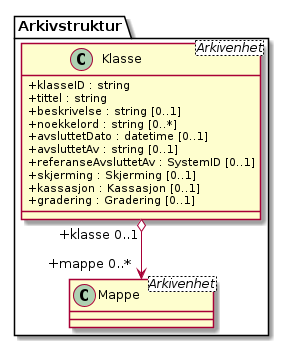 | ***Multiplisiteten*** forteller hvor mange forekomster som kan inngå. Multiplisitet kan brukes i forbindelse med assosiasjoner og også på klasseattributter. Dette vises med minst ett tall, men ofte to tall med to prikker mellom (0..1). Det første tallet angir minimums-multiplisitet (så mange det minst må være), det andre tallet er maksimumsmultiplisitet (så mange det maksimalt kan være). Eksempel: En Mappe kan høre til ingen eller en (0..1) Klasse, mens en Klasse kan «ha» ingen eller flere (0..***) Mapper(er). Stjernesymbol brukes til å angi «mange» (ubestemt tall større enn 1).En klasseattributt har angitt multiplisitet med klammeparenteser (\[0..1\]). Klasseattributten noekkelord kan forekomme ingen eller en gang. Når det ikke er angitt multiplisitet, skal dette oftest tolkes som (1..1). En Klasse skal alltid ha en klasseID, og kan bare ha en. En tom tekststreng-verdi ("") og en tekststreng som kun inneholder usynlige tegn (definert som beskrevet i vedlegg 5) er likestilt med en manglende verdi, slik at ved multiplisiteten [1..1] betyr det at klasseID også må ha en verdi forskjellig fra tom streng.|
| | Datatypene kan også være ***simple datatyper*** eller ***primitiver***. Disse brukes for å gi mulighet for restriksjoner også på primitivene. Epostadresse kan være modellert som en slik primitiv. Epost er en tekst-streng, men som i tillegg til å være tekst-streng også må oppfylle visse regler knytta til det å være gyldig epostadresse (bl.a. inneholde en og bare en forekomst av tegnet @). I eksempelet i figuren er SystemID en tekststreng (string) som i tillegg må oppfylle tilleggskrav. I store modeller kan det være hensiktsmessig å plassere ulike modell-elementer i ulike pakker. Da kan det også bli lettere for leseren å forstå modellen når han får vite hvilken pakke de ulike klassene er plassert i. Modellpakker kalles ofte ***navnerom*** (namespace) Dette kan angis foran klassenavnet, skilt fra klassenavnet med kolon (:). I eksempelet hører klassen SystemID til pakken/navnerommet Metadata og klassen string tilhører pakken/navnerommet BasicTypes.|

## Noark5v5


### Arkivstruktur 

Når en gjør GET mot href til relasjonsnøkkel
https://rel.arkivverket.no/noark5/v5/api/arkivstruktur/, så returneres liste
over relasjonsnøkler til de ulike entitetene som er tilgjengelig.
Disse kan brukes til å søke etter instanser av hver enkelt entitet.  I
tillegg er det relasjonsnøkler for å opprette entiteter på toppnivå i
arkivstrukturen, hvis brukeren har tilgang til å opprette nye
instanser (her ny-arkiv og ny-arkivskaper).  Resultatet kan for
eksempel starte slik:

```Python
{
  "_links": [
    {
      "rel": "https://rel.arkivverket.no/noark5/v5/api/arkivstruktur/arkiv/",
      "href": "https://n5.example.com/api/arkivstruktur/arkiv{?$filter&$orderby&$top&$skip&$search}",
      "templated": true
    },
    {
      "rel": "https://rel.arkivverket.no/noark5/v5/api/arkivstruktur/ny-arkiv/",
      "href": "https://n5.example.com/api/arkivstruktur/ny-arkiv",
    },
    ...
  ]
}
```

Følgende relasjonsnøkler skal listes opp fra en implementasjon som
støtter Arkivstruktur-pakken:

| **Relasjonsnøkkel**                                                   |
|-----------------------------------------------------------------------|
| https://rel.arkivverket.no/noark5/v5/api/arkivstruktur/arkiv/                 |
| https://rel.arkivverket.no/noark5/v5/api/arkivstruktur/arkivdel/              |
| https://rel.arkivverket.no/noark5/v5/api/arkivstruktur/arkivskaper/           |
| https://rel.arkivverket.no/noark5/v5/api/arkivstruktur/dokumentbeskrivelse/   |
| https://rel.arkivverket.no/noark5/v5/api/arkivstruktur/dokumentobjekt/        |
| https://rel.arkivverket.no/noark5/v5/api/arkivstruktur/klasse/                |
| https://rel.arkivverket.no/noark5/v5/api/arkivstruktur/klassifikasjonssystem/ |
| https://rel.arkivverket.no/noark5/v5/api/arkivstruktur/mappe/                 |
| https://rel.arkivverket.no/noark5/v5/api/arkivstruktur/registrering/          |

Følgende relasjonsnøkler skal tilsvarende listes opp for privilegerte
brukere etter innlogging:

| **Relasjonsnøkkel**                                                   |
|-----------------------------------------------------------------------|
| https://rel.arkivverket.no/noark5/v5/api/arkivstruktur/ny-arkiv/              |
| https://rel.arkivverket.no/noark5/v5/api/arkivstruktur/ny-arkivskaper/        |

Basis skjema for arkivstruktur og indre kjerne


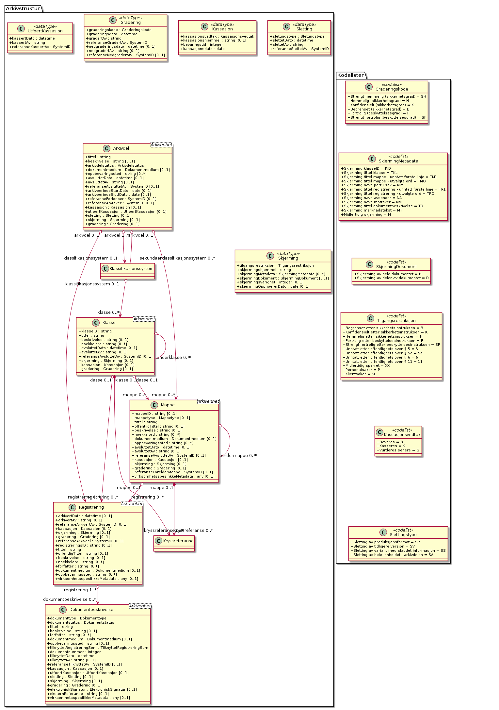


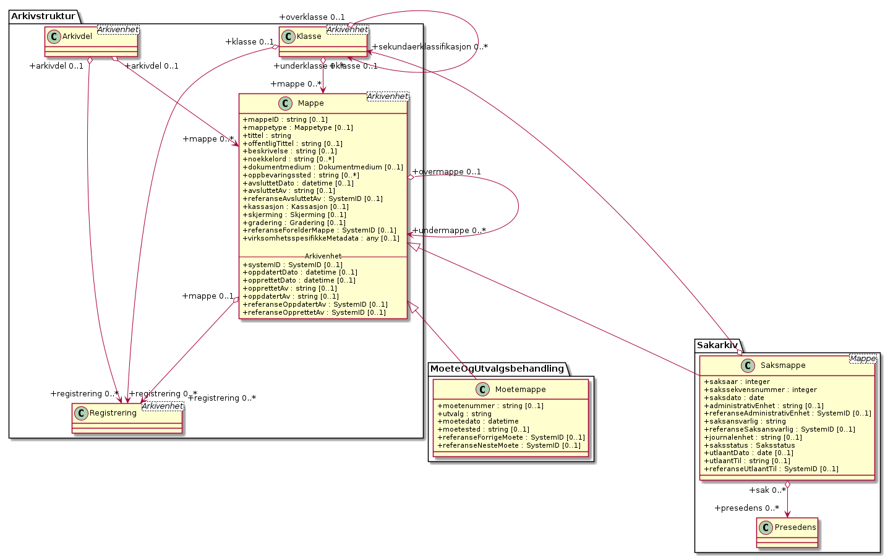


I fysiske sakarkiver har det vært vanlig å legge dokumenter som ikke
er journalføringspliktige - men som likevel er arkivpliktige (ikke
underlagt arkivbegrensning) - inn i saksomslaget uten at dette ble
registrert i journalen. Tilsvarende funksjonalitet bør også være mulig
i et elektronisk arkivsystem. Her må dokumentene nødvendigvis bli
registrert, men dette skal skje på en automatisk måte og med minst
mulig metadata.  Denne typen dokumenter tildeles ikke identifikasjonen
(nummereringen) i motsetning til journalposter.  Disse dokumentene
vil heller ikke komme på offentlig journal. Men de skal kunne inngå i
arkivuttrekk dersom de er bevaringsverdige, og det må være mulig å
skjerme dem internt. I Noark-4 ble dette kalt "loggede dokumenter". I
Noark 5 spesifiseres dette som en egen registreringstype kalt
registrering. En registrering inneholder alle metadata som er
nødvendig for å knytte registreringen til resten av
arkivstrukturen. Dette er metadata som også skal inngå i alle de andre
registreringstypene.  Metadata for registrering er derfor
obligatorisk, selv om det i selve løsningen ikke er implementert noen
funksjon for "arkivering uten journalføring".

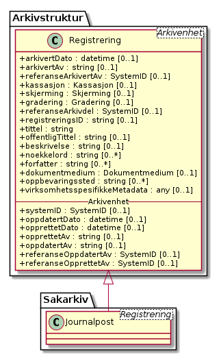

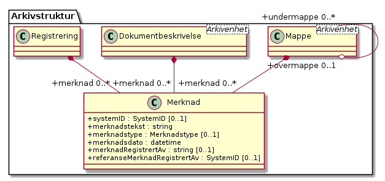


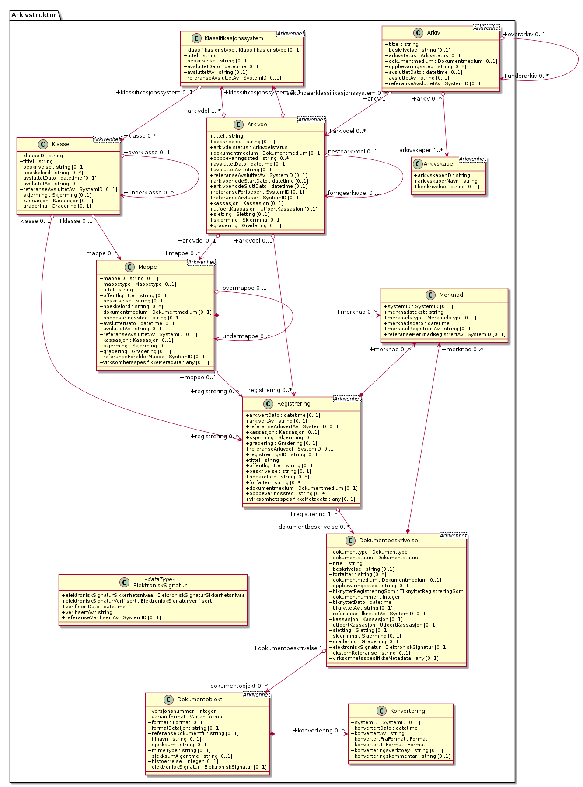


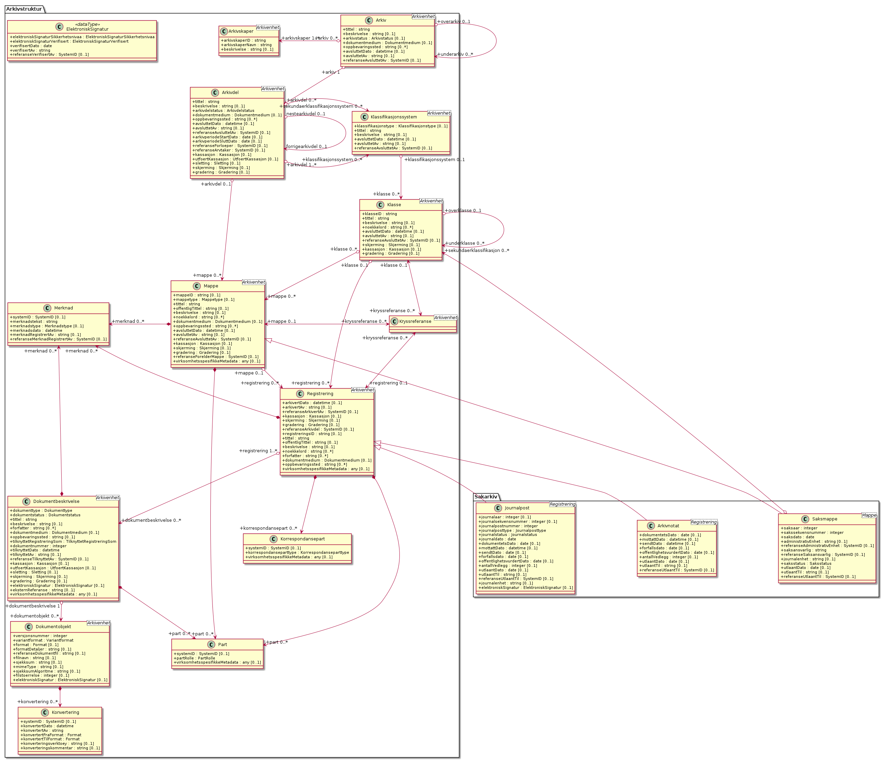


#### Arkiv

*Type:* ***Class***

*Arver:* ***Arkivenhet***

Arkiv er det øverste nivået i arkivstrukturen. De fleste brukere vil
bare ha behov for å opprette ett arkiv i sin Noark 5-løsning. Men det
skal være mulig å opprette flere arkiver. Det kan være aktuelt dersom
flere organer deler samme løsning. Det kan også være aktuelt dersom en
hel etat deler samme løsning. Her kan da f.eks. hovedkontoret og hvert
distriktskontor settes opp med hvert sitt arkiv. Men ved elektronisk
arkivering er det heller ikke noe i veien for at hele etaten deler
samme arkiv, selv om de enkelte avdelinger er spredt over et stort
geografisk område.

Arkiv er obligatorisk i et arkivuttrekk. Toppnivået skal bare ha én
forekomst, men kan ha ett eller flere undernivåer, se om underarkiv
nedenfor. Et arkiv skal inneholde en eller flere arkivdeler. Dersom
arkivet består av underarkiver, skal arkivdel være knyttet til det
laveste nivået av disse.

Table: Relasjoner

| **Relasjon**                              | **Kilde**                    | **Mål**          | **Merknad** |
| ----------------------------------------- | ---------------------------- | ---------------- | ----------- |
| **Aggregation** (Destination → Source)    | underarkiv 0..* Arkiv        | overarkiv 0..1 Arkiv  |             |
| **Generalization** (Source → Destination) | Arkiv                        | Arkivenhet       |             |
| **Aggregation** (Bi-Directional)          | arkivskaper 1..* Arkivskaper | arkiv 0..* Arkiv |             |
| **Aggregation** (Bi-Directional)          | arkivdel 0..* Arkivdel       | arkiv 1 Arkiv    |             |

Table: Relasjonsnøkler

| **Verdi**                                                              |
| ---------------------------------------------------------------------- |
| self                                                                   |
| https://rel.arkivverket.no/noark5/v5/api/arkivstruktur/arkiv/          |
| https://rel.arkivverket.no/noark5/v5/api/arkivstruktur/arkivdel/       |
| https://rel.arkivverket.no/noark5/v5/api/arkivstruktur/arkivskaper/    |
| https://rel.arkivverket.no/noark5/v5/api/arkivstruktur/ny-arkiv/       |
| https://rel.arkivverket.no/noark5/v5/api/arkivstruktur/ny-arkivdel/    |
| https://rel.arkivverket.no/noark5/v5/api/arkivstruktur/ny-arkivskaper/ |
| https://rel.arkivverket.no/noark5/v5/api/arkivstruktur/overarkiv/      |
| https://rel.arkivverket.no/noark5/v5/api/arkivstruktur/underarkiv/     |
| https://rel.arkivverket.no/noark5/v5/api/metadata/arkivstatus/         |
| https://rel.arkivverket.no/noark5/v5/api/metadata/dokumentmedium/      |

Table: Attributter

| **Navn**            | **Merknad**   | **Multipl.**  | **Kode**  | **Type**  |
|---------------------|---------------|---------------|-----------|-----------|
| tittel              | Definisjon: Tittel eller navn på arkivenheten Kilde: Registreres manuelt eller hentes automatisk fra innholdet i arkivdokumentet. Ja fra klassetittel dersom alle mapper skal ha samme tittel som klassen. Kan også hentes automatisk fra et fagsystem. Kommentarer: For saksmappe og journalpost vil dette tilsvare &quot;Sakstittel&quot; og &quot;Dokumentbeskrivelse&quot;. Disse navnene kan beholdes i grensesnittet. M020 | \[1..1\] | | string |
| beskrivelse         | Definisjon: Tekstlig beskrivelse av arkivenheten. Kilde: Registreres manuelt. Kommentarer: Tilsvarende attributt finnes ikke i Noark 4 (men noen tabeller hadde egne attributter for merknad som kunne brukes som et beskrivelsesfelt). M021 | \[0..1\] | | string |
| arkivstatus         | Definisjon: Status til arkivet . Kilde: Registreres manuelt når arkivet opprettes eller ved skifte av status. Kommentarer: (ingen)  M050 | \[0..1\] | | Arkivstatus |
| dokumentmedium      | Definisjon: Angivelse av om arkivenheten inneholder fysiske dokumenter, elektroniske dokumenter eller en blanding av fysiske og elektroniske dokumenter. Kilde: Arves fra overordnet nivå, kan overstyres manuelt. Kommentarer: Obligatorisk ved blanding av fysisk og elektronisk arkiv. Er hele arkivet enten fysisk eller elektronisk, er det tilstrekkelig med verdi på arkivnivå. Er en hel arkivdel enten fysisk eller elektronisk, er det tilstrekkelig å angi det på arkivdelnivå. Dersom underordnede arkivdeler inneholder både fysiske og elektroniske dokumenter, må informasjon om dette arves nedover i hierarkiet. Se også kommentar til M208 referanseArkivdel. M300 | \[0..1\] | | Dokumentmedium |
| oppbevaringssted    | Definisjon: Stedet hvor de fysiske dokumentene oppbevares. Kan være angivelse av rom, hylle, skap osv. Overordnede arkivdeler (f.eks. en arkivdel) kan oppbevares på flere steder. Kilde: Arves fra overordnet nivå, kan overstyres manuelt. Kommentarer: Fysiske dokumenters plassering skal ellers gå fram av arkivstrukturen. Fysiske dokumenter i et sakarkiv skal i utgangspunktet være ordnet i overordnede omslag (f.eks. hengemapper) etter stigende klasseID. Innenfor hver av disse skal omslagene skal dokumentene ligge i fysiske saksmapper som er ordnet etter stigende mappeID. Innenfor saksmappene skal dokumentene være ordnet etter stigende journalpostnummer (&quot;dokumentnummer&quot;). Vedlegg skal legges sammen med tilhørende hoveddokument.  M301 | \[0..\*\] | | string | 
| avsluttetDato       | Definisjon: Dato og klokkeslett når arkivenheten ble avsluttet/lukket . Kilde: Registreres automatisk av systemet når enheten avsluttes. Kommentarer: (ingen). M602 | \[0..1\] | | datetime| 
| avsluttetAv         | Definisjon: Navn på person som avsluttet/lukket arkivenheten. Kilde: Registreres automatisk av systemet ved opprettelse av enheten. Kommentarer: (ingen) M603 | \[0..1\] | | string |
| referanseAvsluttetAv| referanse til Bruker sin systemID | \[0..1\] | | SystemID |

Table: Restriksjoner

| **Navn**            | **Merknad**   | 
|---------------------|---------------|
| 5.2.1 En Noark 5-løsning skal kunne bestå av ett eller flere selvstendige Arkiv | |
| 5.2.2 Det skal være mulig å opprette ingen, ett eller flere Arkiv for en Arkivskaper (virksomhet) og det skal være mulig å angi at flere arkivskapere sammen skaper ett Arkiv. | |
| 5.2.3 Et Arkiv skal bestå av en eller flere arkivdeler og en Arkivdel skal inngå i (kun) ett Arkiv.| |
| 5.2.4 Dersom Arkiv er registrert som ”Avsluttet”, skal det ikke være mulig å legge til flere underliggende Arkivdeler. | | 
| 5.2.5 Når en tjeneste/funksjon sletter et helt Arkiv med alle underliggende nivå, skal dette logges. | |
| 5.2.6 Det skal ikke være mulig å endre dato for opprettelse av Arkiv. | |
| 5.2.7 Det skal ikke være mulig å slette dato for opprettelse av Arkiv. | |
| 5.2.8 Det skal ikke være mulig å slette dato for avslutning av  Arkiv. | |
| 5.2.9 Det skal være mulig å definere statusverdier for Arkiv. Følgende verdier er anbefalt: Opprettet, Avsluttet | |
| 5.2.10 Et Arkiv bør kunne inndeles i et hierarki (skissert i modellen ved bruk av egenrelasjon) av Underarkiver.| Merknad: Det bør være mulig med ett eller flere nivåer under Arkiv, f.eks. for å representere fysiske delarkiver. Dette kan være aktuelt for virksomheter som har arkiver fysisk plassert på flere forskjellige steder. | 
| 5.2.11 Systemet bør ha en tjeneste/funksjon for å angi et Arkiv som Underarkiv til et Arkiv.| |
| 5.2.12 Et Underarkiv skal kun opprettes og endres gjennom Administrasjonssystemet for Noark 5.| |
| Ny - Når arkivet settes &quot;Avsluttet&quot; så skal avsluttetDato og avsluttetAv registreres | |
| 5.13.4 Et Arkiv og arkivets metadata skal kun opprettes gjennom Administratorfunksjonen for Noark 5 kjerne. | |
| 5.13.5 Et Underarkiv skal kun defineres og endres gjennom Administratorfunksjonen for Noark 5 kjerne. | | 
| avsluttetAv_M603A   | avsluttetAv: Skal ikke kunne endres | 
| avsluttetAv_M603B   | avsluttetAv: Obligatorisk dersom arkivenheten er avsluttet.| 
| avsluttetDato_M602A | avsluttetDato: Skal ikke kunne endres. | 
| avsluttetDato_M602B | avsluttetDato: Obligatorisk dersom arkivenheten er avsluttet. |
| tittel_M020          | tittel: Skal normalt ikke kunne endres etter at enheten er lukket, eller dokumentene arkivert |

#### Arkivdel

*Type:* ***Class***

*Arver:* ***Arkivenhet***

Et arkiv skal kunne deles opp i arkivdeler for å gruppere arkivet
etter overordnede kriterier. De viktigste kriteriene for oppdeling i
arkivdeler er:

 - Skille mellom aktivt arkiv og avsluttede arkivperioder
   (tradisjonelt kalt bortsettingsarkiver). Viktige funksjoner i
   forbindelse med periodisering og produksjon av arkivuttrekk er
   knyttet til en arkivdel.
 - Skille mellom mapper som skal periodiseres etter forskjellige
   prinsipper. Emneordnede saksmapper kan periodiseres f.eks. hvert
   femte år, mens personalmapper kan beholdes i et aktiv arkiv så
   lenge en person er ansatt.
 - Skille mellom saksmapper som er klassifisert etter forskjellige
   prinsipper.
 - Skille mellom elektronisk arkiv og fysisk arkiv. Hovedregelen er at
   hele mapper enten skal være fysiske eller elektroniske. Men det kan
   gis dispensasjon fra denne regelen, slik at enkelte registreringer
   kan være fysiske og andre elektroniske i samme mappe.  Dersom et
   stort vedlegg (f.eks. en trykksak) ikke er blitt skannet, kan også
   fysiske dokumenter forekomme sammen med elektroniske dokumenter i
   samme registrering (journalpost).
 - Skille mellom sakarkivet og andre typer arkiver, f.eks. arkiver
   tilknyttet fagsystemer.  Noen vil ha behov for et klart skille
   mellom de administrative sakene og fagsakene. Det vil også være et
   behov for å skille ut møtedokumenter.
 - Skille mellom mapper, registreringer eller dokumenttyper som skal
   bevares eller som skal kasseres.
 - Skille mellom mapper, registreringer eller dokumenttyper som er
   offentlige eller som skal skjermes.

Arkivdel er obligatorisk i et arkivuttrekk, og skal forekomme én eller
flere ganger i et arkiv.  Dersom arkivet er delt opp i underarkiver,
skal arkivdel bare kunne knyttes til det laveste arkivnivået. Dersom
det dreier seg om et sakarkiv, skal arkivdelen inneholde et primært
klassifikasjonssystem. Arkivdelen kan i tillegg inneholde et eller
flere sekundære klassifikasjonssystemer. I et fagsystem uten
klassifikasjon, skal arkivdelen inneholde én eller flere mapper. I et
fagsystem uten klassifikasjon og mapper, skal arkivdelen inneholde én
eller flere registreringer.

Arkivdeler kan brukes til å skille ut dokumenter som skal kasseres
etter andre regler enn resten av dokumentene i mappen (f.eks. alle
inngående dokumenter) eller registreringen (f.eks. alle
vedlegg). Slike regler kan da knyttes til en egen arkivdel.  Se mer om
dette i Noark 5 v5.0 kapittel 6.1 Bevaring og kassasjon, om kassasjon
av dokumenttyper.  Det samme gjelder dokumenter som skal skjermes
etter andre regler enn resten av dokumentene i mappen eller
registreringen. Se mer under Noark 5 v5.0 kapittel 2.8.1 Skjerming.

Dessuten kan det være tilfeller hvor noen dokumenter i en mappe eller
registrering er arkivert på papir, mens resten av dokumentene er
elektroniske. En egen arkivdel skiller da ut disse dokumentene.

Arkivdeler som brukes til å angi andre kassasjonsvedtak,
skjermingsregler og dokumentmedium enn de som gjelder for resten av
innholdet i arkivet, vil være "tomme" – dvs. de har ikke egne
barn. Mapper, registreringer og dokumentbeskrivelse som har referanse
til slike arkivdeler, skal arve metadata fra disse. Disse mappene,
registreringene og dokumentbeskrivelsene vil indirekte også tilhøre
arkivdelen som er utgangspunktet for den hierarkiske arkivstrukturen,
men arv herfra blir overstyrt.

Table: Relasjoner

| **Relasjon**                              | **Kilde**                                                | **Mål**                | **Merknad** |
| ----------------------------------------- | -------------------------------------------------------- | ---------------------- | ----------- |
| **Generalization** (Source → Destination) | Arkivdel                                                 | Arkivenhet             |             |
| **Aggregation** (Bi-Directional)           | arkivdel 0..* Arkivdel                                   | arkiv 1 Arkiv          |             |
| **Aggregation** (Bi-Directional)           | forrigearkivdel 0..1 Arkivdel                           | nestearkivdel 0..1 Arkivdel | SystemID for forrige/neste Arkivdel avleveres som referanseForloeper(M202)/referanseArvtaker(M203). |
| **Aggregation** (Bi-Directional)           | klassifikasjonssystem 0..1 Klassifikasjonssystem         | arkivdel 1..* Arkivdel |             |
| **Aggregation** (Bi-Directional)           | registrering 0..* Registrering                           | arkivdel 0..1 Arkivdel |             |
| **Aggregation** (Bi-Directional)           | mappe 0..* Mappe                                         | arkivdel 0..1 Arkivdel |             |
| **Aggregation** (Destination → Source)     | sekundaerklassifikasjonssystem 0..* Klassifikasjonssystem | Arkivdel               |             |

Table: Relasjonsnøkler

| **Verdi**                                                                        |
| -------------------------------------------------------------------------------- |
| self                                                                             |
| https://rel.arkivverket.no/noark5/v5/api/arkivstruktur/arkiv/                    |
| https://rel.arkivverket.no/noark5/v5/api/arkivstruktur/arkivdel/                 |
| https://rel.arkivverket.no/noark5/v5/api/arkivstruktur/forrigearkivdel/          |
| https://rel.arkivverket.no/noark5/v5/api/arkivstruktur/klassifikasjonssystem/    |
| https://rel.arkivverket.no/noark5/v5/api/arkivstruktur/mappe/                    |
| https://rel.arkivverket.no/noark5/v5/api/arkivstruktur/nestearkivdel/            |
| https://rel.arkivverket.no/noark5/v5/api/arkivstruktur/ny-arkiv/                 |
| https://rel.arkivverket.no/noark5/v5/api/arkivstruktur/ny-arkivdel/              |
| https://rel.arkivverket.no/noark5/v5/api/arkivstruktur/ny-klassifikasjonssystem/ |
| https://rel.arkivverket.no/noark5/v5/api/arkivstruktur/ny-mappe/                 |
| https://rel.arkivverket.no/noark5/v5/api/arkivstruktur/ny-registrering/          |
| https://rel.arkivverket.no/noark5/v5/api/arkivstruktur/registrering/             |
| https://rel.arkivverket.no/noark5/v5/api/metadata/arkivdelstatus/                |
| https://rel.arkivverket.no/noark5/v5/api/metadata/dokumentmedium/                |

Hvis pakken Sakarkiv er tilgjengelig, så skal følgende relasjonsnøkkel
også være tilgjengelig via Arkivdel-instanser.

Table: Relasjonsnøkler

| **Verdi**                                                       |
| --------------------------------------------------------------- |
| https://rel.arkivverket.no/noark5/v5/api/sakarkiv/ny-saksmappe/ |

Merk at underliggende lister med Saksmappe og andre underentiteter er
tilgjengelig via relasjonsnøkkel
`https://rel.arkivverket.no/noark5/v5/api/arkivstruktur/mappe/`,
dermed er det ikke egne relasjonsnøkler for å hente ut lister med de
spesifikke under-entitetene.

Table: Attributter

| **Navn**              | **Merknad**   | **Multipl.**  | **Kode**  | **Type**  |
|-----------------------|---------------|---------------|-----------|-----------|
| tittel                | Definisjon: Tittel eller navn på arkivenheten. Kilde: Registreres manuelt eller hentes automatisk fra innholdet i arkivdokumentet. Ja fra klassetittel dersom alle mapper skal ha samme tittel som klassen. Kan også hentes automatisk fra et fagsystem. Kommentarer: For saksmappe og journalpost vil dette tilsvare &quot;Sakstittel&quot; og &quot;Dokumentbeskrivelse&quot;. Disse navnene kan beholdes i grensesnittet. M020 | \[1..1\] | | string | 
| beskrivelse           | Definisjon: Tekstlig beskrivelse av arkivenheten. Kilde: Registreres manuelt. Kommentarer: Tilsvarende attributt finnes ikke i Noark 4 (men noen tabeller hadde egne attributter for merknad som kunne brukes som et beskrivelsesfelt). M021 | \[0..1\] | | string | 
| arkivdelstatus        | Definisjon: Status til den arkivperioden som arkivdelen omfatter . Kilde: Registreres manuelt når arkivdelen opprettes eller ved skifte av status. Kommentarer: Arkivdeler som avleveres skal ha status 'Avsluttet periode'. M051 |  \[1..1\] | | Arkivdelstatus|
| dokumentmedium        | Definisjon: Angivelse av om arkivenheten inneholder fysiske dokumenter, elektroniske dokumenter eller en blanding av fysiske og elektroniske dokumenter. Kilde: Arves fra overordnet nivå, kan overstyres manuelt. Kommentarer: Obligatorisk ved blanding av fysisk og elektronisk arkiv. Er hele arkivet enten fysisk eller elektronisk, er det tilstrekkelig med verdi på arkivnivå. Er en hel arkivdel enten fysisk eller elektronisk, er det tilstrekkelig å angi det på arkivdelnivå. Dersom underordnede arkivdeler inneholder både fysiske og elektroniske dokumenter, må informasjon om dette arves nedover i hierarkiet. Se også kommentar til M208 referanseArkivdel. M300 | \[0..1\] | | Dokumentmedium |
| oppbevaringssted      | Definisjon: Stedet hvor de fysiske dokumentene oppbevares. Kan være angivelse av rom, hylle, skap osv. Overordnede arkivdeler (f.eks. en arkivdel) kan oppbevares på flere steder. Kilde: Arves fra overordnet nivå, kan overstyres manuelt. Kommentarer: Fysiske dokumenters plassering skal ellers gå fram av arkivstrukturen. Fysiske dokumenter i et sakarkiv skal iutgangspunktet være ordnet i overordnede omslag (f.eks. hengemapper) etter stigende klasseID. Innenfor hver av disse skal omslagene skal dokumentene ligge i fysiske saksmapper som er ordnet etter stigende mappeID. Innenfor saksmappene skal dokumentene være ordnet etter stigende journalpostnummer (&quot;dokumentnummer&quot;). Vedlegg skal legges sammen med tilhørende hoveddokument. M301 | \[0..\*\] | | string |
| avsluttetDato         | Definisjon: Dato og klokkeslett når arkivenheten ble avsluttet/lukket . Kilde: Registreres automatisk av systemet når enheten avsluttes. Kommentarer: (ingen) M602 | \[0..1\] | | datetime| 
| avsluttetAv           | Definisjon: Navn på person som avsluttet/lukket arkivenheten. Kilde: Registreres automatisk av systemet ved opprettelse av enheten. Kommentarer: (ingen) M603 | \[0..1\] | | string | 
| referanseAvsluttetAv  |           | \[0..1\] | | SystemID | 
| arkivperiodeStartDato | Definisjon: Dato for starten av en arkivperiode . Kilde: Settes automatisk til samme dato som M600 opprettetDato. Kommentarer: Det kan tenkes tilfeller hvor startdatoen ikke er identisk med datoen arkivdelen ble opprettet M107 | \[0..1\] | | date | 
| arkivperiodeSluttDato | Definisjon: Dato for slutten av en arkivperiode . Kilde: Settes automatisk til samme dato som M602 avsluttetDato. Kommentarer: Det kan forekomme tilfeller hvor sluttdatoen ikke er identisk med datoen arkivdelen ble avsluttet. M108 | \[0..1\] | | date |
| referanseForloeper    | M202      | \[0..1\] | | SystemID         |
| referanseArvtaker     | M203      | \[0..1\] | | SystemID         |
| kassasjon             |           | \[0..1\] | | Kassasjon        |
| utfoertKassasjon      |           | \[0..1\] | | UtfoertKassasjon |
| sletting              |           | \[0..1\] | | Sletting         |
| skjerming             |           | \[0..1\] | | Skjerming        |
| gradering             |           | \[0..1\] | | Gradering        |

Table: Restriksjoner

| **Navn**            | **Merknad**   | 
|---------------------|---------------|
| 5.2.13 En Arkivdel kan ha registrert ingen eller ett preferert Klassifikasjonssystem og et Klassifikasjonssystem kan inngå i ingen, en eller flere Arkivdel(er). | |
| 5.2.14 En Arkivdel kan ha registrert ingen eller en Skjerming og en Skjerming kan inngå i ingen, en eller flere Arkivdeler | |
| 5.2.15 En Arkivdel kan ha registrert ingen eller en Bevaring og kassasjon og en Bevaring og kassasjon kan inngå i ingen, en eller flere Arkivdeler. | |
| 5.2.16 En Arkivdel kan ha tilknyttet (inneholde) ingen, en eller flere Mapper. | |
| 5.2.17 Når en tjeneste/funksjon sletter en Arkivdel, skal dette logges. | |
| 5.2.18 Det skal finnes en tjeneste/funksjon for å ajourholde primært Klassifikasjonssystem for en Arkivdel. (referanseKlassifikasjonssystem) | |
| 5.2.19 Dersom Arkivdel er registrert som avsluttet (avsluttetDato er satt) skal det ikke være mulig å legge til flere tilhørende Mapper eller Registreringer | |
| 5.2.20 En arkivdel skal inneholde informasjon om hvilken status arkivperioden har. | Autoriserte brukere skal kunne endre statusverdier. Obligatoriske verdier er: 1. Aktiv periode 2. Overlappingsperiode 3. Avsluttet periode Andre verdier kan brukes ved behov. |
| 5.2.21 En arkivdel skal inneholde dato for når arkivperioden starter. | |
| 5.2.22 En avsluttet arkivdel skal inneholde dato for når perioden ble avsluttet. | |
| 5.2.23 En arkivdel skal inneholde informasjon om de tilhørende dokumentene er fysiske eller elektroniske. | |
| Ny - arkivdel kan ha liste med enten klassifikasjonssystem eller mapper | |
| Ny - Når arkivdel settes &quot;Avsluttet&quot; så skal avsluttetDato og avsluttetAv registreres | |
| 5.10.1 En Arkivdel skal kunne ha registrert ingen eller ett Kassasjonsvedtak og et Kassasjonsvedtak kan inngå i ingen, en eller flere Arkivdeler. | |
| 5.10.8 Det skal finnes en tjeneste/funksjon for å ajourholde kassasjonsvedtak, kassasjonshjemmel og bevaringstid for en Arkivdel. | |
| 5.10.9 Metadata om bevaring og kassasjon på en Arkivdel skal kunne arves til Mappe, Registrering og Dokumentbeskrivelse. | |
| 5.10.10 Dersom arv av metadata om bevaring og kassasjon skal skje fra arkivdel, skal dette overstyre arv av metadata fra klassene. | |
| 5.10.16 Det skal være mulig å slå av funksjonen for arv fra klasser og arkivdeler, slik at metadata om bevaring og kassasjon ikke arves til underliggende mapper. | |
| 5.11.1 En arkivdel skal kunne inneholde en tekstlig beskrivelse av hvilke prinsipper den skal periodiseres etter. | |
| 5.11.2 En arkivdel skal inneholde referanser til eventuelle forløpere og arvtakere. | |
| 5.11.4 En arkivdel som inneholder en overlappingsperiode, skal være sperret for tilføyelse av nyopprettede mapper. Men eksisterende mapper i en overlappingsperiode skal være åpne for nye registreringer | |
| 5.11.5 Dersom en ny registrering føyes til en mappe som tilhører en arkivdel i overlappingsperiode, skal mappen automatisk overføres til arkivdelens arvtaker. | |
| 5.11.6 En arkivdel som inneholder en avsluttet arkivperiode, skal være sperret for tilføyelse av nye mapper. Alle mapper skal være lukket, slik at heller ingen registreringer og dokumenter kan føyes til. | |
| 5.11.7 Det skal være umulig å avslutte en arkivdel i overlappingsperiode dersom den fremdeles inneholder åpne mapper. | |
| 5.11.13 Dersom dokumentene i en arkivdel er ikke-elektroniske (fysiske), skal det også være mulig å registrere oppbevaringssted. | |
| 5.13.6 En Arkivdel og arkivdelens metadata skal kun opprettes og endres gjennom Administratorfunksjonen for Noark 5 kjerne. | |
| 6.6.9 - 6.6.19 rettighetsangivelser | |
| 6.6.25 Det skal finnes en tjeneste/funksjon for å ajourholde opplysninger om skjermingskode (skjermingsgrad, skjermingshjemmel og skjermingsvarighet) for en verdi av Arkivdel, klasse, Mappe, Registrering og Dokumentbeskrivelse | |
| 6.6.26 Skjerming bør kunne arves til mappe, journalpost, dokumentbeskrivelse og dokumentobjekt. Arvede verdier skal kunne overstyres. | |
| M020 tittel: Skal normalt ikke kunne endres etter at enheten er lukket, eller dokumentene arkivert | |
| M107 arkivperiodeStartDato: Skal kunne endres manuelt| |
| M108 arkivperiodeSluttDato: Skal kunne endres manuelt| |
| M601 avsluttetDato: Skal ikke kunne endres. Obligatorisk dersom arkivdelen er avsluttet. | |
| M603 avsluttetAv: Skal ikke kunne endres. Obligatorisk dersom arkivenheten er avsluttet. | |

#### Arkivenhet

*Type:* ***Class***

*Arver:* 

En arkivenhet (se Noark 5 v5.0 krav 2.2.2) skal kunne
identifiseres entydig innenfor det arkivskapende organet. I et
arkivuttrekk skal denne identifikasjonen hete systemID, og være
entydig på tvers av alle uttrekk som organet produserer, dermed også
på tvers av alle systemer organet benytter. Også arkivenheter som
dupliseres i et arkivuttrekk, skal identifiseres entydig, slik at
identiske arkivenheter har ulik systemID.

Table: Relasjoner

| **Relasjon**                                 | **Kilde**                                                | **Mål**                | **Merknad** |
| -------------------------------------------- | -------------------------------------------------------- | ---------------------- | ----------- |
| **Generalization** (Source → Destination)  | Arkivdel                                                 | Arkivenhet             |             |
| **Aggregation** (Destination → Source)     | endringslogg 0..* Endringslogg                           | 0..1 Arkivenhet        |             |
| **Generalization** (Source → Destination)  | Klassifikasjonssystem                                    | Arkivenhet             |             |
| **Generalization** (Source → Destination)  | Arkiv                                                    | Arkivenhet             |             |
| **Generalization** (Source → Destination)  | Mappe                                                    | Arkivenhet             |             |
| **Generalization** (Source → Destination)  | Klasse                                                   | Arkivenhet             |             |
| **Generalization** (Source → Destination)  | Arkivskaper                                              | Arkivenhet             |             |
| **Generalization** (Source → Destination)  | Registrering                                             | Arkivenhet             |             |
| **Generalization** (Source → Destination)  | Dokumentbeskrivelse                                      | Arkivenhet             |             |

Table: Relasjonsnøkler

| **Verdi**                                                                   |
| --------------------------------------------------------------------------- |
| https://rel.arkivverket.no/noark5/v5/api/loggingogsporing/ny-endringslogg/  |
| https://rel.arkivverket.no/noark5/v5/api/loggingogsporing/endringslogg/     |

Table: Attributter

| **Navn**             | **Merknad**   | **Multipl.**  | **Kode**  | **Type**  |
|----------------------|---------------|---------------|-----------|-----------|
| systemID             | M001 Entydig identifikasjon av arkivenheten innenfor det arkivskapende organet. Dersom organet har flere arkivsystemer, skal altså *systemID* være gjennomgående entydig. Systemidentifikasjonen vil som oftest være en numerisk kode uten noe logisk meningsinnhold. Identifikasjonen trenger ikke å være synlig for brukerne. Registreres automatisk av systemet. Skal ikke kunne endres. Alle referanser fra en arkivenhet til en annen skal peke til arkivenhetens systemidentifikasjon. Dette gjelder også referanser fra en arkivdel til en annen, f.eks. mellom to arkivperioder som avleveres på forskjellig tidspunkt. I et arkivuttrekk skal *systemID* være entydig (unik). Dokumentobjekt har ingen systemidentifikasjon fordi enheten kan være duplisert i et arkivuttrekk dersom samme dokumentfil er knyttet til flere forskjellige registreringer. | \[0..1\] | | SystemID |
| oppdatertDato        |               | \[0..1\] | | datetime |
| opprettetDato        | Definisjon: Dato og klokkeslett når arkivenheten ble opprettet/registrert. Kilde: Registreres automatisk av systemet ved opprettelse av enheten. Kommentarer: (ingen). M600 | \[0..1\] | | datetime| 
| opprettetAv          | Definisjon: Navn på person som opprettet/registrerte arkivenheten. Kilde: Registreres automatisk av systemet ved opprettelse av enheten. Kommentarer: (ingen). M601 | \[0..1\] | | string | 
| oppdatertAv          | Definisjon: Navn på person som oppdaterte arkivenheten. Kilde: Registreres automatisk av systemet ved oppdatering av enheten | \[0..1\] | | string | 
| referanseOppdatertAv | Definisjon: SystemID på person som oppdaterte arkivenheten. Kilde: Registreres automatisk av systemet ved oppdatering av enheten | \[0..1\] | | SystemID |
| referanseOpprettetAv | Definisjon: SystemID på person som opprettet/registrerte arkivenheten. Kilde: Registreres automatisk av systemet ved opprettelse av enheten | \[0..1\] | | SystemID |

Table: Restriksjoner

| **Navn**                                          | **Merknad** |
| ------------------------------------------------- | ----------- |
| Ny - Ved oppretting av Arkivenhet fyller API-tjenesten inn systemID, opprettetAv og opprettetDato.  Dette gjelder også alle underentiteter.  Disse attributtene trenger derfor ikke sendes inn ved oppretting. | |
| M001 systemID: Skal ikke kunne endres             |             |
| M600 opprettetDato: Skal ikke kunne endres        |             |
| M601 opprettetAv: Skal ikke kunne endres          |             |

#### Arkivskaper

*Type:* ***Class***

*Arver:* ***Arkivenhet***

Tradisjonelt har et arkiv blitt definert etter organisasjon. Ett organ
skaper ett arkiv, dvs.  organet er arkivskaperen. Men elektronisk
informasjonsteknologi har ført til at det blir stadig vanligere at
flere arkivskapere sammen skaper ett arkiv. Arkivet vil da være
definert etter funksjon, ikke organisasjon.

I en Noark 5-løsning skal det altså være mulig å knytte en eller flere
arkivskapere til ett arkiv.  Informasjon om arkivskapere er
obligatorisk i arkivuttrekk.

Table: Relasjoner

| **Relasjon**                             | **Kilde**                                                | **Mål**                | **Merknad** |
| ---------------------------------------- | -------------------------------------------------------- | ---------------------- | ----------- |
| **Aggregation** (Bi-Directional)           | arkivskaper 1..* Arkivskaper                             | arkiv 0..* Arkiv       |             |
| **Generalization** (Source → Destination)  | Arkivskaper                                              | Arkivenhet             |             |

Table: Relasjonsnøkler

| **Verdi**                                                              |
| ---------------------------------------------------------------------- |
| self                                                                   |
| https://rel.arkivverket.no/noark5/v5/api/arkivstruktur/arkiv/          |
| https://rel.arkivverket.no/noark5/v5/api/arkivstruktur/arkivskaper/    |
| https://rel.arkivverket.no/noark5/v5/api/arkivstruktur/ny-arkiv/       |
| https://rel.arkivverket.no/noark5/v5/api/arkivstruktur/ny-arkivskaper/ |

Table: Attributter

| **Navn**  | **Merknad**   | **Multipl.**  | **Kode**  | **Type**  |
|-----------|---------------|---------------|-----------|-----------|
| arkivskaperID | Definisjon: Unik ID for arkivskaperen. Kilde: Registreres manuelt ved opprettelsen av arkivet. Kommentar: Kan være organisasjonsnummer (Brønnøysundregistrene) eller annen identifikasjon avtalt med arkivdepotet. M006 | \[1..1\]  | | string | 
| arkivskaperNavn | Definisjon: Navn på organisasjonen som har skapt arkivet . Kilde: Registreres manuelt ved opprettelsen av arkivet. Kommentarer: (ingen). M023 | \[1..1\] | | string | 
| beskrivelse | Definisjon: Tekstlig beskrivelse av arkivenheten. Kilde: Registreres manuelt. Kommentarer: Tilsvarende attributt finnes ikke i Noark 4 (men noen tabeller hadde egne attributter for merknad som kunne brukes som et beskrivelsesfelt). M021 | \[0..1\] | | string |

#### Registrering

*Type:* ***Class***

*Arver:* ***Arkivenhet***

En registrering inneholder alle metadata fra registrering og
basisregistrering i Noark 5 versjon 4, samt andre metadata som er
obligatoriske i alle typer arkivsystemer. En registrering kan være
utgangspunkt for andre registreringstyper for spesialiserte
fagsystemer.

Hvis en ønsker å opprette en forenklet registrering uten tittel (kalt
registrering i Noark 5 versjon 4), så skal tittel-attributten settes
til «[forenklet registrering]».  En kan også bruke Arkivnotat.
Instanser av registrering med denne tittelen og der ingen andre
attributter enn de fra Arkivenhet og arkivertAv, arkivertDato,
gradering, kassasjon, referanseArkivdel, referanseArkivertAv og
skjerming (det forenklede attributtsett) er i bruk, kan deponeres og
avleveres som registrering i deponi-XML.  Denne tittelverdien skal kun
brukes for instanser som kun har det forenklede attributtsett.  Hvis
flere attributter er brukt, så må en benytte basisregistrering i slik
XML ved avlevering som Noark 5 versjon 4.

Table: Relasjoner

| **Relasjon**                             | **Kilde**                                                | **Mål**                | **Merknad** |
| ---------------------------------------- | -------------------------------------------------------- | ---------------------- | ----------- |
| **Generalization** (Source → Destination)  | Registrering                                             | Arkivenhet             |             |
| **Aggregation** (Bi-Directional)           | registrering 0..* Registrering                           | mappe 0..1 Mappe       |             |
| **Aggregation** (Bi-Directional)           | registrering 0..* Registrering                           | arkivdel 0..1 Arkivdel |             |
| **Aggregation** (Bi-Directional)           | registrering 0..* Registrering                           | klasse 0..1 Klasse     |             |
| **Aggregation** (Bi-Directional)           | dokumentbeskrivelse 0..* Dokumentbeskrivelse             | registrering 1..* Registrering |     |
| **Aggregation** (Destination → Source)     | nasjonalidentifikator 0..* Nasjonalidentifikator         | Registrering           |             |
| **Association** (Destination → Source)     | korrespondansepart 0..* Korrespondansepart               | Registrering         |             |
| **Association** (Destination → Source)     | part 0..* Part                                           | Registrering         |             |
| **Association** (Bi-Directional)           | kryssreferanse 0..* Kryssreferanse                       | registrering 0..1 Registrering ||
| **Generalization** (Source → Destination)  | Journalpost                                              | Registrering      |             |
| **Association** (Destination → Source)     | merknad 0..* Merknad                                     | Registrering      |             |

Table: Relasjonsnøkler

| **Verdi**                                                                      |
| ------------------------------------------------------------------------------ |
| self                                                                           |
| https://rel.arkivverket.no/noark5/v5/api/arkivstruktur/arkivdel/               |
| https://rel.arkivverket.no/noark5/v5/api/arkivstruktur/bygning/                |
| https://rel.arkivverket.no/noark5/v5/api/arkivstruktur/dnummer/                |
| https://rel.arkivverket.no/noark5/v5/api/arkivstruktur/dokumentbeskrivelse/    |
| https://rel.arkivverket.no/noark5/v5/api/arkivstruktur/foedselsnummer/         |
| https://rel.arkivverket.no/noark5/v5/api/arkivstruktur/klasse/                 |
| https://rel.arkivverket.no/noark5/v5/api/arkivstruktur/korrespondansepart/     |
| https://rel.arkivverket.no/noark5/v5/api/arkivstruktur/kryssreferanse/         |
| https://rel.arkivverket.no/noark5/v5/api/arkivstruktur/mappe/                  |
| https://rel.arkivverket.no/noark5/v5/api/arkivstruktur/matrikkel/              |
| https://rel.arkivverket.no/noark5/v5/api/arkivstruktur/merknad/                |
| https://rel.arkivverket.no/noark5/v5/api/arkivstruktur/nasjonalidentifikator/  |
| https://rel.arkivverket.no/noark5/v5/api/arkivstruktur/ny-arkivdel/            |
| https://rel.arkivverket.no/noark5/v5/api/arkivstruktur/ny-bygning/             |
| https://rel.arkivverket.no/noark5/v5/api/arkivstruktur/ny-dnummer/             |
| https://rel.arkivverket.no/noark5/v5/api/arkivstruktur/ny-dokumentbeskrivelse/ |
| https://rel.arkivverket.no/noark5/v5/api/arkivstruktur/ny-foedselsnummer/      |
| https://rel.arkivverket.no/noark5/v5/api/arkivstruktur/ny-korrespondansepartenhet/  |
| https://rel.arkivverket.no/noark5/v5/api/arkivstruktur/ny-korrespondansepartintern/ |
| https://rel.arkivverket.no/noark5/v5/api/arkivstruktur/ny-korrespondansepartperson/ |
| https://rel.arkivverket.no/noark5/v5/api/arkivstruktur/ny-kryssreferanse/      |
| https://rel.arkivverket.no/noark5/v5/api/arkivstruktur/ny-mappe/               |
| https://rel.arkivverket.no/noark5/v5/api/arkivstruktur/ny-matrikkel/           |
| https://rel.arkivverket.no/noark5/v5/api/arkivstruktur/ny-merknad/             |
| https://rel.arkivverket.no/noark5/v5/api/arkivstruktur/ny-partenhet/           |
| https://rel.arkivverket.no/noark5/v5/api/arkivstruktur/ny-partperson/          |
| https://rel.arkivverket.no/noark5/v5/api/arkivstruktur/ny-plan/                |
| https://rel.arkivverket.no/noark5/v5/api/arkivstruktur/ny-posisjon/            |
| https://rel.arkivverket.no/noark5/v5/api/arkivstruktur/ny-registrering/        |
| https://rel.arkivverket.no/noark5/v5/api/arkivstruktur/part/                   |
| https://rel.arkivverket.no/noark5/v5/api/arkivstruktur/plan/                   |
| https://rel.arkivverket.no/noark5/v5/api/arkivstruktur/posisjon/               |
| https://rel.arkivverket.no/noark5/v5/api/arkivstruktur/registrering/           |
| https://rel.arkivverket.no/noark5/v5/api/metadata/dokumentmedium/              |

Hvis pakken Sakarkiv er tilgjengelig, så skal følgende relasjonsnøkler
også være tilgjengelig via Registrering-instanser som har en
Saksmappe som foreldre.

Table: Relasjonsnøkler

| **Verdi**                                                                |
| ------------------------------------------------------------------------ |
| https://rel.arkivverket.no/noark5/v5/api/sakarkiv/utvid-til-journalpost/ |

Table: Attributter

| **Navn**                      | **Merknad**   | **Multipl.**  | **Kode**  | **Type**  |
|-------------------------------|---------------|---------------|-----------|-----------|
| arkivertDato                  | Definisjon. Dato og klokkeslett når alle dokumentene som er tilknyttet registreringen ble arkivert . Kilde: Registreres automatisk ved utførelse av en funksjon som markerer at dokumentene er arkivert. For journalposter kan dette knyttes til endring av journalstatus. Kommentarer: Arkivering innebærer at dokumentene blir &quot;frosset&quot;, dvs. sperret for all videre redigering/endring M604 | \[0..1\] | | datetime |
| arkivertAv                    | Definisjon: Navn på person som arkiverte dokumentet og frøs det for all videre redigering . Kilde: Registreres automatisk ved utførelse av en funksjon som markerer at dokumentene er arkivert. For journalposter kan dette knyttes til endring av journalstatus. Kommentarer: (ingen) M605 | \[0..1\] | | string |
| referanseArkivertAv           |     | \[0..1\] | | SystemID |
| kassasjon                     |     | \[0..1\] | | Kassasjon |
| skjerming                     |     | \[0..1\] | | Skjerming |
| gradering                     |     | \[0..1\] | | Gradering |
| referanseArkivdel             |     | \[0..1\] | | SystemID |
| registreringsID               | Definisjon: Entydig identifikasjon av registreringen innenfor arkivet. Kilde: Registreres automatisk av systemet etter interne regler. Kommentar: Ulike arkiv innenfor samme system kan inneholde samme identifikasjon. Identifikasjonen kan være rent numerisk, men den kan også ha en logisk oppbygging. Er en videreføring av saksår og sakssekvensnummer (oftest bare kalt &quot;saksnummer&quot;") i kombinasjon med &quot;dokumentnummer&quot; i Noark 4 (f.eks. 2011/3869-8, dvs. dokument nummer 8 i saksnummer 2011/3869), men trenger ikke ha denne formen for andre deler av arkivet. M004 | \[0..1\] | | string |
| tittel                        | Definisjon: Tittel eller navn på arkivenheten. Kilde: Registreres manuelt eller hentes automatisk fra innholdet i arkivdokumentet. Ja fra klassetittel dersom alle mapper skal ha samme tittel som klassen. Kan også hentes automatisk fra et fagsystem. Kommentarer: For saksmappe og journalpost vil dette tilsvare &quot;Sakstittel&quot; og &quot;Dokumentbeskrivelse&quot;. Disse navnene kan beholdes i grensesnittet.   Settes til «[forenklet registrering]» for forenklede registreringer kompatible med Noark 5 versjon 4.  M020 | \[1..1\] | | string |
| offentligTittel               | Definisjon: Offentlig tittel på arkivenheten, ord som skal skjermes er fjernet fra innholdet i tittelen (erstattet med ******) . Kilde: (ingen). Kommentarer: I løpende og offentlig journaler skal også offentligTittel være med dersom ord i tittelfeltet skal skjermes. M025 | \[0..1\] | | string | 
| beskrivelse                   | Definisjon: Tekstlig beskrivelse av arkivenheten. Kilde: Registreres manuelt. Kommentarer: Tilsvarende attributt finnes ikke i Noark 4 (men noen tabeller hadde egne attributter for merknad som kunne brukes som et beskrivelsesfelt). M021 | \[0..1\] | | string | 
| noekkelord                     | Definisjon: Nøkkeord eller stikkord som beskriver innholdet i enheten. Kilde: Registreres vanligvis ved oppslag fra liste (f.eks. en tesaurus). Kan også registreres automatisk på grunnlag av dokumentinnhold eller integrering med fagsystem. Kommentarer: Noekkelord kan brukes for å forbedre mulighetene for søking og gjenfinning. Noekkelord skal ikke erstatte klassifikasjon. M022 | \[0..\*\] | | string |
| forfatter                     | Definisjon: Navn på person (eller eventuelt organisasjon) som har forfattet eller skapt dokumentet. Kilde: Registreres automatisk av systemet, automatisk fra innholdet i dokumentet eller  manuelt. Kommentarer: Sakarkiver har tradisjonelt ikke noen forfatter på journalposten, men kan eventuelt ha det på dokumentbeskrivelsen. I en journalpost vil derfor forfatter vanligvis være forstått som M307 saksbehandler (utgående og organinterne dokumenter) eller eventuelt M400 korrespondansepartNavn (ved inngående dokumenter). Fagsystemer uten korrespondansedokumenter bør normal ha en forfatter. Her kan personnavn eventuelt erstattes med en kilde (f.eks. et system). M024 | \[0..\*\] | | string |
| dokumentmedium                | Definisjon: Angivelse av om arkivenheten inneholder fysiske dokumenter, elektroniske dokumenter eller en blanding av fysiske og elektroniske dokumenter. Kilde: Arves fra overordnet nivå, kan overstyres manuelt. Kommentarer: Obligatorisk ved blanding av fysisk og elektronisk arkiv. Er hele arkivet enten fysisk eller elektronisk, er det tilstrekkelig med verdi på arkivnivå. Er en hel arkivdel enten fysisk eller elektronisk, er det tilstrekkelig å angi det på arkivdelnivå. Dersom underordnede arkivdeler inneholder både fysiske og elektroniske dokumenter, må informasjon om dette arves nedover i hierarkiet. Se også kommentar til M208 referanseArkivdel. M300 | \[0..1\] | | Dokumentmedium |
| oppbevaringssted              | Definisjon: Stedet hvor de fysiske dokumentene oppbevares. Kan være angivelse av rom, hylle, skap osv. Overordnede arkivdeler (f.eks. en arkivdel) kan oppbevares på flere steder. Kilde: Arves fra overordnet nivå, kan overstyres manuelt. Kommentarer: Fysiske dokumenters plassering skal ellers gå fram av arkivstrukturen. Fysiske dokumenter i et sakarkiv skal i utgangspunktet være ordnet i overordnede omslag (f.eks. hengemapper) etter stigende klasseID. Innenfor hver av disse skal omslagene skal dokumentene ligge i fysiske saksmapper som er ordnet etter stigende mappeID. Innenfor saksmappene skal dokumentene være ordnet etter stigende journalpostnummer (&quot;dokumentnummer&quot;). Vedlegg skal legges sammen med tilhørende hoveddokument. M301 | \[0..\*\] | | string | 
| virksomhetsspesifikkeMetadata | |  \[0..1\] | | any |

Table: Restriksjoner

| **Navn**                                          | **Merknad** |
| ------------------------------------------------- | ----------- |
| 5.5.2 Hvis Mappenivået er benyttet, skal en Registrering tilhøre (kun) en Mappe og en Mappe kan inneholde ingen, en eller flere Registreringer. | |
| 5.5.3 Hvis Mappenivået ikke er benyttet, skal Registrering tilhøre (kun) én Arkivdel og en Arkivdel kan inneholde ingen, én eller flere Registreringer. | |
| 5.5.4 Hvis Mappenivået ikke er benyttet, skal Registrering tilhøre kun en Klasse og en Klasse kan inngå i ingen, en eller flere Registreringer. | |
| 5.5.5 En Registrering skal kunne inneholde ingen, en eller flere Dokumentbeskrivelser og en Dokumentbeskrivelse skal inngå i en eller flere Registreringer. | |
| Ny - Etter at registrering er registrert så skal kjernen fylle ut systemID, opprettetAv og opprettetDato | |
| Ny - Når registrering arkiveres så skal arkivertDato og arkivertAv/referanseArkivertAv registreres | |
| M604 arkivertDato: Kan ikke endres | |
| M605 arkivertAv: Kan ikke endres | |
| 5.5.7 En Registrering skal kunne utvides til en Journalpost. | |
| M004 registreringsID: Skal normalt ikke kunne endres. Ved flytting til en annen mappe, kan endring av registreringsID forekomme. | |
| M020 tittel: Skal normalt ikke kunne endres etter at enheten er lukket, eller dokumentene arkivert | |
| M025 offentligTittel: Obligatorisk i arkivuttrekk dersom tittelen inneholder ord som skal skjermes, jf. M504 skjermingMetadata. | |

#### Dokumentbeskrivelse

*Type:* ***Class***

*Arver:* ***Arkivenhet***

Et dokument er et informasjonsobjekt som kan behandles som en
enhet. For å understreke at det dreier seg om en enhet, kan vi bruke
begrepet enkeltdokument. En registrering som dokumenterer en
transaksjon, vil vanligvis bestå av bare ett enkeltdokument.
Dokumentbeskrivelsen inneholder altså metadata for enkeltdokumenter.

Table: Relasjoner

| **Relasjon**                             | **Kilde**                                                | **Mål**                | **Merknad** |
| ---------------------------------------- | -------------------------------------------------------- | ---------------------- | ----------- |
| **Aggregation** (Bi-Directional)           | dokumentbeskrivelse 0..* Dokumentbeskrivelse             | registrering 1..* Registrering |     |
| **Generalization** (Source → Destination)  | Dokumentbeskrivelse                                      | Arkivenhet             |             |
| **Association** (Source → Destination)     | Dokumentbeskrivelse                                      | merknad 0..* Merknad   |             |
| **Aggregation** (Bi-Directional)           | dokumentobjekt 0..* Dokumentobjekt                       | dokumentbeskrivelse 1 Dokumentbeskrivelse | |
| **Association** (Source → Destination)     | Dokumentbeskrivelse                                      | part 0..* Part         |             |

Table: Relasjonsnøkler

| **Verdi**                                                                      |
| ------------------------------------------------------------------------------ |
| self                                                                           |
| https://rel.arkivverket.no/noark5/v5/api/arkivstruktur/dokumentbeskrivelse/    |
| https://rel.arkivverket.no/noark5/v5/api/arkivstruktur/dokumentobjekt/         |
| https://rel.arkivverket.no/noark5/v5/api/arkivstruktur/merknad/                |
| https://rel.arkivverket.no/noark5/v5/api/arkivstruktur/ny-dokumentbeskrivelse/ |
| https://rel.arkivverket.no/noark5/v5/api/arkivstruktur/ny-dokumentobjekt/      |
| https://rel.arkivverket.no/noark5/v5/api/arkivstruktur/ny-merknad/             |
| https://rel.arkivverket.no/noark5/v5/api/arkivstruktur/ny-registrering/        |
| https://rel.arkivverket.no/noark5/v5/api/arkivstruktur/registrering/           |
| https://rel.arkivverket.no/noark5/v5/api/metadata/dokumentmedium/              |
| https://rel.arkivverket.no/noark5/v5/api/metadata/dokumentstatus/              |
| https://rel.arkivverket.no/noark5/v5/api/metadata/dokumenttype/                |
| https://rel.arkivverket.no/noark5/v5/api/metadata/tilknyttetregistreringsom/   |

Table: Attributter

| **Navn**  | **Merknad**   | **Multipl.**  | **Kode**  | **Type**  |
|-----------|---------------|---------------|-----------|-----------|
| dokumenttype                  | Definisjon: Navn på type dokument . Kilde: Registreres automatisk av systemet eller  manuelt. Kommentarer: (ingen). M083 | \[1..1\] | | Dokumenttype |
| dokumentstatus                | Definisjon: Status til dokumentet . Kilde: Kan endres automatisk ved endring i saksstatus eller journalstatus. Kommentarer: Dokumentbeskrivelser som avleveres skal ha status &quot;Dokumentet er ferdigstilt&quot;. M054 | \[1..1\] | | Dokumentstatus |
| tittel                        | Definisjon: Tittel eller navn på arkivenheten. Kilde: Registreres manuelt eller hentes automatisk fra innholdet i arkivdokumentet. Ja fra klassetittel dersom alle mapper skal ha samme tittel som klassen. Kan også hentes automatisk fra et fagsystem. Kommentarer: For saksmappe og journalpost vil dette tilsvare &quot;Sakstittel&quot; og &quot;Dokumentbeskrivelse&quot;. Disse navnene kan beholdes i grensesnittet. M020 | \[1..1\] | | string | 
| beskrivelse                   | Definisjon: Tekstlig beskrivelse av arkivenheten. Kilde: Registreres manuelt. Kommentarer: Tilsvarende attributt finnes ikke i Noark 4 (men noen tabeller hadde egne attributter for merknad som kunne brukes som et beskrivelsesfelt). M021 | \[0..1\] | | string | 
| forfatter                     | Definisjon: Navn på person (eller eventuelt organisasjon) som har forfattet eller skapt dokumentet. Kilde: Registreres automatisk av systemet, automatisk fra innholdet i dokumentet eller  manuelt. Kommentarer: Sakarkiver har tradisjonelt ikke noen forfatter på journalposten, men kan eventuelt ha det på dokumentbeskrivelsen. I en journalpost vil derfor forfatter vanligvis være forstått som M307 saksbehandler (utgående og organinterne dokumenter) eller eventuelt M400 korrespondansepartNavn (ved inngående dokumenter). Fagsystemer uten korrespondansedokumenter bør normal ha en forfatter. Her kan personnavn eventuelt erstattes med en kilde (f.eks. et system).  M024 | \[0..\*\] | | string | 
| dokumentmedium                | Definisjon: Angivelse av om arkivenheten inneholder fysiske dokumenter, elektroniske dokumenter eller en blanding av fysiske og elektroniske dokumenter. Kilde: Arves fra overordnet nivå, kan overstyres manuelt. Kommentarer: Obligatorisk ved blanding av fysisk og elektronisk arkiv. Er hele arkivet enten fysisk eller elektronisk, er det tilstrekkelig med verdi på arkivnivå. Er en hel arkivdel enten fysisk eller elektronisk, er det tilstrekkelig å angi det på arkivdelnivå. Dersom underordnede arkivdeler inneholder både fysiske og elektroniske dokumenter, må informasjon om dette arves nedover i hierarkiet. Se også kommentar til M208 referanseArkivdel. M300 | \[0..1\] | | Dokumentmedium |
| oppbevaringssted              | Definisjon: Stedet hvor de fysiske dokumentene oppbevares. Kan være angivelse av rom, hylle, skap osv. Overordnede arkivdeler (f.eks. en arkivdel) kan oppbevares på flere steder. Kilde: Arves fra overordnet nivå, kan overstyres manuelt. Kommentarer: Fysiske dokumenters plassering skal ellers gå fram av arkivstrukturen. Fysiske dokumenter i et sakarkiv skal i utgangspunktet være ordnet i overordnede omslag (f.eks. hengemapper) etter stigende klasseID. Innenfor hver av disse skal omslagene skal dokumentene ligge i fysiske saksmapper som er ordnet etter stigende mappeID. Innenfor saksmappene skal dokumentene være ordnet etter stigende journalpostnummer (&quot;dokumentnummer&quot;). Vedlegg skal legges sammen med tilhørende hoveddokument. M301 | \[0..1\] | | string | 
| tilknyttetRegistreringSom     | Definisjon: Angivelse av hvilken &quot;rolle&quot; dokumentet har i forhold til registreringen . Kilde: Registreres automatisk eller manuelt når et dokument blir tilknyttet en registrering  Kommentarer: (ingen). M217 | \[1..1\] | | TilknyttetRegistreringSom |
| dokumentnummer                | Definisjon: Identifikasjon av dokumentene innenfor en registrering . Kilde: Registreres automatisk av systemet. Kommentarer: Dokumentnummeret avgjør i hvilken rekkefølge dokumentene vises i brukergrensesnittet. Normalt skal hoveddokument vises før vedleggene. M007 | \[1..1\] | | integer |
| tilknyttetDato                | Definisjon: Datoen et dokument ble knyttet til en registrering . Kilde: Registreres automatisk nå tilknytning foretas. Kommentarer: (ingen). M620 | \[1..1\] | | datetime |
| tilknyttetAv                  | Definisjon: Navn på person som knyttet et dokument til en registrering . Kilde: Registreres automatisk når tilknytning foretas. Kommentarer: (ingen). M621 | \[0..1\] | | string | 
| referanseTilknyttetAv         |  | \[0..1\] |         | SystemID |
| kassasjon                     |  | \[0..1\] |         | Kassasjon |
| utfoertKassasjon              |  | \[0..1\] |         | UtfoertKassasjon |
| sletting                      |  | \[0..1\] |         | Sletting |
| skjerming                     |  | \[0..1\] |         | Skjerming |
| gradering                     |  | \[0..1\] |         | Gradering |
| elektroniskSignatur           |  | \[0..1\] |         | ElektroniskSignatur |
| eksternReferanse              | Ekstern referanse på innkommende dokumenter.  Brukes til søk via API-et og kan ikke avleveres på deponi-formatet til Noark 5 versjon 4 og versjon 5.0 som eget felt, men kan avleveres som virksomhetsspesifikeMetadata. | \[0..1\] | | string |
| virksomhetsspesifikkeMetadata | Definisjon: Et overordnet metadataelement som kan inneholde egendefinerte metadata. Disse metadataene må da være spesifisert i et eller flere XML-skjema. Kilde: (ingen).Kommentar: (ingen). M711 virksomhetsspesifikkeMetadata | \[0..1\] | | any |

Table: Restriksjoner

| **Navn**                                          | **Merknad** |
| ------------------------------------------------- | ----------- |
| 5.13.17 Autoriserte brukere skal kunne slette en arkivert inaktiv dokumentversjon. Den siste, endelige versjonen skal ikke kunne slettes. | |
| 5.13.18 Det skal være mulig å søke fram dokumenter som er arkivert i flere versjoner | |
| 5.13.19 Det bør være mulig å utføre sletting av mange inaktive dokumentversjoner samtidig, f.eks. alle inaktive dokumentversjoner som funnet etter et søk. | |
| 5.13.20 Sletting av arkiverte inaktive dokumentversjoner skal logges. | |
| 5.13.21 Autoriserte brukere skal kunne slette en arkivert dokumentvariant. Det opprinnelige dokumentet skal ikke kunne slettes. | |
| 5.13.22 Det skal være mulig å søke fram arkiverte dokumentvarianter. | |
| 5.13.23 Det bør være mulig å slette mange dokumentvarianter samtidig, f.eks. alle dokumentvarianter som er funnet etter et søk. | |
| 5.13.24 Sletting av arkiverte dokumentvarianter skal logges.| |
| 5.13.25 Autoriserte brukere skal kunne slette et arkivert dokument i produksjonsformat dersom dokumentet er blitt konvertert til arkivformat. Dokumentet i arkivformat skal ikke kunne slettes. | |
| 5.13.26 Det skal være mulig å søke fram dokumenter arkivert i produksjonsformat. | |
| 5.13.27 Det bør være mulig å slette mange produksjonsformater samtidig, f.eks. alle produksjonsformater som er funnet etter et søk. | |
| 5.13.28 Sletting av arkiverte produksjonsformater skal logges | |
| M007 dokumentnummer: Skal ikke kunne endres | |
| M020 tittel: Skal normalt ikke kunne endres etter at enheten er lukket, eller dokumentene arkivert | |
| M620 tilknyttetDato: Kan ikke endres | |
| M621 tilknyttetAv: Kan ikke endres | |


#### Dokumentobjekt

*Type:* ***Class***

*Arver:* ***Arkivenhet***

Dokumentobjekt er det laveste metadatanivået i arkivstrukturen. Et
dokumentobjekt skal referere til én og kun en
dokumentfil. Dokumentfila inneholder selve dokumentet. Dersom
dokumentet er arkivert i flere versjoner, må vi ha et dokumentobjekt
og en dokumentfil for hver versjon. Hver versjon av dokumentet kan
dessuten arkiveres i flere forskjellige formater, og da må det i
tillegg opprettes egne dokumentobjekter og dokumentfiler for hvert
format. I noen tilfeller kan det også være aktuelt å lage varianter av
enkelte dokumenter. Den mest vanlige varianten vil være et "sladdet"
dokument hvor taushetsbelagt informasjon er fjernet slik at varianten
kan være offentlig tilgjengelig. Dokumentobjektet inneholder mer
tekniske metadata enn de andre arkivenhetene, bl.a. sjekksummen til
bytesekvensen som representerer dokumentet.

Ved avlevering i tråd med XML-skjema for Noark 5 versjon 4 og versjon
5 så droppes følgende felt arvet fra Arkivenhet: «oppdatertDato»,
«oppdatertAv», «referanseOppdatertAv» og «referanseOpprettetAv».
Disse ikke har korresponderende felt i avleveringsformatet.

Table: Relasjoner

| **Relasjon**                             | **Kilde**                                                | **Mål**                | **Merknad** |
| ---------------------------------------- | -------------------------------------------------------- | ---------------------- | ----------- |
| **Aggregation** (Bi-Directional)           | dokumentobjekt 0..* Dokumentobjekt                       | dokumentbeskrivelse  1 Dokumentbeskrivelse | |
| **Aggregation** (Destination → Source)     | konvertering 0..* Konvertering                           | Dokumentobjekt         |             |


Table: Relasjonsnøkler

| **Verdi**                                                                      |
| ------------------------------------------------------------------------------ |
| self                                                                           |
| https://rel.arkivverket.no/noark5/v5/api/arkivstruktur/dokumentbeskrivelse/    |
| https://rel.arkivverket.no/noark5/v5/api/arkivstruktur/dokumentobjekt/         |
| https://rel.arkivverket.no/noark5/v5/api/arkivstruktur/fil/                    |
| https://rel.arkivverket.no/noark5/v5/api/arkivstruktur/konvertering/           |
| https://rel.arkivverket.no/noark5/v5/api/arkivstruktur/ny-dokumentbeskrivelse/ |
| https://rel.arkivverket.no/noark5/v5/api/arkivstruktur/ny-dokumentobjekt/      |
| https://rel.arkivverket.no/noark5/v5/api/arkivstruktur/ny-konvertering/        |
| https://rel.arkivverket.no/noark5/v5/api/metadata/format/                      |
| https://rel.arkivverket.no/noark5/v5/api/metadata/variantformat/               |

Table: Attributter

| **Navn**             | **Merknad**   | **Multipl.**  | **Kode**  | **Type**  |
|----------------------|---------------|---------------|-----------|-----------|
| versjonsnummer       | Definisjon: Identifikasjon av versjoner innenfor ett og samme dokument.  Første versjon får nummer 0, deretter påfølgende heltall i stigende rekkefølge (1, 2, 3, ...). Det er ok med "hull" i versjonsnummer-sekvensen, da dette dokumenterer hvilke tidligere versjoner av dokumentet som er fjernet.  Kilde: Registreres automatisk når en ny versjon arkiveres. Kommentarer: Versjonsnummer gjelder bare arkiverte versjoner. Annen versjons-håndtering ligger i komplett Noark, og genererer ikke metadata skal følge med i et arkivuttrekk. M005 | \[1..1\] | | integer |
| variantformat        | Definisjon: Angivelse av hvilken variant et dokument forekommer i . Kilde: Registreres automatisk når dokumentet arkiveres. Kommentarer: (ingen). M700 | \[1..1\] | | Variantformat |
| format               | Definisjon: Dokumentets format . Kilde: Registreres automatisk når dokumentet arkiveres. Kommentarer: Faste verdier bestemmes senere. M701 | \[0..1\] | | Format |
| formatDetaljer       | Definisjon: Nærmere spesifikasjon av dokuments format, f.eks. informasjon om komprimering . Kilde: (ingen). Kommentarer: (ingen). M702 | \[0..1\] | | string | 
| referanseDokumentfil | Definisjon: Referanse til filen som inneholder det elektroniske dokumentet som dokumentobjektet beskriver . Kilde: Registreres automatisk når et dokument tilknyttes en registrering, når det arkiveres flere versjoner av et dokument, når det lages en egen variant av dokumentet og når dokumentet konverteres til nye formater. Kommentarer: Referansen skal være en &quot;sti&quot; (dvs. også inneholde katalogstrukturen) til filnavnet som gjør det mulig å identifisere riktig fil i et arkivuttrekk. M218 | \[0..1\] | | string | 
| filnavn              | veFilnavn i n4 | \[0..1\]     |           | string | 
| sjekksum             | Definisjon: En verdi som beregnes ut fra innholdet i dokumentet, og som dermed gir integritetssikring til dokumentets innhold . Kilde: Påføres automatisk i forbindelse med eksport for avlevering. Kommentarer: (ingen). M705 | \[0..1\] | | string | 
| mimeType             | veMimeType i n4 | \[0..1\]    |           | string | 
| sjekksumAlgoritme    | Definisjon: Algoritmen som er brukt for å beregne sjekksummen . Kilde: Registreres automatisk i forbindelse med eksport for avlevering. Kommentarer: (ingen). M706 | \[0..1\] | | string | 
| filstoerrelse         | Definisjon: Størrelsen i bytes på fila oppgitt som et heltall større enn 0.   Kilde: Registreres automatisk i forbindelse med eksport for avlevering. Kommentarer: (ingen). M707 | \[0..1\] | | integer |
| elektroniskSignatur  |              | \[0..1\]       |           | ElektroniskSignatur |

Table: Restriksjoner

| **Navn**                                          | **Merknad** |
| ------------------------------------------------- | ----------- |
| 5.13.13 Det skal finnes en tjeneste/funksjon som gjør at arkivadministrator kan sette opp regler for når (hvilke statuser) arkivdokumenter skal konverteres til arkivformat. | |
| 5.13.14 Det skal være konfigurerbart om dokumenter skal konverteres til arkivformat når status på dokumentbeskrivelse settes til ”Dokumentet er ferdigstilt”. | |
| 5.13.15 Det skal være konfigurerbart om alle eller spesielt merkede versjoner skal konverteres til arkivformat. | |
| 5.13.16 Det skal finnes en tjeneste/funksjon og rapportering for filformattesting av dokumentene som er lagret i kjernen. | Rapporten skal gi oversikt over hvilke mapper, registreringer og/eller dokumentbeskrivelser som ikke inneholder dokumenter lagret i godkjent arkivformat. |
| M001 systemID: Skal ikke kunne endres | |
| M005 versjonsnummer: Skal ikke endres | |
| M005 versjonsnummer: Den eldste versjonen skal ha det laveste nummeret. Dersom arkiverte versjoner er slettet (gjelder ikke siste versjon), vil dette skape  &quot;huller&quot; i nummerrekkefølgen. | |
| M600 opprettetDato: Skal ikke kunne endres | |
| M601 opprettetAv: Skal ikke kunne endres | |
| M700 veriantformat: Kan ikke endres | |
| M701 format: Kan ikke endres | |
| M702 formatDetaljer: Kan ikke endres | |
| M705 sjekksum: Kan ikke endres. | |
| M705 sjekksum: Sjekksummen skal være heksadesimal uten noen formatteringstegn. | |
| M706 sjekksumAlgoritme: Kan ikke endres | |
| M706 sjekksumAlgoritme: Algoritmen som skal brukes inntil videre er SHA-256, med verdi presentert i hexadesimal form.  Obligatorisk verdi: «SHA-256» | |
| M707 filstoerrelse: Kan ikke endres | |

#### ElektroniskSignatur

*Type:* ***Class «dataType»***

*Arver:*

Table: Relasjonsnøkler

| **Verdi**                                                                             |
| ------------------------------------------------------------------------------------- |
| https://rel.arkivverket.no/noark5/v5/api/metadata/elektronisksignatursikkerhetsnivaa/ |
| https://rel.arkivverket.no/noark5/v5/api/metadata/elektronisksignaturverifisert/      |

Table: Attributter

| **Navn**  | **Merknad**   | **Multipl.**  | **Kode**  | **Type**  |
|-----------|---------------|---------------|-----------|-----------|
| elektroniskSignaturSikkerhetsnivaa | Definisjon: Angivelse av hvilket sikkerhetsnivå som ble brukt ved forsendelse og mottak av elektroniske dokumenter. Kilde: Registreres automatisk knyttet til funksjonalitet for elektronisk signatur. Kommentarer: (ingen). M507 elektroniskSignaturSikkerhetsnivaa | \[1..1\] | | ElektroniskSignaturSikkerhetsnivaa |
| elektroniskSignaturVerifisert     | Definisjon: Angivelse av om et dokument er mottatt med elektronisk signatur, og om signaturen er verifisert. Kilde: Registreres automatisk knyttet til funksjonalitet for elektronisk signatur. Kommentarer: Dersom signaturen er verifisert, skal det logges hvem som verifiserte den og når det skjedde. M508 | \[1..1\] | | ElektroniskSignaturVerifisert |
| verifisertDato                    | Definisjon: Dato en elektronisk signatur ble verifisert . Kilde: Registreres automatisk når verifisering utføres. Kommentarer: (ingen). M622 | \[1..1\] | | date|
| verifisertAv                      | Definisjon: Navn på person som har verifisert en elektronisk signatur. Kilde: Registreres automatisk når verifisering utføres. Kommentarer: (ingen). M623 | \[1..1\] | | string | 
| referanseVerifisertAv             | | \[0..1\] | | SystemID |

Table: Restriksjoner

| **Navn**                             | **Merknad**                     |
| ------------------------------------ | ------------------------------- |
| M622 verifisertDato: kan ikke endres | verifisertDato: kan ikke endres |
| M623 verifisertAv: Kan ikke endres   |                                 |

#### EnkelAdresse

*Type:* ***Class «dataType»***

*Arver:*

Table: Relasjonsnøkler

| **Verdi**                                                          |
| ------------------------------------------------------------------ |
| self                                                               |
| https://rel.arkivverket.no/noark5/v5/api/metadata/land/            |
| https://rel.arkivverket.no/noark5/v5/api/metadata/postnummer/      |
| https://rel.arkivverket.no/noark5/v5/api/sakarkiv/enkeladresse/    |
| https://rel.arkivverket.no/noark5/v5/api/sakarkiv/ny-enkeladresse/ |

Table: Attributter

| **Navn**          | **Merknad** | **Multipl.** | **Kode** | **Type**   |
| ----------------- | ----------- | ------------ | -------- | ---------- |
| adresselinje1     |             | \[0..1\]     |          | string     |
| adresselinje2     |             | \[0..1\]     |          | string     |
| adresselinje3     |             | \[0..1\]     |          | string     |
| postnr            |             | \[0..1\]     |          | Postnummer |
| poststed          |             | \[1..1\]     |          | string     |
| landkode          |             | \[0..1\]     |          | Land       |

#### Gradering

*Type:* ***Class «dataType»***

*Arver:* 

Metadata for gradering skal grupperes inn i metadata for mappe,
registrering og dokumentbeskrivelse. Gradering er valgfritt, og kan
forekomme en gang

Table: Attributter

| **Navn**  | **Merknad**   | **Multipl.**  | **Kode**  | **Type**  |
|-----------|---------------|---------------|-----------|-----------|
| graderingskode        | Definisjon: Angivelse av at dokumentene er gradert i henhold til sikkerhetsloven eller beskyttelsesinstruksen. Kilde: Registreres manuelt ved valg fra liste, kan også registres automatisk. Kommentarer: Dokumenter gradert &quot;Strengt hemmelig&quot;, &quot;Hemmelig&quot;, &quot;Konfidensielt&quot; og &quot;Strengt fortrolig&quot; skal føres i en egen journal som i sin helhet er unntatt fra innsyn. M506 gradering | \[1..1\] | | Graderingskode |
| graderingsdato        | Definisjon: Dato og klokkeslett når et dokument ble gradert . Kilde: Registreres automatisk ved gradering. Kommentarer: (ingen). M624 | \[1..1\] | | datetime|
| gradertAv             | Definisjon: Navn på person som foretok graderingen . Kilde: Registreres automatisk ved gradering. Kommentarer: (ingen). M625 | \[1..1\] | | string | 
| referanseGradertAv    |   | \[1..1\]        |           | SystemID |
| nedgraderingsdato     | Definisjon: Dato og klokkeslett når et dokument ble nedgradert . Kilde: Registreres automatisk ved nedgradering. Kommentarer: (ingen). M626 | \[0..1\] | | datetime|
| nedgradertAv          | Definisjon: Navn på person som foretok nedgraderingen . Kilde: Registreres automatisk ved nedgradering. Kommentarer: (ingen). M627 | \[0..1\] | | string | 
| referanseNedgradertAv |   | \[0..1\]        |           | SystemID |

#### Kassasjon

*Type:* ***Class «dataType»***

*Arver:* 

Kassasjon vil si at elektroniske dokumenter fjernes fra
arkivstrukturen.  Dersom dokumentet ikke er tilknyttet andre
registreringer, innebærer en kassasjon også at dokumentet slettes helt
fra Noark 5-løsningen. Kassasjon av fysiske dokumenter vil si at de
plukkes ut fra stedet de oppbevares, og makuleres eller destrueres på
en betryggende måte.

Inneholder vedtak om kassasjon. Kassasjonsvedtak bestemmer hvilket
arkivmateriale som skal fjernes fra arkivet og tilintetgjøres. (Se
Noark 5 v5.0 eget kapittel: 6.1 Bevaring og kassasjon)

Metadata for bevaring og kassasjon skal grupperes inn i metadata for
arkivdel, klasse, mappe, registrering og
dokumentbeskrivelse. Funksjonalitet for kassasjon er obligatorisk i
alle Noark 5-løsninger, men det kan gis dispensasjon til
fagsystemløsninger hvor kassasjon er uaktuelt.

Overordnede kassasjonsbestemmelser kan settes på arkiv- og klassenivå,
og skal da arves nedover i arkivstrukturen til mappe, registrering og
dokumentbeskrivelse. Verdiene som arves skal kunne overstyres. Ved
deponering/avlevering er det bare kassasjonsvedtak som innebærer
kassasjon som skal være med. Det skal altså ikke knyttes opplysninger
om kassasjon til arkivenheter hvor alle tilordnede dokumenter skal
bevares. Kassasjon kan altså være knyttet en gang til arkivdel,
klasse, mappe, registrering og dokumentbeskrivelse.

Table: Attributter

| **Navn**  | **Merknad**   | **Multipl.**  | **Kode**  | **Type**  |
|-----------|---------------|---------------|-----------|-----------|
| kassasjonsvedtak | Definisjon:Handling som skal utføres ved bevaringstidens slutt. Kilde: Registreres manuelt ved opprettelse av arkivdel eller klasse. Arves til underliggende enheter, men kan endres manuelt. Kommentarer: (ingen). M450 | \[1..1\] | | Kassasjonsvedtak |
| kassasjonshjemmel | Definisjon: Angivelse av hjemmel for kassasjon . Kilde: Registreres manuelt ved opprettelse av arkivdel eller klasse. Arves til underliggende enheter, men kan endres  manuelt. Kommentarer: Hjemmel kan f.eks. være Riksarkivarens bevarings- og kassasjons-vedtak. M453 | \[0..1\] | | string | 
| bevaringstid | Definisjon: Antall år dokumentene som tilhører denne arkivdelen skal bevares. Kilde: Registreres manuelt ved opprettelse av arkivdel eller klasse. Arves til underliggende enheter, men kan endres manuelt. Kommentarer: Tidspunktet for når bevaringstiden starter å løpe, vil vanligvis være når en mappe avsluttes. Men andre regler kan være aktuelle. M451 | \[1..1\] | | integer | 
| kassasjonsdato | Definisjon: Dato for når dokumentene som tilhører denne arkivenheten skal kunne kasseres, eller vurderes for bevaring og kassasjon på ny . Kilde: Datoen beregnes automatisk på grunnlag av M451 Bevaringstid, eller registreres  manuelt. Kommentarer: (ingen). M452 | \[1..1\] | | date |

#### Klasse

*Type:* ***Class***

*Arver:* ***Arkivenhet***

Et klassifikasjonssystem er bygd opp av klasser. Ved funksjonsbasert
(emnebasert) klassifikasjon vil klassene vanligvis inngå i et
hierarki, hvor tre eller fire nivåer er det vanlige.  I den
konseptuelle modellen er undernivåene kalt underklasser, og fremkommer
som en egenrelasjon i Klasse.

ISO 15489 anbefaler at klassene beskriver organets funksjoner og
aktiviteter (forretningsprosesser). Øverste nivå vil da typisk
beskrive hovedfunksjonene, nivå to kan beskrive underfunksjoner og
nivå tre prosessene (dvs. aktiviteter som stadig gjentas).

Klassene skal ha en egen identifikasjon som er unik innenfor
klassifikasjonssystemet. Dette tilsvarer det som er kalt ordningsverdi
eller arkivkode i Noark-4. Identifikasjoner fra overordnede klasser skal
arves nedover i hierarkiet, slik at det er lett å si hvilket nivå en
befinner seg på.

Table: Relasjoner

| **Relasjon**                             | **Kilde**                                                | **Mål**                | **Merknad** |
| ---------------------------------------- | -------------------------------------------------------- | ---------------------- | ----------- |
| **Aggregation** (Destination → Source)     | underklasse 0..* Klasse                                | overklasse 0..1 Klasse |             |
| **Generalization** (Source → Destination)  | Klasse                                                   | Arkivenhet             |             |
| **Aggregation** (Bi-Directional)           | klasse 0..* Klasse                                       | klassifikasjonssystem 0..1 Klassifikasjonssystem |  |
| **Aggregation** (Bi-Directional)           | mappe 0..* Mappe                                         | klasse 0..1 Klasse     |             |
| **Association** (Bi-Directional)           | kryssreferanse 0..* Kryssreferanse                       | klasse 0..1 Klasse     |             |
| **Association** (Source → Destination)     | Saksmappe                                                | sekundaerklassifikasjon 0..* Klasse | |
| **Aggregation** (Bi-Directional)           | registrering 0..* Registrering                           | klasse 0..1 Klasse     |             |

Table: Relasjonsnøkler

| **Verdi**                                                                     |
| ----------------------------------------------------------------------------- |
| self                                                                          |
| https://rel.arkivverket.no/noark5/v5/api/arkivstruktur/klasse/                |
| https://rel.arkivverket.no/noark5/v5/api/arkivstruktur/klassifikasjonssystem/ |
| https://rel.arkivverket.no/noark5/v5/api/arkivstruktur/kryssreferanse/        |
| https://rel.arkivverket.no/noark5/v5/api/arkivstruktur/mappe/                 |
| https://rel.arkivverket.no/noark5/v5/api/arkivstruktur/ny-klasse/             |
| https://rel.arkivverket.no/noark5/v5/api/arkivstruktur/ny-kryssreferanse/     |
| https://rel.arkivverket.no/noark5/v5/api/arkivstruktur/ny-mappe/              |
| https://rel.arkivverket.no/noark5/v5/api/arkivstruktur/ny-registrering/       |
| https://rel.arkivverket.no/noark5/v5/api/arkivstruktur/overklasse/            |
| https://rel.arkivverket.no/noark5/v5/api/arkivstruktur/registrering/          |
| https://rel.arkivverket.no/noark5/v5/api/arkivstruktur/underklasse/           |

Hvis pakken Sakarkiv er tilgjengelig, så skal følgende relasjonsnøkler
også være tilgjengelig via Klasse-instanser.

Table: Relasjonsnøkler

| **Verdi**                                                       |
| --------------------------------------------------------------- |
| https://rel.arkivverket.no/noark5/v5/api/sakarkiv/ny-saksmappe/ |

Table: Attributter

| **Navn**              | **Merknad**   | **Multipl.**  | **Kode**  | **Type**  |
|-----------------------|---------------|---------------|-----------|-----------|
| klasseID              | Definisjon: Entydig identifikasjon av klassen innenfor klassifikasjonssystemet. Andre klassifikasjonssystemer innenfor samme arkivsystem kan imidlertid inneholde en eller flere av de samme identifikasjonene. Identifikasjonen kan være rent nummerisk, men kan også være alfanumerisk og ha et logisk meningsinnhold. Merk at klasseID er identisk med begrepene ordningsverdi og arkivkode i Noark 4. Kilde: Alle klasser i et klassifikasjonssystem opprettes vanligvis når et arkivsystem tas i bruk. Men enkelte løsninger kan tillate at det opprettes nye klasser ved behov (mest aktuelt ved objektbasert klassifikasjon). Kommentarer: Eksempel på klasseID og tittel i tre nivåer fra statens arkivnøkkel (emne-/funksjonsbasert klassifikasjonssystem): 2 Stillinger og personell, 2.3 Lønn og pensjon, 2.3.6 Arbeidsgiveravgift. Ved personbasert klassifikasjonssystem, kan f.eks. fødselsnummer og navn utgjøre klasseID og tittel. M002 | \[1..1\] | | string | 
| tittel                | Definisjon: Tittel eller navn på arkivenheten. Kilde: Registreres manuelt eller hentes automatisk fra innholdet i arkivdokumentet. Ja fra klassetittel dersom alle mapper skal ha samme tittel som klassen. Kan også hentes automatisk fra et fagsystem. Kommentarer: For saksmappe og journalpost vil dette tilsvare &quot;Sakstittel&quot; og &quot;Dokumentbeskrivelse&quot;. Disse navnene kan beholdes i grensesnittet. M020 | \[1..1\] | | string | 
| beskrivelse           | Definisjon: Tekstlig beskrivelse av arkivenheten. Kilde: Registreres manuelt. Kommentarer: Tilsvarende attributt finnes ikke i Noark 4 (men noen tabeller hadde egne attributter for merknad som kunne brukes som et beskrivelsesfelt). M021 | \[0..1\] | | string | 
| noekkelord             | Definisjon: Nøkkeord eller stikkord som beskriver innholdet i enheten. Kilde: Registreres vanligvis ved oppslag fra liste (f.eks. en tesaurus). Kan også registreres automatisk på grunnlag av dokumentinnhold eller integrering med fagsystem. Kommentarer: Noekkelord kan brukes for å forbedre mulighetene for søking og gjenfinning. Noekkelord skal ikke erstatte klassifikasjon. M022 | \[0..\*\] | | string |
| avsluttetDato         | Definisjon: Dato og klokkeslett når arkivenheten ble avsluttet/lukket . Kilde: Registreres automatisk av systemet når enheten avsluttes. Kommentarer: (ingen). M602 | \[0..1\] | | datetime | 
| avsluttetAv           | Definisjon: Navn på person som avsluttet/lukket arkivenheten. Kilde: Registreres automatisk av systemet ved opprettelse av enheten. Kommentarer: (ingen). M603 | \[0..1\] | | string | 
| referanseAvsluttetAv  |               | \[0..1\]      |           | SystemID |
| skjerming             |               | \[0..1\]      |           | Skjerming |
| kassasjon             |               | \[0..1\]      |           | Kassasjon |
| gradering             |               | \[0..1\]      |           | Gradering |

Table: Restriksjoner

| **Navn**                                          | **Merknad** |
| ------------------------------------------------- | ----------- |
| Ny - Kan ha enten underklasse eller mappe eller registrering | |
| M002 klasseID: Skal ikke kunne endres | |
| M020 tittel: Skal normalt ikke kunne endres etter at enheten er lukket, eller dokumentene arkivert | |
| M602 avsluttetDato: Skal ikke kunne endres | |
| M602 avsluttetDato: Obligatorisk dersom arkivdelen er avsluttet. | |

#### Klassifikasjonssystem

*Type:* ***Class***

*Arver:* ***Arkivenhet***

Moderne arkivteori legger vekt på at klassifikasjonssystemet skal være
funksjonsbasert. Alle
virksomheter utøver et bestemt antall funksjoner. Disse er ofte stabile
over tid, men funksjoner kan overføres fra en virksomhet til en annen.
Et eksempel på en slik overføring er når saksområder flytter fra et
departement til et annet, noe som ofte skjer i forbindelse med et
regjeringsskifte. En virksomhet vil vanligvis bare ha et fåtall
hovedfunksjoner, men disse er det naturlig å dele opp i underfunksjoner.

Funksjoner/underfunksjoner deles inn i aktiviteter. I motsetning til en
funksjon, har en aktivitet en begynnelse og en slutt. En aktivitet har
også deltakere, og den fører til et resultat. Dersom en aktivitet stadig
gjentar seg, tilhører den en prosess. Alle arkivdokumenter som
produseres når en aktivitet utføres, skal normalt tilhøre samme
(saks)mappe.

Table: Relasjoner

| **Relasjon**                            | **Kilde**                                                | **Mål**                | **Merknad** |
| --------------------------------------- | -------------------------------------------------------- | ---------------------- | ----------- |
| **Aggregation** (Bi-Directional)          | klassifikasjonssystem 0..1 Klassifikasjonssystem         | arkivdel 1..* Arkivdel |             |
| **Generalization** (Source → Destination) | Klassifikasjonssystem                                    | Arkivenhet             |             |
| **Aggregation** (Destination → Source)    | sekundaerklassifikasjonssystem 0..* Klassifikasjonssystem | Arkivdel               |             |
| **Aggregation** (Bi-Directional)          | klasse 0..* Klasse                                       | klassifikasjonssystem 0..1 Klassifikasjonssystem  | |

Table: Relasjonsnøkler

| **Verdi**                                                                                 |
| ----------------------------------------------------------------------------------------- |
| self                                                                                      |
| https://rel.arkivverket.no/noark5/v5/api/arkivstruktur/arkivdel/                          |
| https://rel.arkivverket.no/noark5/v5/api/arkivstruktur/klasse/                            |
| https://rel.arkivverket.no/noark5/v5/api/arkivstruktur/ny-arkivdel/                       |
| https://rel.arkivverket.no/noark5/v5/api/arkivstruktur/ny-klasse/                         |
| https://rel.arkivverket.no/noark5/v5/api/arkivstruktur/ny-sekundaerklassifikasjonssystem/ |
| https://rel.arkivverket.no/noark5/v5/api/arkivstruktur/sekundaerklassifikasjonssystem/    |
| https://rel.arkivverket.no/noark5/v5/api/metadata/klassifikasjonstype/                    |

Table: Attributter

| **Navn**  | **Merknad**   | **Multipl.**  | **Kode**  | **Type**  |
|-----------|---------------|---------------|-----------|-----------|
| klassifikasjonstype  | Definisjon: Type klassifikasjonssystem . Kilde: Registreres manuelt ved opprettelse av klassifikasjonssystem Kommentarer: (ingen) M086 | \[0..1\] | | Klassifikasjonstype|
| tittel               | Definisjon: Tittel eller navn på arkivenheten. Kilde: Registreres manuelt eller hentes automatisk fra innholdet i arkivdokumentet. Ja fra klassetittel dersom alle mapper skal ha samme tittel som klassen. Kan også hentes automatisk fra et fagsystem. Kommentarer: For saksmappe og journalpost vil dette tilsvare &quot;Sakstittel&quot; og &quot;Dokumentbeskrivelse&quot;. Disse navnene kan beholdes i grensesnittet. M020 | \[1..1\] | |string | 
| beskrivelse          | Definisjon: Tekstlig beskrivelse av arkivenheten. Kilde: Registreres manuelt. Kommentarer: Tilsvarende attributt finnes ikke i Noark 4 (men noen tabeller hadde egne attributter for merknad som kunne brukes som et beskrivelsesfelt). M021 | \[0..1\] | | string | 
| avsluttetDato        | Definisjon: Dato og klokkeslett når arkivenheten ble avsluttet/lukket . Kilde: Registreres automatisk av systemet når enheten avsluttes. Kommentarer: (ingen) M602 | \[0..1\] | | datetime | 
| avsluttetAv          | Definisjon: Navn på person som avsluttet/lukket arkivenheten. Kilde: Registreres automatisk av systemet ved opprettelse av enheten. Kommentarer: (ingen). M603 | \[0..1\] | | string | 
| referanseAvsluttetAv |    | \[0..1\]      |           | SystemID |

Table: Restriksjoner

| **Navn**                                          | **Merknad** |
| ------------------------------------------------- | ----------- |
| M020 tittel: Skal normalt ikke kunne endres etter at enheten er lukket, eller  dokumentene arkivert | |

#### Kontaktinformasjon

*Type:* ***Class «dataType»***

*Arver:*

Table: Relasjonsnøkler

| **Verdi**                                                                |
| ------------------------------------------------------------------------ |
| self                                                                     |
| https://rel.arkivverket.no/noark5/v5/api/sakarkiv/kontaktinformasjon/    |
| https://rel.arkivverket.no/noark5/v5/api/sakarkiv/ny-kontaktinformasjon/ |

Table: Attributter

| **Navn**         | **Merknad** | **Multipl.** | **Kode** | **Type** |
| ---------------- | ----------- | ------------ | -------- | -------- |
| epostadresse     |             | \[0..1\]     |          | string   |
| mobiltelefon     |             | \[0..1\]     |          | string   |
| telefon          |             | \[0..1\]     |          | string   |

#### Konvertering

*Type:* ***Class***

*Arver:* 

Alle arkivdokumenter som skal avleveres må være i arkivformat.
Konvertering til arkivformat skal foretas senest ved avslutning av
mappe (jf. Noark 5 v5.0 krav 2.7.1). Systemet skal logge alle
konverteringer, og informasjon om dette skal tas med ved
deponering/avlevering.

Table: Relasjoner

| **Relasjon**                         | **Kilde**                      | **Mål**        | **Merknad** |
| ------------------------------------ | ------------------------------ | -------------- | ----------- |
| **Aggregation** (Destination → Source) | konvertering 0..* Konvertering | Dokumentobjekt |             |

Table: Relasjonsnøkler

| **Verdi**                                                               |
| ----------------------------------------------------------------------- |
| self                                                                    |
| https://rel.arkivverket.no/noark5/v5/api/arkivstruktur/konvertering/    |
| https://rel.arkivverket.no/noark5/v5/api/arkivstruktur/ny-konvertering/ |

Table: Attributter

| **Navn**               | **Merknad**   | **Multipl.**  | **Kode**  | **Type**  |
|------------------------|---------------|---------------|-----------|-----------|
| systemID               | Definisjon: Entydig identifikasjon av arkivenheten innenfor det arkivskapende organet. Dersom organet har flere arkivsystemer, skal altså systemID være gjennomgående entydig. Systemidentifikasjonen vil som oftest være en numerisk kode uten noe logisk meningsinnhold. Identifikasjonen trenger ikke å være synlig for brukerne. Kilde: Registreres automatisk av systemet. Kommentarer: Alle referanser fra en arkivenhet til en annen skal peke til arkivenhetens systemidentifikasjon. Dette gjelder også referanser fra en arkivdel til en annen, f.eks. mellom to arkivperioder som avleveres på forskjellig tidspunkt. I et arkivuttrekk skal systemID være entydig (unik). Dokumentobjekt har ingen systemidentifikasjon fordi enheten kan være duplisert i et arkivuttrekk dersom samme dokumentfil er knyttet til flere forskjellige registreringer. M001 | \[0..1\] | | SystemID |
| konvertertDato         | Definisjon: Dato og klokkeslett for når et dokument ble konvertert fra et format til et annet . Kilde: Registreres automatisk ved konvertering. Kommentarer: (ingen). M615 | \[1..1\] | | datetime |
| konvertertAv           | Definisjon: Person eller system som har foretatt konverteringen . Kilde: Registreres automatisk ved konvertering. Kommentarer: (ingen). M616 | \[1..1\] | | string | 
| konvertertFraFormat    | Definisjon: Formatet dokumentet hadde før det ble konvertert . Kilde: Registreres automatisk ved konvertering. Kommentarer: Dette vil vanligvis være produksjonsformatet, men kan også være et annet arkivformat. Faste verdier bestemmes senere. M712 | \[1..1\] | | Format |
| konvertertTilFormat    | Definisjon: Formatet dokumentet fikk etter konvertering . Kilde: Registreres automatisk ved konvertering. Kommentarer: Faste verdier bestemmes senere. M713 | \[1..1\] | | Format |
| konverteringsverktoey   | Definisjon: Navn på det IT-verktøyet som ble brukt til å foreta konverteringen . Kilde: (ingen). Kommentarer: (ingen). M714 | \[0..1\] | | string |
| konverteringskommentar | Definisjon: Kommentarer til konverteringen . Kilde: (ingen).Kommentarer: (ingen). M715 | \[0..1\] | | string |

Table: Restriksjoner

| **Navn**                                  | **Merknad** |
| ----------------------------------------- | ----------- |
| M001 systemID: Skal ikke kunne endres     |             |
| M615 konvertertdato: Kan ikke endres      |             |
| M616 konvertertAv: Kan ikke endres        |             |
| M712 konvertertFraFormat: Kan ikke endres |             |
| M713 konvertertTilFormat: Kan ikke endres |             |

#### Korrespondansepart

*Type:* ***Class***

*Arver:* 

Korrespondansepart er obligatorisk, og skal forekomme en eller flere
ganger i en journalpost.  Ved inngående dokumenter er det obligatorisk
å registrere avsender(e), ved utgående dokumenter mottaker(e). Ved
organinterne dokumenter som skal følges opp, må både avsender(e) og
mottaker(e) registreres.

Table: Relasjoner

| **Relasjon**                             | **Kilde**                                                | **Mål**                | **Merknad** |
| ---------------------------------------- | -------------------------------------------------------- | ---------------------- | ----------- |
| **Generalization** (Source → Destination)  | KorrespondansepartEnhet                                  | Korrespondansepart     |             |
| **Generalization** (Source → Destination)  | KorrespondansepartPerson                                 | Korrespondansepart     |             |
| **Generalization** (Source → Destination)  | KorrespondansepartIntern                                 | Korrespondansepart     |             |
| **Association** (Destination → Source)     | korrespondansepart 0..* Korrespondansepart               | Registrering         |             |

Table: Relasjonsnøkler

| **Verdi**                                                                 |
| ------------------------------------------------------------------------- |
| self                                                                      |
| https://rel.arkivverket.no/noark5/v5/api/arkivstruktur/korrespondansepart/|
| https://rel.arkivverket.no/noark5/v5/api/metadata/korrespondanseparttype/ |

Table: Attributter

| **Navn**  | **Merknad**   | **Multipl.**  | **Kode**  | **Type**  |
|-----------|---------------|---------------|-----------|-----------|
| systemID                      | Definisjon: Entydig identifikasjon av arkivenheten innenfor det arkivskapende organet. Dersom organet har flere arkivsystemer, skal altså systemID være gjennomgående entydig. Systemidentifikasjonen vil som oftest være en numerisk kode uten noe logisk meningsinnhold. Identifikasjonen trenger ikke å være synlig for brukerne. Kilde: Registreres automatisk av systemet Kommentarer: Alle referanser fra en arkivenhet til en annen skal peke til arkivenhetens systemidentifikasjon. Dette gjelder også referanser fra en arkivdel til en annen, f.eks. mellom to arkivperioder som avleveres på forskjellig tidspunkt. I et arkivuttrekk skal systemID være entydig (unik). Dokumentobjekt har ingen systemidentifikasjon fordi enheten kan være duplisert i et arkivuttrekk dersom samme dokumentfil er knyttet til flere forskjellige registreringer. M001 | \[0..1\] | | SystemID |
| korrespondanseparttype        | Definisjon: Type korrespondansepart . Kilde: Registreres automatisk knyttet til funksjonalitet i forbindelse med opprettelse av journalpost, kan også registreres  manuelt. Kommentarer: Korrespondansetype forekommer én gang innenfor objektet korrespondansepart, men denne kan forekomme flere ganger innenfor en journalpost. M087 | \[1..1\] | | Korrespondanseparttype|
| virksomhetsspesifikkeMetadata | Definisjon: Et overordnet metadataelement som kan inneholde egendefinerte metadata. Disse metadataene må da være spesifisert i et eller flere XML-skjema. Kilde: (ingen). Kommentar: (ingen). M711 virksomhetsspesifikkeMetadata | \[0..1\] | | any |

Table: Restriksjoner

| **Navn**                              | **Merknad** |
| ------------------------------------- | ----------- |
| M001 systemID: Skal ikke kunne endres |             |

#### KorrespondansepartEnhet

*Type:* ***Class***

*Arver:* ***Korrespondansepart***

Table: Relasjoner

| **Relasjon**                             | **Kilde**                                                | **Mål**                | **Merknad** |
| ---------------------------------------- | -------------------------------------------------------- | ---------------------- | ----------- |
| **Generalization** (Source → Destination)  | KorrespondansepartEnhet                                  | Korrespondansepart     |             | 

Table: Relasjonsnøkler

| **Verdi**                                                                     |
| ----------------------------------------------------------------------------- |
| self                                                                          |
| https://rel.arkivverket.no/noark5/v5/api/arkivstruktur/korrespondansepartenhet/    |
| https://rel.arkivverket.no/noark5/v5/api/arkivstruktur/ny-korrespondansepartenhet/ |

Table: Attributter

| **Navn**                | **Merknad** | **Multipl.** | **Kode** | **Type**           |
| ----------------------- | ----------- | ------------ | -------- | ------------------ |
| enhetsidentifikator     |             | \[0..1\]     |          | Enhetsidentifikator|
| navn                    |             | \[1..1\]     |          | string             |
| forretningsadresse      |             | \[0..1\]     |          | EnkelAdresse       |
| postadresse             |             | \[0..1\]     |          | EnkelAdresse       |
| kontaktinformasjon      |             | \[0..1\]     |          | Kontaktinformasjon |
| kontaktperson           |             | \[0..1\]     |          | string             |

#### KorrespondansepartIntern

*Type:* ***Class***

*Arver:* ***Korrespondansepart***

Table: Relasjoner

| **Relasjon**                             | **Kilde**                                                | **Mål**                | **Merknad** |
| ---------------------------------------- | -------------------------------------------------------- | ---------------------- | ----------- |
| **Generalization** (Source → Destination)  | KorrespondansepartIntern                                 | Korrespondansepart     |             |

Table: Relasjonsnøkler

| **Verdi**                                                                      |
| ------------------------------------------------------------------------------ |
| self                                                                           |
| https://rel.arkivverket.no/noark5/v5/api/arkivstruktur/korrespondansepartintern/    |
| https://rel.arkivverket.no/noark5/v5/api/arkivstruktur/ny-korrespondansepartintern/ |

Table: Attributter

| **Navn**                        | **Merknad**                                   | **Multipl.** | **Kode** | **Type** |
| ------------------------------- | --------------------------------------------- | ------------ | -------- | -------- |
| administrativEnhet              |                                               | \[0..1\]     |          | string   |
| referanseAdministrativEnhet     | referanse til AdministrativEnhet sin systemID | \[0..1\]     |          | SystemID |
| saksbehandler                   |                                               | \[0..1\]     |          | string   |
| referanseSaksbehandler          | referanse til Bruker sin systemID             | \[0..1\]     |          | SystemID |

#### KorrespondansepartPerson

*Type:* ***Class***

*Arver:* ***Korrespondansepart***

Table: Relasjoner

| **Relasjon**                             | **Kilde**                                                | **Mål**                | **Merknad** |
| ---------------------------------------- | -------------------------------------------------------- | ---------------------- | ----------- |
| **Generalization** (Source → Destination)  | KorrespondansepartPerson                                 | Korrespondansepart     |             |

Table: Relasjonsnøkler

| **Verdi**                                                                      |
| ------------------------------------------------------------------------------ |
| self                                                                           |
| https://rel.arkivverket.no/noark5/v5/api/arkivstruktur/korrespondansepartperson/    |
| https://rel.arkivverket.no/noark5/v5/api/arkivstruktur/ny-korrespondansepartperson/ |

Table: Attributter

| **Navn**               | **Merknad** | **Multipl.** | **Kode** | **Type**           |
| ---------------------- | ----------- | ------------ | -------- | ------------------ |
| personidentifikator    |             | \[0..*\]     |          | Personidentifikator|
| navn                   |             | \[1..1\]     |          | string             |
| postadresse            |             | \[0..1\]     |          | EnkelAdresse       |
| bostedsadresse         |             | \[0..1\]     |          | EnkelAdresse       |
| kontaktinformasjon     |             | \[0..1\]     |          | Kontaktinformasjon |

#### Kryssreferanse

*Type:* ***Class***

*Arver:* ***Arkivenhet***

Dette er en referanse på tvers av hierarkiet i arkivstrukturen.
Referansen kan gå fra en mappe til en annen mappe, fra en registrering
til en annen registrering, fra en mappe til en registrering og fra en
registrering til en mappe. Det kan også refereres fra en klasse til en
annen klasse.

Kryssreferanse er valgfritt, og kan knyttes en eller flere ganger til
klasse, mappe og registrering. Referansen går en vei, dvs. den
kan kun være en referanse til en arkivenhet. I og med at
kryssreferanser knyttes til Mappe og Registrering, vil det si at
Referanser også knyttes til alle utvidelsene (spesialiseringer) under
disse (Saksmappe og Journalpost).

Ved avlevering i tråd med XML-skjema for Noark 5 versjon 5.0 så droppes
samtlige felt arvet fra Arkivenhet, da disse ikke har korresponderende
felt i dette avleveringsformatet.

Kryssreferanser opprettes med en POST-forespørsel og bruker ODATA $ref
tilnærmingen.  Hvis det er mulig å lage en kryssreferanse fra en
arkivenhet vil relasjonsnøkkelen
`https://rel.arkivverket.no/noark5/v5/api/arkivstruktur/ny-kryssreferanse/`
være en del av \_links. En klient kan sende en GET forespørsel til
href-en assosiert med relasjonsnøkkelen
`https://rel.arkivverket.no/noark5/v5/api/arkivstruktur/ny-kryssreferanse/`
og skal da få tilbake en URL der klienten trenger bare å legge til
self-URLen til arkivenheten det ønskes en kryssreferanse til.

Avlevering av relasjonene i Kryssreferanse gjøres som M210, M212 og
M219.

Eksempelet under viser hvordan en klient kan opprette en kryssreferanse
mellom en mappe identifisert med systemID
(051b40e3-a0fe-4c02-acec-828d60c3a4ea) og en klasse identifisert med
systemID (42ba4ead-75f5-4a7d-93f9-a9d66471adce).

| **REL**                                                                   | **HREF**                                                                                               |
| ------------------------------------------------------------------------- | ------------------------------------------------------------------------------------------------------ |
| https://rel.arkivverket.no/noark5/v5/api/arkivstruktur/ny-kryssreferanse/ | https://n5.example.com/api/arkivstruktur/mappe/051b40e3-a0fe-4c02-acec-828d60c3a4ea/ny-kryssreferanse/ |

Klienten sender en GET forespørsel til
`https://n5.example.com/api/arkivstruktur/mappe/051b40e3-a0fe-4c02-acec-828d60c3a4ea/ny-kryssreferanse/`
og får tilbake en URL

```Python
{
    "url" : "https://n5.example.com/api/arkivstruktur/mappe/051b40e3-a0fe-4c02-acec-828d60c3a4ea/ny-kryssreferanse/$ref?$id="
}
```

Klienten skal da legge til URL-adressen til det interne objektet
kryssreferansen skal peke til.

```
POST https://n5.example.com/api/arkivstruktur/mappe/051b40e3-a0fe-4c02-acec-828d60c3a4ea/ny-kryssreferanse/$ref?$id=https://n5.example.com/api/arkivstruktur/klasse/42ba4ead-75f5-4a7d-93f9-a9d66471adce
```

Dersom opprettelse av kryssreferanse var vellykket returneres det en
HTTP status 201 med følgende nyttelast:

```Python
{
  "systemID": "852989ee-293d-41fe-b46a-fa3cdf607d74",
  "opprettetDato": "2019-06-30T22:11:35.797+02:00",
  "opprettetAv": "bruker@n5.example.com",
  "oppdatertDato": "2019-06-30T22:11:35.797+02:00",
  "oppdatertAv": "bruker@n5.example.com",
  "_links": {
      "self": {
        "href": "https://n5.example.com/api/arkivstruktur/kryssreferanse/852989ee-293d-41fe-b46a-fa3cdf607d74/"
      },
      "https://rel.arkivverket.no/noark5/v5/api/arkivstruktur/kryssreferanse/": {
        "href": "https://n5.example.com/api/arkivstruktur/kryssreferanse/852989ee-293d-41fe-b46a-fa3cdf607d74/"
      },
      "https://rel.arkivverket.no/noark5/v5/api/arkivstruktur/klasse/": {
        "href": "https://n5.example.com/api/arkivstruktur/klasse/e66a8e49-d966-496d-a5ca-ad440001e9e1/"
      }
  }
}
```

Opprettelse av kryssreferansen over gjenspeiles i nyttelasten når du
henter mappen som har kryssreferansen. Dette vises i eksempelet under:

```Python
{
  "systemID": "3c6caa91-af70-4bd8-9b0b-87601112d927",
  "mappeID": "2019/1",
  "tittel": "Søknad om barnehageplass til Marit Maritsen",
  "offentligTittel": "Søknad om barnehageplass til ***** *****",
  "dokumentmedium": "Elektronisk arkiv",
  "opprettetDato": "2019-06-30T22:11:35.797+02:00",
  "opprettetAv": "bruker@n5.example.com",
  "oppdatertDato": "2019-06-30T22:11:35.797+02:00",
  "oppdatertAv": "bruker@n5.example.com",
  "kryssreferanser": [
     {
       "systemID": "852989ee-293d-41fe-b46a-fa3cdf607d74",
       "opprettetDato": "2019-06-30T22:11:35.797+02:00",
       "opprettetAv": "bruker@n5.example.com",
       "_links": {
         "self": {
           "href": "https://n5.example.com/api/arkivstruktur/kryssreferanse/852989ee-293d-41fe-b46a-fa3cdf607d74/"
         },
         "https://rel.arkivverket.no/noark5/v5/api/arkivstruktur/kryssreferanse/": {
           "href": "https://n5.example.com/api/arkivstruktur/kryssreferanse/852989ee-293d-41fe-b46a-fa3cdf607d74/"
         },
         "https://rel.arkivverket.no/noark5/v5/api/arkivstruktur/klasse/": {
           "href": "https://n5.example.com/api/arkivstruktur/klasse/e66a8e49-d966-496d-a5ca-ad440001e9e1/"
         }
       }
     }
   ]
   "_links": {
      ....
   }
}
```

Merk: Det er ikke mulig å opprette duplikat kryssreferanser mellom to
entiteter. Eventuelle forsøk på å opprette en duplikat kryssreferanse
skal avvises med 400 (Bad Request).

En kryssreferanse kan slettes med en DELETE-forespørsel til self URLen
til kryssreferansen. Fra eksempelet over betyr det at kryssreferansen
slettes med en DELETE mot
`https://n5.example.com/api/arkivstruktur/kryssreferanse/852989ee-293d-41fe-b46a-fa3cdf607d74/`

En kryssreferanse kan endres. En endringsforespørsel kan kun ende _til
entiteten_. Det er ikke mulig å endre _fra entiteten_.  Klienten må
bruke href som tilsvarer self relasjonsnøkkelen for kryssreferansen og
legge til "$ref?$id=" etterfulgt at URLen til den nye arkivenheten.

Table: Relasjoner

| **Relasjon**                     | **Kilde**                          | **Mål**                             | **Merknad** |
| -------------------------------- | ---------------------------------- | ----------------------------------- | ----------- |
| **Association** (Bi-Directional) | kryssreferanse 0..* Kryssreferanse | registrering 0..1 Registrering |             |
| **Association** (Bi-Directional) | kryssreferanse 0..* Kryssreferanse | klasse 0..1 Klasse                  |             |
| **Association** (Bi-Directional) | kryssreferanse 0..* Kryssreferanse | mappe 0..1 Mappe                    |             |

Table: Relasjonsnøkler

| **Verdi**                                                              |
| ---------------------------------------------------------------------- |
| self                                                                   |
| https://rel.arkivverket.no/noark5/v5/api/arkivstruktur/klasse/         |
| https://rel.arkivverket.no/noark5/v5/api/arkivstruktur/kryssreferanse/ |
| https://rel.arkivverket.no/noark5/v5/api/arkivstruktur/mappe/          |
| https://rel.arkivverket.no/noark5/v5/api/arkivstruktur/registrering/   |

#### Mappe

*Type:* ***Class***

*Arver:* ***Arkivenhet***

En mappe grupperer dokumenter som på en eller annen måte hører sammen.
Helst bør dokumentene i en mappe utgjøre en instans (dvs. en utførelse)
av en aktivitet, med en definert begynnelse og slutt. Et eksempel på
dette er enkeltsaker i et sakarkiv. En slik sak kan f.eks. omhandle et
spørsmål som er til behandling, og dokumentene i saken vil da utgjøre
behandlingsforløpet for dette spørsmålet. Slike saker kan typisk starte
med en søknad eller henvendelse utenfra, og ende med et vedtak.

Men av og til er det naturlig å gruppere dokumentene i en mappe etter
andre kriterier. I noen tilfeller legges alle dokumenter som omhandler
et objekt i én mappe, f.eks. personalmapper. Slike mapper kalles også
dossiermapper. I andre tilfeller kan det være naturlig å legge alle
dokumentene som tilhører samme prosess (dvs. gjentakelse av samme type
aktivitet) i samme mappe. Dette vil ofte dreie seg om svært
rutinemessige aktiviteter, hvor hver aktivitet kanskje bare skaper ett
dokument. I sakarkiver er dette kjent som samlemapper eller samlesaker.

Måten innholdet i en mappe grupperes på, vil avhenge av
klassifikasjonssystemet. En trenger ikke nødvendigvis å ha egne
personalmapper dersom klassifikasjonssystemet er objektbasert på person.
Innholdet i personalmappen kan da ordnes etter aktivitet. Dersom en
likevel velger å ha personalmapper, kan klassifikasjonssystemet være på
et overordnet nivå med bare noen få klasser. Dokumentene som skapes i et
bestemt prosjekt kan samles i en prosjektmappe (med
undermapper), men det er sannsynligvis bedre å definere prosjektet i
klassifikasjonssystemet og gruppere mappene etter instanser av
aktiviteter.

Mapper skal ha en egen identifikasjon som er unik innenfor et og samme
arkiv. Noark 5 stiller ingen krav til hvordan denne koden skal se ut.
Når det gjelder saksmapper, anbefales det at en fortsetter med samme
mal som i tidligere versjoner av Noark-standarden - dvs. en kombinasjon
av årstallet da mappen ble opprettet og et fortløpende seksjonsnummer
innenfor året, f.eks. 2011/3869.

Table: Relasjoner

| **Relasjon**                             | **Kilde**                                                | **Mål**                | **Merknad** |
| ---------------------------------------- | -------------------------------------------------------- | ---------------------- | ----------- |
| **Aggregation** (Bi-Directional)           | mappe 0..* Mappe                                         | arkivdel 0..1 Arkivdel |             |
| **Aggregation** (Bi-Directional)           | mappe 0..* Mappe                                         | klasse 0..1 Klasse     |             |
| **Generalization** (Source → Destination)  | Mappe                                                    | Arkivenhet             |             |
| **Aggregation** (Destination → Source)     | undermappe 0..* Mappe                                    | overmappe 0..1 Mappe   |             |
| **Aggregation** (Bi-Directional)           | registrering 0..* Registrering                           | mappe 0..1 Mappe       |             |
| **Aggregation** (Destination → Source)     | nasjonalidentifikator 0..* Nasjonalidentifikator         | Mappe                  |             |
| **Association** (Source → Destination)     | Mappe                                                    | merknad 0..* Merknad   |             |
| **Association** (Source → Destination)     | Mappe                                                    | part 0..* Part         |             |
| **Generalization** (Source → Destination)  | Saksmappe                                                | Mappe                  |             |
| **Association** (Bi-Directional)           | kryssreferanse 0..* Kryssreferanse                       | mappe 0..1 Mappe       |             |

Table: Relasjonsnøkler

| **Verdi**                                                                     |
| ----------------------------------------------------------------------------- |
| self                                                                          |
| https://rel.arkivverket.no/noark5/v5/api/arkivstruktur/arkivdel/              |
| https://rel.arkivverket.no/noark5/v5/api/arkivstruktur/bygning/               |
| https://rel.arkivverket.no/noark5/v5/api/arkivstruktur/dnummer/               |
| https://rel.arkivverket.no/noark5/v5/api/arkivstruktur/foedselsnummer/        |
| https://rel.arkivverket.no/noark5/v5/api/arkivstruktur/klasse/                |
| https://rel.arkivverket.no/noark5/v5/api/arkivstruktur/kryssreferanse/        |
| https://rel.arkivverket.no/noark5/v5/api/arkivstruktur/mappe/                 |
| https://rel.arkivverket.no/noark5/v5/api/arkivstruktur/matrikkel/             |
| https://rel.arkivverket.no/noark5/v5/api/arkivstruktur/merknad/               |
| https://rel.arkivverket.no/noark5/v5/api/arkivstruktur/nasjonalidentifikator/ |
| https://rel.arkivverket.no/noark5/v5/api/arkivstruktur/ny-bygning/            |
| https://rel.arkivverket.no/noark5/v5/api/arkivstruktur/ny-dnummer/            |
| https://rel.arkivverket.no/noark5/v5/api/arkivstruktur/ny-foedselsnummer/     |
| https://rel.arkivverket.no/noark5/v5/api/arkivstruktur/ny-kryssreferanse/     |
| https://rel.arkivverket.no/noark5/v5/api/arkivstruktur/ny-mappe/              |
| https://rel.arkivverket.no/noark5/v5/api/arkivstruktur/ny-matrikkel/          |
| https://rel.arkivverket.no/noark5/v5/api/arkivstruktur/ny-merknad/            |
| https://rel.arkivverket.no/noark5/v5/api/arkivstruktur/ny-partenhet/          |
| https://rel.arkivverket.no/noark5/v5/api/arkivstruktur/ny-partperson/         |
| https://rel.arkivverket.no/noark5/v5/api/arkivstruktur/ny-plan/               |
| https://rel.arkivverket.no/noark5/v5/api/arkivstruktur/ny-posisjon/           |
| https://rel.arkivverket.no/noark5/v5/api/arkivstruktur/ny-registrering/       |
| https://rel.arkivverket.no/noark5/v5/api/arkivstruktur/overmappe/             |
| https://rel.arkivverket.no/noark5/v5/api/arkivstruktur/part/                  |
| https://rel.arkivverket.no/noark5/v5/api/arkivstruktur/plan/                  |
| https://rel.arkivverket.no/noark5/v5/api/arkivstruktur/posisjon/              |
| https://rel.arkivverket.no/noark5/v5/api/arkivstruktur/registrering/          |
| https://rel.arkivverket.no/noark5/v5/api/arkivstruktur/undermappe/            |
| https://rel.arkivverket.no/noark5/v5/api/metadata/dokumentmedium/             |
| https://rel.arkivverket.no/noark5/v5/api/metadata/mappetype/                  |

Hvis pakken Sakarkiv er tilgjengelig, så skal følgende relasjonsnøkler
også være tilgjengelig via Mappe-instanser.

Table: Relasjonsnøkler

| **Verdi**                                                              |
| ---------------------------------------------------------------------- |
| https://rel.arkivverket.no/noark5/v5/api/sakarkiv/ny-journalpost/             |
| https://rel.arkivverket.no/noark5/v5/api/sakarkiv/ny-saksmappe/        |
| https://rel.arkivverket.no/noark5/v5/api/sakarkiv/utvid-til-saksmappe/ |

Table: Attributter

| **Navn**  | **Merknad**   | **Multipl.**  | **Kode**  | **Type**  |
|-----------|---------------|---------------|-----------|-----------|
| mappeID                       | Definisjon: Entydig identifikasjon av mappen innenfor det arkivet mappen tilhører. Kilde: Registreres automatisk av systemet etter interne regler. Kommentar: Ulike arkiver innenfor samme arkivsystem, kan inneholde en eller flere av de samme kodene. Koden kan være rent numerisk, men kan også ha en logisk oppbygning. Er en videreføring av kombinasjonen saksår og sakssekvensnummer (oftest bare kalt &quot;saksnummer&quot;) i Noark 4, som fortsatt er obligatorisk identifikasjon på saksmappe. I slike tilfeller skal verdien i mappeID også kopieres til de to metadataelementene M011 saksaar og M012 sakssekvensnummer i saksmappen. M003 | \[0..1\] | | string |
| mappetype                     | angir mappetype som blant annet kan brukes som hint til hva som ligger i virksomhetsspesifikkemetadata| \[0..1\] | | Mappetype |
| tittel                        | Definisjon: Tittel eller navn på arkivenheten. Kilde: Registreres manuelt eller hentes automatisk fra innholdet i arkivdokumentet. Ja fra klassetittel dersom alle mapper skal ha samme tittel som klassen. Kan også hentes automatisk fra et fagsystem. Kommentarer: For saksmappe og journalpost vil dette tilsvare &quot;Sakstittel&quot; og &quot;Dokumentbeskrivelse&quot;. Disse navnene kan beholdes i grensesnittet. M020 | \[1..1\] | | string | 
| offentligTittel               | Definisjon: Offentlig tittel på arkivenheten, ord som skal skjermes er fjernet fra innholdet i tittelen (erstattet med \*\*\*\*\*\*) . Kommentarer: I løpende og offentlig journaler skal også offentligTittel være med dersom ord i tittelfeltet skal skjermes. M025 | \[0..1\] | | string | 
| beskrivelse                   | Definisjon: Tekstlig beskrivelse av arkivenheten. Kilde: Registreres manuelt. Kommentarer: Tilsvarende attributt finnes ikke i Noark 4 (men noen tabeller hadde egne attributter for merknad som kunne brukes som et beskrivelsesfelt) M021 | \[0..1\] | | string | 
| noekkelord                     | Definisjon: Nøkkeord eller stikkord som beskriver innholdet i enheten. Kilde: Registreres vanligvis ved oppslag fra liste (f.eks. en tesaurus). Kan også registreres automatisk på grunnlag av dokumentinnhold eller integrering med fagsystem. Kommentarer: Noekkelord kan brukes for å forbedre mulighetene for søking og gjenfinning. Noekkelord skal ikke erstatte klassifikasjon. M022 | \[0..\*\] | | string |
| dokumentmedium                | Definisjon: Angivelse av om arkivenheten inneholder fysiske dokumenter, elektroniske dokumenter eller en blanding av fysiske og elektroniske dokumenter. Kilde: Arves fra overordnet nivå, kan overstyres manuelt. Kommentarer: Obligatorisk ved blanding av fysisk og elektronisk arkiv. Er hele arkivet enten fysisk eller elektronisk, er det tilstrekkelig med verdi på arkivnivå. Er en hel arkivdel enten fysisk eller elektronisk, er det tilstrekkelig å angi det på arkivdelnivå. Dersom underordnede arkivdeler inneholder både fysiske og elektroniske dokumenter, må informasjon om dette arves nedover i hierarkiet. Se også kommentar til M208 referanseArkivdel. M300 | \[0..1\] | | Dokumentmedium |
| oppbevaringssted              | Definisjon: Stedet hvor de fysiske dokumentene oppbevares. Kan være angivelse av rom, hylle, skap osv. Overordnede arkivdeler (f.eks. en arkivdel) kan oppbevares på flere steder. Kilde: Arves fra overordnet nivå, kan overstyres manuelt. Kommentarer: Fysiske dokumenters plassering skal ellers gå fram av arkivstrukturen. Fysiske dokumenter i et sakarkiv skal i utgangspunktet være ordnet i overordnede omslag (f.eks. hengemapper) etter stigende klasseID. Innenfor hver av disse skal omslagene skal dokumentene ligge i fysiske saksmapper som er ordnet etter stigende mappeID. Innenfor saksmappene skal dokumentene være ordnet etter stigende journalpostnummer (&quot;dokumentnummer&quot;). Vedlegg skal legges sammen med tilhørende hoveddokument. M301 | \[0..\*\] | | string |
| avsluttetDato                 | Definisjon: Dato og klokkeslett når arkivenheten ble avsluttet/lukket . Kilde: Registreres automatisk av systemet når enheten avsluttes. Kommentarer: (ingen). M602 | \[0..1\] | | datetime |
| avsluttetAv                   | Definisjon: Navn på person som avsluttet/lukket arkivenheten. Kilde: Registreres automatisk av systemet ved opprettelse av enheten. Kommentarer: (ingen) M603 | \[0..1\] | | string |
| referanseAvsluttetAv          | | \[0..1\] |          | SystemID |
| kassasjon                     | | \[0..1\] |          | Kassasjon |
| skjerming                     | | \[0..1\] |          | Skjerming |
| gradering                     | | \[0..1\] |          | Gradering |
| referanseForelderMappe        | | \[0..1\] |          | SystemID |
| virksomhetsspesifikkeMetadata | Definisjon: Et overordnet metadataelement som kan inneholde egendefinerte metadata. Disse metadataene må da være spesifisert i et eller flere XML-skjema. Kilde: (ingen). Kommentar: (ingen)  M711 virksomhetsspesifikkeMetadata | \[0..1\] | | any |

Table: Restriksjoner

| **Navn**                                          | **Merknad** |
| ------------------------------------------------- | ----------- |
| 5.4.1 En mappe skal kunne være av forskjellig type. | |
| 5.4.5 En Mappe bør kunne inngå i andre Mapper i et hierarki. | |
| 5.4.6 En Mappe skal kunne bestå av ingen, en eller flere Registreringer og en Registrering kan inngå i (kun) en Mappe. | |
| 5.4.7 Dersom en Mappe er registrert som avsluttet (avsluttetDato) skal det ikke være mulig å legge flere Registreringer til Mappen. | | 
| 5.4.8 En Mappe skal kunne utvides til en Saksmappe | | 
| 5.4.14 Dersom det er angitt et primært klassifikasjonssystem for Arkivdel, skal alle Mapper i arkivdelen ha verdier fra dette klassifikasjonssystemet som primær klasse. | |
| 5.4.19 Det bør finnes en tjeneste/funksjon for å legge opp og ajourholde undermapper for en Mappe (mappehierarki). | | 
| 6.1.1 Det skal finnes en tjeneste/funksjon for å avslutte en Mappe (dvs. at avsluttetDato settes). | |
| 6.1.2 For en Mappe som er avsluttet skal det ikke være mulig å endre følgende metadata: tittel ,dokumentmedium | |
| 6.1.17 Det skal ikke være mulig å slette en Mappe som er avsluttet. | |
| Ny - Etter at mappe er registrert så skal kjernen fylle ut systemID, opprettetAv og opprettetDato | |
| Ny - Når mappe avsluttes så skal avsluttetDato og avsluttetAv registreres | |
| Ny - Mappe kan enten være tilknyttet arkivdel eller referanseForelderMappe eller klasse | |
| M003 mappeID: Skal ikke kunne endres | |
| M025 offentligTittel: Obligatorisk i arkivuttrekk dersom tittelen inneholder ord som skal skjermes, jf. M504 skjermingMetadata. | |
| M602 avsluttetDato: Skal ikke kunne endres. | |
| M602 avsluttetDato: Obligatorisk dersom arkivdelen er avsluttet. | |
| M603 avsluttetAv: Skal ikke kunne endres. | |
| M603 avsluttetAv: Obligatorisk dersom arkivenheten er avsluttet. | |

#### Merknad

*Type:* ***Class***

*Arver:* 

En eller flere merknader skal kunne knyttes til en mappe,
registrering eller en dokumentbeskrivelse. Merknader skal brukes
for å dokumentere spesielle forhold rundt saksbehandlingen og
arkivering av dokumenter, og denne informasjonen skal tas med i
arkivuttrekket.

Table: Relasjoner

| **Relasjon**                             | **Kilde**                                                | **Mål**                | **Merknad** |
| ---------------------------------------- | -------------------------------------------------------- | ---------------------- | ----------- |
| **Association** (Source → Destination) | Mappe               | merknad 0..* Merknad | |
| **Association** (Source → Destination) | Registrering        | merknad 0..* Merknad | |
| **Association** (Source → Destination) | Dokumentbeskrivelse | merknad 0..* Merknad | |

Table: Relasjonsnøkler

| **Verdi**                                                          |
| ------------------------------------------------------------------ |
| self                                                               |
| https://rel.arkivverket.no/noark5/v5/api/arkivstruktur/merknad/    |
| https://rel.arkivverket.no/noark5/v5/api/arkivstruktur/ny-merknad/ |
| https://rel.arkivverket.no/noark5/v5/api/metadata/merknadstype/    |

Table: Attributter

| **Navn**                     | **Merknad**   | **Multipl.**  | **Kode**  | **Type**  |
|------------------------------|---------------|---------------|-----------|-----------|
| systemID                     | Definisjon: Entydig identifikasjon av arkivenheten innenfor det arkivskapende organet. Dersom organet har flere arkivsystemer, skal altså systemID være gjennomgående entydig. Systemidentifikasjonen vil som oftest være en numerisk kode uten noe logisk meningsinnhold. Identifikasjonen trenger ikke å være synlig for brukerne. Kilde: Registreres automatisk av systemet. Kommentarer: Alle referanser fra en arkivenhet til en annen skal peke til arkivenhetens systemidentifikasjon. Dette gjelder også referanser fra en arkivdel til en annen, f.eks. mellom to arkivperioder som avleveres på forskjellig tidspunkt. I et arkivuttrekk skal systemID være entydig (unik). Dokumentobjekt har ingen systemidentifikasjon fordi enheten kan være duplisert i et arkivuttrekk dersom samme dokumentfil er knyttet til flere forskjellige registreringer. M001 | \[0..1\] | | SystemID |
| merknadstekst                | Definisjon: Merknad fra saksbehandler, leder eller arkivpersonale. Kilde: Registreres manuelt. Kommentarer: Merknaden bør gjelde selve saksbehandlingen eller forhold arkiveringen av dokumentene som tilhører arkivenheten. M310 | \[1..1\] | |string | 
| merknadstype                 | Definisjon: Navn på type merknad. M084 | \[0..1\] | | Merknadstype|
| merknadsdato                 | Definisjon: Dato og klokkeslett når merknaden ble registrert . Kilde: Registreres automatisk av systemet. Kommentarer: (ingen). M611 | \[1..1\] | |datetime|
| merknadRegistrertAv          | Definisjon: Navn på person som har registrert merknaden . Kilde: Registreres automatisk av systemet. Kommentarer: (ingen). M612 | \[0..1\] | | string | 
| referanseMerknadRegistrertAv | | \[0..1\] | | SystemID |

Table: Restriksjoner

| **Navn**                                  | **Merknad** |
| ----------------------------------------- | ----------- |
| M001 systemID: Skal ikke kunne endres     |             |
| M611 merknadsdato: Kan ikke endres        |             |
| M612 merknadRegistrertAv: Kan ikke endres |             |

#### Part

*Type:* ***Class***

*Arver:* 

En eller flere virksomheter eller personer kan være knyttet til en
mappe eller registrering som parter.

Metadata for part skal kunne grupperes inn i metadata for mappe og
registrering.  Part er valgfritt, og kan forekomme en eller flere
ganger i tilknytning til en mappe og registrering.  Dersom det er mer
enn én part, må metadataene grupperes sammen ved eksport og
utveksling.

Table: Relasjoner

| **Relasjon**                             | **Kilde**                                                | **Mål**                | **Merknad** |
| ---------------------------------------- | -------------------------------------------------------- | ---------------------- | ----------- |
| **Generalization** (Source → Destination)  | PartPerson                                           | Part               |             |
| **Generalization** (Source → Destination)  | PartEnhet                                            | Part               |             |
| **Association** (Destination → Source)     | part 0..* Part                                     | Mappe                |             |
| **Association** (Destination → Source)     | part 0..* Part                                     | Registrering         |             |
| **Association** (Source → Destination)     | Dokumentbeskrivelse                                | part 0..* Part       |             |

Table: Relasjonsnøkler

| **Verdi**                                                    |
| ------------------------------------------------------------ |
| self                                                         |
| https://rel.arkivverket.no/noark5/v5/api/arkivstruktur/part/ |
| https://rel.arkivverket.no/noark5/v5/api/metadata/partrolle/ |

Table: Attributter

| **Navn**  | **Merknad**   | **Multipl.**  | **Kode**  | **Type**  |
|-----------|---------------|---------------|-----------|-----------|
| systemID                      | Definisjon: Entydig identifikasjon av arkivenheten innenfor det arkivskapende organet. Dersom organet har flere arkivsystemer, skal altså systemID være gjennomgående entydig. Systemidentifikasjonen vil som oftest være en numerisk kode uten noe logisk meningsinnhold. Identifikasjonen trenger ikke å være synlig for brukerne. Kilde: Registreres automatisk av systemet Kommentarer: Alle referanser fra en arkivenhet til en annen skal peke til arkivenhetens systemidentifikasjon. Dette gjelder også referanser fra en arkivdel til en annen, f.eks. mellom to arkivperioder som avleveres på forskjellig tidspunkt. I et arkivuttrekk skal systemID være entydig (unik). Dokumentobjekt har ingen systemidentifikasjon fordi enheten kan være duplisert i et arkivuttrekk dersom samme dokumentfil er knyttet til flere forskjellige registreringer. M001 | \[0..1\] | | SystemID |
| partRolle                 | Definisjon: Angivelse av rollen til parten . Kilde: Registreres manuelt eller automatisk fra fagsystem. Kommentarer: (ingen). Betingelser: Her er det mange tenkelige roller avhengig av type sak, f.eks. Klient, Pårørende, Formynder, Advokat. M303 | \[1..1\] | | PartRolle |
| virksomhetsspesifikkeMetadata |  | \[0..1\] | | any |

Table: Restriksjoner

| **Navn**                              | **Merknad** |
| ------------------------------------- | ----------- |
| M001 systemID: Skal ikke kunne endres |             |

#### PartEnhet

*Type:* ***Class***

*Arver:* ***Part***

Table: Relasjoner

| **Relasjon**                             | **Kilde**                                                | **Mål**                | **Merknad** |
| ---------------------------------------- | -------------------------------------------------------- | ---------------------- | ----------- |
| **Generalization** (Source → Destination)  | PartEnhet                                            | Part               |             |

Table: Relasjonsnøkler

| **Verdi**                                                       |
| --------------------------------------------------------------- |
| self                                                            |
| https://rel.arkivverket.no/noark5/v5/api/arkivstruktur/ny-partenhet/ |
| https://rel.arkivverket.no/noark5/v5/api/arkivstruktur/partenhet/    |

Table: Attributter

| **Navn**                | **Merknad** | **Multipl.** | **Kode** | **Type**           |
| ----------------------- | ----------- | ------------ | -------- | ------------------ |
| enhetsidentifikator     |             | \[0..1\]     |          | Enhetsidentifikator|
| navn                    |             | \[1..1\]     |          | string             |
| forretningsadresse      |             | \[0..1\]     |          | EnkelAdresse       |
| postadresse             |             | \[0..1\]     |          | EnkelAdresse       |
| kontaktinformasjon      |             | \[0..1\]     |          | Kontaktinformasjon |
| kontaktperson           |             | \[0..1\]     |          | string             |

#### PartPerson

*Type:* ***Class***

*Arver:* ***Part***

Table: Relasjoner

| **Relasjon**                             | **Kilde**                                                | **Mål**                | **Merknad** |
| ---------------------------------------- | -------------------------------------------------------- | ---------------------- | ----------- |
| **Generalization** (Source → Destination)  | PartPerson                                           | Part               |             |

Table: Relasjonsnøkler

| **Verdi**                                                        |
| ---------------------------------------------------------------- |
| self                                                             |
| https://rel.arkivverket.no/noark5/v5/api/arkivstruktur/ny-partperson/ |
| https://rel.arkivverket.no/noark5/v5/api/arkivstruktur/partperson/    |

Table: Attributter

| **Navn**               | **Merknad** | **Multipl.** | **Kode** | **Type**           |
| ---------------------- | ----------- | ------------ | -------- | ------------------ |
| personidentifikator    |             | \[0..*\]     |          | Personidentifikator|
| navn                   |             | \[1..1\]     |          | string             |
| postadresse            |             | \[0..1\]     |          | EnkelAdresse       |
| bostedsadresse         |             | \[0..1\]     |          | EnkelAdresse       |
| kontaktinformasjon     |             | \[0..1\]     |          | Kontaktinformasjon |

#### Skjerming

*Type:* ***Class «dataType»***

*Arver:* 

Skjerming benyttes til å skjerme registrerte opplysninger eller
enkeltdokumenter. Skjermingen trer i kraft når en tilgangskode påføres
den enkelte mappe, registrering eller det enkelte dokument. (Se Noark
5 v5.0 eget kapittel: 2.8.1 Skjerming)

Table: Attributter

| **Navn**              | **Merknad**   | **Multipl.**  | **Kode**  | **Type**  |
|-----------------------|---------------|---------------|-----------|-----------|
| tilgangsrestriksjon   | Definisjon: Angivelse av at dokumentene som tilhører arkivenheten ikke er offentlig tilgjengelig i henhold til offentlighetsloven eller av en annen grunn . Kilde: Registreres manuelt ved valg fra liste, kan også registres automatisk. Kommentarer: (ingen). M500 | \[1..1\] | | Tilgangsrestriksjon|
| skjermingshjemmel     | Definisjon: Henvisning til hjemmel (paragraf) i offentlighetsloven, sikkerhetsloven eller beskyttelsesinstruksen . Kilde: Registreres automatisk på grunnlag av valgt tilgangskode, kan overstyres manuelt. Kommentarer: (ingen) M501 | \[1..1\] | | string | 
| skjermingMetadata     | Definisjon: Angivelse av hvilke metadataelementer som skal skjermes. Kilde: Registreres manuelt ved valg fra liste eller annen funksjonalitet, kan også registreres automatisk. Kommentarer: Skjerming av klasseID (arkivnøkkel, arkivkode) er f.eks. aktuelt når identifikasjonen er et fødselsnummer. Dersom utvalgte ord fra tittel skjermes, er metadataelementet M025 offentligTittel obligatorisk. Skjerming av navn på part i sak angis for saksmappe, skjerming av navn på avsender og mottaker angis for journalpost, skjerming av merknader angis for saksmappe og journalpost. Ved midlertidig skjerming skal alle metadata ovenfor skjermes, må bare brukes inntil skjermingsbehovet er vurdert. M502 | \[0..\*\] | | SkjermingMetadata|
| skjermingDokument     | Definisjon: Angivelse av at hele dokumentet eller deler av det må skjermes. Kilde: Registreres manuelt ved valg fra liste eller annen funksjonalitet, kan også registreres automatisk. Kommentarer: Dersom deler av dokumentet skal skjermes, må dokumentet også finnes i en variant. Her må all informasjon som skal skjermes, være &quot;sladdet&quot;. M503 | \[0..1\] | | SkjermingDokument |
| skjermingsvarighet    | Definisjon: Antall år skjermingen skal opprettholdes. Kilde: Registreres automatisk knyttet til valg av tilgangskode, kan registreres manuelt. Kommentarer: Tidspunktet for når skjermingsvarigheten starter å løpe, vil vanligvis være når journalposten ble registrert, men det skal være mulig med andre regler. M504 | \[0..1\] | | integer |
| skjermingOpphoererDato | Definisjon: Datoen skjermingen skal oppheves. Kilde: Datoen beregnes automatisk på grunnlag av M504 skjermingsvarighet. Kommentarer: (ingen). M505 | \[0..1\] | | date |

#### Sletting

*Type:* ***Class «dataType»***

*Arver:* 

I Noark 5 er kassasjon beskrevet i et eget kapittel, mens 
sletting er omtalt i ulike krav spredt utover i ulike kapitler
i standarden.

Et viktig krav i Noark 5 er at arkiverte elektroniske dokumenter 
ikke skal kunne slettes. Et arkivert dokument (Journalstatus på 
Journalpost og Dokumentstatus på Dokumentbeskrivelse) har følgende 
kjente verdier:

Journalført (J), Ferdigstilt fra saksbehandler (F), Godkjent av 
leder (G), Ekspedert (E), Utgår (U), Midlertidig registrering av
innkommet dokument (M), Saksbehandler har registrert innkommet 
dokument (hovedsakelig e-post) (S) og Reservert dokument 
(ikke ferdigstilt) (R).

Dokumenter med status R (Reservert dokument) kan slettes. Dokumenter
med status M (Midlertidig) kan benyttes ulikt i forskjellige 
organ / systemer, så disse kan eksempelvis ikke slettes om 
de er overført fra et fagsystem hvor de har status F og er satt
opp til å få status M i Noark-systemet.

For dokumenter som ikke er knyttet til Journalpost, må man 
se på verdier knyttet til Dokumentbeskrivelse og Dokumentstatus
når man vurderer om et dokument kan slettes.

Når det foreligger behov for autorisert kassasjon sender 
klienten en DELETE forespørsel på aktuell ressurs (URL).
Alle ressurslenker med relasjonsnøkkel "self" kan potensielt
slettes om autorisert bruker har nødvendige rettigheter. 
Respons har statuskode 204 hvis ressursen ble slettet.

Klienten sender en DELETE forespørsel på aktuell ressurs(url). 
Alle ressurslenker med rel="self" kan potensielt slettes om 
bruker har nødvendige rettigheter. Respons gir statuskode 
204 om ressursen er korrekt slettet.

Dersom et dokument er arkivert i mer enn én versjon, skal det være
mulig å slette de eldre versjonene. Vanligvis er det bare den siste,
ferdigstilte versjon som skal arkiveres. Men det kan også være aktuelt
å arkivere tidligere versjoner dersom disse har dokumentasjonsverdi. 

Det kan f.eks. være tilfelle dersom en leder har
gjort vesentlige endringer i utkastet til en
saksbehandler. Saksbehandlers utkast kan da arkiveres som en tidligere
versjon av det ferdige dokumentet. Dette vil gi ekstra dokumentasjon
om selve saksbehandlingsforløpet.

Dersom tidligere versjoner er blitt arkivert unødvendig, skal det være
mulig å rydde opp på en effektiv måte. Slik opprydding skal alltid
skje før det produseres et arkivuttrekk.

Table: Attributter

| **Navn**           | **Merknad**   | **Multipl.**  | **Kode**  | **Type**  |
|--------------------|---------------|---------------|-----------|-----------|
| slettingstype      | Definisjon: Navn på hvilket objekt som er slettet . Kilde: (ingen). Kommentarer: Siste versjon av et dokument skal vanligvis ikke kunne slettes. Sletting av innholdet i en arkivdel skal bare kunne utføres av autorisert personale. M089 | \[1..1\] | | Slettingstype |
| slettetDato        | Definisjon: Dato og klokkeslett når et dokument ble slettet . Kilde: Registreres automatisk når en tidligere versjon eller en variant av et dokument slettes. Kommentarer: Informasjon om sletting av dokumenter i produksjonsformat skal ikke avleveres. Sletting må ikke blandes sammen med kassasjon. M613 | \[1..1\] | |datetime|
| slettetAv          | Definisjon: Navn på person som har utført en kontrollert kassasjon av dokumenter, eller sletting av versjoner, formater og varianter. Kilde: Registreres automatisk når et dokument blir slettet. Kommentarer: Sletting må ikke blandes sammen med kassasjon. M614 | \[1..1\] | | string | 
| referanseSlettetAv | | \[1..1\] | | SystemID |

Table: Restriksjoner

| **Navn**          | **Merknad**                  |
| ----------------- | ---------------------------- |
| slettetAv\_M614   | slettetAv: Kan ikke endres   |
| slettetDato\_M613 | slettetDato: Kan ikke endres |

#### UtfoertKassasjon

*Type:* ***Class «dataType»***

*Arver:* 

Metadata for utført kassasjon er obligatorisk når kassasjon er utført
før arkivuttrekket produseres. Det skal grupperes inn i metadata for
dokumentbeskrivelse.  Dersom en hel arkivdel er kassert, skal metadata
grupperes inn i arkivdel.

Table: Attributter

| **Navn**           | **Merknad**   | **Multipl.**  | **Kode**  | **Type**  |
|--------------------|---------------|---------------|-----------|-----------|
| kassertDato        | Definisjon: Dato og klokkeslett når kassasjonen ble utført . Kilde: Registreres automatisk når kassasjon utføres. Kommentarer: (ingen). M630 | \[1..1\] | | datetime |
| kassertAv          | Definisjon: Navn på person som har utført kassasjonen . Kilde: Registreres automatisk når kassasjon utføres. Kommentarer: (ingen). M631 | \[1..1\] | | string | 
| referanseKassertAv |               | \[1..1\ 1     |           | SystemID  |

Table: Restriksjoner

| **Navn**          | **Merknad**                         |
| ----------------- | ----------------------------------- |
| kassertAv\_M631   | kassertAv: Skal ikke kunne endres   |
| kassertDato\_M630 | kassertdato: Skal ikke kunne endres |

#### NasjonaleIdentifikatorer 

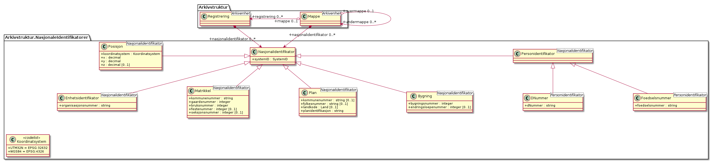

Nasjonale identifikatorer gjør tjenestegrensesnittet kompatibelt med
GeoIntegrasjon, og gjør det mulig å knytte mapper og registreringer
til kataloger som brønnøysundsregisteret, folkeregisteret, matrikkelen
og kart.

##### Nasjonalidentifikator

*Type:* ***Class***

*Arver:*

Dette er en virtuell klasse som ikke instansieres.  Attributten
systemID settes av API-tjenesten ved instansiering av typene som arver
fra Nasjonalidentifikator, og trenger ikke følge med ved opprettelse.

Table: Relasjoner

| **Relasjon**                              | **Kilde**                                                | **Mål**                | **Merknad** |
| ----------------------------------------- | -------------------------------------------------------- | ---------------------- | ----------- |
| **Aggregation** (Destination → Source)    | nasjonalidentifikator 0..* Nasjonalidentifikator         | Mappe                  |             |
| **Aggregation** (Destination → Source)    | nasjonalidentifikator 0..* Nasjonalidentifikator         | Registrering           |             |
| **Generalization** (Source → Destination) | Bygning                                                  | Nasjonalidentifikator  |             |
| **Generalization** (Source → Destination) | Enhetsidentifikator                                      | Nasjonalidentifikator  |             |
| **Generalization** (Source → Destination) | Matrikkel                                                | Nasjonalidentifikator  |             |
| **Generalization** (Source → Destination) | Plan                                                     | Nasjonalidentifikator  |             |
| **Generalization** (Source → Destination) | Posisjon                                                 | Nasjonalidentifikator  |             |
| **Generalization** (Source → Destination) | Personidentifikator                                      | Nasjonalidentifikator  |             |

Table: Relasjonsnøkler

| **Verdi**                                                                     |
| ----------------------------------------------------------------------------- |
| https://rel.arkivverket.no/noark5/v5/api/arkivstruktur/nasjonalidentifikator/ |

Table: Attributter

| **Navn**        | **Merknad** | **Multipl.** | **Kode** | **Type** |
| --------------- | ----------- | ------------ | -------- | -------- |
| systemID        |             | \[1..1\]     |          | SystemID |

##### Bygning

*Type:* ***Class***

*Arver:* ***Nasjonalidentifikator***

Table: Relasjoner

| **Relasjon**                             | **Kilde**                                                | **Mål**                | **Merknad** |
| ---------------------------------------- | -------------------------------------------------------- | ---------------------- | ----------- |
| **Generalization** (Source → Destination)  | Bygning                                                  | Nasjonalidentifikator  |             |

Table: Relasjonsnøkler

| **Verdi**                                                          |
| ------------------------------------------------------------------ |
| self                                                               |
| https://rel.arkivverket.no/noark5/v5/api/arkivstruktur/bygning/    |
| https://rel.arkivverket.no/noark5/v5/api/arkivstruktur/ny-bygning/ |

Table: Attributter

| **Navn**              | **Merknad**                   | **Multipl.** | **Kode** | **Type**  |
| --------------------- | ----------------------------- | ------------ | -------- | --------- |
| bygningsnummer        | Som registrert i Matrikkelen. | \[1..1\]     |          | integer   |
| endringsloepenummer   | Som registrert i Matrikkelen. | \[0..1\]     |          | integer   |

##### Enhetsidentifikator

*Type:* ***Class***

*Arver:* ***Nasjonalidentifikator***

Table: Relasjoner

| **Relasjon**                             | **Kilde**                                                | **Mål**                | **Merknad** |
| ---------------------------------------- | -------------------------------------------------------- | ---------------------- | ----------- |
| **Generalization** (Source → Destination)  | Enhetsidentifikator                                      | Nasjonalidentifikator  |             |

Table: Attributter

| **Navn**                | **Merknad** | **Multipl.** | **Kode** | **Type** |
| ----------------------- | ----------- | ------------ | -------- | -------- |
| organisasjonsnummer     |             | \[1..1\]     |          | string   |

##### Matrikkel

*Type:* ***Class***

*Arver:* ***Nasjonalidentifikator***

Tilsvarer GeoIntegrasjon.Felles.MatrikkelNummer.  Feltene er de samme
som brukes i matrikkelen.

Table: Relasjoner

| **Relasjon**                             | **Kilde**                                                | **Mål**                | **Merknad** |
| ---------------------------------------- | -------------------------------------------------------- | ---------------------- | ----------- |
| **Generalization** (Source → Destination)  | Matrikkel                                                | Nasjonalidentifikator  |             |

Table: Relasjonsnøkler

| **Verdi**                                                            |
| -------------------------------------------------------------------- |
| self                                                                 |
| https://rel.arkivverket.no/noark5/v5/api/arkivstruktur/matrikkel/    |
| https://rel.arkivverket.no/noark5/v5/api/arkivstruktur/ny-matrikkel/ |

Table: Attributter

| **Navn**            | **Merknad** | **Multipl.** | **Kode** | **Type**        |
| ------------------- | ----------- | ------------ | -------- | --------------- |
| kommunenummer       |             | \[1..1\]     |          | string          |
| gaardsnummer        |             | \[1..1\]     |          | integer         |
| bruksnummer         |             | \[1..1\]     |          | integer         |
| festenummer         |             | \[0..1\]     |          | integer         |
| seksjonsnummer      |             | \[0..1\]     |          | integer         |

##### Personidentifikator

*Type:* ***Class***

*Arver:* ***Nasjonalidentifikator***

Dette er en virtuell klasse som ikke kan instansieres.

Merk at [personopplysningsloven § 12 (Bruk av fødselsnummer og andre
entydige
identifikasjonsmidler)](https://lovdata.no/dokument/NL/lov/2018-06-15-38/)
er relevant når en benytter slike identifikatorer.  Den lyder:

> Fødselsnummer og andre entydige identifikasjonsmidler kan bare
> behandles når det er saklig behov for sikker identifisering og
> metoden er nødvendig for å oppnå slik identifisering.
>
> Kongen kan gi forskrift om bruk av fødselsnummer og andre entydige
> identifikasjonsmidler.

Table: Relasjoner

| **Relasjon**                               | **Kilde**           | **Mål**               | **Merknad** |
| ------------------------------------------ | ------------------- | --------------------- | ----------- |
| **Generalization** (Source → Destination)  | Personidentifikator | Nasjonalidentifikator |             |
| **Generalization** (Source → Destination)  | Foedselsnummer      | Personidentifikator |             |
| **Generalization** (Source → Destination)  | DNummer             | Personidentifikator |             |

##### Foedselsnummer

*Type:* ***Class***

*Arver:* ***Personidentifikator***

Table: Relasjoner

| **Relasjon**                               | **Kilde**           | **Mål**               | **Merknad** |
| ------------------------------------------ | ------------------- | --------------------- | ----------- |
| **Generalization** (Source → Destination)  | Foedselsnummer      | Personidentifikator |             |

Table: Relasjonsnøkler

| **Verdi**                                                                 |
| ------------------------------------------------------------------------- |
| self                                                                      |
| https://rel.arkivverket.no/noark5/v5/api/arkivstruktur/foedselsnummer/    |
| https://rel.arkivverket.no/noark5/v5/api/arkivstruktur/ny-foedselsnummer/ |

Table: Attributter

| **Navn**       | **Merknad** | **Multipl.** | **Kode** | **Type** |
|----------------|-------------|--------------|----------|----------|
| foedselsnummer |             | \[1..1\]     |          | string   |


##### DNummer

*Type:* ***Class***

*Arver:* ***Personidentifikator***

Et D-nummer er et midlertidig nummer som blant annet tildeles
utenlandske statsborgere som er skatte- eller avgiftspliktige til
Norge. Det kreves et D-nummer eller fødselsnummer for å bli registrert
i Folkeregisteret.

Table: Relasjoner

| **Relasjon**                               | **Kilde**           | **Mål**               | **Merknad** |
| ------------------------------------------ | ------------------- | --------------------- | ----------- |
| **Generalization** (Source → Destination)  | DNummer             | Personidentifikator |             |

Table: Relasjonsnøkler

| **Verdi**                                                          |
| ------------------------------------------------------------------ |
| self                                                               |
| https://rel.arkivverket.no/noark5/v5/api/arkivstruktur/dnummer/    |
| https://rel.arkivverket.no/noark5/v5/api/arkivstruktur/ny-dnummer/ |


Table: Attributter

| **Navn** | **Merknad** | **Multipl.** | **Kode** | **Type** |
|----------|-------------|--------------|----------|----------|
| dNummer  |             | \[1..1\]     |          | string   |

##### Plan

*Type:* ***Class***

*Arver:* ***Nasjonalidentifikator***

Tilsvarer GeoIntegrasjon.Felles.NasjonalArealplanId.

Se også [kartverkets informasjon om Tildeling av nasjonal
arealplan-ID](https://www.kartverket.no/geodataarbeid/Arealplan-og-planregister/Verktoykasse/Tildeling-av-nasjonal-arealplan-ID/).

Table: Relasjoner

| **Relasjon**                             | **Kilde**                                                | **Mål**                | **Merknad** |
| ---------------------------------------- | -------------------------------------------------------- | ---------------------- | ----------- |
| **Generalization** (Source → Destination)  | Plan                                                     | Nasjonalidentifikator  |             |

Table: Relasjonsnøkler

| **Verdi**                                                       |
| --------------------------------------------------------------- |
| self                                                            |
| https://rel.arkivverket.no/noark5/v5/api/arkivstruktur/ny-plan/ |
| https://rel.arkivverket.no/noark5/v5/api/arkivstruktur/plan/    |

Table: Attributter

| **Navn**              | **Merknad** | **Multipl.** | **Kode** | **Type**            |
| --------------------- | ----------- | ------------ | -------- | ------------------- |
| kommunenummer         |             | \[0..1\]     |          | string              |
| fylkesnummer          |             | \[0..1\]     |          | string              |
| landkode              |             | \[0..1\]     |          | Land                |
| planidentifikasjon    |             | \[1..1\]     |          | string              |

Table: Restriksjoner

| **Navn**                            | **Merknad**                         |
| ----------------------------------- | ----------------------------------- |
| kommunenummer/fylkesnummer/landkode | Kun et av feltene kommunenummer, fylkesnummer og landkode kan være satt for en gitt instans.  Feltet som er satt identifiserer hvilken enhet som planen gjelder for. |

##### Koordinatsystem

*Type:* ***Class «codelist»***

*Arver:*

Åpen kodeliste

Identifikator for referansekoordinatsystem som definert av
[EPSG](http://www.epsg.org/).  Formatet på kodeverdiene er
«EPSG:{nummer}», der {nummer} er EPSG-koden.

Denne kodelisten er relatert til KoordinatsystemKode i GeoIntegrasjon.
Koordinatsystem-verdier kan hentes fra registeret til GeoNorge,
tilgjengelig fra [https://register.geonorge.no/epsg-koder].

Table: Relasjonsnøkler

| **Verdi**                                                          |
| ------------------------------------------------------------------ |
| https://rel.arkivverket.no/noark5/v5/api/metadata/koordinatsystem/ |

Table: Attributter

| **Navn**                | **Merknad** | **Multipl.** | **Kode**   | **Type** |
| ----------------------- | ----------- | ------------ | ---------- | -------- |
| UTM32N                  |             |              | EPSG:32632 |          |
| WGS84                   |             |              | EPSG:4326  |          |

##### Posisjon

*Type:* ***Class***

*Arver:* ***Nasjonalidentifikator***

Tilsvarer GeoIntegrasjon.Geometri.Punkt.

Table: Relasjoner

| **Relasjon**                             | **Kilde**                                                | **Mål**                | **Merknad** |
| ---------------------------------------- | -------------------------------------------------------- | ---------------------- | ----------- |
| **Generalization** (Source → Destination)  | Posisjon                                                 | Nasjonalidentifikator  |             |

Table: Relasjonsnøkler

| **Verdi**                                                           |
| ------------------------------------------------------------------- |
| self                                                                |
| https://rel.arkivverket.no/noark5/v5/api/arkivstruktur/posisjon/    |
| https://rel.arkivverket.no/noark5/v5/api/arkivstruktur/ny-posisjon/ |

Table: Attributter

| **Navn**       | **Merknad**                     | **Multipl.** | **Kode** | **Type**        |
| -------------- | ------------------------------- | ------------ | -------- | --------------- |
| koordinatsystem|                                 | \[1..1\]     |          | Koordinatsystem |
| x              | øst-vest/breddegrad             | \[1..1\]     |          | decimal         |
| y              | nord-sør/lengdegrad             | \[1..1\]     |          | decimal         |
| z              | høyde, kun noen koordinatsystem | \[0..1\]     |          | decimal         |

### Kodelister 

Når en gjør GET mot href til relasjonsnøkkel
https://rel.arkivverket.no/noark5/v5/api/metadata/, så returneres liste over
relasjonsnøkler til de ulike entitetene som er tilgjengelig.  Følgende
relasjonsnøkler skal listes opp fra en implementasjon som støtter
Arkivstruktur-pakken:

| **Relasjonsnøkkel**                                                           |
|-------------------------------------------------------------------------------|
| https://rel.arkivverket.no/noark5/v5/api/metadata/arkivdelstatus/                     |
| https://rel.arkivverket.no/noark5/v5/api/metadata/arkivstatus/                        |
| https://rel.arkivverket.no/noark5/v5/api/metadata/dokumentmedium/                     |
| https://rel.arkivverket.no/noark5/v5/api/metadata/dokumentstatus/                     |
| https://rel.arkivverket.no/noark5/v5/api/metadata/dokumenttype/                       |
| https://rel.arkivverket.no/noark5/v5/api/metadata/format/                             |
| https://rel.arkivverket.no/noark5/v5/api/metadata/graderingskode/                     |
| https://rel.arkivverket.no/noark5/v5/api/metadata/kassasjonsvedtak/                   |
| https://rel.arkivverket.no/noark5/v5/api/metadata/klassifikasjonstype/                |
| https://rel.arkivverket.no/noark5/v5/api/metadata/mappetype/                          |
| https://rel.arkivverket.no/noark5/v5/api/metadata/merknadstype/                       |
| https://rel.arkivverket.no/noark5/v5/api/metadata/skjermingdokument/                  |
| https://rel.arkivverket.no/noark5/v5/api/metadata/skjermingmetadata/                  |
| https://rel.arkivverket.no/noark5/v5/api/metadata/slettingstype/                      |
| https://rel.arkivverket.no/noark5/v5/api/metadata/tilknyttetregistreringsom/          |
| https://rel.arkivverket.no/noark5/v5/api/metadata/variantformat/                      |

Følgende relasjonsnøkler skal listes opp fra en implementasjon som
støtter Sakarkiv-pakken:

| **Relasjonsnøkkel**                                                           |
|-------------------------------------------------------------------------------|
| https://rel.arkivverket.no/noark5/v5/api/metadata/avskrivningsmaate/                  |
| https://rel.arkivverket.no/noark5/v5/api/metadata/elektronisksignatursikkerhetsnivaa/ |
| https://rel.arkivverket.no/noark5/v5/api/metadata/elektronisksignaturverifisert/      |
| https://rel.arkivverket.no/noark5/v5/api/metadata/flytstatus/                         |
| https://rel.arkivverket.no/noark5/v5/api/metadata/journalposttype/                    |
| https://rel.arkivverket.no/noark5/v5/api/metadata/journalstatus/                      |
| https://rel.arkivverket.no/noark5/v5/api/metadata/korrespondanseparttype/             |
| https://rel.arkivverket.no/noark5/v5/api/metadata/land/                               |
| https://rel.arkivverket.no/noark5/v5/api/metadata/postnummer/                         |
| https://rel.arkivverket.no/noark5/v5/api/metadata/presedensstatus/                    |
| https://rel.arkivverket.no/noark5/v5/api/metadata/partrolle/                          |
| https://rel.arkivverket.no/noark5/v5/api/metadata/saksstatus/                         |

Følgende relasjonsnøkler skal listes opp fra en implementasjon som
støtter LoggingOgSporing-pakken:

| **Relasjonsnøkkel**                                                           |
|-------------------------------------------------------------------------------|
| https://rel.arkivverket.no/noark5/v5/api/metadata/hendelsetype/                       |

Følgende relasjonsnøkler skal listes opp fra en implementasjon som
støtter Admin-pakken:

| **Relasjonsnøkkel**                                                           |
|-------------------------------------------------------------------------------|
| https://rel.arkivverket.no/noark5/v5/api/metadata/tilgangskategori/                   |
| https://rel.arkivverket.no/noark5/v5/api/metadata/tilgangsrestriksjon/                |

Felles skjema for alle kodelister og felles typer.

Verdier fra kodelister henvises til både ved sin **kode** og ved sitt
**kodenavn**, slik at alle verdier i en bestemt kodeliste må være
unike.

Alle kodelister har en bolsk attributt «inaktiv» som settes til «true»
for historiske verdier som ikke lenger skal brukes.  Hvis «inaktiv»
ikke er satt så er den «false».  Når verdien av «inaktiv» er «false»
så skal den ikke sendes over i JSON til API-klient.


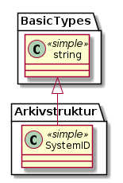

#### Arkivdelstatus

*Type:* ***Class «codelist»***

*Arver:* 

Åpen kodeliste

Status til den arkivperioden som arkivdelen omfatter

M051

Table: Relasjonsnøkler

| **Verdi**                                                         |
| ----------------------------------------------------------------- |
| https://rel.arkivverket.no/noark5/v5/api/metadata/arkivdelstatus/ |

Table: Attributter

| **Kodenavn**            | **Merknad** | **Multipl.** | **Kode** | **Type** |
| ----------------------- | ----------- | ------------ | -------- | -------- |
| Aktiv periode           |             |              | A        |          |
| Overlappingsperiode     |             |              | O        |          |
| Avsluttet periode       |             |              | P        |          |
| Uaktuelle mapper        |             |              | U        |          |

#### Arkivstatus

*Type:* ***Class «codelist»***

*Arver:* 

Åpen kodeliste

Status til arkivet

M050

Table: Relasjonsnøkler

| **Verdi**                                                      |
| -------------------------------------------------------------- |
| https://rel.arkivverket.no/noark5/v5/api/metadata/arkivstatus/ |

Table: Attributter

| **Kodenavn**  | **Merknad** | **Multipl.** | **Kode** | **Type** |
| ------------- | ----------- | ------------ | -------- | -------- |
| Opprettet     |             |              | O        |          |
| Avsluttet     |             |              | A        |          |

#### Avskrivningsmaate

*Type:* ***Class «codelist»***

*Arver:* 

Åpen kodeliste

Måten en journalpost har blitt avskrevet på

M619

Table: Relasjonsnøkler

| **Verdi**                                                            |
| -------------------------------------------------------------------- |
| https://rel.arkivverket.no/noark5/v5/api/metadata/avskrivningsmaate/ |

Table: Attributter

| **Kodenavn**              | **Merknad** | **Multipl.** | **Kode** | **Type** |
| ------------------------- | ----------- | ------------ | -------- | -------- |
| Besvart med brev          |             |              | BU       |          |
| Besvart med e-post        |             |              | BE       |          |
| Besvart på telefon        |             |              | TLF      |          |
| Tatt til etterretning     |             |              | TE       |          |
| Tatt til orientering      |             |              | TO       |          |
| Besvart med notat         |             |              | BN       |          |
| Saken ble avsluttet       |             |              | SA       |          |

#### Dokumentmedium

*Type:* ***Class «codelist»***

*Arver:* 

Åpen kodeliste

Definisjon: Angivelse av om arkivenheten inneholder fysiske dokumenter,
elektroniske dokumenter eller en blanding av fysiske og elektroniske
dokumenter

M300

Table: Relasjonsnøkler

| **Verdi**                                                         |
| ----------------------------------------------------------------- |
| https://rel.arkivverket.no/noark5/v5/api/metadata/dokumentmedium/ |

Table: Attributter

| **Kodenavn**                            | **Merknad** | **Multipl.** | **Kode** | **Type** |
| --------------------------------------- | ----------- | ------------ | -------- | -------- |
| Fysisk medium                           |             |              | F        |          |
| Elektronisk arkiv                       |             |              | E        |          |
| Blandet fysisk og elektronisk arkiv     |             |              | B        |          |

#### Dokumentstatus

*Type:* ***Class «codelist»***

*Arver:* 

Åpen kodeliste

Definisjon: Status til dokumentet

M054

Table: Relasjonsnøkler

| **Verdi**                                                         |
| ----------------------------------------------------------------- |
| https://rel.arkivverket.no/noark5/v5/api/metadata/dokumentstatus/ |

Table: Attributter

| **Kodenavn**                       | **Merknad** | **Multipl.** | **Kode** | **Type** |
| ---------------------------------- | ----------- | ------------ | -------- | -------- |
| Dokumentet er under redigering     |             |              | B        |          |
| Dokumentet er ferdigstilt          |             |              | F        |          |

#### Dokumenttype

*Type:* ***Class «codelist»***

*Arver:* 

Åpen kodeliste

Definisjon: Navn på type dokument

M083

Table: Relasjonsnøkler

| **Verdi**                                                       |
| --------------------------------------------------------------- |
| https://rel.arkivverket.no/noark5/v5/api/metadata/dokumenttype/ |

Table: Attributter

| **Kodenavn**         | **Merknad** | **Multipl.** | **Kode** | **Type** |
| -------------------- | ----------- | ------------ | -------- | -------- |
| Brev                 | Valgfri     |              | B        |          |
| Rundskriv            | Valgfri     |              | R        |          |
| Faktura              | Valgfri     |              | F        |          |
| Ordrebekreftelse     | Valgfri     |              | O        |          |

#### ElektroniskSignaturSikkerhetsnivaa

*Type:* ***Class «codelist»***

*Arver:* 

Åpen kodeliste

Definisjon: Angivelse av hvilket sikkerhetsnivå som ble brukt ved
forsendelse og mottak av elektroniske dokumenter.  Kilde: Registreres
automatisk knyttet til funksjonalitet for elektronisk signatur

Kommentar: (ingen)

M507
elektroniskSignaturSikkerhetsnivaa

Table: Relasjonsnøkler

| **Verdi**                                                                             |
| ------------------------------------------------------------------------------------- |
| https://rel.arkivverket.no/noark5/v5/api/metadata/elektronisksignatursikkerhetsnivaa/ |

Table: Attributter

| **Kodenavn**                                   | **Merknad** | **Multipl.** | **Kode** | **Type** |
| ---------------------------------------------- | ----------- | ------------ | -------- | -------- |
| Symmetrisk kryptert                            | Valgfri     |              | SK       |          |
| Sendt med PKI/virksomhetssertifikat            | Valgfri     |              | V        |          |
| Sendt med PKI/"person standard"-sertifikat     | Valgfri     |              | PS       |          |
| Sendt med PKI/"person høy"-sertifikat          | Valgfri     |              | PH       |          |

#### ElektroniskSignaturVerifisert

*Type:* ***Class «codelist»***

*Arver:* 

Åpen kodeliste

Definisjon: Angivelse av om et dokument er mottatt med elektronisk
signatur, og om signaturen er
verifisert.

M508

Table: Relasjonsnøkler

| **Verdi**                                                                        |
| -------------------------------------------------------------------------------- |
| https://rel.arkivverket.no/noark5/v5/api/metadata/elektronisksignaturverifisert/ |

Table: Attributter

| **Kodenavn**                         | **Merknad** | **Multipl.** | **Kode** | **Type** |
| ------------------------------------ | ----------- | ------------ | -------- | -------- |
| Signatur påført, ikke verifisert     |             |              | I        |          |
| Signatur påført og verifisert        |             |              | V        |          |

#### FlytStatus

*Type:* ***Class «codelist»***

*Arver:* 

Åpen kodeliste

Table: Relasjonsnøkler

| **Verdi**                                                     |
| ------------------------------------------------------------- |
| https://rel.arkivverket.no/noark5/v5/api/metadata/flytstatus/ |

Table: Attributter

| **Kodenavn**                                        | **Merknad** | **Multipl.** | **Kode** | **Type** |
| --------------------------------------------------- | ----------- | ------------ | -------- | -------- |
| Godkjent                                            | Valgfri     |              | G        |          |
| Ikke godkjent                                       | Valgfri     |              | I        |          |
| Sendt tilbake til saksbehandler med kommentarer     | Valgfri     |              | S        |          |

#### Format

*Type:* ***Class «codelist»***

*Arver:* 

Åpen kodeliste

Kodeverdier for formater hentes fra PRONOM-registeret over formater fra
det britiske nasjonalarkivet.  Informasjon om PRONOM er tilgjengelig
fra deres nettsider, `https://www.nationalarchives.gov.uk/PRONOM/`.
Slike formatkoder består at et prefiks "fmt" eller "x-fmt", en
skråstrek og et heltall, for eksempel "fmt/111" (ren tekst) og
"x-fmt/18" (CSV).

Ved bruk av formater som ikke har fått PRONOM-kode, bør det brukes en
midlertidig formatkode.  Det er definert to slike midlertidige
formatkoder.  Offisielle midlertidige formatkoder registrert i regi av
Arkivverket har prefiks "av/", mens midlertidige formatkoder fastsatt
av arkivleverandør eller arkivansvarlig gis prefiks "vnd/".  For mer
informasjon om formatkoder og autorativ liste over, både offentlige og
midlertidige, se vedlegg 4.

Før en tar i bruk en lokalt definert kode (med prefix "vnd/"), så bør
en sjekke om formatet allerede er registrert i formatkatalogen, og
bruke formatkode derfra hvis mulig.  Når et format med midlertidig
formatkode får en offisiell formatkode fra PRONOM, så skal kodeliste
og oppføringer i databasen til API-implementasjonen oppdateres ved
første praktiske anledning, maksimalt et år etter at slik kode er
tildelt av PRONOM, dog aldri senere enn i forkant av eventuell
deponering og avlevering av arkivmaterialet der slike koder blir
brukt.

Merk at listen over formater i tabellen over attributter her kun er
eksempler.

Table: Relasjonsnøkler

| **Verdi**                                                 |
| --------------------------------------------------------- |
| https://rel.arkivverket.no/noark5/v5/api/metadata/format/ |

Table: Attributter

| **Kodenavn**             | **Merknad**                                                                                                                                                              | **Multipl.** | **Kode**  | **Type** |
| ------------------------ | ------------------------------------------------------------------------------------------------------------------------------------------------------------------------ | ------------ | --------- | -------- |
| Ren tekst                | Som ren tekst: UTF-8 (ISO/IEC 10646-1:2000 Annex D) eller ISO 8859-1:1998, Latin 1. ISO 8859-1:1998, Latin 1 kan erstattes med ISO 8859-4:1998, Latin 4 for samiske tegn |              | [fmt/111](http://www.nationalarchives.gov.uk/PRONOM/fmt/111)   |          |
| TIFF versjon 6           | TIFF - Tag Image File Format versjon 6, med de presiseringer som fremgår av forskriftens § 8-18                                                                          |              | [fmt/353](http://www.nationalarchives.gov.uk/PRONOM/fmt/353)  |          |
| PDF/A 1a - ISO 19005-1:2005 | PDF/A - ISO 19005-1:2005, versjon 1a («Conformance Level» A). PDF/A erstatter Adobe PDF, jf. forskriftens § 8-20 tredje ledd.                           |              | [fmt/95](http://www.nationalarchives.gov.uk/PRONOM/fmt/95) |          |
| PDF/A 1b - ISO 19005-1:2005 | PDF/A - ISO 19005-1:2005, versjon 1b («Conformance Level» B). PDF/A erstatter Adobe PDF, jf. forskriftens § 8-20 tredje ledd.                           |              | [fmt/354](http://www.nationalarchives.gov.uk/PRONOM/fmt/354) |          |
| XML                      | XML - Extensible Markup Language versjon 1.0, med de presiseringer som fremgår av forskriftens § 8-19                                                                    |              | [fmt/101](http://www.nationalarchives.gov.uk/PRONOM/fmt/101)    |          |
| JPEG                     | JPEG 1.00 som beskrevet i ISO 10918-1:1994                                                                                                                               |              | [fmt/42](http://www.nationalarchives.gov.uk/PRONOM/fmt/42)   |          |
| SOSI                     | SOSI versjon 2.2 (1995) eller nyere                                                                                                                                      |              | av/1     |          |
| MPEG-2                   | MPEG-2 (ISO 13818-2.)                                                                                                                                                    |              | [x-fmt/386](http://www.nationalarchives.gov.uk/PRONOM/x-fmt/386) |          |
| MP3                      | lyd: MP3 (ISO 11172-3), PCM eller PCM-basert Wave. Valget mellom disse lydformatene skal i hvert tilfelle være avtalt med Arkivverket før deponering eller avlevering    |              | [fmt/134](http://www.nationalarchives.gov.uk/PRONOM/fmt/134) |          |
| PNG                      | PNG 1.2 som beskrevet i ISO / IEC 15948                                                                                                                                  |              | [fmt/11](http://www.nationalarchives.gov.uk/PRONOM/fmt/13)    |          |

#### Graderingskode

*Type:* ***Class «codelist»***

*Arver:* 

Åpen kodeliste

Table: Relasjonsnøkler

| **Verdi**                                                         |
| ----------------------------------------------------------------- |
| https://rel.arkivverket.no/noark5/v5/api/metadata/graderingskode/ |

Table: Attributter

| **Kodenavn**                             | **Merknad** | **Multipl.** | **Kode** | **Type** |
| ---------------------------------------- | ----------- | ------------ | -------- | -------- |
| Strengt hemmelig (sikkerhetsgrad)        |             |              | SH       |          |
| Hemmelig (sikkerhetsgrad)                |             |              | H        |          |
| Konfidensielt (sikkerhetsgrad)           |             |              | K        |          |
| Begrenset (sikkerhetsgrad)               |             |              | B        |          |
| Fortrolig (beskyttelsesgrad)             |             |              | F        |          |
| Strengt fortrolig (beskyttelsesgrad)     |             |              | SF       |          |

#### Hendelsetype

*Type:* ***Class «codelist»***

*Arver:* 

Table: Relasjonsnøkler

| **Verdi**                                                       |
| --------------------------------------------------------------- |
| https://rel.arkivverket.no/noark5/v5/api/metadata/hendelsetype/ |

Table: Attributter

| **Kodenavn**        | **Merknad** | **Multipl.** | **Kode** | **Type** |
| ------------------- | ----------- | ------------ | -------- | -------- |
| Endringslogg        |             |              |          |          |
| Søknad mottatt      |             |              |          |          |
| Søknad komplett     |             |              |          |          |
| Vedtak              |             |              |          |          |

#### Journalposttype

*Type:* ***Class «codelist»***

*Arver:* 

Åpen kodeliste

Definisjon: Navn på type
journalpost

M082

Table: Relasjonsnøkler

| **Verdi**                                                          |
| ------------------------------------------------------------------ |
| https://rel.arkivverket.no/noark5/v5/api/metadata/journalposttype/ |

Table: Attributter

| **Kodenavn**                              | **Merknad** | **Multipl.** | **Kode** | **Type** |
| ----------------------------------------- | ----------- | ------------ | -------- | -------- |
| Inngående dokument                        |             |              | I        |          |
| Utgående dokument                         |             |              | U        |          |
| Organinternt dokument for oppfølging      |             |              | N        |          |
| Organinternt dokument uten oppfølging     |             |              | X        |          |
| Saksframlegg                              |             |              | S        |          |

#### Journalstatus

*Type:* ***Class «codelist»***

*Arver:* 

Definisjon: Status til journalposten, dvs. om dokumentet er registrert,
under behandling eller endelig arkivert.

M053

Table: Relasjonsnøkler

| **Verdi**                                                        |
| ---------------------------------------------------------------- |
| https://rel.arkivverket.no/noark5/v5/api/metadata/journalstatus/ |

Table: Attributter

| **Kodenavn**                                        | **Merknad** | **Multipl.** | **Kode** | **Type** |
| --------------------------------------------------- | ----------- | ------------ | -------- | -------- |
| Journalført                                         |             |              | J        |          |
| Ferdigstilt fra saksbehandler                       |             |              | F        |          |
| Godkjent av leder                                   |             |              | G        |          |
| Ekspedert                                           |             |              | E        |          |
| Arkivert                                            |             |              | A        |          |
| Utgår                                               |             |              | U        |          |
| Midlertidig registrering av innkommet dokument      | Anbefalt    |              | M        |          |
| Saksbehandler har registrert innkommet dokument     | Anbefalt. Dette gjelder hovedsakelig e-post | | S | |
| Reservert dokument                                  | Reservert dokument, dvs. egenprodusert dokument er under arbeid | | R |  |


#### Kassasjonsvedtak

*Type:* ***Class «codelist»***

*Arver:* 

Åpen kodeliste

Definisjon:Handling som skal utføres ved bevaringstidens
slutt.

M450

Table: Relasjonsnøkler

| **Verdi**                                                           |
| ------------------------------------------------------------------- |
| https://rel.arkivverket.no/noark5/v5/api/metadata/kassasjonsvedtak/ |

Table: Attributter

| **Kodenavn**        | **Merknad** | **Multipl.** | **Kode** | **Type** |
| ------------------- | ----------- | ------------ | -------- | -------- |
| Bevares             |             |              | B        |          |
| Kasseres            |             |              | K        |          |
| Vurderes senere     |             |              | G        |          |

#### Klassifikasjonstype

*Type:* ***Class «codelist»***

*Arver:* 

Åpen kodeliste

Definisjon: Type
klassifikasjonssystem

M086

Table: Relasjonsnøkler

| **Verdi**                                                              |
| ---------------------------------------------------------------------- |
| https://rel.arkivverket.no/noark5/v5/api/metadata/klassifikasjonstype/ |

Table: Attributter

| **Kodenavn**                           | **Merknad** | **Multipl.** | **Kode** | **Type** |
| -------------------------------------- | ----------- | ------------ | -------- | -------- |
| Gårds- og bruksnummer                  | Valgfri     |              | GBN      |          |
| Funksjonsbasert, hierarkisk            | Valgfri     |              | FH       |          |
| Emnebasert, hierarkisk arkivnøkkel     | Valgfri     |              | EH       |          |
| Emnebasert, ett nivå                   | Valgfri     |              | E1       |          |
| K-koder                                | Valgfri     |              | KK       |          |
| Mangefasettert, ikke hierarki          | Valgfri     |              | MF       |          |
| Objektbasert                           | Valgfri     |              | UO       |          |
| Fødselsnummer                          | Valgfri     |              | PNR      |          |

#### Korrespondanseparttype

*Type:* ***Class «codelist»***

*Arver:* 

Åpen kodeliste

Definisjon: Type
korrespondansepart

M087

Table: Relasjonsnøkler

| **Verdi**                                                                 |
| ------------------------------------------------------------------------- |
| https://rel.arkivverket.no/noark5/v5/api/metadata/korrespondanseparttype/ |

Table: Attributter

| **Kodenavn**            | **Merknad** | **Multipl.** | **Kode** | **Type** |
| ----------------------- | ----------- | ------------ | -------- | -------- |
| Avsender                |             |              | EA       |          |
| Mottaker                |             |              | EM       |          |
| Kopimottaker            |             |              | EK       |          |
| Gruppemottaker          |             |              | GM       |          |
| Intern avsender         |             |              | IA       |          |
| Intern mottaker         |             |              | IM       |          |
| Intern kopimottaker     |             |              | IK       |          |
| Medavsender             |             |              | IS       |          |

#### Land

*Type:* ***Class «codelist»***

*Arver:* 

Navn på land og tobokstavs landskoder ihht ISO 3166, tilgjengelig fra
blant annet https://no.wikipedia.org/wiki/ISO\_3166-1\_alfa-2

Table: Relasjonsnøkler

| **Verdi**                                               |
| ------------------------------------------------------- |
| https://rel.arkivverket.no/noark5/v5/api/metadata/land/ |

#### Mappetype

*Type:* ***Class «codelist»***

*Arver:* 

Åpen kodeliste

Table: Relasjonsnøkler

| **Verdi**                                                    |
| ------------------------------------------------------------ |
| https://rel.arkivverket.no/noark5/v5/api/metadata/mappetype/ |

#### Merknadstype

*Type:* ***Class «codelist»***

*Arver:* 

Åpen kodeliste

Definisjon: Navn på type merknad

M084

Table: Relasjonsnøkler

| **Verdi**                                                       |
| --------------------------------------------------------------- |
| https://rel.arkivverket.no/noark5/v5/api/metadata/merknadstype/ |

Table: Attributter

| **Kodenavn**                   | **Merknad** | **Multipl.** | **Kode** | **Type** |
| ------------------------------ | ----------- | ------------ | -------- | -------- |
| Merknad fra saksbehandler      | Valgfri     |              | MS       |          |
| Merknad fra leder              | Valgfri     |              | ML       |          |
| Merknad fra arkivansvarlig     | Valgfri     |              | MA       |          |

#### Postnummer

*Type:* ***Class «codelist»***

*Arver:* 

Postens liste over norske poststeder og postnummer for oppslag av
stedsnavn tilknyttet et gitt postnummer.  Kodelistens *navn* er
poststed, og *kode* er postnummer.

Tilgang til oppdatert liste kan [kjøpes fra
Posten/Bring](https://www.bring.no/radgivning/sende-noe/adressetjenester/adresseregistre)
eller hentes fra andre kilder, som
[data.norge.no](https://data.norge.no/data/posten-norge/postnummer-i-norge)
og [Erik Bolstads postnummeroversikt med geografisk
plassering](http://www.erikbolstad.no/geo/noreg/postnummer/).

Table: Relasjonsnøkler

| **Verdi**                                                     |
| ------------------------------------------------------------- |
| https://rel.arkivverket.no/noark5/v5/api/metadata/postnummer/ |

#### PresedensStatus

*Type:* ***Class «codelist»***

*Arver:* 

Åpen kodeliste

Definisjon: Informasjon om presedensen er gjeldende eller
foreldet

M056

Table: Relasjonsnøkler

| **Verdi**                                                          |
| ------------------------------------------------------------------ |
| https://rel.arkivverket.no/noark5/v5/api/metadata/presedensstatus/ |

Table: Attributter

| **Kodenavn**  | **Merknad** | **Multipl.** | **Kode** | **Type** |
| ------------- | ----------- | ------------ | -------- | -------- |
| Gjeldende     |             |              | G        |          |
| Foreldet      |             |              | F        |          |

#### PartRolle

*Type:* ***Class «codelist»***

*Arver:* 

Åpen kodeliste

Table: Relasjonsnøkler

| **Verdi**                                                    |
| ------------------------------------------------------------ |
| https://rel.arkivverket.no/noark5/v5/api/metadata/partrolle/ |

Table: Attributter

| **Kodenavn**  | **Merknad** | **Multipl.** | **Kode** | **Type** |
| ------------- | ----------- | ------------ | -------- | -------- |
| Klient        | Valgfri     |              | KLI      |          |
| Pårørende     | Valgfri     |              | PAA      |          |
| Formynder     | Valgfri     |              | FORM     |          |
| Advokat       | Valgfri     |              | ADV      |          |

#### Saksstatus

*Type:* ***Class «codelist»***

*Arver:* 

Åpen kodeliste

Definisjon: Status til saksmappen, dvs. hvor langt saksbehandlingen har
kommet.

M052

Table: Relasjonsnøkler

| **Verdi**                                                     |
| ------------------------------------------------------------- |
| https://rel.arkivverket.no/noark5/v5/api/metadata/saksstatus/ |

Table: Attributter

| **Kodenavn**                    | **Merknad** | **Multipl.** | **Kode** | **Type** |
| ------------------------------- | ----------- | ------------ | -------- | -------- |
| Under behandling                |             |              | B        |          |
| Avsluttet                       |             |              | A        |          |
| Utgår                           |             |              | U        |          |
| Opprettet av saksbehandler      | anbefalt    |              | R        |          |
| Avsluttet av saksbehandler      | anbefalt    |              | S        |          |
| Unntatt prosesstyring           | anbefalt    |              | P        |          |
| Ferdig fra saksbehandler        |             |              | F        |          |

#### SkjermingDokument

*Type:* ***Class «codelist»***

*Arver:* 

Åpen kodeliste

Definisjon: Angivelse av at hele dokumentet eller deler av det må
skjermes.

M503

Table: Relasjonsnøkler

| **Verdi**                                                            |
| -------------------------------------------------------------------- |
| https://rel.arkivverket.no/noark5/v5/api/metadata/skjermingdokument/ |

Table: Attributter

| **Kodenavn**                         | **Merknad** | **Multipl.** | **Kode** | **Type** |
| ------------------------------------ | ----------- | ------------ | -------- | -------- |
| Skjerming av hele dokumentet         |             |              | H        |          |
| Skjerming av deler av dokumentet     |             |              | D        |          |

#### SkjermingMetadata

*Type:* ***Class «codelist»***

*Arver:* 

Åpen kodeliste

Definisjon: Angivelse av hvilke metadataelementer som skal
skjermes.

M502

Table: Relasjonsnøkler

| **Verdi**                                                            |
| -------------------------------------------------------------------- |
| https://rel.arkivverket.no/noark5/v5/api/metadata/skjermingmetadata/ |

Table: Attributter

| **Kodenavn**                                             | **Merknad** | **Multipl.** | **Kode** | **Type** |
| -------------------------------------------------------- | ----------- | ------------ | -------- | -------- |
| Skjerming klasseID                                       |             |              | KID      |          |
| Skjerming tittel klasse                                  |             |              | TKL      |          |
| Skjerming tittel mappe - unntatt første linje            |             |              | TM1      |          |
| Skjerming tittel mappe - utvalgte ord                    |             |              | TMO      |          |
| Skjerming navn part i sak                                |             |              | NPS      |          |
| Skjerming tittel registrering - unntatt første linje     |             |              | TR1      |          |
| Skjerming tittel registrering - utvalgte ord             |             |              | TRO      |          |
| Skjerming navn avsender                                  |             |              | NA       |          |
| Skjerming navn mottaker                                  |             |              | NM       |          |
| Skjerming tittel dokumentbeskrivelse                     |             |              | TD       |          |
| Skjerming merknadstekst                                  |             |              | MT       |          |
| Midlertidig skjerming                                    |             |              | M        |          |

#### Slettingstype

*Type:* ***Class «codelist»***

*Arver:* 

Åpen kodeliste

Definisjon: Navn på hvilket objekt som er slettet

M089

Table: Relasjonsnøkler

| **Verdi**                                                        |
| ---------------------------------------------------------------- |
| https://rel.arkivverket.no/noark5/v5/api/metadata/slettingstype/ |

Table: Attributter

| **Kodenavn**                                    | **Merknad** | **Multipl.** | **Kode** | **Type** |
| ----------------------------------------------- | ----------- | ------------ | -------- | -------- |
| Sletting av produksjonsformat                   |             |              | SP       |          |
| Sletting av tidligere versjon                   |             |              | SV       |          |
| Sletting av variant med sladdet informasjon     |             |              | SS       |          |
| Sletting av hele innholdet i arkivdelen         |             |              | SA       |          |

#### SystemID

*Type:* ***Class «simple»***

*Arver:* ***string***

Definisjon: Entydig identifikasjon av arkivenheten innenfor det
arkivskapende organet. Dersom organet har flere arkivsystemer, skal
altså systemID være gjennomgående entydig. Systemidentifikasjonen vil
som oftest være en numerisk kode uten noe logisk meningsinnhold.
Identifikasjonen trenger ikke å være synlig for brukerne.
. Kilde: Registreres automatisk av systemet

Kommentarer: Alle referanser fra en arkivenhet til en annen skal peke
til arkivenhetens systemidentifikasjon. Dette gjelder også referanser
fra en arkivdel til en annen, f.eks. mellom to arkivperioder som
avleveres på forskjellig tidspunkt. I et arkivuttrekk skal systemID være
entydig (unik). Dokumentobjekt har ingen systemidentifikasjon fordi
enheten kan være duplisert i et arkivuttrekk dersom samme dokumentfil er
knyttet til flere forskjellige registreringer.

M001

Table: Relasjoner

| **Relasjon**                             | **Kilde**                                                | **Mål**                | **Merknad** |
| ---------------------------------------- | -------------------------------------------------------- | ---------------------- | ----------- |
| **Generalization** (Source → Destination)  | SystemID                                                 | string                 |             |

#### Tilgangskategori

*Type:* ***Class «codelist»***

*Arver:* 

Åpen kodeliste

ny kodeliste jfr Noark 5 v3.1 krav    
6.6.32

Table: Relasjonsnøkler

| **Verdi**                                                           |
| ------------------------------------------------------------------- |
| https://rel.arkivverket.no/noark5/v5/api/metadata/tilgangskategori/ |

Table: Attributter

| **Kodenavn**            | **Merknad** | **Multipl.** | **Kode** | **Type** |
| ----------------------- | ----------- | ------------ | -------- | -------- |
| arkivdel                |             |              | A        |          |
| klasse                  |             |              | K        |          |
| mappe                   |             |              | M        |          |
| registrering            |             |              | R        |          |
| dokumentbeskrivelse     |             |              | D        |          |

#### Tilgangsrestriksjon

*Type:* ***Class «codelist»***

*Arver:* 

Åpen kodeliste

Table: Relasjonsnøkler

| **Verdi**                                                              |
| ---------------------------------------------------------------------- |
| https://rel.arkivverket.no/noark5/v5/api/metadata/tilgangsrestriksjon/ |

Table: Attributter

| **Kodenavn**                                       | **Merknad** | **Multipl.** | **Kode** | **Type** |
| -------------------------------------------------- | ----------- | ------------ | -------- | -------- |
| Begrenset etter sikkerhetsinstruksen               |             |              | B        |          |
| Konfidensielt etter sikkerhetsinstruksen           |             |              | K        |          |
| Hemmelig etter sikkerhetsinstruksen                |             |              | H        |          |
| Fortrolig etter beskyttelsesinstruksen             |             |              | F        |          |
| Strengt fortrolig etter beskyttelsesinstruksen     |             |              | SF       |          |
| Unntatt etter offentlighetsloven § 5               |             |              | 5        |          |
| Unntatt etter offentlighetsloven § 5a              |             |              | 5a       |          |
| Unntatt etter offentlighetsloven § 6               |             |              | 6        |          |
| Unntatt etter offentlighetsloven § 11              |             |              | 11       |          |
| Midlertidig sperret                                |             |              | XX       |          |
| Personalsaker                                      |             |              | P        |          |
| Klientsaker                                        |             |              | KL       |          |

#### TilknyttetRegistreringSom

*Type:* ***Class «codelist»***

*Arver:* 

Åpen kodeliste

Table: Relasjonsnøkler

| **Verdi**                                                                    |
| ---------------------------------------------------------------------------- |
| https://rel.arkivverket.no/noark5/v5/api/metadata/tilknyttetregistreringsom/ |

Table: Attributter

| **Kodenavn**      | **Merknad** | **Multipl.** | **Kode** | **Type** |
| ----------------- | ----------- | ------------ | -------- | -------- |
| Hoveddokument     |             |              | H        |          |
| Vedlegg           |             |              | V        |          |

#### Variantformat

*Type:* ***Class «codelist»***

*Arver:* 

Åpen kodeliste

Definisjon: Angivelse av hvilken variant et dokument forekommer i

M700

Table: Relasjonsnøkler

| **Verdi**                                                        |
| ---------------------------------------------------------------- |
| https://rel.arkivverket.no/noark5/v5/api/metadata/variantformat/ |

Table: Attributter

| **Kodenavn**                                     | **Merknad** | **Multipl.** | **Kode** | **Type** |
| ------------------------------------------------ | ----------- | ------------ | -------- | -------- |
| Produksjonsformat                                |             |              | P        |          |
| Arkivformat                                      |             |              | A        |          |
| Dokument hvor deler av innholdet er skjermet     |             |              | O        |          |

### Sakarkiv 

Når en gjør GET mot href til relasjonsnøkkel
https://rel.arkivverket.no/noark5/v5/api/sakarkiv/, så returneres liste over
relasjonsnøkler til de ulike entitetene som er tilgjengelig.  Følgende
relasjonsnøkler skal listes opp fra en implementasjon som støtter
Sakarkiv-pakken:

| **Relasjonsnøkkel**                                                   |
|-----------------------------------------------------------------------|
| https://rel.arkivverket.no/noark5/v5/api/sakarkiv/arkivnotat/                 |
| https://rel.arkivverket.no/noark5/v5/api/sakarkiv/journalpost/                |
| https://rel.arkivverket.no/noark5/v5/api/sakarkiv/presedens/                  |
| https://rel.arkivverket.no/noark5/v5/api/sakarkiv/saksmappe/                  |

Utvidelse for sakarkiv metadata

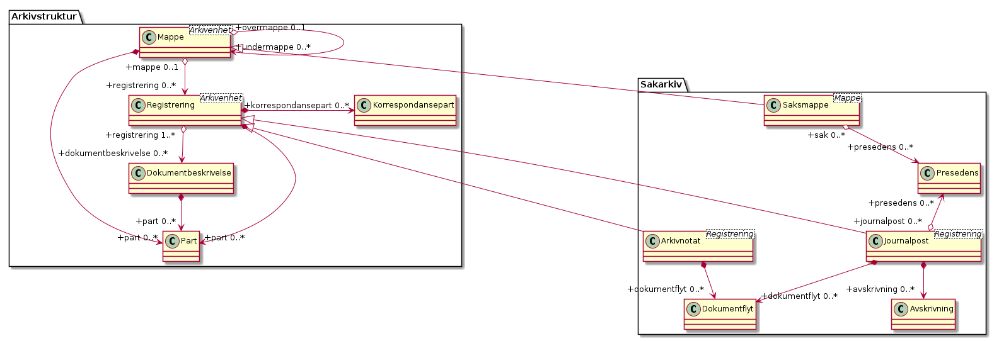

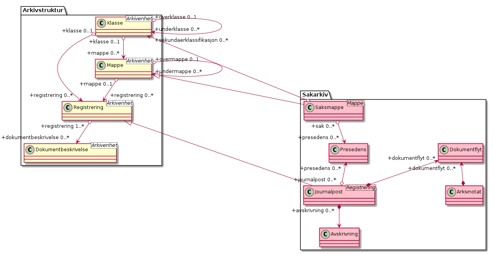


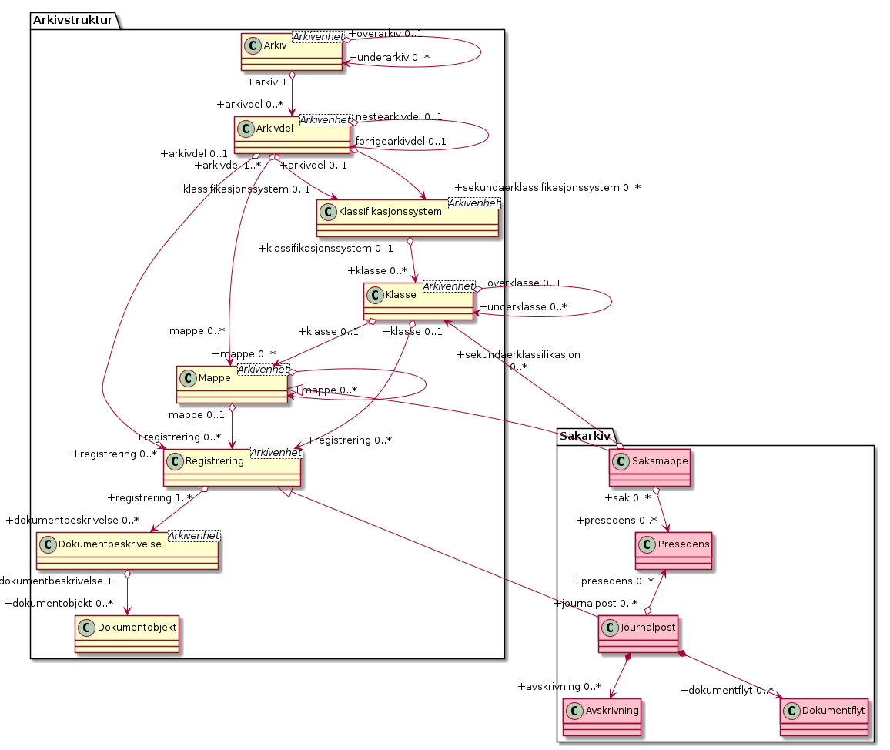

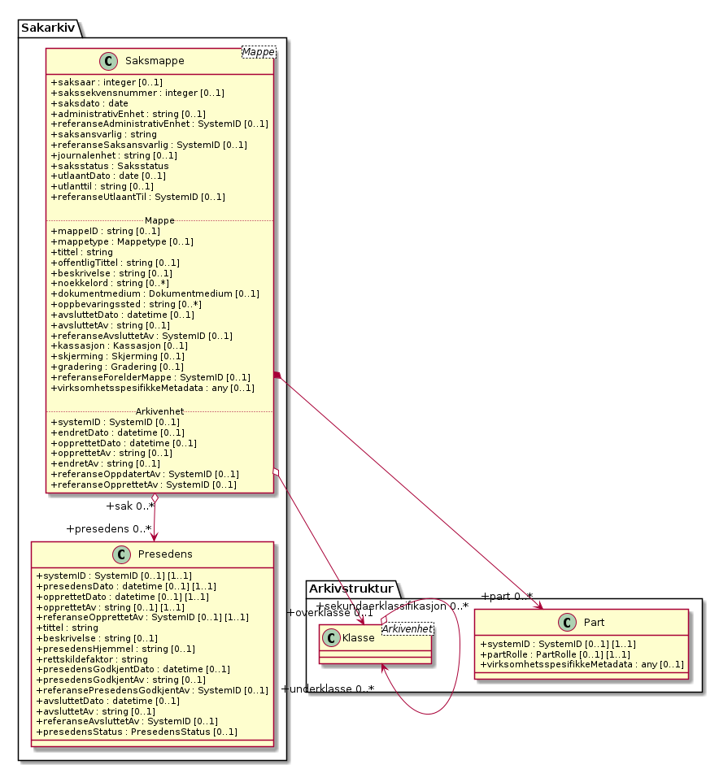


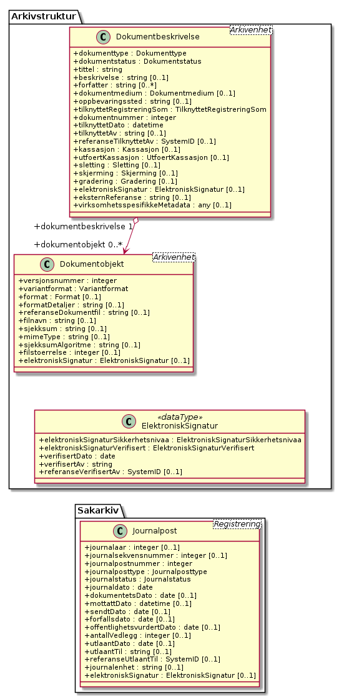

#### Avskrivning

*Type:* ***Class***

*Arver:* 

En Journalpost av typene ”inngående dokument” eller ”organinternt
dokument for oppfølging” står i restanse inntil de er markert som
ferdigbehandlet, eller avskrives. Dette kapitlet angir krav til
avskrivning.

Metadata for avskrivning skal kunne grupperes inn i metadata for
journalpost. Avskrivning er obligatorisk for inngående dokumenter og
organinterne dokumenter som skal følges opp, og kan forekomme en eller
flere ganger i en journalpost.

Table: Relasjoner

| **Relasjon**                             | **Kilde**                                                | **Mål**                | **Merknad** |
| ---------------------------------------- | -------------------------------------------------------- | ---------------------- | ----------- |
| **Association** (Source → Destination)   | Journalpost                                              | avskrivning 0..* Avskrivning |       |

Table: Relasjonsnøkler

| **Verdi**                                                            |
| -------------------------------------------------------------------- |
| self                                                                 |
| https://rel.arkivverket.no/noark5/v5/api/metadata/avskrivningsmaate/ |
| https://rel.arkivverket.no/noark5/v5/api/sakarkiv/avskrivning/       |
| https://rel.arkivverket.no/noark5/v5/api/sakarkiv/ny-avskrivning/    |

Table: Attributter

| **Navn**  | **Merknad**   | **Multipl.**  | **Kode**  | **Type**  |
|-----------|---------------|---------------|-----------|-----------|
| systemID                               | Definisjon: Entydig identifikasjon av arkivenheten innenfor det arkivskapende organet. Dersom organet har flere arkivsystemer, skal altså systemID være gjennomgående entydig. Systemidentifikasjonen vil som oftest være en numerisk kode uten noe logisk meningsinnhold. Identifikasjonen trenger ikke å være synlig for brukerne. Kilde: Registreres automatisk av systemet. Kommentarer: Alle referanser fra en arkivenhet til en annen skal peke til arkivenhetens systemidentifikasjon. Dette gjelder også referanser fra en arkivdel til en annen, f.eks. mellom to arkivperioder som avleveres på forskjellig tidspunkt. I et arkivuttrekk skal systemID være entydig (unik). Dokumentobjekt har ingen systemidentifikasjon fordi enheten kan være duplisert i et arkivuttrekk dersom samme dokumentfil er knyttet til flere forskjellige registreringer. M001 | \[0..1\] | | SystemID | 
| avskrivningsdato                       | Definisjon: Dato et dokument ble avskrevet . Kilde: Registreres automatisk nå avskrivning foretas. Kommentar: (ingen). M617 | \[1..1\] ||date| 
| avskrevetAv                            | Definisjon: Navn på person som har foretatt avskrivning . Kilde: Registreres automatisk nå avskrivning foretas. Kommentar: (ingen). M618 | \[1..1\] | | string | 
| referanseAvskrevetAv                   | |  \[0..1\] | | SystemID | 
| avskrivningsmaate                       | Definisjon: Måten en journalpost har blitt avskrevet på . Kilde: Registreres automatisk når konvertering utføres. Kommentar: (ingen). M619 avskrivningsmaate | \[1..1\] | | Avskrivningsmaate |
| referanseAvskrivesAvJournalpost        | Definisjon: Referanse til en eller flere journalposter som avskriver denne journalposten . Kilde: Registreres manuelt eller automatisk ved avskrivning. Kommentar: (ingen). M215 | \[0..1\] | | SystemID |
| referanseAvskrivesAvKorrespondansepart | angir referanse til hvilken korrespondansepart som har avskrevet journalposten | \[0..1\] | | SystemID |

Table: Restriksjoner

| **Navn**                               | **Merknad** |
| -------------------------------------- | ----------- |
| M001 systemID: Skal ikke kunne endres  |             |
| M617 avskrivningsdato: Kan ikke endres |             |
| M618 avskrevetAv: Kan ikke endres      |             |

#### Dokumentflyt

*Type:* ***Class***

*Arver:* 

Et dokument som er under produksjon, skal kunne sendes fram og tilbake
i linjen det nødvendige antall ganger. Saksbehandler og lederne i
linjen skal kunne se hvor dokumentet befinner seg til enhver tid. Det
skal være mulig å definere funksjoner for at dokumentet låses for
endringer når det (videre)sendes, eller at det automatisk opprettes en
ny versjon ved hver (videre)forsendelse. All funksjonalitet for
korrektur og merknader i tilknyttet tekstbehandlingssystem skal kunne
brukes på et dokument som er under produksjon.

Table: Relasjoner

| **Relasjon**                             | **Kilde**                                                | **Mål**                | **Merknad** |
| ---------------------------------------- | -------------------------------------------------------- | ---------------------- | ----------- |
| **Association** (Source → Destination)   | Journalpost                                              | dokumentflyt 0..* Dokumentflyt |     |
| **Association** (Source → Destination)   | Arkivnotat                                               | dokumentflyt 0..* Dokumentflyt |     |

Table: Relasjonsnøkler

| **Verdi**                                                          |
| ------------------------------------------------------------------ |
| self                                                               |
| https://rel.arkivverket.no/noark5/v5/api/metadata/flytstatus/      |
| https://rel.arkivverket.no/noark5/v5/api/sakarkiv/dokumentflyt/    |
| https://rel.arkivverket.no/noark5/v5/api/sakarkiv/ny-dokumentflyt/ |

Table: Attributter

| **Navn**  | **Merknad**   | **Multipl.**  | **Kode**  | **Type**  |
|-----------|---------------|---------------|-----------|-----------|
| systemID          | Definisjon: Entydig identifikasjon av arkivenheten innenfor det arkivskapende organet. Dersom organet har flere arkivsystemer, skal altså systemID være gjennomgående entydig. Systemidentifikasjonen vil som oftest være en numerisk kode uten noe logisk meningsinnhold. Identifikasjonen trenger ikke å være synlig for brukerne. Kilde: Registreres automatisk av systemet. Kommentarer: Alle referanser fra en arkivenhet til en annen skal peke til arkivenhetens systemidentifikasjon. Dette gjelder også referanser fra en arkivdel til en annen, f.eks. mellom to arkivperioder som avleveres på forskjellig tidspunkt. I et arkivuttrekk skal systemID være entydig (unik). Dokumentobjekt har ingen systemidentifikasjon fordi enheten kan være duplisert i et arkivuttrekk dersom samme dokumentfil er knyttet til flere forskjellige registreringer. M001 | \[0..1\] | | SystemID |
| flytTil           | Definisjon: Person som har mottatt for godkjennelse et dokument som har vært sendt på flyt . Kilde: Registreres automatisk av funksjonalitet knyttet til arbeidsflyt. Kommentar: (ingen). M660 flytTil | \[1..1\] | | string | 
| referanseFlytTil  | | \[0..1\] | | SystemID |
| flytFra           | Definisjon: Person som har sendt et dokument på flyt . Kilde: Registreres automatisk av funksjonalitet knyttet til arbeidsflyt. Kommentar: (ingen). M665 flytFra | \[1..1\] | |string | 
| referanseFlytFra  | |  \[0..1\] | | SystemID |
| flytMottattDato   | Definisjon: Dato og klokkeslett et dokument på flyt ble mottatt . Kilde: Registreres automatisk av funksjonalitet knyttet til arbeidsflyt. Kommentar: (ingen). M661 flytMottattDato |  | \[1..1\] |datetime|
| flytSendtDato     | Definisjon: Dato og klokkeslett et dokument på flyt ble sendt videre . Kilde: Registreres automatisk av funksjonalitet knyttet til arbeidsflyt. Kommentar: (ingen). M662 flytSendtDato | \[1..1\] | |datetime|
| flytStatus        | Definisjon: Godkjennelse/ikke godkjennelse av dokumentet som er sendt på flyt . Kilde: Registreres automatisk av funksjonalitet knyttet til arbeidsflyt. Kommentar: (ingen). M663 flytStatus | \[1..1\] | |FlytStatus|
| flytMerknad       | Definisjon: Merknad eller kommentar til et dokument som er sendt på flyt . Kilde: Registreres manuelt. Kommentar: (ingen). M664 flytMerknad | \[0..1\] | | string|

Table: Restriksjoner

| **Navn**                                          | **Merknad** |
| ------------------------------------------------- | ----------- |
| M001 systemID: Skal ikke kunne endres |   |
| M660 flytTil: Obligatorisk dersom dokumentet har blitt sendt på flyt. Skal ikke kunne endres | |
| M661 flytMottattDato: Obligatorisk dersom dokumentet har blitt sendt på flyt. Skal ikke kunne endres. | |
| M662 flytSendtDato: Obligatorisk dersom dokumentet har blitt sendt på flyt. Skal ikke kunne endres. | |
| M665 flytFra: Obligatorisk dersom dokumentet har blitt sendt på flyt. Skal ikke kunne endres. | |

#### Arkivnotat

*Type:* ***Class***

*Arver:* ***Registrering***


Table: Relasjoner

| **Relasjon**                             | **Kilde**                                                | **Mål**                | **Merknad** |
| ---------------------------------------- | -------------------------------------------------------- | ---------------------- | ----------- |
| **Generalization** (Source → Destination) | Arkivnotat                                              | Registrering           |            |
| **Association** (Source → Destination)   | Arkivnotat                                               | dokumentflyt 0..* Dokumentflyt |     |

Table: Relasjonsnøkler

| **Verdi**                                                          |
| ------------------------------------------------------------------ |
| self                                                               |
| https://rel.arkivverket.no/noark5/v5/api/sakarkiv/arkivnotat/      |
| https://rel.arkivverket.no/noark5/v5/api/sakarkiv/ny-arkivnotat/   |
| https://rel.arkivverket.no/noark5/v5/api/sakarkiv/dokumentflyt/    |
| https://rel.arkivverket.no/noark5/v5/api/sakarkiv/ny-dokumentflyt/ |

Table: Attributter

| **Navn**                 | **Merknad**   | **Multipl.**  | **Kode**  | **Type**  |
|--------------------------|---------------|---------------|-----------|-----------|
| dokumentetsDato          | M103          | \[0..1\]      |           | date      |
| mottattDato              | M104          | \[0..1\]      |           | datetime  |
| sendtDato                | M105          | \[0..1\]      |           | datetime  |
| forfallsdato             | M109          | \[0..1\]      |           | date      |
| offentlighetsvurdertDato | M110          | \[0..1\]      |           | date      |
| antallVedlegg            | M304          | \[0..1\]      |           | integer   |
| utlaantDato              | M106          | \[0..1\]      |           | date      |
| utlaantTil               | M309          | \[0..1\]      |           | string    |
| referanseUtlaantTil      | M309          | \[0..1\]      |           | SystemID  |

#### Journalpost

*Type:* ***Class***

*Arver:* ***Registrering***

En journalpost fra Noark-4 utgjør en egen registreringstype i Noark 5.
En journalpost representer en "innføring i journalen". Journalen er en
kronologisk fortegnelse over inn- og utgående dokumenter
(dvs. korrespondansedokumenter), og eventuelt også interne dokumenter
som inngår i saksbehandlingen. Til sammenligning representerer en
registrering en generell "innføring" i alle typer arkivsystemer,
også de som ikke inneholder korrespondansebaserte
dokumenter. Journalposten inneholder bl.a.  metadata om
korrespondanseparter (avsender og mottaker), og om saksbehandlere. Det
finnes flere typer journalposter. De viktigste er inngående dokument,
utgående dokument, organinternt dokument for oppfølging og
organinternt dokument uten oppfølging. Ved organinterne dokumenter kan
en og samme journalpost inneholde metadata om både avsender og
mottaker, og om saksbehandler både på avsender- og mottakersiden.

Registreringstypen journalpost er obligatorisk for sakarkiver. Alle
journalføringspliktige dokumenter i offentlig forvaltning skal
registreres som journalposter og inngå i et sakarkiv.  Dersom et
system basert på Noark 5 bare skal brukes for sakarkiver, er det ikke
noe i veien for å fortsette å anvende begrepet "journalpost" i alle
grensesnitt mot brukerne, på samme måte som en er vant til fra
Noark-4. I denne standarden brukes registrering som en generell
betegnelse på arkivenheter som dokumenter transaksjoner. (Registrering
er dessuten en dekkende norsk oversettelse av det tilsvarende begrepet
i MoReq2 som heter Record.)

Table: Relasjoner

| **Relasjon**                             | **Kilde**                                                | **Mål**                | **Merknad** |
| ---------------------------------------- | -------------------------------------------------------- | ---------------------- | ----------- |
| **Association** (Bi-Directional)         | journalpost 0..* Journalpost                             | presedens 0..* Presedens |           |
| **Association** (Source → Destination)   | Journalpost                                              | dokumentflyt 0..* Dokumentflyt |     |
| **Association** (Source → Destination)   | Journalpost                                              | avskrivning 0..* Avskrivning |       |
| **Generalization** (Source → Destination) | Journalpost                                              | Registrering       |            |

Table: Relasjonsnøkler

| **Verdi**                                                                |
| ------------------------------------------------------------------------ |
| self                                                                     |
| https://rel.arkivverket.no/noark5/v5/api/metadata/journalposttype/       |
| https://rel.arkivverket.no/noark5/v5/api/metadata/journalstatus/         |
| https://rel.arkivverket.no/noark5/v5/api/sakarkiv/avskrivning/           |
| https://rel.arkivverket.no/noark5/v5/api/sakarkiv/dokumentflyt/          |
| https://rel.arkivverket.no/noark5/v5/api/sakarkiv/journalpost/           |
| https://rel.arkivverket.no/noark5/v5/api/sakarkiv/ny-avskrivning/        |
| https://rel.arkivverket.no/noark5/v5/api/sakarkiv/ny-dokumentflyt/       |
| https://rel.arkivverket.no/noark5/v5/api/sakarkiv/ny-presedens/          |
| https://rel.arkivverket.no/noark5/v5/api/sakarkiv/presedens/             |

Table: Attributter

| **Navn**  | **Merknad**   | **Multipl.**  | **Kode**  | **Type**  |
|-----------|---------------|---------------|-----------|-----------|
| journalaar                | Definisjon: Viser året journalposten ble opprettet . Kilde: Registreres automatisk når journalposten opprettes. Kommentar: (ingen). M013 journalaar | \[0..1\] | | integer|
| journalsekvensnummer     | Definisjon: Viser rekkefølgen når journalposten ble opprettet under året . Kilde: Registreres automatisk når journalposten opprettes. Kommentar: Kombinasjonen journalaar og sekvensnummer er ikke obligatorisk, men anbefales brukt i sakarkiver. Noen rapporter er sortert på denne kombinasjonen, f.eks. løpende- og offentlig journal. Dersom journalaar og sekvensnummer ikke brukes, må kronologiske utskrifter sorteres etter andre kriterier (f.eks. journalpostens opprettetDato). I Noark 4 skal sekvensnummeret vises før journalaar (f.eks. 25367/2011) for at det ikke skal blandes sammen med saksnummeret som har året først. M014 journalsekvensnummer | \[0..1\] |  | integer|
| journalpostnummer        | Definisjon: Inngår i M004 journalpostID. Viser rekkefølgen journalpostene ble opprettet innenfor saksmappen, f.eks. 2011/3869-8 (dokument nr. 8 i sak 2011/3869). Kilde: Registreres automatisk når journalposten opprettes. Kommentar: Er ikke obligatorisk, men anbefales brukt i sakarkiver. Dersom journalpostnummer ikke brukes, må andre kriterier kunne identifisere journalpostenes rekkefølge innenfor saksmappen. M015 journalpostnummer | \[1..1\] | | integer|
| journalposttype          | Definisjon: Navn på type journalpost . Kilde: Registreres automatisk av systemet eller manuelt Kommentar: Tilsvarer &quot;Noark dokumenttype&quot; i Noark 4. M082 journalposttype | \[1..1\] | |Journalposttype|
| journalstatus            | Definisjon: Status til journalposten, dvs. om dokumentet er registrert, under behandling eller endelig arkivert. Kilde: Registreres automatisk gjennom forskjellig saksbehandlings-funksjonalitet, eller overstyres manuelt. Kommentar: Journalposter som avleveres skal ha status &quot;Arkivert&quot; eller &quot;Utgår&quot;. M053 journalstatus | \[1..1\] | |Journalstatus|
| journaldato              | Definisjon: Datoen journalposten er opprettet/arkivert . Kilde: Settes automatisk til samme dato som M600 opprettetDato. Oppdateres til M604 arkivertDato når dokumentene som tilhørere journalposten arkiveres. Kommentar: (ingen). M101 journaldato | \[1..1\] | |date|
| dokumentetsDato          | Definisjon: Dato som er påført selve dokumentet . Kilde: Datoen hentes automatisk fra dokumentet, eller registreres manuelt. Kommentar: Kan brukes både for inngående, utgående og organinterne dokumenter. M103 dokumentetsDato | \[0..1\] | | date|
| mottattDato              | Definisjon: Dato et eksternt dokument ble mottatt . Kilde: Registreres manuelt eller automatisk av systemet ved elektronisk kommunikasjon. Kommentar: Merk at mottattDato ikke behøver å være identisk med M600 opprettetDato. M104 mottattDato | \[0..1\] | | datetime |
| sendtDato                | Definisjon: Dato et internt produsert dokument ble sendt/ekspedert . Kilde: Registreres manuelt eller automatisk av systemet ved elektronisk kommunikasjon. Kommentar: (ingen). M105 sendtDato | \[0..1\] | | date |
| forfallsdato             | Definisjon: Dato som angir fristen for når et inngående dokument må være besvart . Kilde: Registreres manuelt. Kommentar: Forfallsdato kan være angitt som en betingelse i det inngående dokumentet. M109 forfallsdato | \[0..1\] | | date|
| offentlighetsvurdertDato | Definisjon: Datoen da offentlighetsvurdering ble foretatt . Kilde: Registreres automatisk knyttet til funksjonalitet for skjerming. Kommentar: Dato for offentlighetsvurdering kan brukes dersom inngående dokumenter automatisk blir midlertidig skjermet ved mottak, og offentlighetsvurderingen skjer på et litt senere tidspunkt. M110 offentlighetsvurdertDato | \[0..1\] | | date| 
| antallVedlegg            | Definisjon: Antall fysiske vedlegg til et fysisk hoveddokument . Kilde: Registreres manuelt. Kommentar: (ingen). M304 antallVedlegg | \[0..1\] | | integer|
| utlaantDato              | Definisjon: Dato når en fysisk saksmappe eller journalpost ble utlånt.  Kilde: Registreres manuelt ved utlån. Kommentar: Det er ikke spesifisert noen dato for tilbakelevering. Tilbakelevering kan markeres ved at M106 utlaantDato slettes. Det er ingen krav om obligatorisk logging av utlån av fysiske dokumenter. M106 utlaantDato | \[0..1\] | | date|
| utlaantTil               | Definisjon: Navnet på person som har lånt en fysisk saksmappe . Kilde: Registreres manuelt ved utlån. Kommentar: (ingen). M309 utlaantTil | \[0..1\] | | string |
| referanseUtlaantTil      | | \[0..1\] | | SystemID |
| journalenhet             | Definisjon: Navn på enhet som har det arkivmessige ansvaret for kvalitetssikring av arkivdanningen, og eventuelt registrering (journalføring) og arkivering av fysiske dokumenter. Kilde: Registreres automatisk på grunnlag av innlogget bruker, kan overstyres manuelt. Kommentar: (ingen). M308 journalenhet | \[0..1\] | | string | 
| elektroniskSignatur      | | \[0..1\] | | ElektroniskSignatur |

Table: Restriksjoner

| **Navn**                                                      | **Merknad** |
| ------------------------------------------------------------- | ----------- |
| 5.5.8 En journalpost skal kunne defineres til å være av forskjellig type, se M082journalposttype. | |
| 5.5.10 En Journalpost skal ha registrert en Saksansvar (dvs. administrativ enhet, Saksbehandler og eventuelt journalenhet) og en Saksansvar skal kunne inngå i ingen, en eller flere Journalposter. | |
| 5.5.12 Det bør finnes en tjeneste/funksjon for å ajourholde Journalenhet på en Registrering (Journalpost). | |
| 5.5.13 Det skal finnes en tjeneste/funksjon for å ajourholde Administrativ enhet og Saksbehandler på en Registrering (Journalpost). | |
| 5.5.14 Det skal finnes en tjeneste/funksjon for å ajourholde Korrespondansepart på en Journalpost. |
| M013 journalaar: Skal ikke kunne endres. | |
| M014 journalsekvensnummer: Skal ikke kunne endres. | |
| M015 journalpostnummer: Skal normalt ikke endres, men ved flytting til en annen saksmappe kan journalposten få et nytt nummer (fordi det inngår i en annen nummerrekkefølge i denne mappen). | |
| M101 journaldato: Skal kunne endres manuelt inntil arkivering. | | 
| M103 dokumentetsDato: Skal kunne endres manuelt inntil arkivering. | |
| M104 mottattDato: Skal ikke kunne endres ved automatisk registrering, dato for mottak av fysiske dokumenter skal kunne endres inntil arkivering. | |
| M105 sendtDato: Skal ikke kunne endres ved automatisk registrering, dato for forsendelse av fysiske dokumenter skal kunne endres inntil arkivering. |
| M106 utlaantDato: Utlån skal også kunne registreres etter at en saksmappe er avsluttet, eller etter at dokumentene i en journalpost ble arkivert. | |
| M308 journalenhet: Er ikke lenger obligatorisk i Noark 5. Journalenhet er helt uavhengig av administrativ enhet. Kan f.eks. brukes som seleksjonskriterium ved produksjon av rapporter. Det anbefales ikke å knytte tilgangsrettigheter til journalenhet. | |
| M309 utlaantTil: Utlån skal også kunne registreres etter at en saksmappe er avsluttet, eller at dokumentene i en journalpost ble arkivert. |

#### Presedens

*Type:* ***Class***

*Arver:* 

Med presedens menes en (retts)avgjørelse som siden kan tjene som
rettesnor i lignende tilfeller eller saker. En presedens kan også være
en sak som er regeldannende for behandling av tilsvarende saker. Det
er som oftest snakk om et forvaltningsmessig vedtak, dvs. et
enkeltvedtak fattet i henhold til det aktuelle organets
forvaltningsområde, som inneholder en rettsoppfatning som senere blir
lagt til grunn i andre lignende tilfeller. Prinsippavgjørelser knyttet
til ulike saksområder skal derfor kunne etableres på en hensiktsmessig
måte og være tilgjengelig for saksbehandlere.

Man snakker vanligvis om presedenssaker, men det er vanligvis ett
eller noen få av dokumentene i saken som danner presedens. Foruten å
registrere hele saken, må derfor det eller de dokumentene som
inneholder presedensavgjørelser kunne identifiseres.  Hvis
opplysninger om presedens er registrert, er presedens obligatorisk for
avlevering.

Table: Relasjoner

| **Relasjon**                             | **Kilde**                                                | **Mål**                | **Merknad** |
| ---------------------------------------- | -------------------------------------------------------- | ---------------------- | ----------- |
| **Association** (Bi-Directional)         | journalpost 0..* Journalpost                             | presedens 0..* Presedens |           |
| **Association** (Bi-Directional)         | saksmappe 0..* Saksmappe                                 | presedens 0..* Presedens |           |

Table: Relasjonsnøkler

| **Verdi**                                                          |
| ------------------------------------------------------------------ |
| self                                                               |
| https://rel.arkivverket.no/noark5/v5/api/metadata/presedensstatus/ |
| https://rel.arkivverket.no/noark5/v5/api/sakarkiv/journalpost/     |
| https://rel.arkivverket.no/noark5/v5/api/sakarkiv/ny-journalpost/  |
| https://rel.arkivverket.no/noark5/v5/api/sakarkiv/ny-presedens/    |
| https://rel.arkivverket.no/noark5/v5/api/sakarkiv/ny-saksmappe/    |
| https://rel.arkivverket.no/noark5/v5/api/sakarkiv/presedens/       |
| https://rel.arkivverket.no/noark5/v5/api/sakarkiv/saksmappe/       |

Table: Attributter

| **Navn**  | **Merknad**   | **Multipl.**  | **Kode**  | **Type**  |
|-----------|---------------|---------------|-----------|-----------|
| systemID                     | Definisjon: Entydig identifikasjon av arkivenheten innenfor det arkivskapende organet. Dersom organet har flere arkivsystemer, skal altså systemID være gjennomgående entydig. Systemidentifikasjonen vil som oftest være en numerisk kode uten noe logisk meningsinnhold. Identifikasjonen trenger ikke å være synlig for brukerne. Kilde: Registreres automatisk av systemet Kommentarer: Alle referanser fra en arkivenhet til en annen skal peke til arkivenhetens systemidentifikasjon. Dette gjelder også referanser fra en arkivdel til en annen, f.eks. mellom to arkivperioder som avleveres på forskjellig tidspunkt. I et arkivuttrekk skal systemID være entydig (unik). Dokumentobjekt har ingen systemidentifikasjon fordi enheten kan være duplisert i et arkivuttrekk dersom samme dokumentfil er knyttet til flere forskjellige registreringer. M001 systemID | \[0..1\] | | SystemID |
| presedensDato                | Definisjon: Datoen på presedensen . Kilde: Registreres manuelt ved opprettelse av presedens, men bør også kunne hentes automatisk fra M103 dokumentetsDato på journalposten presedensen opprettes på. Kommentar: (ingen). M111 presedensDato | \[1..1\] | |date|
| opprettetDato                | Definisjon: Dato og klokkeslett når arkivenheten ble opprettet/registrert. Kilde: Registreres automatisk av systemet ved opprettelse av enheten. Kommentarer: (ingen). M600 opprettetDato | \[0..1\] | | datetime|
| opprettetAv                  | Definisjon: Navn på person som opprettet/registrerte arkivenheten. Kilde: Registreres automatisk av systemet ved opprettelse av enheten. Kommentarer: (ingen). M601 opprettetAv | \[0..1\] | | string | 
| referanseOpprettetAv         | | \[0..1\] | | SystemID |
| tittel                       | Definisjon: Tittel eller navn på arkivenheten. Kilde: Registreres manuelt eller hentes automatisk fra innholdet i arkivdokumentet. Ja fra klassetittel dersom alle mapper skal ha samme tittel som klassen. Kan også hentes automatisk fra et fagsystem. Kommentarer: For saksmappe og journalpost vil dette tilsvare &quot;Sakstittel&quot; og &quot;Dokumentbeskrivelse&quot;. Disse navnene kan beholdes i grensesnittet. M020 tittel | \[1..1\] | | string | 
| beskrivelse                  | Definisjon: Tekstlig beskrivelse av arkivenheten. Kilde: Registreres manuelt. Kommentarer: Tilsvarende attributt finnes ikke i Noark 4 (men noen tabeller hadde egne attributter for merknad som kunne brukes som et beskrivelsesfelt). M021 beskrivelse | \[0..1\] | | string |
| presedensHjemmel | Definisjon: Lovparagrafen som saken eller journalposten danner presedens for . Kilde: Registreres manuelt ved opprettelse av presedens. Kommentar: (ingen). M311 presedensHjemmel | \[0..1\] | | string | 
| rettskildefaktor             | Definisjon: En argumentkilde som brukes til å løse rettslige problemer. En retts-anvender som skal ta stilling til et juridisk spørsmål, vil ta utgangspunkt i en rettskildefaktor. Kilde: Registreres manuelt ved opprettelse av presedens Kommentar: En rettskildefaktor kan være en lov- eller forskriftstekst, lovforarbeider, domstolspraksis, andre myndigheters praksis, privates praksis (kontraktspraksis), rettsoppfatninger, reelle hensyn, folkerett, EU-/ EØS-rett mv. M312 rettskildefaktor | \[1..1\] | |string | 
| presedensGodkjentDato        | Definisjon:Dato og klokkeslett for når presedensen er godkjent . Kilde: Registreres automatisk dersom det finnes funksjonalitet for å godkjenne presedenser .Kommentar: (ingen). M628 presedensGodkjentDato | \[0..1\] | | datetime |
| presedensGodkjentAv          | Definisjon: Navn på person som har godkjent presedensen . Kilde: Registreres automatisk dersom det finnes funksjonalitet for å godkjenne presedenser. Kommentar: (ingen). M629 presedensGodkjentAv | \[0..1\] | | string | 
| referansePresedensGodkjentAv | | \[0..1\] | | SystemID | 
| avsluttetDato                | Definisjon: Dato og klokkeslett når arkivenheten ble avsluttet/lukket . Kilde: Registreres automatisk av systemet når enheten avsluttes. Kommentarer: (ingen). M602 avsluttetDato | \[0..1\] | | datetime| 
| avsluttetAv                  | Definisjon: Navn på person som avsluttet/lukket arkivenheten. Kilde: Registreres automatisk av systemet ved opprettelse av enheten Kommentarer: (ingen). M603 avsluttetAv | \[0..1\] | | string | 
| referanseAvsluttetAv         | | \[0..1\] | | SystemID |
| presedensStatus              | Definisjon: Informasjon om presedensen er gjeldende eller foreldet . Kilde: Registreres manuelt ved foreldelse. Kommentar: (ingen) M056 presedensStatus | \[0..1\] |  | PresedensStatus |


Table: Restriksjoner

| **Navn**                                                                                           | **Merknad** |
| -------------------------------------------------------------------------------------------------- | ----------- |
| M001 systemID: Skal ikke kunne endres                                                              |             |
| M020 tittel: Skal normalt ikke kunne endres etter at enheten er lukket, eller dokumentene arkivert |             |
| M600 opprettetDato: Skal ikke kunne endres                                                         |             |
| M601 opprettetAv: Skal ikke kunne endres                                                           |             |
| M602 avsluttetDato: Skal ikke kunne endres. Obligatorisk dersom arkivdelen er avsluttet.           |             |
| M603 avsluttetAv: Skal ikke kunne endres. Obligatorisk dersom arkivenheten er avsluttet.           |             |

#### Saksmappe

*Type:* ***Class***

*Arver:* ***Mappe***

I denne versjonen av Noark 5 er det i tillegg til Mappe definert en
spesialisering kalt Saksmappe, som tilsvarer en ”sak” i
Noark-4. Saksmappen skal inneholde metadata fra Mappe i tillegg til
egne metadata. En saksmappe er bakoverkompatibel med en sak i Noark-4,
men har en del nye metadata. For sakarkiver er det obligatorisk å
bruke en saksmappe.

Table: Relasjoner

| **Relasjon**                              | **Kilde**                                                | **Mål**                | **Merknad** |
| ----------------------------------------- | -------------------------------------------------------- | ---------------------- | ----------- |
| **Generalization** (Source → Destination) | Saksmappe                                                | Mappe                  |             |
| **Association** (Source → Destination)    | Saksmappe                                                | sekundaerklassifikasjon 0..* Klasse | |
| **Association** (Bi-Directional)          | saksmappe 0..* Saksmappe                                 | presedens 0..* Presedens |           |

Table: Relasjonsnøkler

| **Verdi**                                                                  |
| -------------------------------------------------------------------------- |
| self                                                                       |
| https://rel.arkivverket.no/noark5/v5/api/sakarkiv/saksmappe/               |
| https://rel.arkivverket.no/noark5/v5/api/arkivstruktur/ny-klasse/          |
| https://rel.arkivverket.no/noark5/v5/api/sakarkiv/presedens/               |
| https://rel.arkivverket.no/noark5/v5/api/sakarkiv/sekundaerklassifikasjon/ |
| https://rel.arkivverket.no/noark5/v5/api/metadata/saksstatus/              |
| https://rel.arkivverket.no/noark5/v5/api/sakarkiv/ny-presedens/            |
| https://rel.arkivverket.no/noark5/v5/api/sakarkiv/ny-journalpost/          |

Table: Attributter

| **Navn**  | **Merknad**   | **Multipl.**  | **Kode**  | **Type**  |
|-----------|---------------|---------------|-----------|-----------|
| saksaar                | Definisjon: Inngår i M003 mappeID. Viser året saksmappen ble opprettet. Kilde: Registreres automatisk når saksmappen opprettes. Kommentar: Se kommentar under M012 sakssekvensnummer. M011 saksaar | \[1..1\] | | integer|
| sakssekvensnummer      | Definisjon: Inngår i M003 mappeID. Viser rekkefølgen når saksmappen ble opprettet innenfor året. Kilde: Registreres automatisk når saksmappen opprettes. Kommentar: Kombinasjonen saksaar og sakssekvensnummer er ikke obligatorisk, men anbefales brukt i sakarkiver. M012 sakssekvensnummer | \[1..1\] | | integer|
| saksdato               | Definisjon: Datoen saken er opprettet . Kilde: Settes automatisk til samme dato som M600 opprettetDato. Kommentar: (ingen). M100 saksdato | \[1..1\] | |date| 
| administrativEnhet     | Definisjon: Navn på avdeling, kontor eller annen administrativ enhet som har ansvaret for saksbehandlingen. Kilde: Registreres automatisk f.eks. på grunnlag av innlogget bruker, kan overstyres. Kommentar: Merk at på journalpostnivå grupperes administrativEnhet sammen med M307 saksbehandler inn i korrespondansepart. Dette muliggjør individuell behandling når det er flere mottakere, noe som er særlig aktuelt ved organinterne dokumenter som skal følges opp. M305 administrativEnhet | \[0..1\] | | string |
| referanseAdministrativEnhet | | \[0..1\] | | SystemID |
| saksansvarlig          | Definisjon: Navn på person som er saksansvarlig . Kilde: Registreres automatisk på grunnlag av innlogget bruker eller annen saksbehandlingsfunksjonalitet (f.eks. saksfordeling), kan overstyres manuelt. Kommentar: (ingen). M306 saksansvarlig | \[1..1\] | | string | 
| referanseSaksansvarlig | | \[0..1\] | | SystemID |
| journalenhet           | Definisjon: Navn på enhet som har det arkivmessige ansvaret for kvalitetssikring av arkivdanningen, og eventuelt registrering (journalføring) og arkivering av fysiske dokumenter. Kilde: Registreres automatisk på grunnlag av innlogget bruker, kan overstyres manuelt. Kommentar: (ingen). M308 journalenhet | \[0..1\] | | string | 
| saksstatus             | Definisjon: Status til saksmappen, dvs. hvor langt saksbehandlingen har kommet. Kilde: Registreres automatisk gjennom forskjellig saksbehandlings-funksjonalitet, eller overstyres manuelt. Kommentar: Saksmapper som avleveres skal ha status &quot;Avsluttet&quot; eller &quot;Utgår&quot;. M052 saksstatus | \[1..1\] | |Saksstatus|
| utlaantDato            | Definisjon: Dato når en fysisk saksmappe eller journalpost ble utlånt.  Kilde: Registreres manuelt ved utlån. Kommentar: Det er ikke spesifisert noen dato for tilbakelevering. Tilbakelevering kan markeres ved at M106 utlaantDato slettes. Det er ingen krav om obligatorisk logging av utlån av fysiske dokumenter. M106 utlaantDato | \[0..1\] | | date |
| utlaantTil             | Definisjon: Navnet på person som har lånt en fysisk saksmappe . Kilde: Registreres manuelt ved utlån. Kommentar: (ingen). M309 utlaantTil | \[0..1\] | | string |
| referanseUtlaantTil    | | \[0..1\] | | SystemID |

Table: Restriksjoner

| **Navn**                                          | **Merknad** |
| ------------------------------------------------- | ----------- |
| 5.4.9 En Saksmappe skal kunne identifiseres entydig innenfor arkivet.| Det anbefales at denne identifikasjonen er en kombinasjon av saksaar og et forløpende sekvensnummer for saksmappene innenfor året. |
| 5.4.10 En Saksmappe skal kunne ha registrert ingen, en eller flere Sekundaerklassering og en Sekundaerklassering tilhører kun en Saksmappe og kun en Klasse.| |
| 5.4.11 En Saksmappe bør kunne ha registrert ingen eller en Journalenhet og en Journalenhet kan inngå i ingen, en  eller flere Saksmapper. | |
| 5.4.12 En Saksmappe skal kunne ha registrert ingen eller en Administrativ enhet og en Administrativ enhet kan inngå i ingen, en eller flere Saksmapper. | |
| 6.1.3 Det skal finnes en tjeneste/funksjon for å sette Status på en Saksmappe. | |
| 6.1.4 Følgende statusverdier er obligatorisk for Saksmappe: Under behandling, Avsluttet, Utgår | |
| 6.1.5 Følgende statusverdier er anbefalt for Saksmappe: Opprettet av saksbehandler, Avsluttet av saksbehandler, Unntatt prosesstyring | |
| 6.1.6 Når status på Saksmappe settes til Avsluttet, skal avsluttetDato settes automatisk. | |
| 6.1.7 Det skal ikke være mulig å avslutte en Saksmappe uten at det er angitt en primær klassifikasjon (Klasse). | |
| 6.1.8 Det skal ikke være mulig å avslutte en Saksmappe som inneholder Registreringer som ikke er avsluttet | |
| 6.1.11 Det skal ikke være mulig å avslutte en Saksmappe uten at alle dokumenter på registreringene i mappen er lagret i arkivformat | |
| 6.1.12 Det skal ikke være mulig å avslutte en Saksmappe uten at alle restanser på Registreringer er avskrevet | |
| 6.1.13 Når statusen til en Saksmappe settes til avsluttet, skal det på mappenivå ikke være mulig å endre metadataene: saksdato, administrativEnhet , saksansvarlig | |
| 6.1.14 Når statusen til en Saksmappe settes til avsluttet, bør det på Saksmappe fortsatt være mulig å endre de øvrige metadataene. Endringer skal logges | |
| 6.1.15 En avsluttet Saksmappe bør kunne åpnes igjen av autoriserte roller og personer. Det skal være mulig å parameterstyre hvem som er autorisert for å åpne en  mappe. Åpning av mappe skal logges. | |
| 6.1.18 Det skal ikke være mulig å slette en Saksmappe som inneholder eller har inneholdt Journalposter med status ekspedert, journalført eller arkivert | |
| 6.2.1 Det skal finnes en tjeneste/funksjon for å ajourholde utlån av en Saksmappe. | |
| M011 saksaar: Skal ikke kunne endres | |
| M012 sakssekvensnummer: Skal ikke kunne endres | |
| M100 saksdato: Skal kunne endres manuelt inntil saksmappen avsluttes | |
| M106 utlaantDato: Utlån skal også kunne registreres etter at en saksmappe er avsluttet, eller etter at dokumentene i en journalpost ble arkivert. | |

### Admin 

I dette kapitlet ligger Noark 5 kjernens krav til systemteknisk
administrasjon av Noark 5 kjernen. Kravene skal legge til rette for at
arkivansvarlige skal kunne administrere og ha kontroll på arkivet,
arkivstrukturen og metadataene som hører til arkivenhetene i
strukturen, dvs. legge inn grunnlagsdata som typer mapper og
registreringer, og hvilke metadata utover de obligatoriske som skal
kunne legges til disse.

Det skal også gi muligheter for feilretting utover det som ellers er
tillatt etter reglene for endring og frysing av metadata og dokumenter
i løsningen.

Løsningen må dessuten legge til rette for at administratorer har
kontroll på arkivdokumentene og hvilke formater disse er lagret i. Det
vil også si å kunne implementere vedtatte regler for når konvertering
skal skje.

Når en gjør GET mot href til relasjonsnøkkel
https://rel.arkivverket.no/noark5/v5/api/admin/, så returneres liste over
relasjonsnøkler til de ulike entitetene som er tilgjengelig.  Følgende
relasjonsnøkler skal listes opp fra en implementasjon som støtter
Admin-pakken:

| **Relasjonsnøkkel**                                                   |
|-----------------------------------------------------------------------|
| https://rel.arkivverket.no/noark5/v5/api/admin/administrativenhet/            |
| https://rel.arkivverket.no/noark5/v5/api/admin/bruker/                        |
| https://rel.arkivverket.no/noark5/v5/api/admin/rettighet/                     |

Følgende relasjonsnøkler skal tilsvarende listes opp for privilgerte
brukere etter innlogging:

| **Relasjonsnøkkel**                                                   |
|-----------------------------------------------------------------------|
| https://rel.arkivverket.no/noark5/v5/api/admin/ny-administrativenhet/         |
| https://rel.arkivverket.no/noark5/v5/api/admin/ny-bruker/                     |
| https://rel.arkivverket.no/noark5/v5/api/admin/ny-rettighet/                  |

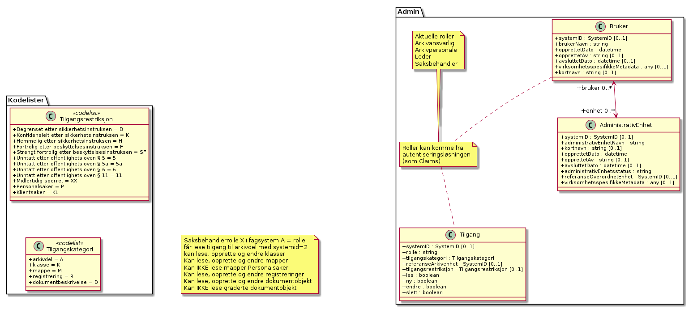

#### AdministrativEnhet

*Type:* ***Class***

*Arver:* 

Table: Relasjoner

| **Relasjon**                             | **Kilde**                                                | **Mål**                | **Merknad** |
| ---------------------------------------- | -------------------------------------------------------- | ---------------------- | ----------- |
| **Association** (Bi-Directional)         | bruker 0..* Bruker                                       | enhet 0..* AdministrativEnhet |      |

Table: Relasjonsnøkler

| **Verdi**                                                             |
| --------------------------------------------------------------------- |
| self                                                                  |
| https://rel.arkivverket.no/noark5/v5/api/admin/administrativenhet/    |
| https://rel.arkivverket.no/noark5/v5/api/admin/bruker/                |
| https://rel.arkivverket.no/noark5/v5/api/admin/ny-administrativenhet/ |
| https://rel.arkivverket.no/noark5/v5/api/admin/ny-bruker/             |

Table: Attributter

| **Navn**  | **Merknad**   | **Multipl.**  | **Kode**  | **Type**  |
|-----------|---------------|---------------|-----------|-----------|
| systemID                      | Definisjon: Entydig identifikasjon av arkivenheten innenfor det arkivskapende organet. Dersom organet har flere arkivsystemer, skal altså systemID være gjennomgående entydig. Systemidentifikasjonen vil som oftest være en numerisk kode uten noe logisk meningsinnhold. Identifikasjonen trenger ikke å være synlig for brukerne. Kilde: Registreres automatisk av systemet. Kommentarer: Alle referanser fra en arkivenhet til en annen skal peke til arkivenhetens systemidentifikasjon. Dette gjelder også referanser fra en arkivdel til en annen, f.eks. mellom to arkivperioder som avleveres på forskjellig tidspunkt. I et arkivuttrekk skal systemID være entydig (unik). Dokumentobjekt har ingen systemidentifikasjon fordi enheten kan være duplisert i et arkivuttrekk dersom samme dokumentfil er knyttet til flere forskjellige registreringer. M001 systemID | \[0..1\] | | SystemID | 
| administrativEnhetNavn        | Definisjon: Navn på administrativ enhet . Kilde: Registreres manuelt av administrator. Kommentar: Navn på administrativ enhet vil registreres flere steder i arkivstrukturen, f.eks. sammen med saksansvarlig eller saksbehandler på saksmappe eller journalpost. Administrasjonsstrukturen inngår ikke i arkivstrukturen. M583 administrativEnhetNavn | \[1..1\] | |string | 
| kortnavn                      | | \[0..1\] | | string | 
| opprettetDato                 | Definisjon: Dato og klokkeslett når arkivenheten ble opprettet/registrert. Kilde: Registreres automatisk av systemet ved opprettelse av enheten. Kommentarer: (ingen). M600 opprettetDato | \[1..1\] | | datetime|
| opprettetAv                   | Definisjon: Navn på person som opprettet/registrerte arkivenheten. Kilde: Registreres automatisk av systemet ved opprettelse av enheten. Kommentarer: (ingen). M601 opprettetAv | \[0..1\] | | string | 
| avsluttetDato                 | Definisjon: Dato og klokkeslett når arkivenheten ble avsluttet/lukket . Kilde: Registreres automatisk av systemet når enheten avsluttes. Kommentarer: (ingen). M602 avsluttetDato | \[0..1\] | | datetime| 
| administrativEnhetsstatus     | Definisjon: Status til den administrative enheten. Kilde: Registreres manuelt av administrator. Kommentar: Ingen obligatoriske verdier. Aktuelle verdier kan være: &quot;Aktiv enhet&quot; &quot;Passiv enhet&quot; Administrasjonsstrukturen inngår ikke i arkivstrukturen M584 administrativEnhetsstatus | \[1..1\] | |string | 
| referanseOverordnetEnhet      | Definisjon: Referanse til enhet som er direkte overordnet denne enheten. Kilde: Registreres manuelt av administrator. Kommentar: (ingen) NB 20150527: attributtnavnet endret fra overordnetEnhet til referanseOverordnetEnhet for å samsvare med M585 referanseOverordnetEnhet | \[0..1\] | |  SystemID |
| virksomhetsspesifikkeMetadata | Definisjon: Et overordnet metadataelement som kan inneholde egendefinerte metadata. Disse metadataene må da være spesifisert i et eller flere XML-skjema. Kilde: (ingen). Kommentar: (ingen). M711 virksomhetsspesifikkeMetadata | \[0..1\] | | any |

Table: Restriksjoner

| **Navn**                                                                                                                               | **Merknad** |
| -------------------------------------------------------------------------------------------------------------------------------------- | ----------- |
| M001 systemID: Skal ikke kunne endres                                                                                                  |             |
| M600 opprettetDato: Skal ikke kunne endres                                                                                             |             |
| M601 opprettetAv: Skal ikke kunne endres                                                                                               |             |
| M602a avsluttetDato: Skal ikke kunne endres.                                                                                           |             |
| M602b avsluttetDato: Obligatorisk dersom arkivdelen er avsluttet.                                                                      |             |
| Ny - navn skal ikke endres. Hvis enhet får nytt navn så opprettes ny enhet med ny systemID. Den gamle kan da settes avsluttet dato på. |             |

#### Bruker

*Type:* ***Class***

*Arver:* 

Definerer alle brukere som har eller har hatt interaksjon med
arkivkjernen. Fungerer som brukerregister til valg av saksbehandler i
kjernen og bevarer alle brukere for ettertiden. Opprettes nye av kjernen
når pålogget bruker ikke finnes fra før.

Table: Relasjoner

| **Relasjon**                             | **Kilde**                                                | **Mål**                | **Merknad** |
| ---------------------------------------- | -------------------------------------------------------- | ---------------------- | ----------- |
| **Association** (Bi-Directional)         | bruker 0..* Bruker                                       | administrativenhet 0..* AdministrativEnhet |      |

Table: Relasjonsnøkler

| **Verdi**                                                             |
| --------------------------------------------------------------------- |
| self                                                                  |
| https://rel.arkivverket.no/noark5/v5/api/admin/administrativenhet/    |
| https://rel.arkivverket.no/noark5/v5/api/admin/bruker/                |
| https://rel.arkivverket.no/noark5/v5/api/admin/ny-administrativenhet/ |
| https://rel.arkivverket.no/noark5/v5/api/admin/ny-bruker/             |

Table: Attributter

| **Navn**  | **Merknad**   | **Multipl.**  | **Kode**  | **Type**  |
|-----------|---------------|---------------|-----------|-----------|
| systemID                      | Definisjon: Entydig identifikasjon av arkivenheten innenfor det arkivskapende organet. Dersom organet har flere arkivsystemer, skal altså systemID være gjennomgående entydig. Systemidentifikasjonen vil som oftest være en numerisk kode uten noe logisk meningsinnhold. Identifikasjonen trenger ikke å være synlig for brukerne. Kilde: Registreres automatisk av systemet Kommentarer: Alle referanser fra en arkivenhet til en annen skal peke til arkivenhetens systemidentifikasjon. Dette gjelder også referanser fra en arkivdel til en annen, f.eks. mellom to arkivperioder som avleveres på forskjellig tidspunkt. I et arkivuttrekk skal systemID være entydig (unik). Dokumentobjekt har ingen systemidentifikasjon fordi enheten kan være duplisert i et arkivuttrekk dersom samme dokumentfil er knyttet til flere forskjellige registreringer. M001 systemID | \[0..1\] | | SystemID |
| brukerNavn                    | Definisjon: Navn på bruker av en Noark 5-løsning . Kilde: Registreres manuelt av administrator. Kommentar: Navn på bruker vil registreres mange steder i arkivstrukturen, f.eks. som saksansvarlig eller saksbehandler, og ved forskjellige typer logging. Brukeradministrasjon inngår ikke i arkivstrukturen. M580 brukerNavn | \[1..1\] | |string | 
| opprettetDato                 | Definisjon: Dato og klokkeslett når arkivenheten ble opprettet/registrert. Kilde: Registreres automatisk av systemet ved opprettelse av enheten. Kommentarer: (ingen). M600 opprettetDato | \[1..1\] | |datetime|
| opprettetAv                   | Definisjon: Navn på person som opprettet/registrerte arkivenheten. Kilde: Registreres automatisk av systemet ved opprettelse av enheten. Kommentarer: (ingen). M601 opprettetAv | \[0..1\] | | string | 
| avsluttetDato                 | Definisjon: Dato og klokkeslett når arkivenheten ble avsluttet/lukket . Kilde: Registreres automatisk av systemet når enheten avsluttes. Kommentarer: (ingen). M602 avsluttetDato | \[0..1\] | | datetime |
| virksomhetsspesifikkeMetadata | Definisjon: Et overordnet metadataelement som kan inneholde egendefinerte metadata. Disse metadataene må da være spesifisert i et eller flere XML-skjema. Kilde: (ingen) Kommentar: (ingen).M711 virksomhetsspesifikkeMetadata | \[0..1\] | | any |
| kortnavn                      | |\[0..1\] |           | string |

Table: Restriksjoner

| **Navn**                                                                                     | **Merknad** |
| -------------------------------------------------------------------------------------------- | ----------- |
| M001 systemID: Skal ikke kunne endres                                                        |             |
| M600 opprettetDato: Skal ikke kunne endres                                                   |             |
| M601 opprettetAv: Skal ikke kunne endres                                                     |             |
| M602a avsluttetDato: Skal ikke kunne endres                                                  |             |
| M602b avsluttetDato: Obligatorisk dersom arkivdelen er avsluttet.                            |             |
| Ny - navn skal ikke endres. Hvis person får nytt navn så opprettes ny bruker med ny systemID |             |

#### Tilgang

*Type:* ***Class***

*Arver:* 

Styrer tilgang til data i kjernen basert på brukers
rolletilknytning

Table: Relasjonsnøkler

| **Verdi**                                                              |
| ---------------------------------------------------------------------- |
| self                                                                   |
| https://rel.arkivverket.no/noark5/v5/api/admin/ny-tilgang/             |
| https://rel.arkivverket.no/noark5/v5/api/admin/tilgang/                |
| https://rel.arkivverket.no/noark5/v5/api/metadata/tilgangskategori/    |
| https://rel.arkivverket.no/noark5/v5/api/metadata/tilgangsrestriksjon/ |

Table: Attributter

| **Navn**                | **Merknad**                                           | **Multipl.** | **Kode** | **Type**            |
| ----------------------- | ----------------------------------------------------- | ------------ | -------- | ------------------- |
| systemID                |                                                       | \[0..1\]     |          | SystemID            |
| rolle                   | Sammenlignes feks med rolle gitt i AD eller lignende. | \[1..1\]     |          | string              |
| tilgangskategori        |                                                       | \[1..1\]     |          | Tilgangskategori    |
| referanseArkivenhet     |                                                       | \[0..1\]     |          | SystemID            |
| tilgangsrestriksjon     |                                                       | \[0..1\]     |          | Tilgangsrestriksjon |
| les                     |                                                       | \[1..1\]     |          | boolean             |
| ny                      |                                                       | \[1..1\]     |          | boolean             |
| endre                   |                                                       | \[1..1\]     |          | boolean             |
| slett                   |                                                       | \[1..1\]     |          | boolean             |

### LoggingOgSporing 

Når en gjør GET mot href til relasjonsnøkkel
https://rel.arkivverket.no/noark5/v5/api/loggingogsporing/, så returneres
liste over relasjonsnøkler til de ulike entitetene som er
tilgjengelig.  Følgende relasjonsnøkler skal listes opp fra en
implementasjon som støtter LoggingOgSporing-pakken:

| **Relasjonsnøkkel**                                                      |
|--------------------------------------------------------------------------|
| https://rel.arkivverket.no/noark5/v5/api/loggingogsporing/endringslogg/  |
| https://rel.arkivverket.no/noark5/v5/api/loggingogsporing/hendelseslogg/ |

Skjema for logging og sporing


#### Endringslogg

*Type:* ***Class***

*Arver:* 

Relasjonen tilbake aktuell Arkivenhet bruker relasjonsnøkkel for
relevant under-entitet, og det er derfor ikke egen relasjonsnøkkel for
denne relasjonen.

Table: Relasjoner

| **Relasjon**                                | **Kilde**                      | **Mål**         | **Merknad** |
| ------------------------------------------- | ------------------------------ | --------------- | ----------- |
| **Aggregation** (Destination → Source)    | endringslogg 0..* Endringslogg | 0..1 Arkivenhet |             |
| **Generalization** (Source → Destination) | Hendelseslogg                  | Endringslogg    |             |

Table: Relasjonsnøkler

| **Verdi**                                                                  |
| -------------------------------------------------------------------------- |
| self                                                                       |
| https://rel.arkivverket.no/noark5/v5/api/loggingogsporing/endringslogg/    |
| https://rel.arkivverket.no/noark5/v5/api/loggingogsporing/ny-endringslogg/ |

Table: Attributter

| **Navn**                | **Merknad**                       | **Multipl.** | **Kode** | **Type** |
| ----------------------- | --------------------------------- | ------------ | -------- | -------- |
| systemID                |                                   | \[0..1\]     |          | SystemID |
| referanseArkivenhet     | M680                              | \[0..1\]     |          | SystemID |
| referanseMetadata       | M681                              | \[0..1\]     |          | string   |
| endretDato              | M682                              | \[1..1\]     |          | datetime |
| endretAv                | M683                              | \[1..1\]     |          | string   |
| referanseEndretAv       | referanse til Bruker sin systemID | \[1..1\]     |          | SystemID |
| tidligereVerdi          | M684                              | \[0..1\]     |          | string   |
| nyVerdi                 | M685                              | \[0..1\]     |          | string   |

#### Hendelseslogg

*Type:* ***Class***

*Arver:* ***Endringslogg***

Table: Relasjoner

| **Relasjon**                                | **Kilde**                                                | **Mål**                    | **Merknad** |
| ------------------------------------------- | -------------------------------------------------------- | -------------------------- | ----------- |
| **Generalization** (Source → Destination) | Hendelseslogg                                            | Endringslogg               |             |

Table: Relasjonsnøkler

| **Verdi**                                                                   |
| --------------------------------------------------------------------------- |
| self                                                                        |
| https://rel.arkivverket.no/noark5/v5/api/loggingogsporing/hendelseslogg/    |
| https://rel.arkivverket.no/noark5/v5/api/loggingogsporing/ny-hendelseslogg/ |
| https://rel.arkivverket.no/noark5/v5/api/metadata/hendelsetype/             |

Table: Attributter

| **Navn**         | **Merknad** | **Multipl.** | **Kode** | **Type**     |
| ---------------- | ----------- | ------------ | -------- | ------------ |
| hendelsetype     |             | \[1..1\]     |          | Hendelsetype |
| beskrivelse      |             | \[0..1\]     |          | string       |
| hendelseDato     |             | \[1..1\]     |          | datetime     |
